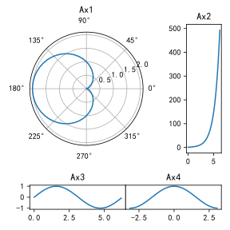
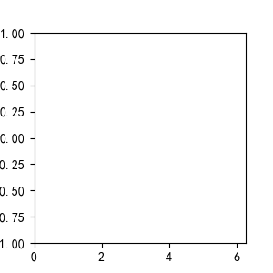

# Matplotlib 笔记
> 基于 Matplotlib 版本 3.8.0

## 基本使用
### 基本使用
一般情况下, 调用 Matplot.pyplot 用于绘图, 并采通常采用别名 `plt`  
并且 Matplotlib 还会配合 Numpy 使用

```python
import numpy as np
import matplotlib.pyplot as plt 

x = np.arange(0, 2 * np.pi, 0.1)
y = np.sin(x)

fig = plt.figure()
axe = fig.subplots(1, 1) 
axe.plot(x, y)
```

### 画布元素


对于一张画布上, 共有如图所示的多个元素
|类名|名称(非官方)|创建/设置|
|--|--|--|
|`Figure`|画布|`fig = plt.figure()`|
|`Axe`|图像|`axes = fig.subplots(...)`|
|`Line`|曲线|`axe.plot(x, y)`|
|`Markers`|标记点|`axe.scatter(x, y, s)`|
|`Axis`|坐标轴|`axis = axe.xaxis/yaxis`|
|`Tick`|刻度|`axis.set_ticks()`|
|`Grid`|网格|`axe.grid(...)`|
|`Spine`||`plt.spine`|

## 图像 Axe
### 基本操作
#### 设置坐标轴名称

#### 设置标题名称

#### 设置图例

#### 图形边距
`Axes.margins()`

#### 图像背景颜色
`Axes.patch.set_facecolor()`

### 坐标轴 Axis
#### 双坐标轴图
`Axes.twinx/y()`

#### 设置轴比例
`Axis.set_xscale(value, **kwargs)/set_yscale(value, **kwargs)`
可以用于设置坐标轴刻度间隔的比例模式  

* 参数 `value` 为模式名称
    * `"linear"` 线性模式, 刻度间隔与刻度值成正比
    * `"log"` 对数模式, 刻度间隔与刻度两端值的比值成正比
    * `"symlog"` 对称对数模式
    * `"function"` 自定义, 见官方文档
* 参数 `**kwargs` 根据不同的模式而改变, 见[文档说明](https://matplotlib.org/stable/api/_as_gen/matplotlib.pyplot.xscale.html#matplotlib.pyplot.xscale)
    * eg. `log` 模式下, 有参数 `base` 设置底数, `subs` 设置子刻度 
* [示例](https://matplotlib.org/stable/gallery/scales/scales.html#sphx-glr-gallery-scales-scales-py)

#### 设置横纵坐标轴比例 (图像比例)
`Axes.set_aspect()`  

#### 显示/关闭轴线
`Axis.set_visible(b)`
用于显示关闭轴线  
当轴线不显示时, 包括轴标签, 刻度在内的元素都不会显示

* 参数 `b` 为是否显示轴, 当为 `False` 时, 轴隐藏, 但图像边界 `spine` 不会隐藏

### 刻度 Tick
#### 设置坐标轴刻度与标签
`Axis.set_ticks(ticks, label = None, is_minor = False)`
用于设置刻度与子刻度的位置以及刻度

* 参数 `ticks` 为刻度值数组  
传入空数组 `[]` 可以不显示 / 隐藏刻度
* 参数 `label` 为刻度标签数组  
通常情况数组长度必须与 `ticks` 相同, 或为 `None` (自动生成)  
传入空数组 `[]` 可以不显示 / 隐藏标签
* 参数 `is_minor` 为是否设置子刻度, 默认设置刻度

#### 设置刻度显示
`Axis.set_tick_params(which, direction, labelsize, labelcolor, labelrotation)`
用于设置刻度 (见文档), 及其标签的显示  
该函数也可用于设置网格

* 参数 `which` 为被设置的刻度, 可取值 `{'major', 'minor', 'both'}`
* 参数 `direction` 为刻度方向, 可取值 `{'in', 'out', 'inout'}`
* 参数 `labelsize` 为刻度标签大小
* 参数 `labelcolor` 为刻度标签颜色
* 参数 `labelrotation` 为刻度旋转角度

#### 显示/关闭子刻度
`Axe.minorticks_on/off()`
可用于设置子刻度的开关  
当调用 `Axe.minorticks_on()` 后, 所有子刻度线都将开启  
当子刻度开启后, 还需要使用 `Axis.set_ticks(..., minor = True)` 设置才能显示子刻度  
应最后调用此函数, 保证设置生效

#### 获取刻度标签元素 (高级刻度显示)
`Axis.get_ticklabels`

#### 示例 : 以 2 为底的对数坐标轴
注意, 通过[set_xscale](#设置轴比例)可以更简单达到示例效果, 此处仅用于演示

```python
import matplotlib.pyplot as plt
import numpy as np

x = np.logspace(0, 10, 100, base = 2)
y = np.log2(x) ** 2

fig = plt.figure()
axe = fig.subplots()
axe.plot(x, y)

# 将刻度长度设为对数模式
axe.set_xscale('log')

# 默认为以 10 为底, 通过设置刻度位置, 改为以 2 为底
ticks = np.logspace(0, 10, 6, base = 2)

# 使用推导式快速生成刻度名称
axe.xaxis.set_ticks(
    ticks = ticks,
    labels = ['$2^{{{num:.1f}}}$'.format(num = np.log2(it)) 
     for it in ticks
     ])

# 使用推导式快速生成子刻度
axe.xaxis.set_ticks(ticks = 
    [(ticks[it // 4 + 1] / 4) * (it % 4) 
    for it in np.arange((ticks.size - 1) * 4) 
    if it % 4 != 0
    ], 
    # 传入空数组, 以隐藏子刻度标签
    labels = [],
    minor = True)

# 迭代刻度标签元素, 进行高级设置
for it in axe.xaxis.get_ticklabels(minor = False): 
    # 通过标签的 Text 元素来设置标签样式
    it.set(rotation=45, ha="center", rotation_mode="anchor")

fig.savefig("matplotlib_log2tick.svg")

```

绘图结果  


### 网格 Grid
#### 显示网格
`Axes.grid(visible = None, which = 'major', axis = 'both')`

#### 设置网格样式
`Axis.set_tick_params(which, grid_color, grid_alpha, grid_linewidth, grid_linestyle)`

### 边框 Spine

## 画布 Figure
### 基本操作
#### 创建画布
`fig = plt.figure(figsize = (6, 8), dpi = 100, facecolor = 'white', layout)`  
用于创建画布

* 参数 `figsize` 为画布大小  
使用元组 `(w, h)` 分别表示长与宽  
对应设置 `fig.set_size_inches(w, h)`
* 参数 `dpi` 为画布分辨率  
默认情况下长度参数 (如画布大小) 对应的实际像素为 参数大小乘以分辨率    
对应设置 `fig.set_dpi(val = 100)`
* 参数 `facecolor` 为画布颜色
* 参数 `layout` 为画布内的图像布局方式, 取值为 `{'constrained', 'compressed', 'tight', 'none', LayoutEngine, None}`  
详见[基本布局](#基本布局-subplot)

#### 画布标题
`fig.suptitle(t, size)`
用于设置画布标题

* 参数 `t` 标题文字
* 参数 `size` 文字大小, 取值 

#### 输出画布
`fig.savefig(fname)`
保存画布

* 参数 `fname` 为保存图片的名称, 根据名称后缀自动确定格式  
支持 `.svg`, `.jpg`, `.png` 等格式 

### 基本布局
#### 设置布局方式
`fig.set_layout_engine(layout=None, **kwargs)`  
用于设置画布基本布局引擎

* 参数 `layout` 包含 `{'constrained', 'compressed', 'tight', 'none', LayoutEngine, None}`
    * 默认情况下为 `None`, 此时不进行布局处理, 可能会出现图像重叠
    * `constrained` 调整图像大小以防止图像间的元素重叠, 用于一般情况
    * `compressed` 与 `constrained` 算法相同, 但会移除图像间的多余空间, 用于网格图像
    * `tight` 调整图像参数以防止图像间的元素重叠
* 参数 `**kwargs` 为布局引擎设置, 具体见文档, 以下为常用的参数
    * 参数 `h_pad` 子图像在长度方向的内边距
    * 参数 `w_pad` 子图像在宽度方向的内边距
    * 参数 `hspace` 子图像在长度方向的外边距 (`tight` 模式无此参数)
    * 参数 `wspace` 子图像在宽度方向的外边距 (`tight` 模式无此参数)

#### 新建子图像
`axes = fig.subplots(nrows = 1, ncols = 1, *, sharex = False, sharey = False)`  
创建子图像, 并对子图像进行简单布局

* 参数 `nrows` 设置子图像行数
* 参数 `ncols` 设置子图像列数
* 参数 `sharex` 设置 x 轴在子图像之间是否共享 / 共享方式, 可选参数 `bool or {'none', 'all', 'row', 'col'}` 
* 参数 `sharey` 设置 y 轴在子图像之间是否共享 / 共享方式, 可选参数 `bool or {'none', 'all', 'row', 'col'}` 

#### 添加子图像
`axe = fig.add_subplot(nrows = 1, ncols = 1, index = 1, sharex = False, sharey = False, projection)`
通过逐个添加的方式创建子图像, 该方法与[fig.subplots](#新建子图像)冲突, 但可用于创建极坐标等图像

* 参数 `nrows` 设置子图像总行数
* 参数 `ncols` 设置子图像总列数
* 参数 `index` 被设置的子图像索引
* 参数 `sharex` 设置 x 轴在子图像之间是否共享 / 共享方式, 可选参数 `bool or {'none', 'all', 'row', 'col'}` 
* 参数 `sharey` 设置 y 轴在子图像之间是否共享 / 共享方式, 可选参数 `bool or {'none', 'all', 'row', 'col'}` 
* 参数 `projection` 为子图像类别, 如极坐标图, 可选择参数 `{None, 'aitoff', 'hammer', 'lambert', 'mollweide', 'polar', 'rectilinear', '3d', str}` 
    * `polar` 表示极坐标图
    * `rectilinear` 表示二维空间坐标图
    * `3d` 表示三维空间坐标图 (详见[三维图像绘制](#三维图像绘制))
    * 其余图像主要用于地理

#### 示例 : 九宫格图
```python
import matplotlib.pyplot as plt
import numpy as np 

# 子图像紧贴时, 最好使用大图幅
fig = plt.figure(figsize=(9, 9))
# 将内外边距均设置为 0, 实现子图像紧贴的效果
# 使用此语句可达到同样的效果 fig.set_layout_engine('tight', w_pad = 0, h_pad = 0)
fig.set_layout_engine('compressed', w_pad = 0, h_pad = 0, wspace = 0, hspace = 0)
fig.suptitle('$y=e^{st}$', size = 20)
# 设置子图像的 x 轴按 列共享, y 轴按行共享
axes = fig.subplots(3, 3, sharex = 'col', sharey = 'row')

t = np.arange(-10, 10, 0.01)
for i in range(3):
    for j in range(3):
        # 通过断言保持类型被编辑器识别
        axe : plt.Axes = axes[i, j]
        axe.plot(t, np.exp((0.6 * (1j * (i - 2)) + 0.1 * (j)) * t))
        # 通过 transform = axe.transAxes 设置, 使用相对坐标确定文本位置
        axe.text(0.2, 0.8, 's = {0} + {1}i'.format(0.1 * j, 0.6 * (i - 2)), 
                 transform = axe.transAxes)

        # 仅保留左下角的刻度
        if i != 2:
            axe.xaxis.set_visible(False)
        if j != 0:
            axe.yaxis.set_visible(False)

# 输出图像
fig.savefig('matplotlib_3x3subplot.svg')
```

输出图形


### 栅格布局 GridSpec
#### 创建栅格
`gs = fig.add_gridspec(nrows, ncols, wspace, hspace)`  
将画布根据栅格均分为几块区域

* 参数 `nrows` 栅格行数
* 参数 `rcols` 栅格列数
* 参数 `wspace` 栅格在宽度方向的外边距  
注意由于 `constrained` 布局还有内边距, 因此要实现相连图像的效果只能使用 `tight` 模式或不采用布局处理
* 参数 `hspace` 栅格在长度方向的外边距

#### 栅格划分比例设置
`gs.set_height/width_ratios([ratios])`
设置栅格各行/列的划分长度

* 参数 `ratios` 为一个数组, 表示各个栅格的相对长度, 将根据栅格占总长的比例划分实际长度

#### 直接创建子图像
`axes = fig.add_subplot([gs], projection)`  
在指定几个栅格上创建子图像

* 参数 `gs` 为栅格数组中的元素, 可通过选择器选择  
    * `gs[a, b]` 选择栅格 (a, b)
    * `gs[a:, b:c]` 选择 a 到下边界上所有行, 与 b 到 c - 1 列上的栅格
* 参数 `projection` 为子图像类别, 如极坐标图, 见[新建子图像](#新建子图像)说明

#### 创建子栅格
`sub_gs = gs[...]/sub_gs.subgridspec(nrows, ncols, wspace, hspace)`  
在指定几个栅格 (子栅格) 上创建子栅格

* 参数 `nrows` 子栅格行数
* 参数 `rcols` 子栅格列数
* 参数 `wspace` 子栅格在宽度方向的外边距  
注意由于 `constrained` 布局还有内边距, 因此要实现相连图像的效果只能使用 `tight` 模式或不采用布局处理
* 参数 `hspace` 子栅格在长度方向的外边距

#### 子栅格划分比例设置
`gs.set_height/width_ratios([ratios])`
设置栅格各行/列的划分长度

* 参数 `ratios` 为一个数组, 表示各个栅格的相对长度, 将根据栅格占总长的比例划分实际长度

#### 由子栅格创建子图像
`axes = sub_gs.subplots(sharex, sharey)`  
在各个子栅格上创建子图像  
子栅格上不能创建多个子图像, 而是将根据子栅格的划分一格自动放置一个子图像

* 参数 `sharex` 设置 x 轴在子图像之间是否共享 / 共享方式, 可选参数 `bool or {'none', 'all', 'row', 'col'}` 
* 参数 `sharey` 设置 y 轴在子图像之间是否共享 / 共享方式, 可选参数 `bool or {'none', 'all', 'row', 'col'}` 

#### 示例 : 复杂图像
```python
import matplotlib.pyplot as plt
import numpy as np

fig = plt.figure(figsize=(4, 4))
# 要保证 Ax3 与 Ax4 无间隔, 需要使用 tight 模式
fig.set_layout_engine('tight')

# 创建一个 3X3 的栅格
gs = fig.add_gridspec(3, 3)
# 设置栅格高度比例为 2:2:1
gs.set_height_ratios([2, 2, 1])

t = np.arange(0, 2 * np.pi, 0.1)

# 通过将栅格作为参数传入 fig.add_subplot 的方式在特定栅格上创建子图像
# ax1 占用 (0, 0)(0, 1)(1, 0)(1, 1) 四个栅格
# 通过设置 projection, ax1 为极坐标图
ax1 = fig.add_subplot(gs[0 : 2, 0 : 2], projection = 'polar')
ax1.set_title('Ax1')
ax1.plot(t, 1 - np.cos(t))

# ax2 占用 (0, 2)(1, 2) 两个个栅格
# 注意 0:2 仅能选取到 0, 1 两个元素 (不包含末尾)
ax2 = fig.add_subplot(gs[0 : 2, -1])
ax2.set_title('Ax2')
ax2.plot(t, np.exp(t))

# 在 (2, 0)(2, 1)(2, 2) 处的栅格的基础上建立 1X2 的子栅格
# 子栅格的间距依然可以设置
sub_gs = gs[-1, 0:].subgridspec(1, 2, wspace = 0)
# 子栅格上的子图像无法划分, 但依然可以设置共享坐标轴
axes = sub_gs.subplots(sharey = 'row')

axes[0].set_title('Ax3')
axes[0].plot(t, np.sin(t))

axes[1].set_title('Ax4')
axes[1].plot(t - np.pi, np.cos(t - np.pi))
axes[1].yaxis.set_visible(False)

fig.savefig("matplotlib_complex_layout.svg")
```

输出图形



### 标记 Label

## 图例
### 文字 text

### 箭头 arrow

### 直线 axline

## 图像
### 统计直方图

### 离散折线图

## 高级绘图
### 特殊图像绘制
### 三维图像绘制
#### 创建三维图像
推荐的三维图像创建代码如下

```python
import matplotlib.pyplot as plt
from mpl_toolkits.mplot3d import Axes3D

# 方法一
fig = plt.figure()
axe: Axes3D = fig.add_subplot(1, 1, 1, projection = '3d') # type: ignore

# 方法二
fig = plt.figure()
axe = Axes3D(fig, auto_add_to_figure=False)
fig.add_axes(axe)

# 建议在终端中运行, 以实现与三维图像的互动
plt.show()
```

#### 创建三维多边形
<https://stackoverflow.com/questions/4622057/plotting-3d-polygons>

### 动画绘制
参考自[文章](https://mp.weixin.qq.com/s?__biz=MzA3NTMzMjMyOA==&mid=2650929620&idx=1&sn=864a7c886f1bec26f005ed2cf557cf16)

使用类 [matplotlib.animation.FuncAnimation](https://matplotlib.org/stable/api/_as_gen/matplotlib.animation.FuncAnimation.html#matplotlib.animation.FuncAnimation) 实现动画效果

类构造函数主要参数
1. `fig` 
    * 类型 `Figure`
    * 用于绘制动画的画布
1. `func`
    * 类型 `callable(frame)`
    * 在回调函数 `func` 中绘制每一帧, 其中参数 `frame` 为当前动画帧数
1. `frames`
    * 类型 `int`
    * 动画的总帧数
1. `interval`
    * 类型 `int`
    * 每一帧持续时间 (单位毫秒)

主要成员函数
1. `FuncAnimation.save(filename)`  
    * 图像保存函数
    * 参数 `filename` 为图像的保存路径

使用注意
* 图像绘制函数 `func` 在绘制时
    1. 绘制前调用 `Axe.clear()` 函数, 清除上一帧的图像
    1. 调用 `Axe.set_xlim` 与 `Axe.set_ylim` 使图像显示区域保持一致

使用示例
```python
import numpy as np
import matplotlib.pyplot as plt
from matplotlib.animation import FuncAnimation

t = np.arange(0, 2 * np.pi, 0.05)
y = np.sin(t)

fig, axe = plt.subplots(1, 1, figsize = (3, 3))

def update(frame):
    axe.clear()
    axe.set_xlim([0, 2 * np.pi])
    axe.set_ylim([-1, 1])

    end = int(t.size * int(frame) / 80)
    axe.plot(t[0 : end], y[0 : end])

anime = FuncAnimation(
    fig = fig,
    func = update,
    frames = 80,
    interval = 50
)

anime.save('test.gif')
```
matplotlib_funcanimation
以上代码可生成动画



## 杂项
### 中文显示
> 参考文章 <https://zhuanlan.zhihu.com/p/52779214?from_voters_page=true>

1. 打开路径 `.../anaconda3/envs/[python 环境名]/Lib/site-packages/matplotlib/mpl-data`
1. 将 `simhei.ttf`, `arial.ttf` 放入路径下的 `fonts/ttf` 文件夹 (通常可在 `C:/windows/Fonts` 中找到)
1. 将路径下的 `matplotlibrc` 文件复制到 `C:\用户\[用户名]\.matplotlib\matplotlibrc` (Windows), `$HOME/.config/matplotlib/matplotlibrc` (Linux)
1. 打开复制后的文件
    1. `font.family` 删除该选项前的 `#`
    1. `font.sans-serif` 删除该选项前的 `#`, 在冒号后添加 `simhei`
    1. `axes.unicode_minus` 删除该选项前的 `#`, 将值改为 `False`

### 简单 Latex 显示
Matplotlib 可以绘制简单的行内 Latex (不支持宏包)

使用时注意
1. 需要转换的部分使用 `$...$` 包括
1. 由于反斜杠 `\` 也是字符串转义符, 因此需要使用双反斜杠, 或使用 `r'...'`, 不对字符串转义
1. 为了更好的分式显示效果, 最好使用 `\dfrac` 表示分式
1. 在配合 `str.format` 使用时, `{...}` 应改为 `{{...}}` 

使用示例
```python
fig = plt.figure()

fig.text(0, 0, '二次方程求根公式: $x=\\dfrac{-b\\sqrt{b^2-4ac}}{2a}$')
fig.text(0, 0, '$\\dfrac{{{num}}}{{x}}$'.format(num = 1))
```

