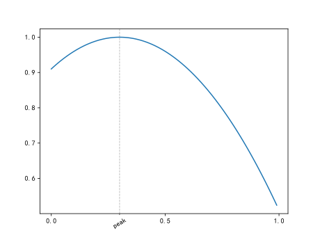
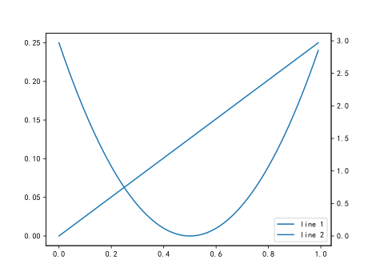

# Matplotlib 笔记
> 基于 Matplotlib 版本 3.8.0

## 画布与图像
在 Matplotlib 中
* 画布 Figure 对应了一块像素区域, 同时也作为容器包含了单个或多个图像  
* 图像 Axes 则管理了内容 Artist, 坐标轴 Axis, 边框 Spine, 标签 Label 等对象, 并在绘制阶段呈现在图像上

### 基本使用
#### 创建画布与图像
首先需要导入 Matplotlib 整体管理接口 (习惯上将其简写为 `plt`) `import matplotlib.pyplot as plt`

通过管理接口的方法 `plt.figure(*, figsize = (6, 8), dpi = 100, layout)`
* `figsize` 二元素元组, 表示画布大小
* `dpi` 整数, 表示画布分辨率, 实际画布像素值即分辨率乘以大小
* `layout` 字符串, 画布布局引擎, 可参见[图像布局引擎](#图像布局引擎)
* 允许一个程序创建多个画布

对于单图像的画布, 使用画布对象方法 `fig.add_subplot()` 即可创建图像  
如果一个画布上包含了多个图像, 参见[图像布局](#图像布局)

#### 显示画布
需要通过管理接口 `plt` 的方法显示画布  
有以下两种常用方法

将画布直接显示到窗口中
`plt.show(block = True)` 
* `block` 是否阻塞程序, 直到窗口关闭
    * 如果不阻塞, 则要保证以一个主循环不断运行此函数, 用于需要交互的情况
* 如果有管理多个画布, 则将显示多个窗口
* 在此方法中画布的大小设置不起作用

将画布保存到文件中  
`fig / plt.savefig(fname)`
* `fname` 字符串, 保存文件名, 通过后缀确定文件类型, 支持 `.png`, `.svg` 等
* 对于多画布的情况, 建议通过画布对象调用

#### 画布类与图像类
一般不直接访问画布类与图像类, 仅用于 TypeHint
* 导入画布类 `from matplotlib.figure import Figure`
* 导入图像类 `from matplotlib.axes import Axes`

### 图像布局
此处主要介绍的为栅格布局, 即将画布划分为指定行列的栅格  
通过指定图像占据的栅格区域, 确定子图像的位置

#### 简单栅格布局
创建绝大多数的简单栅格布局  
`axes = fig.subplot_mosaic(mosaic, *, sharex = False, sharey = False, width_ratios = None, height_ratios = None)`
* `mosaic` 字符串, 通过字符串表示栅格行列, 各子图像占据栅格位置等信息
    * 使用单个字符表示子图像标签, 一般为大写字母或数字
    * 当一个子图像占据多个栅格时, 体现为同一个标签重复出现
    * 使用字符 `.` 表示该栅格不用于放置子图像
    * 字符串具有 `r` 行 `c` 列的字符, 其中使用字符 `;` 可表示换行, 或使用[多行字符串](../base/base.md#字符串表示)
* `width_ratios` 等于栅格列数的浮点数数组, 表明各列宽度比例 (默认全相等)
* `height_ratios` 等于栅格行数的浮点数数组, 含义类似 `width_ratios`
* `sharex, sharey` 布尔值, 栅格间是否共享 x, y 轴
* 返回值为一个以字符串为键名, 以对应图像对象 `Axes` 为键值的字典

#### 创建栅格
创建栅格对象 `gs` `gs = fig.add_gridspec(nrows, ncols, **kwargs)` 
* `nrows` 栅格行数
* `rcols` 栅格列数
* `**kwargs` 栅格设置, 具体见下

常用的栅格设置有
* `wspace` 浮点数, 每个栅格在宽度方向的外边距  
* `hspace` 浮点数, 每个栅格在长度方向的外边距
* `width_ratios, height_ratios` 栅格比例, 具体含义见[简单栅格布局](#简单栅格布局)

#### 通过栅格创建子图像
在指定的栅格区域上创建子图像 `axe = fig.add_subplot(pos = None, **kwargs)`  
* `pos` 子图像占据的栅格区域, 通过栅格对象 `gs` 的 `[a, b]` 运算实现  
    * `a, b` 对应栅格的行与列索引, 从 `0` 开始
    * 当传入单个数值时, 则索引单个栅格
    * 支持 `b:e` 索引多个栅格实现跨栅格的子图像, 从索引 `b` 开始, 不包含 `e`
    * 当传入 `None` 时, 表明将整个图像区域都用于单个图像
* `**kwargs` 子图像设置, 具体见下
* 返回值即子图像对象

常用的子图像设置有
* `projection = "rectilinear"` 传入字符串, 表示子图像类别, 如极坐标图, 常用的有
    * `polar` 表示极坐标图
    * `rectilinear` 表示二维空间坐标图
    * `3d` 表示三维空间坐标图
    * 其余图像主要用于地理
* `sharex` 共用 x 轴的图像, 传入位于同列的子图像对象
* `sharey` 共用 y 轴的图像, 传入位于同行的子图像对象

除了创建子图像, 还可以创建子画布  
`axe = fig.add_subfigure(subplotspec = None)`
* `subplotspec` 子画布占据的栅格区域, 具体使用同上
* 主要用于[彩色条](#彩色条)等特殊的图像组合布局使用

#### 子栅格图像
如果需要实现非比例的子图像排版, 可通过在已有的栅格区域下划分子栅格实现

在指定栅格区域或子栅格上创建子栅格 `sub_gs = gs[...]/sub_gs.subgridspec(nrows, ncols, **kwargs)` 
* `nrows` 子栅格行数
* `rcols` 子栅格列数
* `**kwargs` 子栅格设置, 含义与[创建栅格](#创建栅格)中的参数相同

与栅格不同, 子栅格只能以一个栅格放置一个图像, 且使用以下函数  
基于子栅格创建图像 `sub_gs.subplots(**kwargs)`
* `**kwargs` 子图像设置, 含义与[通过栅格创建子图像](#通过栅格创建子图像)中的参数相同

#### 图像布局引擎
虽然栅格确定了子图像的位置, 但子图像间的边距等参数还需要使用布局引擎确定

设置子图像布局引擎 `fig.set_layout_engine(layout = None, **kwargs)` 
* `layout` 使用的布局引擎, 传入 `None` 表示不布局, 其他使用字符串
    * 默认情况下为 `None`, 此时不进行布局处理, 可能会出现图像重叠
    * `constrained` 调整图像大小以防止图像间的元素重叠, 用于一般情况
    * `compressed` 与 `constrained` 算法相同, 但会移除图像间的多余空间
    * `tight` 调整图像参数以防止图像间的元素重叠
* `**kwargs` 布局引擎设置, 具体见文档, 以下为常用的参数
    * 参数 `h_pad` 子图像在长度方向的内边距
    * 参数 `w_pad` 子图像在宽度方向的内边距
    * 参数 `hspace` 子图像在长度方向的外边距 (`tight` 模式无此参数)
    * 参数 `wspace` 子图像在宽度方向的外边距 (`tight` 模式无此参数)

### 曲线图例
在 Matplotlib, 称图例为 Legend

使用 `axe.legend()` 为图像创建图例  
更多参见 <https://matplotlib.org/stable/users/explain/axes/legend_guide.html#legend-guide>

#### 创建图例
* 基本图例设置 `axe.legend(labels)`
    * `labels` 字符串列表, 依据图像定义顺序确定曲线图例标签
* 显示指定图像的图例 `axe.legend(handles = None, labels = None)`
    * `handles` 曲线对象 (Line) 列表, 仅显示列表中的曲线对象的图例, 传入 `None` 时则显示全部图像的图例
    * `labels` 字符串列表, 含义同上, 但当传入 `None` 时, 将通过定义曲线对象时的设置参数 `label` 确定图像的图例标签
    * 注意, `axe.plot` 的返回值为曲线对象列表, 因此接收单条曲线的曲线对象时应使用[序列解包语法](../base/base.md#序列类型), 如 `l, = axe.plot(x, y, label = ...)`, 可参见[此处示例](#双-xy-轴)

#### 图例设置
* `loc = "best"` 字符串, 表示图例的位置, 常用的有
    * `best` 自动确定最佳位置
    * `[upper / lower] right / left` 位于图像右侧或左侧, 前缀确定为上侧或下侧
* `ncols = 1` 整数, 表示图例的列数
* `title = None` 字符串, 图例标题

### 图像坐标
更多参见 <https://matplotlib.org/stable/users/explain/axes/axes_ticks.html#locators-and-formatters>

#### 坐标刻度
使用函数 `axe.set_xticks(ticks, labels = None, *, minor = False)` 手动创建坐标刻度
* `ticks` 一维浮点数数组, 表示指定的刻度值, 传入空数组 `[]` 时将关闭图像刻度
* `labels` 一维浮点数或字符串数组, 表示刻度标签
* `minor` 布尔值, 传入 `True` 是表示使用次函数设置子刻度, 否则表示设置主刻度
* 对于 y 轴类似的有 `axe.set_yticks()`
* 注意, 当主刻度与子刻度重合时, 子刻度将被忽略

除了手动创建刻度, 还可使用以下设置方法, 通过刻度样式设置  
* 首先需要导入刻度样式模块 `from matplotlib import ticker`
* 模块中有如下常用的刻度定位样式
    * `loc = ticker.MultipleLocator(base = 1.0)` 使用指定间隔的刻度
    * `loc = ticker.LinearLocator(numticks = 11)` 根据指定的刻度数分配间隔
    * `loc = ticker.FixedLocator(locs)` 使用指定的位置作为刻度位置
    * `loc = ticker.AutoMinorLocator()` 自动设置子刻度 (用于需要生成子刻度但对刻度没有要求时使用)
* 模块中有如下常用的刻度标签样式
    * `fmt = ticker.StrMethodFormatter(fmt)` 将原始刻度值 (浮点数) 以名称 `x` 传入指定的[格式化字符串](../base/base.md#字符串格式化表示方法)格式化作为刻度标签, 如 `{x:.3f}%`
    * `fmt = ticker.FixedFormatter(seq)` 使用指定的标签作为刻度标签
* 为了使刻度样式生效, 还需要通过图像对象下的刻度对象 `axe.xaxis` (y 轴类似有 `axe.yaxis`) 的方法进行设置
    * `axis.set_major_locator(loc)` 设置主刻度定位 (子刻度有 `axis.set_minor_locator(loc)`)
    * `axis.set_major_formatter(fmt)` 设置主刻度定位 (子刻度有 `axis.set_minor_formatter(fmt)`)
    * 对于对数轴等特殊刻度, 建议通过[坐标尺度](#坐标尺度)设置

#### 坐标网格
使用函数 `axe.grid(visible, which = "major", **kwargs)` 设置坐标网格
* `visible` 布尔值, 设置坐标网格是否可见
* `which` 字符串, 坐标网格基于刻度, 可选择 `major`, `minor`, `both`
* `kwargs` 直线样式相关参数, 可参见[曲线样式](#曲线样式)
* 如果需要单独设置 x, y 轴的网格 (体现为刻度线的延长线), 需要单独调用刻度对象的同名方法, 如 `axe.xaxis.grid(True)`

利用子刻度与网格实现类似水平线的效果 (仅用于示例, 更推荐使用[辅助直线](#辅助直线)实现相同效果)
```python
from matplotlib import ticker
import numpy as np
import matplotlib.pyplot as plt

fig = plt.figure()
axe = fig.add_subplot()
t = np.arange(0, 1, 0.01)

l1, = axe.plot(t, (t - 0.3) ** 2, color = 'C0')

axe.xaxis.set_major_locator(ticker.MultipleLocator(0.5))
axe.set_xticks([0.3], ["peak"], minor = True)
axe.xaxis.grid(True, 'minor', linestyle = '--')

axe.tick_params('x', which = 'minor', labelrotation = 30)

plt.show()
```

代码运行效果  



#### 刻度样式
使用函数 `axe.tick_params(axis = "both", *, which = "major", **kwargs)` 设置刻度样式
* `axis` 字符串, 设置样式的轴, 可选择 `x`, `y`, `both`
* `which` 字符串, 设置样式的刻度, 可选择 `major`, `minor`, `both`
* `kwargs` 刻度样式相关参数, 具体见下介绍

对于刻度样式参数, 常用的有
* `direction = "out"` 字符串, 刻度是否直线图像内, 可选择 `in`, `out`, `both`
* `labelsize` 浮点数, 刻度标签的字体大小
* `labelcolor` [颜色样式](#颜色样式), 标签颜色
* `labelrotation` 浮点数, 刻度标签的旋转角度, 单位为度

#### 坐标尺度
使用函数 `axe.set_xscale(value = "linear")` 设置 x 坐标尺度
* `value` 坐标尺度类型, 使用字符串表示常用有
    * `linear` 线性坐标尺度, 每个刻度值间隔相同 (关于设置间隔参见[坐标刻度](#坐标刻度))
    * `log` 对数坐标尺度, 每个刻度值间间隔相同比例, 有以下专用设置
        * `base = 10` 传入浮点数, 表示对数刻度的底数
        * `subs = None` 传入小于底数的浮点数列表, 表示子刻度, 体现为 `subs[i] * ticks`
    * `symlog` 对称对数尺度, 正负使用对数尺度, 在接近 0 的位置使用线性尺度, 有以下专用设置
        * `base, subs` 与对数坐标尺度含义相同
        * `linthresh = 2` 线性区域范围, 在该区域内将使用线性尺度
        * `linscale = 1` 线性区域相对对数区域一个刻度的比例
* 除了 `linear`, 其他样式都将自动设置刻度位置与标签
* 对于 y 轴类似的有 `axe.set_yscale(value = "linear")`

更多尺度与使用方法参见 <https://matplotlib.org/stable/api/_as_gen/matplotlib.axes.Axes.set_xscale.html#matplotlib.axes.Axes.set_xscale>

#### 双 x/y 轴
* 创建一个具有双 y 轴的图像 `atx = axe.twinx()`
* 创建一个具有双 x 轴的图像 `aty = axe.twinx()`
* 函数返回值同样为一个图像对象 (Axes), 但是建议仅调用该对象与绘图以及对应刻度设置有关的方法
* 双 x / y 轴图像中建议使用[指定图像图例](#曲线图例)的方式创建图例, 可参考如下示例

```python
import numpy as np
import matplotlib.pyplot as plt

fig = plt.figure()
axe = fig.add_subplot()
t = np.arange(0, 1, 0.01)
l1, = axe.plot(t, (t - 0.5) ** 2, label = "line 1")
axe2 = axe.twinx()
l2, = axe2.plot(t, 3 * t, label = "line 2")
axe.legend(handles = [l1, l2], loc = "lower right")

plt.show()
```

代码运行效果



### 图像其他设置
#### 图像分辨率与大小
使用 `axe.set_aspect(aspect)` 设置图像的分辨率 (图像长度与实际长度的比例)
* `aspect` 长宽比设置, 可以使用以下值
    * `auto` 自动选择 x, y 方向的分辨率
    * `equal` x, y 方向具有相同的分辨率
    * 浮点数, y 方向的分辨率为参数值乘以 x 方向的分辨率

使用 `axe.set_box_aspect(aspect = None)` 设置图像的长宽比
* `aspect` 传入浮点数表示图像长宽比, 传入 `None` 将自动设置

#### 坐标范围
更多参见 <https://matplotlib.org/stable/users/explain/axes/autoscale.html>
* 设置 x 坐标范围 `axe.set_xlim(left = None, right = None)`
* 设置 y 坐标范围 `axe.set_ylim(left = None, right = None)`
* 基于图像内容设置坐标范围 `axe.margins(*margins = (0.05, 0.05))`
    * 传入单个参数时, 将自动设置坐标范围, 使图像内容与边框间的空隙占整个边框长度为指定的比例
    * 传入多个参数时, 将分别设置 x, y, z 轴的空隙占比
    * 允许传入负数, 此时将体现为显示局部的图像内容

#### 设置轴标签
* 设置图像的 X 轴标签 `axe.set_xlabel(xlabel)`
* 设置图像的 Y 轴标签 `axe.set_ylabel(ylabel)`
* 设置画布的 X 轴标签 `fig.supxlabel(xlabel)`
* 设置画布的 Y 轴标签 `fig.supylabel(ylabel)`

#### 设置图像与画布标题
* 设置图像的标题 `axe.set_title(label)`
* 设置图像的 Y 轴标签 `axe.suptitle(t)`

## 基本二维图像
### 平面曲线图像
#### 基本曲线

#### 离散曲线

#### 填充区域

### 平面散点图像
#### 基本散点图

#### 矢量场图

### 平面网格图像
#### 等高线图

#### 分层设色图

#### 一般图片

### 平面统计图像
#### 直方图

#### 饼图

#### 误差盒

### 三维图像
#### 创建三维图像

#### 三维曲线

#### 三维曲面

#### 三维散点图像

### 样式设置
#### 颜色样式
参见 <https://matplotlib.org/stable/users/explain/colors/colors.html#cn-color-selection>

在 Matplotlib 中, 一般使用浮点数, 元组, 字符串表示颜色样式, 常用的有 (其他见上述参考链接)
* 预设颜色序列, 使用字符串 `C0` 到 `C9` 表示, 无特殊需求推荐使用此方法
* 灰度颜色, 使用 `[0, 1]` 的浮点数表示灰度颜色, 用于黑白打印
* RGB 元组, 使用三元素元组表示 RGB 颜色 `(R, G, B)`, 颜色值取值范围为 `[0, 1]`
* 标准颜色, 使用单个字符表示标准颜色, 如 `b` 表示蓝色, `g` 表示绿色, `k` 表示黑色
* 无颜色, 使用空值 `None` 表示

对于图像与标记, 通常都有以下参数用于设置颜色
* `color` 设置图像 / 标记主要部分的颜色
* `cmap` 设置色彩映射, 参见[官网介绍](https://matplotlib.org/stable/gallery/color/colormap_reference.html)
* `alpha` 设置透明度, 取值范围为 `[0, 1]`, 越小越透明

#### 标记点样式
参见 <https://matplotlib.org/stable/gallery/lines_bars_and_markers/marker_reference.html>

对于标记点, 通常有以下参数用于设置其
* `marker` 标记点样式, 使用字符串表示, 常用的有:  
`o` 圆形标记, `x` 交叉标记, `D` 菱形标记, `v` 倒三角标记, `s` 正方形标记, `none` 无标记
* `markersize` 标记大小, 传入整数
* `markerfacecolor` 标记填充颜色, 传入[颜色样式](#颜色样式)
* `markeredgecolor` 标记边缘颜色, 传入[颜色样式](#颜色样式)

#### 线条样式
参见 <https://matplotlib.org/stable/gallery/lines_bars_and_markers/linestyles.html#linestyles>

对于线条样式, 通常有以下参数用于设置
* `linestyle` 线条样式, 使用字符串表示, 常用的有:  
`-` 实线, `--` 虚线, `-.` 点划线, `:` 点线, `none` 无线条
* `linewidth` 线条跨度, 传入整数

## 标记绘制
### 平面物件
#### 取值强调

#### 辅助直线

#### 彩色条

### 文字标记
参考 <https://matplotlib.org/stable/api/_as_gen/matplotlib.axes.Axes.annotate.html#matplotlib.axes.Axes.annotate>

#### 标记绘制函数

`zorder`

#### 箭头样式
<https://matplotlib.org/stable/users/explain/text/annotations.html#annotating-with-arrows>

#### 文本边框
<https://matplotlib.org/stable/users/explain/text/annotations.html#annotating-with-boxed-text>

#### 其他样式设置
坐标参考  
<https://matplotlib.org/stable/users/explain/text/annotations.html#coordinate-systems-for-annotations>
* `axes fraction`
* `data`

对齐方向  
<https://matplotlib.org/stable/gallery/text_labels_and_annotations/text_alignment.html>

### 多边形
#### 平面多边形

#### 三维多边形

## 其他使用说明
### 使用 Latex
Matplotlib 可以绘制简单的行内 Latex (不支持宏包)  
可以实现希腊字母, 上下标, 简单数学符号的绘制

使用时注意
1. 需要转换的部分使用 `$...$` 包括
1. 由于反斜杠 `\` 也是字符串转义符, 因此需要使用双反斜杠, 或使用 `r'...'`, 不对字符串转义
1. 为了更好的分式显示效果, 最好使用 `\dfrac` 表示分式
1. 在配合 `str.format` 使用时, `{...}` 应改为 `{{...}}` 

### 使用中文
默认情况下 Matplotlib 不支持中文, 需要进行以下设置

1. 打开模块资源文件夹 `.../anaconda3/envs/[python 环境名]/Lib/site-packages/matplotlib/mpl-data` (或 `miniconda3`)
1. 将中文黑体如[思源黑体](https://github.com/adobe-fonts/source-han-sans/releases/tag/2.004R)并安装或放置在特定字体文件夹 (对后缀无要求, 最好使用新字体)
1. 打开模块设置文件夹
    * `C:\用户\[用户名]\.matplotlib\matplotlibrc` (Windows)
    * `$HOME/.config/matplotlib/matplotlibrc` (Linux)
1. 打开模块设置文件夹下的 `fontlist-v330.json`, 并在键 `ttflist` 下的数组中添加如下方代码所示的结构体
    * 将键 `fname` 的值改为字体路径, Windows 下安装字体后一般位于文件夹 `C:\\Windows\\Fonts`
    * 将键 `name` 的值改为字体名称, 一般输入文件名即可
1. 将模块资源文件夹下的 `matplotlibrc` 文件复制到模块设置文件夹并打开复制后的文件, 进行以下修改
    1. `font.family` 删除该选项前的 `#`
    1. `font.sans-serif` 删除该选项前的 `#`, 在冒号后添加之前添加结构体中键 `name` 的值

结构体示例
```json
{
    "fname": "Path\\to\\font\\XXX.ttf",
    "name": "XXX",
    "style": "normal",
    "variant": "normal",
    "weight": 400,
    "stretch": "normal",
    "size": "scalable",
    "__class__": "FontEntry"
}
```

### 动画绘制
