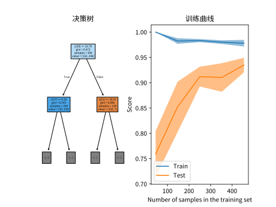
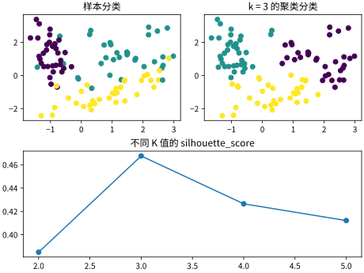
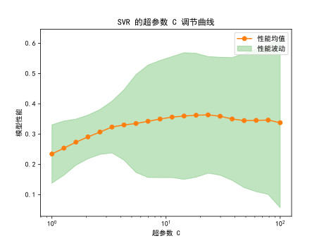

# 机器学习
## Scikit-Learn 模型特点
在 Scikit-Learn 模块中, 统一使用模型对象标识不同的模型, 并且模型对象均具有以下两个成员函数用于训练与预测模型

训练模型 `model.fit(X, y, sample_weight = None)` 
* `X` 大小为 `(samples, features)` 的二维训练样本特征数组, 即每行对应一条样本, 每列对应一个样本特征
* `y` 大小为 `(samples)` 的一维训练样本属性数组, 一般传入整数, 表示对应训练样本的分类标签或回归属性 (对于多分类或多目标回归模型有大小 `(samples, targets)`)
* `sample_weight` 大小为 `(samples)` 的一维数组或 `None`, 表示对应样本的权重
* 重复训练将覆盖之前的训练参数

模型预测 `C = model.predict(X)`
* `X` 预测样本特征数组, 类似训练特征
* `C` 模型预测得到的分类标签或回归属性数组
* 模型仅有在被训练后才能用于预测

分类概率预测 `T = model.predict_proba(X)`
* `X` 预测样本特征数组, 类似训练特征
* `T` 大小为 `(samples, classes)` 的数组, 即直接输出模型预测各个分类的概率
* 该方法为大部分分类模型如[分类回归](#其他线性回归模型), [决策树](#决策树模型)特有的一种预测函数, 用于[集成学习](#集成学习)的软投票
* 对于[支持向量分类](#支持向量分类使用)等不能直接输出分类概率的模型, 需要启用超参数 `probability = True` 才能支持此函数

## 线性回归模型
参见 <https://scikit-learn.org/stable/modules/linear_model.html#regression>  

线性回归模型相关模块 `from sklearn import linear_model`

线性回归模型是用于回归 (Regression) 问题的一类模型, 在此类问题中样本的属性为一个连续值

线性回归一般只能解决低维的, 具有明显线性关系的回归问题

### 线性回归模型原理
假设每个样本均使用固定几个特征进行描述, 则可以使用一个向量 $\vec{x}$ 表示一条样本  

线性回归模型中假定样本的特征与属性之间满足以下线性关系
$$y=\vec{w}^{T}\vec{x}+b$$

其中参数 $\vec{w}$ 为系数向量, $b$ 为偏置, 通过最小二乘法或梯度下降法训练模型得到以上两个参数

### 线性回归模型的基本使用
创建线性回归模型  
`reg = linear_model.LinearRegression(*, fit_intercept = True, positive = False)`
* `fit_intercept` 是否包含截距项
* `positive` 是否要求模型输出一定为正

获取模型参数
* `reg.coef_` 获取模型系数矩阵, 为 `(features)` 的一维数组
* `reg.intercept_` 获取模型截距矩阵, 为浮点数

如果要将线性回归模型用于拟合非线性的数据, 可使用[数据流水线](#数据流水线)将输入特征进行相乘组合 (`PolynomialFeatures`) 得到更多维的特征

### 其他线性回归模型
正则化的线性回归  
在正则化线性回归中, 在均方差损失函数的基础上加入了关于权重系数的惩罚函数有
$$J=\begin{Vmatrix}(\vec{w}^T\vec{x}+b)-y\end{Vmatrix}^2+\alpha G(\vec{w})$$

* 岭回归 `linear_model.Ridge`, 以 L2 范数为惩罚函数 $G(\vec{w})=\begin{Vmatrix}\vec{w}\end{Vmatrix}_2^2$ 使每个系数尽可能小且均能发挥作用以避免过拟合, 称为 L2 正则化
* Lasso 回归 `linear_model.Lasso`, 类似岭回归, 以 L1 范数为惩罚函数 $G(\vec{w})=\begin{Vmatrix}\vec{w}\end{Vmatrix}_1$ , 能产生稀疏的系数矩阵
* 弹性网络回归 `linear_model.ElasticNet` 结合了 L1, L2 两种正则化方式的回归, 对于多属性问题有专用模型 `linear_model.MultiTaskElasticNet`

将回归模型用于二分类  
* 逻辑回归 `linear_model.LogisticRegression`, 使用 $y=\operatorname{sigmoid}(\vec{w}^T\vec{x}+b)$ 代替一般回归, 可用分类问题

关于其他回归模型的介绍见 <https://mp.weixin.qq.com/s/mr83EK24S94b_UUlecyqlA>

## 支持向量机
参见 <https://scikit-learn.org/stable/modules/svm.html#svm>

支持向量机相关模块 `from sklearn import svm`

支持向量机能较好地应用于高维 (多特征样本) 的分类 (Classification), 回归, 异常检测问题, 且预测效率较高  

但要求有足够的训练样本, 至少应远多于样本特征

### 支持向量机原理
支持向量机分类中, 通过训练样本确定各个之间的最佳边界, 预测时仅需确定样本所在分解位置即可得到样本分类

支持向量机回归中, 通过训练样本确定一个能最好包容训练样本的管道, 以管道中心曲线作为回归结果

支持向量机问题改进
* 对于非线性问题, 支持向量机通过核函数重定义两个向量点乘实现向量升维以解决非线性 (默认核函数只能产生线性的边界)
* 对于离群点问题 (两个样本之间混杂), 支持向量机通过引入松弛变量, 允许划分边界存在误差

### 支持向量分类使用
创建非线性支持向量分类模型  
`svc = svm.SVC(*, C = 1, kernel = "rbf", probability = False)`
* `kernel` 核函数, 使用字符串表示, 常用的有
    * `rbf` 高斯核函数 (径向基核函数), 能升维至无穷, 常用于训练样本较少的非线性问题
    * `poly` 多项式核函数, 能进行有限升维, 常用于处理低维简单数据
    * 线性核函数, 建议使用专门的模型 `svm.LinearSVC`
    * 关于不同核函数的效果可参见[官网例程](https://scikit-learn.org/stable/auto_examples/svm/plot_iris_svc.html#sphx-glr-auto-examples-svm-plot-iris-svc-py)
* `gamma` 核函数系数
    * 取值越大单个样本的影响越小, 边界越复杂越容易过拟合
    * 可传入字符串 `scale`, 通过样本自动判断
* `C` 惩罚系数
    * 取值越大, 越不容许分类存在错误因此越容易过拟合, 越小则相反
    * 反比于正则化程度, 具体设置可参考[官网介绍](https://scikit-learn.org/stable/auto_examples/svm/plot_svm_scale_c.html#sphx-glr-auto-examples-svm-plot-svm-scale-c-py)
* `degree = 3` 多项式核函数的次数, 仅用于多项式核函数
* `probability` 通过训练多个 SVC 交叉验证, 从而使模型获得输出分类概率的能力, 但将降低训练速度

创建线性支持向量分类模型  
`svm.LinearSVC(*, C = 1, loss = 'squared_hinge')`
* `C` 惩罚系数, 含义同上
* `loss` 损失函数, 传入字符串表示
    * `squared_hinge` 默认损失函数
    * `hinge` 具有更好性能的 Hinge 损失函数 $\operatorname{Hinge}(t)=\max(0,1-t)$
* 虽然无法解决非线性问题, 但该模型经过特殊优化, 具有远超一般模型的性能
* 该模型用于特征极多 (不再需要升维), 训练样本极多且追求效率的问题

通常建议使用支持向量机时, 先使用[数据流水线](#数据流水线)将输入的数据标准化 (`StandardScaler`) 以得到更好的效果, 一般有代码
```python
from sklearn.svm import SVC
from sklearn.pipeline import Pipeline

rbf_kernel_svm_clf = Pipeline([
    ("scaler", StandardScaler()),
    ("svm_clf", SVC(kernel="rbf", gamma=5, C=0.001))])
rbf_kernel_svm_clf.fit(X, y)
```

### 支持向量回归使用
在支持向量回归中, 还需要给定超参数 $\varepsilon$ 以确定拟合管道的宽度  
* 当样本落在管道内时认为是正常回归误差, 对回归曲线没有影响
* 当样本在管道外时, 将影响回归曲线的形状, 成为支持向量
* 因此一般超参数 $\varepsilon$ 即允许的回归误差

创建非线性支持向量回归模型
`svc = svm.SVC(*, C = 1, kernel = "rbf", epsilon = 0.1)`
* `epsilon` 浮点数, 管道宽度超参数
* 其余参数含义与 [SVC](#支持向量分类使用) 相同

创建线性支持向量回归模型
`svc = svm.LinearSVC(*, C = 1, loss = 'squared_hinge', epsilon = 0.0)`
* `epsilon` 浮点数, 管道宽度超参数
* 其余参数含义与 [SVC](#支持向量分类使用) 相同

## 决策树模型
参见 <https://scikit-learn.org/stable/modules/tree.html#decision-trees>

决策树相关模块 `from sklearn import tree`

决策树同样能够用于分类与回归问题, 且具有特点
* 能够拟合复杂的数据集
* 样本特征数据几乎不需要任何预处理
* 具有较好的可解释性

### 决策树原理
决策树的基本原理即
* 决策树通过贪心算法 (CART 训练算法), 以特定指标 (超参数) 将样本以其中一个特征划分为类间区别最大, 类内区别最小的两份, 以此确定二叉树的一个节点  
* 通过转换划分特征, 不断二分划分样本即可得到一个二叉树结构
* 当样本无法再划分时, 将成为叶子节点, 通过剩余样本中类别做多的作为满足此条件时的样本类别
* 对于决策树回归, 即将叶子节点改为输出属性, 通过使剩余样本的均方根误差最小确定

根据其原理可知, 决策树也存在部分问题
* 决策树的划分边界通常都是正交的 (即分类边界或回归曲线呈折线形), 因此可能需要 [PCA](#数据预处理) 处理, 提取输入特征中的主成分
* 决策树必须要经过正则化处理 (限制树规模), 否则十分容易过拟合
* 根据算法不同决策树的形状可能不同, 如果要得到最优决策树可能需要较大的训练时间

### 决策树使用
创建决策树分类模型  
`tree.DecisionTreeClassifier(*, criterion = 'gini', max_depth = None, min_samples_split = 2, min_samples_leaf = 1, random_state = None)`
* `criterion` 字符串, 划分样本区别判别方法, 可用的有
    * `gini` 基于基尼不纯度划分 (一般使用此方法即可)
    * `entropy` 基于熵划分
* `random_state` 整数, 生成决策树的随机种子, 可确定此参数保证每次生成相同的决策树
* `max_depth` 决策树的最大深度, 不包括根节点 (增大时可提升非线性性), 过拟合时, 可设置一个较小值
* `min_samples_split` 一个划分中最小样本数, 传入整数时即样本数, 传入浮点数时表示相对总样本数的比值
* `min_samples_leaf` 一个叶子节点中剩余的最小样本数 (减小时可平滑边界), 通过该参数能够有效平滑决策树回归曲线, 同样可传入整数与浮点数 (含义同上)
* 其他正则化超参数见[官网介绍](https://scikit-learn.org/stable/modules/generated/sklearn.tree.DecisionTreeClassifier.html#decisiontreeclassifier), 实际使用时, 一般先不加约束的训练, 再根据决策树形状调整超参数

创建决策树回归模型  
`tree.DecisionTreeClassifier(*, criterion = 'squared_error', max_depth = None, min_samples_split = 2, min_samples_leaf = 1)`
* `criterion` 字符串, 划分样本区别判别方法, 常用的有
    * `squared_error` 基于均方误差划分
    * `friedman_mse` 基于 Friedman 不纯度划分
* `max_depth, min_samples_split, min_samples_leaf` 正则化超参数, 含义同决策树分类模型 

绘制决策树 (对于决策树的具体形状可通过以下函数绘制)  
`tree.plot_tree(decision_tree, *, max_depth = None, filled = False, ax = None)`
* `decision_tree` 被绘制的决策树模型, 需要经过训练
* `max_depth` 决策树绘制深度, 剩余部分将被忽略
* `filled` 是否用颜色填充节点
* `ax` 绘制决策树的图像对象
* 绘制的决策树中, 将通过方框分别表示
    * 节点的决策条件
    * 节点划分样本的区分程度
    * 节点输入的样本个数
    * 节点输入的样本中, 各种分类下的样本数 (当优势类别越显著, 方框颜色越深)

### 决策树调整
决策树模型的调整一般需要配合[学习曲线](#学习曲线)判断是否过拟合, 例如以下示例代码
* 当决策树中有样本量极小的叶子节点时, 可增大 `min_samples_leaf`
* 当决策树不完全时, 可适当减小 `max_depth`

```python
import matplotlib.pyplot as plt

from sklearn import datasets
from sklearn.model_selection import LearningCurveDisplay
from sklearn import tree
from sklearn.model_selection import train_test_split

fig = plt.figure()
axes = fig.subplot_mosaic("AB")

 导入数据
X, Y = datasets.load_breast_cancer(return_X_y = True)
trX, ttX, trY, ttY = train_test_split(X, Y, test_size = 0.3, random_state = 114514)

tree_cls = tree.DecisionTreeClassifier(max_depth = 5, min_samples_leaf = 0.01, random_state = 114514)
tree_cls.fit(trX, trY)
tree.plot_tree(tree_cls, ax = axes["A"], filled = True, max_depth = 1)
LearningCurveDisplay.from_estimator(tree_cls, X, Y, ax = axes["B"])

axes["A"].set_title("决策树")
axes["B"].set_title("训练曲线")

plt.show()
```

运行结果



## 集成学习
参见 <https://scikit-learn.org/stable/modules/ensemble.html>

集成学习相关模块 `from sklearn import ensemble`

在分类模型中  
理论上, 只要模型的性能优于随机选择, 且模型之间相互独立, 通过多个独立分类模型同时预测表决将显著提升模型的准确率

在回归模型类似, 但使用平均值等方法集成各个模型的结果

将这类继承了其他模型的模型, 成为集成学习

### 投票分类器
基本投票分类器 `VotingClassifier`   
即最基本的集成学习, 通过多个独立模型间投票决定最终输出
* 超参数 `estimators` 即一个以元组 `(name, estimator)` 为元素的数组, 体现投票器内的所有模型
* 超参数 `voting` 字符串, 反映了投票表决方法, 可以是以下值
    * `hard` 硬投票, 即得票多的类别作为最终结果
    * `soft` 软投票, 即根据模型预测的概率为投票权重, 有更高的准确率但要求模型有预测概率的能力, 即有方法 [predict_proba](#scikit-learn-模型特点)
* 类似的还有投票回归 `VotingRegressor`

### 自举汇聚法
自举汇聚法 (Bagging 方法) `BaggingClassifier`   
同样是投票分类, 但集成的模型相同, 只是分别随机采用部分训练样本来保证模型间的独立性
* 超参数 `estimators` 即投票器中的基本模型
* 超参数 `n_estimators` 整数, 即投票器中的模型数
* 超参数 `max_samples` 浮点数, 即训练时单个模型最多接收的训练样本占总样本的比例 (称为随即补丁法)
* 超参数 `max_features` 浮点数, 即训练单个模型时仅提取部分特征占总特征的比例 (一般仅用于图片等高维特征, 称为随机子空间法)
* 通常该方法训练产生的模型性能与单个模型相近, 但稳定性与泛化性将得到极大提升, 且可并行训练
* 类似的还有回归模型 `BaggingRegressor`

### 随机森林
随机森林 `RandomForestClassifier`  
* 即以[决策树](#决策树模型)为集成模型的[自举汇聚法](#自举汇聚法)
* 模型同时具有[决策树](#决策树模型)与[自举汇聚法](#自举汇聚法)的超参数 
    * 没有超参数 `max_samples`, 强制使用随机子空间法
    * 样本足够时, 模型数 `n_estimators` 可能达 100 个以上, 需要通过[网格搜索](#网格搜索)确定超参数
* 一般仅限制决策树的 `max_leaf_nodes` 超参数, 使集成的每个决策树具有尽可能多的多样性
* 由于决策树足够多, 因此对最优性没有特别高的要求, 但希望每个决策树都尽可能不同, 因此有变种极端随机森林 `ExtraTreesClassifier` (超参数相同, 一般需要交叉验证确定其与一般随机森林何者性能更好)
* 同样有随机森林回归 `RandomForestRegressor` 与极端随机森林回归 `ExtraTreesRegressor`
* 在模型训练后, 通过随机森林模型的成员 `feature_importances_` 还可以得到各个特征的重要性

### 自适应提升法
参见 <https://scikit-learn.org/stable/modules/ensemble.html#adaboost>

自适应提升法 `AdaBoostClassifier`  
与[自举汇聚法](#自举汇聚法)类似, 但是训练时各个模型之间呈串联关系, 即第一个模型训练后预测错误的样本将以更大的权重传入下一个模型训练
* 超参数 `estimators` 即投票器中的基本模型, 默认为单层 (`max_depth=1`) 的[决策树](#决策树模型)
* 超参数 `n_estimators` 整数, 即投票器中的模型数
* 超参数 `learning_rate` 浮点数, 传递错误样本的学习率
* 同样有用于回归问题的模型 `AdaBoostRegressor`
* 使用 AdaBoost 不容易出现过拟合问题, 但是需要的训练时间较长且无法并行训练

## K 均值聚类
参见 <https://scikit-learn.org/stable/modules/clustering.html#k-means>

聚类相关模块 `from sklearn import cluster`

K 均值聚类属于无监督学习模型, 能够将相似的样本分类到集群中  
聚类 (Clustering) 可用于数据分析, 数据预处理 (降维), 异常检测 (检测离群点), 半监督学习 (标签传播)

与一般监督学习不同
* 模型除了 `fit, predict` 方法, 还有 `fit_predict` 方法, 该方法接收特征数组 `X`, 训练结果的输出分类数组 `y`, 以此反应聚类结果
* 模型的 `fit` 方法将忽略属性数组 `y`, 仅训练确定集群特征 (集群中心点), 一般不使用
* 模型的 `predict` 方法将根据训练得到的集群特征确定输入样本属于哪个聚类

### K 均值聚类原理
K 均值聚类的基本原理为
* 首先需要确定样本的集群数 K 这一超参数
* 随机将 K 个样本定位集群中心, 并将离中心最近的样本标记为一个集群
* 计算各个集群的平均值, 作为新的集群中心并迭代
* 当集群中心不再移动时, 完成聚类

根据原理可得 K 均值聚类有特点
* 通过最终集群中心与集群中点距离的均方差衡量聚类效果, 成为惯性 (`scikit-learn` 中使用负惯性为指标, 越大越好)
* 选择不同的初始点将得到效果完全不同的结果, 一般使用 `K-Means++` 算法逐个选择相距较远的初始点, 保证得到最优解
* 此外, 集群数 K 的选择对最终效果也有较大的影响, 但惯性总是随 K 增大而减小, 因此一般
    * 首先绘制出 K 与惯性的曲线, 并找到其中的肘点 (两侧斜率快速变化点)
    * 改用轮廓分数 `silhouette_score` 作为评分标准, 绘制肘点附近 K 与轮廓分输的曲线, 以轮廓分输最高的作为采用的 K
* K 均值聚类虽然有很快的训练与预测速度, 但是对于椭圆形等异性分布的聚类效果较差, 应对特征进行[标准化](#数据预处理)或选择其他模型如 DBSCAN

### K 均值聚类应用
简单图像分割
* 将彩色图像每一像素视为一个三元素向量 (RGB) 样本
* 通过 K 均值聚类训练图像像素, 将各个像素分组聚类, 实现图像分割
* 读取 K 均值聚类训练的聚类中心, 体现了各个像素组的代表颜色
* 保留所需的代表颜色, 实现对图像特定区域的提取 (二值化), 再进行下一步处理

半监督学习 (标签传播)
* 对于所有样本, 目前仅提取了特征, 还没有对类别标记
* 首先使用 K 均值聚类对样本特征聚类 (通常聚类数远多于类别数)
* 对每个聚类中心进行人工标记, 从而确定聚类与类别之间的映射关系
* 通过这一映射关系, 传播到所有样本上, 完成对样本的标记
* 为了更高的准确性, 有时仅传播标记离中心最近的部分样本 (如最近的 20%), 舍弃其余样本
* 更多可参考专门的标签传播模型 <https://scikit-learn.org/stable/modules/semi_supervised.html>

### K 均值聚类使用示例
创建 K 均值聚类模型  
`cluster.KMeans(n_clusters = 8, random_state = None)`
* `n_clusters` 聚类集群数
* `random_state` 选择初始中心点的随机种子

创建小批量 K 均值聚类
`cluster.MiniBatchKMeans(n_clusters = 8, random_state = None)`
* `n_clusters` 聚类集群数
* `random_state` 选择初始中心点的随机种子
* 相比一般 K 均值聚类训练速度更快, 但模型性能较差, 用于 K 极大的情况如 `K>20`, 或样本特征维度极大的情况如图片

验证 K 均值聚类效果  
`silhouette_samples(X, labels)`
* `X` 样本特征数组
* `labels` 样本的聚类标签数组, 可通过模型的 [fit_predict](#k-均值聚类) 方法得到
* 返回值为一个浮点数, 越大聚类分类效果越好

### K 均值聚类使用示例
```python
import matplotlib.pyplot as plt
import numpy as np

from sklearn import datasets
from sklearn import cluster
from sklearn.metrics import silhouette_score

fig = plt.figure()
axes = fig.subplot_mosaic("AB;CC")

 创建随机数据
X, Y = datasets.make_classification(
    n_features = 2, n_redundant = 0, n_informative = 2, 
    n_classes = 3, n_clusters_per_class = 1
)
X = X[:, :2]

k_range = range(2, 6)
sh_score = np.zeros(len(k_range))

 遍历不同 K 值的聚类效果
for i, k in enumerate(k_range):
    km_clu = cluster.KMeans(k)
    sh_score[i] = silhouette_score(X, km_clu.fit_predict(X))
axes["C"].plot(k_range, sh_score, marker = 'o')
axes["C"].set_title("不同 K 值的 silhouette_score")

k_opt = k_range[np.argmax(sh_score)]
km_clu = cluster.KMeans(k_opt)

 使用 scatter 绘制样本在样本空间的分布
axes["A"].scatter(X[:, 0], X[:, 1], c = Y)
axes["A"].set_title("样本分类")

axes["B"].scatter(X[:, 0], X[:, 1], c = km_clu.fit_predict(X))
axes["B"].set_title(f"k = {k_opt} 的聚类分类")

plt.show()
plt.savefig("sklearn_kmean.svg")
```

代码运行效果



### 其他聚类算法
参考 <https://scikit-learn.org/stable/modules/clustering.html#overview-of-clustering-methods>

* 密度聚类 `DBSCAN`  
    * 假设同一集群中的样本间距离极小, 不同集群则相反
    * 只能用于确定训练样本所在集群, 无法确定测试样本所在集群 (可通过 KNN 实现), 但可以分析出不属于任何集群的离群点
    * 仅具有两个超参数
        * `eps` 样本检测半径, 集群越密集, 取值越小
        * `min_samples` 集群核心点在指定范围内的其他样本数, 集群越密集, 取值越大
* 高斯混合模型 `GaussianMixture`
    * 与 K 均值聚类原理类似, 但在聚类时提取了更多信息
    * 假设集群呈任意椭圆分布, 且能够预测测试样本属于哪个集群的概率 (软聚类)

## 模型选择与评估
### K 折交叉验证
K 折交叉验证的方法即
* 对于给定的训练样本, 将其平均分为 K 份 (一般取 5 ~ 10, 将每份成为一个折叠), 将其中一份作为训练集, 其余 K - 1 份作为测试集  
* 遍历每份数据, 分别作为训练集并在测试集上使用给定的评估指标进行评分, 得到一个大小为 K 的数组即各份的评估结果  
* 通过评分的均值与方差, 可以确定模型的准确性与稳定性

在 Scikit-Learn 中一般使用 `from sklearn.model_selection import cross_val_score` 导入 K 折交叉验证函数

对模型进行 K 折交叉验证  
`cross_val_score(estimator, X, y, *, scoring = None, cv = 5, verbose = 0)`
* `estimator` 用于验证的模型对象, 不需要经过训练
* `X` 所有训练样本组成的二维样本特征数组
* `y` 所有训练样本组成的一维样本属性数组
* `scoring` 评估指标, 一般为字符串, 如果取 `None` 则将使用模型自带的评估指标, 具体介绍见下
* `cv` 训练样本平分份数, 一般为整数
* `verbose` 是否打印详细验证过程

Scikit-Learn 中常用的评估指标如下 (一般使用模型自带评估指标即可)
* 在 Scikit-Learn 的评估指标中, 一般为越大越好
* 对于更多的评价指标可参见[官方文档](https://scikit-learn.org/stable/modules/model_evaluation.html#scoring-parameter)
* 分类问题评估指标
    * `accuracy` 准确率, 即分类正确预测占全部预测的比值
    * `f1` F1 分数, 精确率与召回率的调和平均值
    * `roc_auc` ROC 曲线面积, 越接近 1 性能越好
* 回归问题评估指标
    * `neg_root_mean_squared_error` 负均方根误差, 越接近 0 效果越好
    * `neg_mean_squared_error` 负均方误差, 越接近 0 效果越好
    * `r2` 拟合相关系数, 越接近 1 效果越好

### 网格搜索
网格搜索的方法即
* 网格搜索即给定一系列模型超参数以及数个测试值, 将这些超参数测试值任意组合即可得到 $\sum n_i$ 组模型  
* 用这些超参数分别创建模型, 并使用 [K 折交叉验证](#k-折交叉验证)评估各个模型
* 将其中表现最好的模型作为网格搜索的结果

在 Scikit-Learn 中一般使用 `from sklearn.model_selection import GridSearchCV` 导入网格搜索模型类

创建网格搜索模型  
`gsc = GridSearchCV(estimator, param_grid, *, scoring = None, cv = 5, verbose = 0, refit = True)`
* `estimator` 用于验证的模型对象 (仅指定部分超参数)
* `param_grid` 超参数字典, 为一个以字符串为键, 数组为值的字典
    * 字典的键通常即实例化模型时, 需要的超参数名称
    * 字典的值通常包含了所有用于测试的超参数值
        * 初选时可以 10 为比的等比数列以确定超参数的数量级
        * 对于字符串超参数, 允许以字符串为数组元素
* `refit` 是否在找出最好模型后, 立刻使用全部样本重新训练最好模型 (需要将网格搜索模型视为一个可用模型时使用)
* `scoring, cv, verbose` 交叉验证参数, 含义同 [cross_val_score()](#k-折交叉验证), 其中 `scoring` 可以传入字符串列表表示同时使用多个评估指标

网格搜索模型使用
* `gsc.fit(X, y)` 使用给定的样本对网格搜索模型中所有模型进行训练 (仅经过该函数训练后, 才能确定最好的模型)
* `gsc.predict(X, y)` 将效果最好的模型用于预测, 因此网格搜索模型也可视为一个独立的模型使用, 且可以植入[数据流水线中](#数据流水线) 
* `gsc.best_estimator_` 经训练得到的评估分数最好的模型对象
* `gsc.best_params_` 最好的模型对象使用的超参数
* `gsc.best_score_` 最好的模型对象的评估分数
* `gsc.cv_results_` 字典, 反应各个模型的 K 折交叉验证评估结果与训练时间等信息, 主要的键有 (字符串)
    * `mean_test_score` 交叉验证中, 模型的平均评估分数, 反应模型性能
    * `std_test_score` 交叉验证中, 模型的评估分数标准差, 反应模型稳定性

当模型训练时间极长或需要搜索的超参数较多时, 可改用随机搜索对超参数进行粗选
* 使用 `from sklearn.model_selection import RandomizedSearchCV` 导入网格搜索模型类
* 随机搜素模型的使用与网格搜索相同, 仅增加一个关键字参数 `n_iter = 10` 表示随机搜索次数

### 超参数调节曲线
用于调整单个超参数, 通过曲线直观反映超参数取不同值时 [K 折交叉验证](#k-折交叉验证)的表现  

虽然 Scikit-Learn 提供了有关绘制超参数调节曲线的函数, 但使用较为困难  
可利用单参数的 [GridSearchCV()](#网格搜索) 与 Matplotlib 手动绘制, 具体参考下方确定[支持向量回归](#支持向量回归使用)超参数的代码

```python
import numpy as np
import matplotlib.pyplot as plt

from sklearn import datasets
from sklearn.pipeline import Pipeline
from sklearn.model_selection import GridSearchCV
from sklearn.preprocessing import StandardScaler
from sklearn import svm

 导入数据
data, target = datasets.load_diabetes(return_X_y = True)

## 超参数初选
 已固定的超参数
define_param = {
    "kernel": 'poly',
    "degree": 3
}
svm_grid_raw = GridSearchCV(svm.SVR(**define_param),
     通过以 10 为底的等比数列初选超参数, 且应当避免数列中出现 1
    param_grid = { 
        "C": np.logspace(-2, 2, 6, base = 10),
        "epsilon": np.logspace(-2, 2, 6, base = 10)
    }
)
svm_grid_raw_pip = Pipeline([
    ("std", StandardScaler()),
    ("grid_svm", svm_grid_raw)
])
svm_grid_raw_pip.fit(data, target)
raw_param = svm_grid_raw_pip["grid_svm"].best_params_
print(f"raw params: {raw_param}")

## 进一步确定主要超参数 C
 依然使用等比数列, 但以初选数量级为基底
c_valid_list = np.logspace(0, 2, 20, base = raw_param["C"])
svm_valid_C = GridSearchCV(svm.SVR(**define_param, epsilon = raw_param["epsilon"]),
     绘制超参数调节曲线时, 一般仅能体现一个超参数的变化
    param_grid = { 
        "C": c_valid_list,
    }
)
svm_valid_C_pip = Pipeline([
    ("std", StandardScaler()),
    ("svm_valid_C", svm_valid_C)
])
svm_valid_C_pip.fit(data, target)
valid_param = svm_valid_C_pip["svm_valid_C"].best_params_
cv_result = svm_valid_C_pip["svm_valid_C"].cv_results_
 获取超参数在不同取值的交叉验证均值与标准差
mean_score = cv_result["mean_test_score"]
std_score = cv_result["std_test_score"]

print(f"valid params: {valid_param}")

axe = plt.subplot()
 将均值绘制为曲线
axe.plot(c_valid_list, mean_score, linestyle = "-", marker = "o", color = "C1")
 使用 fill_between 绘制区域, 以 3σ 作为波动范围
axe.fill_between(c_valid_list, mean_score - 3 * std_score, mean_score + 3 * std_score, 
    alpha = 0.3, color = "C2")
 使用对数轴
axe.set_xscale("log")

plt.show()
```

代码运行效果



### 学习曲线
对于一般的机器学习模型, 学习曲线指不同训练样本数量下, 模型对测试集与训练集的性能标签  
通过学习曲线可以判断模型是否存在过拟合 (模型过拟合时准确率将随训练样本增加而下降), 寻找最适合的训练样本数

一般直接使用 Sklearn 提供的学习曲线绘制函数, 首先导入学习曲线绘制类  
`from sklearn.model_selection import LearningCurveDisplay`  
如果需要获取详细的交叉验证信息, 可以使用同模块下的函数 `learning_curve`, 在此处不介绍

通过学习曲线绘制类下的静态方法绘制学习曲线  
`LearningCurveDisplay.from_estimator(estimator, X, y, train_sizes = None, cv = 5, scoring = None)`
* `estimator` 用于绘制学习曲线的模型对象
* `X, y` 全部样本的特征与属性
* `train_sizes` 小于 1 的浮点数数组, 绘制学习曲线时, 每次训练集的样本占比
* `cv, scoring` 交叉验证参数, 含义同 [cross_val_score()](#k-折交叉验证)

可以参考决策树部分的示例[决策树调整](#决策树调整)

## 高级使用
### 易得测试数据
通过模块 `sklearn.datasets` 可用于加载官方数据用于测试模型  
一般使用 `from sklearn import datasets` 导入该模块

[简单数据测试](https://scikit-learn.org/stable/datasets/toy_dataset.html)
* 此类数据的导入函数一般以 `load_` 为前缀
* 快速导入 `X, y = datasets.load_xxx(return_X_y = True)`  
    * 返回值 `X, y` 即对应了训练模型所需的样本特征与属性数组 
    * 直接调用将使用默认值 `return_X_y = False`, 返回单个数据集对象
* 在寻找数据时, 注意网页介绍最后括号表明了数据用于何种问题类型的模型

[随机生成数据](https://scikit-learn.org/stable/datasets/sample_generators.html#generated-datasets)
* 此类数据的导入函数一般以 `make_` 为前缀
* 生成分类或问题数据 (对于特定分布可参见官网的其他函数)  
`X, y = datasets.make_classification(n_samples = 100, n_features = 20, *, n_informative = 2, n_redundant = 2, n_repeated = 0, n_classes = 2, n_clusters_per_class = 2, random_state = None)`
    * `n_samples, n_features` 随机生成的样本数与特征数
    * `n_informative, n_redundant, n_repeated` 有效特征, 冗余特征 (有效特征线性组合), 重复特征数 (剩余的为无效的随机特征)
    * `n_classes` 总类别数
    * `n_clusters_per_class` 每个类别特征向量形成的团簇数
    * `random_state` 随机种子
    * 注意参数 `n_features` 应大于等于参数 `n_informative, n_redundant, n_repeated` 的和
    * 该函数也可用于聚类问题, 即将 Y 用于验证聚类效果, 同时令 `n_informative` 尽可能大以形成明确聚类
* 生成回归问题数据 (对于非线性回归数据, 见官网其他函数如 `dataset.friedman1()`)  
`X, y = datasets.make_regression(n_samples = 100, n_features = 20, *, n_informative = 2, n_targets = 1, noise = 0, random_state = None)`
    * `n_samples, n_features` 随机生成的样本数与特征数
    * `n_informative` 有效特征数
    * `n_targets` 回归目标数
    * `noise` 随机生成数据的噪音标准差
    * `random_state` 随机种子

[真实下载数据](https://scikit-learn.org/stable/datasets/real_world.html)
* 此类数据的导入函数一般以 `fetch_` 为前缀
* 快速导入 `X, y = datasets.fetch_xxx(*, return_X_y = False, data_home = None)`
    * `return_X_y` 是否快速导入, 建议设置为 `True`, 否则将返回单个数据集对象
    * `data_home` 下载数据的保存路径

### 划分训练集与测试集
通过函数 `train_test_split` 可用于将数据集划分为训练集与测试集  
一般使用 `from sklearn.model_selection import train_test_split` 导入该函数

`split = train_test_split(*array, test_size = None, random_state = None)`
* `*array` 被划分的数据, 要求传入的多组数据具有相同的最高为度, 一般即传入[加载数据](#加载数据)的 `ds.data` 与 `ds.target`
* `test_size` 测试集大小, 一般传入浮点数, 表示测试集占全部样本的比例
* `random_state` 随机种子, 一般传入整数
* `split` 返回值, 为一个大小为 `2*len(array)` 的列表, 即将对应位置的元素均划分为了训练集与测试集两份

一般使用以下代码加载与划分数据
```python
from sklearn.model_selection import train_test_split
from sklearn import datasets

data, target = datasets.load_iris(return_X_y = True)
X_train, X_test, y_train, y_test = train_test_split(
    data, target, test_size=0.4, random_state=0)
```

### 数据流水线
通过数据流水线对象, 能够将数据转换, 模型预测等步骤集成到一个模型中, 使模型更加可读 (类似 [nn.Sequential](#常用网络层介绍))
* 通过 `from sklearn.pipeline import Pipeline` 导入数据流水线类
* 创建数据流水线 `pipe = Pipeline(steps)`, 参数`step` 为一个列表, 列表元素为一个 `(name, obj)` 的元组
    * `name` 该步模型的名称, 一般由字母数组与单个下划线组成
    * `obj` 机器学习模型或数据预处理器, 通常为一个具有类似[Scikit-Learn 模型特点](#scikit-learn-模型特点)中 `fit` 与 `predict` 或 `transform` (预处理), `fit_predict` (无监督学习) 成员函数的对象
* 通过流水线对象的 `[]` 运算符, 使用模型名称或步骤均可索引流水线中的模型
* 流水线对象同样使用成员函数 `fit` 与 `predict` 训练与预测

如果希望在[网格搜索](#网格搜索)中, 访问超参数时, 可使用以下两种方法
* 将网格搜索模型作为数据流水线中的一个模型, 用于单模型的搜索
* 使用 `<模型名称>__<模型超参数>` 代替原来的超参数访问 (其中模型名称为流水线中的标签)

### 数据预处理
以下为常用的数据预处理对象  
更多参见 <https://scikit-learn.org/stable/modules/preprocessing.html#preprocessing-data>

* `StandardScaler` 特征标准化
    * 对于绝大部分机器学习的输入数据均需要归一化以得到更好的效果, 特别是包含正则化的模型
    * 该对象将输入的样本特征 $x$ 进行标准化处理 $y=(x-\mu_x)/s_x$
    * 通过 `from sklearn.preprocessing import StandardScaler` 导入类
    * 使用 `StandardScaler()` 创建对象
    * 类似的有 `MinMaxScaler`, 可将特征根据极大极小值归一化到范围 $(0,1)$
* `PolynomialFeatures` 添加组合特征升维
    * 通常用于线性回归的非线性化
    * 该对象将创建新的样本特征如 $x_1^3,x_1^2x_2,x_1x_2$ 等 (次数为 3)
    * 通过 `from sklearn.preprocessing import PolynomialFeatures` 导入类
    * 使用 `PolynomialFeatures(degree = 2)` 创建对象
        * `degree` 组合次数, 对于线性回归该参数即决定了回归曲线的次数, 该参数不应太大否则将导致输入的特征数量急剧增加
* `PCA` 主成分分析降维
    * 通常用于图像等具有极高维度的样本训练
    * 通过将样本特征投影到 d 个超平面上, 以投影距离作为新特征, 使样本之间的差异性尽量大  
    * 通过 `[0, 1]` 的可解时方差比指标确定降维的有效性 (越大越好)
    * 通过 `from sklearn.decomposition import PCA` 导入类
    * 使用 `PCA(n_components)` 创建对象
        * `n_components` 控制超平面数量的超参数 
            * 传入整数时表示超平面数量, 即降维后输出样本的特征数 (降维为 2 维用于数据可视化)
            * 传入 `[0, 1]` 的浮点数表示降维后允许最低的可解释方差比 (一般用法, 通常要求 `0.9`)
        * 通过成员 `explained_variance_ratio_` 可以获取各个新维度的可解释方差比
