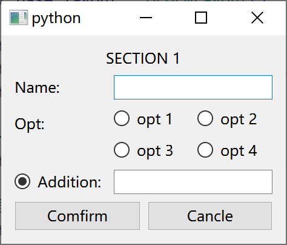

# PySide6 笔记
介绍模块 PySide6 的使用  
可通过 `pip install PySide6` 安装

主要参考教程 
* <https://doc.qt.io/qtforpython-6/tutorials/index.html>  
* <https://www.pythonguis.com/pyqt6-tutorial/>

PySide6 官方文档 <https://doc.qt.io/qtforpython-6/api.html>

## 基础使用
参考 <https://www.pythonguis.com/tutorials/pyside6-creating-your-first-window/>

一个 PyQt 程序具有如下基本结构

```python
# 导入组件库
from PySide6.QtWidgets import QApplication, QMainWindow

app = QApplication()
window = QMainWindow()
window.show()

# 开始事件循环
app.exec()
```

### 核心模块
在 PySide 中, 以 `PySide6` 为根模块, 其下主要有三个 Qt 的核心模块
* `PyWidgets` 包含了大部分窗口组类
* `PyCore` 包含了与组件样式有关类
    * 其中 `PySide6.PyCore.Qt` 模块作为一个命名空间, 包含了大部分 Qt 枚举量或结构体模块, 下文中的 `Qt` 默认指该模块
* `PyGui` 包含了与组件行为有关类

一般使用时 
* `from PySide6.XXX import XXX` 的语法导入所需类  
* 如果有多个类, 可使用括号包含多个类, 在括号内允许换行
* PySide 中, 类一般命名为 `Q + <类名称>` 

### 事件循环
在 PyQt 中, 使用特殊的类 `PyWidgets.QApplication` 管理事件循环  
在事件循环中, `QApplication` 实例将以此读取事件队列中的事件, 并交给对应的处理程序处理并更新窗口

对于任何 PyQt 程序
* 必有有且仅有一个 `QApplication` 实例, 并在程序最后调用类的方法 `exec()` 启动事件循环, 才能使窗口生效
* ==将调用 `show()` 方法的组件对象将作为窗口的根组件==, 因此单窗口程序中, 必须有且仅有一个组件对象调用此方法
* 任何组件都可作为根组件, 对于简单窗口可使用组件基类 [QWidget](#组件基类), 对于标准界面可使用主窗口组件 [QMainWindow](#标准界面)
* 当最后一个窗口被关闭后, 事件循环结束, ==方法 `exec()` 返回并继续执行之后的代码==
* 除非特殊说明, 在事件循环结束后, 所有组件方法都将失效, [交互机制](#交互机制)也将失效

### 组件使用
组件即窗口中显示的交互元素, 一般视为一个对象, 且所有组件对象都具有基类 `QWidget`

在 Qt 中, 一般使用继承的方法自定义组件内容, 例如以下代码  

```python
# 继承组件库中需要自定义的组件类
class MainWindow(QWidget):
    def __init__(self):
        super().__init__()
        button = QPushButton("Press Me!")
        self.setCentralWidget(button)
```

此时
* 在自定义组件类的构造函数第一行必须调用 `super().__init__()`, 执行基类的构造函数
* 将子组件的对象作为成员管理
* 通过 `self` 执行基类方法设置组件

## 交互机制
参考教程
> <https://doc.qt.io/qtforpython-6/tutorials/basictutorial/signals_and_slots.html>  
> <https://www.pythonguis.com/tutorials/pyside6-signals-slots-events/>

在 Qt 中, 使用信号槽 (Signal & Slots), 事件 (Event) 三种机制处理用户与界面之间的交互

### 信号槽机制
当组件受到如点击, 内容修改等操作时, 将产生一个信号 (Signal)  
通常使用一个回调函数接收这一信号, 将接收者称为槽 (Slots)  
在 PyQt 中, 组件中与信号同名的成员变量为信号实例, 并通过信号实例管理与注册接收此信号的槽  

关于信号槽机制使用注意参见[示例](./examples.md#枚举量绑定按钮组)

#### 信号槽机制的基本使用
信号槽的基本使用示例如下 (忽略类定义)

```python
def __init__(self) -> None:
    ...

    self.button = QPushButton("Press Me!", self)
    self.button.setCheckable(True)

    self.is_button_check = False
    self.button.setChecked(self.is_button_check)
    self.button.clicked.connect(self.button_clicked_handler)

@Slot(bool)
def button_clicked_handler(self, check):
    self.is_button_check = check
    print(f"Clicked {self.is_button_check}")
```

关于以上示例
* 通过组件与信号同名的成员变量访问管理信号的信号实例对象
* 自定义槽 (回调函数) 时, 应当使用 [@Slot 修饰](#槽函数的定义)
* 通过信号实例对象的方法 `connect(fun)` 注册接收信号的槽 (回调函数)
* 一个信号允许同时被多个槽接收
* 部分信号还将附带数据, 可通过回调函数的参数接收 (允许忽略)
* 习惯上将通过示例方法, 将信号附带的组件最新状态保存在一个成员变量内但注意
    * Python 的 [Lambda 表达式](../base/base.md#lambda-表达)内不允许赋值
    * 保存变量需要初始化, 一般还需要将组件状态设置为与保存变量的初始值相同 
* 除了使用自定义的回调函数作为槽, 部分组件还会以成员函数的方式提供槽作为接口 (通常这些函数即部分特殊的组件设置函数), 通过此方法实现组件之间的连接

#### 自定义信号与槽
信号定义类 [Signal](https://doc.qt.io/qtforpython-6/PySide6/QtCore/Signal.html#PySide6.QtCore.Signal) 与槽修饰器 [Slot](https://doc.qt.io/qtforpython-6/PySide6/QtCore/Slot.html#PySide6.QtCore.Slot) 均位于 `QtCore` 模块下

信号定义类 `Signal(*types)`
* 如果要给组件定义信号, ==应当将信号定义类作为组件的静态成员==, Qt 中将在组件构造函数中, 将其转移为同名的信号实例对象 `SignalInstance`
* 变长参数 `types` 表明信号附带数据的类型, 以 [Python 类型](../base/objective.md#type-hint)为值
    * 不传入参数, 表明信息没有附带的数据
    * 传入多个参数, 表明信号附带多个数据
    * 使用 `object` 可表示任意 Python 类型 (Python 中一切变量为对象, 一切对象有基类 `object`)
* 通常作为组件的成员变量, 例如 `self.clicked = Signal(bool)`
* 注意, Qt 中不是只有组件具有信号, 只要类继承自 `QObject` 及其子类, 就可以使用信号机制, 例如[计时器](./advance.md#qt-定时器)

通过信号实例对象的方法注册信号
* 方法 `emit(*args)` 用于发出信号传递到所有绑定槽中
    * 变长参数 `*args` 表明此信号所附带的数据, 传入的各个参数类型需要与构造函数中的参数 `types` 类型相对应
* 方法 `connect(receiver)` 用于为信号注册槽
    * 参数 `receiver` 以可调用对象为参数, 但最好是经 `@Slot` 修饰的方法
方法 `disconnect(receiver)` 取消已经注册的槽
    * 参数 `receiver` 以可调用对象为参数, 但最好是经 `@Slot` 修饰的方法

槽修饰器 `@Slot(*result)`
* 变长参数 `result` 表明槽接收的数据类型, 使用与信号实例类 `Signal` 的构造函数类似

信号使用示例如下
```python
class InputArea(QWidget):
    # 定义为组件的静态成员
    updateText = Signal(str)

    def __init__(self) -> None:
        super().__init__()

        self.teInput = QTextEdit()

        self.layout_base = QBoxLayout(QBoxLayout.Direction.TopToBottom)
        self.layout_base.addWidget(QLabel("输入区"))
        self.layout_base.addWidget(self.teInput)

        self.setLayout(self.layout_base)

        # 通过同名方法访问对应的信号实例, 通过 emit 方法发送信号
        self.teInput.textChanged.connect(lambda: self.updateText.emit(self.teInput.toPlainText()))
```

在 Python 中, 也允许使用 [Lambda 表达式](../base/base.md#lambda-表达)或嵌套函数作为槽, 但建议仅在简单的数据转换场合使用  
使用可参考 <https://www.pythonguis.com/tutorials/pyside6-transmitting-extra-data-qt-signals/>

#### 查询组件的信号与槽
通过官方文档可以查看组件包含了哪些可用的信号与槽
* 在[官方组件文档](https://doc.qt.io/qtforpython-6/PySide6/QtWidgets/index.html#module-PySide6.QtWidgets)打开所需查看的组件
* 在 `Synopsis` 节下的 `Signals` 与 `Slots` 小节分别包含了组件所提供的信号与槽
* 表示信号与槽时, 括号 `()` 内的内容为信号所附带或槽接收信号所必要的参数
* 除了组件本身, 特别是基础共性的信号, 还要注意组件的基类可能也会提供信号与槽 (例如按钮组件 `QPushButton` 的 `clicked` 信号由基类 `QAbstractButton` 提供)

### 事件机制
Qt 中将用户与组件之间的交互称为事件 (Event)  
组件通常包含一系列名称为 `xxxEvent` 的虚函数, 当事件发生时这些函数将被调用, 并且函数还将接收包含了与事件有关信息的事件结构体

#### 事件的基本使用
事件的基本使用示例如下

```python
from PySide6.QtCore import Qt
...

class MainWindow(QWidget):
    ...

    def mousePressEvent(self, e):
        if e.button() == Qt.MouseButton.LeftButton:
            print("Left Button Clicked")

        super().mousePressEvent(e)
```

关于以上示例
* 通常事件的回调函数都是虚函数, 且接收事件对应的事件结构体
* 通过访问事件结构体下的方法以获取事件信息, 对于不同类型的事件, 事件结构体可能不同
* 由于自定义组件一般以其他已有组件为基类, 因此建议在事件回调函数的最后使用 `super().xxxEvent(event)` 调用基类的事件回调函数
* 对于完全自定义的组件, 还可调用事件结构体的 `accept()` 与 `ignore()` 方法
    * 当事件产生时, 将由最底层的组件向其父组件传递这一事件, 并以此接收处理这一事件
    * 通过 `accecpt()` 方法, 将标记此事件为处理完毕, 此时将不会传递给父组件处理
    * 通过 `ignore()` 方法, 事件将继续传递, 相当于该组件相对于此事件透明
* 在实际使用中, ==事件机制通常用于自定义组件中, 在事件回调函数中判断[信号](#信号槽机制)是否发生==, 并发出信号

#### 查询组件的事件
通过官方文档可以查看组件能处理的事件以及事件的事件结构体
* 对于大部分事件回调函数, 都是组件基类的以命名以 `Event` 为结尾的虚函数, 可在[官方文档](https://doc.qt.io/qtforpython-6/PySide6/QtWidgets/QWidget.html#virtual-methods)的 `Virtual methods` 中查询
* 事件回调函数接收的参数类型即事件结构体, 可通过超链接查看其中包含的信息方法
* 除了事件结构体本身, 特别是基础共性的信号, 其基类可能也会提供信息方法 (例如鼠标事件 `QMouseEvent` 的 `button()` 按键信息由基类 `QSinglePointEvent` 提供)
* 事件信息方法的返回值一般是 `QtCore.Qt` 模块定义下的常量或类, 应当详细查看官方文档

以常用的鼠标事件为例
* 鼠标事件主要包含以下四种
    * `mouseMoveEvent` 鼠标移动事件 (默认仅在鼠标按下时触发)
    * `mousePressEvent` 鼠标按下事件
    * `mouseReleaseEvent` 鼠标释放事件
    * `mouseDoubleClickEvent` 鼠标双击事件
* 四种事件均使用 `QMouseEvent` 作为事件结构体, 常用信息方法为
    * `button()` 此时鼠标按下的按键, 返回值为定义于 `Qt.MouseButton` 下的枚举量
    * `pos()` 此时鼠标相对组件的整数坐标, 返回值为定义于 `Qt.QPoint` 下的类, 通过方法 `x(), y()` 访问具体位置
    * `globalPos()` 此时鼠标相对窗口的整数坐标, 返回值为定义于 `Qt.QPoint` 下的类

## 基本组件
参考 <https://www.pythonguis.com/tutorials/pyside6-widgets/>

* 关于 Qt 提供的所有组件及其分类参见 <https://doc.qt.io/qtforpython-6/overviews/widget-classes.html#widgets-classes>
* 本小节主要介绍 Qt 中的基本组件 <https://doc.qt.io/qtforpython-6/overviews/widget-classes.html#basic-widget-classes>

### 组件基类
组件基类 [QWidget](https://doc.qt.io/qtforpython-6/PySide6/QtWidgets/QWidget.html#PySide6.QtWidgets.QWidget) 是 Qt 中所有组件的基类, 因此该组件的功能为所有组件通用

* 关于样式的通用操作, 参见[组件样式](#组件样式)
* 关于子组件的插入与布局, 参见[组件布局](#组件布局)

#### 组件禁用与隐藏
组件开启与禁用
* 组件具有开启与禁用两个状态, 当组件关闭时, 其中的子组件也将关闭, 且组件无法被交互
* 方法 `setEnable(arg__1)` 参数为布尔值, 设置组件为开启 (True) 或禁用 (False) 状态, 该方法为一个[槽](#信号槽机制)
* 方法 `isEnable()` 返回组件当前的状态, 当有效时返回 `True`

组件显示与隐藏
* 除了开启与禁用, 还可以设置组件的显示与隐藏, 当组件被隐藏时, 将完全不会被处理与显示组件及其子组件
* 方法 `hide()` 与 `show()` 将设置组件为隐藏与显示状态, 这两个方法同时为[槽](#信号槽机制)
* 方法 `isHidden()` 可以查询组件当前是否被隐藏, 隐藏时返回 `True`
* 对于窗口, 显示与隐藏等效于窗口是否打开

#### 组件大小规则
组件的大小受到组件内容与组件在[布局中的可用空间](#布局方法)两者的约束, 需要设置一个规则确定组件如何确定自己的大小

方法 `setSizePolicy(horizontal, vertical)` 用于设置组件宽度与高度的大小规则
* `horizontal, vertical` 组件在宽度与高度的大小规则, 参数值的类型为 `QtWidgets` 模块下的类 `QSizePolicy` 的嵌套枚举类型 `QSizePolicy.Policy`, 可用的值有
    * `Policy.Fixed` 使用组件内容决定的推荐大小, 且不会随布局改变 (用于希望组件刚好包括所有内容时使用)
    * `Policy.Minimum` 组件的大小尽可能小, 以适应其他组件的
    * `Policy.Maximum` 组件的大小尽可能大, 以利用可用空间
    * `Policy.Expanding` 组件尽可能利用所有可用空间
    * `Policy.Preferred` 根据需要在推荐大小的基础上伸缩 (一般情况下的默认设置)

方法 `setMinimumWidth(minw)` 设置组件的最小宽度
* `minw` 最小宽度, 单位像素
* 常用于为[输入栏](#输入栏组件)等输入组件预留空间

默认情况下, 具体的组件的创建时都将选择合适的大小规则, 仅在必要的情况下使用, 例如
* [按钮组件](#抽象按钮组件)在高度方向使用固定大小, 长度方向则希望尽可能小, 以此实现最好的显示效果
* [标签组件](#标签组件)总是倾向于利用所有可用空间
* 对于可滚动界面的滚动条应当使用 `Policy.Expanding`, 以占满其所在空间

#### 组件通用方法
构造函数 `QWidget(parent = None)`
* `parent` 组件的父组件, 如果没有或暂未确定传入 `None`
* 一般经过布局的组件不需要指定, 但对于 [QAction](#命令组件) 等可插入多个不同组件的必须指定, [QDialog](#自定义会话窗口) 等独立窗口建议指定

方法 `setToolTip(arg__1)` 设置当鼠标停留在组件上时显示的提示信息
* `arg__1` 字符串, 信息内容

槽函数 `deletelater()` 销毁组件
* 该槽函数来自 `QObject`, 任何 Qt 对象均可调用

#### 窗口专用方法
当以 `QWidget` 组件作为窗口应用时, 可通过以下方法设置窗口样式

方法 `setWindowIcon(icon)` 设置窗口图标
* `icon` 窗口图标, 传入[图片资源对象](#图片资源-qpixmap)

槽函数 `setWindowTitle(arg__1)` 设置窗口标题
* `arg__1` 窗口标题内容, 传入字符串

事件处理方法 `closeEvent(QCloseEvent event)` 当窗口被关闭时发出
* 通过重载此方法实现事件处理, 参见[事件机制](#事件机制)

### 标签组件
标签组件 [QLabel](https://doc.qt.io/qtforpython-6/PySide6/QtWidgets/QLabel.html#PySide6.QtWidgets.QLabel), 可用于显示一段文本, 富文本或图片

#### 标签内容
构造函数 `QLabel(text = None)`
* 参数 `text` 为字符串, 标签内的文本内容, 允许传入 `None`, 在之后设置

组件方法 `setText(arg__1)` 可设置标签内的文本内容
* 参数 `arg__1` 为字符串, 即标签内新的文本内容
* 该方法可作为[槽](#信号槽机制)使用

组件方法 `text()` 可获取标签内的文本内容
* 返回值类型为字符串

方法 `setTextFormat(arg__1)` 设置对于组件的文本内容属于何种类型
* 参数 `arg__1` 为枚举类型 `Qt.TextFormat`, 可取值如下
    * 值 `TextFormat.AutoText` 自动判断文本类型是普通文本还是富文本 (默认)
    * 值 `TextFormat.PlainText` 不对内容进行解析
    * 值 `TextFormat.RichText` 文本类型为富文本, 具体使用参见[富文本表示](#富文本表示)
    * 值 `TextFormat.MarkdownText` 文本类型为 Markdown, 仅用于 Qt5 及更新版本

使用富文本时, 当文本中的超链接被点击  
* 将体现为[信号](#信号槽机制) `linkActivated(link)` 与 `linkHovered(link)`, 信号数据为参数 `href` 的值, 类型为字符串
* 通过组件方法 `setOpenExternalLinks(open)` 设置参数 `open` 为 `True`, 将尝试在点击超链接时打开网页, 默认为 `False`

#### 图片标签
标签还可用于显示图片

组件方法 `setPixmap(arg__1)` 可设置标签内的文本内容
* 参数 `arg__1` 为 [QPixmap](#图片资源-qpixmap) 对象, 即标签内显示的图片

组件方法 `pixmap()` 获取当前组件内的图片
* 返回值为 [QPixmap](#图片资源-qpixmap) 对象

组件方法 `setScaledContents(arg__1)` 设置图片显示方式
* `arg__1` 设置为 `True` 时将尝试拉伸整个图片, 以使其适应组件空间, 默认为 `False`

#### 显示样式
组件方法 `setAlignment(arg__1)` 设置内容的对齐方式
* 参数 `arg__1` 参数值参见[对齐设置](#对齐样式值)

标签内的文本样式设置参见[文本字体样式](#文本字体样式-qfont)

默认情况下, 标签组件将使用尽可能大的空间, 如果希望标签大小刚好与内容对齐, 可参见[组件大小规则](#组件大小规则)

### 抽象按钮组件
抽象按钮组件 [QAbstractButton](https://doc.qt.io/qtforpython-6/PySide6/QtWidgets/QAbstractButton.html#PySide6.QtWidgets.QAbstractButton) 是 Qt 中一系列按钮组件的基类, 因此该组件的功能在按钮组件上同样存在

一般不会直接使用该组件, 但如果希望自定义按钮, 则应该以 `QAbstractButton` 为基类, 具体需要实现那些虚函数详见文档

#### 按钮通用设置
方法 `setText(text)` 设置按钮文本内容
* 参数 `text` 字符串, 按钮文本内容, 通常为纯文本 (可通过 `\n` 换行), 显示在图标后
* 按钮不支持[富文本](#富文本表示), 但可通过[字体设置](#文本字体样式-qfont)修改样式

方法 `setIcon(icon)` 设置文本前图标
* 参数 `icon` [QPixmap](#图片资源-qpixmap) 类的图片资源, 显示在文本前
* 通过方法 `setIconSize(size)` 设置图标大小, 参数为 [QSize](#尺寸样式值) 类的大小结构体

方法 `setShortcut(key)` 设置按钮快捷键
* 参数 `key` [QKeySequene](#键盘按键与快捷键样式值) 类的按键组合, 设置后按下设置按键组合将等效于点击按钮
* 例如 `self.button.setShortcut(QKeySequence(Qt.Key.Key_0))`

方法 `setCheckable(arg__1)` 设置按钮响应方式
* 参数 `arg__1` 为布尔值, 对于 `QAbstractButton` 默认为 `False`
* 设置为 `True` 时, 按钮具有自锁能力, 即按下后不会弹起, 存在按下与弹起两种状态
* 设置为 `False` 时, 按钮在按下后会立即弹起, 只有一种状态
* 对于不同按钮该设置默认值不同
    * [普通按钮](#普通按钮)默认为 `False`
    * [选框组件](#选框组件)默认为 `True`
* 可通过槽函数 `setChecked(arg__1)` 设置自锁按钮的状态

#### 按下按钮信号
信号 `clicked()` 用于判断[非自锁按钮](#按钮通用设置)
* 信号将在以下条件下触发: 按钮被鼠标按下, 组件方法 [click](#按钮操作方法) 生成一次点击, [按钮快捷键](#按钮通用设置)被按下时
* 信号在以下条件下不会触发: 组件方法 [setChecked](#按钮操作方法) 修改按钮自锁状态, [组件被禁用](#组件禁用与隐藏)时

信号 `toggled(checked)` ==用于判断[自锁按钮](#按钮通用设置)==
* 信号将在按钮状态发生改变时触发, 包括用户或组件方法 (`click`, `setChecked` 等)
* 布尔型数据 `checked`
    * 当按钮在信号发出后处于按下状态时, 值为 `True`
    * 相反按钮处于弹起状态时, 值为 `True`

对于自锁按钮 (参见 [setCheckable](#按钮通用设置) 方法), 还有其他精细信号, 详见文档

#### 按钮操作方法
以下方法可对按钮进行操作, 这些方法同时也是[槽函数](#信号槽机制)
* `click()` 相当于按钮被点击了一次, 产生了响应的信号, 如果按钮具有自锁能力, 体现为按钮状态切换
* `animateClick()` 与 `click()` 相同, 但还将产生一个按钮被按下的动画
* `setChecked(arg__1)` 用于具有自锁能力 (参见 [setCheckable](#按钮通用设置) 方法) 的按钮, 设置按钮当前的状态, 参数为布尔值, 含义与 [click](#按下按钮信号) 信号的信息 `checked` 类似

当[组件被禁用](#组件禁用与隐藏)时, 以上方法不会生效

#### 普通按钮
以下三种按钮均为普通按钮, 仅存在部分使用细节不同, 是 [QAbstractButton](#抽象按钮组件)的三个子类
* 普通按钮组件 [QPushButton](https://doc.qt.io/qtforpython-6/PySide6/QtWidgets/QPushButton.html#PySide6.QtWidgets.QPushButton) 最基础的按钮, 具有边框, 能够显示图标与内容的按钮
    * 方法 `setAutoDefault(arg__1)` 可将按钮设置为自动强调状态, 即如果按钮在上次被点击过, 将会以额外边框修饰强调 (默认关闭)
* 链接按钮组件 [QCommandLinkButton](https://doc.qt.io/qtforpython-6/PySide6/QtWidgets/QCommandLinkButton.html#PySide6.QtWidgets.QCommandLinkButton) 具有图标, 标题与描述三个部分的按钮, 专门用于安装向导, 项目选择等场景的无边框大按钮
    * 方法 `setDescription(description)` 设置按钮的描述内容, 同样是纯文本, 按钮的标题由 [setText](#按钮通用设置) 设置
* 工具按钮组件 [QToolButton](https://doc.qt.io/qtforpython-6/PySide6/QtWidgets/QToolButton.html#PySide6.QtWidgets.QToolButton) 仅具有图标的按钮, 没有边框, 视觉反馈较轻, 一般用于应用工具栏中的按钮
    * 方法 `setDefaultAction(arg__1)` 根据命令组件设置按钮, 传入[命令组件](#命令组件)

### 选框组件
选框组件属于特殊的按钮组件, 同样具有按钮同样操作, 可参见[抽象按钮组件](#抽象按钮组件)

#### 复选框组件
复选框组件 [QCheckBox](https://doc.qt.io/qtforpython-6/PySide6/QtWidgets/QCheckBox.html#PySide6.QtWidgets.QCheckBox) 用于表示可与其他选项共存的矩形选框, 当被勾选时选框上将出现对勾, 选框后允许附带[图标与文字](#按钮通用设置)

复选框组件具有特殊的三状态模式

使用枚举类型 `Qt.CheckState` 表示三种状态, 分别是
* `CheckState.Unchecked` 未选中
* `CheckState.PartiallyChecked` 部分选中
* `CheckState.Checked` 完全选中
* 可用于如表示全不选, 部分选中, 全选

以下方法专门用于设置三状态模式下的复选框 (对于一般复选框参见[按钮操作方法](#按钮操作方法))
* 方法 `setTristate(y = True)` 设置选框为三状态模式, 默认设置为 `False`, 即==默认不使用三状态模式==
* 方法 `setCheckState(state)` 设置三状态选框当前状态, 参数 `state` 为枚举类型 `Qt.CheckState` 
* 信号 `checkStateChanged(arg__1)` 用于获取选框状态修改后, 最新的状态, 数据为枚举类型 `Qt.CheckState` 

对于普通模式下的复选框组件, 推荐使用 [toggle](#按下按钮信号) 信号

#### 单选框组件
单选框组件 [QRadioButton](https://doc.qt.io/qtforpython-6/PySide6/QtWidgets/QRadioButton.html#PySide6.QtWidgets.QRadioButton) 用于表示可与其他选项互斥的圆形选框, 当被勾选时选框上将出现对勾, 选框后允许附带[图标与文字](#按钮通用设置), 注意该组件仅具有两个状态

单选框如果要实现互斥效果, 还需要配合选框组组件 [QButtonGroup](https://doc.qt.io/qtforpython-6/PySide6/QtWidgets/QButtonGroup.html#PySide6.QtWidgets.QButtonGroup), 该组件没有视觉效果, 仅用于管理选框组, 也可用于管理[普通按钮](#普通按钮)  

该组件作为抽象容器, 不需要添加到实际布局中

选框组方法 `addButton(arg__1, id = -1)` 添加选框组内的按钮
* `arg__1` 用于绑定的按钮组件, 即以 [QAbstractButton](#抽象按钮组件) 为基类的组件
* `id` 整数, 表示按钮编号, 使用 `-1` 将自动编号

选框组方法 `id(button)` 通过组件查询按钮编号
* `button` 用于查询的按钮组件
* 当按钮不在组内时, 返回 `-1`

选框组方法 `button(id)` 通过编号查询组件
* `id` 用于查询的编号
* 当编号不存在时, 返回 `None`

选框组信号 `idToggled(arg__1, arg__2)`
* 当按钮组内按钮状态切换时产生信号, 即重复点击同一按钮不会触发信号, 当有新按钮被点击时, 将先后触发两个信号
* 附带信息 `arg__1` 为切换状态按钮的编号
* 附带信息 `arg__2` 为此按钮在信号发出后是否为选中, 若选中则为 `True`
* 类似的有 `buttonToggled(arg__1, arg__2)`, 此时附带信息 `arg__1` 为按钮组件对象

以下选框组方法用于确定当前选中的选框
* `checkedId()` 返回编号, 如果没有任何一个选中返回 `-1`
* `checkedButton()` 返回按钮组件对象, 如果没有任何一个选中返回 `None`

如果要设置其中单个选框的状态, 需要直接访问选框组件, 无法通过选框组操作其中的选框

以下为该组件的使用示例
```python
class MyWindow(QWidget):
    def __init__(self) -> None:
        super().__init__()

        self.place =  QWidget()
        self.place_layout = QVBoxLayout()
        self.place.setLayout(self.place_layout)
        self.setCentralWidget(self.place)

        self.button1 = QPushButton(self)
        self.button1.setText("option 1")
        self.button1.setCheckable(True)
        self.place_layout.addWidget(self.button1)

        self.button2 = QPushButton(self)
        self.button2.setText("option 2")
        self.button2.setCheckable(True)
        self.place_layout.addWidget(self.button2)

        self.button_group = QButtonGroup()
        self.button_group.addButton(self.button1, -1)
        self.button_group.addButton(self.button2, -1)

        self.button_group.idToggled.connect(self.slot_group_toggled)

    @Slot(int)
    def slot_group_toggled(self, id, isCheck):
        print(f"button {id} become {isCheck}")
```

### 输入栏组件
输入栏组件 [QLineEdit](https://doc.qt.io/qtforpython-6/PySide6/QtWidgets/QLineEdit.html#PySide6.QtWidgets.QLineEdit) 能够提供一个单行可供用户编辑与输入的文本框, 且支持对应系统下的编辑快捷键

[只读状态](#输入栏样式设置)下, 也可用于显示允许用户选择与复制的单行文字

#### 输入栏样式设置
方法 `setReadOnly(arg__1)` 可设置输入栏为只读状态
* `arg__1` 布尔型, 当设置为 `True` 时输入栏只读
* 方法 `isReadOnly()` 可查询输入栏是否为只读状态
* 只读状态下用户无法修改, 但可以选择与复制内容, 且可通过[输入内容修改](#输入内容修改)方法修改内容, 可用于显示实时变化的数据

方法 `setAlignment(flag)` 可设置输入栏内文本的对齐方式
* `flag` 参数值为 [Qt 对齐设置](#对齐样式值), 默认为水平居左, 垂直居中

方法 `setEchoMode(arg__1)` 可设置输入栏如何显示用户输入的内容
* `arg__1` 参数值为类 `QLineEdit` 下的嵌套枚举类型 `QLineEdit.EchoMode`, 常用值有
    * `EchoMode.Normal` 直接显示用户输入的内容, 默认设置
    * `EchoMode.Password` 使用掩码代替用户输入的内容, 用于输入密码

方法 `setPlaceholderText(arg__1)` 可设置输入栏在输入内容前显示的提示文字
* `arg__1` 字符串, 提示文字内容

通过通用大小设置方法 [setMinimumWidth](#组件大小规则) 可为输入内容预留空间, 例如以下代码

```python
# 获取每个字符大小
font_width = self.lineEdit.font().pointSize()
# 预留 30 个字符的空间
self.lineEdit.setMinimumWidth(font_width * 30)
```

#### 输入内容约束
方法 `setMaxLength(arg__1)` 设置输入字符串的最大长度, 用于简单约束
* `arg__1` 整数, 允许的最大长度

方法 `setValidator(arg__1)` 设置输入内容验证器, 用于复杂情况约束
* `arg__1` 模块 `QtGui` 下纯虚类 `QValidator` 的子类, 常用的有 (以下直接给出构造函数)
    * `QRegularExpressionValidator(re)` 正则表达式验证器
        * `re` 为正则表达式字符串
    * `QDoubleValidator(bottom, top, decimals)` 浮点数验证器
        * `bottom` 为输入值的下限, 使用 `-math.inf` 表示无下限
        * `top` 为输入值的上限, 使用 `+math.inf` 表示无下限
        * `decimals` 为输入值的小数位数, 使用 `-1` 表示无限制
        * 允许使用一般小数与科学计数数如 `1.234e+2`
    * `QIntValidator(bottom, top)`
        * `bottom` 为输入值的下限, 使用 `-0x80000000` 表示无下限 (C++ 整形下限)
        * `top` 为输入值的上限, 使用 `+0x7FFFFFFF` 表示无下限 (C++ 整形上限)

方法 `hasAcceptableInput()` 判断输入是否满足验证器要求
* 当满足要求时返回 `True`
* 如果希望通过一个信号监控验证是否通过, 可参见[示例](./examples.md#登录会话程序)的类 `ValidLineEdit`

使用输入内容约束时注意
* 通常情况下, 不满足验证器的修改将被阻止
* 但对于如限定最少字数的正则表达式验证器, 依然允许从空内容输入
* 根据信号发出的时机不同, 槽函数中方法 [text()](#输入内容修改) 获取的的输入内容也不一定是正确的
    * 信号 `editingFinished` 发出时, 内容一定符合要求
    * 信号 `textChanged` 发出时, 内容经过阻止, 但可能符合也可能不符合要求
    * 信号 `inputRejected` 发出时, 内容为被退回的错误内容, 一定不符合要求
    * 关于信号具体介绍见[输入栏相关信号](#输入栏交互)

自定义验证器
* 需要通过继承验证器基类 [QValidator](https://doc.qt.io/qtforpython-6/PySide6/QtGui/QValidator.html#PySide6.QtGui.QValidator) 以创建自定义验证器
* 创建自定义验证器时, 需要实现纯虚方法 `validate(arg__1, arg__2)`
    * `arg__1` 被验证的字符串
    * `arg__2` 光标位置, 通常没有意义
    * 返回值为元组 `(flag, arg__1, arg__2)`, 其中 `flag` 标识验证状态, 为枚举类型 `QValidator.State`
        * `State.Acceptable` 验证通过
        * `State.Intermediate` 不满足要求, 但允许用户输入 (建议验证失败时默认返回此标识)
        * `State.Invalid` 不满足要求, 且阻之用户输入
* 可参见[示例](./examples.md#登录会话程序)的类 `ValidatorImitator`

#### 输入栏交互
方法 `text()` 可用于获取当前的输入的内容

* 信号 `textEdited` 当用户修改输入栏内容时发出
* 信号 `textChanged` 当输入栏内容以任意方式修改时发出
* 信号 `editingFinished` 当输入结束且输入内容满足[约束](#输入内容约束)时发出, 可以是用户按下回车, 或组件失去角点等情况
* 信号 `inputRejected` 当输入内容修改不满足时, 发出信号

使用验证器时, 在以上三个信号对应的槽函数中, 方法将 [text()](#输入内容修改) 获取的的输入内容存在差异, 具体见[输入内容约束](#输入内容约束)

使用以下[槽方法](#信号槽机制)方法可对输入栏内容进行修改
* 方法 `clear()` 清空输入栏内容
* 方法 `undo()` 撤回上一步
* 方法 `setText(arg__1)` 设置输入栏内容, 参数为字符串

### 下拉栏组件
下拉栏组件 [QComboBox](https://doc.qt.io/qtforpython-6/PySide6/QtWidgets/QComboBox.html#PySide6.QtWidgets.QComboBox) 能够提供一个单行可供用户从卡展开的提供选项中选择作为输入的组件, 通过设置也允许用户直接输入

#### 下拉选项设置
方法 `insertItem(index, icon, text, userData = None)` 插入下拉栏选项
* `index` 插入位置的索引, 将在索引后添加插入的选项
    * 如果索引大于选项数, 将在最后位置插入, 如果索引为负, 将从后向前索引
    * 索引从 `0` 开始
    * 建议使用方法 `count()` 获取当前选项数作为参数, 以此实现向后插入
* `icon` 选项文字前的图片, 取值参见 [Qt 图片资源](#图片资源-qpixmap)
* `text` 选项文字, 取值为字符串
* `userData` 选项数据, 可以是任意 Python 类型的参数
* 对于不需要选项图片的情况, 有重载 `insertItem(index, text)`

方法 `insertItem(index, texts)` 插入多个下拉栏选项
* `index` 插入位置的索引, 具体见上
* `texts` 使用字符串表示各个索引下的选项文字

方法 `removeItem(index)` 清除指定输入选项
* `index` 清除选项的索引
* 如果索引不存在, 将不会产生任何效果

槽函数 `setCurrentIndex(index)` 设置下拉栏当前选项的索引
* `index` 设置的索引
* 当设置了一个不存在的索引, 如 `-1`, 则认为当前下拉栏处于无选择的状态

#### 可输入下拉栏
下拉栏中, 除了让用户从已有输入中选择, 还可以设置为类似[输入栏](#输入栏组件)的形式, 让用户输入新选型或从已有选项中匹配用户输入
* 当用户触发了类似[输入栏 editingFinished 信号](#输入栏交互)的行为时, 将视为新的选项输入完成, 并选择新的输入选项
* 通常不允许输入选项与已有的选项重复, 且用户在输入时, 将根据已有选项尝试进行自动补全
* 新的选项将以用户输入内容作为选项名, 选项数据为 `None`
* 通常情况下, 用户输入的选项将自动插入到已有选项的最末尾 (可以修改插入行为, 此处不介绍)

方法 `setEditable(editable)` 设置下拉栏为可输入模式
* `editable` 布尔值, 传入 `True` 时下拉栏可输入, 默认为 `False`
* 仅当下拉栏为可输入模式, 以下关于可输入下拉栏设置的方法才有意义

方法 `setValidator(v)` 设置用户输入验证器, 以约束用户输入
* `v` 输入验证器对象, 具体见[输入内容约束](#输入内容约束)
* 仅约束用户新输入的内容, 输入已有的选项不会受验证器约束

方法 `setMaxCount(max)` 设置最大选项数
* `max` 整数, 允许的最大选项数, 默认无限制, 但下拉栏最多只能同时显示 10 个选项
* 当超过最大选项数时, 用户将无法输入新选型, 如果要实现覆盖旧选项的效果, 可参考下方代码修改

如果希望覆盖上一个用户输入选项, 应使用 [removeItem 方法](#下拉选项设置) 与 [currentIndexChanged 信号](#下拉栏交互) 手动实现, 例如以下代码
```python
ORIGINAL_ITEM_LENGTH = 4 # 原始选项数

@Slot(int)
def slot_overwrite_new_item(self, index):
    if index > ORIGINAL_ITEM_LENGTH:
        # 根据新选项总插入到最末尾, 因此该索引一定指向上一个选项
        self.cbInput.removeItem(ORIGINAL_ITEM_LENGTH)
        print("remove last")
```

#### 下拉栏交互
以下方法可用于获取下拉选项的具体信息
* `currentIndex()` 获取当前选择选项的索引, 如果没有选择返回 `-1`
    * 对于方法 `insertItem` 插入的选项, 且不可输入时, 此方法得到的索引一般能够与 `texts` 的索引对应
* `itemData(index)` 获取指定索引选项对应的选项数据
    * 如果没有指定选项数据, 或选项来自[用户输入](#可输入下拉栏), 返回 `None`
    * 对于方法 `insertItem` 插入的选项, 建议使用此方法识别选项
* `itemText(index)` 获取指定索引对应的选项文本
    * 该方法可用于获取[可输入下拉栏](#可输入下拉栏)中, 用户输入的文本
    * 对于可输入下拉栏应使用此方法识别选项, 可配合 Python 的 [in 运算符](../base/base.md#特殊运算符) 使用

信号 `currentIndexChanged(index)` 将在选择的索引发生改变时触发, 包括[新选项被输入](#可输入下拉栏)
* 信息 `index` 即最新状态下选择的索引

### 数值微调栏组件
数值微调栏组件 [QSpinBox](https://doc.qt.io/qtforpython-6/PySide6/QtWidgets/QSpinBox.html#PySide6.QtWidgets.QSpinBox) 与[输入栏组件](#输入栏组件)类似, 但专门用于整数数值的输入, 且在右侧提供了微调按钮以及上下按键用于调整数值

#### 数值微调栏设置
以下方法可对数值范围与修改方式进行设置
* 方法 `setMinimum(min)` 设置微调范围的最小值, 默认为 `0`
* 方法 `setMaximum(max)` 设置微调范围的最大值, 默认为 `99`
* 方法 `setRange(min, max)` 同时设置微调范围的最小与最大值
* 方法 `setSingleStep(val)` 设置微调按钮的步长, 默认为 `1`
* 方法 `setWrapping(w)` 设置为 `True` 时开启回绕调整, 最大值通过微调按钮加一将变为最小值, 反之类似

以下方法可为设置微调栏内容的显示样式
* 方法 `setPrefix(prefix)` 设置内容的前缀, 参数为字符串
* 方法 `setSuffix(suffix)` 设置内容的后缀, 参数为字符串
* 方法 `setSpecialValueText(txt)` 当微调栏取==最小值==时, 使用指定文字代替
    * 参数 `txt` 即指定文字, 之后当取值为最小值时, 将自动修改为此段文字
    * 即使显示为文字, 在方法 [value()](#数值微调栏交互) 读取值时, 得到的依然为最小值
    * 通常可用于显示 `自动` 以表示该数值由决定程序

以下设置方法含义与[输入栏组件](#输入栏样式设置)基本相同, 可参考同名方法的使用
* 方法 `setReadOnly(r)` 设置为只读模式
* 方法 `setAlignment(flag)` 设置内容对齐方式

#### 数值微调栏交互
方法 `value()` 获取当前微调栏内的数值

信号 `valueChanged(arg__1)` 当数值以任意方式发生改变时发出
* 数据 `arg__1` 为改变后数值栏内的数值, 类型为整形

槽函数 `setValue(val)` 修改数值
* `val` 新的数值, 类型为整形, 如果超出范围, 将使用最近的有效值代替

#### 其他微调栏组件
类似整数的数值微调栏, Qt 中还有
* 浮点数微调栏 [QDoubleSpinBox](https://doc.qt.io/qtforpython-6/PySide6/QtWidgets/QDoubleSpinBox.html#PySide6.QtWidgets.QDoubleSpinBox)  
    * 推荐使用带浮点数验证器的[输入栏组件](#输入栏组件)代替
* 时间微调栏 [QDateTimeEdit](https://doc.qt.io/qtforpython-6/PySide6/QtWidgets/QDateTimeEdit.html#PySide6.QtWidgets.QDateTimeEdit)  
    * 可用于输入时间与日期
    * 输入日期时, 推荐使用 [QCalendarWidget](https://doc.qt.io/qtforpython-6/PySide6/QtWidgets/QCalendarWidget.html#PySide6.QtWidgets.QCalendarWidget) 代替

具体使用见官方示例 <https://doc.qt.io/qtforpython-6/overviews/qtwidgets-widgets-spinboxes-example.html#spin-boxes-example>

### 滑动条组件
滑条组件 [QSlider](https://doc.qt.io/qtforpython-6/PySide6/QtWidgets/QSlider.html#PySide6.QtWidgets.QSlider) 提供了一个滑动条, 通过拖拽滑动条以实现==整数的输入==, 可用于表示范围较小的整数值, 或具有大小关系的选项

#### 滑动条样式设置
以下方法设置滑动条的方向 (水平或垂直)
* 方法 `setOrientation(arg__1)` 设置滑动条方向
* 构造函数 `__init__(orientation = Orientation.Vertical)` 在构造函数中指定滑动条方向, 默认为垂直
* 参数值类型为 [Qt.Orientation](#组件方向样式值)

以下方法设置滑动条的范围
* 方法 `setMinimum(min)` 设置滑动条范围的最小值, 默认为 `0` 
* 方法 `setMaximum(max)` 设置滑动条范围的最大值, 默认为 `99`

以下方法设置滑动条的调整方法
* 方法 `setSingleStep(arg__1)` 设置滑动条一次小移动变化的值, 默认为 `1` (通过方向键调整)
* 方法 `setPageStep(arg__1)` 设置滑动条一次大移动变化的值, 默认为 `10` (通过 <kbd>PgUp</kbd> 与 <kbd>PgDn</kbd> 调整)
* 注意, 滑动条表示的数值总是在范围内的整数连续变化, 不受以上设置影响

以下方法设置滑动条的刻度
* 方法 `setTickInterval(ti)` 设置滑动条刻度间隔, 取 `0` 将根据滑条调整变化值确定
* 方法 `setTickPosition(position)` 设置滑动条刻度的显示方式, 参数值类型为 `QSlider` 下的嵌套枚举类型 `TickPosition`, 常用的有
    * `TickPosition.NoTicks` 不绘制刻度, 默认设置为不显示
    * `TickPosition.TicksBothSides` 在滑动条两侧绘制刻度
    * `TickPosition.TicksAbove/Below` 在水平滑动条上 / 下方绘制刻度
    * `TickPosition.TicksLeft/Right` 在垂直滑动条左 / 右方绘制刻度

#### 滑动条交互
方法 `value()` 获取当前滑动条的数值  

信号 `valueChanged(value)` 当滑动条数值以任意形式发生修改时触发
* 数据 `value` 为修改后的滑动条数值

槽函数 `setValue(arg__1)` 设置当前滑动条的数值
* `arg__1` 设置的数值

### 进度条组件
滑条组件 [QProgressBar](https://doc.qt.io/qtforpython-6/PySide6/QtWidgets/QProgressBar.html) 提供了一个进度条, 进度条可通过程序控制, 用于显示任务的执行进度

#### 进度条样式设置
方法 `setTextVisible(visible)` 设置进度条旁是否显示文字
* `visible` 传入 `True` 时在进度条旁显示进度文字, 默认为 `True`

方法 `setFormat(format)` 设置进度条旁文字内容的格式字符串
* `format` 字符串, 默认为 `%p`, 其中
    * `%p` 将替换为进度百分比, 显示为整数带 `%`
    * `%v` 将替换为当前进度条数值
    * `%m` 将替换为进度条总步数

方法 `setOrientation(arg__1)` 设置进度条方向
* `arg__1` 传入[组件方向样式值](#组件方向样式值)

#### 进度条交互
槽函数 `setRange(minimum, maximum)` 设置进度条数值范围
* `minimum` 进度条最小值, 默认为 `0`, 传入整数, 建议显示设置
* `maximum` 进度条最大值, 默认为 `100`, 传入整数, 建议显示设置
* 当进度条最大值小于最小值时, 最小值将成为唯一有效值
* 当传入范围超出现有数值时, 将重置数值
* 当传入 `(0, 0)`, 进度条表现为不定状态 (进度条中间体现为不断滚动的色块)

槽函数 `setValue(value)` 设置进度条数值
* `value` 设置数值, 当超出范围时设置不会生效

槽函数 `reset()` 重置进度条数值

方法 `value()` 获取当前数值

### 只读文本框组件
文本浏览器组件 [QTextBrowser](https://doc.qt.io/qtforpython-6/PySide6/QtWidgets/QTextBrowser.html#PySide6.QtWidgets.QTextBrowser) 提供了一个文本区域专门用于显示 [HTML](#html-富文本) 与 [Markdown](#markdown-富文本) 等富文本, 且可选中文本内容, 并使用各种快捷键如 <kbd>Ctrl</kbd> + 滚轮缩放内容

* 与[标签组件](#标签组件)不同, 该组件对于大段内容的显示进行了优化, 且对超链接的处理更好
* 该组件继承自 [QTextEdit](https://doc.qt.io/qtforpython-6/PySide6/QtWidgets/QTextEdit.html#PySide6.QtWidgets.QTextEdit) 此处仅介绍与文本显示有关的方法
    * 该组件虽然能显示富文本与编辑, 但建议编辑时使用[文本编辑框组件](文本编辑框组件)
    * 设置为只读模式后 (`setReadOnly(True)`), 除了不支持超链接与该组件基本一致, 因此仅文本不含超链接时建议使用 `QTextEdit`

#### 文本框样式设置
以下方法设置文本框对超链接的处理方式
* 方法 `setOpenExternalLinks(open)` 设置是否解析并打开网页超链接, 默认为 `False`
* 方法 `setOpenLinks(open)` 设置是否在点击链接后尝试跳转并显示到下一个文档, 默认为 `True`
* 方法 `setSearchPaths(paths)` 设置本地链接的搜索路径, 参数值为字符串列表, 默认为空字符串, 即使用相对路径

#### 文本框交互
槽函数 `setSource(name, type = ResourceType.UnknownResource)` 从链接加载文本
* `name` 文本文件链接, 参数类型为[链接管理类](#链接管理类)
* `type` 文本文件类型, 使用 `QtGui` 模块下的枚举类型 `QTextDocument.ResourceType` 表示, 常用的有
    * `ResourceType.UnknownResource` 未知类型 (默认)
    * `ResourceType.HtmlResource` HTML 文件
    * `ResourceType.MarkdownResource` Markdown 文件

槽函数 `setHtml(text)` 通过给定字符串设置显示的 HTML 文本内容
* `text` 包含 HTML 内容的字符串, 具体参见[富文本表示](#富文本表示)
* 类似的有槽函数 `setMarkdown(markdown)` 通过给定字符串设置显示的 Markdown 文本内容

槽函数 `append(text)` 像文本末尾添加内容
* `text` 添加内容的字符串, 通常以 HTML 的方式解析
* 该方法特别适用于控制台输出等的显示

信号 `anchorClicked(arg__1)` 当文本中的超链接被点击时发出
* 数据 `arg__1` 为链接对应的[链接管理类](#链接管理类)
* 即使因点击链接进入下一个页面, 该信号依然会触发

信号 `sourceChanged(arg__1)` 当文本框发生跳转进入下一个页面时触发
* 数据 `arg__1` 为链接对应的[链接管理类](#链接管理类)

### 文本编辑框组件
文本框组件 [QPlainTextEdit](https://doc.qt.io/qtforpython-6/PySide6/QtWidgets/QPlainTextEdit.html#PySide6.QtWidgets.QPlainTextEdit) 提供了一个文本区域, 可用于用户编辑文本, 或显示大段可复制的文本

如果希望显示大段文字, 建议使用[只读文本框组件](#只读文本框组件), 此处仅介绍与文本编辑有关的方法

#### 文本编辑框样式设置
方法 `setPlaceholderText(placeholderText)` 设置文本编辑框内容为空时的提示文字
* `placeholderText` 字符串, 提示文字内容

方法 `setReadOnly(ro)` 设置文本编辑框为只读模式
* `ro` 布尔值, 设置为 `True` 后用户不能编辑内容

#### 文本编辑框交互
方法 `toPlainText()` 获取当前文本框内容
* 返回值为字符串

以下槽函数可用于修改文本框内容
* 槽函数 `setPlainText(text)` 覆盖并设置文本编辑框内容
* 槽函数 `clear()` 清空文本框内容, 包括编辑历史

信号 `textChanged()` 当文本内容发生改变时发出
* 需要通过方法 `toPlainText()` 获取当前文本框内容 

### 组件区组件
组件区组件 [QGroupBox](https://doc.qt.io/qtforpython-6/PySide6/QtWidgets/QGroupBox.html#PySide6.QtWidgets.QGroupBox) 提供了一个带有边框与标题标签的矩形区域, 可在其中布局组件, 以展示不同功能的组件区

组件区组件是少数可以使用 [QWidget](#组件基类) 一样直接存放组件布局, 使用[组件布局](#组件布局)相关方法的组件, 此处不在介绍

#### 组件区样式设置
方法 `setAlignment(alignment)` 设置组件区标题位置
* `alignment` 参数值为[对齐样式值](#对齐样式值), 仅水平对齐样式有效

方法 `setFlat(flat)` 设置组件区是否有边框
* 设置为 `False`, 使用浅色边框包围组件区 (默认)
* 设置为 `True`, 使用单条分界线划分组件区上侧

方法 `setTitle(title)` 设置组件区的标题
* `title` 参数值为字符串

方法 `setCheckable(checkable)` 使用[复选框组件](#复选框组件)作为组件区标题
* `checkable` 布尔值, 传入 `True` 时启用, 默认为 `False`
* 当开启后, 如果复选框被取消勾选 (默认为 `True`), 将使其中的所有子组件失效
* 开启后, 可通过槽函数 `setChecked(checked)`, 信号 `toggled(checked)`, 方法 `checked()` 与该复选框交互, 具体参见[按钮组件](#抽象按钮组件)

### 选项卡界面组件
选项卡组件 [QTabWidget]<https://doc.qt.io/qtforpython-6/PySide6/QtWidgets/QTabWidget.html#PySide6.QtWidgets.QTabWidget> 提供了一个选项卡与空界面, 可以在空界面中布局组件, 通过点击选项卡切换界面

该组件本质为以下组件的组合
* 选项卡组件 [QTabBar](https://doc.qt.io/qtforpython-6/PySide6/QtWidgets/QTabBar.html#PySide6.QtWidgets.QTabBar), 具有相似的[样式设置](选项卡界面组件的样式设置)
* 堆叠界面组件 [QStackedWidget](https://doc.qt.io/qtforpython-6/PySide6/QtWidgets/QStackedWidget.html#PySide6.QtWidgets.QStackedWidget), 具有相似的[交互方式](#选项卡界面组件的交互)

如果希望通过其他组件与程序控制堆叠的界面, 可参考组件

#### 选项卡界面组件的样式设置
方法 `addTab(widget, icon, label)` 添加选项卡
* `widget` 在界面中展示的组件, 一般为一个作为[布局容器](#组件布局)的 `QWidget`
* `icon` 选项卡图标, 传入[图片资源管理对象](#图片资源-qpixmap)
* `label` 选项卡标签, 传入字符串
* 函数有重载 `addTab(widget, arg__2)` 可创建无图标的选项卡, 参数 `arg__2` 即选项卡标签
* 通过索引访问选项卡, 选项卡将按添加顺序从 `0` 开始编号

方法 `removeTab(index)` 删除选项卡
* `index` 被删除的选项卡
* 当选项卡被删除后, 选项卡的容器组件不会被销毁
* 当选项卡被删除后, 之后的选项卡索引将向前移动, 因此索引值总是与选项卡的实际位置对应
* 存在删除选项卡操作时, 建议使用 `widget` 方法确定组件

方法 `setTabToopTip(index, tip)` 设置选项卡的提示信息 (鼠标悬浮时显示)
* `index` 选项卡索引
* `tip` 提示信息内容

方法 `setTabEnabled(index, enabled)` 设置指定选项卡的启用 / 禁用状态
* `index` 选项卡索引
* `enabled` 是否启用选项卡, 传入 `False` 将禁用选项卡, 此时用户无法被选中此选项卡, 同时选项卡下的显示组件也将被禁用

以下方法用于根据选项卡索引与界面展示组件其一确定另一个
* 方法 `widget(index)` 获取选项卡索引对应的界面展示组件
* 方法 `indexOf(widget)` 根据界面展示组件确定对应的选项卡索引

以下选项卡设置方法均为开关, 通过传入布尔值参数控制
* 方法 `setTabsClosable(closeable)` 设置是否允许创建带有关闭按钮的选项卡, 按下后将触发信号 [tabCloseRequested](#选项卡界面组件的交互) (不会直接删除选项), 默认为 `False`
* 方法 `setMovable(movable)` 设置选项卡为位置可通过鼠标拖动改变, 默认为 `False`

#### 选项卡界面组件的交互
以下槽函数可设置当前选中的选项卡
* 槽函数 `setCurrentIndex(index)` 设置当前选中选项卡的索引, 当索引超出范围时行为未知
* 槽函数 `setCurrentWidget(widget)` 设置当前选中选项卡的组件对象, 应当保证组件已经作为选项卡的显示组件插入

* 信号 `currentChanged(index)` 当显示的选项卡界面发生改变时触发
    * 数据 `index` 最新选中的选项卡索引
    * 当所有选项卡都被删除等意外情况下, 将返回 `-1`

* 信号 `tabCloseRequested(index)` 当选项卡的关闭按钮被按下时触发
    * 数据 `index` 被按下关闭按钮的选项卡索引

## 组件布局
参考文档 
* <https://www.pythonguis.com/tutorials/pyside6-layouts/>
* <https://doc.qt.io/qtforpython-6/overviews/layout.html#layout-management>
* <https://zhuanlan.zhihu.com/p/654642680>
* 组件布局示例 <https://doc.qt.io/qtforpython-6/overviews/layout.html#layout-examples>

一般情况下, 即使用组件基类 [QWidget](#组件基类) 作为布局的基本单元, 容纳其中的子容器, 本节笔记也默认使用 [QWidget](#组件基类) 

虽然组件基类 [QWidget](#组件基类) 提供了组件的布局与子组件插入有关方法, 但由于大部分组件包含了具体内容, 插入子组件没有意义, 因此这些方法均被隐藏了

除非特别指出否则均不应该调用一般组件的布局相关方法, 一般的做法是使用一个 [QWidget](#组件基类) 组件作为布局容器, 再将该容器通过组件的特定方法作为子组件插入

关于组件布局的代码编写方法参见[示例](./examples.md#文本输入渲染程序)

### 布局方法
#### 布局基本方法
在 Qt 中, 组件容器布局的基本方法如下所示

```python
class XXXDiv(QWidget):
    def __init__(self):
        super().__init__()

        layoutBase = QVBoxLayout()

        layoutBase.addWidget(QLabel("Label 1"))
        layoutBase.addWidget(QLabel("Label 2"))
        layoutBase.addWidget(QLabel("Label 3"))

        self.setLayout(layoutBase)
```

* 在布局时
    * 对于多个组件组成的完整界面, ==一般通过继承组件基类的方式, 并在构造函数中布局与设置子组件, 以创建自定义的, 带有复杂布局的界面组件==
    * 对于几个组件的简单组合, 还可考虑通过继承特定组件引擎的方式布局, ==特别是主界面布局引擎支持直接插入子布局时==, 可参见[示例](examples.md#登录会话程序)的类 `LineEditWithSignLayout`
* 根据具体的布局方式, 创建如 `QVBoxLayout` 等布局引擎对象, 通过操作该对象调整布局细节
* 通过布局引擎对象的 `addWidget` 等方法添加子组件

#### 布局测试
可使用以下自定义组件用于测试布局效果  

```python

class LayoutMark(QLabel):

    MARKER = 0

    def __init__(self, color = None, mark_text = None):
        if mark_text == None:
            super().__init__(f"{LayoutMark.MARKER}")
            LayoutMark.MARKER += 1
        else:
            super().__init__(mark_text)
        self.setAlignment(Qt.AlignmentFlag.AlignCenter)

        if color != None:
            self.setAutoFillBackground(True)
            palette = self.palette()
            palette.setColor(QPalette.ColorRole.Window, 
                            QColor(color))
            self.setPalette(palette)
```

该组件将使用参数 `color` 指定的颜色填满整个组件区域, 根据不同组件自动编号

### 布局引擎
PySide 中, 布局引擎类通常定义于模块 `QtWidgets` 下, 且具有名称 `QXXXLayout`, 但注意这些类不是组件  

布局引擎将根据设置, 在组件大小变化时, 对其下的子组件位置与尺寸进行计算更新

#### 布局引擎通用设置
布局引擎均具有基类 [QLayout](https://doc.qt.io/qtforpython-6/PySide6/QtWidgets/QLayout.html#PySide6.QtWidgets.QLayout), 基类的方法即所有布局引擎通用的布局设置, 常用的有

方法 `setContentsMargins(left, top, right, bottom)` 设置布局中子组件间的边距
* `left, top, right, bottom` 布局中子组件在左, 上, 右, 下的边距, 单位像素

关于组件的具体设置, 应查看类 `QWidget` 的有关方法
* 设置子组件的大小与其中内容的关系[参见](#组件大小规则)
* 将子组件从布局中隐藏[参见](#组件禁用与隐藏)
* 通过[禁用容器组件](#组件禁用与隐藏)即可实现禁用所有子组件的效果 (通过布局引擎的 `setEnabled` 方法的禁用效果为布局引擎不再更新其中子组件)

### 单向布局引擎
布局引擎 [QBoxLayout](https://doc.qt.io/qtforpython-6/PySide6/QtWidgets/QBoxLayout.html#PySide6.QtWidgets.QBoxLayout.addLayout) 以指定的方向排列布局, 子组件将按指定方向排列, 垂直方向对齐  
通过组合两个方向的布局即可实现双向复杂的布局, 且单项布局支持弹性空间, 因此适合作为程序整体布局的基础  

构造函数 `QBoxLayout(arg__1)`
* 参数 `arg__1` 指定了组件排列方向, 参数类型为 `QBoxLayout` 类下的嵌套枚举类型 `Direction` , 可用取值有
    * `QBoxLayout.Direction.LeftToRight` 从左到右水平排列
    * `QBoxLayout.Direction.RightToLeft` 从右到左水平排列
    * `QBoxLayout.Direction.TopToBottom` 从上到下垂直排列
    * `QBoxLayout.Direction.BottomToTop` 从下到上垂直排列

#### 单向布局插入组件
由于单向布局引擎的特点, 其插入组件方法与 [QLayout](#通用设置) 不同, 为 `addWidget(arg__1, stretch = 0, alignment = ...)`
* `arg__1` 待添加的子组件对象
* `stretch` 拉伸系数, 具体见下介绍
* `alignment` 子组件在可用区域内的对齐方式, 默认居中对齐, 用于子组件不能占满整个可用空间的情况, 参数值参见[对齐设置](#对齐样式值)
* 该方法将在当前布局的末尾插入子组件

#### 单向布局拉伸因子
单向布局中存在拉伸因子, 实现灵活控制其中组件在排列方向占据的长度, 假设沿水平方向排列, 此时子组件的高度对齐, 宽度可拉伸
* 与 [QLayout](#通用设置) 不同, 单向布局插入组件方法为 `addWidget(arg__1, stretch = 0)`, 参数 `stretch` 即拉伸系数, 默认值为 `0`, 参数类型为整数
* 当拉伸因子为 `0`, 将优先分配带系数的组件的宽度, 剩余空间首先分配给具有推荐大小的子组件, 最后再平均分配给无空间要求的子组件或弹性空间
* 当拉伸因子为整数, 将按比例分配各个比例不为 `0` 的组件大小, 且倾向于取最佳大小
* 注意, 单向布局中拉伸因子参数并不是对组件的强制约束, 子组件总是倾向于以最佳大小显示, 因此很可能不满足比例要求

#### 单向布局其他插入方法
单项布局中, 除了组件, 还可使用以下方法在当前布局末尾插入子布局, 弹性空间等
* 方法 `addSpacing(size)` 插入固定宽度的空间, 参数 `size` 取值为整数, 单位像素
* 方法 `addStretch(stretch = 0)` 插入弹性空间, 参数 `stretch` 含义见上, 空间的最小大小可以为 0
    * 弹性空间可设置弹性系数为 `0` 放置在组件之间, 用于吸收多余空间, 以保证其他组件以最佳方式显示
* 方法 `addLayout(layout, stretch = 0)` 插入子布局, 通常用于插入另一方向的单向布局

#### 指定位置插入单向布局
方法 `addXXX` 只能在最末尾插入子组件, 如果需要在指定位置插入子组件, 需要使用 `insertXXX`, 以 `insertWidget(index, widget[, stretch=0[, alignment=Qt.Alignment()]])` 为例
* 参数 `index` 插入位置的索引, 传入整数, 从 0 表示第一个元素前开始索引, 负数表示从最后向前索引

### 网格布局引擎
布局引擎 [QGridLayout](https://doc.qt.io/qtforpython-6/PySide6/QtWidgets/QGridLayout.html#PySide6.QtWidgets.QGridLayout) 将可用空间划分为指定行列的网格, 并将子组件布局在特定位置

#### 网格布局插入组件
网格布局中不需要指定网格划分数, 将通过插入的组件自动确定网格形状
* 方法 `addWidget(arg__1, row, column, alignment = ...)` 插入占据单个网格单元的组件
    * `arg__1` 插入的子组件对象 
    * `row` 占据单元的行坐标, 从 `0` 开始索引
    * `column` 占据单元的列坐标, 从 `0` 开始索引
    * `alignment` 子组件在可用区域内的对齐方式, 默认居中对齐, 用于子组件不能占满整个可用空间的情况, 参数值参见[对齐设置](#对齐样式值)
* 方法 `addWidget(arg__1, row, column, rowSpan, columnSpan, alignment = ...)` 插入占据多个网格单元的组件
    * `rowSpan` 组件的跨行数 (纵向长度), 至少为 `1` 
    * `columnSpan` 组件的跨列数 (横向长度), 至少为 `1` 
    * 其余参数含义相同
* 类似的有以下方法可用于插入子布局
    * `addLayout(arg__1, row, column, alignment = ...)`
    * `addLayout(arg__1, row, column, rowSpan, columnSpan, alignment = ...)`

#### 设置网格布局
通过以下方法可用于设置网格特定行或列
* 方法 `setColumnMinimumWidth(column, minSize)` 设置列的最小宽度
    * `column` 被设置列的索引
    * `minSize` 最小宽度, 单位像素
* 方法 `setColumnStretch(column, stretch = 0)` 设置列的最小拉伸因子
    * `column` 被设置列的索引
    * `stretch` 拉伸因子, 必须是整数
        * 当拉伸因子为 `0`, 将优先分配带系数的列, 剩余空间分配给设置为 `0` 的组件
        * 当拉伸因子为整数, 将按比例分配各个比例不为 `0` 的列, 且倾向于使其中的组件有最佳大小
    * 通常用于设置

### 表单布局引擎
布局引擎 [QFormLayout](https://doc.qt.io/qtforpython-6/PySide6/QtWidgets/QFormLayout.html#PySide6.QtWidgets.QFormLayout) 专门用于有多行字段标签加输入组件的表单呈现, 可自动实现对齐与显示风格设置

#### 表单行插入
方法 `addRow(labelText, field)` 可插入单行表单
* `labelText` 字段标签内容, 参数值为字符串
* `field` 输入组件
    * 参数值为组件对象时, 即单个输入组件
    * 参数值为布局引擎对象时, 通过[横向布局](#单向布局)等方法可实现输入区有多个组件
    * ==对于多个组件, 建议传入布置好的布局引擎, 而不是容器组件==, 参见[示例](./examples.md#登录会话程序)的类 `RegistDialog`
* 重载 `addRow(label, field)` 可以指定组件作为标签
    * 参数 `label` 的参数值为组件对象, 不一定是标签组件
    * 可用于插入非标签组件, 也可用于插入特定格式的标签
* 重载 `addRow(layout)` 可插入无字段标签的单行
    * 例如可作为表单最后一行的确认与取消按钮
    * 类似的有 `addRow(widget)`, 向单行插入单个组件

#### 表单布局格式设置
通常布局格式将会随系统变化, 如果需要手动设置格式, 可参考文档

#### 表单布局示例
```python
from PySide6.QtWidgets import (
    QLabel, QLineEdit, QWidget, QPushButton, QRadioButton, QButtonGroup,
    QFormLayout, QBoxLayout, QGridLayout, 
    QApplication
)
from PySide6.QtCore import Qt

class SimpleForm(QWidget):
    def __init__(self) -> None:
        super().__init__()
        
        self.base_layout = QFormLayout()

        self.l_sec1_title = QLabel("SECTION 1")
        self.l_sec1_title.setAlignment(Qt.AlignmentFlag.AlignCenter)
        self.base_layout.addRow(self.l_sec1_title)

        # 一般插入
        self.base_layout.addRow("Name:", QLineEdit())

        # 插入布局
        self.mult_opt_layout = QGridLayout()
        self.bg_mult_opt_group = QButtonGroup()
        self.rb_mult_opt_list = []
        for i in range(2):
            for j in range(2):
                rb_opt = QRadioButton(f"opt {2 * i + j + 1}")
                self.mult_opt_layout.addWidget(rb_opt, i, j)
                self.bg_mult_opt_group.addButton(rb_opt, -1)
        self.base_layout.addRow("Opt:", self.mult_opt_layout)
        
        # 插入指定标签组件行
        self.cb_addtion_comfirm = QRadioButton("Addition:")
        self.le_addtion_input = QLineEdit()
        self.base_layout.addRow(self.cb_addtion_comfirm, self.le_addtion_input)

        # 建立连接, 建立前先确定初始状态
        self.cb_addtion_comfirm.setChecked(True)
        self.le_addtion_input.setEnabled(True)
        self.cb_addtion_comfirm.toggled.connect(self.le_addtion_input.setEnabled)
        
        # 插入无标签行
        self.button_layout = QBoxLayout(QBoxLayout.Direction.LeftToRight)
        self.button_layout.addWidget(QPushButton("Comfirm"))
        self.button_layout.addWidget(QPushButton("Cancle"))

        self.base_layout.addRow(self.button_layout)

        self.setLayout(self.base_layout)

app = QApplication()
win = SimpleForm()

win.show()
app.exec()
```

运行效果



## 标准界面
参考教程 <https://www.pythonguis.com/tutorials/pyside6-actions-toolbars-menus/>

本小节主要介绍与标准应用程序主界面, 以及界面元素相关的组件, 属于分类 <https://doc.qt.io/qtforpython-6/overviews/widget-classes.html#main-window-and-related-classes>

### 主界面组件
Qt 提供了主界面组件 [QMainWindow](https://doc.qt.io/qtforpython-6/PySide6/QtWidgets/QMainWindow.html#PySide6.QtWidgets.QMainWindow) 提供了一个标准的应用界面以及一系列相关使用函数存放标准界面的各个元素

对于一般的 Qt 主程序界面, 都将通过继承该组件实现, 并在类的构造函数内进行主界面的具体设置

#### 主界面结构


在 Qt 中, 一个标准的窗口具有如图所示的结构, 分别是
* Central Widget 界面主体, 通常是一个作为[布局容器](#组件布局)的 `QWidget`, ==注册方法见[主界面样式设置](#主界面样式设置)==
* Menu Bar 菜单栏, 在窗口最上方分类折叠存放程序复杂命令, 通过[菜单栏组件](#插入菜单组件)实现
* Tool Bar 工具栏, 在菜单栏下侧存放程序常用命令, 通过[工具栏组件](#工具栏组件)实现
* Status Bar 状态栏, 在主界面最下方显示程序当前状态, 通过[状态栏组件](#状态栏组件)实现
* 除此之外还有[侧边栏组件](https://doc.qt.io/qtforpython-6/PySide6/QtWidgets/QDockWidget.html#PySide6.QtWidgets.QDockWidget) (程序界面侧边的子界面) 与[多文档界面](https://doc.qt.io/qtforpython-6/PySide6/QtWidgets/QMdiArea.html#PySide6.QtWidgets.QMdiArea) (将各个文档抽象为主界面的一个窗口) 等高级应用, 此处不介绍

默认情况下以上组件并不包含在 `QMainWindow`, 而是需要创建组件并使用相应的注册方法进行注册  

#### 主界面样式设置
通常主界面组件将直接作为应用窗口即顶级组件, 与窗口相关的方法参见[窗口专用方法](#窗口专用方法)

方法 `setCentralWidget(widget)` 将指定组件注册为界面主体
* `widget` 任意容器组件, 通常是一个作为[布局容器](#组件布局)的 `QWidget`

### 命令组件
在一个应用中, 通常存在一系列固定的命令, 这些命令通常以工作栏按钮, 菜单栏内选项等方式呈现, 且同一个命令可能在不同位置出现  
在 Qt 中, 使用命令组件 [QAction](https://doc.qt.io/qtforpython-6/PySide6/QtGui/QAction.html#PySide6.QtGui.QAction), 将这些命令统一为一个抽象组件, ==同一个命令仅需使用一个命令组件对象管理==, 即可插入不同位置而共享样式设置

注意, 与一般组件不同, 命令组件位于 `QtGui` 模块下

关于命令组件在工具栏与菜单等的应用见下文介绍, 此外抽象组件也可通过[按钮组件](#普通按钮)管理的方式呈现

#### 创建命令组件
对于一般组件通常都具有明确的上下级关系, 而命令组件则是一个对象插入到不同组件中, 因此无法明确其父组件, ==需要通过构造函数确定==

构造函数 `QAction(parent = None)`
* `parent` 命令组件的父组件
    * 通常为命令所在的[主界面组件](#主界面组件)
    * 对于[互斥命令](#互斥命令组), 则可以传入命令组组件

此外还有以下带有[样式设置](#命令组件样式设置)的构造函数
* 构造函数 `QAction(text, parent = None)` 通过参数 `text` 确定命令展示名称
* 构造函数 `QAction(icon, text, parent = None)` 通过参数 `icon, text` 确定命令展示图标与名称

#### 命令组件样式设置
通过以下方法设置命令组件的样式
* 方法 `setText(text)` 设置命令在组件上展示的名称, 传入字符串
* 方法 `setIcon(icon)` 设置命令在组件上展示的图标, 传入[图片资源管理类](#图片资源-qpixmap)
* 方法 `setToolTip(tip)` 设置命令的工具提示, 即鼠标停留在上方时显示的提示内容, 通常为简短的说明, 传入字符串, 默认为 `setText` 设置值
* 方法 `setStatusTip(statusTip)` 设置命令的状态提示, 即鼠标停留在上方时在[状态栏](#状态栏组件)显示的消息, 通常为详细说明, 传入字符串, 默认为空字符串
* 方法 `setShortcut(arg__1)` 设置等效于点击命令的快捷键, 传入[快捷键样式](#键盘按键与快捷键样式值)
* 方法 `setCheckable(arg__1)` 设置命令为自锁命令, 即具有两种状态, 触发命令时将切换状态, 默认为 `False`

#### 命令组件交互
槽函数 `setEnabled(arg__1)` 设置命令是否有效
* `arg__1` 传入 `False` 将禁用该命令

对于一般命令组件
* 槽函数 `trigger()` 触发命令组件
* 信号 `triggered()` 将在命令组件以任何形式触发时发出

对于自锁命令
* 方法 `isChecked()` 返回当前命令的状态
* 槽函数 `setChecked(arg__1)` 设置触发状态, 传入布尔值
* 信号 `toggled(arg__1)` 当命令状态以任意形式切换时触发, 数据为当前状态, 类型为布尔值

#### 互斥命令组
对于自锁模式下的命令组件, 还可实现类似[按钮组](#单选框组件)的效果, 即命令组中只能有一个处于触发状态的命令

同样需要先使用命令组组件 [QActionGroup](https://doc.qt.io/qtforpython-6/PySide6/QtGui/QActionGroup.html#PySide6.QtGui.QActionGroup) 管理互斥的命令, 该组件同样位于模块 `QtGui` 下

命令组构造函数 `QActionGroup(parent)`
* `parent` 命令组的父组件, 通常为命令所在的[主界面组件](#主界面组件)
* 与[创建命令组件](#创建命令组件)原因相同, 且命令组组件必须指定父组件

命令组方法 `addAction(a)` 向命令组添加命令
* `a` 被添加的命令组件, 对于命令组下的命令, [可不指定父组件](#创建命令组件)
* 应当保证被添加的命令为[自锁命令](#命令组件样式设置), 即设置 `setCheckable(True)`

命令组方法 `actions()` 获取组中的所用命令
* 返回值为一个命令组件对象的列表
* 可配合 `addActions` 方法一次性添加多个组件

命令组方法 `checkedAction()` 获取当前触发的命令组件
* 返回值为触发的命令组件, 如果没有触发组件返回 `None`

命令组信号 `triggered(arg__1)` 在命令组中任意命令被触发时发出
* `arg__1` 触发的命令组件
* 与选框组不同, 仅被按下的命令会发出信号, 即参数 `arg__1` 对应的命令一定被触发
* 并且即使命令已触发后又被重复按下依然会发出信号

如果要设置其中单个命令的状态, 需要直接访问命令组件, 无法通过命令组操作其中的命令

### 工具栏组件
工作栏组件 [QToolBar](https://doc.qt.io/qtforpython-6/PySide6/QtWidgets/QToolBar.html#PySide6.QtWidgets.QToolBar) 为一个以图标为主, 位于界面主体上方或两侧的可浮动栏, 可用于存放各种操作命令

#### 工具栏添加项目
工具栏在添加组件时, 将从左向右按添加顺序从早到晚排列组件

方法 `addAction(action)` 向工具栏添加命令组件
* `action` 添加命令组件对象, 对于一个命令对象可以被添加到不同组件中
* 还有方法 `addActions(actions)` 接收命令组件对象的列表, 以一次性插入多个命令

方法 `addSeparator()` 向工具栏添加分隔线
* 返回一个不可操作的 `QAction` 对象, 用于管理该分隔线

方法 `addWidget(widget)` 向工具栏添加组件
* 通常用于传入[标签](#标签组件)与[数值微调栏](#数值微调栏组件)等, 但应当以插入命令为主
* 返回一个不可操作的 `QAction` 对象, 用于管理该组件

#### 工具栏样式设置
方法 `setMovable(movable)` 设置工具栏为可移动的, 即可以通过鼠标拖动, 调整工具栏的方位
* `movable` 是否允许移动, 默认为 `True`
* 浮动状态下, 可令工具栏停靠在界面主体的特定位置, 另一个工具栏后方, 作为独立浮动窗口

方法 `setAllowedAreas(areas)` 设置工具栏允许停靠区域
* `areas` 参数值为枚举类型 `Qt.ToolBarArea` 的值或通过 `|` 的组合, 常用有
    * `ToolBarArea.TopToolBarArea` 停靠在界面主体上方
    * `ToolBarArea.LeftToolBarArea` 停靠在界面主体左侧
    * `ToolBarArea.AllToolBarAreas` 停靠在任意位置 (默认)

方法 `setFloatable(floatable)` 设置工具栏除了停靠之外, 还可以作为浮动窗口
* `floatable` 是否允许作为浮动窗口, 默认为 `True`

方法 `setToolButtonStyle(toolButtonStyle)` 射中工具栏中, 显示命令组件的样式 (对其他添加的组件不生效) 
* `toolButtonStyle` 参数值使用 `Qt` 模块下的枚举类型 `Qt.ToolButtonStyle`, 常用的有
    * `ToolButtonStyle.ToolButtonIconOnly` 命令有图标时, 只显示图标 (默认)
    * `ToolButtonStyle.ToolButtonTextOnly` 只显示命令名称
    * `ToolButtonStyle.ToolButtonTextBesideIcon` 在图标后显示命令名称
    * `ToolButtonStyle.ToolButtonTextUnderIcon` 在图标下显示命令名称

方法 `setWindowTitle(arg__1)` 设置工具栏名称
* `arg__1` 工具栏名称, 传入字符串
* 对于添加到主界面的工具栏, 通过工具栏的右键菜单可选择关闭工具栏
* 同样可通过工具栏的构造函数 `QToolBar(title)` 设置工具栏名称

#### 管理工具栏
方法 `toggleViewAction()` 获取一个管理工具栏是否可视的自锁命令组件
* 当命令处于触发状态时, 工具栏可视 (即[组件状态](#组件禁用与隐藏)中 `isVisible()` 为 `True`)
* 建议通过该命令设置工具栏的可视与隐藏, 使用时可将该命令作为[菜单项目](#菜单添加项目)或[工具按钮](#普通按钮)
* 该组件以工具栏名称为标题
* 默认通过右键工具栏, 还可唤出一个管理所有工具栏的菜单, 为了避免用户误关所有工具栏, 应当利用此命令, 在窗口的菜单栏创建相同的菜单管理工具栏

[主界面组件](#主界面组件)方法 `addToolBar(area, toolbar)` 插入工具栏
* `area` 工具栏位置, 传入枚举类型 `Qt.ToolBarArea` 的值, 参见 [setAllowedAreas](#工具栏样式设置) 方法
* `toolbar` 插入的工具栏组件
* 有重载 `addToolBar(toolbar)` 将始终在界面主题上方插入工具栏

[主界面组件](#主界面组件)方法 `addToolBarBreak(area = ToolBarArea.TopToolBarArea)` 令指定区域插入的新工具栏另起一行
* `area` 设置位置, 传入枚举类型 `Qt.ToolBarArea` 的值, 参见 [setAllowedAreas](#工具栏样式设置) 方法
* 如果不使用此方法, 在同一位置插入工具栏时, 默认将在已有工具栏后方插入

例如以下代码可添加两个独立两行的工具栏
```python
self.addToolBar(Qt.ToolBarArea.TopToolBarArea, QToolBar("Bar 1"))
self.addToolBarBreak(Qt.ToolBarArea.TopToolBarArea)
self.addToolBar(Qt.ToolBarArea.TopToolBarArea, QToolBar("Bar 2"))
```

### 菜单组件
菜单组件 [QMenu](https://doc.qt.io/qtforpython-6/PySide6/QtWidgets/QMenu.html#PySide6.QtWidgets.QMenu) 即一般应用程序中的下拉菜单, 需要通过与不同组件的绑定才能发挥作用

#### 菜单添加项目
方法 `addAction(action)` 向菜单添加命令组件
* `action` 添加命令组件对象, 对于一个命令对象可以被添加到不同组件中
* 还有方法 `addActions(actions)` 接收命令组件对象的列表, 以一次性插入多个命令

方法 `addMenu(menu)` 向菜单添加子菜单
* `menu` 子菜单对应的菜单组件对象
* 该方法将返回一个特殊的命令组件, 使用方法同 [menuAction()](#管理菜单), 还可用于菜单项管理方法

方法 `addSeparator()` 向菜单添加分割线
* 该方法将返回一个特殊的命令组件, 仅用于菜单项管理方法

#### 菜单样式设置
方法 `setSeparatorsCollapsible(collapse)` 设置是否合并连续的分割线
* `collapse` 布尔值, 开启时合并, 默认为 `True`

方法 `setTearOffEnabled(arg__1)` 设置菜单是否可分离
* `arg__1` 布尔值, 开启时菜单可分离, 默认为 `False`
* 菜单可分离时, 菜单上将出现一条虚线, 用户可通过点击虚线, 创建一个独立窗口, 内容与菜单相同

方法 `setDefaultAction(arg__1)` 设置强调菜单项
* `arg__1` 命令组件, 应当是菜单项或子菜单 (方法 [addMenu()](#菜单添加项目) 返回的命令组件)
* 被强调的菜单项, 名称将加粗

方法 `setTitle(arg__1)` 设置菜单名称
* `arg__1` 菜单名称, 传入字符串
* 即菜单作为子菜单, 按钮, 位于菜单栏时的名称
* 同样可通过菜单的构造函数 `QMenu(title)` 设置菜单名称

方法 `setToolTipsVisible(visible)` 设置菜单选项是否显示提示
* `visible` 布尔值, 开启时菜单选项也能显示提示, 默认为 `False`

关于提示信息, 参见 [menuAction()](#管理菜单), 通过其返回的命令组件对象的[样式设置](#命令组件样式设置)实现

#### 管理菜单
方法 `menuAction()` 获取一个包含了菜单的特殊命令组件
* 该命令组件可作为[工具栏项目](#工具栏添加项目)或[工具按钮](#普通按钮), 此时将体现为一个右侧带有下拉标识的按钮, 点击下拉标识可唤出菜单, 点击按钮等效为触发命令
* 通过该命令与[工具按钮](#普通按钮)可用于创建菜单按钮
* 一般不直接使用此命令的交互方法, 但可通过此命令组件对象设置 `toolTip` 与 `statusTip` 等[提示样式](#命令组件样式设置)

在[主界面组件](#主界面组件)中, 需要先创建菜单栏组件 [QMenuBar](https://doc.qt.io/qtforpython-6/PySide6/QtWidgets/QMenuBar.html#PySide6.QtWidgets.QMenuBar), 首先将菜单插入菜单栏, 在将菜单栏设置为主界面的菜单栏
* 对于菜单栏组件 `QMenuBar`
    * 方法 `addMenu(menu)` 向菜单栏插入菜单, `menu` 即待插入的菜单组件
    * 方法 `addSeparator()` 向菜单栏插入分隔符
* 对于主界面组件 `QMainWindow`
    * 方法 `setMenuBar(menubar)` 将菜单栏组件注册到主界面, `menubar` 即待注册的菜单栏组件, 一个主界面只有一个菜单栏

### 状态栏组件
状态栏组件 [QStatusBar](https://doc.qt.io/qtforpython-6/PySide6/QtWidgets/QStatusBar.html#PySide6.QtWidgets.QStatusBar) 为一个位于界面最底部, 用于显示当前程序状态的横向栏

#### 状态栏样式设置
方法 `addPermanentWidget(widget, stretch = 0)` 在状态栏最右侧添加永久组件
* `widget` 添加的组件, 通常添加[标签组件](#标签组件)以呈现当前程序的状态信息
* `stretch` 拉伸系数, 可参见[单向布局](#单向布局引擎)

方法 `setSizeGripEnabled(arg__1)` 是否在状态栏右下角添加拖动缩放控件
* `arg__1` 布尔值, 开启时添加, 默认为 `True`

#### 状态栏交互
槽函数 `showMessage(text, timeout = 0)` 在状态栏显示消息
* `text` 消息内容, 字符串
* `timeout` 消息显示时长, 单位毫秒, 传入 `0` 将永久显示, 但可能被其他消息覆盖

槽函数 `clearMessage()` 清除状态栏显示的消息

方法 `currentMessage()` 获取当前状态栏显示的消息

信号 `messageChanged(text)` 当状态栏消息改变时发出
* 数据 `text` 最新的状态栏消息字符串, 当消息被清空时为 `None`

注意, 命令组件的 [setStatusTip](#命令组件样式设置) 方法也可以在状态栏产生消息  
可使用如下示例, 当状态栏空闲时显示固定的消息

```python
def __init__(self):
    ...
    self.sbMain.messageChanged.connect(self.SlotKeepMessage)

@Slot()
def SlotKeepMessage(self, text):
    # 当 setStatusTip 没有设置时, 为空字符串
    if text == None or text == "":
        self.sbMain.showMessage("Ready")
```

#### 管理状态栏
[主界面组件](#主界面组件)方法 `setStatusBar(statusbar)` 注册主界面的状态栏
* `statusbar` 待注册的状态栏组件, 一个主界面只有一个状态栏

## 多窗口
参考 <https://www.pythonguis.com/tutorials/pyside6-dialogs/>

### 自定义会话窗口
会话窗口组件基类 [QDialog](https://doc.qt.io/qtforpython-6/PySide6/QtWidgets/QDialog.html#PySide6.QtWidgets.QDialog) 可用于创建会话窗口, 作为程序的子窗口接收用户信息并返回

使用会话窗口时注意
* 会话窗口可以直接布局, 因此可以像 `QWidget` 一样使用[组件布局](#组件布局)方法确定会话窗口的内容
* 一般通过继承 `QDialog` 的方式, 在构造函数中布局组件, 创建自定义的会话窗口并使用
* 会话窗口作为一个独立的子窗口, 可通过[窗口专用方法](#窗口专用方法)进行窗口相关设置
* 建议指定会话窗口的父组件 (即在构造函数指定 `parent` 参数), 以得到更好的显示效果

会话窗口有两种模式
* 模态会话窗口 (Modal Dialog), 此类会话窗口用于接收用户输入, 在显示时主界面将被阻塞, 直到用户退出会话
* 非模态会话窗口 (Modeless Dialog), 既不阻塞主程序, 又接收用户的命令, 主要用于[进度条会话窗口](#进度条会话窗口)或信息显示窗口等

#### 会话窗口交互
方法 `open()` 以模态会话窗口的方式显示
* 当该方法被调用后, ==函数将立刻返回==, 但主窗口则会被阻塞直到会话关闭, 通过信号的方式异步获取会话结果
* 一个会话窗口对象在被关闭后可以重复打开, 因此一般将会话窗口定义为主窗口的子组件
* 注意, 使用 `open()` 方法时, 应当保证==会话窗口对象必须作为全局或成员变量==, 否则窗口将随局部变量的销毁而提前关闭
    * 对于含有多个窗口的程序, 该方法可能会导致不必要的内存消耗, 为此可改用以下方法降低内存消耗
    * 首先依然创建成员变量, 但赋值为 `None`, 仅在显示会话窗口时创建对象并赋值
    * 当会话窗口退出后, 重新赋 `None`, 在 Python 中等效于析构组件, 从而释放内存
* 此外还有方法 `exec()`, 能阻塞程序以同步获取信号结果, 因此即使是局部变量也可调用, 但一般仅用于[消息窗口](#消息窗口)

槽函数 `done(arg__1)` 退出会话窗口并返回退出码
* `arg__1` 允许传入整数, 但建议使用 `QDialog` 下枚举类型 `DialogCode` 的值, 可用的有
    * `DialogCode.Accepted` 允许
        * 通常用于表示会话接收到了数据
        * 也可通过调用槽函数 `accept()` 发出
    * `DialogCode.Rejected` 拒绝
        * 通常用于表示会话被拒绝
        * 当窗口被关闭, <kbd>Esc</kbd> 被按下而关闭等情况, 也将使用该退出码
        * 也可通过调用槽函数 `reject()` 发出
* 注意, 由于主窗口被阻塞, 因此该方法应当在自定义的会话窗口类内调用
* 通常通过[会话按钮组组件](#会话按钮组组件)发出信号

信号 `finished(result)` 当会话窗口退出时发出
* 数据 `result` 窗口退出时发出的整数退出码
* 对于重复打开的会话窗口, 由于对象仅创建一次, 因此可能需要专门的函数的退出会话时清空已有数据, 可参考[示例](./examples.md#登录会话程序)的类 `RegistDialog`

#### 非模会话态窗口
方法 `show()` 以非模态会话窗口的方式显示
* 该方法的使用注意与 `open()` 基本相同, 仅存在部分区别

方法 `setModal(modal)` 设置会话窗口类型
* `modal` 设置为 `True` 时窗口强制为模态, 此时方法 `show` 与 `open` 等效, 默认为 `False`
* 该方法主要用于[消息窗口](#消息窗口), 因为其强制为模态, 需要通过该方法修改才能以非模态的方式显示

使用非模态窗口时注意
* 非模态会话窗口与主窗口之间一般通过[信号](#信号槽机制)联系与传递数据
* 非模态会话窗口的关闭与显示等效于组件的隐藏与显示, 因此相关判断方法参见[组件显示与隐藏](#组件禁用与隐藏)

如果使用[模态窗口](#会话窗口交互)的方式, 将组件作为成员变量, 则一个对象仅能管理一个窗口, 无法同时大量创建会话窗口  
对于非阻塞的[消息窗口](#消息窗口), 可能希望能大量创建, 且数量不确定, 因此需要使用以下方式创建临时非模态窗口
* 此时需要将 `QDialog` 组件保存为函数的局部变量, 并且在[构造函数](#组件通用方法)中, 必须指定父组件
* 调用组件设置方法 `setAttribute(Qt.WidgetAttribute.WA_DeleteOnClose)`, 该方法表明该组件将在关闭后自动销毁, 以此防止内存消耗

临时非模态的消息窗口创建示例如下
```python
class MainWin(QMainWindow):
    def __init__(self, parent: QWidget | None = None) -> None:
        super().__init__(parent)

        self.pbShow = QPushButton("Click")
        self.pbShow.clicked.connect(self._SlotShowDialog)
        self.setCentralWidget(self.pbShow)
    
    message_count = 0
    @Slot()
    def _SlotShowDialog(self):
        message = QMessageBox(self)
        # 设置为非模态
        message.setModal(False)

        MainWin.message_count += 1
        message.setText(f"This is {MainWin.message_count}")

        # 使组件正确销毁
        message.setAttribute(Qt.WidgetAttribute.WA_DeleteOnClose)
        message.show()
```

### 会话按钮组组件
会话按钮组组件 [QDialogButtonBox](https://doc.qt.io/qtforpython-6/PySide6/QtWidgets/QDialogButtonBox.html#PySide6.QtWidgets.QDialogButtonBox) 提供了一个带有多个按钮的子布局, 可用于呈现与管理会话窗口中常见的命令, 因此通常作为会话窗口的子组件

#### 绘画按钮组交互
该组件将会话窗口的命令主要分为三种, 使用 `QDialogButtonBox` 下的枚举类型 `ButtonRole` 表示
* `ButtonRole.AcceptRole` 表示执行会话
    * 该类型的命令将触发组件信号 `accepted()`
* `ButtonRole.RejectRole` 表示拒绝会话
    * 该类型的命令将触发组件信号 `reject()`
* `ButtonRole.HelpRole` 表示请求会话帮助
    * 该类型的命令将触发组件信号 `helpRequested()`

通过以下示例代码即可在会话窗口与会话按钮组件之间建立联系
```python
class ExampleDialog(QDialog):
    def __init__(self, parent):
        ...

        buttonBox = QDialogButtonBox()
        buttonBox.accepted.connect(self.accept)
        buttonBox.rejected.connect(self.reject)
```

通常会话窗口在用于接收数据时, 还会使用一个槽函数验证用户输入是否满足要求, 可参考[示例](./examples.md#登录会话程序)的类 `RegistDialog`

#### 会画按钮组样式设置
方法 `addButton(button, role)` 向按钮组添加按钮
* `button` 任意按钮组件
* `role` 按钮命令类型, 使用枚举类型 [QDialogButtonBox.ButtonRole](#绘画按钮组交互)

方法 `setStandardButtons(buttons)` 快速添加标准按钮
* `buttons` Qt 将一系列常用会话命令作为标准按钮, 通过枚举类型 `QDialogButtonBox.StandardButton` 以 `|` 运算组合表示按钮组中的各个命令, 常用的有
    * `StandardButton.Ok`, 体现为确认按钮, 对应 `AcceptRole`
    * `StandardButton.Cancel`, 体现为取消按钮, 对应 `RejectRole`
    * `StandardButton.Help`, 体现为帮助按钮, 对应 `HelpRole`
    * `QDialogButtonBox.Save`, 体现为保存按钮, 对应 `AcceptRole`
    * `StandardButton.Discard`, 体现为取消保存按钮, 对应 `RejectRole`
    * 更多参见[官网](https://doc.qt.io/qtforpython-6/PySide6/QtWidgets/QDialogButtonBox.html#PySide6.QtWidgets.QDialogButtonBox.setStandardButtons)
* 可通过构造函数 `QDialogButtonBox(buttons)` 在创建按钮组的同时添加标准按钮

方法 `button(which)` 访问标准按钮组件对象
* `which` 被访问按钮的命令类型枚举量, 即传入枚举类型 `QDialogButtonBox.StandardButton`
* 当存在时返回对应按钮组件, 否则返回 `None`
* 可用于修改标准按钮名称等操作

方法 `setOrientation(orientation)` 设置按钮排列方向
* `orientation` 传入[方向样式值](#组件方向样式值), 默认为水平排列按钮

### 消息窗口
消息窗口 [QMessageBox](https://doc.qt.io/qtforpython-6/PySide6/QtWidgets/QMessageBox.html#PySide6.QtWidgets.QMessageBox) 继承自会话窗口组件 [QDialog](#自定义会话窗口), 用于表示一系列标准的, 仅包含按钮与消息的特殊会话窗口

#### 消息窗口样式设置
方法 `setText(text)` 设置消息内容
* `text` 消息内容字符串, 支持[富文本](#富文本表示)
* 使用方法 `setTextFormat(format)` 设置文本样式 (默认自动), 使用可参考[标签组件](#标签内容)的同名方法

方法 `setIcon(arg__1)` 设置消息图标
* `arg__1` 显示的消息图标, 参数类型为枚举类型 `QMessageBox.Icon`, 常用的有
    * `Icon.Question` 询问
    * `Icon.Information` 信息
    * `Icon.Warning` 警告
    * `Icon.Critical` 错误

方法 `setDetailedText(text)` 设置消息的详细内容
* `text` 详细内容的字符串, 默认为空
* 当消息的详细内容不为空时, 将有一个详细内容按钮可用于显示消息的详细内容, 总是以一般文本的方式显示

方法 `setStandardButtons(buttons)` 设置消息的标准按钮
* `buttons` 即消息的标准按钮, 使用枚举类型 `QMessageBox.StandardButton` 表示, 常用值以及使用方法与 [QDialogButtonBox](#会画按钮组样式设置) 组件的同名方法类似
* 同样有方法 `button(which)` 可用于访问按钮组件 (具体见 [QDialogButtonBox](#会画按钮组样式设置) 组件) 

构造函数 `QMessageBox(icon, title, text, buttons = QMessageBox.StandardButton.NoButton)` 可用于快速创建消息窗口
* `icon` 消息窗口大图标, 即 `setIcon` 方法
* `title` 消息窗口标题, 即 [setWindowTitle](#窗口专用方法) 方法
* `text` 消息窗口内容, 即 `setText` 方法
* `buttons` 消息窗口按钮组, 即 `setStandardButtons` 方法

#### 消息窗口交互
由于消息窗口组件继承自会话窗口, 因此基本交互方式与[会话窗口交互](#会话窗口交互)相同, 但依然存在区别

消息窗口使用枚举量 `QMessageBox.StandardButton` 作为退出码, 而不同于会话窗口的 `QDialog.DialogCode`
* 通常退出码即用户按下的会话窗口按钮
* 当用户关闭会话窗口时退出码为 `0`
* 当用户按下 <kbd>Esc</kbd> 时退出码为 `StandardButton.Cancel`

对于消息窗口, 常用 `exec` 方法阻塞式的接收用户输入而不是 `open` 方法  
通过 `exec` 方法的返回值即退出码, 直接进行下一步逻辑判断

如果希望显示非模态的消息窗口以表示非重要的消息, 可参考[示例](#非模会话态窗口)

#### 内置消息窗口
`QMessageBox` 类也具有一系列的静态方法, 可用于表示标准会话窗口  

静态方法 `QMessageBox.question(parent, title, text, buttons = ...)` 显示询问消息窗口
* `parent` 消息窗口父组件
* `title` 消息窗口标题
* `text` 消息窗口内容
* `buttons` 消息窗口按钮组, 默认已经设置为 `StandardButton.Yes` 与 `StandardButton.No`
* 调用该方法后将相当于创建对象并立刻调用了 `exec` 方法, 即程序将在此处阻塞直到用户交互, 同时返回 `StandardButton` 类型的值表示用户选择按钮

类似的有
* `QMessageBox.information` 创建一般消息窗口, 默认带有 `Ok` 按钮
* `QMessageBox.warning` 创建一般消息窗口, 默认带有 `Ok` 按钮
* `QMessageBox.critical` 创建一般错误窗口, 默认带有 `Ok` 按钮

### 标准会话窗口
#### 进度条会话窗口
[QProgressDialog](https://doc.qt.io/qtforpython-6/PySide6/QtWidgets/QProgressDialog.html#PySide6.QtWidgets.QProgressDialog)

#### 文件浏览器会话
[QFileDialog](https://doc.qt.io/qtforpython-6/PySide6/QtWidgets/QFileDialog.html#PySide6.QtWidgets.QFileDialog)

#### 其他常用标准会话
* [QWizard](https://doc.qt.io/qtforpython-6/PySide6/QtWidgets/QWizard.html#PySide6.QtWidgets.QWizard) 安装向导
* [QColorDialog](https://doc.qt.io/qtforpython-6/PySide6/QtWidgets/QColorDialog.html#PySide6.QtWidgets.QColorDialog) 颜色选择器
* [QFontDialog](https://doc.qt.io/qtforpython-6/PySide6/QtWidgets/QFontDialog.html#PySide6.QtWidgets.QFontDialog) 字体选择器

## 组件样式

### 文本字体样式 QFont
在 Qt 中, 组件字体样式通过 `QtGui` 模块下的字体样式类 `QFont` 表示具体的字体样式

> 官方文档 <https://doc.qt.io/qtforpython-6/PySide6/QtGui/QFont.html#PySide6.QtGui.QFont>

#### 字体样式类
通过字体样式类 `QFont` 的方法可以对具体的字体样式进行修改, 常用的有

方法 `setPointSize(arg__1)` 设置字体大小
* 参数 `arg__1` 为字体大小, 传入整数, 单位为点 (pt)

方法 `setFamilies(arg__1)` 设置字体名称
* 参数 `arg__1` 为字体名称列表, 传入字符串列表
    * 将按顺序使用列表内的字体
    * Windows 下字体名称通常即 `Fonts` 文件夹下字体文件第一行显示的 `字体名称`
    * 例如 `["Helvetica", "微软雅黑"]` 将以 Helvetica 作为英文字体, 微软雅黑作为中文字体

以下方法用于设置字体修饰, 均以布尔值为参数, `True` 表示启用
* `setItalic()` 斜体
* `setOverline()` 上划线
* `setStrikeOut()` 删除线
* `setUnderline()` 下划线
* `setBold()` 粗体

#### 组件字体样式设置
在具体设置组件字体样式时, 一般先通过组件的 `font()` 方法获取组件当前字体样式, 在设置后再使用组件的 `setFont()` 方法, 使修改生效, 例如代码

```python
self.label = QLabel("Hello World 你好世界")

tmp_font = self.label.font()
tmp_font.setFamilies(["Helvetica", "微软雅黑"])
self.label.setFont(tmp_font)
```

由于 `font()` 与 `setFont()` 为组件基类 `QWidget` 的方法, 因此对于绝大部分组件的全局字体均可使用此方法设置  

### 图片资源 QPixmap
在 Qt 中, 图片资源通过 `QtGui` 模块下的图像处理类 `QPixmap` 管理  

如 [QLabel](#标签组件) 等组件可接收 `QPixmap` 对象, 以显示图片

> 官方文档 <https://doc.qt.io/qtforpython-6/PySide6/QtGui/QPixmap.html#PySide6.QtGui.QPixmap.__init__>

#### 图片加载
构造函数 `QPixmap(fileName = None)` 
* `fileName` 图片路径, 可以是硬盘路径或资源路径, 如果省略则管理的图像为空

方法 `load(fileName)` 可用于加载图片
* `fileName` 图片路径, 可以是硬盘路径或资源路径
* 当图片加载失败时返回 `False`, 成功时返回 `True`

方法 `isNull()` 可查看 `QPixmap` 对象是否有管理图片
* 如果没有管理的图片, 则

#### 图片显示设置
方法 `size()` 获取当前 `QPixmap` 对象管理图片的大小
* 返回值为 [QSize](#尺寸样式值) 对象

方法 `scaled(s, aspectMode = Qt.IgnoreAspectRatio)` 直接修改图片大小
* 参数 `s` 图片的大小, 传入 [QSize](#尺寸样式值) 对象
* 参数 `aspectMode` 缩放方法, 取值为枚举类型 `Qt.AspectRatioMode`, 可用的有
    * `AspectRatioMode.IgnoreAspectRatio` 忽略原始比例
    * `AspectRatioMode.KeepAspectRatio` 保持原始比例, 但允许空白
    * `AspectRatioMode.KeepAspectRatioByExpanding` 保持原始比例, 但允许超出 `s` 部分被裁剪
* 注意, ==该函数的返回值为修改后的图像处理对象==, 因此可在创建对象同时调用该函数调整图像

#### 图标资源网站
可通过以下免费网站获取图标资源
* <https://www.remixicon.com/>
* <https://uxwing.com/>

### 富文本表示
在 Qt 中, 允许使用类似 HTML 的方式解析内容以表示富文本  
用于 [QLabel](#标签组件) 等显示文本内容的组件

#### HTML 富文本
常用富文本标签有
* 文本修饰
    * `b` 加粗
    * `i` 斜体
    * `u` 下划线
    * `s` 删除线
* 字体样式
    * `big` 大字体
    * `small` 小字体
    * `sub` 下标
    * `sup` 上标
    * `pre` 无转义显示
* 自定义字体样式
    * `font` 自定义字体样式标签
    * 字体颜色属性 `color`, 值为有效的 Qt [颜色值](#样式值表示)
    * 字体大小属性 `size`, 值为整数单位点 (pt)
    * 字体名称属性 `face`, 值为字体名称字符串, 如 `微软雅黑` 表示微软雅黑, 具体可参考 [QFont](#字体样式类)
* 支持块属性的标签
    * `h1 ~ h6` 标题
    * `p` 段落
    * `div` 块
    * 对齐属性 `align`, 可取值 `left, right, center, justify` 
* 列表标签
    * `ol` 有序列表块
    * `ul` 无序列表块
    * `li` 列表项
* 格式控制
    * `br` 换行
    * `hr` 横线
* 图片显示
    * `img` 图片标签, 通常为自闭和标签
    * 图片路径属性 `src`, 应使用标准 Url, 具体参见[链接管理类](#链接管理类)
    * 图片大小属性 `height, width`, 值为整数单位像素
* 超链接
    * `a` 超链接标签
    * 超链接目标属性 `href`, 值为字符串, 如果指向文件或网页应使用标准 Url, 具体参见[链接管理类](#链接管理类)

对于表格等其他标签见[官方文档](https://doc.qt.io/qt-6/richtext-html-subset.html#using-html-markup-in-text-widgets)

#### Markdown 富文本
除了 HTML, 还可使用 Markdown 表示富文本, 但仅支持部分语法, 常用的有
* `# ~ ######` 标题
* `*, 1.` 无序与有序列表
* `` *a*, **a**, ***a***, ~a~, `a` `` 斜体, 加粗, 斜粗体, 删除线, 代码
* `___` 分割线 (需要在单独一行内)
* `  \n` 换行
* `[name](link)` 超链接, `link` 同 `<a>` 标签的 `href` 参数值

在 Markdown 富文本模式下, 允许使用 HTML 标签, 如 `<br/>`, `` 等

### 通用样式值表示
#### 颜色样式值
[颜色值](https://doc.qt.io/qt-6/qcolor-obsolete.html#setNamedColor), 通常为一个字符串, 常用的有
* RGB 表示 `#RRGGBB`
* 关键字表示, 可用的关键字参见[文档](https://www.w3.org/TR/SVG11/types.html#ColorKeywords)

#### 尺寸样式值
[尺寸值](https://doc.qt.io/qtforpython-6/PySide6/QtCore/QSize.html#PySide6.QtCore.QSize), 通过模块 `QCore` 下的 `QSize` 类表示长宽方向的大小结构体
* 构造函数 `QSize(w, h)`, 参数 `w, h` 为整数, 即对象表示大小的宽与高, 单位像素
* 通过方法 `width(), height()` 访问对象表示的宽与高 
* 允许对 `QSize` 类的对象做数乘运算, 以缩放大小

#### 键盘按键与快捷键样式值
* [键盘按键](https://doc.qt.io/qtforpython-6/PySide6/QtCore/Qt.html#PySide6.QtCore.Qt.Key)
    * 通过枚举类型 `Qt.Key` 表示键盘按键, 例如 `Qt.Key.Key_Control`, 关于所有按键参见文档
    * 键盘按键值之间可通过或运算 `|` 组合
* [快捷键](https://doc.qt.io/qtforpython-6/PySide6/QtGui/QKeySequence.html#PySide6.QtGui.QKeySequence), 通过模块 `QGui` 下的 `QKeySequence` 表示按键组合
    * 预定义组合  
        * Qt 将各个操作系统下常用的快捷键组合定义为了模块 `QKeySequence.StandardKey` 下的常量
        * 使用时以这些常量为参数传入 `QKeySequence` 的构造函数
        * 例如 `QKeySequence.StandardKey.Undo` 表示回到上一步的快捷键, 更多组合[参见](https://doc.qt.io/qtforpython-6/PySide6/QtGui/QKeySequence.html#standard-shortcuts)
    * 自定义组合
        * 将键盘按键 (具体见上) 之间的或运算 `|` 得到的按键组合值作为参数初始化 `QKeySequence`, 以此可表示自定义的按键组合
    * Qt 提供组件 [QKeySequenceEdit](https://doc.qt.io/qtforpython-6/PySide6/QtWidgets/QKeySequenceEdit.html#PySide6.QtWidgets.QKeySequenceEdit) 可用于接收用户输入的按键组合

#### 对齐样式值
[对齐设置](https://doc.qt.io/qtforpython-6/PySide6/QtCore/Qt.html#PySide6.QtCore.Qt.AlignmentFlag), 通过枚举类型 `Qt.AlignmentFlag` 下的值表示
* 水平方向设置 `AlignmentFlag.AlignXXX`, 其中 `XXX` 可以是
    * `Left, Right` 左, 右对齐
    * `HCenter` 水平居中
    * `Justify` 水平拉伸至两端
* 垂直方向设置 `AlignmentFlag.AlignXXX`, 其中 `XXX` 可以是
    * `Top, Bottom` 上, 下对齐
    * `VCenter` 竖直居中
    * `Baseline` 基线对齐
* 双方向设置
    * 通过与运算符 `|` 可以拼接水平与垂直方向的设置
    * `AlignmentFlag.AlignCenter` 内容居中

#### 组件方向样式值
[组件方向设置](https://doc.qt.io/qtforpython-6/PySide6/QtCore/Qt.html#PySide6.QtCore.Qt.Orientation), 通过枚举类型 `Qt.Orientation` 下的值表示
* `Orientation.Horizontal` 表示水平方向
* `Orientation.Vertical` 表示垂直方向

#### 链接管理类
Qt 中使用类 [QUrl](https://doc.qt.io/qtforpython-6/PySide6/QtCore/QUrl.html#PySide6.QtCore.QUrl) 管理链接
* 通过构造类创造链接 `QUrl(url)`, 参数 `url` 为链接字符串, 对于 PySide6, 大部分情况下直接使用字符串代替 `QUrl` 也是允许的
* Qt 中的链接应当带有协议与路径组成 `协议:路径` 的标准 Url 格式
    * 对于本地文件, 应使用 `file:<文件路径>` 访问, 使用斜杠 `/` 划分文件夹, 以 `/` 开头表示绝对路径
    * 对于网页, 应使用 `http` 或 `https` 协议开头
* 方法 `isValid()` 当类管理的链接指向一个有效的文件时, 返回 `True`
* 方法 `toString()` 可获取原始链接字符串

### QSS 文件
