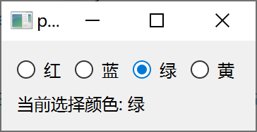
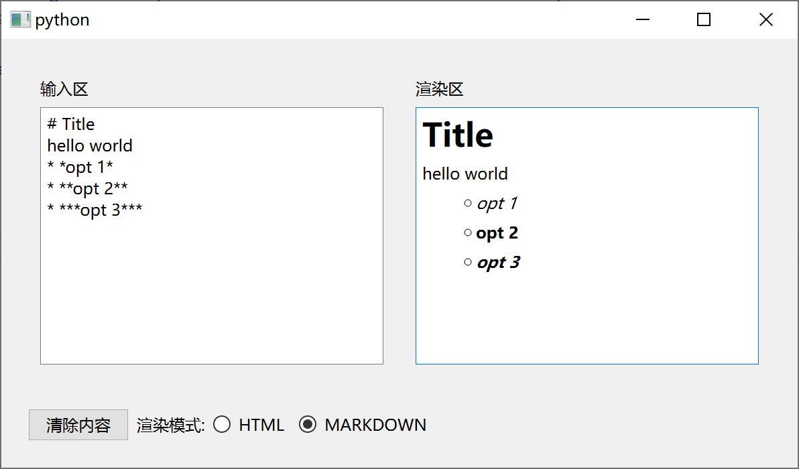
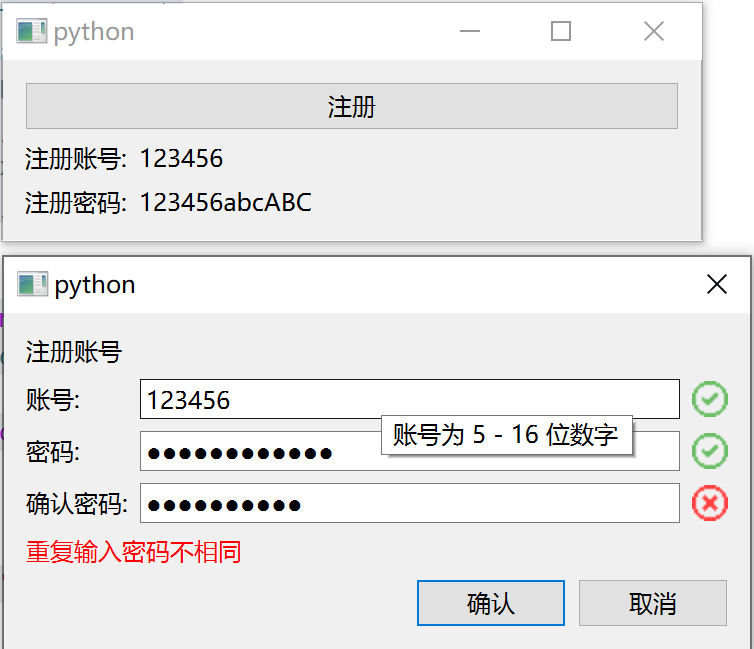
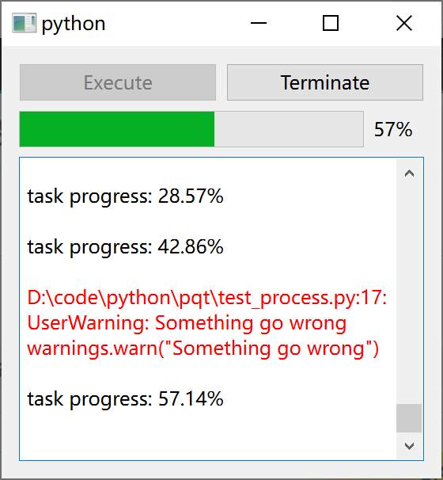

# Qt 程序示例与范式总结
## 基础使用
### 范式总结
* [信号槽机制](./base.md#信号槽机制)
    * 变量监听方法参见[枚举量绑定按钮组](#枚举量绑定按钮组)
        * 应当将被监听变量设为私有, 并定义访问方法, 修改槽函数, 监听信号
        * 以 `None` 声明变量, 并在最后通过槽函数赋初值
        * 与组件行为绑定时, 还需要定义对应的私有槽函数, 并在修改变量的同时更新组件
        * 在修改槽函数中, 应当包含
            * 判断是否为真修改 (新旧值是否相同)
            * 修改原始变量
            * 发出信号
            * 同步与变量绑定的子组件
    * 信号槽连接方法
        * 首先即通过信号实例的 `connect` 方法建立连接
        * 在连接后应当通过发出信号组件的有关方法定义初值 (不必担心重复初始化, 无论何种层级的组件都应当有此操作)
* [组件构建](./base.md#组件布局)
    * 自定义组件区的构造函数内容
        * 调用基类构造函数
        * 对输入参数进行初步处理
        * 定义所有子组件并在定义后设置基本样式
        * 组件布局
            * 从底层级向高层级布局 (如果复杂则应拆分为自定义组件区)
            * 布局先定义布局引擎, 再插入组件, 最后设置布局引擎
            * 调用 `setLayout` 使布局生效
        * 各个子组件之间的信号槽连接, 并设置组件的初值
        * 组件初始化设置
* 命名规范
    * 子组件以及相应数据结构命名
        * 使用小写开头, 大写区分间隔
        * Qt 原生组件或自定义实用组件使用缩写 (名称前两个单词首字母) + 功能组合作为成员名 (结合 IDE, 快速定位组件)
        * 自定义组件区使用全称作为成员名        
    * 组件方法命名 (包括信号)
        * 使用大写开头, 大写区分间隔 (与继承的原生组件方法区分)
        * 槽方法以 `Set` 开头, 信号以名词开头, 一般方法以动词开头
    * 其他
        * 与组件无直接关系的成员与方法实用小写字母, 下划线区分间隔 (与 Python 标准一致)
        * 布局引擎同组件, 但使用 `layout` 为开头, 后接功能

### 枚举量绑定按钮组
```python
from PySide6.QtCore import Slot, Signal
from PySide6.QtWidgets import (
    QApplication, QWidget, QRadioButton, QButtonGroup, QAbstractButton,
    QBoxLayout, QLabel,
)
from enum import Enum
from typing import Union, Sequence, Optional, Iterable, Any

class Color(Enum):
    Red = 0
    Green = 1
    Blue = 2
    Yellow = 3
ColorName = {
    Color.Red: "红", 
    Color.Green: "绿", 
    Color.Blue: "蓝", 
    Color.Yellow: "黄"
}

# 实用类, 当需要将按钮组与枚举量相绑定时, 可参考此类型的实现
class ValueBindButtonGroup(QButtonGroup):
    '''
    根据枚举类型信息, 生成对应的复选框按钮组组件
    '''
    def __init__(self, bind_enum: type, default_value: object, name_list: Optional[Union[dict[Any, str], Sequence[str]]] = None, button_widget: type = QRadioButton) -> None:
        '''
        * `bind_enum` 继承自 enum.Enum 类的枚举类型
        * `default_value` 默认选中值
        * `name_list` 按钮名称列表, 默认使用枚举类型的键名
        * `button_widget` 按钮组件类型, 默认使用 `QRadioButton`
        '''
        super().__init__()

        self._button_map: dict[object, QAbstractButton] = {}
        self._bind_enum = bind_enum
        self._enum_values = tuple(self._bind_enum.__members__.values())

        # 生成按钮并绑定
        if name_list == None:
            name_list = tuple(bind_enum.__members__.keys())
        elif isinstance(name_list, dict):
            name_list = tuple(name_list[key] for key in self._enum_values)

        for id, (key, value) in enumerate(zip(name_list, self._enum_values)):
            self._button_map[value] = button_widget(str(key))
            self._button_map[value].setCheckable(True)
            self.addButton(self._button_map[value], id)

        # 首先对被监控变量取空值, 并设为私有
        self._value = None
        # 使用私有槽, 将变量绑定到按钮组的结果上 (还需要反向绑定, 具体见下)
        self.idClicked.connect(self._SetValueByButton)
        # 通过给定方法, 给被监控变量赋初值
        self.SetValue(default_value)

    def value(self):
        '''
        获取当前选中值
        '''
        return self._value

    ValueChange = Signal(object)

    @Slot(object)
    def SetValue(self, new_value):
        '''
        设置当前选中值
        '''
        # 仅当变量与原先不同时, 属于一次有效的修改
        if new_value != self._value:
            if not isinstance(new_value, self._bind_enum):
                raise(Exception(f"Require Type {self._bind_enum} But Given {type(new_value)} Instead"))
            
            self._value = new_value
            # 通过信号监控变量改变
            self.ValueChange.emit(new_value)
            # 在修改函数中, 将按钮组反向绑定到按钮上
            self._button_map[new_value].click()

    @Slot(int)
    def _SetValueByButton(self, id):
        '''
        私有组件绑定槽
        '''
        new_value = self._enum_values[id]
        # 与 Clicked 信号绑定, 因此重复点击也肯能触发
        if new_value != self._value:   
            self._value = new_value 
            self.ValueChange.emit(new_value)

    def GetButton(self, value: object) -> QAbstractButton:
        '''
        获取枚举值对应的组件对象
        '''
        if not isinstance(value, self._bind_enum):
            raise(Exception(f"Require Type {self._bind_enum} But Given {type(value)} Instead"))
        return self._button_map[value]

    def IteratorButton(self) -> Iterable[tuple[object, QAbstractButton]]:
        '''
        获取按钮组件映射的迭代器
        '''
        return self._button_map.items()

class MainWindow(QWidget):
    def __init__(self) -> None:
        super().__init__()

        # 创建组件
        self.vbInput = ValueBindButtonGroup(Color, Color.Red, ColorName)
        self.lView = QLabel("选择颜色:")

        # 组件布局 
        # 从底至上布局, 如果过于复杂, 应当拆分为多个容器类
        self.layout_group = QBoxLayout(QBoxLayout.Direction.LeftToRight)
        for (value, button) in self.vbInput.IteratorButton():
            self.layout_group.addWidget(button)

        self.layout_base = QBoxLayout(QBoxLayout.Direction.TopToBottom)
        self.layout_base.addLayout(self.layout_group)
        self.layout_base.addWidget(self.lView)

        self.setLayout(self.layout_base)

        # 建立连接, 并使用被链接量的初值 (被链接量已初始化) , 调用槽函数完成初始化
        self.vbInput.ValueChange.connect(self.SelectColor)
        self.SelectColor(self.vbInput.value())
    
    @Slot(Color)
    def SelectColor(self, color):
        self.lView.setText(f"当前选择颜色: {ColorName[color]}")

app = QApplication()
win = MainWindow()

win.show()
app.exec()
``` 

运行效果


### 文本输入渲染程序
```python
from PySide6.QtCore import Slot, Signal
from PySide6.QtWidgets import (
    QApplication, QWidget, QTextEdit, QTextBrowser, QPushButton, QRadioButton, QButtonGroup, QLabel, QAbstractButton,
    QBoxLayout,
    QSizePolicy
)

from enum import Enum
from typing import Optional, Sequence, Iterable

class RenderMode(Enum):
    HTML = 0
    MARKDOWN = 1

class ValueBindButtonGroup(QButtonGroup):
    ... # 具体见枚举量绑定按钮组

class InputArea(QWidget):
    '''
    输出区
    '''
    updateText = Signal(str)

    def __init__(self) -> None:
        super().__init__()

        self.teInput = QTextEdit()
        self.teInput.setPlaceholderText("输入内容")

        self.layoutBase = QBoxLayout(QBoxLayout.Direction.TopToBottom)
        self.layoutBase.addWidget(QLabel("输入区"))
        self.layoutBase.addWidget(self.teInput)

        self.setLayout(self.layoutBase)

        self.teInput.textChanged.connect(lambda: self.updateText.emit(self.teInput.toPlainText()))
        self.teInput.setPlainText("")

class RenderArea(QWidget):
    '''
    渲染显示区
    '''
    def __init__(self) -> None:

        super().__init__()

        self.tbRender = QTextBrowser()

        self.layoutBase = QBoxLayout(QBoxLayout.Direction.TopToBottom)
        self.layoutBase.addWidget(QLabel("渲染区"))
        self.layoutBase.addWidget(self.tbRender)

        self.setLayout(self.layoutBase)

        self.renderMode = None

        self.SetRenderMode(RenderMode.HTML)
        self.SetRenderText("")

    @Slot(RenderMode)
    def SetRenderMode(self, mode):
        if self.renderMode != mode:
            self.renderMode = mode
            self.SetRenderText(self.tbRender.toPlainText())

    @Slot(str)
    def SetRenderText(self, text):
        if self.renderMode == RenderMode.HTML:
            self.tbRender.setHtml(text)
        elif self.renderMode == RenderMode.MARKDOWN:
            self.tbRender.setMarkdown(text)
        else:
            self.tbRender.setHtml("<font color='red'>Unknown Render Mode</font>")

class MainArea(QWidget):
    '''
    程序主要区域
    '''
    def __init__(self) -> None:
        super().__init__()

        self.inputArea = InputArea()
        self.renderArea = RenderArea()

        self.layoutBase = QBoxLayout(QBoxLayout.Direction.LeftToRight)
        self.layoutBase.addWidget(self.inputArea)
        self.layoutBase.addWidget(self.renderArea)

        self.setLayout(self.layoutBase)

        self.inputArea.updateText.connect(self.renderArea.SetRenderText)
        self.inputArea.teInput.setPlainText("")

class ControlArea(QWidget):
    '''
    程序控制区域
    '''
    def __init__(self) -> None:
        super().__init__()
        
        self.pbClear = QPushButton("清除内容")
        self.vbMode = ValueBindButtonGroup(RenderMode, RenderMode.HTML)

        self.layoutBase = QBoxLayout(QBoxLayout.Direction.LeftToRight)
        self.layoutBase.addWidget(self.pbClear)
        self.layoutBase.addWidget(QLabel("渲染模式:"))
        self.layoutBase.addWidget(self.vbMode.GetButton(RenderMode.HTML))
        self.layoutBase.addWidget(self.vbMode.GetButton(RenderMode.MARKDOWN))

        self.setLayout(self.layoutBase)
        self.setSizePolicy(QSizePolicy.Policy.Fixed, QSizePolicy.Policy.Minimum)

class MainApp(QWidget):
    
    def __init__(self) -> None:
        super().__init__()

        self.controlArea = ControlArea()
        self.mainArea = MainArea()

        self.layoutBase = QBoxLayout(QBoxLayout.Direction.TopToBottom)
        self.layoutBase.addWidget(self.mainArea)
        self.layoutBase.addWidget(self.controlArea)

        self.setLayout(self.layoutBase)

        self.controlArea.vbMode.ValueChange.connect(self.mainArea.renderArea.SetRenderMode)
        self.controlArea.vbMode.SetValue(RenderMode.MARKDOWN)

        self.controlArea.pbClear.clicked.connect(self.mainArea.inputArea.teInput.clear)

app = QApplication()
win = MainApp()

win.show()
app.exec()
```

运行效果


### 登录会话程序
```python
from PySide6.QtCore import (
    Slot, Signal
)
from PySide6.QtWidgets import (
    QApplication,
    QPushButton, QLabel, QLineEdit,
    QDialogButtonBox,
    QFormLayout, QBoxLayout,
    QDialog, QWidget
)
from PySide6.QtGui import(
    QRegularExpressionValidator, QValidator, QPixmap, QPalette
)
from dataclasses import dataclass

@dataclass
class FormData:
    account: str = ""
    pw: str = ""

# 5 - 16 位数字
RE_ACCOUNT = r"^\d{5,16}$"
# 数字, 字母与特殊符号, 至少包含一个大写字母, 小写字母与数字, 8 - 20 位
RE_PW = r"^(?=.*[a-z])(?=.*[A-Z])(?=.*\d)[a-zA-Z\d$@$!%*?&]{8,20}$"

# 使用信号监控验证是否通过
class ValidLineEdit(QLineEdit):
    '''
    实现验证信号 ValidStateChange 的输入栏组件
    '''
    ValidStateChange = Signal(bool)

    def __init__(self):
        super().__init__()
        self._is_valid = None

        self._SetValidState(False)
        self.textChanged.connect(self._SlotCheckValid)

    def is_valid(self):
        return self._is_valid

    @Slot()
    def _SetValidState(self, is_valid):
        if self._is_valid != is_valid:
            self._is_valid = is_valid
            self.ValidStateChange.emit(self._is_valid)

    @Slot()
    def _SlotCheckValid(self):
        self._SetValidState(self.hasAcceptableInput())

# 通过继承布局的方式创建有关联的几个组件
class LineEditWithSignLayout(QBoxLayout):
    '''
    带有验证标识的输入栏布局
    '''
    # 图标路径
    # https://uxwing.com/green-checkmark-line-icon/
    YES_SIGN_PATH = "res/yes.svg"
    # https://uxwing.com/red-x-line-icon/
    NO_SIGN_PATH = "res/no.svg"

    def __init__(self):
        super().__init__(QBoxLayout.Direction.LeftToRight)

        self.label = QLabel(" ")
        self.label.setVisible(False)

        self.lineEdit = ValidLineEdit()

        self.addWidget(self.lineEdit)
        self.addWidget(self.label)
        # self.setLayout(self.layoutBase)

        font_size = int(self.lineEdit.font().pointSize() * 2)
        self.pmYes = QPixmap(self.YES_SIGN_PATH).scaled(font_size, font_size)
        self.pmNo = QPixmap(self.NO_SIGN_PATH).scaled(font_size, font_size)

        self.lineEdit.ValidStateChange.connect(self._SlotSetSign)
        self._SlotSetSign(self.lineEdit.is_valid())

    @Slot(object)
    def _SlotSetSign(self, is_valid):
        self.label.setVisible(True)

        if is_valid:
            self.label.setPixmap(self.pmYes)
        else:
            self.label.setPixmap(self.pmNo)

# 自定义验证器
class ValidatorImitator(QValidator):
    '''
    模仿已有输入栏的验证器
    '''
    def __init__(self, leObserved: QLineEdit) -> None:
        super().__init__()
        self.leObserved = leObserved
    
    def validate(self, arg__1, arg__2):
        res = None

        if arg__1 == self.leObserved.text():
            # 当内容与被模仿验证器相同时通过验证
            res = QValidator.State.Acceptable
        else:
            # 一般情况下, 使用被模仿验证器判断输入是否合法
            validator = self.leObserved.validator()
            if validator == None:
                res = QValidator.State.Intermediate
            else:
                if validator.validate(arg__1, arg__2)[0] != QValidator.State.Invalid: # type: ignore
                    res = QValidator.State.Intermediate
                else:
                    res = QValidator.State.Invalid
        return (res, arg__1, arg__2)

# 复杂会话窗口
class RegistDialog(QDialog):
    def __init__(self, parent: QWidget) -> None:
        super().__init__(parent)

        # 表单收集数据
        self._form_result = None

        # 账号输入栏
        lewsAccountInput = LineEditWithSignLayout()
        self.leAccountInput = lewsAccountInput.lineEdit
        self.leAccountInput.setPlaceholderText("输入账号")
        self.leAccountInput.setValidator(
            QRegularExpressionValidator(RE_ACCOUNT)
        )
        self.leAccountInput.setToolTip("账号为 5 - 16 位数字")

        # 密码输入栏
        lewsPwInput = LineEditWithSignLayout()
        self.lePwInput = lewsPwInput.lineEdit
        self.lePwInput.setPlaceholderText("输入密码")
        self.lePwInput.setValidator(
            QRegularExpressionValidator(RE_PW)
        )
        self.lePwInput.setEchoMode(
            QLineEdit.EchoMode.Password
        )
        self.lePwInput.setToolTip("密码为数字, 字母与特殊符号的组合, 至少包含一个大写字母, 小写字母与数字, 8 - 20 位")
        # 根据输入字符长度, 预留空间
        font_width = self.lePwInput.font().pointSize()
        self.lePwInput.setMinimumWidth(font_width * 30)

        # 再次输入密码
        lewsPwPardon = LineEditWithSignLayout()
        self.lePwPardon = lewsPwPardon.lineEdit
        self.lePwPardon.setPlaceholderText("再次输入密码")
        self.lePwPardon.setValidator(
            ValidatorImitator(self.lePwInput)
        )
        self.lePwPardon.setEchoMode(
            QLineEdit.EchoMode.Password
        )
        self.lePwPardon.setToolTip("密码为数字, 字母与特殊符号的组合, 至少包含一个大写字母, 小写字母与数字, 8 - 20 位")
        # 根据输入字符长度, 预留空间
        font_width = self.lePwInput.font().pointSize()
        self.lePwInput.setMinimumWidth(font_width * 30)

        # 会话按钮
        self.dbbButton = QDialogButtonBox()
        self.dbbButton.setStandardButtons(
            QDialogButtonBox.StandardButton.Ok |
            QDialogButtonBox.StandardButton.Cancel
        )
        self.dbbButton.button(QDialogButtonBox.StandardButton.Ok).setText("确认")
        self.dbbButton.button(QDialogButtonBox.StandardButton.Cancel).setText("取消")
        self.dbbButton.accepted.connect(self.SlotOKCheck)
        self.dbbButton.rejected.connect(self.reject)

        # 警告标签
        self.lWarn = QLabel(" ")
        # 设置标签字体颜色
        lWarnPalette = QPalette()
        lWarnPalette.setColor(QPalette.ColorRole.WindowText, "#FF0000")
        self.lWarn.setPalette(lWarnPalette)

        # 布局
        self.baseLayout = QFormLayout()
        self.baseLayout.addRow(QLabel("注册账号"))
        self.baseLayout.addRow("账号:", lewsAccountInput)
        self.baseLayout.addRow("密码:", lewsPwInput)
        self.baseLayout.addRow("确认密码:", lewsPwPardon)
        self.baseLayout.addRow(self.lWarn)
        self.baseLayout.addRow(self.dbbButton)
        self.setLayout(self.baseLayout)

        # 连接
        # 用于退出时清空已有数据, 无论是否接收
        self.finished.connect(self.ClearForm)

    # 在用户提交前, 对输入内容进行检查
    @Slot()
    def SlotOKCheck(self):
        if not self.leAccountInput.is_valid():
            self.lWarn.setText("账号不正确")
        elif not self.lePwInput.is_valid(): 
            self.lWarn.setText("密码不满足要求")
        elif not self.lePwPardon.is_valid(): 
            self.lWarn.setText("重复输入密码不相同")
        else:
            # 通过检查后, 收集表单数据, 并退出会话
            self._form_result = FormData(
                account = self.leAccountInput.text(),
                pw = self.lePwInput.text()
            )
            self.accept()
    
    def get_form_result(self):
        return self._form_result
    
    @Slot()
    def ClearForm(self):
        '''
        清空表单
        '''
        self.leAccountInput.clear()
        self.lePwInput.clear()
        self.lePwPardon.clear()

        self._form_result = None

class MainWin(QWidget):
    def __init__(self) -> None:
        super().__init__()

        self.dRegistForm = RegistDialog(self)
        self.pbRegiste = QPushButton("注册")
        self.lAccountInfo = QLabel("")

        self.lPwInfo = QLabel("")
        font_width = self.lPwInfo.font().pointSize()
        self.lPwInfo.setMinimumWidth(font_width * 30)

        self.layoutBase = QFormLayout()
        self.layoutBase.addRow(self.pbRegiste)
        self.layoutBase.addRow("注册账号:", self.lAccountInfo)
        self.layoutBase.addRow("注册密码:", self.lPwInfo)
        self.setLayout(self.layoutBase)

        self.dRegistForm.accepted.connect(self._SlotDialogAccept)
        self.pbRegiste.clicked.connect(self.dRegistForm.open)

    @Slot()
    def _SlotDialogAccept(self):
        res = self.dRegistForm.get_form_result()
        if res != None:
            self.lAccountInfo.setText(res.account)
            self.lPwInfo.setText(res.pw)

app = QApplication()
win = MainWin()

win.show()
app.exec()
```

运行效果


### 子进程管理程序
主程序
```python
from PySide6.QtGui import QCloseEvent
from PySide6.QtWidgets import (
    QWidget, QApplication, 
    QPushButton, QPlainTextEdit, QBoxLayout, QProgressBar
) 
from PySide6.QtCore import (
    QProcess, Slot
)
import time, warnings, re

# 匹配子进程关于进度的输出
progress_re = re.compile(r"task progress: ([.\d]+)%")
def progress_parser(output):
    m = progress_re.search(output)
    if m != None:
        return int(float(m.group(1)))
    else:
        return None

class MainWin(QWidget):
    def __init__(self) -> None:
        super().__init__()

        self.pbExecute = QPushButton("Execute")
        self.pbExecute.clicked.connect(self.OnExecuteProcess)

        self.pbTerminate = QPushButton("Terminate")
        self.pbTerminate.clicked.connect(self.OnTerminateProcess)
        self.pbTerminate.setEnabled(False)

        self.progressBar = QProgressBar()
        self.progressBar.setRange(0, 100)
        self.progressBar.reset()

        self.teOutput = QPlainTextEdit()
        self.teOutput.setReadOnly(True)

        self.p = None

        self.layoutButtons = QBoxLayout(QBoxLayout.Direction.LeftToRight)
        self.layoutButtons.addWidget(self.pbExecute)
        self.layoutButtons.addWidget(self.pbTerminate)

        self.layoutBase = QBoxLayout(QBoxLayout.Direction.TopToBottom)
        self.layoutBase.addLayout(self.layoutButtons)
        self.layoutBase.addWidget(self.progressBar)
        self.layoutBase.addWidget(self.teOutput)
        self.setLayout(self.layoutBase)

    def closeEvent(self, event: QCloseEvent) -> None:
        '''
        窗口关闭事件
        '''
        # 当窗口关闭时, 向子进程发出关闭信息, 让其保存数据
        if self.p != None:
            self.p.kill()
            self.p.waitForFinished()

    # 由于子进程每次运行后都要销毁, 可以通过一个方法专门用于创建与设置子进程
    def _CreateProcess(self, task_arg1):
        '''
        创建子进程对象
        '''
        p = QProcess(self)
        p.setProgram("python")
        # 将所有命令行参数转为字符串
        p.setArguments(("test_process.py", str(task_arg1)))
        p.finished.connect(self.OnProcessFinished)
        p.readyReadStandardOutput.connect(self._OnProcessOutput)
        p.readyReadStandardError.connect(self._OnProcessError)

        return p

    @Slot()
    def _OnProcessOutput(self):
        '''
        处理子进程标准输出
        '''
        if self.p != None:
            data = self.p.readAllStandardOutput()
            # 获取子进程的输出数据
            data = bytes(data.data()).decode()
            self.AppendLog(data)

            # 根据自程序的输出获取子进程的执行进度
            progress_value = progress_parser(data)
            if progress_value != None:
                self.progressBar.setValue(progress_value)
        else:
            warnings.warn("Invalid call")

    @Slot()
    def _OnProcessError(self):
        '''
        处理子进程标准错误
        '''
        if self.p != None:
            data = self.p.readAllStandardError()
            data = bytes(data.data()).decode()
            self.AppendWarn(data)

        else:
            warnings.warn("Invalid call")

    @Slot(str)
    def AppendLog(self, text):
        '''
        插入一般日志
        '''
        self.teOutput.appendPlainText(text)

    @Slot(str)
    def AppendWarn(self, text):
        '''
        插入警告
        '''
        self.teOutput.appendHtml(f"<font color='red'>{text}</font><br>")

    @Slot()
    def OnExecuteProcess(self):
        # 保证总是只有一个子进程, 每次运行相关方法时要检查子进程是否存在
        if self.p == None:
            self.AppendLog(f"Execute Start in {time.ctime()}")
            # 将创建的子进程作为成员保存
            self.p = self._CreateProcess(7)
            self.p.start()

            self.pbExecute.setEnabled(False)
            self.pbTerminate.setEnabled(True)
        else:
            warnings.warn("Process has running")

    @Slot()
    def OnTerminateProcess(self):
        if self.p != None:
            self.AppendWarn(f"Execute Terminate")
            self.p.kill()
        else:
            warnings.warn("Invalid call")

    @Slot()
    def OnProcessFinished(self):
        self.AppendLog(f"Execute End in {time.ctime()}")
        # 在子进程结束时, 销毁子进程对象
        self.p = None

        self.pbExecute.setEnabled(True)
        self.pbTerminate.setEnabled(False)
        self.progressBar.reset()

app = QApplication()
win = MainWin()

win.show()
app.exec()
```

其中 `test_process.py` 程序
```python
import time
import sys
import numpy

import warnings

def cout(text: str):
    # sys.stdout.write(text)
    # sys.stdout.flush()
    print(text, flush = True)

def task(i, run_times):
    cout(f"task progress: {i / run_times * 100:.2f}%")
    time.sleep(0.3)

    if i == 3:
        warnings.warn("Something go wrong")

if __name__ == "__main__":
    id = int(numpy.random.random() * 65536)

    run_times = 1
    try:
        run_times = int(sys.argv[1])
    except:
        run_times = 1

    cout(f"process {id} start in {time.ctime()}")
    for i in range(run_times + 1):
        task(i, run_times)

    cout(f"process {id} exit in {time.ctime()}")
```

运行效果

