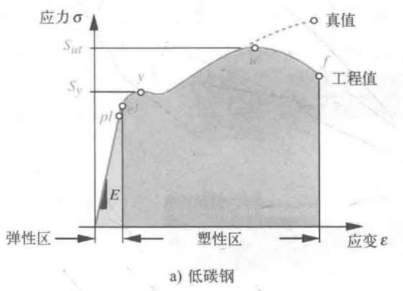
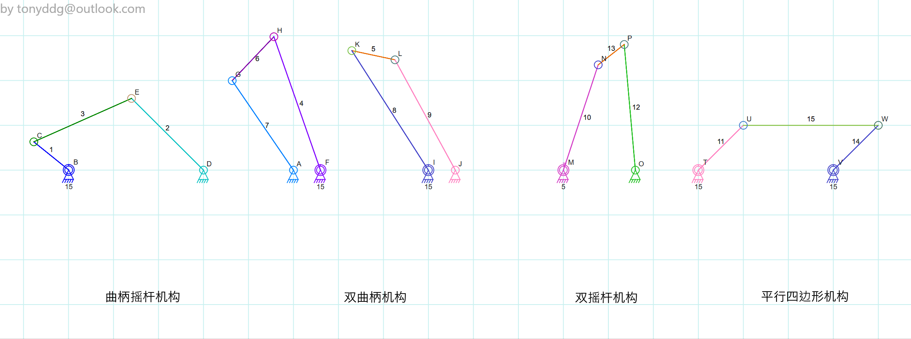
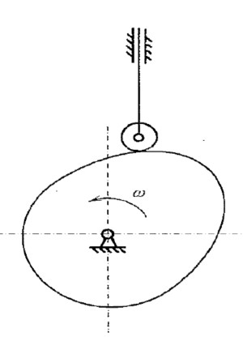

# 第二章 材料和工艺

## 拉伸试验
### 应力
$$\sigma=\frac{P}{A_0}$$
1. $P$ 载荷 单位 N
2. $A_0$ 原始截面

### 应变
$$\varepsilon=\frac{l-l_0}{l_0}$$
通过单位长度改变量表示

### 弹性模量
$$E=\frac{\sigma}{\varepsilon}$$

### 屈服强度
$S_y$ 屈服点处的应力, 屈服点后材料开始塑性变形

### 抗拉强度
$S_{ut}$ 开始出现缩颈前的应力, 即曲线上最大应力

## 塑性和脆性
### 塑性
1. 伸长率大于 5%
2. 可以任意弯曲

### 脆性
1. 没有明显屈服点
2. 断裂处没有缩颈

## 扭转实验
### 剪切模量
$$\tau=\frac{Gr\theta}{l_0}$$
1. $\tau$ 剪切应力
2. $r$ 式样半径
3. $l_0$ 标距初始长度(沿式样圆柱母线做标距)
4. $\theta$ 扭转角度
5. $G$ 剪切弹性模量/刚性模量

### 泊松比
$$G=\frac{E}{2(1+v)}$$
1. $E$ 弹性模量
2. $v$ 泊松比 表示横向应变与纵向应变的比值
3. 大多数材料为 0.3

## 耐冲击
### 应变能密度
$$U_0=\int_0^{\varepsilon}\sigma d\varepsilon=\int_0^l\frac{Pdl}{A_0l_0}$$
* 通过对拉伸曲线积分, 得到应变能密度
* 使用应变能密度, 反应材料的耐冲击性能

### 回弹
$$U_R=\int_0^{\varepsilon_{el}}\sigma d\varepsilon=\frac{1}{2}\frac{S_y^2}{E}$$
* 在弹性形变范围内的区域积分
* 材料单位体积吸收能量而不产生永久形变的能力叫回弹
* 对应图中浅色部分

### 韧性
$$U_T=\int_0^{\varepsilon_{f}}\sigma d\varepsilon\approx\frac{S_y+S_{ut}}{2}\varepsilon_{f}$$
* 采用近似结果
* 材料断裂前单位体积吸收的最大能量
* 对应图中阴影部分

# 第三章 运动与受力分析
## 自由度
称为 DoF, 即 Degree of Freedom, 即定义物体在空间位置所需的坐标数, 包括坐标与旋转姿态

### 连杆
==任意形状==的刚体, 具有一定数量的节点

### 约束 (运动副) 的自由度
判断约束的自由度可通过固定约束中的一个物体下, 另一个物体的自由度来判断

### 自由度的简单估计
$$DoF=m(L-1-i)+\sum{f_i}$$
* $L$ 连杆的个数, 包括地面
* $m$ 二维取 3, 三维取 6
* $i$ 约束 (运动副) 的个数
* $f_i$ 约束的自由度
* 仅为估计公式, 不一定正确

## 平面四杆机构

### Grashof 不等式
对于四杆机构, 有以下不等式
$$S+L\le P+Q$$
* $S$ 最短杆
* $L$ 最长杆
* $P,Q$ 剩余杆
* 当不满足此不等式时, 没有杆可以做圆周运动
* 当等号满足时, 为平行四边形机构
* 当满足不等式时, 长度最小的杆一定能做圆周运动

### 典型 Grashof 机构
#### 曲柄摇杆机构
最短的杆为曲柄, 能做圆周运动, 可将转动转化为摆动

#### 双曲柄机构
* 最短杆为地面(机架), 由于机架无法转动, 因此体现为其他三个杆做圆周运动
* 其中一个杆做匀速运动时, 相对杆做非匀速运动

#### 双摇杆机构
* 最短杆的对面杆为机架 
* 电机无法驱动最短杆, 因此仅用电机无法实现圆周运动

#### 平行四边形机构
存在奇异点, 即所有杆共线时, 两个短杆可以通向转动, 也可反向转动, 此时运动状态在数学上不确定

### 曲柄滑块机构
* 将其中一根摇杆视为无限长, 即得到曲柄滑块机构
* 曲柄滑块机构中, 有两根无限长的杆 (摇杆与机架), 因此属于平行四边形机构, 存在奇异点
* 滑块向一个方向移动, 驱动初始状态为共线(奇异点)的机构时, 无法确定曲柄的旋转方向

### 凸轮机构

可将凸轮机构等效为平面四杆机构
* 接触点瞬心可视为一个铰链
