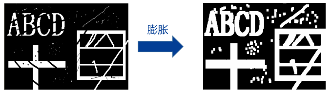
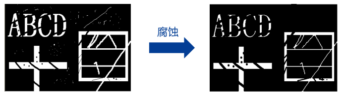

# 初级视觉
默认图片使用 8 位色深, 即灰度值取值范围为 0 ~ 255  

## 灰度变换
灰度变换即对图片的每一个像素的灰度 $r$ 使用 $s=T(r)$ 代替, 其中 $T(r)$ 即灰度变换函数  

当 $T(r)$ 超过灰度值的取值范围时, 小于 $0$ 的灰度值使用 $0$ 代替, 大于 $255$ 的灰度值使用 $255$ 代替

直方图均衡化以及图像二值化也属于特殊的灰度变换, 关于其介绍见[直方图分析](#直方图分析)

### 线性变换
当 $T(r)$ 为一个关于灰度值 $r$ 的线性函数时, 称为线性变换, 常用的线性变换有
* 图像反转 $T(r)=255 - r$, 通过该变换可得到图片的底片
* 灰度拉伸 $T(r)=\frac{255}{b}r$, 通过该函数, 可将灰度为 $0\sim b$ 的像素点的灰度拉伸到 $0\sim 255$, 以此增强被拉伸部分的对比度, 使图像的灰度分布更平坦
* 多段线性变换, 此时 $T(r)$ 为一个分段函数, 通过该方法可拉伸 (斜率大于 $1$) 与压缩特定段的灰度, 强调特定段灰度像素点 

### 伽马变换

人眼对于灰度的响应为对数规律, 即对灰度小的像素变化更敏感, 对灰度大的像素更不敏感  
因此可通过 $T(r)=cr^\gamma$ 的灰度变换修改图片的亮度

伽马变换的灰度变换函数中 $\gamma$ 为幂函数的指数, $c$ 为归一化系数  
归一化系数与 $\gamma$ 有关, 即对于任意的 $\gamma$, 都有 $T(255)=255,T(0)=0$  
也即当图片使用 $x=0\sim 1$ 的灰度时, 对于任意 $\gamma$ 均有 $c=1$

由幂函数的特性, 对于 $x=0\sim 1$ 范围内  
* 当 $0<\gamma<1$ 曲线上凸, 较小的灰度值被拉伸, 较大的灰度值被压缩, 因此图像亮度增大, 且 $\gamma$ 越接近 $0$ 图片亮度越被加大
* 当 $\gamma>1$ 曲线下凹, 与上凸相反, 此时图像亮度减小, 且 $\gamma$ 越远离 $1$ 图片亮度越被减小

### 查找表
对于 8 位灰度的图片, 可将 $s=T(r)$ 函数表示为一个输入值 $r$ 与输出值 $s$ 的查找表  
以此可以提高灰度变换的速度, 避免逐个像素计算

## 空间滤波
### 图像卷积
图像属于二维的离散系统, 以此定义图像的卷积运算为
$$F(x,y)=f(x,y)\otimes h(x,y)=\sum_{i}\sum_{j}f(x+i,y+j)h(i,j)$$

实际上, 与一维卷积相比, 图像的卷积运算缺少的翻转过程, 在数学上属于自相关计算, 但在图形学上为了计算方便认为以上运算即卷积运算 (或在图像卷积前翻转卷积核)

其中 $f(x,y)$ 为原图像, $h(i,j)$ 则称为**卷积核**  
一般卷积核可表示为 $2n+1\times 2n+1$ 的矩阵, 在卷积运算时的求和范围为 $-n\sim 0\sim n$, 即以卷积核的中心为锚点

* 图像卷积的本质即遍历整个图像, 遍历时将卷积核的锚点与遍历点重合, 对应点相乘并相加, 以结果作为遍历点的卷积结果
* 通过卷积运算, 原图像中与卷积核相似的区域将得到更大的卷积结果 (响应), 因此卷积的本质即搜索与强调图像中与卷积核相似的部分
* 在边缘点上, 当卷积核覆盖了图像外的区域时, 一般可以忽略这些边缘点或将图像外区域的像素值视为 $0$
* 通过选择合适的卷积核, 图像卷积可用于图像模糊 (滤波) 与图像锐化 (差分) 处理
    * 通常用于滤波的卷积核的元素和为 $1$ 以保持图片的平均像素值
    * 通常用于差分的卷积核的元素和为 $0$ 以去除图像的平均分量

### 均值滤波
对于 $3\times 3$ 的均值滤波具有卷积核
$$h(i,j)=\frac{1}{9}\begin{bmatrix}1&1&1\\1&1&1\\1&1&1\end{bmatrix}$$

* 均值滤波的本质即图像上一点以及周围几个像素的平均值代替原始像素
* 均值滤波会导致图像的轮廓模糊
* 一般用于去除噪声用于二值化

### 高斯滤波
对于 $3\times 3$ 的高斯滤波具有卷积核
$$h(i,j)=\frac{1}{16}\begin{bmatrix}1&2&1\\2&4&2\\1&2&1\end{bmatrix}$$

* 高斯滤波器的卷积核截取自高斯函数的部分区域
* 两次 $3\times 3$ 卷积核的高斯滤波相当于一次 $5\times 5$ 卷积核的高斯滤波
* 高斯滤波能较好去除白噪声

### 中值滤波
中值滤波不具有严格的卷积核, 中值滤波的在卷积时, 将以卷积范围内的中位数作为卷积结果

* 去除噪声的同时，比较好地==保留边缘==
* 能够有效去除脉冲噪声
* 能消除孤立的亮度或暗度
* 中值滤波为图像滤波最常用的方法

### 图像差分
对于离散的图像使用差分运算来表示图像的偏导有
$$G_x=\frac{\partial f}{\partial x}\approx\begin{cases}
\frac{f(x+1)-f(x)}{x+1-x},\text{前向差分}\\
\frac{f(x)-f(x-1)}{x-x+1},\text{后向差分}\end{cases}
$$

对于 $y$ 方向的偏导也有相同的运算, 而一个像素点的 $x,y$ 偏导则组成了图像梯度的两个梯度
$$\nabla f(x,y)=\begin{bmatrix}G_x&G_y\end{bmatrix}^T$$

* 图像梯度的绝对值反映了该像素点是否属于边缘
* 图像梯度的方向反映了该像素点所在边缘的方向

通过 Sobel 算子, 首先计算指定点像素值以及垂直差分方向的相邻像素的前后向差分之和, 在根据高斯滤波进行加权, 并将结果作为指定点的方向偏导  

通过图像卷积运算的方式表示, 对于 $x$ 方向偏导的 $3\times 3$ Sobel 算子的卷积核为
$$h_x(i,j)=\begin{bmatrix}-1&0&1\\-2&0&2\\-1&0&1\end{bmatrix}$$

* 对于 $y$ 方向的 Sobel 算子卷积核即 $x$ 方向卷积核的转置
* Sobel 算子计算的并不是实际的偏导, 而是相对值, 因此不需要再除以系数, 但这也表明差分运算的结果必定超出像素值的范围
* Sobel 算子的本质即差分运算加上高斯滤波, 对于噪声的敏感较低
* 一般使用 Sobel 算子计算图像的 $x,y$ 方向偏导, 组合即可得到图像的梯度

## 频域滤波
### 二维 DFT
二维傅里叶变换即将二元函数分解为不同频率的二维正弦曲面

通过对图像进行二维离散傅里叶变换 (2D-DFT), 可得到一个复数图像 $F(u,v)$, 图像的大小与原图像大小相同  

* 称 $\begin{Vmatrix}F(u,v)\end{Vmatrix}$ 为幅值谱, $\phase{F(u,v)}$ 为相位谱
* 变换结果 $F(u,v)$ 的值域范围为 $u\in[-W/2,W/2],v\in[-H/2,H/2]$ 并且越靠近 $(0,0)$ 越反应图像的高频分量  
* 为了观察, 一般将变换结果进行==中心化==, 使 $F'(u,v)$ 的原点即频谱的中心反应低频分量, 边缘反应高频分量  
* 频谱中心化后, $F'(0,0)$ 即图像的直流分量, 反映了图像的平均灰度 (未中心化的频谱直流分量即频谱图像数组的 $0,0$ 索引)
* 二维傅里叶变换的频谱 $F(u,v)$ 具有以下特性
    * 对称性 $F(u,v)=F(-u,-v)$
    * 旋转不变性 $f(x,y)$ 旋转一定角度则频谱 $F(u,v)$ 也将旋转相同的角度
    * 卷积特性 $DFT[f(x,y)\otimes g(x,y)]=F(u,v)\cdot G(u,v)$
    * 尺度变换
    * 平移特性

### 滤波器设计
* 通过图像的频谱 $F(u,v)$ 乘以滤波器的频域响应 $H(u,v)$ 可实现对图像的频率滤波
* 由于 DFT 的能量泄露问题, 直接使用理想滤波器 (直接截断) 将导致==振铃现象==, 因此一般使用没有振铃现象的高斯滤波器
* 高斯滤波器
    * 高斯低通滤波器的频域响应即二维高斯函数, 有 $H(u,v)=g(u,v)$  
    * 高斯高通滤波器则为 $H(u,v)=1-g(u,v)$
* 频域滤波的使用
    * 通过低通滤波器, 可以滤除图像的噪声, 使图像模糊
    * 通过高通滤波器则可以提取边缘与锐化图像

## 直方图分析
### 直方图分析方法
直方图分析即使用直方图统计的方法分析图像, 统计图像中灰度值位于各个统计组内的像素个数  
对于浮点像素值的图像还需要划分统计组范围, 但 8 位灰度图像一般直接以各个灰度值为一个统计组, 共 256 组

约定直方图统计中的参数
* $\lambda_i$ 为图片中灰度值在统计组 $i$ 内像素的出现的频次, 对于 8 位灰度图, $\lambda_i$ 即图片中灰度为 $i$ 的像素个数
* $m$ 直方图统计中统计组总数, 对于 8 为灰度图有 $m=256$
* $N$ 图片的总像素个数, 满足 $N=w\times h=\sum_{i=0}^m\lambda_i$
* $S$ 图片所有像素的灰度值之和, 满足 $S=\sum_{i=0}^m\lambda_i\times i$
* $\mu$ 图片的平均灰度值, 满足 $\mu=S/N$

对于选定的灰度值 $T$
* $N(T)$ 图片中灰度小于等于 $T$ 的像素个数, 满足 $N(T)=\sum_{i=0}^T\lambda_i=N(T-1)+\lambda_T$
* $S(T)$ 图片中灰度小于等于 $T$ 的像素灰度总和, 满足 $S(T)=\sum_{i=0}^T\lambda_i\times i=S(T-1)+\lambda_T\times T$
* $\mu(T)$ 图片中灰度小于等于 $T$ 部分的平均灰度值, 满足 $\mu(T)=S(T)/N(T)$
* $\omega(T)$ 图片中灰度小于等于 $T$ 像素的占比, 满足 $\omega(T)=N(T)/N$  
也可理解为图像中任取一个像素灰度值小于等于 $T$ 的概率, 即 $\omega(T)=P(T\ge x)$

通过直方图统计, 以从小到大的统计组为 $x$ 轴, 统计组中像素频数 $\lambda_i$ 为 $y$ 轴, 画出图像的直方图可以值观的看到图像的灰度分布情况
* 让图像的灰度分布变得均匀, 使图像的细节更明显即[直方图均衡化](#直方图均衡化)与[灰度变换](#灰度变换)的目标
* 当灰度分布呈双峰时, 表明物体与背景之间存在显著区别, 可通过[阈值分析](#阈值分析)区分图像的这两个部分

### 直方图均衡化
直方图均衡化为一种特殊的[灰度变换](#灰度变换), 其理论目标为使图像的灰度分布均匀, ==每个灰度值==拥有==相同==的像素个数, 此时图像的灰度值均匀分布具有最大的对比度  

对于均匀分布
* 图像的各个灰度值应当具有相同的概率密度函数, 也即各个灰度值出现的频数相同
* 图像的概率函数 $\omega(T)=P(T\ge x)$ 为一条直线

因此对于直方图均衡化中
* 由于图片的离散性, 只能通过使图像的概率函数尽可能接近一条直线, 以达到类似均匀分布的效果
* 但是对于实际图片, 一个灰度值对应了多个像素, 如果修改这写像素间的灰度值就, 图片将失真, 因此一组像素只能一起修改灰度值, 不能单独修改其中几个  
* 因此通过灰度变换完成直方图均衡化实质即需要找到一个合适的灰度变换函数 $T(r)$ 或灰度变换的映射

在程序实现时
1. 对图像进行灰度统计并计算出图像的概率函数 $\omega(T)$
1. 使用灰度变换函数 $T(r)=\operatorname{floor}[m\times \omega(r)]$ 对图像进行灰度变换  
    * $m$  为灰度级, 八位灰度图中 $m=256$
    * $\operatorname{floor}$ 为向下取整, 当 $\omega(r)=1$ 时, 取 $T(r)=m-1$
    * 程序实现时可先计算出查找表得出各个像素值的映射, 再对每个像素分别根据查找表变换
1. 经过以上灰度变换后, 即可使图像像素具有最接近均匀分布的灰度分布

关于以上程序的数学依据如下  
对于随机变量 $X\in(0,m]$ 有概率函数 $P(X\le k)=F(k)$, 注意 $F(k)$ 必定为一个值域为 $[0,1]$ 的单调递增函数  
因此有 $P[mF(X)\le mF(k)]=F(k)$, 定义新的随机变量 $X'=mF(X)$  
此时 $P[X'\le mF(k)]=F(k)$, 也可变形为 $P[X'\le k]=\frac{k}{m}$, 此时 $X'$ 满足均匀分布且取值范围与 $X$ 相同

### 阈值分析

理想情况下, 对于物体位于环境中时, 物体与环境部分的灰度都呈类正态分布, 因此图像的直方图呈双峰曲线  
通过寻找一个合适的阈值 $T$, 该阈值正好位于双峰中间的低谷, 将图像分割为背景与物体两个部分  
找到阈值后通常还会将小于阈值的像素值设为 $0$ 大于阈值的像素设为 $255$ 完成图像的分隔

根据阈值分割出的两个图像区域 $G_0$ 与 $G_1$, 具有各自的[直方图统计参数](#直方图分析方法)
* 对于像素值 $r$ 满足 $r\le T$ 的部分 $G_0$, 其统计参数 $N_0,S_0,\mu_0,\omega_0$ 与对应的统计函数求法相同
* 对于像素值 $r$ 满足 $r> T$ 的部分 $G_1$, 其统计参数满足 $N_1=N-N_0,S_1=S-S_0,\mu_1=S_1/N_1,\omega_1=N_1/N$

常用的有以下两种阈值获取方法 (即阈值标准)

迭代法中, 认为符合条件的阈值应当具有特性 
$$T=\frac{\mu_0+\mu_1}{2}=\frac{\frac{S(T)}{N(T)}+\frac{S-S(T)}{N-N(T)}}{2}$$

注意到阈值 $T$ 的条件与阈值本身有关, 因此可通过迭代的方式求出符合条件的阈值
* 求取开始时, 取初始阈值 $T=127$
* 统计阈值分割的两部分, 并计算新阈值 $T_{new}=\frac{\mu_0+\mu_1}{2}$
* 使用新阈值迭代, 直到两次迭代的阈值差小于允许误差 (对于 8 位灰度, 即两次圆整后的阈值相同)

大津法中, 认为图像使用阈值 $T$ 分割为两部分, 使用两部分的平均灰度 $\mu_0,\mu_1$ 代替这两部分的原有灰度, 对于满足条件的阈值, 图像将具有最大的方差, 即满足条件
$$\argmax\limits_{0\le T\le 255}\delta^2(T)=\omega_0(\mu-\mu_0)^2+\omega_1(\mu-\mu_1)^2=\omega_0\omega_1(\mu_0-\mu_1)^2$$

由[直方图分析方法](#直方图分析方法)可知, 通过 $T-1$ 的统计参数可求出 $T$, 因此只需要从 $0$ 开始遍历 $256$ 个灰度值, 使图像方差最大的灰度 $T$ 即符合大津法要求的阈值

## 二值形态学
二值形态学中, 一般以[二值化](#阈值分析)的图片作为输入分析, 将 $P=255$ 的像素点视为 $1$ (白色像素), 将 $P=0$ 的像素点视为 $0$ (黑色像素)

### 膨胀运算
对于输入图片 $A$ 与掩膜 (结构元) $B$ 的膨胀运算表示如下
$$[A\oplus B](x,y)=\bigvee\limits_{(i,j)\in B}A(x+i,y+j)\land B(i,j)$$

其中
* 符号 $\lor$ 表示或运算, $\bigvee$ 则表示对之后的所有表达式间进行或运算, $\land$ 表示与运算
* 对以上数学运算的解释为对于点 $P(x,y)$ 的运算
    * 首先将掩膜的锚点与点 $P$ 对齐
    * 当对齐后, 当掩膜与原图存在任意一对对应点均为 $1$, 则该点的运算结果为 $1$
    * 当对齐后, 掩膜为 $1$ 的点在原图中均为 $0$, 则该点的运算结果为 $0$

由于进过运算后二值图中为 $1$ 的区域一般会向外扩展, 因此称为膨胀

### 腐蚀运算
对于输入图片 $A$ 与的掩膜 (结构元) $B$ 的腐蚀运算表示如下
$$[A\ominus B](x,y)=\bigwedge\limits_{(i,j)\in B}A(x+i,y+j)\land B(i,j)$$

其中
* 符号 $\land$ 表示与运算, $\bigwedge$ 则表示对之后的所有表达式间进行与运算
* 对以上数学运算的解释为对于点 $P(x,y)$ 的运算
    * 首先将掩膜的锚点与点 $P$ 对齐
    * 当对齐后, 当任一掩膜为 $1$ 的点在原图的对应点不为 $1$ 时, 则该点的运算结果为 $0$
    * 当对齐后, 掩膜为 $1$ 的点在原图中均为 $1$, 则该点的运算结果为 $1$

由于进过运算后二值图中为 $1$ 的区域一般会向内收缩, 因此称为腐蚀

### 其他形态学运算
通过组合以上两个形态学运算可实现对图像的处理, 以下为常用的组合运算
* 开运算 $A\circ B=(A\ominus B)\oplus B$
    * 开运算中, 先进行腐蚀再进行膨胀
    * 用于消除二值图片中细小的区域 (通过先腐蚀消除, 再使用膨胀还原)
    * 也可以平滑值为 $1$ 区域的边缘 
* 闭运算 $A\bullet B=(A\oplus B)\ominus B$
    * 闭运算中, 先进行膨胀再进行腐蚀
    * 用于填充值为 $1$ 区域的空洞 (通过先膨胀填充, 再使用腐蚀还原)
    * 也可以平滑值为 $1$ 区域的边缘 
* 形态学边缘 $(A\oplus B)-(A\ominus B)$
