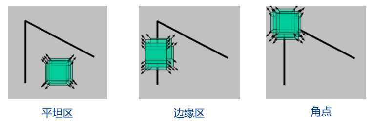
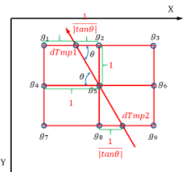
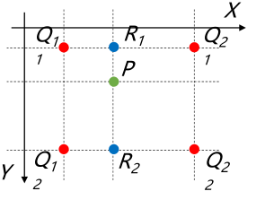
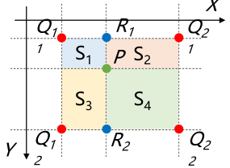
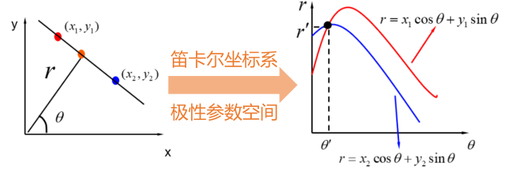

# 中级视觉
## Harris 角点检测
### 角点检测原理

在数学上定义角点时, 规定一个以点 $P$ 为中心的窗口 $W$, 当窗口沿任意方向移动时, 窗口内的灰度均发生了明显变化, 则认为点 $P$ 为一个角点  
* 当窗口沿任意方向移动灰度变化小, 则为平坦区
* 当窗口沿特定方向移动灰度变化大, 垂直方向变化小, 则为边缘区
* 当窗口沿任意方向移动灰度变化大, 则为角点

衡量窗口灰度变化时使用如下误差函数

$$E(u,v)=\sum_{(x,y)\in W}\omega(x,y)[F(x+u,y+v)-F(x,y)]^2$$

其中
* $u,v$ 为窗口的移动距离
* $F(x,y)$ 为原始图像上点 $x,y$ 的像素值
* $\omega(x,y)$ 为加权函数, 通常即[高斯滤波](./ch1.md#高斯滤波)卷积核
* 公式即使用窗口移动前后对应点误差的平方和衡量灰度变化

### 区域特征值与特征向量
根据泰勒展开
$$F(x+u,y+v)\approx F(x,y)+u\frac{\partial F}{\partial x}\big|_{x,y}+v\frac{\partial F}{\partial y}\big|_{x,y}$$

使用 [Sobel 算子](./ch1.md#图像差分)得到的图像梯度代替其中的导数, 可得此时对应点 $(x,y)$ 的误差的平方和满足 (注意其中的矩阵不是二阶偏导矩阵)
$$\begin{split}
[F(x+u,y+v)-F(x,y)]^2&\approx \Bigg[\begin{bmatrix}G_x&G_y\end{bmatrix}_{(x,y)}\begin{bmatrix}u\\ v\end{bmatrix}\Bigg]^2\\
&\approx \begin{bmatrix}u& v\end{bmatrix} 
\begin{bmatrix}
G_x^2& G_xG_y\\
G_xG_y& G_y^2
\end{bmatrix}_{(x,y)}
\begin{bmatrix}u\\ v\end{bmatrix}
\end{split}$$

通过泰勒展开可排除 $E(u,v)$ 中移动位置的影响 ($\begin{bmatrix}u& v\end{bmatrix}$ 可视为常数提出), 定义自相关系数矩阵 $\bm{M}$ 满足 (注意 $\bm{M}$ 为窗口中一系列梯度矩阵的加权和)
$$\bm{M}=\sum_{(x,y)\in W}\omega(x,y)\begin{bmatrix}
G_x^2& G_xG_y\\
G_xG_y& G_y^2
\end{bmatrix}_{(x,y)}$$

将自相关系数矩阵相似对角化后, 此时的误差函数满足
$$\begin{split}
E(u,v)&\approx\begin{bmatrix}u& v\end{bmatrix}\bm{M}\begin{bmatrix}u\\ v\end{bmatrix}\\
&\approx \begin{bmatrix}u& v\end{bmatrix}\bm{Q}\begin{bmatrix}\lambda_1&\\&\lambda_2\end{bmatrix}\bm{Q}^{T}\begin{bmatrix}u\\ v\end{bmatrix}
\end{split}$$

因此像素点 $P(x,y)$ 的误差函数 $E(u,v)$ 可以近似为一个二次型, 二次型的特征值 $\lambda_1,\lambda_2$ 反映了窗口随不同方向移动时误差变化的最快与最慢方向, 由[角点的数学定义](#角点检测原理)可知
* 当 $\lambda_1,\lambda_2$ 均很小时, 为平坦区
* 当 $\lambda_1$ 很大, $\lambda_2$ 很小时, 为边缘区
* 当 $\lambda_1,\lambda_2$ 均很大时, 为角点

### 角点响应函数
在实际使用时, 在得到自相关系数矩阵 $\bm{M}$ 一般通过以下角点响应函数 $R$ 判断其是否满足角点的特点, 函数值越大表明约有可能是角点
* $R(\bm{M})=\det(\bm{M})-\alpha\operatorname{tr}^2(\bm{M})=\lambda_1\lambda_2-\alpha(\lambda_1+\lambda_2)^2,\alpha\approx 0.06$
* $R(\bm{M})=\lambda_1-\alpha\lambda_2,\alpha\approx 0.05$

取大于阈值部分的局部最大值点作为检测到的角点

## Canny 边缘检测
### 边缘检测准备
在进行边缘检测前, 首先需要用[高斯滤波](./ch1.md#高斯滤波)去除图像的噪声  

之后还需要使用 [Sobel 算子](./ch1.md#图像差分)计算出图像各点沿 $x,y$ 方向的差分 $G_x,G_y$  
通过两个方向的差分可以计算出图像的图像的梯度大小 $S$ 及方向 $\theta$ 满足  

$$\begin{cases}
S=&\sqrt{G_x^2+G_y^2}\\
\theta=&\operatorname{Arctan}(G_y,G_x)
\end{cases}$$

### 非极大值抑制
根据导数的特点, 当函数在点 $P$ 上有最大的变化率时, 其一阶导数必定在 $P$ 处有极值  
非极大值抑制正是基于这一原理筛选出可能的边缘点

对于像素点 $P$ 的梯度方向 $\theta$, 使用如图所示的方法, 通过 $P$ 八邻域内的像素点插值得到 $P$ 梯度方向上==前后两点==的梯度大小  
然后比较 $P$ 与其前后两点的梯度大小, 当 $P$ 的梯度 $S$ 大于前后两点则作为可能的边缘点保留

### 双阈值滤波
对于非极大值抑制中得到的边缘点进行滤波

* 对于阈值下界 $T_1$ 与上界 $T_2$ 
* 梯度大于上界的必定为边缘点
* 小于下界的必定不是边缘点
* 在上下界中, 与边缘点相连的点也视为边缘点

## 纹理分析
纹理一般表述为图像强度局部变化的重复模式, 是图像粗糙性, 光滑性, 规则性等度量

### 灰度共生矩阵分析
灰度共生矩阵中的元素, 表示的是具有某种==空间位置关系==的两个像素灰度的==联合分布==  
对于 8 位灰度图片的一个方向, 灰度共生矩阵为 $\R^{256\times 256}$ 的矩阵

* 首先定义扫描方向 $(a,b)$, 通常共有 $0,45,90,135^\circ$ 四个扫描方向  
如 $a=1,b=0$ 表示沿 $0^\circ$ 方向扫描; $a=-1,b=1$ 表示沿 $135^\circ$ 方向扫描  
* 扫描点 $(x,y)$ 与扫描方向下的点 $(x+a,y+b)$ 的灰度组成灰度对 $(f_1,f_2)$
* 使用 $\R^{256\times 256}$ 的灰度共生矩阵, 矩阵中 $(i,j)$ 元素表示了灰度对 $(f_1,f_2)$ 出现的概率 (频次除以总对数)
* 通过对灰度共生矩阵的以下统计, 确定纹理特性
    * 角二阶矩 纹理细度
    * 熵 纹理随机性
    * 对比度 局部变化
    * 反差分矩阵 纹理规则程度

### 傅里叶频谱分析
通过观察纹理图片的中心化傅里叶频谱图可用于分析纹理的特性
* 对于纹理较粗的图像, 能量集中在离原点较近的范围内, 这些点有较大的幅值, 细纹理相反
* 对于条纹纹理, 使用阈值二值化的频谱图在垂直于图像纹理方向上, 将体现为一条直线带

### 局部二值分析
对于点 $P$ 的局部二值为
* 取出点 $P$ 半径为 $R$ 的圆形领域中的点
* 分别比较圆周点与中心点 $P$ 的灰度, 并由比较结果组成一个二进制序列作为局部二值结果
* 具有对比度与旋转不变性

### 自相关函数
* 求出图像自身对自身的卷积, 得到自相关函数
* 粗纹理自相关函数随距离增大下降速度较慢, 细纹理相反
* 如果纹理基元中灰度呈周期变化, 则自相关函数的升降也呈周期性变化

## 图像变形
### 图像变换矩阵
* 使用二维齐次变换矩阵 $\bm{T}$ 描述平移, 旋转, 缩放, 错切等基础变换  
输入图片 $F$ 与变换后的图片 $F'$ 之间满足 $F(\vec{p})=F'(\bm{T}\vec{p})$
* 图像变换时一般有以下使用 Inverse Warping 策略  
    * 遍历变换后的图片 $F'(\vec{p})$ 中的每一个像素点 (注意 $\vec{p}$ 的元素值为离散的)
    * 对于点 $\vec{p}$ 在变换后图片的像素值有 $F'(\vec{p})=F(\bm{T}^{-1}\vec{p})$
    * 由于 $F$ 中的已知点的坐标均为离散的整数, 但 $\bm{T}^{-1}\vec{p}$ 可能是小数, 因此需要插值

### 最近邻插值

* 当 $\vec{p}$ 坐标为小数时, 其必定落在网格的中间
* 对于一个网格的四个角点分别为四个灰度已知的原图像素点 $Q_{11},\dots,Q_{22}$
* 以四个角点中, 离点 $\vec{p}$ 最近的像素点的像素值作为插值结果
* 插值计算量小, 但马赛克效应较强

### 双线性插值

* 同上, $\vec{p}$ 将落在网格中, 且有四个邻近的已知像素点
* 通过做 $\vec{p}$ 的水平与垂直分线, 将网格划分为四个小块  
==角点对角位置==的小块面积体现了其对于点 $\vec{p}$ 取值的贡献
* 因此 $\vec{p}$ 的插值结果满足  
$F(\vec{p})=S_4\cdot F(Q_{11})+S_3\cdot F(Q_{21})+S_2\cdot F(Q_{12})+S_1\cdot F(Q_{22})$
* 插值计算量大, 但马赛克效应较小

## 霍夫变换
在霍夫变换前, 通常需要先使用 [Canny 算子](#canny-边缘检测)提取出二值化的边缘点, 再对二值化的点进行进一步处理

### 霍夫直线变换

对于方程 $r=x\cos\theta+y\sin\theta$
* 如果 $r,\theta$ 确定, 则该方程可以表示为一条直线  
参数 $r$ 反映了直线到原点的距离, 参数 $\theta$ 表示原点到垂足的方向角
* 如果 $x,y$ 确定, 则该方程可以表示为一条正弦曲线  
正弦曲线上的每一个点 $(r,\theta)$ 都可以作为一条过点 $(x,y)$ 的直线的参数

根据以上原理可以得到如下直线检测算法
1. 确定距离 $r$ 与角度 $\theta$ 的分辨率以及范围, 根据分辨率与范围得出统计刻度以及对应的统计表
1. 遍历边缘点, 对每个被遍历点 $(x,y)$ 得到对应的正弦曲线, 并计算各个 $\theta$ 刻度下对应的 $r$
1. 对于每个计算得到的 $(\theta,r)$ 都使统计表定义位置的计数加一
1. 将统计表称为图像的霍夫直线变换, 以其中大于给定阈值的点 $(\hat{r},\hat{\theta})$ 作为匹配到的直线结果

### 霍夫圆变换
略
