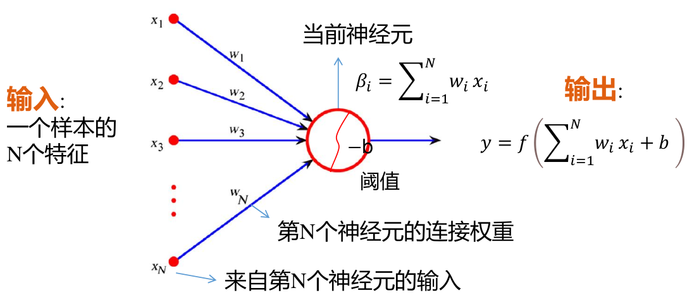
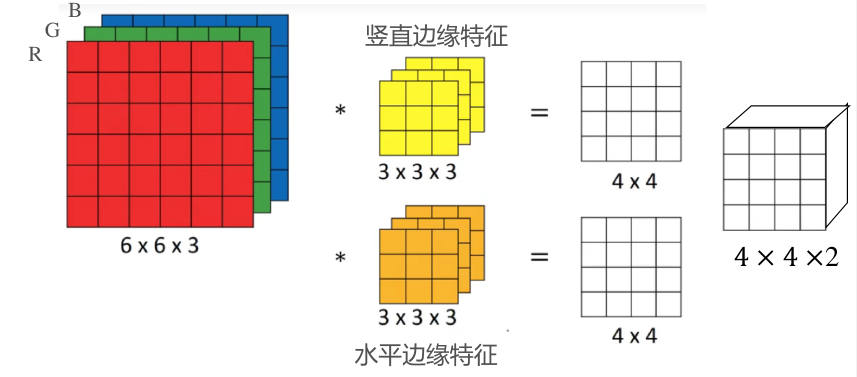

# 机器学习
## MLP 分类器
### 单神经元基本结构

单个神经元具有如图所示的结构
* 神经元接收来自上一层网络所有单元的输出
* 通过权重向量 $\vec{w}_i$ 乘以上层神经元的输出组成的向量 $\vec{x}$ 再加上偏置 $b_i$ 最后经过激活函数 $f(x)$ 得到该神经元的输出
* 神经元的权重向量 $\vec{w}_i$ 与偏置 $b_i$ 需要通过训练确定, 蕴含了模型在训练时习得的知识
* 激活函数一般有
    * $f(x)=\operatorname{sigmoid}(x)=\frac{1}{1+e^{-x}}$ 具有平滑的输出, 但导数绝对值小于 $1$, 存在梯度消失的问题
    * $f(x)=\operatorname{ReLU}(x)=\max(0,x)$ 没有梯度消失的问题

### 多隐藏层分类器

约定
* 分类器共有 $m$ 层隐藏层, 第 $i$ 层中共有 $k_i$ 个神经元
* 对于第 $i$ 层的神经元参数, 使用右上标 $[i]$ 表示
* 第 $i$ 层神经元中第 $p$ 个神经元的阈值为 $b^{[i]}_{p}$, 该层所有神经元的阈值组成阈值向量 $\vec{b}^{[i]}\in \R^{k_i\times 1}$
* 第 $i$ 层中第 $p$ 神经元对于上一层第 $q$ 个神经元有输入权重 $w^{[i]}_{p,q}$  
第 $i$ 层中第 $p$ 神经元的所有输入权重组成权重向量 $\vec{w}^{[i]}_{p}\in\R^{1\times k_{i-1}}$ (上一层共有 $k_{i-1}$ 个输出)  
第 $i$ 层神经元所有输入权重组成权重矩阵 $\bm{W}^{[i]}\in\R^{k_{i}\times k_{i-1}}$ (该层共有 $k_i$ 个神经元)  
第 $i$ 层神经元具有相同的激活函数 $f_i(\vec{z}^{[i]})$
* 第 $i$ 层神经元的所有加权输出组成==列向量== $\vec{z}^{[i]}\in\R^{k_{i}\times 1}$  
加权输出 $\vec{z}^{[i]}$ 经过激活函数后的实际输出组成==行向量== $\vec{a}^{[i]}\in\R^{1\times k_{i}}$
* 分类器的输出层使用 $o$ 表示, 同样有加权过程, 与激活函数, 类似的有 $\bm{W}^{[o]},\vec{b}^{[o]}$, 因此也可将其视为第 $m+1$ 层
* 分类器的输入为样本在特征空间中的行向量 $\vec{x}\in\R^{1\times k_{0}}$, 输出即输出层的加权输出列向量 $\vec{z}^{[o]}=\vec{o}\in\R^{k_o\times 1}$

多隐藏层分类器具有特点
* 由于各层单个神经元接收来自上一层的全部输入, 且不存在跨层链接, 因此称为 MLP 多隐藏层分类器, 或全连接网络, 前馈网络
* 当网络有至少一个隐藏层与足够的宽度, 能够逼近任何连续函数, 但需要大量参数, 并不现实 (万能近似定理)

### 正向传播过程
正向传播即各层的权重 $\bm{W}^{[i]}$ 与阈值 $\vec{b}^{[i]}$ 已知, 根据输入的样本特征向量 $\vec{x}$, 求出输出 $\vec{o}$

对于第 $i$ 隐藏层
$$\begin{cases}
\vec{z}^{[i]}=\bm{W}^{[i]}\vec{a}^{[i-1]}+\vec{b}^{[i]}\\
\vec{a}^{[i]}=f_i^T(\vec{z}^{[i]})\\
\end{cases}$$

其中
* 当 $i=1$ 将输入向量 $\vec{x}$ 视为 $\vec{a}^{[0]}$
* 取 $f_i^T$ 的目的为使之后的反向传播能满足矢量求导的要求

对于输出层有
$$\vec{o}=\vec{a}^{[o]}=f'(\bm{W}^{[o]}\vec{a}^{[m]}+\vec{b}^{[o]})$$

### 反向传播过程
反向传播即已知训练集中各个样本的特征向量 $\vec{x}_i$ 以及对应的理论输出 $\vec{y}_i$, 通过训练集中的已知条件训练出各层的权重 $\bm{W}^{[i]}$ 与阈值 $\vec{b}^{[i]}$ 

首先定义损失函数 $J(\vec{y},\vec{o})$ 以评估理论输出 $\vec{y}$ 相对分类器输出 $\vec{o}$ 的偏差
$$J(\vec{y},\vec{o})=\frac{1}{2}(\vec{y} - \vec{o})^2$$

当训练的模型符合要求时, 损失函数应为 $J(\vec{y},\vec{o})=0$, 因此模型的新参数应当使损失函数沿最快的方向下降  
损失函数相对参数的偏导数 $\frac{\partial J}{\partial w^{[i]}_{p,q}}$ 即反应了这一方向  
因此根据以下迭代公式, 可保证每次迭代参数都使损失函数沿减小方向移动
$$\begin{cases}
w^{[i]'}_{p,q}=w^{[i]}_{p,q}-\alpha\frac{\partial J}{\partial w^{[i]}_{p,q}}\\
b^{[i]'}_{p}=b^{[i]}_{p}-\alpha\frac{\partial J}{\partial b^{[i]}_{p}}
\end{cases}$$

其中 $\alpha$ 为训练的学习率, 通常取值范围 $\alpha\in[0,1]$, 学习率越大学习速度越快但模型越可能过拟合导致模型泛化误差大

对于偏导数 $w^{[i]'}_{p,q}$ 可通过链式法则与[矢量求导法则](../../math/hand_book/multivariate.md#矢量求导法则)得到, 具体见[附录](#附录-mlp-反向传播的推导)

## CNN 卷积神经网络
### 广义卷积运算
#### 边缘填充 

* 通常卷积时, 图像边界的信息参与运算的次数远小于中心参与卷积运算的次数, 导致边缘信息得不到有效利用  
* 为此可在图像的边缘填充 $0$, 对填充后的图像进行卷积运算, 这也能实现增大输出图像大小的效果  
* 使用参数 $p$ 表示填充量, $p$ 的值即单边填充像素的宽度, 图像的四边都将同时填充相同的宽度
* 对于传统卷积, $p=0$

#### 具有步长的卷积

* 通常卷积核在遍历扫描时每次只移动一个像素
* 通过指定步长参数 $s$, 使卷积核每次移动 $s$ 个像素, 能极大减小卷积结果的大小
*  对于传统卷积, $s=1$

#### 多通道卷积

* 对于多通道的输入图像, 卷积核也将具有与输入图像相同的通道数
* 卷积核依然沿平面运动, 且每次移动得到一个卷积结果
* 卷积运算时, 将根据卷积核所在位置, 计算出图像各通道的各点与卷积对应通道对应点的乘积和作为卷积结果

#### 卷积输入与输出图像的关系

对于 $(W\times H\times C)$ 的输入图像与 $f\times f\times C$ 的卷积核  
有卷积参数 $p, s$, 则卷积的输出图像大小为 
$$\Bigg[\frac{W-f+2p}{s}\Bigg]+1\times \Bigg[\frac{H-f+2p}{s}\Bigg]+1\times 1$$

其中 $[x]$ 为向下取整

### CNN 中的网络层
#### 卷积层

* 可以将卷积视为一种特殊的神经网络, 输出图像的每个像素视为一个节点
* 卷积核内的参数即神经网络的权重参数, 通过卷积核计算节点对应输入图像的一块像素区, 因此卷积层与一般全连接神经网络不同
    * 卷积层的一个节点仅连接上一层部分输入
    * 所有节点共用一个权重与偏置, 可以显著减小网络的参数数
* 一个卷积层可能还具有多个相同的卷积核, 卷积层的输出图像通道数即该卷积层的卷积核数量, 且每个卷积核还具有一个偏置
* 卷积层并不具有激活函数, 还需要人为添加激活函数层, 一般为 ReLu

#### 池化层
也称为降采样层

* 池化层为一种特殊的卷积层, 通常用于提取卷积结果中的有效信息并传入下一层
* 池化层的卷积核大小 $f$ 一般为偶数, 且具有与卷积核大小相同的步长 $s$, 没有填充 $p$  
卷积核的个数与输入图像的通道数相同, 即每个通道对应一个卷积核
* 池化层卷积以卷积核中所有输入的最大值作为输出 (最大值池化), 也有以输入的平均值作为输出 (均值池化)

#### 全连接层
对于输入图像经过多次卷积后, 一般会再拉伸为一维的特征向量, 并作为之后的全连接层输入

### CNN 的训练
#### 梯度下降参数
* Batch 一批数据  
训练前先将数据集划分为多批数据
* Iteration 一次训练  
每次训练将计算一整批数据的梯度, 再取平均值用于更新模型参数
* Epoch 一代训练  
使用所有训练数据完成一次训练

#### 梯度下降方法
* BGD 批量梯度下降  
将整个训练集视为一批数据, 梯度下降慢
* Mini-Batch 小批量梯度下降  
以指定的 Batch Size 作为一批数据的大小训练多代数据
* SGD 随机梯度下降  
以单个样本即一批数据, 每训练一个样本更新一次数据, 梯度下降方向随机且不一定最优

#### 正则化
如果模型参数太多, 训练样本又太少, 很容易产生过拟合  
需要使用正则化层对模型进行优化

* 数据正则化 Batch Normalization
* 随机断开连接 Dropout

## 附录: MLP 反向传播的推导
以下以第 $m$ 层为例有
$$
\frac{\partial J}{\partial w^{[m]}_{p,q}}=\frac{\partial J}{\partial \vec{o}}\cdot\frac{\partial \vec{o}}{\partial \vec{z}^{[o]}}\cdot\frac{\partial \vec{z}^{[o]}}{\partial \vec{a}^{[m]}}\cdot\frac{\partial \vec{a}^{[m]}}{\partial \vec{z}^{[m]}}\cdot\frac{\partial \vec{z}^{[m]}}{\partial w^{[m]}_{p,q}}
$$

根据[矢量求导法则](../../math/hand_book/multivariate.md#矢量求导法则)可得出各个部分的导数满足  

$$\begin{cases}
\frac{\partial J}{\partial \vec{o}}=(\vec{o}-\vec{y})\in\R^{1\times k_o}\\
\frac{\partial \vec{o}}{\partial \vec{z}^{[o]}}=\operatorname{diag}[f'_o(\vec{z}^{[o]})]\in\R^{k_o\times k_o}\\
\frac{\partial \vec{z}^{[o]}}{\partial \vec{a}^{[m]}}=\bm{W}^{[o]}\in\R^{k_o\times k_m}\\
\frac{\partial \vec{a}^{[m]}}{\partial \vec{z}^{[m]}}=
\operatorname{diag}[f'_m(\vec{z}^{[m]})]\in\R^{k_m\times k_m}\\
\frac{\partial \vec{z}^{[m]}}{\partial w^{[m]}_{p,q}}=\begin{bmatrix}0&\dots&a^{[m-1]}_q&\dots&0\end{bmatrix}^T\in\R^{k_{m}\times 1}
\end{cases}$$

其中
* 参数 $\bm{W},\vec{b}$ 来自迭代前模型
* $a^{[m-1]}_q$ 可通过迭代前模型正向传播得出
* 矢量 $\begin{bmatrix}0&\dots&a^{[m-1]}_q&\dots&0\end{bmatrix}^T$ 中, 非零元素 $a^{[m-1]}_q$ 位于第 $p$ 行
* 初始条件下, 通常令参数 $\bm{W},\vec{b}$ 为随机数

推广可得, 对于第 $i$ 层神经元的权重参数 $\partial w^{[m]}_{p,q}$ 相对损失函数的偏导数满足 (将输出层视为第 $m+1$ 层)
$$\frac{\partial J}{\partial w^{[i]}_{p,q}}=(\vec{o}-\vec{y})\bigg(\prod_{j=m+1}^{i+1}\operatorname{diag}[f'_j(\vec{z}^{[j]})]\bm{W}^{[j]}\bigg)\begin{bmatrix}0\\ \vdots\\ f'_i(z^{[i]}_p)a^{[m-1]}_q\\ \vdots\\ 0\end{bmatrix}$$

根据以上公式, 定义梯度行矢量 $\vec{\delta}^{[i]}\in\R^{1\times k_i}$ 满足
$$\begin{split}
\vec{\delta}^{[i]}&=(\vec{o}-\vec{y})\bigg(\prod_{j=m}^{i+1}\operatorname{diag}[f'_j(\vec{z}^{[j]})]\bm{W}^{[j]}\bigg)\\
&=
\begin{cases}
\vec{\delta}^{[i+1]}\operatorname{diag}[f'_{i+1}(\vec{z}^{[i+1]})]\bm{W}^{[i+1]}&,i<m\\
(\vec{o}-\vec{y})&,i=m+1
\end{cases}
\end{split}$$

此时系数 $\bm{W},\vec{b}$ 的梯度满足
$$\begin{cases}
\frac{\partial J}{\partial w^{[i]}_{p,q}}=\delta^{[i]}_pf'_i(z^{[i]}_p)a^{[m-1]}_q\\
\frac{\partial J}{\partial b^{[i]}_{p}}=\delta^{[i]}_pf'_i(z^{[i]}_p)
\end{cases}\to
\begin{cases}
w^{[i]'}_{p,q}=w^{[i]}_{p,q}-\alpha\delta^{[i]}_pf'_i(z^{[i]}_p)a^{[m-1]}_q\\
\bm{W}^{[i]'}=\bm{W}^{[i]}-\alpha\Big[\vec{a}^{[m-1]}\big(\vec{\delta}^{[i]}\operatorname{diag}[f'_j(\vec{z}^{[j]})]\big)\Big]^T\\
b^{[i]'}_{p}=b^{[i]}_{p}-\alpha\delta^{[i]}_pf'_i(z^{[i]}_p)
\end{cases}$$
