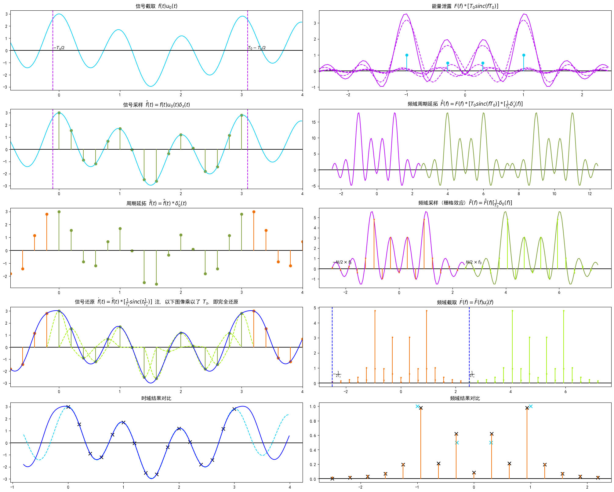

# 傅里叶变换
> 参考自教程 <https://www.bilibili.com/video/BV1Et411R78v>

## 三角函数系
对于函数集合
$$C={1,\sin x,\cos x,\sin 2x, \cos 2x, \dots, \sin nx, \cos nx}$$

称之为三角函数系

### 正交性
函数集合内的任取两个==不同==的函数在 $(-\pi,\pi)$ 上的卷积均为 $0$  
将这一性质称为正交性

观察函数图像可得, 对于 $\sin nx, \cos nx, n\in \{x\in Z\big| x\neq 0\}$ 均有
$$\int_{-\pi}^{\pi}\sin nx\mathrm{d}x=0,\int_{-\pi}^{\pi}\cos nx\mathrm{d}x=0$$

通过[积化和差公式](/course/math/hand_book/function.md#积化和差公式)可得, 以下卷积的结果均为 $0$
$$\sin nx*\cos mx=\sin nx*\sin mx=\cos nx*\cos mx=0(m\neq n)$$

### 同一函数卷积
当 $m=n\neq 0$ 时 (从 $C$ 中选取两个相同函数), 则有
$$\int_{-\pi}^{\pi}\sin^2 mx\mathrm{d}x=\frac{1}{2}\int_{-\pi}^{\pi}[-\cos(m+n)+1]\mathrm{d}x=\pi$$
$$\int_{-\pi}^{\pi}\cos^2 mx\mathrm{d}x=\frac{1}{2}\int_{-\pi}^{\pi}[\cos(m+n)+1]\mathrm{d}x=\pi$$

当取 $C$ 中的 $1$ 时, 则有
$$\int_{-\pi}^{\pi}\mathrm{d}x=2\pi$$

## 傅里叶级数
### 周期为 2π 的傅里叶级数
对于一个以 $2\pi$ 为周期的函数 $f(x)=f(x+2\pi)$

可以将其展开为傅里叶级数
$$f(x)=\frac{a_0}{2}+\sum_{n=1}^\infty [a_n\cos nx+b_n\sin nx]$$

根据三角函数的正交性  
对于 $1*f(x)$, 仅 $\frac{a_0}{2}$ 项的积分结果不为 $0$
$$\int_{-\pi}^{\pi}f(x)\mathrm{d}x=\frac{1}{2}a_0\int_{-\pi}^{\pi}\mathrm{d}x=\pi a_0$$

对于 $\cos nx*f(x)$, 仅 $a_n\cos nx$ 项的积分结果不为 $0$
$$\int_{-\pi}^{\pi}\cos nx\cdot f(x)\mathrm{d}x=a_n\int_{-\pi}^{\pi}\cos^2 nx\mathrm{d}x=\pi a_n$$

对于 $\sin nx*f(x)$, 仅 $b_n\sin nx$ 项的积分结果不为 $0$
$$\int_{-\pi}^{\pi}\sin nx\cdot f(x)\mathrm{d}x=b_n\int_{-\pi}^{\pi}\sin^2 nx\mathrm{d}x=\pi b_n$$

因此傅里叶级数中的系数满足
$$\begin{split}
a_0&=\frac{1}{\pi}\int_{-\pi}^{\pi}f(x)\mathrm{d}x\\
a_n&=\frac{1}{\pi}\int_{-\pi}^{\pi}\cos nx\cdot f(x)\mathrm{d}x\\
b_n&=\frac{1}{\pi}\int_{-\pi}^{\pi}\sin nx\cdot f(x)\mathrm{d}x
\end{split}$$

### 周期为 2L 的傅里叶级数
对于一个以 $2L$ 为周期的函数 $f(t)=f(t+2L)$

可以使用变量代换 $t=\frac{L}{\pi}x$ 将其转变为一个以 $2\pi$ 为周期的函数
$$g(x)=f(\frac{L}{\pi}x)\to g(x+2\pi)=f(\frac{L}{\pi}(x+2\pi))$$

因此将 $x=\frac{\pi}{L}t$ 带入 $g(x)$ 的傅里叶级数中, 即可得到 $f(t)$ 的傅里叶级数  
定义 $\omega_0=\frac{\pi}{L}$, 三角函数换元后有 
$$\sin nx=\sin n\omega_0 x,\cos nx=\cos n\omega_0 x$$  

积分换元后有
$$\int_{-\pi}^{\pi}g(x)\mathrm{d}x=\frac{\pi}{L}\int_{-L}^{L}f(t)\mathrm{d}t$$

因此对于周期为 $2L$ 的傅里叶级数有
$$\begin{split}
f(t)&=\frac{a_0}{2}+\sum_{n=1}^{\infty}[a_n\cos n\omega_0 t+b_n\sin n\omega_0 t]\\
a_0&=\frac{1}{L}\int_{-L}^{L}f(t)\mathrm{d}t\\
a_n&=\frac{1}{L}\int_{-L}^{L}\cos n\omega_0 t\cdot f(t)\mathrm{d}t\\
b_n&=\frac{1}{L}\int_{-L}^{L}\sin n\omega_0 t\cdot f(t)\mathrm{d}t
\end{split}$$

### 周期信号的傅里叶级数
在工程中, 信号为从 $0$ 开始, 以 $T$ 为周期的函数, 因此定义变换 (其中 $\omega_0$ 为**基频**)
$$T=2L,\omega_0=\frac{2\pi}{T}$$

易得对于周期为 $2T$ 的函数
$$\int_{-L}^{L}f(t)\mathrm{d}t=\int_{0}^{T}f(t)\mathrm{d}t$$

可以得到
$$\begin{split}
f(t)&=\frac{a_0}{2}+\sum_{n=1}^{\infty}[a_n\cos n\omega_0 t+b_n\sin n\omega_0 t]\\
a_0&=\frac{2}{T}\int_{0}^{T}f(t)\mathrm{d}t\\
a_n&=\frac{2}{T}\int_{0}^{T}\cos n\omega_0 t\cdot f(t)\mathrm{d}t\\
b_n&=\frac{2}{T}\int_{0}^{T}\sin n\omega_0 t\cdot f(t)\mathrm{d}t
\end{split}$$

### 例题


将如图所示的周期函数 $f(t)$ 分解为傅里叶级数

如图所示, $f(t)$ 有周期 $2L=20$, 取 $\omega_0=\frac{\pi}{L}=\frac{\pi}{10}$

如图, 函数在周期 $L$ 内可以视为一个分段函数, 因此积分时分段处理  
计算 $a_0$
$$a_0=\frac{1}{10}(\int_{0}^{10}7\mathrm{d}t+\int_{10}^{20}3\mathrm{d}t)=10$$

计算 $a_n$, 注意 $\sin(n\pi)=0(n\in Z)$
$$\begin{split}a_n&=\frac{1}{10}[\int_{0}^{10}7\cos(\frac{\pi}{10}nt)\mathrm{d}t+\int_{10}^{20}3\cos(\frac{\pi}{10}nt)\mathrm{d}t]\\
&=\frac{1}{10}[7\frac{10}{\pi}\sin(\frac{\pi}{10}nt)\big|_{0}^{10}+3\frac{10}{\pi}\sin(\frac{\pi}{10}nt)\big|_{10}^{20}]\\
&=0\end{split}$$

计算 $b_n$, 注意 $\cos(2n\pi)=1,\cos[(2n+1)\pi]=-1,\cos(n\pi)=(-1)^n,n\in Z$
$$\begin{split}b_n&=\frac{1}{10}[\int_{0}^{10}7\sin(\frac{\pi}{10}nt)\mathrm{d}t+\int_{10}^{20}3\sin(\frac{\pi}{10}nt)\mathrm{d}t]\\
&=\frac{1}{10}[-7\frac{10}{\pi}\cos(\frac{\pi}{10}nt)\big|_{0}^{10}-3\frac{10}{\pi}\cos(\frac{\pi}{10}nt)\big|_{10}^{20}]\\
&=\frac{1}{\pi}[7-7(-1)^{n}+3(-1)^{n}-3]\\
&=\frac{4-4(-1)^n}{\pi}\end{split}$$

综上可得
$$f(t)=5+\sum_{n=1}^{\infty}\frac{4-4(-1)^n}{\pi}\sin(\frac{\pi}{10}nt)$$

::: echarts f(t) 的傅里叶级数前 4 项叠加图像
```js
//需要绘制的函数曲线
function func1(x) {
  return 8 / Math.PI * Math.sin(Math.PI / 10 * x);
}
function func2(x) {
  return 8 / (3 * Math.PI) * Math.sin(Math.PI * 3 / 10 * x);
}
function func3(x) {
  return 8 / (5 * Math.PI) * Math.sin(Math.PI * 5 / 10 * x);
}
function func4(x) {
  return func1(x) + func2(x) + func3(x);
}

function generateData(fun, start, end, gap) {
  let data = [];
  for (let i = start; i <= end; i += gap) {
    data.push([i, fun(i)]);
  }
  return data;
}

option = {
  legend: {
  },
  xAxis: {
    name: 'x',
    type: 'value',
    axisLine: {
      symbol: ['none', 'arrow'],
    },
    axisTick: {
      inside: true
    }
  },
  yAxis: {
    name: 'y',
    type: 'value',
    axisLine: {
      symbol: ['none', 'arrow'],
    },
    axisTick: {
      inside: true
    },
  },
  series: [
    {
      name: 'b1',
      type: 'line',
      showSymbol: false,
      data: generateData(func1, 0, 30, 0.05)
    },
    {
      name: 'b2',
      type: 'line',
      showSymbol: false,
      data: generateData(func2, 0, 30, 0.05)
    },
    {
      name: 'b3',
      type: 'line',
      showSymbol: false,
      data: generateData(func3, 0, 30, 0.05)
    },
    {
      name: 'y=f\'(t)',
      type: 'line',
      showSymbol: false,
      data: generateData(func4, 0, 30, 0.05)
    }
  ]
}
```
:::

## 傅里叶变换推导
### 傅里叶级数的复数形式
#### 三角函数的复数形式
根据欧拉公式有
$$e^{i\theta}=\cos\theta+i\sin\theta$$

据此以及三角函数的奇偶性, 可将三角函数表示为复数形式  
$$\sin\theta=\frac{1}{2i}(e^{i\theta}-e^{-i\theta})=\frac{-i}{2}(e^{i\theta}-e^{-i\theta})$$  
$$\cos\theta=\frac{1}{2}(e^{i\theta}+e^{-i\theta})$$

#### 复数形式的展开
将复数形式的三角函数带入傅里叶级数  
$$\begin{split}
f(t)&=\frac{a_0}{2}+\sum_{n=1}^{\infty}[a_n\cos(n\omega_0 t)+b_n\sin(n\omega_0 t)]\\
&=\frac{a_0}{2}+\sum_{n=1}^{\infty}[\frac{a_n-ib_n}{2}e^{in\omega_0 t}+\frac{a_n+ib_n}{2}e^{-in\omega_0 t}]\\
&=\frac{a_0}{2}+\sum_{n=1}^{\infty}\frac{a_n-ib_n}{2}e^{in\omega_0 t}+\sum_{n=-\infty}^{-1}\frac{a_{-n}+ib_{-n}}{2}e^{in\omega_0 t}\\
&=\sum_{-\infty}^{\infty}C_n e^{in\omega_0 t}
\end{split}$$

现推导系数 $C_n$  
当 $n=0$
$$C_0=\frac{a_0}{2}=\frac{1}{T}\int_{0}^{T}f(t)\mathrm{d}t$$

当 $n>0$
$$\begin{split}
C_n&=\frac{a_n-ib_n}{2}\\
&=\frac{1}{T}\int_{0}^{T}f(t)\cdot[\cos(n\omega_0 t)-i\sin(n\omega_0 t)]\mathrm{d}t\\
&=\frac{1}{T}\int_{0}^{T}f(t)\cdot e^{-in\omega_0 t}\mathrm{d}t
\end{split}$$

当 $n<0$
$$\begin{split}
C_n&=\frac{a_{-n}+ib_{-n}}{2}\\
&=\frac{1}{T}\int_{0}^{T}f(t)\cdot[\cos(-n\omega_0 t)+i\sin(-n\omega_0 t)]\mathrm{d}t\\
&=\frac{1}{T}\int_{0}^{T}f(t)\cdot e^{-in\omega_0 t}\mathrm{d}t
\end{split}$$

综上可得, 复数傅里叶级数的系数 $C_n$ 对于任意 $n$ 均有同一个表达式
$$C_n=\frac{1}{T}\int_{0}^{T}f(t)\cdot e^{-in\omega_0 t}\mathrm{d}t$$ 

### 周期函数傅里叶级数的特点
根据傅里叶级数的复数表达, 在复平面上傅里叶级数的每一项中
1. $e^{in\omega_0 t}$ 体现了一个以 $n\omega_0$ 为角速度旋转的向量
1. $|C_n|$ 确定了这个向量的幅值
1. $\phase{C_n}$ 确定了这个向量在 $t=0$ 的相位角

因此周期函数的傅里叶本质上是将周期函数分解为频率为基频的整数倍 $n\omega_0$ 的无数个周期性旋转   
即==周期函数的频域以 $\Delta\omega=\omega_0$ 为间隔==

  

 

### 非周期函数的傅里叶级数
对于非周期函数 $f(t)$ 其周期 $T\to\infty$, 基频 $\omega_0\to 0$  
因此函数的频率分布之间的间隔 $\omega_0=\Delta\omega\to 0$, 此时==函数的频域连续分布==    
根据以下变换
$$n\omega_0\to\omega\quad\sum_{n=-\infty}^{\infty}s(n\omega_0)\to\int_{-\infty}^{\infty}s(\omega)\quad\frac{1}{T}=\frac{\Delta\omega}{2\pi}\to\frac{\mathrm{d}\omega}{2\pi}$$

带入 $f(t)$ 的傅里叶级数

$$\begin{split}
f(t)&=\sum_{n=-\infty}^{\infty}C_n e^{in\omega_0 t}\\
&=\frac{1}{T}\sum_{n=-\infty}^{\infty}(\int_{-\frac{T}{2}}^{\frac{T}{2}}f(t)e^{-in\omega_0 t}\mathrm{d}t)e^{in\omega_0 t}\\
&=\frac{\mathrm{d}\omega}{2\pi}\int_{-\infty}^{\infty}(\int_{-\infty}^{\infty}f(t)e^{-i\omega t}\mathrm{d}t)e^{i\omega t}\\
&=\frac{1}{2\pi}\int_{-\infty}^{\infty}(\int_{-\infty}^{\infty}f(t)e^{-i\omega t}\mathrm{d}t)e^{i\omega t}\mathrm{d}\omega
\end{split}$$

此时 $C_n$ 可以被表示成一个连续的函数 $F(\omega)$, 因此有
$$\begin{split}
f(t)=\mathscr{F}^{-1}[F(\omega)]&=\frac{1}{2\pi}\int_{-\infty}^{\infty}F(\omega)e^{i\omega t}\mathrm{d}\omega\\
F(\omega)=\mathscr{F}[f(t)]&=\int_{-\infty}^{\infty}f(t)e^{-i\omega t}\mathrm{d}t
\end{split}$$

其中  
$F(\omega)=\mathscr{F}[f(t)]$ 为傅里叶正变换  
$f(t)=\mathscr{F}^{-1}[F(\omega)]$ 为傅里叶逆变换

## 离散傅里叶变换
### 前提结论
#### 傅里叶变换的对称性
对于傅里叶变换对 $f(t)$ 与 $F(f)$ (注意此处采用的频域自变量单位为==频率==, 对于角频率还需要而外修正)
$$\mathscr{F}[f(t)]=F(f)$$

假设有信号具有与频谱相同的函数 $F(t)$  
则该信号的傅里叶变换满足
$$\mathscr{F}[F(t)]=f(-f)$$

#### 傅里叶级数与变换的联系
无论是傅里叶级数还是变换, 信号的频域特性均不变  
因此对于周期信号 $f(t)$ 的傅里叶级数与变换间满足关系 (注意 $f_0$ 为[基频], 单位为频率)
$$C_n=F(nf_0)\mathrm{d}f$$

根据冲激函数的性质, 可得周期信号的傅里叶变换为
$$F(f)=\sum_{n=-\infty}^{\infty}C_n\delta(f-nf_0)$$

#### 傅里叶变换的离散性
由[傅里叶级数与变换的联系](#傅里叶级数与变换的联系)得, 周期信号 $f(t)$ 的傅里叶变换 $F(f)$ 必定是离散的, 且间隔为 $f_0$, 即信号的频率  
根据[对称性](#傅里叶变换的对称性)还可以推出, 对于离散信号 $f_s(t)$ 的傅里叶变换 $F_s(f)$ 必定是周期性的, 且周期为 $\frac{1}{T_s}$, 即离散信号间隔 $T_s$ 的倒数

#### 脉冲信号的傅里叶变换
对于周期为 $T_s$ 的脉冲信号  
$$\delta_s(t)=\sum_{n=-\infty}^{\infty}\delta(t-nT_s)$$

其有复数傅里叶级数
$$C_n=\frac{1}{T_s}\int_{-\frac{T_s}{2}}^{\frac{T_s}{2}}\delta_s(t)e^{-j2\pi nt/T_s}\mathrm{d}t=\frac{1}{T_s}$$

因此 $C_n=\frac{1}{T_s}$ 为一个与 $n$ 无关的常数, 根据[傅里叶级数与变换的联系](#傅里叶级数与变换的联系), 可得其傅里叶变依然为一个脉冲函数
$$F(f)=\frac{1}{T_s}\sum_{n=-\infty}^{\infty}\delta(f-nf_s)=\frac{1}{T_s}\delta_{fs}(t)$$

#### 周期延拓
对于信号 $f(t)$, 根据卷积的特性, 将其与间隔为 $T_0$ 的脉冲函数 $\delta_0(t)$ 求卷积得到信号 $f_0(t)$ 必定为以 $T_0$ 周期  
特别的, 当 $f(t)$ 为宽度为 $T_0$ 的有限信号, $f_0(t)$ 为 $f(t)$ 在空间上的重复

$$\begin{split}(f*\delta_0)(t)&=\int_{-\infty}^{\infty}\delta_s(\tau)f(t-\tau)\mathrm{d}\tau\\
&=\int_{-\infty}^{\infty}\sum_{n=-\infty}^{\infty}f(t-\tau)\delta(\tau-nT_0)\mathrm{d}\tau\\
&=\sum_{n=-\infty}^{\infty}f(t-nT_0)
\end{split}$$

#### 约定
* 以下推导中采用 $\operatorname{sinc}(t)=\frac{\sin t}{t}$

### 信号采样
定义  
* 时域上周期无限长的信号 $f(t)$  
* 采样间隔为 $T_s$ 的信号采样脉冲 $\delta_s(t)=\sum_{n=-\infty}^{\infty}\delta(t-nT_s)$
* 截取信号的窗函数 $u_0(t)=h(t+\frac{T_s}{2})-h(t-\frac{T_s}{2}-T_0)$

通过采样脉冲对信号进行采样, 得到间隔为 $T_s$ 的离散信号 
$$f_s(t)=f(t)\delta_s(t)$$

仅采样 $t=-T_s/2\sim T_0-T_s/2$ 间共 $N$ 个信号, ==注意采样间隔 $T_s$ 与截取长度 $T_0$ 间满足 $T_s=NT_0$==  
相当于使用一个矩形窗函数 $u_0(t)$ 截取信号
$$\hat{f}(t)=f_s(t)u_0(t)=\sum_{n=0}^{N-1}f(t)\delta(t-nT_s)$$

此时 $\hat{f}(t)$ 便为一个可通过计算机处理的理想==有限离散信号==

### 频域采样
对于有限离散信号 $\hat{f}(t)$, 其傅里叶变换 $\hat{F}(f)$ 必定为连续的周期函数, 依然不利于计算机处理  
因此也需要对信号的傅里叶变换做采样  

根据[周期延拓](#周期延拓)的性质, 傅里叶变换最适合以信号宽度的倒数 $f_0$ 为间隔采样有  
$$\tilde{F}(f)=\hat{F}(f)\delta_0(f)$$

由傅里叶变换的卷积特性以及[脉冲函数的傅里叶变换](#脉冲信号的傅里叶变换)可得, 此频域采样也等价于将有限信号 $\hat{f}(t)$ 在空间上延拓, 每个周期 $-T_s/2\sim T_0+T_s/2$ 内即 $\hat{f}(t)$
$$\begin{split}\tilde{f}(t)&=\hat{f}(t)*\mathscr{F}^{-1}[\delta_0(f)]\\
&=T_0\sum_{r=-\infty}^{\infty}\hat{f}(t-rT_0)\\
&=T_0\sum_{r=-\infty}^{\infty}\sum_{n=0}^{N-1}f(t-rT_0)\delta(t-rT_0-nT_s)\\
&=T_0\sum_{r=-\infty}^{\infty}\sum_{n=0}^{N-1}f(nT_s)\delta(t-rT_0-nT_s)
\end{split}$$

此时 $\tilde{f}(t)$, 有周期 $T_0$, 可求出其傅里叶级数 (积分时直接取 $r=0, \hat{f}(t)$ 相同的周期)
$$\begin{split}C_k&=\frac{1}{T_0}\int_{-T_s/2}^{T_0+T_s/2}T_0\sum_{n=0}^{N-1}f(nT_s)\delta(t-nT_s)e^{-j2\pi kt/T_0}\mathrm{d}t\\
&=\sum_{n=0}^{N-1}f(nT_s)e^{-j2\pi knT_s/T_0}\\
&=\sum_{n=0}^{N-1}f(nT_s)e^{-j2\pi kn/N}
\end{split}$$

根据[傅里叶级数与变换的联系](#傅里叶级数与变换的联系), 可由此得到其傅里叶变换

{#tag-a .block_anchor}
$$\tilde{F}(f)=\sum_{k=-\infty}^{\infty}\sum_{n=0}^{N-1}f(nT_s)e^{-j2\pi kn/N}\delta(f-kf_0)\tag{a}$$

注意, 根据 $e^{-j2\pi (k+N)n/N}=e^{-j2\pi (n/N+1)}=1\cdot e^{-j2\pi n/N}$ (或[傅里叶变换的离散性](#傅里叶变换的离散性)) 可得, $\tilde{F}(f)$ 依然为一个周期函数, ==周期为 $f_s=Nf_0$==

因此使用离散序列 $\tilde{F}[k]$ 表示为

{#tag-b .block_anchor}
$$\tilde{F}[k]=\tilde{F}(kf_0)\mathrm{d}f=\sum_{n=0}^{N-1}f(nT_s)e^{-j2\pi kn/N}\tag{b}$$

### 逆变换
通过以上推导, 来自 $f(t)$ 的周期离散信号 $\tilde{f}(t)$ 的傅里叶变换 $\mathscr{F}[\tilde{f}(t)]=\tilde{F}(f)$ 已经求得, 现求其逆变换 $\mathscr{F}^{-1}[\tilde{F}(f)]=\tilde{f}(t)$

不难发现, $\tilde{F}(f)$ 与 $\tilde{f}(t)$ 均为离散周期函数  
因此可以尝试将 $\tilde{F}(f)$ 的周期分离, 使其与 $\tilde{f}(t)$ 具有相同的形式  
之后根据傅里叶变换的[对称性](#傅里叶变换的对称性)有 $\mathscr{F}[\tilde{F}(t)]=\tilde{f}(-f)$

对于序列 $\tilde{F}[k]=\tilde{F}(kf_0)$ 具有周期 $N$, 因此可令 $r=k+rN, k=0\sim N-1$  
现对 $\tilde{F}(t)$ 进行变形  
$$\begin{split}\tilde{F}(f)&=\sum_{k=-\infty}^{\infty}\sum_{n=0}^{N-1}f(nT_s)e^{-j2\pi kn/N}\delta(f-kf_0)\\
&=\sum_{r=-\infty}^{\infty}\sum_{k=0}^{N-1}\sum_{n=0}^{N-1}f(nT_s)e^{-j2\pi (k+rN)n/N}\delta(f-kf_0-rNf_0)\\
&=f_s\sum_{r=-\infty}^{\infty}\sum_{k=0}^{N-1}\Bigg[\frac{1}{f_s}\sum_{n=0}^{N-1}f(nT_s)e^{-j2\pi kn/N}\Bigg]\delta(f-kf_0-rf_s)
\end{split}$$

不难发现, 除 $\frac{1}{f_s}\sum_{n=0}^{N-1}f(nT_s)e^{-j2\pi kn/N}$ 部分外, 此时的 $\tilde{F}(t)$ 具有与 $\tilde{f}(t)$ 完全相同的形式  

根据离散序列 $\tilde{F}[k]$ 的定义可得, 此部分即
$$T_s\sum_{n=0}^{N-1}f(nT_s)e^{-j2\pi kn/N}=T_s\tilde{F}[k]$$

使用 $T_s\tilde{F}[n]$ 代替 $f(nT_s)$, $T_s$ 代替 $f_0$, 带入[式 a](#tag-a), 然后令 $k=-k, t=-t$ 有
$$\begin{split}\tilde{f}(-t)&=\sum_{k=-\infty}^{\infty}\sum_{n=0}^{N-1}T_s\tilde{F}[n]e^{-j2\pi kn/N}\delta(t-kT_s)\\
\tilde{f}(t)&=T_s\sum_{k=-\infty}^{\infty}\sum_{n=0}^{N-1}\tilde{F}[n]e^{-j2\pi (-k)n/N}\delta(-t+kT_s)\\
\tilde{f}(t)&=T_s\sum_{k=-\infty}^{\infty}\sum_{n=0}^{N-1}\tilde{F}[n]e^{j2\pi kn/N}\delta(t-kT_s)
\end{split}$$

同样的, 使用离散序列 $\tilde{f}[k]$ 表示为

$$\tilde{f}[k]=\tilde{f}(kT_s)\mathrm{d}t=T_s\sum_{n=0}^{N-1}\tilde{F}[n]e^{j2\pi kn/N}$$

### 离散傅里叶级数 DFS

将[式 b](#tag-b)带入 $\tilde{f}[k]$ 中的 $\tilde{F}[n]$ 有 (或根据[频域采样](#频域采样)步骤中 $f(t)$ 与 $\tilde{f}(t)$ 的关系可得到相同结论)
$$\begin{split}\tilde{f}[k]&=T_s\sum_{n=0}^{N-1}\sum_{m=0}^{N-1}f(mT_s)e^{-j2\pi nm/N}e^{j2\pi kn/N}\\
&=T_s\sum_{n=0}^{N-1}\sum_{m=0}^{N-1}f(mT_s)e^{j2\pi n(k-m)/N}\\
&=T_s\sum_{n=0}^{N-1}f(kT_s)\\
&=NT_sf(kT_s)
\end{split}$$

综上所述, 有离散傅里叶级数 ($DFS$) 变换对
$$\begin{cases}
\tilde{F}[k]=\frac{1}{NT_s}\sum_{n=0}^{N-1}\tilde{f}[n]e^{-j2\pi kn/N},&k\in Z\\
\\
\tilde{f}[k]=T_s\sum_{n=0}^{N-1}\tilde{F}[n]e^{j2\pi kn/N},&k\in Z
\end{cases}$$

序列 $\tilde{F}[k]$ 与 $\tilde{f}[k]$ 均为无限长序列, 且具有周期 $N$, 分别有分布间隔 $f_0=f_s/N$ 与 $T_s$

### 离散傅里叶变换 DFT
在实际使用中, 通常会直接使用采集到的离散数据序列 $f[k]$, 其定义即为
$$f[k]=f(kT_s), k\in[0,N)$$

由于计算机中的序列不可能无限长, 因此仅截取序列 $\tilde{F}[k]$ 一个周期 $N$ 内的值   
定义 $f[k]$ 的离散傅里叶变换为序列 $F[k]$ 满足 
$$F[k]=\tilde{F}[k], k\in[0,N)$$

规定 $T_s=1$, 使用 $f[k]$ 代替离散傅里叶级数中的 $\tilde{f}[k]=NT_sf[k]$  
因此有离散傅里叶变换 ($DFT$) 变换对 
$$\begin{cases}
F[k]=\sum_{n=0}^{N-1}f[n]e^{-j2\pi kn/N},&k\in [0,N)\\
\\
f[k]=\frac{1}{N}\sum_{n=0}^{N-1}F[n]e^{j2\pi kn/N},&k\in [0,N)
\end{cases}$$

### 信号复原
复原信号时, 可令 $kT_s=t$, 得到复原信号
$$f'(t)=\frac{1}{N}\sum_{n=0}^{N-1}F[n]e^{j2\pi tn/T_0}$$ 

由于 $F[k]$ 也经过 $f=-f_0/2\sim f_s-f_0/2$ 的截取  
因此复原得到的实际信号为 (对信号取绝对值)
$$f'(t)=|\tilde{f}(t)*[f_s\operatorname{sinc}(\pi f_s t)e^{-j2\pi f_ct/2}]|=\tilde{f}(t)*f_s\operatorname{sinc}(\pi f_s t)$$
其中 $f_c=(f_s-f_0)/2$ 可根据傅里叶变换的移频性自行推导

根据卷积特性可得 $f'(t)=f_s\sum_{k=-\infty}^{\infty}f[k]s(t-kT_s)$  
其中 $s(t)=\operatorname{sinc}(\pi f_s t)$, 且 $s(\frac{n}{T_s})=0(n\neq 0)/=1(n=0)$

因此 $k\in [0,N)$ 时必然有 $f'(kT)=f_sf(kT)$ 但其余部分无法保证, 但只要采样点 $N$ 足够多, 就能复原出原信号  
根据以上推导可得, $F[k]$ 复原得到的是 $f_s f(kT)$, 因此 $F[k]$ 反应的是 $f_s f(t)$ 的频域特性  
因此根据傅里叶变换的线性性, 对于 $FFT$ 的结果 $F[t]$, ==还需要取 $F'[k]=F[k]/f_s$ 才能得到接近实际傅里叶变换 $F(t)$ 的结果==

### DFT 与 DFS 的关系 
:::warning 以下部分为个人猜想, 有待证明
:::

通过离散傅里叶级数 $DFS$ 得到的结果为离散的==幅值谱==, 近似认为
$$F[k]\approx f_s\cdot \int_{(k-\frac{1}{2})f_0}^{(k+\frac{1}{2})f_0}F(f)\mathrm{d}f$$  

对于 $F[k]$ 与 $\tilde{F}[k]$ 可发现当输入序列相同时满足  
$$\tilde{F}[k]=f_0\cdot F[k]$$

通过离散傅里叶变换 $DFT$ 得到的结果为离散的==幅值密度谱==, 近似认为 (待证明)  
$$F[k]\approx T_0\cdot f_s\cdot \int_{(k-\frac{1}{2})f_0}^{(k+\frac{1}{2})f_0}F(f)\mathrm{d}f$$  
因此 $DFT$ 结果的最大分辨率为 $\frac{1}{T_0}$

:::info 以下推论经实验为正确的, 但成因不确定, 也可能由能量泄露导致
:::

由上可知==对于如 $\sin,\cos$ 等幅值密度谱中有冲击函数的信号==  
假设其在 ${(k-\frac{1}{2})f_0}\sim{(k+\frac{1}{2})f_0}$ 的傅里叶变换结果为 $F(f)=A\delta(kf_0)$  
此时其 $DFT$ 的结果为 $F[k]=T_0 f_s A$

### DFT 特点总结


1. 采样长度 $T_0$, 采样间隔 $T_s$, 采样点数 $N=T_0/T_s$
1. 首先使用窗函数截取连续信号 $f(t)$ 在 $t=-T_s/2\sim T_0-T_s/2$ 的部分, 此时将导致能量泄露
1. 然后使用间隔为 $T_s$ 的脉冲采样, 此时频域以 $\frac{1}{T_s}$ 为周期循环, ==当信号频域有 $f>f_s/2$ 的部分, 将与其他周期混淆==, 即香农采样定理
1. 之后以间隔为 $\frac{1}{T_0}$ 的脉冲在频域采样, ==因此 $DFT$ 结果的最大分辨率为 $\frac{1}{T_0}$==, 此时时域的采样信号将以 $T_0$ 为周期循环
1. 对于 $DFT$ 得到的结果, 还需要除以 $f_s$ 才能与接近实际的傅里叶变换结果对应

### 实际使用
实际中多使用快速傅里叶变换 ($FFT$), 其算法与离散傅里叶变换相同, 但是优化了运算过程  
具体体现为
1. 将截取区间修改为 $k\in (-\frac{N}{2},\frac{N}{2}]$
1. 当数据点不为 $2^n$ 时, 将自动补 $0$

对于 numpy.fft 中的 `f = fft.fft(x)` 函数  
参数 `x` 
`x` 为实数数组, 即采集到的离散数据点   
返回值 `f`  
`f` 为复数数组, 即离散傅里叶变换结果  
索引 `[0:N/2]` 保存了正数部分的幅值 $F[0]\sim F[N/2]$  
索引 `[N/2+1:]` 保存了负数部分的幅值 $F[-N/2]\sim F[-1]$  

根据[信号复原](#信号复原)可得, 变换结果 $F[k]$ 对应的是频率为 $f=\frac{k}{T_0}=\frac{k}{NT_s}$ 下的幅值

### 误差分析
$f'(t)$ 的形式也表明, 经过离散傅里叶变换后, 仅能保留频率为 $f=\frac{n}{T_0}$ 的成分  

::: warning
该笔记尚未完成
:::
