# 数学基础

## 拉普拉斯变换
对于详细部分也可参考复变函数与积分变换笔记的[傅里叶变换](/course/math/Complex%20Variables%20and%20Integral%20Transformation/ch8.md)与[拉普拉斯变换](/course/math/Complex%20Variables%20and%20Integral%20Transformation/ch9.md)部分

### 拉普拉斯变换的定义
$f(t)$ 为定义在 $[0,+\infty)$ 的实函数, $s=\delta+j\omega$ 为复参数, 其中 $\beta$ 为一个足够大的实数, 象函数 $F(s)$ 在复平面上某一区域内收敛, 定义拉普拉斯变换 (Laplace)
$$\mathscr{L}[f(t)]=F(s)=\int_{0}^{+\infty}f(t)e^{-st}dt$$

### 基本函数的拉普拉斯变换
使用 $f(t)$ 表示原函数, 即表示时域上的信号, 使用 $F(s)$ 表示变换后的函数, 称为象函数, 其函数变量 $s$ 为一个复数  
如果没有说明, 通常认为原函数 $f(t)=0,t<0$. 部分情况下需要使用 $f(t)H(t)$ 强调此特性

有拉氏变换关系 $F(s)=L[f(t)]F(s)=\mathscr{L}[f(t)]$
或者拉氏反变换 $\mathscr{L}^{-1}[F(s)]=f(t)$

#### 单位阶跃函数

通常使用 $H(t)$ 或 $u(t)$ 表示单位阶跃函数, 满足
$$u(t)=\begin{cases}
1,&t>0\\
0,&t<0
\end{cases}$$

易得阶跃函数有性质
$$H(t-a)=-H(a-t)$$

其有拉氏变换
$$\mathscr{L}[H(t)]=\frac{1}{s}$$

由于拉式变换中规定了信号函数 $f(t)$ 必定有 $t\ge 0$, 因此常数 $1$ 作为信号时, 也可直接视为单位阶跃函数, 因此有
$$\mathscr{L}[1]=\frac{1}{s}$$

##### 阶跃函数变形

对于其他含阶跃的函数均可使用单位阶跃函数表示, 以图中函数举例

$f_1(t)$ 可表示为 $f_1(t)=H(t+2)$  
$f_2(t)$ 可表示为 $f_2(t)=H(t+2)-H(t-3)$

对于方波, 矩形波等也可使用单位阶跃函数表示, 如图三角波有
$$f(t)=t[H(t)-H(t-1)]$$

其拉氏变换可根据延迟定律得出
$$\begin{aligned}\mathscr{L}[t(H(t)-H(t-1))]&=\mathscr{L}[tH(t)-(t-1)H(t-1)-H(t-1)]\\
&=\frac{1}{s^2}-\frac{e^{-s}}{s^2}-\frac{e^{-s}}{s}\\
&=\frac{1-e^{-s}(1+s)}{s^2}\end{aligned}$$

#### 单位冲激函数

使用 $\delta(t)$ 表示单位冲激函数.  
单位冲激函数在 $t\neq 0$ 的位置值为 $0$, 在 $t=0$ 处为一条长为 $\infty$, 宽为 $0$, 面积为 $1$ 的直线

其有拉氏变换

$$\mathscr{L}[\delta(t)]=1$$

#### 幂函数
对于幂函数的拉氏变换有通式
$$\mathscr{L}[t^n]=\frac{n!}{s^{n+1}}$$

例如

单位斜坡函数 $f(t)=t$, 其拉氏变换为 $\frac{1}{s^2}$

根据公式有拉氏反变换
$$\mathscr{L}^{-1}(\frac{3}{s^{8}})=\mathscr{L}^{-1}(\frac{3}{7!}\frac{7!}{s^{7+1}})=\frac{3}{7!}$$

#### 指数函数
对于指数函数有拉氏变换通式
$$\mathscr{L}[e^{at}]=\frac{1}{s-a}$$

其中 $a$ 可取负数, 例如
$$\mathscr{L}[e^{-5t}]=\frac{1}{s+5}$$

#### 三角函数
正弦函数的拉氏变换
$$\mathscr{L}[\sin(\omega t)]=\frac{\omega}{s^2+\omega^2}$$

余弦函数的拉氏变换
$$\mathscr{L}[\cos(\omega t)]=\frac{s}{s^2+\omega^2}$$

可根据函数名首字母有 $s$ 变换后无 $s$ 记忆

例如
$$\mathscr{L}^{-1}(\frac{5}{s^{2}+29})=\mathscr{L}^{-1}(\frac{5}{\sqrt{29}}\frac{\sqrt{29}}{s^{2}+29})=\frac{5}{\sqrt{29}}\sin(\sqrt{29}t)$$

#### 复合函数的拉氏变换
根据拉氏变换的线性性, 因此对于拉氏变换与逆变换可先将复合函数拆分为相加形式.

对于复杂分式的拆分方法可见部分分式分解

例如拉氏变换
$$\mathscr{L}[2e^{-4t}+3\cos(5t)+4\sin(3t)+t^5+5\delta(t)]\\ =\frac{2}{s+4}+\frac{3s}{s^2+25}+\frac{12}{s^2+9}+\frac{5!}{s^{6}}+5$$

拉氏逆变换
$$\mathscr{L}^{-1}[\frac{3}{s+5}+\frac{2s+5}{s^2+16}+6+\frac{7}{s^6}]\\ =3e^{-5t}+2\cos(4t)+\frac{5}{4}\sin(4t)+6\delta(t)+\frac{7}{5!}t^5$$

注意在逆变换配凑系数时的方法, 应先写出基本变换公式的形式, 再写出系数使等式左右相等
$$\mathscr{L}^{-1}[\frac{5}{s^2+16}]=\mathscr{L}^{-1}[\frac{4}{s^2+16}\frac{5}{4}]=\frac{5}{4}\sin(4t)$$

$$\mathscr{L}^{-1}[\frac{7}{s^6}]=\mathscr{L}^{-1}[\frac{5!}{s^6}\frac{7}{5!}]=\frac{7}{5!}t^5$$

### 拉普拉斯变换的基本特性
#### 线性性
拉氏变换及其逆变换具有线性性, 即和的变换等于变换的和, 表达式为
$$\mathscr{L}[Af(t)+Bg(t)]=A\mathscr{L}[f(t)]+B\mathscr{L}[g(t)]=AF(s)+BG(s)\\ \mathscr{L}^{-1}[AF(s)+BG(s)]=A\mathscr{L}^{-1}[F(s)]+B\mathscr{L}^{-1}[G(s)]=Af(t)+Bf(t)$$

#### 第一移位定理
对于拉氏变换 $\mathscr{L}[f(t)]=F(s)$
当信号 $f(t)$ 乘上一个收敛因子 $e^{at}$ 时, 有拉氏变换
$$\mathscr{L}[e^{at}f(t)]=F(s-a)$$

正变换中, 当存在收敛因子时, 可先忽略, 最后再带入 $s-a$ 例如
$$\begin{aligned}\mathscr{L}[e^{-3t}\cos(2t)]&=\frac{s+3}{(s+3)^2+4}\\ &=\frac{s+3}{s^2+6s+13}\end{aligned}$$

逆变换中, 当无法直接套用公式时, 可先尝试提出 $s-a$, 有例子
$$\begin{aligned}\mathscr{L}^{-1}[\frac{2s+3}{s^2+2s+10}]&=\mathscr{L}^{-1}[\frac{2(s+1)+3-2}{(s+1)^2+10-1}]\\ &=\mathscr{L}^{-1}[\frac{2(s+1)}{(s+1)^2+9}+\frac{3}{(s+1)^2+9}\frac{1}{3}]\\ &=e^{-t}[2\cos(3t)+\frac{1}{3}\sin(3t)]\end{aligned}$$

#### 第二移位定理 (延迟定理)
对于拉氏变换 $\mathscr{L}[f(t)]=F(s)$

如图所示, 如果要让信号整体向右平移 $a$, 不能仅变换信号函数的自变量为 $f(t-a)$, 因为还会将函数 $<0$ 的部分一起引入. 为了消除额外引入的部分, 还需要乘上阶跃函数, 因此整体平移后的信号为
$$f(t-a)H(t-a)$$

对于这个整体平移的信号, 有拉氏变换 (注意, ==第二移位定理中 $a$ 的符号没有改变且变换后变量保持为 $s$==, 与第一移位定理不同)
$$\mathscr{L}[f(t-a)H(t-a)]=F(s)e^{-as}$$

其中称 $e^{-as}$ 为延迟环节

对于正变换, 可先根据 $H(t-a)$ 部分配凑, 其中==对常数的延迟变换满足(见阶跃函数变换说明) $\mathscr{L}[mH(t-a)]=\frac{m}{s}e^{-as}$==, 有例子
$$\begin{aligned}\mathscr{L}[t\cdot H(t-5)]&=\mathscr{L}[(t-5)\cdot H(t-5)+5H(t-5)]\\&=\frac{1}{s^2}e^{-5s}+\frac{5}{s}e^{-5s}\end{aligned}$$

对于反变换, 可先忽视延迟环节变换, 再对结果代入 $t\to t-a$ 并乘上 $H(t-a)$ , 有例子
$$\mathscr{L}^{-1}[e^{-3s}\frac{s}{s^2+16}]=\cos[4(t-3)]H(t-3)$$

#### 微分特性定理
当对原函数求导后, 其导数的象函数与原来的象函数与原函数存在关系
$$\begin{aligned}\mathscr{L}[f^{(n)}(t)]&=s^{n}F(s)-s^{n-1}f(0)-s^{n-2}f'(0)-...-f^{(n-1)}(0)\\ &=s^{n}F(s)-\sum_{i=1}^{n}s^{n-i}f^{(i-1)}(0)\end{aligned}$$

可根据 $s$ 的次数从第一项开始递减, 且 $s$ 的次数与 $f(0)$ 的导数之和始终为 $n-1$ 记忆

注意区分 $s^nF(s)$ 部分为象函数, $s^af^{(b)}(0)$ 部分为以 $0$ 处原函数导数的值为系数的多项式例如
$$\begin{aligned}\mathscr{L}[f'(t)]&=sF(s)-f(0)\\ \mathscr{L}[f''(t)]&=s^2F(s)-sf(0)-f'(0)\end{aligned}$$

以 $y$ 表示原函数, $Y$ 表示象函数, 以常微分方程为例
$$ y''+4y'+3y=3\cos(2t),y(0)=0,y'(0)=1$$

首先先求出各个原函数导数对应的象函数
$$\begin{aligned}\mathscr{L}[y']&=sY-y(0)\\ \mathscr{L}[y'']&=s^2Y-sy(0)-y'(0)\end{aligned}$$

对方程两侧同时变换有
$$\begin{aligned}(s^2+4s+3)Y-1&=\frac{3s}{s^2+4}\\ Y&=\frac{s^2+3s+4}{(s^2+4)(s+1)(s+3)}\\ Y&=\frac{1}{65}\frac{-3s+48}{s^2+4}+\frac{1}{5}\frac{1}{s+1}+\frac{-2}{13}\frac{1}{s+3} \end{aligned}$$

通过求 $Y$ 的逆变换解出
$$y(t)=\mathscr{L}^{-1}[Y(s)]=\frac{-3}{65}\cos(2t)+\frac{24}{65}\sin(2t)+\frac{e^{-t}}{5}-\frac{2e^{-3t}}{13}$$

#### 积分特性定理
当对原函数积分后, 其导数的象函数与原来的象函数与原函数存在关系
$$\mathscr{L}[\int_0^t f(\lambda)d\lambda]=\frac{1}{s}F(s)$$

同理对于多重积分有
$$\mathscr{L}[\int_0^t\int_0^t f(\lambda)d\lambda]=\frac{1}{s^2}F(s)$$

#### 终值与初值定理
在对信号函数求极限时有如下定理 

求信号在 $0$ 处的极限有如下公式, 称为初值定理
$$\lim_{t\to 0}f(t)=\lim_{s\to \infty}sF(s)$$

求信号在 $\infty$ 处的极限有如下公式, 称为终值定理
$$\lim_{t\to \infty}f(t)=\lim_{s\to 0}sF(s)$$

#### 卷积定理
设原函数 $g(t)$ 的象函数为 $G(t)$

定义卷积运算有 (注意卷积运算后得到的结果为一个函数), 注意与傅里叶变换不同, $t<0$ 时, $f(t)=g(t)=0$, 被积函数在区间 $[0,t]$ 外的值均为 $0$, 因此==拉普拉斯变换下的卷积中, 要以 $t$ 为积分上限== (如果参与运算的函数严格复合信号函数的条件, 则以 $\infty$ 作为积分上限时与 $t$ 等价)
$$(f*g)(t)=\int_0^t f(\tau)g(t-\tau)d\tau=\int_0^t f(t-\tau)g(\tau)d\tau$$

卷积的拉氏变换满足 (此定理重要性较低)
$$\mathscr{L}[(f*g)(t)]=F(s)\cdot G(s)$$

有例题 (注意, 积分变量为 $\lambda$, 因此 $e^{2t}$ 对于被积函数来说相当于常量)
$$\begin{aligned}\mathscr{L}[e^{2t}\int^{t}_0 e^{-2\lambda}\sin(3\lambda)d\lambda]&=\mathscr{L}[\int^{t}_0 e^{2(t-\lambda)}\sin(3\lambda)d\lambda]\\ &=\mathscr{L}[e^{2t}*\sin(3t)]\\ &=\frac{1}{s-2}\cdot\frac{3}{s^2+9} \end{aligned}$$

#### 微分与积分关系定理
原函数与象函数之间有微分与积分关系 (此定理重要性较低)
$$\mathscr{L}[tf(t)]=-\frac{dF(s)}{ds}$$
$$\mathscr{L}[\frac{1}{t}f(t)]=\int_{s}^{+\infty}F(s)ds$$

例如
$$\begin{aligned}\mathscr{L}[t\sin 2t]&=-\frac{d}{ds}[\frac{2}{s^2+4}]\\ &=\frac{4s}{(s^2+4)^2}\end{aligned}$$

## 代数知识
### 多项式分式
#### 基本形式
对于任意实数多项式分式具有以下通常形式
$$F(x)=\frac{P(x)}{Q(x)}=\frac{\prod_{i=0}^{n}{a_ix^i}}{\prod_{i=0}^{m}{b_ix^i}}$$

#### 多项式方程的解
多项式方程 $P(x)=0$ 的解有以下的特性
1. 方程的解必定为实数 $x=m$ 或一对共轭复数 $x=a+bi,x=a-bi$
1. 当多项式的最高次幂为 $n$, 则方程包括重根共有 $n$ 个解
1. 根据方程的解, 可将多项式因式分解为 $K\prod(x-x_i)$ 的形式, 对于其中的复数根有 $(x-a-bi)(x-a+bi)=x^2-2ax+a^2+b^2$

#### 零极点形式
对于多项式分式  
当 $P(z)=0$ 时, $F(z)=0$, 因此称 $z$ 为 $F(x)$ 的零点  
当 $Q(p)=0$ 时, $F(p)=\infty$, 因此称 $p$ 为 $F(x)$ 的极点 

根据上述结论, 可将多项式分式化简为如下形式

$$F(x)=\frac{K\prod(x-z_i)\prod[x^2-2a_ix+(a_i^2+b_i^2)]}{\prod(x-p_i)\prod[x^2-2c_ix+(c_i^2+d_i^2)]}$$

其中  
$z_i$, $a_i\pm b_ii$ 为方程 $P(x)=0$ 的解, 即 $F(x)$ 的零点  
$p_i$, $c_i\pm d_ii$ 为方程 $Q(x)=0$ 的解, 即 $F(x)$ 的极点  

### 复数
::: warning
该部分笔记尚未完成
:::

#### 分母有理化
$$\frac{a+bi}{c+di}=\frac{(a+bi)(c-di)}{(c+di)(c-di)}=\frac{ac+bd-adi+bci}{c^2+d^2}$$

#### 复数幅值
$$|a+bi|=\sqrt{a^2+b^2}$$
$$|\frac{a+bi}{c+di}|=\frac{|a+bi|}{|c+di|}=\frac{\sqrt{a^2+b^2}}{\sqrt{c^2+d^2}}$$

#### 复数辐角

$$\phase{a+bi}=\operatorname{Arctan(a,b)}$$

### 部分分式分解
部分分式分解将分式转变为几个简单分式之和, 此技巧在使用拉普拉斯变换求解微分方程与分式不定积分中有重要作用

根据拉氏反变换中, $F(s)$ 经常为复杂的分式形式, 为了完成拉氏反变换, 需要分解这些分式才能更好地套用基本函数的变换公式.

部分分式分解即将分式由左侧分解为右侧形式
$$(x)=\frac{\sum_{i=0}^{m} a_ix^i}{\sum_{j=0}^{n} b_jx^j}=\sum_{k=0}^{p}\frac{d_{k1}x+d_{k2}}{c_{k2}x^2+c_{k1}x+c_{k0}}$$

定义其中 
$$\sum_{i=0}^{m} a_ix^i=P(x)$$
$$\sum_{j=0}^{n} b_jx^j=Q(x)$$

部分分式分解通常需要以下步骤

#### 假分式转为真分式
当 $P(x)$ 的最高次项 $m$ 大于等于 $Q(x)$ 的最高次项 $n$, 则称 $f(x)$ 为假分式, 此时可以从高次项到第次项逐步分解为真分式与多项式之和
$$P(x)=\sum^{m-n}_{i=0}g_{i}x^{i}+\frac{P'(x)}{Q(x)}$$

此时真分式的分子 $P'(x)$ 的最高次项 $m'<n$, 之后对真分式部分 $f'(x)=\frac{P'(x)}{Q(x)}$ 进行分解.

例如 (也可使用多项式除法的方法, 留下余数)
$$\begin{aligned}\frac{2x^2+x-4}{x+1}&=2x+\frac{2x^2+x-4-2x(x+1)}{x+1}\\ &=2x-1+\frac{-x-4+(x+1)}{x+1} \\&=2x-1+\frac{-3}{x+1}\end{aligned}$$

#### 分母因式分解
对分母部分 $Q(x)$ 因式分解 (使用试根法, 十字相乘法与多项式除法等), 得到
$$Q(x)=\prod_{i=0}^{u}q_i(x)$$

注意对于因式 $ax^2+bx+c$ 还需要检查是否能通过十字相乘法进一步分解

#### 待定系数分解
对于因式 (实根部分) $q_t(x)=(ax+b)^k$ 可转变为如下分解分式
$$h_t(x)=\sum_{i=1}^k\frac{A_i}{(ax+b)^i}$$

对于因式 (虚根部分) $q_t(x)=(ax^2+bx+c)^k$ 可转变为如下分解因式
$$h_t(x)=\sum_{i=1}^k\frac{B_ix+C_i}{(ax^2+bx+c)^i}$$

其中 $A_j,B_j,C_j$ 为待定系数

#### 求解待定系数
经过待定系数分解后的形式为
$$ \frac{P'(x)}{Q(x)}=\sum_{t=0}^{u}h_{t}(x)$$

两侧同时乘以 $Q(x)$, 可将两侧同时化为一般多项式
$$P'(x)=Q(x)\sum_{t=0}^{u}h_{t}(x)$$

根据一般多项式同次项系数相同的条件, 可列出关于待定系数的线性方程, 将待定系数解出便完成分解

#### 分解示例
部分分式分解
$$f(x)=\frac{x^2+x+1}{x^4+5x^3+x^2-9x-6}$$

题目为真分式, 因此不需要假分式分解, 使用试根法可得 $Q(-1)=0$, 因式分解得到待定系数式
$$\begin{aligned}f(x)&=\frac{x^2+x+1}{x^4+5x^3+x^2-9x-6}\\ &=\frac{x^2+x+1}{(x+1)^2(x^2+3x-6)}\\ &=\frac{A_1}{(x+1)^2}+\frac{A_2}{x+1}+\frac{A_3x+A_4}{x^2+3x-6} \end{aligned}$$

两边同时乘以分母
$$\begin{aligned}P(x)&=Q(x)[\frac{A_1}{(x+1)^2}+\frac{A_2}{x+1}+\frac{A_3x+A_4}{x^2+3x-6}]\\ &=A_1(x^2+3x-6)+A_2(x+1)(x^2+3x-6)+(A_3x+A_4)(x+1)^2\\ &=A_1(x^2+3x-6)+A_2(x^3+4x^2-3x-6)+A_3(x^3+2x^2+x)+A_4(x^2+2x+1)\end{aligned}$$

整理式子, 根据同次项系数相等的条件得到线性方程组
$$\begin{bmatrix} -6&-6&0&1\\ 3&-3&1&2\\ 1&4&2&1\\ 0&1&1&0\end{bmatrix} \begin{bmatrix}A_1\\A_2\\A_3\\A_4\end{bmatrix}= \begin{bmatrix}1\\1\\1\\0\end{bmatrix}$$

求解得到
$$\begin{cases}A_1=\frac{-1}{8}\\A_2=\frac{7}{64}\\A_3=\frac{-7}{64}\\A_4=\frac{29}{32}\end{cases}$$

代入待定系数得到分解结果
$$ f(x)=\frac{-1}{8(x+1)^2}+\frac{7}{64(x+1)}+\frac{-7x+58}{64(x^2+3x-6)}$$
