# 系统的数学模型
## 系统的微分方程
对于任一系统, 均可使用微分方程建立其数学模型, 称为系统的微分方程  
对于简单的定常线性系统的微分方程可写为如下形式
$$\begin{split}A_n\frac{\mathrm{d}^{n}y}{\mathrm{d}t^{n}}+A_{n-1}\frac{\mathrm{d}^{n-1}y}{\mathrm{d}t^{n-1}}+\dots+A_{1}\frac{\mathrm{d}y}{\mathrm{d}t}+A_0 y&=B_0 x+B_{1}\frac{\mathrm{d}x}{\mathrm{d}t}+\dots+B_{m-1}\frac{\mathrm{d}^{m-1}x}{\mathrm{d}t^{m-1}}+B_m\frac{\mathrm{d}^{m}x}{\mathrm{d}t^{m}}\\
\\
A_n y^{(n)}+A_{n-1}y^{(n-1)}+\dots+A_{1}\dot{y}+A_0 y&=B_0 x+B_{1}\dot{x}+\dots+B_{m-1}x^{(m-1)}+B_n x^{(m)}
\end{split}$$

其中
* $y$ 为输出量, $x$ 为输入量, 两者均为时间 $t$ 的函数
* 使用简化记号表示 $x$ 的微分 $x^{(m)}=\frac{\mathrm{d}^{m}x}{\mathrm{d}t^{m}}$
* 系数 $A_i,B_i$ 均为常数

当任一系数 $A_i,B_i$ 与 $y^{(k)}$ 或 $x^{(k)}$ 有关时, 系统为非线性系统  
当任一系数 $A_i,B_i$ 与时间 $t$ 有关时, 系统为时变系统  

### 列写微分方程
#### 基本步骤
1. 明确系统的输入量 $y$ 与输出量 $x$
1. 根据物理规律 (如基尔霍夫定律, 达朗贝尔原理等) 写出系统各个环节的微分方程
1. 联立微分方程

#### 电路系统元件特性
* 电容  
$u_{+},u_{-}$ 为电容两端的电压, 电流由 $u_{+}$ 指向 $u_{-}$ (参考方向)
$$i=C\frac{\mathrm{d}(u_{+}-u_{-})}{\mathrm{d}t}$$

* 电感  
$$u=L\frac{\mathrm{d}i}{\mathrm{d}t}$$

* 运算放大器  
对于存在反馈的运算放大器, 其 $+, -$ 输入引脚之间满足
$$i_{+},i_{-}\approx 0, u_{+}\approx u_{-}$$

* 电路分析
    1. 由于一般采用电压信号, 因此可使用端口的方式表示电路  
    1. 认为流向 / 流入端口的电流为 $0$
    1. 为了方便 KVL / KCL 使用, 可将电容 / 电感的微分方程积分后使用, 但对于列写完的微分方程组中存在积分时, 需要通过对式子整体求导消去积分再进一步处理

#### 机械系统元件特性

* 轻质二力杆  
由于轻质二力杆为刚体, 其左右两侧的力 (以受拉为正) 与位移 (以水平向右为正) 满足
$$\begin{split}
&x_1=x_2\\
&F_1=F_2=F
\end{split}$$

* 轻质弹簧   
轻质弹簧可视为一个两点受力的非刚体  
位移 $x_1$ 由端点指向弹簧, 体现弹簧受压; 位移 $x_2$ 由弹簧指向端点, 体现弹簧受拉  
由于弹簧的力用于抵抗变形, 需要通过==通过外力以保持变形==  
因此其左右两侧的==外力 (以受拉为正)== 与位移 (以水平向右为正) 满足
$$F=-k\cdot(x_1-x_2)=k\cdot(x_{\text{拉}}-x_{\text{压}})$$

* 轻质阻尼  
轻质阻尼可视为一个两点受力的非刚体  
速度 $\frac{\mathrm{d}x_1}{\mathrm{d}t}$ 由端点指向弹簧, 反应接近阻尼的速度; $\frac{\mathrm{d}x_2}{\mathrm{d}t}$ 由弹簧指向端点, 反应远离阻尼的速度   
由于阻尼的力用于抵抗速度, 需要通过==通过外力以保持速度==    
因此其左右两侧的==外力 (以受拉为正)== 与位移 (以水平向右为正) 满足
$$F=-c\cdot\frac{\mathrm{d}(x_1-x_2)}{\mathrm{d}t}=c\cdot\frac{\mathrm{d}(x_{\text{拉}}-x_{\text{压}})}{\mathrm{d}t}$$

* 一般物体  
对于一般刚体 (质量块), 仅需要通过牛顿第二定律或达朗贝尔原理等方式列写方程即可

* 圆周阻尼与扭簧  
根据直线阻尼与弹簧推广可得  
同阻尼与弹簧均需要外力来维持状态, 因此阻尼与扭簧对圆周运动施加的是一个与速度 / 变形方向相反阻力矩  
因此有 (以 $\theta$ 方向为正方向, $\theta'$ 为另一侧的圆周运动, 当另一侧固定时 $\theta'=0$)
$$M_{cm}=-c_m\cdot\frac{\mathrm{d}(\theta-\theta')}{\mathrm{d}t}\quad M_{km}=-k_m\cdot(\theta-\theta')$$

#### 机械系统微分方程示例

如图 $(a)$ 所示的机械系统, 其输入量为 $M(t)$, 输出量为 $\theta(t)$, 求该系统的微分方程

对于如图机械系统, 首先将其中的弹簧与阻尼分别按[其元件特性](#机械系统元件特性), 以二力杆的模型分析  
* 如图 $(b)$ 所示, $R\theta$ 指向弹簧外, $x$ 指向弹簧内, 因此弹簧两侧的拉力满足
$$F_{k}=k(R\theta-x)$$

* 如图 $(e)$ 所示, $x$ 指向阻尼外, 因此阻尼两侧的拉力满足
$$F_{c}=c\frac{\mathrm{d}x}{\mathrm{d}t}$$

系统中带有质量的物体 (圆盘, 质量块) 则使用牛顿第二定律 / 达朗贝尔原理, 根据受力具体分析
* 如图 $(c)$ 所示 (注意圆周阻尼 $c_m$)
$$M-F_kR-M_{cm}=J\frac{\mathrm{d}^2\theta}{\mathrm{d}t^2}$$
* 如图 $(d)$ 所示
$$F_k-F_c=m\frac{\mathrm{d}^2 x}{\mathrm{d}t^2}$$

整理以上四个微分方程, 首先由图 $(c)$ 的到的表达式提取出中间变量 $x$ 关于输入量 $M$ 与输出量 $\theta$ 的表达式
$$x=\begin{bmatrix}M\;
\theta\;
\theta^{(1)}\;
\theta^{(2)}\end{bmatrix}\begin{bmatrix}-\frac{1}{kR}\\ R\\ \frac{c_m}{kR}\\ \frac{J}{kR}\end{bmatrix}
$$

通过求导可得到中间变量 $x$ 各个微分的表达式
$$x\begin{bmatrix}1\\ \frac{\mathrm{d}}{\mathrm{d}t}\\ \frac{\mathrm{d}^2}{\mathrm{d}t^2}\end{bmatrix}=\begin{bmatrix}x\\ x^{(1)}\\ x^{(2)}\end{bmatrix}=
\begin{bmatrix}
M&\theta&\theta^{(1)}&\theta^{(2)}\\
M^{(1)}&\theta^{(1)}&\theta^{(2)}&\theta^{(3)}\\
M^{(2)}&\theta^{(2)}&\theta^{(3)}&\theta^{(4)}\\
\end{bmatrix}
\begin{bmatrix}-\frac{1}{kR}\\R\\\frac{c_m}{kR}\\\frac{J}{kR}\end{bmatrix}$$

然后根据由图 $(d)$ 的到的表达式, 消去中间变量 $x$
$$kR\theta=\begin{bmatrix}k\; c\; m\end{bmatrix}\begin{bmatrix}x\\ x^{(1)}\\ x^{(2)}\end{bmatrix}=\begin{bmatrix}k\; c\; m\end{bmatrix}\begin{bmatrix}
M&\theta&\theta^{(1)}&\theta^{(2)}\\
M^{(1)}&\theta^{(1)}&\theta^{(2)}&\theta^{(3)}\\
M^{(2)}&\theta^{(2)}&\theta^{(3)}&\theta^{(4)}\\
\end{bmatrix}
\begin{bmatrix}-\frac{1}{kR}\\R\\\frac{c_m}{kR}\\\frac{J}{kR}\end{bmatrix}$$

注意到等式右侧的中间矩阵各项的系数即其在矩阵的坐标对应的两侧向量元素之积, 因此将矩阵各项的系数按相同位置排列, 所得的矩阵 $A$ 满足  
$$A=\begin{pmatrix}\begin{bmatrix}-\frac{1}{kR}\\R\\\frac{c_m}{kR}\\\frac{J}{kR}\end{bmatrix}\begin{bmatrix}k\; c\; m\end{bmatrix}\end{pmatrix}^{T}=\frac{1}{kR}
\begin{bmatrix}-k&k^2R^2&kc_m&kJ\\
-c&ckR^2&cc_m&cJ\\
-m&mkR^2&mc_m&mJ\end{bmatrix}$$
运算中注意
* 向量相乘得到矩阵的运算中, 矩阵元素 $A^{T}_{i,j}$ 即列向量的第 $i$ 行乘以行向量的第 $j$ 列  
* 矩阵转置即 $A$ 中的第 $i$ 列对应 $A^T$ 中的第 $i$ 行, 方向不变
* 计算时, 可通过提取向量中的系数以简化运算

合并同类项并整理为系统微分方程所要求的形式
$$Jm\theta^{(4)}+[mc_m+Jc]\theta^{(3)}+[kmR^2+cc_m+kJ]\theta^{(2)}+[kcR^2+kc_m]\theta^{(1)}\\=kM+cM^{(1)}+mM^{(2)}$$
运算中注意
* 合并同类项后仅得到方程左侧, 还要减去方程右侧的 $kR\theta$
* 运算时不要混淆 $M$ 与 $x$

### 微分方程的增量化表示 P33
具体见书, 即以增量 $\Delta x=x-x_0$ 为微分方程的变量, 以此避免方程中的常数项, 如弹簧的初始长度

### 非线性方程的线性化 P34
具体见书, 即使用泰勒展开转化非线性项, 认为方程在小范围内满足线性性条件

## 系统的传递函数
### 传递函数 P35
#### 微分方程的拉普拉斯变换
根据[拉氏变换的微分特性](./mathbase.md#微分特性定理), 可对微分方程中的各项做拉氏变换, 将微分方程在时域中的积分与微分转化为复数域的代数运算. 默认情况下规定以小写字母 $x(t)$ 表示时域信号, 对应的大写字母表示该信号的拉普拉斯变换 $X(s)=\mathscr{L}[x(t)]$  

注意到, 由于信号不可突变, 因此认为现实中的信号的初始条件满足 $x^{(n)}(0^{-})=0$, 在此条件下由拉普拉斯变换
$$\mathscr{L}[f^{(n)}]=s^n F(s)$$  

因此线性定常系统的微分方程经拉氏变换后, 变为 (注意==左侧为输入量, 右侧为输出量==)
$$(A_{n}s^n+A_{n-1}s^{n-1}+\dots+A_{1}s+A_{0})X_{o}(s)=(B_{m}s^m+B_{m-1}s^{m-1}+\dots+B_{1}s+B_{0})X_{i}(s)$$

#### 传递函数的获取
系统微分方程的拉氏变换中, $X_{i}(s)$ 与 $X_{o}(s)$ 与系统无关, 而两者的商则反映了输入信号 $X_{i}(s)$ 在系统内的传递过程, 以此定义传递函数
$$G(s)X_{i}(s)=X_{o}(s)\to G(s)=\frac{X_{o}(s)}{X_{i}(s)}=\frac{B_{m}s^m+B_{m-1}s^{m-1}+\dots+B_{1}s+B_{0}}{A_{n}s^n+A_{n-1}s^{n-1}+\dots+A_{1}s+A_{0}}$$

易得, 对于线性非时变系统的传递函数, 必定为如上所示的分式多项式.  
且由于系统均存在惯性, 因此大部分系统的传递函数有 $n\ge m$, 即传递函数为真分式

#### 传递函数的零极点增益模型 P38
结合[上文](#传递函数的获取)所得的传递函数的特性, 通过[因式分解](./mathbase.md#零极点形式)还可将传递函数写为如下的零极点增益模型
$$G(s)=\frac{K\prod(1+T_{zr}s)\prod(1+2T_{zc}\xi_{z} s+T_{zc}^2s^2)}{s^v\prod(1+T_{pr}s)\prod(1+2T_{pc}\xi_{p} s+T_{pc}^2s^2)}$$

其中 $K$ 为系统的增益, 决定着系统的稳态输出值 (确定增益时必须将传递函数化为如图所示的, 各因式常数项为 $1$ 的形式), 具体见书  
对于测试系统, ==$K$ 即测试系统静态响应的灵敏度==

### 典型传递函数 P39
具体见书

## 传递函数框图的简化 P49
传递函数框图即根据系统中各个环节的微分方程的拉氏变换, 得到各个环节的传递函数, 并以方框表示    
再以箭头连线的方式表示系统内的信号  
各个环节的传递函数各有一个输入信号与输出信号, 输入信号的箭头指向方框, 输出信号原理方框  

对于传递函数框图的其他内容具体见书

### 简化的一般规则

#### 串联环节  
根据传递函数规则 $G(s)X_{i}(s)=X_{o}(s)$ , 相互串联的两个环节即两个环节传递函数相乘

#### 并联环节  
根据系统的线性性, 信号直接仅或通过相接或相减合成新的信号, 相互并联的两个环节即两个环节传递函数相加或相减 (由相加点的符号决定)

#### 反馈环节  
对于但输入的闭环系统, 总可以简化为如图所示的反馈环节  
根据 $X_o$ 经过反馈后得到 $X_o$ 的方式可推导得到反馈环节的简化结果
$$\begin{split}G(\pm X_oH+X_i)&=X_o\\
\frac{G}{1\mp GH}&=\frac{X_o}{X_i}
\end{split}$$

### 分支点移动
分支点的移动通常对主干无影响, 而需要对分支支路进行添加补偿环节, 以保证 (子) 系统最终输出与移动前相同

#### 分支点

#### 相加点

#### 相同分支点
对于几个相同的分支点 / 相加点在同一条支路上时, 可以任意交换位置而不改变结果  
但分支点与相加点之间不能交换位置

### 梅逊公式
通过梅逊公式可以通过复杂反馈回路的传递函数方框图, 快速得到对应的传递函数

#### 使用条件
1. 只有一条前向通道  
前向通道即由输入指向输出的信号通路  
当方框图中有不止一条前向通道, 则表明存在并联支路 (左侧为分支点, 右侧为相加点), 需要合并  
1. 各个反馈回路上至少有一个公共传递函数  
反馈回路为由相加点开始到分支点的支路 (通常与部分前向通道重合) 与反馈回相加点的支路组成  
当方框图中存在反馈回路与其他反馈回路没有公共传递函数, 则表明存在两个独立的串联反馈系统, 需要分为两个子系统计算  

在满足以上条件后, 系统的传递函数满足 (公式中 $\mp$ 表明此处符号与相加点的符号相反)
$$G(s)=\frac{\text{前向通道传递函数之积}}{1+\sum(\mp 1)\cdot\text{反馈回路上所有传递函数之积}}$$

#### 一般方法

1. 找出唯一一条前向通道  
如图蓝色通路中, 信号由输入直接指向输出, 且没有其他的前向通道  
该前向通道传递函数之积为 $G_1G_2G_3G_4$
1. 找出所有反馈回路  
如图红, 黄, 绿部分分别为三个不同的反馈回路, 且有公共的传递函数 $G_2$
1. 使用梅逊公式  
根据梅逊公式可得, 此系统的传递函数为
$$G(s)=\frac{G_1G_2G_3G_4}{1-G_1G_2G_3H_1+G_2G_3G_4H_2-G_2H_3}$$

当框图不满足梅逊公式的使用条件时, 可参考以下转化方法

#### 反馈回路中的并联处理
  

当反馈回路中, 反馈支路上存在并联支路, 除了合并并联支路, 也可视为两个独立的回路处理  
注意回路最终的反馈类型为各个相加点符号之积

#### 回路无公共传递函数

如图所示的传递函数方框图中, 蓝色反馈回路与黄色反馈回路没有公共的传递函数  
若要使用梅逊公式, 需要先使用[反馈环节的等效](#反馈环节), 将其中一个回路转化为单个环节

另外, 图中的多来源箭头 / 多分支箭头可拆分为几个独立的相加点 / 分支点

#### 耦合支路

当两条并联的支路, 除了左侧的分支点与右侧的相加点外, 之路上还出现了其他相加点或分支点, 则必须通过移动支路上的分支点或相加点, 解除支路的耦合. 之后才能通过并联支路的方法合并两条支路.

移动解除耦合时, 相加点向右侧移动, 分支点向左侧移动. 再利用相同分支点位置可交换的特性, 将分支点移出支路外

对于如图所示的系统, 若要合并 $3$ 所示的并联支路, 需要先以箭头 $2$ 方向移动分支点才能解除支路的耦合 

### 带有扰动的传递函数框图
具体见书 P58

