# 线性尺寸链
## 尺寸链定义与组成
### 尺寸链的组成
#### 封闭环
尺寸链中最后自然形成的一环称为封闭环, 通常记为 $A_0$  

* 对于设计尺寸链, 封闭环即图纸所没有给出的尺寸
* 对于工艺尺寸链, 当最后一步工序完成后, 确定的尺寸即封闭环  
    * 若中间工序为加工至某一面的表述表明该工序确定了某一未知尺寸, 但该尺寸仍为组成环
    * 当最后一步工序确定了多个尺寸, 则封闭环为其中间接保证的尺寸, 如余量, 镀层厚度等

#### 组成环
尺寸链中, 除封闭环以外的各环称为组成环, 通常记为 $A_i, i\neq 0$  
即尺寸链中除了封闭环以外的环

* 对于设计尺寸链, 选择图纸上的一个未知尺寸作为封闭环, 与之有关的最短封闭尺寸组合即其组成环
* 对于工艺尺寸链, 除最后工序完成后确定的尺寸, 其余尺寸均为组成环

### 尺寸链分析
#### 尺寸链图

将尺寸链中的各个环抽象出来, 即可得到尺寸链图  
对于如图所示的零件图 (左侧), 根据加工工序可确定其工艺尺寸链 (右侧)  

一般通过以下方法获取尺寸链图
1. 根据工序 (工艺尺寸链) / 图纸标注 (设计尺寸链) 确定封闭的尺寸线组
1. 根据首尾相连的原则在尺寸线组上标注单向箭头
1. 对于封闭环, 则需要特殊标记, 如加粗箭头

绘制尺寸链图时注意
* 对于回转体, 应将中心线作为尺寸界线, 注意此时尺寸界线上延伸出的尺寸应折算为半径 (当尺寸为直径时, 公差与尺寸值均需要除二)
* 工艺尺寸链中, 尺寸值采用的是工序保证的尺寸, 不是加工尺寸
* 尺寸链图不需要严格按照真实尺寸的比例绘制

#### 尺寸链方程
根据尺寸链图, 即可得到各个组成环对于封闭环的效果

* 将箭头方向与封闭环==同向==的组成环称为==减环==, 减环长度增加将导致封闭环长度减小
* 将箭头方向与封闭环==反向==的组成环称为==增环==, 减环长度增加将导致封闭环长度增大

根据增环与减环对封闭环的贡献即可得到尺寸链方程
$$A_0=\sum A_{\text{增环}} - \sum A_{\text{减环}}$$

## 尺寸链计算
### 正计算
正计算即其他环已知时求取尺寸链中的任一未知的环, 包括组成环与封闭环  
通常正计算的结果唯一, 通常用于验算

#### 极限法
正计算可直接通过以下来自[尺寸链方程](#尺寸链方程)的方程求解

公称尺寸满足
$$L_0=\sum L_{\text{增环}} - \sum L_{\text{减环}}$$

上下极限偏差满足
$$ES_0=\sum ES_{\text{增环}} - \sum EI_{\text{减环}}$$  
$$EI_0=\sum EI_{\text{增环}} - \sum ES_{\text{减环}}$$

注意
* 上下极限偏差公式中, 不要忘记带入极限偏差自身的符号
* 当选取的封闭环不同, 计算结果也将不同

### 反计算
反计算即已知组成环尺寸与封闭环的极限偏差, 但各个组成环的极限偏差未知, 需要分配公差  
根据不同的分配方式, 反计算结果不同

#### 等精度法
等精度法中, 按照各个尺寸使用相同的公差等级的原则分配公差, 计算极限偏差时采用入体原则

首先查表找到各个组成的尺寸段公差单位 $I_n$, 并求出组成环尺寸段公差单位之和
$$I=\sum I_n$$

根据封闭环的公差 $T_0$ 除以总尺寸段公差单位, 得到分配的精度系数
$$\alpha=\frac{T_0}{I}$$

根据精度系数对应的精度等级 (向更高精度取等级), 得到各个组成环的精度等级  

选择精度要求最低的环作为补偿环 (通常为尺寸最大的组成环) , 使用入体原则与精度等级, 确定除补偿环外各个组成环的公差

使用补偿环吸收所有未分配的公差

## 典型情况计算
### 工艺尺寸链

### 渗氮工序

### 并联尺寸链