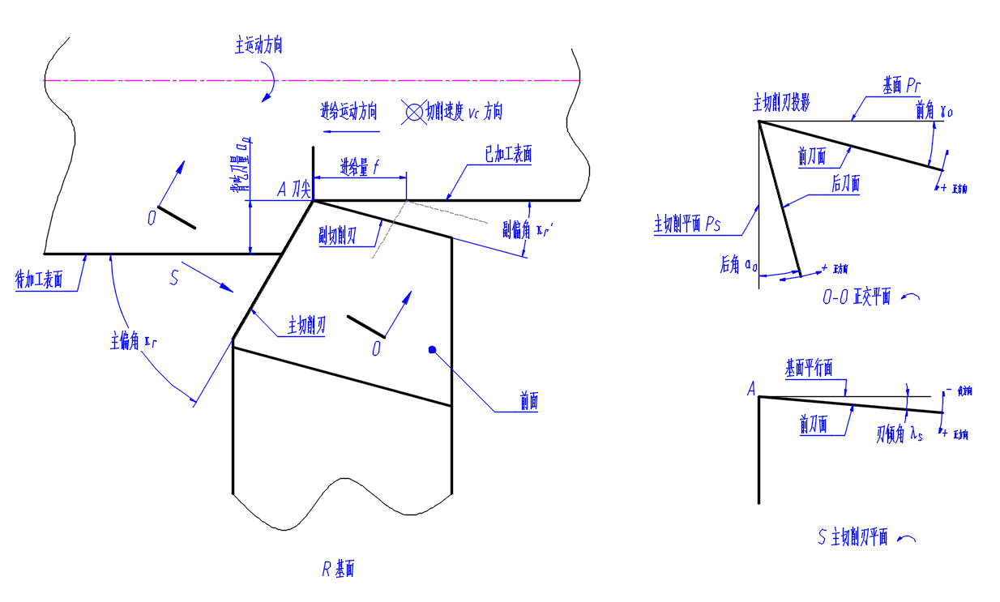
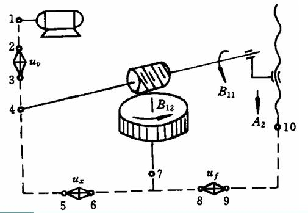
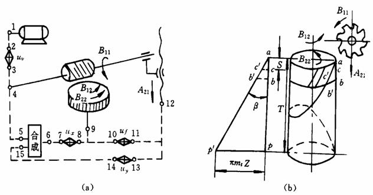

# 机械制造提纲
## 名词解释
### 第一章
1. 工作前角 $\gamma_{oe}$ P14  
前面与工作基面的夹角, 在工作正交平面中测量
1. 工作后角 $\alpha_{oe}$ P14  
后面与主切削平面的夹角, 在工作正交平面中测量
1. 切削用量 切削时各运动参数的总称, 包括三个方面 P60, P16, P10
    1. 进给量 $f$  
    刀具在进给运动方向相对工件的位移量
    1. 背吃刀量 $a_p$  
    刀具的切削深度
    1. 切削速度 $v_c$  
    切削刃选定点相对于工件主运动的瞬时速度
1. 刀具耐用度 $T$ P50  
刀具由开始切削起, 到磨损量到达磨钝标准为止的实际切削时间

### 第二章
1. 组合机床 P141  
根据特定工件的加工要求, 以系列化, 标准化的通用部件为基础, 配以少量的专用部件所组成的专用机床
1. 机床夹具 P148  
机床上用以装夹工件和引导刀具的一种装置
1. 欠定位 P154  
工件应限制的自由度而未予以限制
1. 过定位 P154  
同一个自由度被两个及以上的支撑点重复限制的定位
1. 定位误差 P158  
同批零件在夹具中定位时, ==工序基准==位置在==工序尺寸==方向或沿加工要求方向上的最大变动量

### 第三章
1. 工序 P177  
一个或一组==工人==, 在一个==工作地==对同一个或同时对几个==工件连续作业==的那一部分工艺过程, 称为工序  
包含工作地, 工人, 工件和连续作业四要素
1. 工位 P179  
==一次装夹工件后==, ==工件与夹具==或设备的可动部分一起==相对刀具==或设备的固定部分所==占据==的每一个==位置==, 称为工位 (转位刀架上各把刀具代表一个工位)  
一个工件在工序中装夹一次, 在不同工位上完成钻, 扩, 铰等加工
1. 工步 P179  
==加工表面, 加工工具和切削用量==不变的情况下, 所连续完成的那一部分工序, 称为工步  
1. 生产纲领 P183  
企业在计划期内应当生产的产品的产量和进度计划
1. 生产类型 P184  
企业或车间生产专业化程度的分类, 分为大量生产, 成批生产和单件生产
1. 零件的结构工艺性 P186  
所设计的零件在能满足==设计功能和精度要求==的前提下, 制造的==可行性==和==经济性==
1. 加工经济精度 P195  
==正常==加工条件下, 所能==保证==的加工精度
1. 时间定额 P209  
在一定的生产条件下, 规定生产一件产品或完成一道工序所需消耗的时间
1. 封闭环 P217  
在零件的加工过程或机器的装配过程中, 最后自然形成的一个尺寸
1. 加工余量 P205  
为使加工表面达到==所需的精度和表面质量==, 应切除的金属表层厚度

### 第四章
1. 工艺系统刚度 P278  
作用于工件==加工表面法线方向==上的切削力分力与刀具在切削力作用下相对于工件在该方向上的位移 (变形) 比值
1. 误差复映 P281   
==工件加工前的误差==以类似的规律反应为加工后的误差的现象
1. 误差敏感方向 P269  
通过刀刃的加工表面的法线方向, 在此方向上原始误差对加工误差影响最大
1. 磨削烧伤 P309  
磨削加工时, 消耗的能量是切削加工的数十倍, 这些能量绝大部分转化为热并进入工件, 使工件表面层金相组织变化

## 简答题
### 刀具材料应具有的性能
见书 P19

1. 高硬度  
刀具硬度必须比工件高, 通常大于 60 HRC
1. 高的耐磨性  
1. 足够的强度和韧度  
能承受切削力, 冲击和振动时不崩刃和折断
1. 高的热稳定性  
在高温下保持硬度, 耐磨性, 强度和韧度
1. 良好的耐热冲击性能  
导热性好, 不会受热冲击而产生内部裂纹
1. 良好的工艺性能  
易于锻造, 热处理, 焊接, 磨削等加工

### 积削瘤的影响以及减小或避免积削瘤的措施
见书 P31  

#### 积削瘤的影响
1. 使刀具实际前角增大, 切削力降低
1. 影响刀具耐用度. 积削瘤保护刀具, 但破碎时会引起刀具材料颗粒剥落
1. 使切入深度增大
1. 使工件表面粗糙度增大

对粗加工有利, 精加工时需要避免

#### 减小或避免措施
1. 采用较低或较高的切削速度
1. 采用润滑性能较好的切削液
1. 增大刀具前角
1. 提升工件硬度

### 刀具磨损
P47

#### 一般刀具磨损
1. 磨粒磨损  
1. 黏结磨损
1. 相变磨损  
1. 扩散磨损  
1. 氧化磨损  
1. 热电磨损
1. 塑性变形

#### 高速钢刀具磨损主要原因
1. 磨粒磨损  
工件中硬度极高的小硬质点在刀具表面刻划出沟痕
1. 黏结磨损  
刀具与工件冷焊黏结, 并在黏结层破碎时带走刀具材料颗粒
1. 相变磨损  
切削温度过高, 刀具材料发生相变

### 斜楔 / 螺旋 / 偏心夹紧机构的特点
见书 P163

#### 斜楔机构
1. 具有一定的增力性, 并能改变原动力的作用方向
1. 夹紧行程短, 手动操作不方便, 一般用于液压, 气动夹紧装置

#### 螺旋夹紧机构
1. 结构简单, 紧凑, 增力比大, 自锁性好, 夹紧行程长
1. 夹紧, 松开动作缓慢, 在高效夹具中应用少

#### 圆偏心夹紧机构
1. 结构简单, 操作方便, 夹紧迅速
1. 夹紧行程小, ==增力比不大==, 自锁性不稳定, 主要用于切削负荷小, 工件尺寸公差不大的场合

### 减小传动链传动误差的措施
见书 P275

1. 缩短传动链
1. 减小传动比
1. 减小传动链中各传动件的加工装配误差, 特别是最后的传动件
1. 采用校正装置

### 减小工艺系统受热变形对加工精度影响的措施
见书 P287

1. 减少热源的发热和隔离热源  
减小切削量, 将热源从机床分离
1. 均衡温度场  
减小各部件的温差
1. 采用合理的机床部件结构及装配基准  
如采用热对称结构
1. ==加速达到热平衡状态==  
加工前使机床空转
1. 控制环境温度  

### 误差预防技术
见书 P300

1. 合理采用先进工艺与设备
1. 直接减少原始误差  
如采用反向进给的切削方式使切削力拉伸工件
1. 转移原始误差  
转移到非误差敏感方向
1. 均分原始误差  
如对毛坯分组, 缩小毛坯间误差
1. 就地加工  
使用自干自的加工方式
1. 控制误差因素  
如加工时恒温控制

### 选择粗 / 精基准的原则, 并举例说明
见书 P192

#### 粗基准选择
1. 合理分配加工余量原则  
    * 应保证要求加工余量均匀的表面为粗基准  
    * 如机床床身的导轨面要求余量均匀, 则应以机床床身的导轨面为粗基准, 加工机床床脚面
1. 保证零件的加工表面相对不加工表面有一定位置精度原则  
    * 当零件有不加工表面时, 以不加工表面中, 与加工表面位置精度要求高的表面为粗基准 (1, 2 均要求时, 按本项处理)
1. 便于装夹原则  
粗基准表面应尽量平整光洁, 不应有飞边, 冒口等缺陷
1. 粗基准一般不重复使用  
粗基准只在第一道工序使用

#### 精基准选择
1. 基准重合原则  
尽可能选用设计基准作为精基准
1. 基准统一原则  
    * 尽可能多的加工面使用同一个定位基准作为精基准
    * 采用箱体底面为精基准加工箱体上多个孔
1. 互为基准原则  
    * 两个要求高的表面互为精基准多次精加工
    * 加工精密齿轮, 先以齿面为基准加工内孔, 再以内孔为基准精磨齿面
1. 自为基准原则  
    * 加工床身导轨时, 以床身导轨自身为基准, 一边加工一边测量床身导轨并调整
1. 装夹方便, 夹具结构简单

### 划分加工阶段的作用 (必要性)
见书 P200

1. 减小或消除内应力, 切削力和切削热==对精加工的影响==
    * 每个阶段完成后, 停放一段时间消除内应力
1. 有利于及早发现毛坯缺陷并及时处理
1. 便于安排热处理
1. 可合理使用机床
1. 表面精加工安排在最后, 避免夹紧与运输过程损伤精加工过的表面

### 排列切削加工工序顺序的原则
见书 P202

1. 基准先行, 即先加工基准表面, 后加工功能表面
1. 先主后次, 即先加工主要表面, 后加工次要表面  
1. 先粗后精, 即先安排粗加工工序, 后安排精加工工序
1. 先面后孔, 即先加工平面, 后加工孔

## 分析题
### 刀具切削角度分析

P13

### 零件结构工艺性分析
P187

典型分析角度
1. 凸台等高, 键槽方向相同, 退刀槽尺寸 / 齿轮模数相同, 便于一次装夹完成加工并减少刀具
1. 应在与底面平行的平面上完成钻孔, 且要为钻头留出足够的竖直空间
1. 考虑加工可行性, 平底孔 (非锥底孔), 弯曲孔, 孔与箱体的内腔加工, 直径剧烈变化的阶梯轴, 非阶梯孔 / 轴加工难度大, 应拆分为几个部分再组合
1. 阶梯孔 / 轴之间应有退刀槽
1. 考虑加工方便, 设计定位用的工艺凸台 / 提升刚度的加强筋, 使工件易于装夹 / 不易装夹变形

### 定位方案 / 约束自由度分析
P156

根据旋转与平移, $X,Y,Z$ 方向共有 $6$ 个自由度  
仅需限制一个自由度中正反方向之一, 就认为此自由度被限制

分析方法: 首先找约束, 再确定约束所限制的自由度, 最后汇总得到定位方案限制的自由度  

典型定位方式
1. 平面 (也可用于圆柱面)
    1. 支承点定位 (小面积)  
    一个不共面的点限制一个自由度, 可调点不起定位作用 (用于提供额外支承, 防止切削变形)
    1. 平板定位 (长条形)  
    一个平板相当于两个点, 可调板仅限制一个自由度
1. 圆柱面 (轴或孔)
    1. V 型块  
    对中性好, 短 V 型块限制两个位移 (避免过定位时使用), 长 V 型块还能限制两个旋转
    1. 半圆块 / 定位套  
    夹紧力均匀, 与 V 型块相同  
    1. 心轴  
    用于孔面, 与半圆块相同, 短时称为定位销  
    注意, 心轴的底面通常也作为定位面 (限制三个自由度) 与孔端面接触而导致过定位 (减小接触面以避免)
1. 顶尖
    1. 顶尖  
    用于轴端面上的顶尖孔, 单个顶尖限制==三个方向的位移==, 两个顶尖还能限制两个旋转
    1. 锥套  
    用于轴端面, 其余特性与顶尖相同
    1. 锥销  
    用于孔端面, 其余特性与顶尖相同

### 传动原理图分析
P118

#### 传动原理图例

* 合成机构  
一般合成机构可将来自两条不同传动链的运动合成为一个运动 (相加)  
分析传动链时应分开分析

* 内 / 外联系传动链  
加工时两个末端件的广义位移之间有严格比例关系的称为内联系传动链, 如展成运动传动链  
没有这种要求的称为外联系传动链, 如进给运动传动链

* 传动链描述  
以 $a_1-a_2-\dots -a_n$ 表示一条传动链  
其中 $a_n$ 可以是主轴编号 $x$, 待定传动比 $u_x$, 合成机构 $\boxed{\text{合成}}$ 的一种  
除合成机构外, 通常各条传动链之间没有重复经过的部分

#### 滚切直齿圆柱齿轮

如图机构包含了三条传动链
* 展成运动传动链  
由滚刀到工作台的 $4-5-u_x-6-7$ 构成  
属于内联系传动链 (传动比由加工齿轮的齿数 $Z$ 决定)  
保证滚刀与工件之间的展成运动关系, 以 $u_x$ 调节工件齿数  
$$\text{滚刀 1 转}-\text{工件} \frac{K}{Z} \text{转}$$

* 主运动传动链  
由电机到滚刀的传动 $1-2-u_v-3-4$ 构成  
属于外联系传动链  
通过滚刀的旋转完成主要切削, 以 $u_v$ 调节切削速度  

* 轴向进给运动传动链  
由工作台到刀架 (滚刀轴支架) 的 $7-8-u_f-9-10$ 构成  
属于外联系传动链  
注意, 滚刀轴支架沿工件转轴方向移动, 以 $u_f$ 调节进给量的大小和方向

#### 滚切斜齿圆柱齿轮

除了[滚切直齿圆柱齿轮](#滚切直齿圆柱齿轮)已有的三条传动链外, 还有一条差动传动链  
由刀架 (滚刀轴支架) 到工作台的 $12-13-u_y-14-15-\boxed{\text{合成}}-6-7-u_x-8-9$ 构成  
通过差动传动链, 使相对展成运动的进给运动由竖直变为螺旋, 使之变为斜齿轮  
属于内联系传动链 (传动比由斜齿轮的螺旋角 $\beta$ 决定)  
以 $u_y$ 调节螺旋方向与螺旋角 $\beta$

### 传动系统图计算
图例参考 P119

分析时注意
1. 传动比满足 $i=\frac{\text{主动件的直径 / 齿数}}{\text{从动件的直径 / 齿数}}$, $i\cdot n_{\text{电机}}=n_{\text{转动}}$
1. 传动链总数等于 $\prod{\text{各环节的分支数}}$, 不一定等于传动比数 (排除其中传动比相近的传动链)

### 工件加工形状误差分析
主要从以下四个方面分析

#### 机床几何误差
P269

* 机床导轨导向误差
    1. 对车削圆柱的影响  
    在误差敏感方向体现为==圆柱度误差== (圆柱母线弯曲或倾斜)
    1. 对磨削平面的影响  
    导轨误差直接反映到==平面度误差==上
* 机床主轴回转误差
    1. 纯径向跳动  
    主要造成镗孔的==圆度误差== (镗孔呈椭圆形)
    1. 纯轴向窜动   
    端面平面度, 垂直度误差 (==端面不平整==)
    1. 纯倾角摆动  
    主要造成车削与镗削时的==圆柱度误差== (呈椭圆形)
    * 注意, 以上三种误差均会造成螺距误差

#### 工艺系统刚度
P279

* 两端粗, 中间细的鞍形 (两端切除少)  
==工件与刀具的刚度大而**机床刚度小**==  
主要是机床变形, 导致切削深度随机床变形改变  
在两夹紧端, 工件的相对刚度大, 机床变形大, 切去的金属层少, 因此两端粗  
在工件中间, 工件的相对刚度小, 机床变形小, 切去的金属层多, 因此中间细  

* 两端细, 中间粗的鼓形 (两端切除多)  
==工件与刀具的刚度小而**机床刚度大**==  
主要是工件变形, 导致部分弹性变形的材料未能被切去     
在两夹紧端, 工件的相对刚度大, 工件变形小, 切去的金属层多, 因此两端细  
在工件中间, 工件的相对刚度小, 工件变形大, 切去的金属层少, 因此中间粗  

#### 内应力 / 受热变形
通常在==卸下工件==后才发生变形, 且通常为平面 / 圆柱面下凹 (鞍形)

* (下凹的部分) 在==夹紧力的作用下突起==, 导致被磨去的部分多  
因此卸下工件后, 应力消失, 导致这些部分下凹
* (下凹的部分) 散热条件差, 温度高==热膨胀大==, 导致被磨去的部分多  
因此卸下工件后, 温度均衡, 导致这些部分下凹

#### 误差复映
除非明确毛坯与变形无关, 否则对于==大部分的变形==与误差, 都有==可能是误差复映==导致的
