# 圆柱体的互换性
## 基本定义与术语 
### 尺寸定义
#### 公称尺寸 (Feature)
在**设计阶段**确定的理想尺寸, 不包含误差的尺寸  
使用字母 $D$ 表示孔 (随加工扩大) 的公称尺寸, 字母 $d$ 表示轴 (随加工缩小) 的公称尺寸

#### 极限尺寸 (Limit)
在**设计阶段**确定的制造要求  
使用 $D_{\max}$ 与 $d_{\max}$ 表示上极限尺寸  
使用 $D_{\min}$ 与 $d_{\min}$ 表示下极限尺寸  

极限尺寸通常以公称尺寸为基数确定, 实际尺寸应在上下极限尺寸组成的闭区间内

#### 提取组成要素的局部尺寸
在**测量阶段**确定的局部尺寸, 使用下标 $a$  
对于圆柱面则为任一圆截面上对应两点的距离  

由于测量误差, 不是实际的尺寸  
由于仅以局部为对象测量, 因此不同位置的测量结果不同

#### 作用尺寸 (Function)

在装配阶段确定的尺寸, 使用下标 $m$  
即能与被测轴内接的最大孔尺寸 $d_m$, 或是与被测孔内接的最小轴尺寸 $D_m$ (也称为实体外作用尺寸 $fe$)  

作用尺寸与局部几何误差 $f$, 局部尺寸之间满足关系
$$D_m=D_{a\min}-f\quad d_m=d_{a\max}+f$$

由此可得, 几何误差使作用尺寸向实体增加的方向改变

#### 实体极限 (Material Limit)
在**使用阶段**确定的强度极限  
当孔, 轴有允许的最多材料时, 强度最大, 称为最大实体极限, 满足 $D_{MML}=D_{\min},\;d_{MML}=d_{\max}$  
当孔, 轴有允许的最少材料时, 强度最小, 称为最小实体极限, 满足 $D_{LML}=D_{\max},\;d_{LML}=d_{\min}$  

### 公差与偏差
#### 极限偏差
定义极限尺寸减去其公称尺寸所得的代数差为极限偏差  
极限偏差可能大于零或小于零

定义孔, 轴的上极限偏差为 $ES=D_{\max}-D,\;es=d_{\max}-d$  
定义孔, 轴的下极限偏差为 $EI=D_{\min}-D,\;ei=d_{\min}-d$  

#### 公差
定义公差为上下极限尺寸之差, 使用符号 $T$ 表示  
==公差的数值必定大于零==

#### 公差带图

使用如图所示的公差带图表示公差  

公差带图中应包含以下要素
* 零线, 表示零件公称尺寸下的表面位置
* 零线左侧的正负方向指示 $+0-$
* 公称尺寸, 公称尺寸需要标出单位 $mm$ (公差带图中默认采用 $\mu m$ 为单位)
* 公差带, 公差带的上下边相对零线的距离由上下极限偏差决定
* 公差带类型, 对于轴的公差在公差带内标 $TS$ (shaft), 对于孔则标 $TH$ (hole)
* 上下极限偏差, 在公差带的上下边分别标出上下极限偏差, 需要带有符号 (单位 $\mu m$, 可省略)

### 配合
配合指==公称尺寸相同==且相互结合的孔与轴公差带之间的关系

#### 过盈量与间隙量
过盈量与间隙量均以孔的尺寸减去轴的尺寸的方式计算  
当差值为正时, 为间隙量, 当差值为负时, 为过盈量  
仅最小过盈量 / 最小间隙量可以取 $0$

当这一差值最大时, 孔最大, 轴最小, 满足
$$ES-ei=D_{\max}-d_{\min}=
\begin{cases}
X_{\max},&D_{\max}-d_{\min}> 0\\
Y_{\min},&D_{\max}-d_{\min}\le 0
\end{cases}$$

当这一差值最小时, 孔最小, 轴最大, 满足
$$EI-es=D_{\min}-d_{\max}=
\begin{cases}
X_{\min},&D_{\max}-d_{\min}\ge 0\\
Y_{\max},&D_{\max}-d_{\min}< 0
\end{cases}$$

#### 配合方式
* 间隙配合  
当最小间隙 $X_{\min}\ge 0$, 为间隙配合  
此时孔公差带在轴公差带之上, 或衔接  
用于孔与轴的活动连接

* 过盈配合
当最小间隙 $Y_{\min}\le 0$, 为过盈配合  
此时轴公差带在孔公差带之上, 或衔接  
用于孔与轴的紧固连接

* 过渡配合
当最大间隙 $X_{\max}>0$ 且最小过盈 $Y_{\max}<0$, 为过渡配合  
此时轴公差带与孔公差带相互重叠或包含  
用于孔与轴的定心连接

#### 配合公差
配合公差为允许过盈量或间隙量的变动量, 易得配合公差为轴孔公差之和
$$T_f=T_H+T_S$$

因此==配合公差的数值必定大于零==

## 配合与公差带
### 公差带的标准化
#### 公差值的标准化
标准公差结合了精度等级与公称尺寸大小两个方面的因素, 通过以下方式求得
$$T=a\times i$$

* $T$ 为标准公差, 一般通过查表得到标准化的值, 而不使用计算确定.
* $a$ 为公差等级系数, 公差等级越高, 系数越大, 精度越低.  
    * 共分为 $IT18\sim IT1,IT0,IT01$ 二十个等级
    * 主要选取自 $R5$ 优先数
* $i$ 为公差因子, 与尺寸大小有关的因子, 随尺寸增大而增大.  
    * 以尺寸段划分, 并使用尺寸段首位尺寸的几何平均数代表段内的尺寸
    * 交接处的尺寸认为处于前一尺寸段

#### 基本偏差的标准化

将==上下极限偏差中, 相对零线较近的一个极限偏差最为基本偏差==, 对孔与轴分别规定了 28 个基本偏差  
基本偏差通过基本偏差代号表示, 轴的基本偏差代号为小写, 孔的基本偏差代号为大写  

对于孔的基本偏差有如下规律 (对于轴的基本偏差规律相反)
* 从 $A \sim H$ 的基本偏差为下极限偏差 $EI$, 随字母顺序, 依次减小, 且 $H$ 的下极限偏差为 $0$
* 从 $K \sim ZC$ 的基本偏差为上极限偏差 $ES$, 随字母顺序, 依次增大
* 基本偏差 $J/JS$ 表示公差带相对零线对称, 上下极限偏差为 $ES=IT/2,EI=-IT/2$ (公差为奇数时减 $1$)
* 通常基本偏差的大小还与公称尺寸有关

根据基本规律可得, 基轴制下 (基孔制下)
* 基本偏差 $A \sim H$ ($a \sim h$) 一般用于间隙配合
* 基本偏差 $P \sim ZC$ ($p \sim zc$) 一般用于过盈配合
* 基本偏差 $J \sim N$ ($j \sim n$) 一般用于间隙配合
* 随着字母增大, 最小间隙不断减小

### 配合与尺寸表示
将基本偏差与公差等级的组合称为**公差带代号**
再根据配合尺寸, 即可确定公差带, 也称为**工作尺寸**, 可使用以下等价方式表示
$$\phi 50M7\leftrightarrow \phi 50\substack{\;0\;\;\;\;\\-0.025}$$

#### 入体原则
为了便于加工, 还规定了使用入体原则的方法表示公差带  
* 对于轴 (以及广义轴), 通常的加工方向 (实体减小方向) 总是使轴的尺寸减小
* 对于孔 (以及广义孔), 通常的加工方向 (实体减小方向) 总是使轴的尺寸增大

加工后经检测, 当工件的尺寸误差方向与实体减小方向相反, 则还可通过进一步加工而不需要报废  
为了便于判断误差方向是否与实体减小方向相反, 因此采用入体原则标注尺寸  

即通过修改基本尺寸, 使之满足实体增大方向的极限偏差为 $0$  
例如以下孔的工作尺寸使用入体原则表示
$$\phi 50M7\leftrightarrow \phi 50\substack{\;0\;\;\;\;\\-0.025}\to \phi 49.975\substack{+0.025\\\;0\;\;\;\;}$$

#### 配合表示
同时给出孔与轴的公差带, 即可获取孔与轴的配合关系  

通常使用 $\phi D\;TH/TS$ 或 $\phi D\frac{TH}{TS}$ 的方式表示孔与轴的配合关系  
即孔的公差带在上, 轴的公差带在下 (以中间为零线, 孔随加工向上增大, 轴随加工向下减小)

例如以下配合表示
$$\phi 30\frac{H8}{js7}\leftrightarrow \phi 30\;H8/js7$$

#### 配合制
当其中的孔的基本偏差代号为 $H$, 则表示以孔为基准孔, 称为基孔制  
当其中的轴的基本偏差代号为 $h$, 则表示以轴为基准轴, 称为基轴制  

### 等效配合
当两种配合关系具有完全相同的 $X_{\max}$ 与 $X_{\min}$ ($Y_{\max}$ 与 $Y_{\min}$) 时, 称为等效配合  

轴的标准公差带通过修约确定, 而孔的基本偏差则通过规定一系列常用的配合作为等效配合, 通过这些等效配合由轴的标准公差带可转换得到孔的标准公差带  

#### 等效配合的一般情况
根据等效配合的使用要求, 规定等效配合满足以下特点
1. 当其中一个配合的孔使用了特定基本偏差代号, 则另一配合的轴使用相同的基本偏差代号
1. 两个等效配合对应轴与孔使用相同的公差等级
1. 两个等效配合, 其中一个是基孔制, 另一个是基轴制

对于没有规定的一般情况, 如大尺寸零件与间隙配合 (轴与孔的制造难度相近)  
此时认为相同公差等级的基孔制配合 (基轴制) 存在对应基轴制 (基孔制) 配合

例如如下两个配合等效 
$$\frac{A9}{h9}\leftrightarrow \frac{H9}{a9}$$

#### 等效配合的例外情况
当满足以下条件时
1. 公称尺寸在 $3\sim 500 mm$ 范围内
1. 孔的公差等级小于 $IT8$ (精度高于 $IT8$), 代号为 $K, M, N$ 的基本偏差 (过渡配合)
1. 孔的公差等级小于 $IT7$ (精度高于 $IT7$), 代号为 $P\sim ZC$ 的基本偏差 (过盈配合)

由于过盈配合与过渡配合对于轴, 孔的制造精度要求高. 且在 $3\sim 500 mm$ 范围内, 轴的制造难度通常低于孔, 因此构建等效配合时, 孔的公差等级比轴高一级

例如如下两个配合等效  
$$\frac{H7}{k6}\leftrightarrow \frac{K7}{h6}$$

#### 等效配合计算孔公差
使用等效配合求孔公差时, 可通过以下流程计算 (以求公差带代号 $\phi 50 M7$ 为例)

* 构建等效配合  
由于公差带代号 $M7$ 满足等效配合的例外情况, 因此有等效配合
$$\frac{M7}{h6}\leftrightarrow \frac{H7}{m6}$$

* 查表确定等效轴/轴的公差带  
    * 根据待确定的轴公差带 $\phi 50 m6$
        * 首先查出 $\phi 50$ 下公差等级 $IT6$ 对应的公差值为 $T_S=16\mu m$
        * 然后查出 $\phi 50$ 下基本偏差 $M$ 对应的下极限偏差为 $ei=+9\mu m$  
        * 最后计算出上极限偏差 $es-ei=T_S\to es=25\mu m$
    * 根据待确定的孔公差带 $\phi 50 H7$
        * 首先查出 $\phi 50$ 下公差等级 $IT7$ 对应的公差值为 $T_H=25\mu m$
        * 由于使用基孔制 (代号 $H$), 因此孔的下极限偏差为 $EI=0$
        * 最后计算出上极限偏差 $ES-EI=T_H\to ES=25\mu m$

* 通过确定的等效轴/轴的公差带, 画出公差带图

* 根据公差带图计算最大与最小间隙量 (过盈量)
$$\begin{split}
&Y_{\max}=EI-es=-25\mu m\\
&X_{\max}=ES-ei=16\mu m
\end{split}$$

* 反算 $\phi 50 M7$ 的公差带
    * 确定原配合中的轴公差带 $\phi 50 h6$
        * 首先查出 $\phi 50$ 下公差等级 $IT7$ 对应的公差值为 $T_S=16\mu m$
        * 由于使用基轴制 (代号 $h$), 因此轴的上极限偏差为 $es=0$
        * 最后计算出下极限偏差 $es-ei=T_S\to ei=-16\mu m$
    * 根据等效配合条件确定[过盈量与间隙量](#过盈量与间隙量), 反算出 $\phi 50 M7$ 的公差带
        * 由第一个条件计算下极限偏差 $Y_{\max}=EI-es\to EI=-25\mu m$
        * 有第二个条件计算上极限偏差 $X_{\max}=ES-ei\to ES=0$

* 最终得出结果, 工作尺寸 $\phi 50 M7$ 可表示为 $\phi 50\substack{\;0\;\;\;\;\\-0.025}\;mm$

### 配合与公差等级的选择
#### 配合制选择
见书

#### 公差等级选择
见书

#### 已知配合量求标准公差带
* 确定采用的配合制  
默认采用基孔制, 具体见题目要求  
对于基轴制也可先使用基孔制计算, 再利用等效配合转换
* 确定公差等级
    1. 根据配合量得到[配合公差](#配合公差) $T_f=T_H+T_S=|X_{\max}-Y_{\max}|$
    1. 平均分配配合公差, 初步确定轴孔的公差 $T_H=T_S=T_f$
    1. 查表确定最接近的公差等级, 当公差等级低于 $IT8$ (精度高于 $IT8$) 时, 孔的公差比轴高一级 (孔精度低于轴, 即选取两侧的等级)
* 确定基本公差
    1. 由于采用基孔制, 因此 $EI=0,ES=T_H$
    1. 根据两个[配合量条件](#过盈量与间隙量)计算得到轴的极限偏差 $ei,es$
    1. 根据 $ei$ 或 $es$ 中距离零线较近的一个偏差, 查表确定最接近的轴的基本偏差
* 检验计算结果  
计算选择得到的标准公差带的配合量, 与题目要求的配合量比较, 确定误差

## 光滑极限量规
### 光滑极限量规的特点
#### 基本特点
1. 量规属于没有刻度的专用量具
1. 量规按照被测孔 / 轴的上下极限尺寸制成并成对使用  
1. 仅能检验工件是否合格

#### 基本形式
* 根据检测对象与通过条件, 分为以下形式
    * 通过通规防止超过最大实体尺寸, 合格时通规能顺利通过工件  
    * 通过止规防止超过最小实体尺寸, 合格时止规无法通过工件
* 根据接触面形式, 分为以下形式
    * 不全形量规 (片状塞规), 与工件点状接触, 被测对象是局部实际尺寸 (不包含形状误差)
    * 全形量规 (圆柱塞规), 与工件面接触, 被测对象是作用尺寸 (含形状误差)

#### 泰勒原则
量规选择应满足泰勒原则, 即
* 工件的作用尺寸不允许大于最大实体尺寸
* 工件在任何位置上的实际尺寸不允许小于最小实体尺寸  
(形状误差总是使作用尺寸向实体尺寸增大的方向改变, 例如弯曲的孔必定只能容纳尺寸小于孔径的轴)

因此
* 测量最大实体尺寸的通规应制成全形量规  
检测轴的通规称为环规 (环套状), 检测孔的通规称为圆柱塞规 (圆柱短轴)
* 测量最小实体尺寸的通规应制成不全形量规  
检测轴的止规称为卡规 (两脚状), 检测孔的止规称为片形塞规 (槽型前端)

### 光滑极限量规的公差带
#### 公差带对验收的影响

虽然光滑量规的公称尺寸是按照零件的极限尺寸设计, 但由于光滑量规自身也存在制造误差, 因此通过检测的条件与实际合格的条件不同.

以检测孔的量规为例, 如图所示
* 当孔的尺寸满足 $D_m<d_{Z}$ 时, 即可通过止规检测. 但合格工件应满足 $D_m<D_{\max}=D_{LML}$, 因此
    * 当 $d_{Z}>D_{\max}$, 表明可能有部分 $d_{Z}>D_m>D_{\max}$ 的不合格工件通过验收 (误收)
    * 当 $d_{Z}<D_{\max}$, 表明可能有部分 $d_{Z}<D_m<D_{\max}$ 的合格工件报废 (误废)
* 当孔的尺寸满足 $D_a>d_{T}$ 时, 即可通过通规检测. 但合格工件应满足 $D_a>D_{\min}=D_{MML}$, 因此
    * 当 $d_{T}>D_{\min}$, 表明可能有部分 $d_{T}>D_a>D_{\min}$ 的合格工件报废 (误废)
    * 当 $d_{T}<D_{\min}$, 表明可能有部分 $d_{T}<D_a<D_{\min}$ 的不合格工件通过验收 (误收)

为了防止误收带来的危害, 一般规定光滑量规的公差带必须在工件的公差带内, 且与==工件的公差带边缘相接==, 保证只会发生误废  
光滑量规的公差则根据零件的公差等级与公称尺寸确定 (查表)

#### 通规磨损对公差带的影响
由于通规经常通过工件全长来检测工件, 因此通规的磨损速度大于止规  

* 对于圆柱塞规 (检测孔), 其公差带下端与工件下极限尺寸 ($D_{MML}=D_{\min}$) 相接, 同时磨损方向向下, 因此需要将其公差带上移
* 对于环规 (检测轴), 其公差带上端与工件上极限尺寸 ($d_{MML}=d_{\max}$) 相接, 同时磨损方向向上, 因此需要将其公差带下移

通规公差带的偏移量则根据零件的公差等级与公称尺寸确定 (查表)

## 几何公差与尺寸公差原则
### 基本概念
#### 公差原则
尺寸公差与几何公差之间往往存在关联, 为了在设计时明确这种关联, 规定了以下两类原则

* 独立原则  
    * 要求尺寸公差与几何公差各自满足自身要求
    * 即 $t_g\ge f,\;d_{\min}\le d\le d_{\max}$
    * 默认使用该原则
* 相关要求
    * 将尺寸公差与几何公差相互关联考虑
    * 有包容要求, 最大实体要求, 最小实体要求三种
    * 需要在设计图的几何公差中表面采用哪种要求

#### 最大实体状态

定义[最大实体尺寸](#实体极限-material-limit) $D_{MMS}/d_{MMS}$ 与==该尺寸方向上==的几何公差 $t_g$ 达到最大时, 与表面在实体外相接最大 (与孔相接) / 最小 (与轴相接) 理想面的尺寸为**最大实体实效尺寸**, 使用下标 $MMVS$ (maximum material virtual condition) 表示  
根据定义可得, 最大实体实效尺寸即设计要求的孔最小 / 轴最大的[作用尺寸](#作用尺寸-function)

如图所示, 最大实体实效尺寸满足
$$D_{MMVS}=D_{\min}-t_g\quad d_{MMVS}=d_{\max}+t_g$$

由于几何误差总是使工件尺寸向最大实体方向改变, 因此当孔 / 轴处于这一状态时, 则称为**最大实体状态** 

### 相关要求
#### 包容要求
* 包容要求即[泰勒原则](#泰勒原则)    
    * 工件作用尺寸 $fe$ 不得超过最大实体尺寸 $MMS$
    * 工件局部尺寸 $a$ 不得超过最小实体尺寸 $LMS$
    * 由于作用尺寸包含了形状误差, 因此使用包容要求时不而外规定形状公差, 相当于将几何误差计入最大实体尺寸的要求中  
    此时最大实体实效尺寸与最大实体尺寸相等 $MMS=MMVS$
    * 使用最大实体尺寸为边界的理想边界
* 满足包容要求的条件  
$$\begin{split}
&d_{fe}=d_{a\max}+f\le d_{\max}=d_{MMS},\;d_{a}\ge d_{\min}=d_{LMS}\\
&D_{fe}=D_{a\min}-f\ge D_{\min}=D_{MMS},\;D_{a}\le D_{\max}=D_{LMS}
\end{split}$$
* 使用包容要求  
    * 在尺寸要素的公差代号后加上符号 $\textcircled{\scriptstyle{\mathrm{E}}}$ (Envelop)
    * 当包容要求的尺寸要素有几何公差时, 则该几何公差也需要独立满足 (计入最大实体实效尺寸)
* 包容要求 (泰勒原则) 的出发点  
    * 通过限制最大实体尺寸 (作用尺寸), 保证配合要求
    * 通过限制最小实体尺寸 (局部尺寸), 保证强度要求 
* 使用示例

1. 零件在最大实体状态下, $d_{a\max}=d_{\max}$ 允许的轴线误差 $f=0$
1. 零件在最小实体状态下, $d_{a\max}=d_{\min}$ 允许的轴线误差 $f\le d_{\max}-d_{\min}=0.036$
1. 所遵循的边界为 $\phi 10$ 的理想边界

#### 最大实体要求
* 最大实体要求
    * 工件作用尺寸 $fe$ 不得超过其最大实体实效尺寸 $MMVS$
    * 工件局部尺寸 $a$ 不得超过其上下极限尺寸 $\max / \min$
    * 最大实体要求中, 工件存在几何公差, 但仅考虑几何公差对作用尺寸的影响, 相当于零件对于最大实体尺寸的余量可用于降低几何公差要求. 而尺寸公差单独考虑  
    此时最大实体实效尺寸与最大实体尺寸不相等 $MMS\neq MMVS$
    * 使用最大实体实效尺寸为边界的最大实体边界
* 满足包容要求的条件
$$\begin{split}
&d_{fe}=d_{a\max}+f\le d_{\max}+t_g=d_{MMS},\;d_{\min}\le d_{a}\le d_{\max}\\
&D_{fe}=D_{a\min}-f\ge D_{\min}-t_g=D_{MMS},\;D_{\min}\le D_{a}\le D_{\max}
\end{split}$$
* 使用包容要求  
    * 在几何公差的公差值后加上符号 $\textcircled{\scriptstyle{\mathrm{M}}}$ (Maximum)
    * 当几何公差为 $0$ 时, 最大实体要求与[包容要求](#包容要求)等价
* 最大实体要求的出发点  
    * 在满足配合要求的前提下, 降低成本
    * 要求零件不超出最小实体尺寸, 满足强度要求 
* 使用示例

1. 零件在最大实体状态下, $d_{a\max}=d_{\max}$ 允许的轴线误差 $f=0.012$
1. 零件在最小实体状态下, $d_{a\max}=d_{\min}$ 允许的轴线误差 $f\le d_{\max}-d_{\min}+t_g=0.048$
1. 所遵循的边界为 $\phi 10.012$ 的最大实体边界

