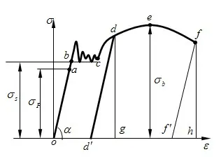

# 材料性能

## 材料分类
### 材料类型
#### 分类
1. 金属材料
2. 高分子材料
3. ==陶瓷材料==
4. 复合材料

### 原子结合键
#### 金属键
1. 没有方向性
2. 良好导电性
3. 良好导热性

#### 共价键
1. 键与键之间有固定方向关系
2. 硬而脆, 塑性差
3. 导电性能差

#### 离子键
1. 结合性较强
2. 常温导电性差

#### 范德瓦尔键
1. 弹性模量, 强度低
2. 熔点, 硬度低

## 拉伸试验 P12

### 符号表示
1. $R$ 或 $\sigma$ 应力 $R=F/S_o$
2. $S_o$ 原始截面面积
3. $e$ 或 $\varepsilon$ 拉伸率 $e=(l-l_o)/l_o$

### 拉伸实验的过程
1. 弹性变形
2. 弹塑性变形
    * ==塑性变形的同时存在弹性变形==, eg. 于 d 点撤去外力后, 将回到 d' 点, od' 为实际的塑性变形量
3. 断裂

### 弹性
1. 弹性变形阶段 $oa$ 段 , 应力与拉伸率成正比, 去除应力后回复 
2. $E$ 弹性模量 $E=R/e$ 度量材料的刚度
3. $R_e$ 或 ==$\sigma_e$ 弹性极限== 不产生永久形变的最大应力

### 强度
1. $ac$ 段 , 除弹性变形外还有塑性变形
2. $R_{eH}$ 上屈服应力, 材料发生屈服而应力首次下降前的最大应力(弹性后的第一个突起)
3. $R_{eL}$ 下屈服应力, 材料屈服期间最小应力
4. $R_{p0.2}$ 规定塑性延伸强度, 塑性延伸 0.2% 的应力  
5. ==$\sigma_s$ 屈服强度==, 通常采用下屈服应力 $R_{eL}$
6. $R_m$ 或 $\sigma_b$ 抗拉强度, 对应图上的 $e$ 点, 代表材料在发生破裂前承受的最大应力

### 塑性
1. 断裂前发生永久变形的能力, 下标 $u$ 表示断裂前的量 
2. $A$ 伸长率 $A=(l_u-l_o)/l_o$
3. $Z$ 断面收缩率 $Z=(S_o-S_u)/S_o$

## 硬度
### 布氏硬度
1. 使用硬质合金钢球压入被测试式样
2. 测量压痕的平均直径
3. 压痕直径越大, 布氏硬度值越小
4. 符号 HBW(硬质合金压头)
5. 符号 HBS(淬火钢球压头, 已废止)

### 洛氏硬度
1. 使用一定形状的压头
2. 根据压痕深度来计算硬度值
3. 压痕越深, 硬度越小
3. 不同压头与载荷, 使用不同硬度标尺
4. 符号 HR(A,B,C,...) 第三个字母表示标尺

### 维氏硬度
1. 正方形金刚石压头
2. 根据压痕对角线长度计算硬度
3. 符号 HV

### 肖氏硬度
1. 金刚石冲头落到式样上, 测量回跳高度
2. 回跳高度越高, 硬度越大
3. 符号 HS

### 莫氏硬度
1. 是一种==划痕硬度==

## 冲击韧度
1. 材料在冲击载荷作用下抵抗变形和断裂的能力称为为冲击韧度, 用 $a_k$ 表示
2. 使用摆锤冲击带缺口的式样实验测量, 摆锤前后最大高度 $H_1$, $H_2$, 式样缺口横截面积 $S$
3. 冲击吸收能量 $K=GH_1-GH_2$
4. 冲击韧度 $a_k=K/S$

## 断裂 P21
由于裂纹存在, 其尖端存在应力集中, 裂纹尖端的应力超过断裂应力, 快速扩散, 导致断裂
### 裂纹类型
1. (I 型)张开型 受力垂直于裂纹, 平行于板材, 危害最大
2. (II 型)滑开型 受力平行于裂纹, 平行于板材
3. (III 型)撕裂型 受力平行于裂纹, 垂直于板材

### 断裂韧度
1. $K_{I}=Y\sigma\sqrt{a}$ 一个表示第一型裂纹的复合力学参量
2. $K_{IC}$ 断裂韧度 裂纹快速扩张时的临界 $K_{I}$

## 疲劳强度 P22
1. 疲劳断裂是一个损伤积累的过程
2. 疲劳极限指材料在无限次交变应力下而不发生疲劳断裂的最大应力
3. 疲劳曲线 $S-N$, 即金属在应力 $S$ 作用 $N$ 次后断裂
4. 曲线趋于水平, 即在次水平线对应的应力 $S_{-1}$ 下, 材料几乎不会断裂, 称为材料对称循环的疲劳极限或疲劳强度

## 物理化学性能
* 不属于力学性能
1. 热胀性
2. 导热性
3. 电性能
4. 耐蚀性

## 工艺性能
* 不属于力学性能
加工过程中表现出来的性能

## 辨析
1. 金属材料的机械性能包括工艺性能, 物理化学性能与力学性能多方面, 不能理解为材料的失效抗力
2. 材料的工艺性能是其物理化学性能与力学性能的综合体现
