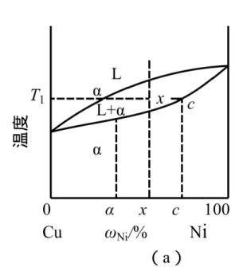
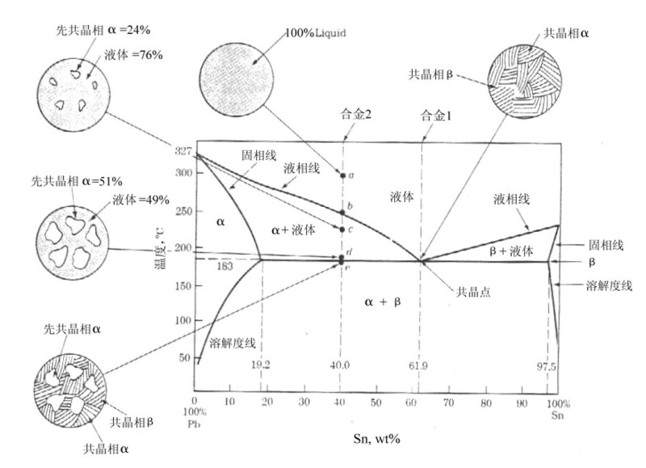
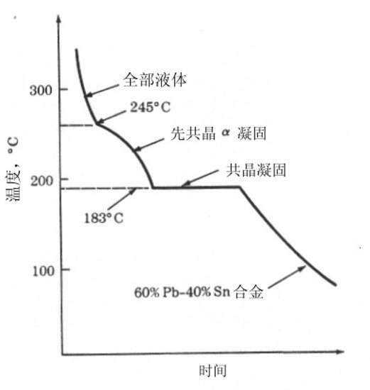
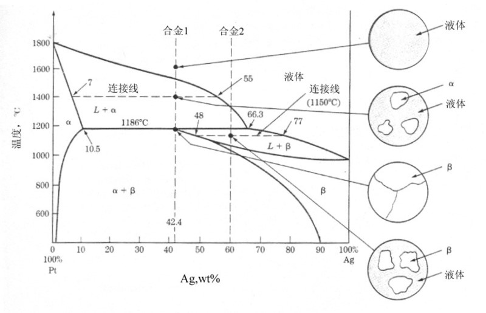
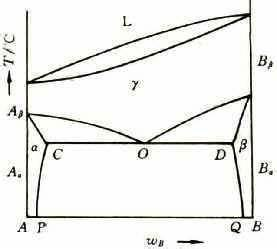

# 材料的凝固与相图
## 纯金属的结晶
### 过冷现象
金属实际结晶温度 $T_n$ 低于理论结晶温度 $T_0$ 的现象称为过冷现象
1. 称 $\Delta T=T_0-T_n$ 为过冷度
2. 冷却速度越快, 过冷度越高

### 结晶过程
结晶过程是依靠两个密切联系的基本过程实现的，这两个过程是==晶核形成(形核)和晶核长大==。

### 结晶条件
#### 能量条件
1. 需要具有一定的过冷度, 为晶体从液态向固态的转变提供能量
2. 液态金属结晶时，结晶过程的推动力是固液相的体积自由能差，阻力是界面能
#### 结构条件
结晶需要有晶核, 只有自发成核的晶核半径大于临界半径, 晶核才能长大, 否则会重新熔化

### 结晶后的晶粒大小
#### 晶核形成方式
1. 自发成核 液态金属内部成核
2. 非自发成核 附着在微粒表面成核, 由于表面能量高, 因此更容易在晶界等表面上成核

#### 晶核长大
1. 晶核形成初期为规则的几何形状
2. 由于晶体棱角散热条件更好, 棱角处的晶体将优先生长
3. 除了沿一个方向生长, 和可能多次分枝, 称为枝晶
4. 当凝固时不断得到补充, 将最终形成外形不规则的晶粒

#### 晶粒大小
1. 通常金属材料晶粒越小, 材料强度, 塑性, 韧性越高
2. 晶粒大小取决于形核率 N 与长大速度 G
3. ==增大过冷度, 可提高 $N/G$==(二者同时增大, $N$ 增大速度更快), 使晶核变小
4. 添加微粒, 促进非自发成核, 提高 $N$, 使晶核变小(==加变质剂==)
5. 利用振动的方法, 破坏晶粒, 使晶核变小

## 合金的结晶
### 合金的相结构
#### 固溶体
1. 固溶体的==晶体结构与其中的一个组元相同, 称为溶剂==, 一般含量最多
2. 其他组元作为溶质
3. 置换固溶体 溶质原子取代部分溶剂原子, 当溶质与溶剂大小, 晶格, 得失电子能力相似, 则可无限溶解(相似相溶)
4. 间隙固溶体 溶质原子分布在溶剂的晶格间隙中
5. 固溶体性能 固溶体将引起晶格畸变, 使晶体强度, 硬度提升, 塑性, 韧性下降

#### 金属间化合物
1. 元素成一定比例
2. 类似陶瓷, 高熔点, 高硬度, 脆性大

## 相图
1. 相 指系统中性质与成分均一一致的部分
2. 相图反映的是在==平衡条件==下的相与组织的存在状态
3. 组元 组成合金中最基本的能够独立存在的物质称为组元
4. 二元相图中, 三相平衡共存时, 必定是一条水平线, 水平线与三个两相区线接触, 三个单相区点接触(见共晶相图)
5. 二元相图的三相区通常为一条直线, 不是区域

### 杠杆定律
1. 字母定义 $\omega$ 元素质量分数, 通常为 x 坐标元素的质量分数, $S$ 相质量分数
$$\omega_{p1}=\frac{m_{e1}}{m_{\text{总}}}\;\;S_{p1}=\frac{m_{p1}}{m_{\text{总}}}$$
2. 对于多种相同时存在的情况, 其中单个相 $p_n$ 中元素的质量分数 $\omega_{pn}$ 取决于同温度下, 纯 $p_n$ 的临界 $\omega_{pn}$ (与混合相的边线上的 $\omega$)
3. $$\omega=\frac{m_{p1}\omega_{p1}+m_{p2}\omega_{p2}}{m_{p1}+m_{p2}}=S_{p1}\omega_{p1}+S_{p2}\omega_{p2}$$
4. 当混合相只有两个的时候, 满足 $S_{p1}+S_{p2}=1$
5. 得到混合相中, 其中一个相质量分数的计算公式
$$S_{p1}=\frac{\omega-\omega_{p2}}{\omega_{p1}-\omega_{p2}}$$

## 匀晶相图

两种组元能够无限互溶, 发生==匀晶反应==, ==形成固溶体相== $\alpha$
### 匀晶合金性能
1. 产生固溶强化, 晶格由于溶质的进入而畸变.
2. 形成单相固溶体时, $\omega=50\%$ 左右时, 合金的强度与硬度显著提高, 塑性有所下降, 导电率显著降低

## 共晶相图

1. 两种组元只能有限互溶, 在特定温度之后同时结晶, 形成两种元素晶粒相互交错的珠光体, 为==两种相的机械混合物==
2. 珠光体为一种组织, 由相 $\alpha$ 与 $\beta$ 组成, 不能视为一种独立的相
3. 图中合金 1 为共析合金, 没有先共晶(提前凝固), 最终得到的组织完全为珠光体
4. 在饱和点 $19.2\%$ 与 $97.5\%$ 两侧, 没有共晶反应, 只有先固溶再析出

### 典型反应历程

沿图中虚线 $a\to b$ 有
1. 由于 $Pb$ 含量高, 因此以 $Pb$ 为主的 $\alpha$ 相先结晶, 称为先共晶
    1. 发生反应 $L\to\alpha+L_r$
    2. 此反应随温度的降低不断进行
    3. 由于凝固释放热量, 因此温度降低速度变慢
2. 到达共晶温度, 发生共晶反应
    1. 发生反应 $L_r\xrightarrow[\text{共晶}]{183^\circ C}\alpha+\beta$
    2. 无论组元质量分数如何, 发生共晶反应的温度固定
    3. 液体全部放热共晶, ==因此共晶反应中, 温度不变, 为恒温过程==
3. 温度继续降低, $\alpha, \beta$ 相之间的元素相互==析出==, 晶粒继续长大/缩小, 有一定可能在先共晶内部析出(均匀成核, 几率小)
    1. 此时两种组织 先共晶 $\alpha$ 与 珠光体, 两种相 $\alpha$ 与 $\beta$

### 合金类型
1. $\omega$ 于共晶点处时为共晶合金
2. $\omega$ 于共晶点左侧, 且存在共晶反应时为亚共晶合金
3. $\omega$ 于共晶点右侧, 且存在共晶反应时为过共晶合金

## 包晶相图

包晶反应指一种液相与一种固相在恒温下相互作用而转变为==另一种固相==的反应
### 典型反应历程
沿合金 1 线有
1. $\alpha$ 相先析出
    * 发生反应 $L\rightarrow L_r+\alpha$
2. 在转变点处, $L_r$ 与 $\alpha$ ==相同时转变为 $\beta$ 相==
    1. 发生反应 $L_r+\alpha\xrightarrow{\text{包晶}}\beta$
    2. 与共晶相同, 包晶反应下, 温度不变, 且对于任意 $\omega$, 发生反应的温度相同
    3. 此时的仅有 $\beta$ 相
3. 温度继续降低, $\alpha$ 相再次析出
    1. 发生反应 $\beta\xrightarrow{\text{析出}}\beta_r+\alpha$
    2. 此时显微组织体现为 $\alpha$ 相在 $\beta$ 内部/晶界上析出, 被包裹, 称为包晶

## 共析相图

类似于共晶相图, 但是 $\alpha$ 相与 $\beta$ 相是从一个==均一的固相==中析出

## 相图与合金性能
### 力学性能
1. 匀晶合金中将产生固溶强化, 晶格由于溶质的进入而畸变.
    * 形成单相固溶体时, $\omega=50\%$ 左右时, 合金的强度与硬度显著提高, 塑性有所下降, 导电率显著降低
2. 共晶合金中, 由于形成的共晶是细密的机械混合物, 合金的硬度与强度也将得到提高, 同时具有较好的韧性
    * 于共晶点处, 晶粒最细密, 合金的硬度与强度提升最大
3. 如果形成化合物, 则将出现极高的硬度与极低的电导率
4. 非平衡状态下(实际条件/快速冷却), 由于==原子没有完全扩散, 导致液相结晶产生的固溶体并不均匀==, 导致一个晶粒内化学成分不均匀, 称为==枝晶偏析==
    * 枝晶偏析将降低合金的力学性能与耐腐蚀性, 需要通过均匀退火让原子充分扩散

### 铸造性能
1. 铸造要求合金流动性高, 流动阻力小, 保证合金能充满铸型
2. 相图中, 纯液相线与纯固相线距离越近, 越能保证合金的流动性
3. 共晶合金于共晶点处, 液相直接通过共晶反应生成珠光体, 铸造性能最好
4. 匀晶合金于 $\omega=50\%$ 处, 液相线与纯固相线距离最远, 不适合铸造 

### 锻造性能
1. 当合金组织为两相时, 其锻造性能不如单相固溶体好
2. 不同两相塑性变形能力不同, 引起两相变形不均匀, 导致内应力
