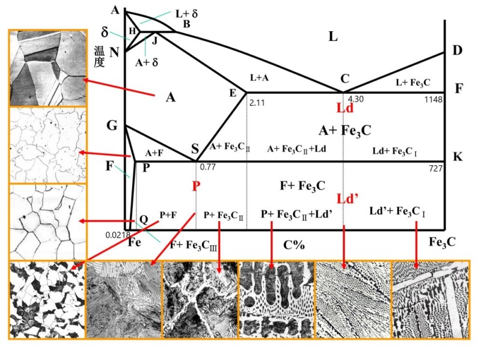
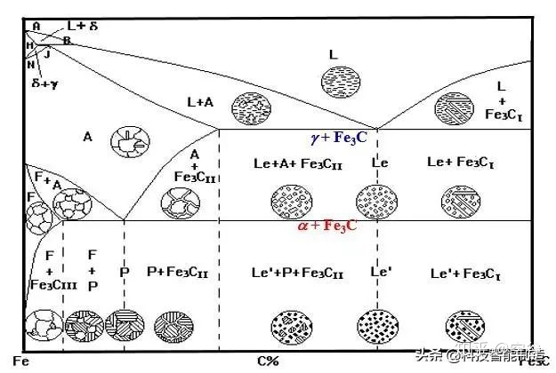

# 铁碳合金
## 铁碳相图

### 铁碳相图中的==基本相==
#### 铁素体
1. 形态: $C$ 固溶于 $\alpha-Fe$ 的==间隙固溶体==
2. 符号: $F$
3. 晶体结构: ==体心立方==
4. 组成: 室温下几乎由纯铁组成, 间隙固溶极少量的 $C$, 产生正畸变
5. 性能: 塑性高, 强度低

#### 奥氏体
1. 形态: $C$ 固溶于 $\gamma-Fe$ 的==间隙固溶体==
2. 符号: $A$
3. 晶体结构: ==面心立方==
4. 组成: 与 $C$ 形成的固溶体
5. 性能: 通常在高温时稳定存在

#### 渗碳体
1. 形态: ==介稳定化合物== $Fe_3C$
2. 符号:
    1. 一次渗碳体 $Fe_3C_I$ 随温度降低, 最先出现的独立渗碳体 (含碳量高时, 从液相中结晶产生, 不是来自共晶/共析反应)
    2. 二次渗碳体 $Fe_3C_{II}$ 在共晶点左侧, 共析点右侧, 从 A 中析出的渗碳体(不是共晶反应生成)
    3. 三次渗碳体 $Fe_3C_{III}$ 从纯铁素体中析出的渗碳体(不是 P 中的铁素体, 此部分属于组织 P 内交换)
3. 性能: 又硬又脆, 熔点高, 会缓慢分解为石墨与铁素体

#### δ 固溶体
1. 形态: $\delta-Fe$
2. 符号: $\delta$
3. 晶体结构: 体心立方
4. 性能: 仅在纯度极高, 温度极高的铁中存在

### 铁碳相图中的组织
#### 珠光体
1. 形态: $Fe_3C$ 与 $F$ 的两相机械混合物构成的组织
2. 组织符号: $P$
3. 形成: 由奥氏体发生共析反应得到
4. 性能: 强度高, 塑性较好
5. 含碳量: $0.77\%$ (发生共析反应温度下 $A$ 的含碳量)

#### 莱氏体
1. 形态: $Fe_3C$ 与 $A$ 的两相机械混合物构成的组织
2. 组织符号: $L_d$
3. 形成: 由含碳量足够高时, $L$ 相 发生共晶反应得到
4. 性能: 其中的 $A$ 低温不稳定, 因此只在高温存在

#### 变态莱氏体
1. 形态: $Fe_3C$ 与 P 的两组织机械混合物构成的组织
2. 组织符号: $L_d'$
3. 形成: 莱氏体冷却到室温后, 其中的 $A$ 发生共析, 转变为 $P$

### 重要结点
#### G
1. $\omega\approx0\%$
2. 反应室温下铁素体中的碳含量近似为 0

#### S
1. $\omega=0.77\%$
2. 此处为铁碳合金的共析点

#### E
1. $\omega=2.11\%$
2. 反应 A 中最大的碳含量, 此时 E 点处成分的合金 $Fe_3C_{II}$ 含量最多 

#### C
1. $\omega=4.3\%$
2. 此处为铁碳合金的共晶点

#### F
1. $\omega=6.69\%$
2. $T=1148\degree C$ 铁碳合金的共晶转变温度
3. 反应 $Fe_3C$ 的碳含量, 大于此质量后不再有 F 相

#### K
1. $T=727\degree C$ 铁碳合金的共析转变温度

#### PSK 线
即热处理中的 $A_1$ 线, 为奥氏体发生共晶反应, 生成珠光体的温度

#### SE 线
即热处理中的 $A_{cm}$ 线, 为奥氏体中渗碳体析出的温度

#### GS 线
即热处理中的 $A_3$ 线, 为奥氏体中铁素体析出温度

### 平衡结晶过程

1. 平衡结晶结果通过显微组织体现
2. 晶体的晶界排列混乱, 更容易被腐蚀, 显黑色
3. 珠光体中, 有大量晶界, 且存在电化学腐蚀, 因此呈现黑色(低倍数) 或细密的黑色条纹(退火态的片状珠光体)
4. 使用硝酸酒精溶液浸蚀, 块状的 $F$ 与 $Fe_3C$ 均为白色, 无法区分(过共析钢), 需要通过苦味酸溶液浸蚀以区分

#### 工业纯铁
1. $\omega<0.02\%$
2. 冷却最终得到 F 于极少量的 $Fe_3C_{III}$
3. ==得到的 $Fe_3C_{III}$ 沿 $F$ 晶界分布==

#### 共析钢 
1 $\omega=0.77\%$

2. ==$L\rightarrow A$==

3. $A\rightarrow P(F+Fe_3C)$

4. $F\rightarrow F_r+Fe_3C$ 冷却到室温时, 铁素体将继续析出渗碳体

5. 最终得到 $P$

#### 亚共析钢
1. $\omega\in[0.0218, 0.77]$
2. $A\rightarrow A_r+F$, 在共析之前, $A$ 先析出 $F$
3. 剩余过程与共析钢类似
4. 最终得到 $P + F$, 均以块状分布

#### 过共析钢
1. $\omega\in[0.77, 2.11]$
2. $A\rightarrow A_r+Fe_3C_{II}$, 在共析之前, $A$ 先析出部分 $Fe_3C_{II}$
3. 剩余过程与共析钢类似
4. 最终得到 $P + Fe_3C_{II}$, ==其中 $Fe_3C_{II}$ 沿 P 的晶界分布==
5. 显微组织中, 使用硝酸酒精溶液处理, 得到的 $Fe_3C_{II}$ 为白色(无法与 $P$ 中的 $F$ 区分); 使用苦味酸溶液处理, 得到的 $Fe_3C_{II}$ 为黑色

#### 共晶白口铸铁
1. $\omega=4.3\%$
2. $L\rightarrow L_d(A+Fe_3C)$
3. $A\rightarrow A_r+Fe_3C_{II}$ 莱氏体中的 $A$ 也会析出 $Fe_3C_{II}$
4. 之后冷却过程类似过共析钢, $L_d$ 内的 $A$ 变为 $P$, 因此认为 $L_d$ 也转变为变态莱氏体 $L_d'$
5. 最终得到 $L_d'$, $P$ 以==鱼骨状分布在 $Fe_3C_{II}$ 中==

#### 亚共晶白口铸铁
1. $\omega\in[2.11, 4.3]$
2. $L\rightarrow L_r+A$, 在共晶之前, 有部分 $L$ 先结晶为 $A$ 
3. 剩余过程与共析钢类似
4. 最终得到 $P$ 与 $L_d'$
5. ==先共晶 $A$ 在共析之前先在其晶界上析出了部分 $Fe_3C_{II}$==, 因此最终的显微组织 $A$ 共析的 $P$ 与 $L_d'$ 中的 $P$ 不会相连, 存在一定间隙($Fe_3C_{II}$)

#### 过共晶白口铸铁
1. $\omega\in[4.3, 6.69]$
2. $L\rightarrow L_r+A$, 在共晶之前, 有部分 L 先结晶为 $Fe_3C_{I}$ 
3. 剩余过程与共析钢类似
4. 最终得到 $Fe_3C_{I}$ 与 $L_d'$
5. ==先共晶 $Fe_3C_{I}$ 单向生长, 以条状形式存在==于显微组织中

## 钢锭的组织与缺陷
### 组织
1. 表面细晶区 与锭模接触的钢液冷却速度快, 形成晶粒细小的组织
2. 柱状晶区 表层形成细晶区后, 晶核沿散热方向, 即垂直于锭模壁的方向生长为柱状
3. 中心等轴晶区 距离锭模壁远, 散热均匀, 速度慢, 晶粒大
4. 柱状晶区热塑性差, 需要减少

### 缺陷
1. 缩孔 集中收缩形成的孔穴
    1. 由于结晶时体积收缩, 得不到补充产生
    2. 通常出现在钢锭的最上方(得不到金属液补充)
    3. 含大量杂质, 危害大, 不允许存在, 需要切去
2. 缩松 分散体积收缩形成的分散小孔
    1. 危害较小, 通过锻造可以减轻
    2. 会使塑性与断裂韧度下降
3. 杂质
    1. 磷 $P$ 与 $Fe$ 化合, 会导致钢在低温时发生脆性断裂
    2. 硫 $S$ 高温时与 $Fe$ 化合, 产生脆性化合物, 导致热脆性
    3. 氧 $O$ 有害杂质
    4. $Mn, Si$ 有益杂质, 有一定强化作用

## 铁碳合金的性能
### 力学性能
1. $\omega<0.77\%$ 随碳含量升高, $P$ 增多, 强度与硬度升高, 塑性与韧性降低
2. ==$\omega>1.0\%$== 出现沿晶界分布的网状 $Fe_3C_{II}$, ==强度下降, 硬度继续上升==
3. $\omega>2.11\%$ 合金以 $Fe_3C$ 为基底, 过于脆, 不易应用

### 工艺性能
1. 切削性能 中碳钢
2. 可锻性能 低碳钢
3. 焊接性能 低碳钢
4. 铸造性能 共晶白口铸铁

## 铁碳合金的分类与牌号
### 钢的分类
#### 含碳量
1. 低碳钢 $\omega<0.25\%$
用于以塑性, 韧性为主的零件
2. 中碳钢 $0.25\%<\omega<0.60\%$
用于要求塑性, 韧性同时有要求具有一定的强度的零件
3. 高碳钢 $\omega>0.6\%$
用于强度高且耐磨的零件

#### 按质量
根据杂质 $P$ 与 $S$ 的含量, 分为普通碳钢, 优质碳钢, 高优质钢

#### 按用途
1. 结构钢 用于工程构件, 机器零件
2. 工具钢 用于刀具, 模具, 量具
3. 特殊性能钢 不锈钢, 耐热钢, 耐磨钢

### 碳素结构钢牌号
碳素结构钢碳含量低, 主要要保证力学性能
1. 牌号 $Q$ + 数字 + 质量等级 + 脱氧方法
2. $Q$ 表示 屈 的首字母
3. 数字 表示屈服强度
4. 字母 A 到 D 质量以此提高
5. $Z$ 表示镇静钢, $F$ 表示沸腾钢, 可省略

### 优质碳素钢牌号
必须同时保证化学成分与性能, 牌号使用两位数字
1. 数字表示碳含量的万分数, 即 $0.ab\%$
2. $30 \sim 50$ 钢经淬火 + 高温回火后, 具有较好的力学性能
3. $40, 45$ 钢可用于主轴或连杆
4. $55, 60, 65$ 钢经淬火 + 中温回火后, 可用于制作弹簧

### 碳素工具钢牌号
用于制作量具, 刀具等, 要求硬度高, 因此一般碳含量较高
1. 牌号 T + 数字(两位或一位)
2. T 表示 tool 首字母
3. 数字表示碳含量的千分数, 即 $n \times 0.1\%$
4. 如果添加 Mn 则在末尾标注元素符号 Mn
5. 如果杂质含量少, 则在末尾标注 A
6. 使用碳素钢前都需要热处理, 改善脆性

### 铸钢牌号
使用字母 ZG + 数字 - 数字
1. 字母表述 铸钢
2. 第一组数字表示屈服强度
3. 第二组数字表示抗拉强度

## 铸铁
### 石墨化
在高温下并且有足够的扩散时间下, 渗碳体, 铁液与奥氏体中会析出稳定的石墨, 将==铸铁中石墨的形成称为石墨化==
1. 高温下长时间保温有利于石墨化, 低温下难以发生石墨化
2. 减缓铸铁的冷却速度有利于石墨化
3. 增大 $C$ 与 $Si$ 元素含量有利于石墨化

### 白口铸铁
不进行石墨化的铸铁, 颜色光亮, 极脆

### 灰口铸铁
1. 进行充分石墨化的铸铁, 因此颜色灰暗
2. 组织 片状石墨 + 珠光体 + 铁素体
3. 用于耐磨, 形状复杂的地方, 如箱体 
4. 牌号 HT + 抗拉强度

### 球墨铸铁
1. 加入球化剂和孕育剂, 是石墨球化的铸铁
2. 石墨为球状, 对金属基体的割裂和损伤小, 具有较好的韧性与强度
3. 用于代替锻钢, 制造形状复杂的零件, 如齿轮
4. 牌号 QT + 抗拉强度 - 拉伸率(两位不带单位%)

### 可锻铸铁
1. 不充分石墨化, 通过退火得到絮状石墨
2. 性能与球墨铸铁接近
3. ==不能用于锻造==
4. 牌号 字母为 KT, 数字与球墨铸铁相同
