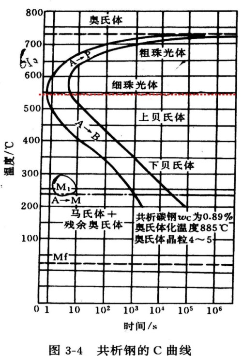
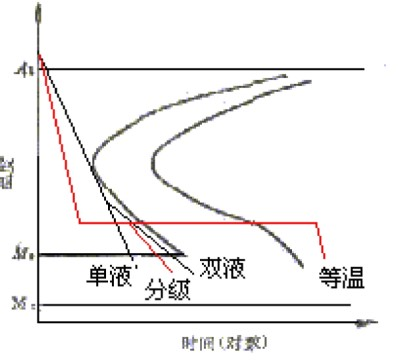

# 钢铁的热处理
利用==加热, 保温, 冷却==的方法, 改变材料的组织与结构, 达到改变材料性能的工艺过程称为==热处理==

## 热处理中的相变
### 奥氏体相变温度
1. $A_{3}$ 奥氏体中析出铁素体的相变温度
2. $A_{cm}$ 奥氏体中析出渗碳体(铁三碳)的相变温度
3. $A_{1}$ 奥氏体(包括莱氏体中的奥氏体)完全共析为珠光体
4. $A_{c}$ 加热下的相变温度, 需要考虑过热效应, 导致实际温度升高(通常作为前缀 eg. $A_{ccm}$)
5. $A_{r}$ 冷却下的相变温度, 需要考虑过冷效应, 导致实际温度降低

### 加热过程中奥氏体的转变
将共析钢重新加热, 其中的珠光体 $P$ 重新转变为奥氏体 $A$
1. 晶核的形成
奥氏体晶核最容易在 $F$ 与 $Fe_3C$ 的晶界上生成
2. 晶核的长大
主要是 $F$ 晶格转变与 $Fe_3C$ 的溶解
3. 残余渗碳体的溶解
$F$ 含碳量少, 溶解速度快, 当其完全溶解后, 还有部分 $Fe_3C$ 存在
4. 奥氏体的均匀化
珠光体完全溶解后, 根据原先相的不同, 不同位置含碳量不同, 还需要继续保温, 使其完全扩散
5. 对于其他类型的共析钢, 过程类似, ==但还有先共析相的转变==, 必须要加热到 $A_{c3}$ 或 $A_{ccm}$ 线上才能开始转变

### 奥氏体转变因素
1. 奥氏体的形成速度主要取决于==原子的扩散速度==
2. 加热温度
    1. 加热温度越高, $A$ 的转化速度越快
    2. 保温温度越高, 时间越长, $A$ 的晶粒变粗
3. 加热速度
    1. 加热速度越快, 过热度越高, 转变开始温度越高, 转变速度快, 但==均匀化程度差== 
    2. 加热速度快, 得到的 $A$ 晶粒尺寸小
4. 化学成分
    1. 大部分化学元素将加快转变速度
    2. 能与碳结合的元素能阻碍碳的扩散, 阻碍奥氏体晶粒的生长
5. 含碳量
    1. 含碳量越高, $F$ 与 $Fe_3C$ 的晶界越多, 转变越快
    2. 由于 $A$ 转变加快, 因此相同保温时间, $A$ 长大的时间更多, 晶粒更大
6. 原始组织
    1. 片状珠光体(退火态)中, $F$ 与 $Fe_3C$ 的晶界多, 转变快; 球状珠光体(回火态), 晶界少, 转变慢
    2. 珠光体晶粒细小, 得到的 $A$ 晶粒也就更小; 通常片状珠光体晶粒小

### 奥氏体的晶粒度
1. 起始晶粒度
刚完成奥氏体化时的晶粒大小, 由于还未长大, 所有钢的晶粒都非常细小, 实际工程意义不大
2. 实际晶粒度
具体加热温度, 保温时间下获得的奥氏体晶粒的大小; 与成分和工艺有关
3. 本质晶粒度
通过将钢加热到 $930\degree C$, 保温 $8$ 小时的实际晶粒度称为本质晶粒度, 可以反映不同成分的钢, $A$ 长大的倾向

## 过冷奥氏体的转变

### 等温转变图的建立
1. 先将实验加热至奥氏体化, 得到均匀的奥氏体
2. 将式样快速冷却到 $A_{r1}$ 以下的不同温度, 并保温一段时间, 观察组织转变(体积膨胀)
3. 过冷 $A$ 都要先经过一段==孕育期==, 才能转变为 $P$; $550\degree C$ 下, 孕育期最短, 此时的 $A$ 最不稳定

### 过冷奥氏体的等温转变的组织形态
#### 珠光体转变
1. 转变温度 $A_{r1}\sim 550(\text{鼻尖}) \degree C$
2. 根据转变温度由高到低, 将产物分为 珠光体(粗片 P), 索氏体(细片 S), 托氏体(极细 T)
3. 不同类型的珠光体由于片层间距不同, 力学性能不同
4. 转变温度越小, 片层间距越小, 材料强度和硬度越高
5. 索氏体珠光体细小且分布均匀, 其的塑性和韧性最高

#### 贝氏体转变
1. 转变温度 $550\sim 230(M_s) \degree C$
2. 为渗碳体与含碳量过饱和的铁素体的机械混合物, 称为贝氏体(B)
3. ==由于转变温度较低, $Fe$ 原子不能扩散, 只有 $C$ 原子具有一定的扩散能力==
3. 根据转变温度由高到低, 将产物分为 上贝氏体($B_\text{上}$) 与下贝氏体($B_\text{下}$)
4. 上贝氏体为羽毛状组织, 力学性能较差
5. 下贝氏体为针状铁素体, 其间分布极细的碳化物, 具有较好的强度和韧性

#### 马氏体转变
1. 转变温度 $230\sim -50(M_f) \degree C$
2. 马氏体转变是一个连续的过程, 在一个温度下保温, 只能得到部分马氏体($B$ 和 $P$ 需要保温一段时间得到)
3. 由于速度快, 且温度过低, 没有扩散, 转变不彻底(存在残余奥氏体)
4. 奥氏体快速转变为铁素体, 体积快速膨胀, 导致内应力增大, 需要进一步热处理消除内应力
5. ==马氏体是碳在 $\alpha-Fe$ 中过饱和的间隙固溶体==
6. 由于晶格畸变, 马氏体具有高硬度与高强度
7. 根据含碳量的不同, 马氏体分为片状马氏体(含碳高)与板条马氏体(含碳低)

### 影响转变的因素
1. 珠光体转变
共析钢的奥氏体最稳定, 离共析钢成分越远, 转变速度越快
2. 贝氏体转变
含碳量越少, 转变速度越快
3. 马氏体转变
随碳含量增大, $M_s$ 与 $M_f$ 点降低, 碳过饱和固溶, 是马氏体高强度, 硬度的根本因素
4. 提高奥氏体化温度与保温时间, 能使奥氏体更加均匀, 晶粒更大, 从而稳定性更强, 延长孕育期, 曲线右移

### 共析钢的连续转变
贝氏体需要足够长的孕育期保温才能产生, 连续转变不能生成贝氏体

## 整体热处理
### 退火
1. 过程
加热到一定温度, 保温, ==缓慢冷却(炉冷)==, 得到接近平衡态的组织
2. 目的
    1. 降低硬度, 提高塑性
    2. 细化晶粒, 消除组织缺陷
    3. 消除内应力
    4. 为淬火做准备
3. 工艺
    1. 完全退火
    得到接近平衡的组织, 主要用于亚共析钢和中碳合金结构钢的预备热处理
    2. 球化退火
    用于高碳工具钢或高碳合金钢, 用于降低其硬度, 改善切削性能; ==当球化退火前有较多的网状 $Fe_3C$, 需要先正火处理==
    3. 均匀化/扩散退火
    减少钢锭中的偏析与组织不均匀
4. 组织
得到强度较低, 塑性较高的 珠光体 $P$

### 正火
1. 过程
加热到 $A_{ccm}$ 或 $A_{c3}$ 以上 $30 \sim 50\degree C$, 保温, ==静止在空气中冷却==
2. 目的
    1. 细化晶粒
    2. 均匀组织
    3. 调整硬度, 便于切削加工
    4. ==可作为一般零件的最终热处理工序==
3. 组织
得到比退火组织强度, 硬度更高, 组织更细小的索氏体 $S$

### 淬火
1. 过程
将钢加热到 $A_{ccm}$ 或 $A_{c3}$ 以上 $30 \sim 50\degree C$, 保温一段时间, 然后快速冷却到 $M_s$ 以下, 发生马氏体转变
2. 组织
得到马氏体 $M$, 和残留奥氏体 $A_r$与==弥散的粒状渗碳体(T12)==
3. 目的
提高钢的硬度, 保证钢的耐磨性, 不是最终组织, 还需要回火调整

#### 淬火工艺

1. 要求
    1. $650\degree C$ 以上缓慢冷却, 降低应力
    2. $650\sim 400\degree C$ 快速冷却, 不能进入 $A$ 转化区域(C型线), 保证 $A$ 不转化
    3. $400\degree C$ 以下缓慢冷却, 减少应力(贝氏体不会产生)

2. 方法
    1. 单液淬火 冷却速度快, 无变化
    2. 双液淬火 冷却速度有变化, 无保温
    3. 贝氏体等温淬火 在下贝氏体转变区保温, 得到下贝氏体
    4. 马氏体分级淬火 在马氏体化前保温, 使零件的心部与表面温度均一再继续冷却, 可以避免受热不均导致零件开裂
3. 介质
盐水的冷却速度最快, 清水次之, 油最慢

#### 淬火缺陷
1. 硬度不足或出现软点
原因有==加热不足(温度不够高, 由残留 $F$)==、介质冷却能力不够、 工件表面不净、局部散热不良等
2. 变形与开裂, 避免途径有:
    1. 零件结构设计合理
    2. 淬火前组织要均匀, 先进行退火或正火
    3. 加热温度适当
    4. 冷却介质和方法适当
    5. 及时回火，防止当时未裂在放置时开裂

#### 淬火指标
只与材料和工艺有关
1. 淬透性
    1. 淬火时获得 $M$ 的能力, 淬透性差时, 工件心部的力学性能低于表面, 导致变形开裂; ==对于大尺寸零件无法淬透, 应使用正火代替淬火==
    2. 正常加热淬火条件下，亚共析钢的淬透性随碳含量的增加而增加，过共析钢的淬透性随碳含量的增高而减小
    3. 钢中未溶的碳化物的存在，将使钢的淬透性降低
2. 淬硬性
    1. 淬火后 $M$ 的硬度, 与 $M$ 中的碳含量有关, 碳含量越高, 淬硬性越高
    2. 淬硬性与合金元素关系不大

### 回火
1. 过程
将淬火后的零件加热到 $A_{c1}$ 以下, 保温一段时间, 然后冷却到室温
2. 目的
    1. 消除内应力
    2. 稳定组织和尺寸 消除不稳定的 $A_r$, 防止变形
    3. 调整性能 增大韧性
    4. 便于加工 降低硬度

#### 淬火钢回火过程中的转变
1. 马氏体分解 ($100\sim 200\degree C$)
    1. 马氏体析出过渡碳化物
    2. 内应力部分消除
    3. 得到组织 回火马氏体 $M_{\text{回}}$
2. 残余奥氏体的分解 ($200\sim 300\degree C$)
    1. $A_r$ 发生分解生成 $B_{\text{下}}$, $M$ 完全转变
    2. 得到组织 $B_{\text{下}}$ 与 $M_{\text{回}}$
3. 回火托氏体的形成 ($300\sim 500\degree C$)
    1. 过饱和的 $F$ 析出碳, 得到 $F$ 基体与极细的颗粒状 $Fe_3C$ 
    2. 内部应力大部分消除
    3. 产物称为回火托氏体 $T_\text{回}$
4. 碳化物的聚集长大 ($500\sim 650\degree C$)
    1. $F$ 将发生回复与再结晶，$Fe_3C$ 颗粒将以大吃小的方式不断长大, 颗粒较粗大
    2. 内应力完全消除
    3. 产物称为回火索氏体 $S_\text{回}$

#### 回火分类
1. 低温回火 ($150\sim 250\degree C$)
==保持淬火后的高硬度==, 部分消除淬火内应力与脆性, 提升韧性和塑性
2. 中温回火 ($350\sim 500\degree C$)
得到回火托氏体, ==可以得到高弹性极限和屈服强度==, 内应力消除大半
3. 高温回火 ($500\sim 650\degree C$)
得到回火索氏体, ==综合力学优良==, 将==淬火加高温回火称为调质处理== 

#### 回火性能
1. 强度和硬度在 $200\degree C$ 以下变化不明显，以后随温度的上升而下降
2. 塑性和韧性随回火温度提高而提高，到超过 $600\degree C$ 因碳化物过大会下降

#### 回火脆性
回火温度升高, 冲击韧性反而下降称为回火脆性
1. 第一类回火脆性 ($200\sim 350\degree C$)
    1. 无法避免几乎所有钢都存在, 不可逆, 需要避免在此温度回火
    2. 与冷却速度无关
    3. 减少杂质元素可以减轻
2. 第二类回火脆性 ($450\sim 600\degree C$)
    1. 出现在某些合金钢中
    2. 对冷却速度敏感, 需要加快冷却速度避免

### 表面淬火
表面加热, 淬火, 内部保持
1. 感应加热表面淬火
2. 火焰加热表面淬火

## 化学热处理
包括化学介质的分解、活性原子的吸附和活性原子的扩散三个阶段
### 渗碳
处理温度范围 $900\sim 950 \degree C$
* 经过渗碳 + 淬火 + 低温回火 才能发挥渗碳层的作用
1. 气体渗碳法
2. 固体渗碳法
### 渗氮
处理温度低于 $A_1$, 不进行后续热处理, 防止去除渗氮层
