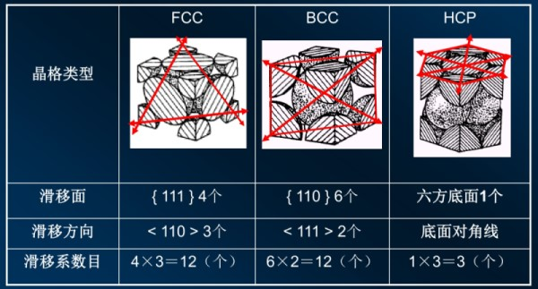

# 金属塑性变形
## 单晶体的塑性变形
1. 从微观角度上看, 单晶体塑性变形有滑移, 孪生两种方式
2. 通常孪生需要远大于滑移的切应力, 不考虑

### 滑移系

1. 滑移面通常是==原子密度最大的晶面==, 滑移方向是==滑移面上原子密度最大的方向==
2. 一个滑移面与面上的一个滑移系构成一个滑移系
3. 通常晶体的滑移系越多, 塑性变形能力越强
4. 滑移系相同时, 滑移方向越多, 塑性变形能力越强(塑性变形能力更强)
    * 因此, 面心立方塑性变形能力最强, 六方最密堆积最弱

### 应力
1. 正应力
正应力只能使晶格发生弹性伸长, 正应力大于原子间结合力时, 晶体断裂
2. 切应力
切应力足够大时, 晶体沿滑移面发生滑移, 滑移后原子达到新的平衡位置, 去掉外力不再复原, 即塑性变形
3. 临界分切应力
4. 方向与滑移面平行的力, 只有大于临界分切应力, 滑移才会开始
5. 达到临界分切应力的滑移面先开始滑移
6. 对于受拉应力的零件, 滑移面及滑移方向与外力成 $45°$ 时, 拉应力在切向的分量最大, 最易滑移

### 位错运动
1. 晶体的滑移是通过位错在滑移面上的运动实现的
2. 当塑性变形量增大, 晶体中的位错密度增大

## 多晶体的塑性变形
多晶体中, 各个晶粒的取向不同, 因此发生滑移的方向, 所需的力大小各不相同

### 塑性变形过程
1. 首先达到临界切分应力的晶粒开始滑移, 所处位向称为易滑移位向, 又称为软位向; 最难滑移的位向则称为硬位向
2. 发生滑移的同时, 各个晶粒的晶向发生转动, 使软位向晶粒变为硬位向晶粒
3. 因此多晶体的塑性变形是一个不均匀的塑性变形过程
* 位向差阻碍滑移
由于晶粒之间不能有空隙, 因此没有发生滑移的晶粒回阻碍其他晶粒的滑移
* 晶界阻碍位错运动, 当位错到达晶界后, 需要更大的力才能穿过晶界; 因此晶界处的变形很小, 晶粒内变形量较大

## 塑像变形的影响
### 对组织的影响
1. 显微组织呈现纤维状
2. 组织内亚晶粒增多(大晶粒被位错分割)
3. 产生形变织构(晶粒被拉长) 变形足够大后, 所有晶粒的位向变为与外力一致, 称为织构, 具有各向异性

### 对力学性能的影响
1. 加工硬化现象
位错增多, 导致位错运动困难, 塑性下降, 强度与硬度上升
2. 金属内部产生残余内应力
    1. 宏观内应力
    表面与心部之间变形不均
    2. 微观内应力
    晶粒内与之间形变不均匀
    3. 晶格畸变内应力
    晶格畸变与位错密度导致, 为主要内应力, 是金属强化的主要因素

## 变形后的加热变化
### 回复
1. 也称为去应力退火
2. 加热温度低, 拉长的显微组织不发生变化
3. 点缺陷减少, 位错密度降低, 内应力显著减小
4. 用于冷加工金属, 如弹簧, 保留硬度稳定组织
5. 强度, 硬度略有降低, 塑性上升

### 再结晶
1.  也称为再结晶退火
2. 在位错聚集的地方重新形核合长大
3. 新晶粒的晶体中缺陷减少, 内应力小时
4. ==再结晶温度 $T_{\text{再}}=0.4T_{\text{熔}}$==, ==单位 $K$, 不是摄氏度==, 要先转换为 $K$ 再计算
    1. 金属变形量越大, 再结晶温度越低
    2. 金属纯度越低再结晶温度越高(杂质阻碍扩散)
5. 用于消除加工硬化, 便于下一步加工
6. 强度, 硬度降低, 塑性上升

### 晶粒长大
1. 再结晶阶段过后, 晶粒长大
2. 加热温度越高, 保温时间越长, 晶粒越大
3. 变形度如果不够大, 变形储能小, 不足以引起再结晶
4. 变形度小, 变形不均匀, 只有部分地方再结晶, 形成大晶核, 称为临界变形度, 需要避开
5. 性能恶化, 塑性明显下降, 需要避免

### 冷加工与热加工
1. 将加工温度在再结晶温度以上称为热加工
2. 热加工中, 加工硬化与再结晶同时发生, 加工硬化消失

### 金属断裂
1. 韧性断裂
断裂前发生了明显的宏观塑性变形的断裂(即发生了较大的塑性变形), 断口成杯状, 粗糙
2. 脆性断裂
断裂前不发生了明显的宏观塑性变形的断裂, 断口没有变化, 平直

## 金属强化
### 提升强度
1. 细化晶粒
    * 增加晶界, 使位错堆积, 无法移动, 抵抗塑性变形
    * 晶粒越细, 塑性变形抗力愈高, ==塑性变形能力愈好==
2. 固溶强化
形成固溶体后, 晶格畸变, 增加滑移运动的阻力  
eg. 淬火时形成的过饱和铁素体
3. 弥散(第二相)强化
当位错遇到弥散的第二相时, 必须增大外应力才能通过  
eg. 回火析出了弥散细小的碳化物
4. 变形强化
加工硬化, 增大位错密度, 使位错移动受阻  
eg. 喷砂处理在金属表面制造坑洞为塑性变形
