# 有限元分析
> 参考教程 现代设计方法实用教程 孙新民等编著

## 单元与节点
有限元分析中将结构划分为一系列单元与节点

### 单元与节点的特性
节点具有位移与受力
* 节点上各方向的位移与受力均使用 $n\times 1$ 的向量表示, 其中 $n$ 为节点的自由度 (不是维度)
* 通常节点即表示物体上的一个实际点 (三维) 或连杆之间的铰链 (平面刚架)
* 对于固定支座, 可视为一个无法位移的节点
* 注意, 节点只是一个依附在物体上的几何点

单元即系统种分析的最小结构, 具有形状, 弹性模量等物理系数
* 单元之间通过节点连接, 一般一个单元上的节点数固定
* 认为单元仅接收来自节点的反力与变形, 除此之外单元没有受到其他外界作用
* 通常单元即表示物体上的一个微小物体 (三维) 或具有弹性的连杆 (平面刚架)
* 单元具有方向性与单元坐标系, 需要在划分单元时注意

### 单元与节点的编码
* 单元一般使用字母编码
    * 一般在上标加上括号使用单元编码, 可用于表示单元的物理性质如 $A^{(e)}$ 等
    * 在矩阵中使用时, 可在矩阵的上标标上 $(e)$, 表示矩阵中所有元素都具有此上标
* 节点一般使用数字编码, 且具有两种编码方式
    * 局部码, 表示该节点为单元 $a$ 中的第 $i$ 各节点, 则有编码 $i^{(a)}$, 对于杆单元, 一般认为杆单元的方向为节点 $1^{(a)}$ 指向 $2^{(a)}$
    * 全局码, 使用一个数字 $i$ 唯一表示该节点在物体上的编码
    * 因此一个节点可能具有多个局部码, 但仅有一个全局码, 且一般默认使用全局码表示节点
    * 一般在下标中使用节点编码

### 有关符号约定汇总
* 对于单元刚度矩阵
    * 使用 $[\bm{k}]^{(e)}$ 表示单元 $e$ 在单元坐标系下的刚度矩阵
    * 使用 $\bm{K}^{(e)}$ 表示单元 $e$ 在全局坐标系下的刚度矩阵
* 对于刚度系数 (对于多维情况一般为矩阵, 其中节点编号使用[全局码](#单元与节点的编码))
    * 使用 $[\bm{k}]_{ij}^{(e)}$ 表示单元 $e$ 下, 以单元坐标观察的节点 $i$ 到 $j$ 方向的刚度系数
    * 使用 $\bm{K}_{ij}^{(e)}$ 表示单元 $e$ 下, 以全局坐标观察的节点 $i$ 到 $j$ 方向的刚度系数
    * 当 $i\neq j$ 刚度矩阵表示当节点 $i$ 移动单位距离时, 节点 $j$ 受到的外力
    * 当 $i=j$ 则表示其他节点固定, 驱动节点 $i$ 移动单位距离所需的外力
* 对于节点参数 (一般为 $n\times 1$ 的向量, 其中节点编号使用[全局码](#单元与节点的编码))
    * 使用 $\bm{f}_i^{(e)}$ 表示节点 $i$ 在单元坐标系下的节点受力参数, 即==单元间的内力==
    * 使用 $\bm{F}_i$ 表示的是全局坐标系下==节点 $i$ 上的外载荷==
    * 使用 $\bm{\Phi}_i$ 表示节点 $i$ 在全局坐标系下的位移参数, 在单元坐标下则为 $\bm{\phi}_i^{(e)}$
    * 对于多个节点参数堆叠而成的参数, 使用多下标表示, 如节点 $i, j$ 的位移参数为 $\bm{\phi}_{i,j}^{(e)}=\begin{bmatrix}\bm{\phi}_{i,j}^T&\bm{\phi}_{i,j}^T\end{bmatrix}^{(e)T}$
* 对于全局刚度矩阵
    * 使用 $\bm{K}$ 表示全局刚度矩阵
    * 使用 $\bm{K}_{ij}$ 表示节点 $i$ 到 $j$ 方向的全局刚度系数
* 使用 $\bm{T}^{(e)}$ 表示==全局坐标系映射到单元坐标系==的坐标转换矩阵

## 一维杆件
### 单元与节点特性
#### 一维杆件的单元
* 一维杆件的单元通常为具有弹性的一维杆, 或着一维弹簧
* 单元具有刚度属性 $k^{(e)}$, ==对于一维杆则有 $k^{(e)}=\frac{E^{(e)}A^{(e)}}{L^{(e)}}$==
* 一个一维杆单元与两个节点连接
* 单元的坐标系只有一个方向, 且通常与世界坐标系平行  
此时所有节点的坐标系同向, 因此不区分单元坐标系与世界坐标系

#### 一维杆件的节点
* 一维杆件的节点通常为两个杆的连接处, 或者单平动自由度的质点如小车
* 一维杆件的节点==具有 $x$ 方向的一个自由度==
* 节点的受力参数为标量 $F_i$, 位移参数为标量 $\Phi_i$, 以节点坐标系正方向为正
* 与单元关联的力参数向量写为 $\bm{F}_{i,j}=\begin{bmatrix}F_{i}&F_{j}\end{bmatrix}^{T}$
* 与单元关联的位移参数向量写为 $\bm{\Phi}_{i,j}=\begin{bmatrix}\Phi_{i}&\Phi_{j}\end{bmatrix}^{T}$

### 刚度矩阵的导出

#### 一维杆单元刚度矩阵
对于单元 $e$ , 以及与单元相连的两个节点 $i,j$  
假设杆件在节点 $i$ 或 $j$ 处发生了单位位移, 包括另一节点在内的其他节点固定, 其他杆件视为刚体, 根据受力平衡杆件受到如图所示的外力 (图中的力以单元坐标系为参考方向)  
将以上情况带入单元平衡方程中可得
$$\bm{f}^{(e)}_{i,j}=\begin{bmatrix}k\\-k\end{bmatrix}^{(e)}=[\bm{k}]^{(e)}\begin{bmatrix}1\\0\end{bmatrix}^{(e)},\bm{f}^{(e)}_{i,j}=\begin{bmatrix}-k\\ k\end{bmatrix}^{(e)}=[\bm{k}]^{(e)}\begin{bmatrix}0\\1\end{bmatrix}^{(e)}$$

因此可得到杆单元的单元刚度矩阵满足
$$[\bm{k}]^{(e)}=\begin{bmatrix}
k&-k\\
-k&k\\
\end{bmatrix}^{(e)}=\frac{E^{(e)}A^{(e)}}{L^{(e)}}\begin{bmatrix}
1&-1\\
-1&1\\
\end{bmatrix}$$

观察单元刚度矩阵可得, 单元刚度矩阵的各个元素反映了单元 $e$ 内节点 $i,j$ 之间的关系有
$$[\bm{k}]^{(e)}=\begin{bmatrix}
k_{i,i}&k_{j,i}\\
k_{i,j}&k_{j,j}\\
\end{bmatrix}^{(e)}$$

#### 节点间的刚度矩阵
其中的 $k_{i,j}^{(e)}$ 即[节点间的刚度矩阵](#有关符号约定汇总) (系数), 满足
* 认为节点 $i$ 的一个方向发生了单位位移, 除此外的其他节点固定, 除 $e$ 外的其他单元为刚体, 且以单元坐标系为位移与受力参数的观察坐标系
* 当 $i=j$ 表示在以上约束下驱动节点 $i$ 移动单位距离所需的外力
* 当 $i\neq j$ 表示此时单元在节点 $j$ 受到的约束反力 
* 对于包含多个方向的位移参数, 方向 $m$ 的单位位移产生的反力代表了矩阵 $[\bm{k}]_{ij}^{(e)}$ 的第 $m$ 列 (该条用于具有多个位移参数的情况, 对于一维杆件不需要)

上述讨论的为单元坐标系下的节点间的刚度矩阵 $[\bm{k}]_{i,j}^{(e)}$  
在全局坐标系下有 $\bm{K}_{i,j}^{(e)}$, 性质相同

#### 一维杆件的总体刚度矩阵
由于没有坐标系转换, 因此 $[\bm{k}]^{(e)}=\bm{K}^{(e)}$  

与单元坐标系下的单元刚度矩阵的集成类似, 全局坐标系下的单元刚度矩阵也可进行分解, 有
$$[\bm{k}]^{(e)}=\bm{K}^{(e)}=\begin{bmatrix}
K_{i,i}&K_{j,i}\\
K_{i,j}&K_{j,j}\\
\end{bmatrix}^{(e)}$$

根据叠加法, 假设其他单元均为刚体, 则此时的全局刚度矩阵除 $(i,i),(i,j),(j,i),(j,j)$ 处的元素与对应的节点间单元刚度外, 均为 $0$, 由此可通过单元刚度矩阵进行集成得到全局刚度矩阵

首先定义节点 $i$ 到节点 $j$ 的刚度矩阵 (系数)满足
$$K_{i,j}=\sum_{\text{单元}} \bm{K}_{i,j}^{(e)}$$

最后将各个全局坐标系下的所有 $m$ 个节点间刚度矩阵进行集成, 即等效为将所有单元单独作用的刚度矩阵进行叠加, 可得到全局刚度矩阵满足
$$\bm{K}=\begin{bmatrix}
K_{1,1}&\dots&K_{1,m}\\
\vdots&\ddots&\vdots\\
K_{m,1}&\dots&K_{m,m}
\end{bmatrix}$$

### 求解处理

最终求解即通过全局位移平衡方程, 求出系统各个节点的受力与位移
$$\bm{K}\bm{\Phi}=\bm{F}$$

根据受力平衡易得单元刚度矩阵 $[\bm{k}]^{(e)}$ 与总体刚度矩阵 $\bm{K}$ 必定为==不可逆的对称矩阵== (该性质对任何单元均成立)  
因此仅当有至少一个节点被约束时, 才能求解方程

#### 单元划分方法
* 通常将杆件中具有相同[属性](#一维杆件的单元)的部分划分为一个单元
* 当杆件的属性连续变化时, 则只能划分有限个单元进行离散化, 划分的越密精度越高
* 对于系统的约束点, 受载点通常也作为一个节点, 如果位于杆件中间时则将以此为界划分单元

#### 约束与载荷的处理
* 对于外载荷 $\bm{F}$
    * 当节点没有受力也没有受约束时, 对应的外载荷 $F_i=0$
    * 当节点没有受约束但具有外载荷 $P$ 作用时, 对应的外载荷 $F_i=P$  
    (注意外载荷正方向是否与全局坐标系相同)
    * 当节点受约束时, 节点的外载荷未知
* 对于被约束的节点
    * 节点被约束自由度下的位移参数为约束变形 $\Phi_i=u$, 对于固定端约束 $u=0$
    * 约束位移参数对应的外载荷未知
    * 通常使用以下方法处理
        * 假设被约束的全局位移参数为第 $m$ 个参数 
        * 令平衡方程中的刚度矩阵 $\bm{K}$ 的第 $m$ 行与第 $m$ 列整列设为 $0$, 但 $(m,m)$ 元素为 $1$
        * 令对应第 $m$ 个全局外载荷参数为 $u$ (即约束量)
        * 解出位移参数 $\bm{\Phi}$ 后代回刚度矩阵 $\bm{K}$ 得到约束反力
        * 相当于去除约束参数的影响, 通过删除特定行与列再补充等式可得到相同效果

#### 例题演示
以如上图所示的系统  
将阶梯杆划分为两个单元 $a,b$, 将杆的两端以及相连处分为三个节点 $1,2,3$  
两个单元分别有单元刚度矩阵
$$
\begin{split}&\bm{K}^{(a)}=\frac{E^{(a)}A^{(a)}}{L^{(a)}}\begin{bmatrix}
1&-1\\
-1&1\\
\end{bmatrix}=\begin{bmatrix}
K_{1,1}&K_{2,1}\\
K_{1,2}&K_{2,2}\\
\end{bmatrix}^{(a)}\\ 
&\bm{K}^{(b)}=\frac{E^{(b)}A^{(b)}}{L^{(b)}}\begin{bmatrix}
1&-1\\
-1&1\\
\end{bmatrix}=\begin{bmatrix}
K_{2,2}&K_{3,2}\\
K_{2,3}&K_{3,3}\\
\end{bmatrix}^{(b)}\end{split}$$

整合可得全局刚度矩阵
$$\bm{K}=\begin{bmatrix}
\frac{E^{(a)}A^{(a)}}{L^{(a)}}&-\frac{E^{(a)}A^{(a)}}{L^{(a)}}&0\\
-\frac{E^{(a)}A^{(a)}}{L^{(a)}}&\frac{E^{(a)}A^{(a)}}{L^{(a)}}+\frac{E^{(b)}A^{(b)}}{L^{(b)}}&-\frac{E^{(b)}A^{(b)}}{L^{(b)}}\\
0&-\frac{E^{(b)}A^{(b)}}{L^{(b)}}&\frac{E^{(b)}A^{(b)}}{L^{(b)}}
\end{bmatrix}$$

带入固定约束 $\Phi_1=0$ 与外载荷 $F_3=-F$ 有位移平衡方程

$$\begin{bmatrix}
1&0&0\\
0&\frac{E^{(a)}A^{(a)}}{L^{(a)}}+\frac{E^{(b)}A^{(b)}}{L^{(b)}}&-\frac{E^{(b)}A^{(b)}}{L^{(b)}}\\
0&-\frac{E^{(b)}A^{(b)}}{L^{(b)}}&\frac{E^{(b)}A^{(b)}}{L^{(b)}}
\end{bmatrix}\begin{bmatrix}\Phi_1 \\ \Phi_2\\ \Phi_3\end{bmatrix}=\begin{bmatrix}0\\ 0\\ -F\end{bmatrix}$$

## 平面刚架
用于由可视为一维直线的杆件 (单个杆内截面, 材料性质不变) 之间, 使用固连约束 (刚架) 或铰链约束 (桁架) 链接为的平面结构

### 平面刚架单元与节点特性
#### 平面刚架的单元
* 平面刚架单元通常为具有弹性的一维梁, 因此也称为梁单元
* 单元具有属性: 弹性模量 $E^{(e)}$, 面积 $A^{(e)}$, 长度 $L^{(e)}$, 截面矩 $J^{(e)}$
* 一个梁单元在两端与两个节点连接
* 平面刚架单元的坐标系具有 $x,y$ 方向与一个平面旋转, 具体见[平面刚架单元的坐标系](#平面刚架单元的坐标系)介绍  
    * 同样世界坐标系也具有 $x,y$ 方向, 但不一定与单元坐标平行
    * 通常所有坐标系均以逆时针旋转为旋转的正方向, 因此不做区分

#### 平面刚架的节点
* 平面刚架的节点通常为梁之间的固连约束 (不是铰链)
* 平面刚架的节点==具有 $x,y$ 方向与平面旋转共三个自由度==
* 节点的力参数为向量 
    * 力参数包含 $x,y$ 方向的力以及平面力矩
    * 全局坐标系下的力参数写为 $\bm{F}_i=\begin{bmatrix}F_{xi}&F_{yi}&M_i\end{bmatrix}$
    * 单元坐标系下的力参数写为 $\bm{f}_i^{(e)}=\begin{bmatrix}T_{i}&Q_{i}&M_i\end{bmatrix}^{(e)}$ (字母分别代表拉力, 剪力与弯矩)
    * 与单元关联的力参数向量写为 $\bm{f}_{i,j}^{(e)}=\begin{bmatrix}\bm{f}_{i}^T&\bm{f}_{j}^T\end{bmatrix}^{(e)T}$
* 节点位移参数为标量
    * 位移参数包含 $x,y$ 方向的平动以及平面转动
    * 全局坐标系下的力参数写为 $\bm{\Phi}_i=\begin{bmatrix}u_i&v_i&\theta_i\end{bmatrix}$
    * 单元坐标系下的力参数写为 $\bm{\phi}_i^{(e)}=\begin{bmatrix}\Delta_i&f_i&\theta_i\end{bmatrix}^{(e)}$ (字母分别代表拉伸, 挠度与转角)
    * 与单元关联的位移参数向量写为 $\bm{\phi}_{i,j}^{(e)}=\begin{bmatrix}\bm{\phi}_{i}^T&\bm{\phi}_{j}^T\end{bmatrix}^{(e)T}$

#### 平面刚架单元的坐标系

对于梁单元, 其单元坐标系与全局坐标系具有如图所示的联系

使用如下方法确定单元坐标系
* 通常以梁单元中编号较小的节点作为单元坐标系原点
* 将原点指向另一节点的方向作为坐标系的 $x$ 轴方向
* 将 $x$ 轴正方向逆时针旋转 $90^\circ$ 得到 $y$ 轴方向
* 根据坐标系的定义可得, 沿 $x$ 方向的力即压力, 沿 $y$ 方向的力即剪力
* 记世界坐标系 $x$ 轴与单元坐标系 $x^{(e)}$ 轴夹角为 $\varphi^{(e)}$, ==以全局坐标系的 $x$ 轴逆时针旋转到单元坐标系 $x^{(e)}$ 轴为正==

### 平面刚架刚度矩阵的导出
#### 梁单元刚度矩阵
对于单元 $e$ , 以及与单元相连的两个节点 $i,j$  
与[一维杆件单元刚度矩阵](#一维杆单元刚度矩阵)的求解类似, 分别假设节点 $i$ 与节点 $j$ 在单元坐标系的 $x,y$ 与 $\theta$ 方向发生了单位位移, 计算节点的主动力与另一节的约束反力, 组合即可得到单元刚度矩阵  

具体可参考材料力学进行推导, 推导可得到梁单元的单元刚度矩阵满足 (下式中未给出的部分可通过单元刚度矩阵的对称性得到)

$$
[\bm{k}]^{(e)}=\begin{bmatrix}
\frac{EA}{L}&0&0&-\frac{EA}{L}&0&0\\
\\
&\frac{12EJ}{L^3}&\frac{6EJ}{L^2}&0&-\frac{12EJ}{L^3}&\frac{6EJ}{L^2}\\
\\
&&\frac{4EJ}{L}&0&-\frac{6EJ}{L^2}&\frac{2EJ}{L}\\
\\
&&&\frac{EA}{L}&0&0\\
\\
&&&&\frac{12EJ}{L^3}&-\frac{6EJ}{L^2}\\
\\
&&&&&\frac{4EJ}{L}
\end{bmatrix}^{(e)}
$$

#### 刚度矩阵的坐标变换
根据[平面刚架单元的坐标系](#平面刚架单元的坐标系)的特点可得, 通过平面旋转矩阵可以确定两个坐标系间 $x,y$ 轴的关系, 而两个坐标系的旋转正方向总是相同

对于梁单元内的两个节点 $i,j$ 定义坐标转换矩阵 $\bm{T}^{(e)}$
$$\bm{\Phi}_{i,j}=\begin{bmatrix}\bm{\Phi}_{i}\\\bm{\Phi}_{j}\end{bmatrix}=\bm{T}^{(e)}\bm{\phi}^{(e)}_{i,j}=\bm{T}^{(e)}\begin{bmatrix}\bm{\phi}^{(e)}_{i}\\\bm{\phi}^{(e)}_{j}\end{bmatrix}$$

根据两坐标系关系可得坐标转换矩阵 $\bm{T}^{(e)}$ 满足下式, 注意 $\bm{\phi}^{(e)}_{i,j},\bm{\Phi}_{i,j}$ 包含了两个位置参数  
$\bm{R}(\varphi^{(e)})$ 相当于全局坐标系观察下, 旋转 $\varphi^{(e)}$ 得到节点坐标系的变换矩阵 ${^{W}_{(e)}}\bm{R}$
$$
\bm{T}^{(e)}=\begin{bmatrix}
\bm{R}(\varphi^{(e)})\\
&1&&\\
&&\bm{R}(\varphi^{(e)})&\\
&&&1\\
\end{bmatrix},\;\bm{R}(\varphi^{(e)})=\begin{bmatrix}
\cos(\varphi)&-\sin(\varphi)\\
\sin(\varphi)&\cos(\varphi)
\end{bmatrix}^{(e)}$$

对于节点的力参数类似有
$$\bm{F}_{i,j}=\bm{T}^{(e)}\bm{f}^{(e)}_{i,j}$$

易得矩阵 $\bm{T}^{(e)}$ 同样为正交矩阵, 具有性质 $\bm{T}^{(e)-1}=\bm{T}^{(e)T}$  
将该性质用于单元平衡方程时有

$$\begin{split}
[\bm{k}]^{(e)}\bm{\phi}^{(e)}_{i,j}&=\bm{f}^{(e)}_{i,j}\\
[\bm{k}]^{(e)}\bm{T}^{(e)T}\bm{\Phi}^{(e)}_{i,j}&=\bm{T}^{(e)T}\bm{F}^{(e)}_{i,j}\\
\bm{K}^{(e)}\bm{\Phi}^{(e)}_{i,j}&=\bm{F}^{(e)}_{i,j}
\end{split}$$

因此, 单元坐标系下的单位刚度矩阵与全局坐标系下的单元刚度矩阵之间满足关系
$$\bm{K}^{(e)}=\bm{T}^{(e)}[\bm{k}]^{(e)}\bm{T}^{(e)T}$$

#### 平面刚架的总体刚度矩阵
参考[节点间的刚度矩阵](#节点间的刚度矩阵), 单元刚度矩阵也可以分解为四个 $3\times 3$ 的节点间的刚度矩阵满足
$$\bm{K}^{(e)}=\begin{bmatrix} \bm{K}_{i,i}&\bm{K}_{j,i}\\ \bm{K}_{i,j}&\bm{K}_{j,j}\\ \end{bmatrix}^{(e)}$$

与[一维杆件的总体刚度矩阵](#一维杆件的总体刚度矩阵)的求取相同  
首先对单元下节点间的刚度矩阵使用叠加法进行组合, 得到总体的节点间刚度矩阵
$$\bm{K}_{i,j}=\sum_{\text{单元}} \bm{K}_{i,j}^{(e)}$$

最后集成节点间刚度矩阵, 得到总体的刚度矩阵
$$\bm{K}=\begin{bmatrix} K_{1,1}&\dots&K_{1,m}\\ \vdots&\ddots&\vdots\\ K_{m,1}&\dots&K_{m,m} \end{bmatrix}$$

### 平面刚架问题求解
#### 平面刚架求解步骤
1. 对结构进行离散化, 通常以刚架结构中的杆件为梁单元, 杆件间的固连约束为节点
1. 对离散化的单元与节点进行编号, 同时确定各单元坐标系, 以及全局坐标系到单元坐标系的转角 $\varphi^{(e)}$
1. 根据单元属性确定 $[\bm{k}]^{(e)}$, 根据转角确定 $\bm{T}^{(e)}$, 最后得到全局单元刚度矩阵 $\bm{K}^{(e)}=\bm{T}^{(e)}[\bm{k}]^{(e)T}\bm{T}^{(e)}$
1. 集成节点间刚度矩阵, 得到总体刚度矩阵 $\bm{K}^{(e)}$
1. 列写位移平衡方程, 得到节点的位移与载荷, 关于约束与载荷的处理可[参考](#约束与载荷的处理)

#### 平面桁架问题分析
在平面桁架问题中, 杆件之间通过铰链连接, 因此无法传递转矩, 节点只有 $x,y$ 方向的两个自由度  
因此平面桁架问题与平面刚架问题基本相同, 仅需认为弯矩 $M$ 与转角 $\theta$ 为 $0$

## 弹性平面
用于具有相等厚度的, 且厚度远小于平面尺寸, 仅承受平行于平面载荷的弹性平面

### 弹性平面单元与节点特性
#### 弹性平面的单元
* 在弹性平面问题中使用三角形平面单元, 通常为整个平面的一部分
* 单元具有属性
    * 弹性模量 $E^{(e)}$ 与泊松比 $\mu^{(e)}$, 具体见[平面三角单元刚度矩阵](#平面三角单元刚度矩阵)
    * 单元三个节点在单元坐标系的坐标 $(x_1,y_1)^{(e)},(x_2,y_2)^{(e)},(x_3,y_3)^{(e)}$ (使用局部码, 具体见[位移模式与形状矩阵](#位移模式与形状矩阵))
* 一个三角形平面单元与==三个节点连接==, 并且与其他单元公用边
* 三角形平面单元具有 $x,y$ 方向的坐标系
    * 通常以编号最小单元指向编号第二小单元方向为 $x$ 轴正方向
    * 以逆时针旋转 $90^\circ$ 为 $y$ 轴正方向

#### 弹性平面的节点
* 弹性平面的节点通常为==三角形单元之间的公共顶点==
* 弹性平面的节点具有 $x,y$ 方向的两个自由度
* 节点的力参数为向量
    * 力参数包含 $x,y$ 方向的力
    * 全局坐标系下的力参数写为 $\bm{F}_i=\begin{bmatrix}F_{xi}&F_{yi}\end{bmatrix}$
    * 单元坐标系下的力参数写为 $\bm{f}_i^{(e)}=\begin{bmatrix}f_{xi}&f_{xi}\end{bmatrix}^{(e)}$
    * 与单元关联的力参数向量写为 $\bm{f}_{i,j,k}^{(e)}=\begin{bmatrix}\bm{f}_{i}^T&\bm{f}_{j}^T&\bm{f}_{k}^T\end{bmatrix}^{(e)T}$
* 节点的位移参数为向量
    * 位移参数包含 $x,y$ 方向的位移
    * 全局坐标系下的位移参数写为 $\bm{\Phi}_i=\begin{bmatrix}U_{i}&V_{i}\end{bmatrix}$
    * 单元坐标系下的位移参数写为 $\bm{\phi}_i^{(e)}=\begin{bmatrix}u_{i}&v_{i}\end{bmatrix}^{(e)}$
    * 与单元关联的位移参数向量写为 $\bm{\phi}_{i,j,k}^{(e)}=\begin{bmatrix}\bm{\phi}_{i}^T&\bm{\phi}_{j}^T&\bm{\phi}_{k}^T\end{bmatrix}^{(e)T}$

### 弹性平面刚度矩阵的导出

#### 节点位移与单元应变
在以下推导中, 使用[局部编码](#单元与节点的编码)确定节点, 并且==按逆时针方向从小到大确定局部编码==

为了确定三角形单元三个节点与单元应变之间的关系, 首先要找出节点位移与单元内任意一点 $(x,y)^{(e)}$ 的位移 $\bm{\phi}^{(e)}(x,y)$ 之间的关系  
根据几何知识, 可以认为单元内任意一点位移可使用以下一阶公式近似表达 (阶数越高越准确)

$$\bm{\phi}^{(e)}(x,y)\approx \bm{N}^{(e)}(x,y)\bm{\phi}^{(e)}_{i,j,k}$$

其中矩阵 $\bm{N}^{(e)}(x,y)$ 称为**形状矩阵**, 为一个与单元三个节点坐标 (即三角形顶点) 有关的 $2\times 6$ 矩阵, 满足
$$\bm{N}^{(e)}(x,y)=\begin{bmatrix}
N_1(x,y)&0&N_2(x,y)&0&N_3(x,y)&0\\
0&N_1(x,y)&0&N_2(x,y)&0&N_3(x,y)\\
\end{bmatrix}^{(e)}$$

矩阵中的 $N_1,N_2,N_3$ 称为**形状函数**, 满足 (其中 $x_{ij}$ 表示 $x_i-x_j$, 其他类似)
$$\begin{cases}
N_1^{(e)}(x,y)=(a_1+y_{23}x+x_{32}y)/2\Delta\\
N_2^{(e)}(x,y)=(a_2+y_{31}x+x_{13}y)/2\Delta\\
N_3^{(e)}(x,y)=(a_3+y_{12}x+x_{21}y)/2\Delta
\end{cases}\quad
\begin{cases}
a_1=x_2y_3-x_3y_2\\
a_2=x_3y_1-x_1y_3\\
a_3=x_1y_2-x_2y_1\\
2\Delta=x_{32}y_{12}-x_{21}y_{23}\\
(\text{两倍三角形面积})
\end{cases}$$

对于推导得到的形状函数有特点
* $N_i^{(e)}(x_i,y_i)=1,N_j^{(e)}(x_i,y_i)=0,(i\neq j)$
* $N_1^{(e)}(x,y)+N_2^{(e)}(x,y)+N_3^{(e)}(x,y)=1$

通过以上的形状矩阵, 即可确定单元应变 $\bm{\varepsilon}^{(e)}=\begin{bmatrix}\varepsilon_x&\varepsilon_y&\gamma_{xy}\end{bmatrix}^{(e)T}$ 与节点位移 $\bm{\phi}^{(e)}_{i,j,k}$ 之间的关系  
$$\bm{\varepsilon}^{(e)}=\bm{B}^{(e)}\bm{\phi}^{(e)}_{i,j,k}$$

上式中的 $3\times 6$ 的矩阵 $\bm{B}^{(e)}$ 称为**几何矩阵**具体推导略, 其满足
$$\bm{B}^{(e)}=\frac{1}{2\Delta}\begin{bmatrix}
y_{23}&0&y_{31}&0&y_{12}&0\\
0&x_{32}&0&x_{13}&0&x_{21}\\
x_{32}&y_{23}&x_{13}&y_{31}&x_{21}&y_{12}
\end{bmatrix}$$

#### 平面三角单元刚度矩阵
根据平面弹性力学可得, 三角形单元的应力 $\bm{\sigma}^{(e)}=\begin{bmatrix}\sigma_x&\sigma_y&\tau_{xy}\end{bmatrix}^{(e)}$ 与应变 $\bm{\varepsilon}^{(e)}$ 之间满足
$$\bm{\sigma}^{(e)}=\bm{D}^{(e)}\bm{\varepsilon}^{(e)}$$

其中矩阵 $\bm{D}^{(e)}$ 为一个与单元的物理属性有关的**平面弹性矩阵**, 满足
$$\bm{D}^{(e)}=\frac{E}{(1-\mu)}\begin{bmatrix}
1&{\mu}&0\\
{\mu}&1&0\\
0&0&\frac{1-\mu}{2}
\end{bmatrix}$$

如果给定的是剪切模量 $G$, 可通过此公式得到其他物理属性 $G=\frac{E}{2(1+\mu)}$

最后使用虚位移法, 结合平面弹性矩阵 $\bm{D}^{(e)}$ 与几何矩阵 $\bm{B}^{(e)}$ 可以得出三角形单元的单元刚度矩阵
$$[\bm{k}]^{(e)}=t\Delta\bm{B}^{T}\bm{D}\bm{B}$$

其中 $t$ 为弹性平面的厚度, $\Delta$ 为三角形单元的面积

#### 弹性平面的总体刚度矩阵
类似[平面桁架](#刚度矩阵的坐标变换), 三角形单元有**坐标转换矩阵** $\bm{T}^{(e)}$ 满足 (注意一个单元上有三个节点)
$$\bm{T}^{(e)}=\begin{bmatrix} 
\bm{R}(\varphi^{(e)})\\ 
&\bm{R}(\varphi^{(e)})\\ 
&&\bm{R}(\varphi^{(e)})\\
\end{bmatrix},\;
\bm{R}(\varphi^{(e)})=\begin{bmatrix} \cos(\varphi)&-\sin(\varphi)\\ \sin(\varphi)&\cos(\varphi) \end{bmatrix}^{(e)}$$

其中根据[三角形单元坐标系](#弹性平面的单元)可知 $\varphi^{(e)}=\operatorname{Arctan}(y_{21},x_{21})$

并且单元坐标系下的单位刚度矩阵与全局坐标系下的单元刚度矩阵之间同样满足关系
$$\bm{K}^{(e)}=\bm{T}^{(e)}[\bm{k}]^{(e)}\bm{T}^{(e)T}$$

由于一个单元上有三个节点, 因此全局刚度矩阵分解为[节点间的刚度矩阵](#节点间的刚度矩阵)时有
$$\bm{K}^{(e)}=\begin{bmatrix} 
\bm{K}_{i,i}&\bm{K}_{j,i}&\bm{K}_{k,i}\\ 
\bm{K}_{i,j}&\bm{K}_{j,j}&\bm{K}_{k,j}\\ 
\bm{K}_{i,k}&\bm{K}_{j,k}&\bm{K}_{k,k}\\ 
\end{bmatrix}^{(e)}$$

最后总体刚度矩阵的集成与[平面刚架的总体刚度矩阵](#平面刚架的总体刚度矩阵)相同

### 弹性平面问题求解
#### 非节点载荷的等效
对于作用在单元上的载荷, 由于单元不能承受载荷, 因此需要使用虚功原理将单元载荷移动到单元节点上, 等效为作用在节点上的载荷  
以下为两种常见情况的等效方法 (对于 $y$ 方向结论类似)

* 作用在单元一边上任意点的 $x$ 方向集中力 $Q$ 可等效为  
$F_{ix}=\frac{l_j}{l_i+l_j}Q,\;F_{jx}=\frac{l_i}{l_i+l_j}Q$
* 作用在单元一边上的 $x$ 方向的均匀分布力 $q$ 可等效为  
$F_{ix}=F_{jx}=\frac{qlt}{2}$ ($l$ 为边长, $t$ 为板厚)

## 有限元分析相关问题
### 总体刚度矩阵的存储
对于任何有限元系统, 总体刚度矩阵具有==对称性, 稀疏性, 奇异性==  
为此, 可使用特定方法存储刚度矩阵, 以减小内存空间的消耗  

根据节点间刚度矩阵可知, 仅当两个节点 $i,j$ 在至少同一个单元上 (相邻) 时, 节点间刚度矩阵 $\bm{K}_{i,j}\neq 0$  
定义全局刚度矩阵上半部分的所有非零元素都将位于一个宽度为 $N_B$ 的对角区域内, 称为半带宽, 满足
$$N_B=(\text{相邻节点编码最大差值}+1)\times\text{节点自由度}$$

因此可以使用如图所示的方法存储总体刚度矩阵, 将 $n\times n$ 总体刚度矩阵 $\bm{K}^{(e)}$ 的非零元素区域整合为 $n\times N_B$ 的矩形矩阵 $\bm{K}^{(e)*}$  

使用此方法存储总体刚度矩阵时, 确定节点编号时应保证同一单元内的节点编号相差尽量小
