# 数控加工程序的编制
> 参考教材 数控技术(第二版) 彭芳喻 唐小卫 主编

## 数控程序的编写
### 数控指令基本格式
#### 程序基本格式
* 在数控程序中最基本的单元为**指令字**  
一个指令字包含了一个字母与一个数字, 其中字母表示**地址符**, 数字则为指令的参数  
例如 `X100`

* 一个或多个指令字构成一个**程序段**, 程序段间使用 `;` 与换行分割  
程序段对其中的指令字可以任意顺序排列, 一般以空格分隔  
每个程序段表示一个具体的动作  
例如 `G00 X100 Y100 Z100;`  
注意, 除了少部分情况, 程序段中的指令字可任意组合  
在以下关于指令字的介绍中, 只会列出指令字所需的参数指令字, 而不是程序段只能有那么多指令或必须那么排列  

* 多个程序段组合成为**程序内容**, 除此之外在程序以及子程序的开头还需要声明程序号  
一般表示程序号格式为 `%` + 四位数字 (不同数控系统间存在差异)  
数控程序则一般命名为 `O<程序号>.nc`  
例如

* 程序中使用 `()` 包裹注释内容 (不建议使用中文)

```gcode
; 程序开始
%0001;

; 此时主轴还没开始转动, 先进行基础设置
N01 G92 X60 Z20;
N02 G18;

; 主要运动
N03 G00 G90 X20 Z0 S300 M03;

N04 G01 G91 Z-25 F300;
N05 G02 G91 X10 Z-5 R5 F80;
N06 G01 G91 Z-20 F300;

N07 G00 G90 X60;
N08 G00 G90 Z20;

; 主轴停止运动
N09 M02;
```

#### 常用地址符及含义
|地址符|含义|
|--|--|
|`N`|程序段顺序号 (部分数控系统中可省略)|
|`LF`|程序段结束 (部分数控系统中可省略)|
|`G`|准备功能 (描述动作执行或机床设置的设置)|
|`X,Y,Z`|主要坐标数值, 可以是负数或小数, 一般单位为 mm|
|`U,V,W`|辅助坐标数值, 同上|
|`I,J,K`|表示平行于对应坐标轴的参数, 同上|
|`F`|进给速度设置, 一般单位为 mm/min, 初始值为 0|
|`S`|主轴转速 (切削速度) 设置, 一般单位为 r/min, 初始值为 0|
|`T__`|刀具选择指令, 同时将完成换刀操作, `T` 接两位刀具号与两位刀补号 (用于车削中, 对刀确定工件坐标系), 一般使用相同编号|
|`M`|辅助功能 (机床, 刀具, 冷却液等设备控制指令)|

其余地址符通常仅在部分准备功能需要时用于表示参数, 在此不列出

#### 模态指令
模态指令即该指令字一旦执行后将持续生效, 或作为相同参数的默认值, 直到有相同或特定的指令进行替换

对于大部分除 `N,G,M` 以及六个坐标指令 (见[坐标表示方式](#坐标表示方式)) 外的地址符表示的指令均为模态指令, 被设定后将持续生效

对于 `G` 指令符中, 大部分机床设置以及运动方式设置也属于模态指令, 且同类之间相互替换  
但在手工编程时, 不建议省略关于运动方式设置的指令

例如
```gcode
N01 G00 G90 X100 Y100;
N02 G00 G90 X200 Y100;

N03 G00 G90 X100 Y100;
N04 X200;
```

`N02` 与 `N04` 所在的程序段实际执行运动完全相同  
`N04` 程序段将继承上一语句所确定的设置, 仅替换 `X` 坐标值为 `200`

### 坐标设置指令
#### 坐标表示方式
* `G90` 表明坐标值是基于工件坐标系给出的, 称为绝对编程, 默认使用此设置  
在 `G90` 绝对编程下, ==缺少参数的坐标值将使用上一运动终点的坐标值==
* `G91` 表明坐标值是基于上一运动终点给出的, 称为相对编程或增量坐标  
在 `G91` 增量编程下, ==缺少参数的坐标值将视为 0==

二者为相互替换的模态指令, 但建议手动编程时, 在给出坐标值前先确定坐标表示方式

#### 坐标系选择
以下坐标系选择指令只在绝对编程中有意义, 相对编程不需要明确的工件坐标系

* `G92 X__ Y__ Z__` 通过指定当前刀具在工件坐标系中的位置的方式改变工件坐标系  
    * 该指令一般用于车床, 临时改变工件坐标系的位置
    * 注意, 工件坐标系应当使用[刀具补偿](#刀具补偿)确定, 而不是该指令
    * 一般在一个单独的程序段中使用该指令, 使用时不会产生任何移动
* `G54~G59` 指定当前工件坐标系
    * 该指令一般用于铣床
    * 使用这六个指令分别表示六个通过 MDI 设定好的工件坐标系
    * 当指令在程序段中时, 将首先改变坐标系再执行运动

以上指令均为模态指令, 一但设置后持续生效

#### 坐标平面选择
* `G17` 设置运动主要发生在 XY 平面
* `G18` 设置==运动主要发生在 ZX 平面== (注意不按常规顺序排列)
* `G19` 设置运动主要发生在 YZ 平明

注意
* 以上三个指令均为模态指令, 可以相互替代
* 这三个指令只是用于如[圆弧移动](#圆弧移动)等发生在特定平面运动指令的参数  
实际上并不会限制[直线移动](#直线移动)
* 一般情况下默认为 `G17`, 对于只有 XZ 轴的车床, 默认为 `G18`

#### 刀具补偿
* 刀具位置补偿  
即使用该刀具时, 工件坐标系原点相对机床坐标系的位置, 需要通过对刀确定  
通过[地址符 T](#常用地址符及含义) 的后两位参数设置位置补偿的刀补号, 设置为 `00` 即取消位置刀补  
位置刀补通常在换刀后就要立刻设置, 且一般不会取消刀补
* 刀具半径补偿  
==数控程序所表示的运动总是沿着零件的理论轮廓进行==, 然而刀具并不是一条理想直线, 而具有一定的半径, 因此需要刀具半径补偿  
以下三个指令均为模态指令, 且相互替代
    * `G40` 取消刀具半径补偿, ==有刀具补偿就一定要取消刀补==
    * `G41 D__` 左刀补, 此时沿刀具前进的方向, ==刀具在工件==的左侧, 参数 `D` 为刀补号, 具体值需要通过 MDI 输入 (注意, 刀补值可能为半径或直径)
    * `G42 D__` 右刀补, 此时沿刀具前进的方向, ==刀具在工件==的右侧, 同上
* 刀具长度补偿  
不同刀具有不同的长度, 因此当有多把刀具时, 需要刀具长度补偿  
以下三个指令均为模态指令, 且相互替代
    * `G49` 取消刀具长度补偿
    * `G43 H__` 正向偏置, 一般使用此设置, 表明偏置是刀具沿 Z 轴负方向相对基准位置的差 (以安装位置为基准位置时, 偏置即刀具长度)  
参数 `H` 为偏置号, 具体值需要通过 MDI 输入
    * `G44 H__` 反向偏置, 同上

### 移动方式指令
以下几个移动指令也是可相互替代的模态指令, 当程序段表示运动时, 将选择最近一次设置的移动方式

#### 快速移动
`G00 X__ Y__ Z__`  
* 参数表示目标移动的坐标
* 该指令将使用最快的进给速度移动到指定坐标, 因此==移动路线不一定是直线==, 且不受进给速度设置指令 `F` 的影响
* 使用该指令时要注意防止刀具碰撞到零件

#### 直线移动
`G01 X__ Y__ Z__ F__`  
* 参数 `X,Y,Z` 表示目标移动的坐标, `F` 表示==移动的合成进给速度==
* 该指令将使用给定的进给速度, 以直线运动到指定坐标

#### 圆弧移动
通过圆弧移动指令 `G02,G03` 实现圆弧移动

`<圆弧所在平面> <圆弧移动指令> <圆弧终点坐标> <圆弧约束条件> F__`  
* `圆弧所在平面` 通过[坐标平面选择指令](#坐标平面选择) `G17,G18,G19` 确定
* `圆弧移动指令` 该指令与另外其他移动方式指令相互注销
    * `G02` 表示==从起始点到终点==, 以==第三轴的旋转**负**方向运动==
    * `G03` 表示==从起始点到终点==, 以==第三轴的旋转**正**方向运动==
* `圆弧终点坐标` 即以 `[G90 | G91] X__ Y__ Z__` 方式给出的==圆弧终点坐标==, 给出坐标时注意[坐标表示方式](#坐标表示方式)
* `圆弧约束条件` 存在以下两种约束条件, 选择其中一种
    * `R__` 给出圆弧的半径, 负数表示走圆心角 $>180^\circ$ 的优弧
    * `I__ J__ K__` ==圆心位置相对起点的偏置==, 三个参数分别与 `X,Y,Z` 轴对应  
        * 当参数缺少时将取 0, 因此无关的参数可不给出  
        * 由于圆弧运动总是在特定平面上, 因此==无关的参数必须取 0 或不给出==  
        * 如果希望绘制完整圆, 那么应当取`圆弧终点坐标`与起点重合, 且只能使用 `I__ J__ K__` 的方式给出约束  
        例如 `G02 G91 I10` (`G91` 的方式设定坐标而不取值, [将使用默认值 0](#坐标表示方式), 即表示圆弧终点与起点重合)
* `F` 即圆弧运动的合成进给速度

### 其他准备功能
#### 暂停进给
`G04 P__`  
* 参数 `P` 表示的是暂停时长, 一般单位为 s
* 可以暂时暂停进给, 但主轴, 冷却液等依然继续运行
* 可用于延长在特定位置的加工时间, 以得到更光整的表面

### 辅助功能指令
#### 指令的作用时间
由于辅助功能指令字本身就将完成特定动作而不需要其他指令字配合, 因此辅助功能的作用时间需要特别注意  
一般分为以下两种
* 前作用 在程序段动作之前执行, 一般为开启特定功能
* 后作用 在程序段执行之后执行, 一般为关闭特定功能

#### 程序控制指令
* `M00` 程序暂停指令  
该指令运行后主轴, 冷却液, 进给全部暂停, 但状态保留, 需要通过控制面板继续
* `M01` 计划暂停指令  
类似 `M00`, 但需要先在控制面板上按下选择停止开关才会暂停, 用于工件抽样检查
* `M02` 程序结束指令  
该指令运行后主轴, 冷却液, 进给全部关闭, 机床复位, 一般写在程序的最后一句
* `M30` 程序结束指令  
类似 `M02`, 但执行光标回到程序起始位置, 等待下一个产品加工

#### 主轴控制指令
* `M03` 主轴开始正转指令
    * 即主轴以 Z 轴的旋转负方向旋转 (以 Z 轴负方向观察, 顺时针旋转)
    * 默认使用该指令启动主轴转动, 选择正反转与使用顺逆铣削有关
* `M04` 主轴开始反转指令
* `M05` 主轴停止转动

#### 子程序相关指令
使用 `M98 P__ L__` 调用子程序
* `P` 子程序的程序号
* `L` 重复执行次数

子程序一般为一个独立的数控程序文件, 但末尾使用 `M99` 返回  
应当保证子程序与调用程序在同一文件夹下, 且被数控系统读取

可结合[宏指令](#宏指令)完成参数的传递

#### 其他控制指令
* `M08,M07,M50,M51` 开启 1, 2, 3, 4 号冷却液泵
* `M09` 关闭冷却液
* `M06` 停止进给为换刀准备, 不能完成换刀动作, 还需要[换刀指令](#常用地址符及含义) `T_D_`

### 宏指令
暂不介绍

### 车削加工编程
#### 车削加工特点
* 一般车削加工时, 加工仅在 XZ 平面上完成, 且一般 X 坐标大于 0, Z 坐标小于 0 (以端面为机床坐标系原点)
* 由于 X 轴即工件的直径方向, 为了配合零件图, X 坐标都表示为直径, 即以==实际值的两倍作为 X 坐标值== (对于两种[坐标表示方式](#坐标表示方式)均如此设置)
* 在 `G90` 下, 可使用辅助坐标值 `U,V,W` 直接表示[增量坐标](#坐标表示方式)而不需要 `G91`, 且可以与固定坐标的 `X,Y,Z` 混合使用
* 在 FANUC 数控车削系统下, [直线移动](#直线移动)还能接收参数 `C`, `R`, 用于自动创建两条直线路径之间的倒角与圆角
    * 地址符 `C__` 将根据参数, 在该条直线移动与==下一条垂直相交的直线==之间的交点处, 创建一个 $45^\circ$ 的倒角, 参数即倒角在 Z 轴方向的宽度
    * 地址符 `R__` 将根据参数, 在该条直线移动与==下一条垂直相交的直线==之间的交点处, 创建一个圆角, 参数即圆角半径
    * 参数可取正负, 判断方法见 <https://jingyan.baidu.com/article/c85b7a644c0d96003bac95ae.html>

#### 车削加工前准备
1. 装夹毛坯与刀具
1. 选择返参考点模式, 回到机床的 X, Z 轴原点
1. 进入 `MDI` 模式输入指令启动主轴, 为对刀做准备, 在一个程序段中包括以下指令字
    1. `M03` 指令使[主轴正转](#主轴控制指令)
    1. `S__` 设置[主轴转速](#常用地址符及含义), 可设置为 500
    1. `T____` 设置用于对刀的刀具号, 以及刀补号
1. 进入手轮模式, 通过以下步骤完成对刀 (以下对刀流程用于 FANUC 系统)  
对于车削, 工件坐标系一般是通过[刀具位置补偿](#车削刀具补偿)建立的
    1. 使用手轮沿 X 轴移动 (倍率先快后慢) 直到车刀触碰到毛坯, 产生少量切削
    1. 使用手轮沿 Z 轴移动退出毛坯, 主轴停转, 测量当前毛坯直径
    1. 进入 `OFFSET` 界面, 选择补正 -> 形状设置, 选择刀补号对应的 X [位置补偿](#车削刀具补偿), 输入 `X<当前直径>`, 以测量方式输入  
    1. 将刀具移动至端面外侧, 然后使用手轮沿 Z 轴移动, 直到车刀触碰到毛坯, 产生少量切削, 然后沿 X 轴切削至端面光整
    1. 进入形状设置, 选择刀补号对应的 Z [位置补偿](#车削刀具补偿), 输入 `Z0`, 以测量方式输入 
    * 备注: 测量模式即将当前刀具在机床坐标系的值加上输入值, 因此测量方式于直接输入实际测量的, 刀具相对毛坯坐标系的理论位置  
    因此以上对刀方法的本质即将以毛坯的外侧端面与轴线的交点为工件坐标系原点, 将原点设置在其他位置类似
    * 对于华中数控系统, 流程类似, 但在 `刀补` 界面, 通过 `试切直径` 与 `试切长度` 代替
1. 进入自动模式, 通过 `PROG` 界面选择 NC 程序, 点击程序启动按钮执行

#### 车削刀具补偿
在车削加工中, 主要的刀具补偿形式为刀具位置补偿, 即工件坐标系原点在工件坐标系中的位置  
一般在对刀步骤中, 在数控机床中输入补偿值, 并且刀补号一般与刀具号同名  

通过地址符 `T` 的前两位指定刀具号, 后两位指定刀补号  
刀补号对应的具体值需要在数控系统中输入  
当刀补号设定为 `00` 时, 即取消刀补 (车削中一般不会取消刀补)

#### 复合循环车削指令


复合循环车削即根据给出的 `ns~nf` 程序段规定的理论轮廓, 按指定的进到方向进行循环粗加工, 得到留下余量的轮廓等待下一步的精加工  
粗加工中, 从起点开始, 往进刀方向深入切削深度 $\Delta d$, 然后沿垂直方向进给, 加工到余量处后, 退刀 $e$ 并回到起点, 再深入到下一层切削层 $2\Delta d$ 继续切削  
图中点 $A$ 为循环指令起点, 一般为工件顶点向外偏移  
$B,C$ 为理论轮廓外沿的两点, ==且点 $B$ 的 Z 坐标, 点 $C$ 的 X 坐标与起点 $A$ 相同==, 因此不一定与理论轮廓的两端点重合, 而存在 2mm 左右的偏移量

* `G71 U__ R__ P__ Q__ X__ Z__ F__ S__` 径向进刀粗车复合循环指令
    * `U` 每次切削深度 $\Delta d$, 半径值
    * `R` 每次退刀量 $e$, 半径值
    * `P` 精加工开始程序段的顺序号
    * `Q` 精加工结束程序段的顺序号
    * `X` X 方向的加工余量, 直径值
    * `Z` Z 方向的加工余量
    * `F` 粗加工的进给速度 (精加工部分的程序可另外指定 `F`, 不会受影响)
    * `S` 粗加工的切削速度 (同上)
    * 该指令以工件的径向划分切削层, 用于切削刃平行于径向的切削车刀, 轮廓在 Z 轴方向尺度较大的情况, 如细长轴
    * 编写精加工理论轮廓注意
        * 根据径向切削车刀的特性可得, ==理论轮廓应为 $A\to B\to C$==
        * 理论轮廓的 $A\to B$ 部分一般通过 `G00` 指令完成, 注意点 $A,B$ 仅能有 X 坐标不同
* `G72 U__ R__ P__ Q__ X__ Z__ F__ S__` 端面进刀粗车复合循环指令
    * 参数含义与 `G72` 相同
    * 该指令以工件的轴向划分切削层, 用于切削刃平行于轴向的切削车刀, 轮廓在 X 轴方向尺度较大的情况, 如端面圆盘
    * 编写精加工理论轮廓注意
        * 根据径向切削车刀的特性可得, ==理论轮廓应为 $A\to C\to B$==
        * 理论轮廓的 $A\to C$ 部分一般通过 `G00` 指令完成, 注意点 $A,C$ 仅能有 Z 坐标不同
* `G73 U__ W__ R__ P__ Q__ X__ Z__ F__ S__` 仿形粗车复合循环指令
    * `U` X 方向的总进到量 $\Delta i$
    * `W` Z 方向的总进到量 $\Delta w$
    * `R` 循环加工次数
    * `P` 精加工开始程序段的顺序号
    * `Q` 精加工结束程序段的顺序号
    * `X` X 方向的加工余量, 直径值
    * `Z` Z 方向的加工余量
    * `F, S` 粗加工的加工参数, 不会影响精加工程序
    * 该指令以理论轮廓划分切削层, 用于加工具有与理论轮廓相近外形的锻造或铸造毛坯 
    * 理论轮廓应为 $A\to B\to C$, 但对于点 $B,C$ 没有具体位置要求, 只要是理论轮廓的起点与终点即可
* `G70 P__ Q__` 精加工指令 (仅用于 FANUC)
    * `P` 精加工开始程序段的顺序号
    * `Q` 精加工结束程序段的顺序号
    * 对于 FANUC 系统, 理论轮廓的程序位于外部, 通过该指令完成精加工
    * 对于华中数控系统, 没有该指令, 而是通过在复合循环粗加工完成后, 立刻执行理论轮廓程序完成精加工


对于复合循环加工还应注意如下问题
* 如图所示, 由于理论轮廓的首, 末端不为直线, 因此理论轮廓的外沿点 (即精加工的起止点) 要在轮廓末端的射线上  
以图示点 $C$ 为例, 其 $X$ 方向偏移量为 $\Delta x$ (直径值), 末端坐标 $(z_0,\phi_1)$  
则有点 $C$ 的实际坐标为 $(x_0+\Delta x,z_0+\frac{w_1}{\phi_1-\phi_2}\Delta x)$

#### 固定循环车削指令
类似于[复合循环车削指令](#复合循环车削指令)  
但只能用于切削简单的直线轮廓, 且一个指令执行一次循环

* `G80 X__ Z__ F__` 径向进刀固定循环车削 (FANUC 中为 `G91`)
    * `X,Z` 最远点的 X, Z 坐标
    * `F` 进给速度
    * 一个径向固定循环包含以下部分
        1. 从起刀点沿径向快速移动到目标 X 坐标
        1. 根据切削速度进给切削至目标 Z 坐标
        1. 根据切削速度退刀至起到点的 X 坐标
        1. 沿 Z 轴快速退刀回到起刀点
    * 通常由一个 `G80 X__ F__` 确定模态参数, 之后接多个 `W__` 根据给定的切削深度进行切削
* `G81 X__ Z__ F__` 轴向进刀固定循环车削 (FANUC 中为 `G94`)
    * 参数与用法与 `G80` 相同, 仅交换 X, Z, 即以 X 方向切削

#### 螺纹车削指令


使用 `G32 X__ Z__ [R__ E__] [P__] F__` 用于车削螺纹
* `X` 螺纹车削终点的 X 坐标, 注意应当相对被车削工件的直径深入牙型高 $2e$
* `Z` 螺纹车削终点的 Z 坐标, 注意应当根据要求留出加速段与减速段 $\delta,\delta'$, 保证螺纹车削时匀速进给
* `R` Z 向螺纹退尾量, 即图中的尺寸 $r$, 用于无退刀槽的螺纹切削, 一般 $r$ 取两倍螺距, 注意切削终点不包括退尾量
* `E` X 向螺纹退尾量, 用于无退刀槽的螺纹切削, 一般等于牙型高 $e$ 
* `P` 螺纹起始点对应的主轴转角
* `F` 螺纹的导程 $L$, 注意不是进给速度

#### 车削加工模板
```gcode
G92 X__ Z__; 指定起刀点相对理想工件坐标系的坐标
M03 F__ S__; 主轴正转, 并指定切削参数
...

G00 X__ Z__; 运动到循环加工起点 A
G71 ... F__ S__; 指定复合循环粗加工
N01 G00 X__ F__ S__; 运动到点 B 开始精加工, 并指定精加工的切削参数
...

G01 Z__; 从末端点 C 缓慢移开, 结束精加工
G00 X__ Z__; 快速移动到起刀点
M05; 关闭主轴
M30; 结束主程序
```

### 铣削加工编程
#### 铣削加工前准备
1. 装夹毛坯与刀具
1. 选择返参考点模式, 回到机床的 Z, Y, X 轴原点
1. 进入 `MDI` 模式输入指令启动主轴, 为对刀做准备, 在一个程序段中包括以下指令字
    1. `M03` 指令使[主轴正转](#主轴控制指令)
    1. `S__` 设置[主轴转速](#常用地址符及含义), 可设置为 500
    1. 对于铣削加工, 对刀刀具即安装在主轴上的刀具, ==且不存在位置刀补==, 因此不需要再选择刀具
1. 进入手轮模式, 通过以下步骤完成对刀 (以下对刀流程用于 FANUC 系统)  
对于铣削, 工件坐标系一般是通过 `G54` 等[坐标系选择](#坐标系选择)指令建立的
    1. 首先将刀具移动到工件 X 坐标较大的 YOZ 平面
    1. 使用手轮沿 X 轴移动 (倍率先快后慢) 直到车刀触碰到毛坯, 产生少量切削
    1. 进入 `OFFSET` 界面, 选择坐标系设置, 选择 `G54` 命令对应的工件坐标系 (01) 的原点在机床坐标系的 X 坐标值, 输入 `X<刀具理论位置>`, 以测量方式输入
    1. 对 Y 坐标使用类似 X 坐标的方式对刀
    1. 将刀具移动到上端面上方, 然后使用手轮沿 Z 轴移动, 直到车刀触碰到毛坯, 产生少量切削
    1. 进入坐标系设置, 选择 01 坐标系的 Z 坐标值, 输入 `Z0`, 以测量方式输入
    1. 除了坐标系, 还应当进入 `OFFSET` 界面, 选择补正设置, 确定各刀补号的[半径与垂直补偿](#铣削刀具补偿), 具体值与刀具有关
    * 关于测量方式的含义见[车削加工前准备](#车削加工前准备)中的说明
    * 习惯上将工作坐标系建立在工件上表面的原点, 因此 `刀具理论位置` 的值即刀具触碰表面时相对于原点的坐标 (不同于车削, 不需要实际值, 因此与实际中心存在少量偏差可作为余量切去), 一般即==工件长度的一半加上对刀刀具的半径==
1. 进入自动模式, 通过 `PROG` 界面选择 NC 程序, 点击程序启动按钮执行

#### 铣削刀具补偿
* 刀具半径补偿  
==数控程序所表示的运动总是沿着零件的理论轮廓进行==, 然而刀具并不是一条理想直线, 而具有一定的半径, 因此需要刀具半径补偿  
以下三个指令均为模态指令, 且相互替代
    * `G40` 取消刀具半径补偿
    * `G41 D__` 左刀补, 此时刀具在工件的左侧
        * 参数 `D` 为刀补号, 具体值需要通过数控系统输入
        * 对于 FANUC 系统, ==半径补偿使用的是直径值==  
        * 该参数具有模态性, 直接使用 `G41` 时, 将使用最近一次的刀补号
    * `G42 D__` 右刀补, 此时刀具在工件的右侧, 同上

* 刀具长度补偿  
不同刀具有不同的长度, 因此当有多把刀具时, 需要刀具长度补偿  
以下三个指令均为模态指令, 且相互替代
    * `G49` 取消刀具长度补偿
    * `G43 H__` 正向偏置, 此时该刀具长度==长于==建立坐标系的==对刀刀具==, 刀补值为设置刀具的长度减去对刀刀具, 参数 `H` 为偏置号, 具体值需要通过数控系统输入
    * `G44 H__` 反向偏置, 此时该刀具长度==短于对刀刀具短==, 刀补值为对刀刀具的长度减去设置刀具, 同上

* 理论上刀具半径补偿的大小即刀具半径, 刀具长度补偿即相对长度, 但实际中可为一把刀具设置多个刀补, 用于[轮廓铣削](#轮廓铣削)的手工编程  
* 对于钻孔, 铣削简单槽等情况可不需要半径补偿 (始终需要长度补偿), 但要注意刀具能切削以给定路径为中心, 半径为刀具半径的圆形区域

#### 基于特殊刀补的轮廓铣削


不同于车削, 对于铣削大量余量得到特定平面轮廓的任务, 并没有专门的铣削指令  
因此一般情况下, 需要专门计算刀路, 以及刀路上各点的坐标, 效率低下  
可利用半径刀补, 由数控系统计算各余量下的刀路, 使粗精加工共有一条路径, 提升效率  

* 对于给出的理论轮廓在不同的刀补值下
    * 当刀具的半径补偿为刀具半径 $D=r$ 时, 即实际刀补, 刀具将沿着切于理论路径的方向移动, 并最终加工出理论轮廓  
    * 当刀具的半径补偿为 $D=r+s$ 时, 由于额外的补偿, 最终将加工的轮廓相对理论轮廓向外留出宽度为 $s$ 的余量
* 因此可以设置如下系列的刀补值
    * $D_{1}=r$ 即理论上的半径刀补值, 用于最后一步精加工
    * $D_{2}=r+s_{r\text{细}}$ 用于倒数第二步, 留下精加工余量的粗加工
    * $D_{n}=r+s_{r\text{细}}+(n-2)s_{r\text{粗}}$ 用于其余的粗加工工步
* 在实际程序编写中
    1. 抬刀至工件上方防止撞刀, 将刀具在无刀补的情况下移动到起始点 $A$ (可以设在切削起始点 $B$ 附近, 也可设在 $(0,0)$ 点)
    1. 设置刀补, 进入描述理论路径的子程序中, 移动到路径起始点并根据切削深度设置 Z 坐标, 走完理论路径, 抬刀, 取消刀补, 回到起始点 $A$
    1. 基于刀补的性质 (启用与关闭刀补后, 必须先走一段直线作为过渡) 与切向加工的原则, 在理论路径的起点前与终点后都应有一段切向的直线路径 (最终完整路径的起点与终点即起刀点与退刀点), 可以抬刀运行这两段路径
    1. 一个刀补中可以加工多个相同刀补方向的孤岛, 且可以抬刀移动到各个孤岛, 孤岛加工顺序最好与加工单个孤岛的旋转方向相反
    1. 退出子程序后, 取消刀补 (设置与取消刀补应成对使用), 回到原点或起刀点, 再设置下一工步的刀补, 重新运行子程序, 直到加工完成
    1. 子程序中应只有路径, 最好不要在子程序中设置刀补

#### 铣削换刀
铣削换刀时, 应使用如下格式

```gcode
N01 G00 G49 Z__ M09 M05
N02 G00 X0Y0
N03 T__ M06; 
N04 G44 H__ M03 S__ F__;
```

* `N01~N02` 用于为换刀做准备, 关闭主轴 `M05` 与冷却液 `M09`, 抬刀 `G00 Z__` 取消长度补偿 `G49`, 回到原点 `G00 X0 Y0`
* `T__` 即[刀具选择指令](#常用地址符及含义), 选择新刀具的刀具号
* `M06` 即[换刀准备](#其他控制指令), 需要与换刀指令出现在同一程序段中
* `G44 H__` 在换刀后应立即设置刀具的[长度补偿](#铣削刀具补偿)
* `M03 S__ F__` 完成换刀后启动主轴并设置切削速度与进给速度
* 作为铣削程序开始时, 只需要 `G54` 设置工件坐标系后接 `N03~N04` 的代码

#### 钻孔循环指令


循环钻孔指令为一系列用于完成钻孔动作的指令  
一个钻孔循环通常包含以下部分
1. 沿 XOY 平面快速移动到钻孔点位的 X, Y 坐标
1. 沿 Z 轴快速移动到钻孔点位上方的 R 点
1. 以给定的进给速度沿 Z 轴加工孔, 直到给定的 Z 坐标位置
1. 沿 Z 轴快速返回到 R 点
1. 沿 Z 轴快速返回到加工前的 Z 坐标

最基础的钻孔循环指令为 `G81 X__ Y__ Z__ R__ F__`
* `X,Y,Z` 钻孔点位的 X, Y, Z 坐标
* `R` 钻孔前准备位置 (R 点) 的 Z 坐标
* `F` 钻孔进给速度

钻孔循环指令还有以下辅助控制
* `G98` 钻孔结束后回到加工前的 Z 坐标, 用于单件加工 (默认)
* `G99` 钻孔结束后回到 R 点, 用于多孔加工 (与 `G98` 相互注销)
* `G80` 注销循环参数

由于加工一个孔需要同时经过定位, 钻, 括, 铰等多个步骤, 期间需要多次切换刀具  
因此通常将钻孔点位写为一个子程序, 其中仅包含钻孔点的 X, Y 坐标  
通过调用子程序前, 使用钻孔循环指令确定该次钻孔除坐标外的参数, 可实现一次加工多个孔

此外对于不同的钻孔方式还有以下常用的钻孔指令
|用途|指令格式|说明|
|--|--|--|
|镗孔|`G85 X__ Y__ Z__ R__ F__`||
|扩孔|`G82 X__ Y__ Z__ R__ P__ F__`|`P` 孔底暂停时间|
|攻螺纹|`G82 X__ Y__ Z__ R__ P__ F__`|`P` 孔底暂停时间|

## 数控仿真
### 简单仿真
推荐使用网站 <https://ncviewer.com> 对数控程序进行仿真
* 点击 PLOT 按钮可以绘制当前程序的刀路 (如果看不见可以适当缩小并改变视角)
* 点击 🚫 按钮可以清除刀路
* 设置 Machine Options -> Diameter Mode 可以开启[车削编程模式](#车削加工编程)
* Backplot Options (下方按钮条右侧中间的按钮) 可以设置刀路等显示样式
* 绘制刀路后, 将显示光标所在代码的运动起点

### 斯沃仿真
#### 通用注意
* 仿真开始时, 机床的急停按钮被按下, 数控系统未开机, 需要点击开机按钮 (一般为绿色竖线标识), 松开急停才能正常使用
* 输入程序时, 可使用键盘输入内容, 回车插入程序
* 选择本地数控程序时
    * 对于 FANUC, 右键数控系统界面, 选择数控程序所在的目录为工作目录  
    通过在自动模式下, 在系统中选择操作 -> O检索 以更新外部修改或切换读取的程序
    * 对于华中数控, 可使用方向键选择程序, 回车键确定选择, 然后从菜单文件 -> 打开, 打开需要导入的数控程序  
    不建议在外部修改数控程序, 而是在数控系统内修改数控程序
* 可在菜单工件测量 -> 刀路测量中调试程序, 点击行号查看具体轨迹
* 对刀时
    * 可在菜单视窗视图中设置为俯视视图与平行投影以便于观察
    * 可在菜单显示模式中隐藏床身
    * 通过菜单工件测量以测量直径
    * 通过菜单机床操作 -> 快速定位, 可直接移动到对刀点, 减少操作

#### 车床仿真
* 系统选择  
    * 华中数控的车床数控系统为 `HNC 818A`  
    * FANUC 的车床数控系统为 `FANUC OiT`, 进入后可在右下角选择界面, 推荐使用沈阳一机的界面
* 基本开始操作
    * 通过菜单工件操作 -> 选择毛坯夹具, 可用于放置毛坯, 以及替换被加工的毛坯
    * 通过菜单机床操作 -> 刀具库管理 (添加) -> 添加到刀盘, 可用于添加刀具
    * 对刀前注意返参考点与 `MDI` 启动主轴

#### 铣床仿真
* 系统选择
    * FANUC 的车床数控系统为 `FANUC OiM`, 进入后可在右下角选择界面, 推荐使用沈阳机床厂的界面
* 基本开始操作
    * 通过菜单工件操作 -> 选择毛坯夹具, 可用于放置毛坯, 以及替换被加工的毛坯  
    对于铣床, 除了放置毛坯, 还要通过菜单工件操作 -> 工件装夹, 调高工件在虎钳的位置, 仅虎钳上方的工件可以加工
    * 通过菜单机床操作 -> 刀具库管理 (添加) -> 添加到刀盘, 可用于添加刀具  
        * 一般铣床的第一把刀具直接安装在主轴上, 不需要安装在刀盘上于使用 `T` 指令换刀
        * 注意, 刀具对应的刀具号记录在刀库表格第三列的 `T`, 使用 `T` 指令换刀是应根据此处的刀具号选择
    * 对刀前注意返参考点与 `MDI` 启动主轴
