# 刚体速度和静力
## 线矢量
### 线矢量的定义
#### 静力与角速度的特性
由理论力学的知识可得
* 对于刚体上的静力
    * 使用矢量 $\bm{f}=m\bm{n}$ 表示静力, 其中 $\bm{n}$ 为静力的方向, $m$ 为静力的幅值
    * 静力除了有方向, 还施加在刚体的特定点 $\bm{r}$, 并且在过该点的, 方向为 $\bm{n}$ 的直线上平移, 静力的效果始终不变
    * 无论刚体的受力情况如何, 总能将刚体力系简化为一个过点 $A$ 的合力 (除了 $\bm{f}\parallel\bm{\tau}$ 的力螺旋)  
    此时将合力从施加点 $A$ 移动到 $B$, 还需要附加一个 $\bm{\tau}=\bm{r}_{BA}\times\bm{f}$ 的力矩才能使刚体具有等价的受力效果
    * 与静力不同, 力矩虽然也有方向和大小, 但没有位置
* 对于刚体上的角速度
    * 使用矢量 $\bm{\omega}=\dot{\theta}\bm{n}$ 表示角速度, 其中 $\bm{n}$ 为转轴的方向, $\dot{\theta}$ 为角速度的幅值
    * 除了转轴的方向, 刚体旋转所绕的转轴可能过刚体的特定点 $\bm{r}$, 又由于转轴可以是一条无线长的直线, 因此实际上角速度可位于这条过该点, 方向为 $\bm{n}$ 的直线上的任意位置, 旋转效果始终不变
    * 无论刚体各点的瞬时速度如何, 总能将刚体视为绕过点 $A$ 的瞬时转轴 (类比速度瞬心) 旋转  
    此时将转轴从过点 $A$ 移动为过点 $B$, 以速度转轴上的点速度始终为 $0$ 的条件可得, 还应当附加一个 $\bm{v}=-\bm{\omega}\times\bm{r}_{BA}=\bm{r}_{BA}\times\bm{\omega}$ 的速度才能使刚体各点速度与移动前相同
    * 与加速度不同, 速度虽然也有大小和方向, 但刚体上各点的平动速度显然是相等的 (否则不满足刚体条件), 因此位置没有意义

由上可知, 这两个量都有以下特点
1. 具有方向与大小, 且位于特定直线上
1. 复杂力系总能简化为一单个静力, 瞬时运动总能视为绕瞬时转轴旋转运动
1. 以可平移, 但平移后将产生一个附加的, 具有方向与大小而没有位置的量

显然一般的矢量不足以表示静力与角速度, 现引入**线矢量**, 用于表示这类被约束在直线上的, 且方向与直线平行的矢量

#### 线矢量表示的导出

已知线矢量过点 $\bm{r}$, 且具有方向 $\bm{n}$  
由于线矢量在其所在的直线上可任意移动, 因此存在无数个点 $\bm{r}_i$  
显然不适合直接用直线上的点表示

但是注意, 由于这些点在一条方向为 $\bm{n}$ 直线上  
因此其之间满足关系 $\bm{r}_i=\bm{r}+k\bm{n}$  
并且对于任何 $\bm{r}_i$, $\bm{r}_i\times\bm{n}=\bm{r}\times\bm{n}+k\bm{0}$  
因此矢量 $\bm{r}\times\bm{n}$ 不随选取点而变化

因此可通过矢量 $\bm{n}$ 表明直线以及线矢量的方向  
矢量 $\bm{r}\times\bm{n}$ 表明直线上的任意点 $\bm{r}$ 应当满足的条件  

以此定义线矢量 $L$ 为一个 $L\in R^6$ 的矢量, 满足 (该定义为 Plucker 坐标规定)  
$$L=\begin{bmatrix}\bm{n}\\\bm{r}\times\bm{n}\end{bmatrix}$$

规定线矢量满足两个约束条件
* 归一化条件: $\begin{Vmatrix}\bm{n}\end{Vmatrix}=0$, 称前三个坐标为**方向矢量** $\bm{n}$
* Plucker 关系: $\bm{n}\cdot(\bm{r}\times\bm{n})=0$, 称后三个坐标为**线矩** $\bm{r}\times\bm{n}$  
该约束条件表明线矢量中, 方向适量 $\bm{n}$ 垂直于线矩 $\bm{r}\times\bm{n}$

根据约束条件注意注意
* 线矢量仅表示直线的位置与方向, 但不包含幅值信息, 还需要乘上幅值以表示具体物理量的大小
* 线矢量过点 $\bm{r}$ 可以任取, 但线矩 $\bm{r}\times\bm{n}$ 对于同一个线矢量是唯一确定的, 应将其作为一个整体

#### 力线矢量与速度线矢量
由[静力与角速度的特性](#静力与角速度的特性)可知

* 对于大小为 $m$ 的静力可以表示为力线矢量 $F=mL=\begin{bmatrix}m\bm{n}^T&m(\bm{r}\times\bm{n})^T\end{bmatrix}^T$, 其中
    * 力线线矢量的上部分即具有大小与方向的力矢量 $\bm{f}=m\bm{n}$
    * 力线线矢量的下部分则体现了将力移动到原点所附加的力矩 $\bm{\tau}=\bm{r}\times\bm{f}$
    * 使用力线矢量 $F$ 即可表示出刚体的瞬时受力状态
* 对于大小为 $\dot{\theta}$ 的角速度可以表示为速度线矢量 $V=\dot{\theta}L^r=\begin{bmatrix}\dot{\theta}(\bm{r}\times\bm{n})^T&\dot{\theta}\bm{n}^T\end{bmatrix}^T$, 其中
    * 速度线矢量的上部分体现了将转轴移动到原点时所附加的平动速度 $\bm{v}=\bm{r}\times\bm{\omega}$  
    反映了观察坐标系原点在==该转动作用下==的平动速度
    * 速度线矢量的下部分即具有大小与方向的角速度矢量 $\bm{\omega}=\dot{\theta}\bm{n}$
    * 使用速度线矢量 $V$ 即可表示出刚体的瞬时运动状态

#### 线矢量的倒置
注意, 为了统一使代表平动的效果位于上方, 代表旋转的效果位于下方, 因此速度线矢量中的线矢量与原始定义颠倒  

将这种交换上下矢量的运算称为**倒置**, 使用 $L^r$ 表示, 满足
$$L^r=\begin{bmatrix}\bm{r}\times\bm{n}\\\bm{n}\end{bmatrix}$$

不过注意, 一般线矢量要求 $\begin{Vmatrix}\bm{n}\end{Vmatrix}=1$, 一般线矢量经过倒置后为倒置线矢量, 而不满足一般线矢量的要求

#### 线矢量的倒置积运算

与一般矢量不同, 线矢量的点乘没有意义  
为了比较线矢量 $L_1$ 与 $L_2$, 现定义线矢量的**倒置积** (也称为 r-积或 reciprocal product) 满足

$$L_1\circ L_2=L_1\cdot L_2^r=\bm{n}_2\cdot(\bm{r}_1\times\bm{n}_1)+\bm{n}_1\cdot(\bm{r}_2\times\bm{n}_2)$$

根据空间几何知识, 对于空间中两条直线, 其公垂线的长度 $d$, 其与倒置积之间满足 (其中 $[\dots]$ 表示计算体积的[混合积](/course/math/Linear_Algebra/ch5.md#混合积))
$$\begin{split}
d&=\frac{\begin{Vmatrix}[\bm{n}_1\bm{n}_2(\bm{r}_1-\bm{r}_2)]\end{Vmatrix}}{\begin{Vmatrix}\bm{n}_1\times\bm{n}_2\end{Vmatrix}}\\
d&=\frac{[\bm{n}_1\bm{n}_2\bm{r}_1]-[\bm{n}_1\bm{n}_2\bm{r}_2]}{\sin\braket{\bm{n}_1,\bm{n}_2}}\\
d\sin\braket{\bm{n}_1,\bm{n}_2}&=[\bm{n}_2\bm{n}_1\bm{r}_1]-[\bm{n}_1\bm{n}_2\bm{r}_2]\\
L_1\circ L_2&=-d\sin\braket{\bm{n}_1,\bm{n}_2}
\end{split}$$

因此倒置积具有性质
* 倒置积的结果具有含义 $L_1\circ L_2=-d\sin\braket{\bm{n}_1,\bm{n}_2}$, 仅与参与运算的两个线矢量的几何关系有关  
表明线矢量在任何坐标系下观察都具有不变性, 可以通过不同的坐标系描述
* 当 $L_1\circ L_2=0$ 表明两线矢量满足以下条件之一
    * $\braket{\bm{n}_1,\bm{n}_2}=0$ 两线矢量平行
    * $d=0$ 两线矢量相交
    * $\braket{\bm{n}_1,\bm{n}_2},d=0$ 两线矢量重合

### 线矢量的坐标变换
与矢量相同, 在不同观察坐标系下, 线矢量的坐标值也将完全不同  
因此与[表示矢量](./ch1.md#矢量的符号)表示==线矢量时也必须在左上标中表示出观察坐标系==

#### 交叉积与姿态矩阵
有关交叉积的性质与符号可参考[向量交叉积](/course/math/Linear_Algebra/ch5.md#向量交叉积)  
在该笔记中, 记矢量 $\bm{u}$ 的交叉积矩阵为 $[\bm{u}]$ 满足
$$[\bm{u}]=\begin{bmatrix}
0&-u_z&u_y\\
u_z&0&-u_x\\
-u_y&u_x&0
\end{bmatrix}\quad\begin{cases}
\bm{u}\times\bm{v}=[\bm{u}]\bm{r}\\
(\bm{v}\times\bm{u})^T=\bm{v}^T[\bm{u}]=-([\bm{u}]\bm{v})^T
\end{cases}$$

由交叉积的特性可得, 对于任意矢量 $\bm{u},\bm{v}$ 及其交叉积结果 $\bm{u}\times\bm{v}$ 之间保持着以右手螺旋方向垂直于 $\bm{u},\bm{v}$ 的关系  
因此即使通过姿态矩阵 ${}^{B}_{A}\bm{R}$ 将矢量 ${}^{A}\bm{u},{}^{A}\bm{v}$ 所在的观察参考系转变为 ${}^{B}\bm{u}={}^{B}_{A}\bm{R}{}^{A}\bm{u},{}^{B}\bm{v}={}^{B}_{A}\bm{R}{}^{A}\bm{v}$, 两向量交叉积结果依然保持原有关系有 ${}^{B}\bm{u}\times{}^{B}\bm{v}={}^{B}_{A}\bm{R}({}^{A}\bm{u}\times{}^{A}\bm{v})$

推广可得对于任意[姿态矩阵](ch1.md#姿态矩阵) ==$\bm{R}$ (任意满足姿态矩阵要求的矩阵如旋转矩阵)== 与矢量 $\bm{u},\bm{v}$ 有性质
$$(\bm{R}\bm{u})\times(\bm{R}\bm{v})=\bm{R}(\bm{u}\times\bm{v})$$
 
根据此性质可推导出以下两个推论
* $[\bm{R}\bm{u}](\bm{R}\bm{v})=\bm{R}([\bm{u}]\bm{v})$  
证明: 即以上性质使用叉乘矩阵的表示形式
* $\bm{R}[\bm{u}]\bm{R}^T=[\bm{R}\bm{u}]$  
证明: $\bm{R}[\bm{u}]\bm{R}^T\bm{v}=\bm{R}[\bm{u}\times(\bm{R}^T\bm{v})]=(\bm{R}\bm{u})\times \bm{v}=[\bm{R}\bm{u}]\bm{v}$

如果是任意矩阵 $\bm{M}$ 与交叉积矩阵 $[\bm{u}]$ 运算时, 相当于矩阵的各列 / 行分别与之叉乘
* $[\bm{u}]\bm{M}=\begin{bmatrix}(\bm{u}\times\bm{m}_1) & (\bm{u}\times\bm{m}_2) & (\bm{u}\times\bm{m}_3)\end{bmatrix}$

* $\bm{M}[\bm{u}]=\begin{bmatrix}(\bm{m}_1\times\bm{u})^T \\ (\bm{m}_1\times\bm{u})^T \\ (\bm{m}_1\times\bm{u})^T\end{bmatrix}=-([\bm{u}]\bm{M})^T$

#### 线矢量的齐次坐标
除了 Plucker 坐标, 也可使用齐次坐标系表示线矢量  
注意到 (自由矢量与方向矢量的内容见[上一章](./ch1.md#矢量的符号))
* 矢量 ${}^{A}\bm{r}$ 表示了直线上的一个点, 因此是==可以被平移的方向矢量==, 因此齐次坐标系下有坐标 ${}^{A}\bm{r}=\begin{bmatrix}{}^{A}\bm{r}&1\end{bmatrix}^T$
* 矢量 ${}^{A}\bm{n}$ 表示了直线的方向, 因此是==不受平移影响的自由矢量==, 因此齐次坐标系下有坐标 ${}^{A}\bm{n}=\begin{bmatrix}{}^{A}\bm{n}&0\end{bmatrix}^T$

将二者并排即得到线矢量的齐次坐标表示为一个 $4\times 2$ 的实矩阵, 使用字母 $\bar{L}$ 表示, 有形式 
$${}^{A}\bar{L}=\begin{bmatrix}{}^{A}\bm{n}&{}^{A}\bm{r}\\0&1\end{bmatrix}$$

有了齐次坐标, 就可以运用[坐标系变换方法](./ch1.md#坐标系变换方法), 获取不同观察坐标系下, 线矢量的坐标  
对于齐次矩阵 ${}^{B}_{A}\bm{T}$ 有

$${}^{B}_{A}\bm{T}{}^{A}\bar{L}={}^{B}\bar{L}=\begin{bmatrix}{}^{B}\bm{n}&{}^{B}\bm{r}\\0&1\end{bmatrix}$$

类似线矢量的齐次坐标下的线性变换, 在[笛卡尔坐标系下坐标系变换](./ch1.md#笛卡尔坐标系下的表示)后, 两个矢量分别经历运算
* ${}^{B}_{A}\bm{R}{}^{A}\bm{n}={}^{B}\bm{n}$
* ${}^{B}_{A}\bm{R}{}^{A}\bm{r}+{}^{B}\bm{p}_{Ao}={}^{B}\bm{r}$

#### 线矢量的伴随变换推导
既然齐次坐标系下的线矢量能完成坐标系变换, Plucker 坐标下的线矢量也存方法能通过左乘特定矩阵完成坐标系变换  
定义这类矩阵为**伴随矩阵**, 实现的坐标系变换称为**伴随变换**  
使用符号 $\operatorname{Ad}_{F}({}^{A}_{B}T)$ 表示, 其中
* 下标 $F$ 表明该伴随矩阵用于力线矢量, 即一般表示的线矢量 $L$, 对于速度线矢量为倒置表示 $L^r$, 则使用下标 $V$
* 括号内的齐次矩阵给出了坐标系的描述, 因此伴随变换完成的坐标系变换与给出的齐次矩阵相同

可得, 这类矩阵必然是 $6\times 6$ 的实矩阵  
现不直接讨论整个坐标系的变换, 而是从[运动描述位姿](./ch1.md#通过运动描述位姿), 以平移与旋转两个简单的情况分析

##### 平移伴随变换
假设在观察坐标系 $\{\bm{B}\}$ 下, 观察坐标系经过平移 ${}^{B}\bm{p}_{Ao}$ 得到坐标系 $\{\bm{A}\}$  
可得, 此时的姿态矩阵为 ${}^{B}_{A}\bm{T}=\bm{D}({}^{B}\bm{p}_{Ao})$, 且其中 ${}^{B}_{A}\bm{R}=\bm{I}$, 有
$${}^{B}L=\begin{bmatrix}\bm{I}{}^{A}\bm{n}\\ (\bm{I}{}^{A}\bm{r}+{}^{B}\bm{p}_{Ao})\times\bm{I}{}^{A}\bm{n}\end{bmatrix}=\begin{bmatrix}{}^{A}\bm{n}\\ {}^{A}\bm{r}\times{}^{A}\bm{n}+[{}^{B}\bm{p}_{Ao}]{}^{A}\bm{n}\end{bmatrix}=\operatorname{Ad}_{F}[\bm{D}({}^{B}\bm{p}_{Ao})]{}^{A}L$$

观察可得 $\operatorname{Ad}_{F}[\bm{D}({}^{B}\bm{p}_{Ao})]$ 满足
$$\operatorname{Ad}_{F}[\bm{D}({}^{B}\bm{p}_{Ao})]=\begin{bmatrix}\bm{I}&\bm{0}\\ [{}^{B}\bm{p}_{Ao}] &\bm{I}\end{bmatrix}$$

与[平移算子](./ch1.md#平移算子)的逆类似, 平移伴随矩阵 $\operatorname{Ad}_{F}[\bm{D}({}^{B}\bm{p}_{Ao})]$ 有逆
$$\operatorname{Ad}_{F}^{-1}[\bm{D}({}^{B}\bm{p}_{Ao})]=\operatorname{Ad}_{F}[\bm{D}(-{}^{B}\bm{p}_{Ao})]=\begin{bmatrix}\bm{I}&\bm{0}\\ -[{}^{B}\bm{p}_{Ao}] &\bm{I}\end{bmatrix}$$

##### 旋转伴随变换
假设在观察坐标系 $\{\bm{B}\}$ 下, 观察坐标系经过旋转 ${}^{B}_{A}\bm{R}$ 得到坐标系 $\{\bm{A}\}$  
可得, 此时的姿态矩阵为 ${}^{B}_{A}\bm{T}={}^{B}_{A}\bm{R}$, 且其中 ${}^{B}\bm{p}_{Ao}=\bm{0}$, 有
$${}^{B}L=\begin{bmatrix}{}^{B}_{A}\bm{R}{}^{A}\bm{n}\\ ({}^{B}_{A}\bm{R}{}^{A}\bm{r}+\bm{0})\times{}^{B}_{A}\bm{R}{}^{A}\bm{n}\end{bmatrix}=\begin{bmatrix}{}^{B}_{A}\bm{R}{}^{A}\bm{n}\\ {}^{B}_{A}\bm{R}({}^{A}\bm{r}\times{}^{A}\bm{n})\end{bmatrix}=\operatorname{Ad}_{F}({}^{B}_{A}\bm{R}){}^{A}L$$

观察可得 $\operatorname{Ad}_{F}({}^{B}_{A}\bm{R})$ 满足
$$\operatorname{Ad}_{F}({}^{B}_{A}\bm{R})=\begin{bmatrix}{}^{B}_{A}\bm{R}&\bm{0}\\ \bm{0} &{}^{B}_{A}\bm{R}\end{bmatrix}$$

与[旋转算子](./ch1.md#旋转算子)的逆类似, 旋转伴随矩阵 $\operatorname{Ad}_{F}({}^{B}_{A}\bm{R})$ 有逆
$$\operatorname{Ad}_{F}^{-1}({}^{B}_{A}\bm{R})=\operatorname{Ad}_{F}({}^{B}_{A}\bm{R}^{T})=\begin{bmatrix}{}^{B}_{A}\bm{R}^T&\bm{0}\\ \bm{0} &{}^{B}_{A}\bm{R}^T\end{bmatrix}$$

##### 一般情况下的伴随变换
由[运动算子的一般形式](ch1.md#运动算子的一般形式)可知, 任意齐次矩阵 ${}^{B}_{A}\bm{T}$ 总能分解为
$${}^{B}_{A}\bm{T}=\bm{D}({}^{B}\bm{p}_{Ao}){}^{B}_{A}\bm{R}$$

而伴随矩阵 $\operatorname{Ad}_F({}^{B}_{A}\bm{T})$ 存在类似分解, 因此可得出其一般形式满足 (注意 $[\bm{p}]$ 与 $\bm{R}$ 相乘顺序)
$$\begin{split}
\operatorname{Ad}_F({}^{B}_{A}\bm{T})&=\operatorname{Ad}_F[\bm{D}({}^{B}\bm{p}_{Ao})]\operatorname{Ad}_F({}^{B}_{A}\bm{R})\\
&=\begin{bmatrix}\bm{I}&\bm{0}\\ [{}^{B}\bm{p}_{Ao}] &\bm{I}\end{bmatrix}\begin{bmatrix}{}^{B}_{A}\bm{R}&\bm{0}\\ \bm{0} &{}^{B}_{A}\bm{R}\end{bmatrix}\\
&=\begin{bmatrix}{}^{B}_{A}\bm{R}&\bm{0}\\ [{}^{B}\bm{p}_{Ao}]{}^{B}_{A}\bm{R} &{}^{B}_{A}\bm{R}\end{bmatrix}
\end{split}$$

伴随矩阵的逆即逆变换则满足 (注意求逆法则以及 $\bm{R}$ 与 $[\bm{p}]$ 相乘顺序)
$$\begin{split}
\operatorname{Ad}_F^{-1}({}^{B}_{A}\bm{T})&=\operatorname{Ad}_F^{-1}({}^{B}_{A}\bm{R})\operatorname{Ad}_F^{-1}[\bm{D}({}^{B}\bm{p}_{Ao})]\\
&=\begin{bmatrix}{}^{B}_{A}\bm{R}^{T}&\bm{0}\\ \bm{0} &{}^{B}_{A}\bm{R}^{T}\end{bmatrix}\begin{bmatrix}\bm{I}&\bm{0}\\ -[{}^{B}\bm{p}_{Ao}] &\bm{I}\end{bmatrix}\\
&=\begin{bmatrix}{}^{B}_{A}\bm{R}^{T}&\bm{0}\\ -{}^{B}_{A}\bm{R}^{T}[{}^{B}\bm{p}_{Ao}] &{}^{B}_{A}\bm{R}^{T}\end{bmatrix}\\
&=\begin{bmatrix}{}^{B}_{A}\bm{R}^{T}&\bm{0}\\ ([{}^{B}\bm{p}_{Ao}]{}^{B}_{A}\bm{R})^T &{}^{B}_{A}\bm{R}^{T}\end{bmatrix}
\end{split}$$

可以发现
* 经伴随矩阵变换坐标系后的结果 ${}^{B}\bm{n},{}^{B}\bm{r}\times{}^{B}\bm{n}$ 与[线矢量的齐次坐标](#线矢量的齐次坐标)下的结果一致
* 将伴随矩阵的各个分块矩阵分别转置即可得到伴随矩阵的逆

且显然, 对于伴随矩阵的逆变换有性质 
$$\operatorname{Ad}_F^{-1}({}^{B}_{A}\bm{T})=\operatorname{Ad}_F({}^{B}_{A}\bm{T}^{-1})=\operatorname{Ad}_F({}^{A}_{B}\bm{T})$$

##### 速度线矢量的伴随变换
由于速度线矢量即一般线矢量的倒置, 因此将一般伴随矩阵==按块转置==即可得到速度线矢量的伴随矩阵
$$\begin{split}
\operatorname{Ad}_V({}^{B}_{A}\bm{T})&=\operatorname{Ad}_V[\bm{D}({}^{B}\bm{p}_{Ao})]\operatorname{Ad}_V({}^{B}_{A}\bm{R})\\
&=\begin{bmatrix}\bm{I}&[{}^{B}\bm{p}_{Ao}]\\\bm{0}  &\bm{I}\end{bmatrix}\begin{bmatrix}{}^{B}_{A}\bm{R}&\bm{0}\\ \bm{0} &{}^{B}_{A}\bm{R}\end{bmatrix}\\
&=\begin{bmatrix}{}^{B}_{A}\bm{R}&[{}^{B}\bm{p}_{Ao}]{}^{B}_{A}\bm{R}\\ \bm{0} &{}^{B}_{A}\bm{R}\end{bmatrix}
\end{split}$$

有逆变换
$$\begin{split}
\operatorname{Ad}_V^{-1}({}^{B}_{A}\bm{T})&=\operatorname{Ad}_V^{-1}({}^{B}_{A}\bm{R})\operatorname{Ad}_V^{-1}[\bm{D}({}^{B}\bm{p}_{Ao})]\\
&=\begin{bmatrix}{}^{B}_{A}\bm{R}^{T}&\bm{0}\\ \bm{0} &{}^{B}_{A}\bm{R}^{T}\end{bmatrix}\begin{bmatrix}\bm{I}&-[{}^{B}\bm{p}_{Ao}]\\\bm{0}  &\bm{I}\end{bmatrix}\\
&=\begin{bmatrix}{}^{B}_{A}\bm{R}^{T}&([{}^{B}\bm{p}_{Ao}]{}^{B}_{A}\bm{R})^T\\ \bm{0} &{}^{B}_{A}\bm{R}^{T}\end{bmatrix}
\end{split}$$

## 微分运动
### 微分旋转算子
仅考虑刚体做纯转动, 而没有平动 (此处纯转动特指转轴过原点的转动)  
假设刚体在极短的时间间隔 $\Delta t$ 内以轴 $\bm{k}$ 旋转了微元角度 $\delta\theta$ 

由[绕任意轴旋转](./ch1.md#旋转算子)的旋转算子可得, 忽略高阶无穷小, 该旋转变换可表示为矩阵  
其中 $\bm{\delta}$ 表示了一个与 $\bm{k}$ 同向的, 长度为 $\delta\theta$ 的微元矢量, 满足 $\bm{k}\delta\theta=\bm{\delta}$, $\begin{Vmatrix}\bm{\delta}\end{Vmatrix}=\begin{Vmatrix}\bm{k}\end{Vmatrix}\delta\theta=\delta\theta\to 0$

$$\bm{R}(\bm{k}, \delta\theta)=\begin{bmatrix}
1&-k_z\delta\theta&k_y\delta\theta\\
k_z\delta\theta&1&-k_x\delta\theta\\
-k_y\delta\theta&k_x\delta\theta&1
\end{bmatrix}=\begin{bmatrix}
1&-\delta_z&\delta_y\\
\delta_z&1&-\delta_x\\
-\delta_y&\delta_x&1
\end{bmatrix}$$

对于刚体在时刻 $t$ 的姿态 $\bm{R}(t)$ 与时刻 $t+\Delta t$ 的姿态 $\bm{R}(t+\Delta t)$ 间存在旋转运动 $\bm{R}_t$ (使用下标 $t$ 表示进入下一姿态的旋转), 该旋转运动在[观察坐标系 $s$ 与运动坐标系 $b$](./ch1.md#基于运动坐标系的运动组合) 下分别满足 (显然, 描述的参考系不同, ${}^{s}\bm{R}_t\neq{}^{b}\bm{R}_t$)

$$\bm{R}={}^{s}\bm{R}_t\bm{R}(t)=\bm{R}(t){}^{b}\bm{R}_t$$

而根据求导的定义, 姿态矩阵 $\bm{R}(t)$ 关于时间 $t$ 的导数 $\dot{\bm{R}}(t)$ 满足
$$\dot{\bm{R}}(t)=\lim_{\Delta t\to 0}\frac{\Delta\bm{R}(t)}{\Delta t}=\lim_{\Delta t\to 0}\frac{\bm{R}(t+\Delta t)-\bm{R}(t)}{\Delta t}$$

因此两次旋转之间的姿态微元差满足
$$\Delta\bm{R}(t)=\bm{R}(t+\Delta t)-\bm{R}(t)=
\begin{cases}
[{}^{s}\bm{R}({}^{s}\bm{k}, \delta\theta)-\bm{I}]\bm{R}(t)\\
\bm{R}(t)[{}^{b}\bm{R}({}^{b}\bm{k}, \delta\theta)-\bm{I}]
\end{cases}$$

注意, 根据绕任意轴旋转微小角度 $\delta\theta$ 的矩阵可得, 运算 $\bm{R}_t-\bm{I}$ 的结果为一个[交叉积矩阵](/course/math/Linear_Algebra/ch5.md#交叉积矩阵), 满足
$$[\bm{\delta}]=\begin{bmatrix}
0&-\delta_z&\delta_y\\
\delta_z&0&-\delta_x\\
-\delta_y&\delta_x&0
\end{bmatrix}$$

因此姿态微元差满足 $\Delta\bm{R}(t)=[{}^{s}\bm{\delta}]\bm{R}(t)=\bm{R}(t)[{}^{b}\bm{\delta}]$  
称其中 $[\bm{\delta}]$ 为**微分旋转算子**, 通过将姿态矩阵 $\bm{R}$ 乘以微分旋转算子, 相当于取出该姿态的微分量  
$[{}^{s}\bm{\delta}]$ 与 $[{}^{b}\bm{\delta}]$ 分别表示观察坐标系与运动坐标系下的微分旋转算子, 二至并不相等

### 角速度矩阵
微元矢量 $\bm{\delta}$ 代表了绕轴旋转的微小的角度, 而角速度矢量 $\bm{\omega}$ 则代表了这个微小角度相对于时间间隔 $\Delta t$ 的比值, 也即角速度本身

根据微元矢量 $\bm{\delta}$ 与微元转动 $\delta\theta$ 的定义可得, 对于时间间隔 $\Delta t$ 与角速度矢量 $\bm{\omega}$ 满足
$$\bm{\omega}=\frac{\bm{\delta}}{\Delta t}=\frac{\bm{k}\delta\theta}{\Delta t}=\bm{k}\dot{\theta}$$

因此姿态矩阵 $\bm{R}(t)$ 关于时间的导数 $\dot{\bm{R}}(t)$ 满足
$$\dot{\bm{R}}(t)=\frac{\bm{R}(t)}{\Delta t}=
\begin{cases}
\frac{[{}^{s}\bm{\delta}]\bm{R}(t)}{\Delta t}=[{}^{s}\bm{\omega}]\bm{R}(t)\\
\frac{\bm{R}(t)[{}^{b}\bm{\delta}]}{\Delta t}=\bm{R}(t)[{}^{b}\bm{\omega}]
\end{cases}
$$

由此可得, 物体在不同坐标系观察下的角速度也是不同的  
* 称 ${}^{s}\bm{\omega}$ 为刚体的空间角速度, $[{}^{s}\bm{\omega}]$ 则表示空间角速度矩阵
* 称 ${}^{b}\bm{\omega}$ 为刚体的物体角速度, $[{}^{b}\bm{\omega}]$ 则表示物体角速度矩阵

实际使用中, 若坐标系 $\{\bm{C}\}$ 固连在大地上, 坐标系 $\{\bm{B}\}$ 固连在刚体上, 则有
* 空间角速度满足 ${}^{s}\bm{\omega}={}^{C}\bm{\omega}_B$ 以及求导 ${}^{C}_{B}\dot{\bm{R}}=[{}^{C}\bm{\omega}_B]{}^{C}_{B}\bm{R}$
* 物体角速度满足 ${}^{b}\bm{\omega}=\space^{B'}\bm{\omega}_B$ 以及求导 ${}^{C}_{B}\dot{\bm{R}}={}^{C}_{B}\bm{R}[\space^{B'}\bm{\omega}_B]$ (部分情况也简记为 ${}^{B}\bm{\omega}$)
* 需要进一步说明
    * 角速度符号 ${}^{C}\bm{\omega}_B$ 表面该角速度是物体 $B$ 的角速度, 观察坐标系为 $\{\bm{C}\}$
    * 物体角速度 $\space^{B'}\bm{\omega}_B$ 应当理解为在时刻 $t$ 下的刚体位姿 $\{\bm{B}_t\}$ 观察下, 刚体由位姿 $\{\bm{B}_t\}\to\{\bm{B}_{t+\mathrm{d}t}\}$ 的运动角速度
        * 由于 $\{\bm{B}\}$ 固连在刚体上, 因此直接求导只能得到 $0$
        * 因此类似[运动坐标系](./ch1.md#基于运动坐标系的运动组合), 此时将假设坐标系 $\{\bm{B}_t'\}$ 固连在大地上, 并以此描述刚体进入下一个位姿的运动

根据二者与 $\dot{\bm{R}}(t)$ 之间的关系可得 (其中步骤见[交叉积与姿态矩阵](#交叉积与姿态矩阵)的有关性质)
$$\begin{split}
\bm{R}(t)[{}^{b}\bm{\omega}]&=[{}^{s}\bm{\omega}]\bm{R}(t)\\
[{}^{b}\bm{\omega}]&=\bm{R}^T(t)[{}^{s}\bm{\omega}]\bm{R}(t)\\
{}^{b}\bm{\omega}&=\bm{R}^T(t){}^{s}\bm{\omega}
\end{split}$$

使用坐标系 $\{\bm{C}\}$ 与 $\{\bm{B}\}$ 时可表示为 ${}^{B}\bm{\omega}_{B}(t)={}^{C}_{B}\bm{R}^T(t){}^{C}\omega_{B}(t)$

### 纯转动的质点速度
对于刚体中的任意一个质点 $N$, 其在==刚体中的坐标始终为常矢量 $\bm{q}_N$==, 即 ${}^{B_0}\bm{q}_N(0)={}^{B_t}\bm{q}_N(t)=\bm{q}_N$  

在 $t$ 时刻下, 根据[运动算子与坐标变换的关联](./ch1.md#运动算子与坐标变换的关联), $\bm{T}(t)$ 也描述了初始姿态 $\{\bm{B}_0\}$ 观察下, $t$ 时刻的刚体姿态, 有 $\bm{T}(t)={}^{B_0}_{B_t}\bm{T}$  
因此该点在初始姿态 $\{\bm{B}_0\}$ 观察下的坐标则变为  
$${}^{B_0}\bm{q}_N(t)={}^{B_0}_{B_t}\bm{T}{}^{B_t}\bm{q}_N(t)=\bm{T}(t)\bm{q}_N$$

该矢量根据时间求导即可得出点 $N$ 在初始姿态 $\{\bm{B}_0\}$ 观察下的速度 ${}^{B_0}\bm{v}_{N}$ 满足  
注意, 由于是纯转动, 此处将表示位姿的 $\bm{T}$ 视同仅表示姿态的 $\bm{R}$ 处理
$$\begin{split}
{}^{B_0}\bm{v}_{N}(t)&=\frac{\mathrm{d}}{\mathrm{d}t}{}^{B_0}\bm{q}_N(t)\\
&=\dot{\bm{R}}(t)\bm{q}_N\\
&=\begin{cases}
[{}^{s}\bm{\omega}]\bm{R}(t)\bm{q}_N={}^{s}\bm{\omega}\times{}^{B_0}\bm{q}_N(t)\\
\bm{R}(t)[{}^{b}\bm{\omega}]\bm{q}_N={}^{B_0}_{B_t}\bm{R}[{}^{b}\bm{\omega}\times\bm{q}_N]
\end{cases}
\end{split}$$

由此也引出了纯转动刚体上的质点的两种表示形式
* 称 ${}^{B_0}\bm{v}_{N}(t)={}^{s}\bm{v}_{N}(t)={}^{s}\bm{\omega}\times{}^{B_0}\bm{q}_N(t)$ 为质点 $N$ 的空间速度
* 称 ${}^{B_t}\bm{v}_{N}(t)={}^{b}\bm{v}_{N}(t)={}^{b}\bm{\omega}\times\bm{q}_N$ 为质点 $N$ 的物体速度

### 微分运动算子
同时考虑刚体的转动与平动运动  
假设刚体在极短的时间间隔 $\Delta t$ 内以轴 $\bm{k}$ 旋转了微元角度 $\delta\theta$, 并以方向 $\bm{n}$ 移动了微元距离 $\mathrm{d}p$  
其中 $\bm{d}$ 表示了一个与 $\bm{n}$ 同向的, 长度为 $\mathrm{d}p$ 的微元矢量, 满足 $\bm{n}\mathrm{d}p=\bm{d}$, $\begin{Vmatrix}\bm{d}\end{Vmatrix}=\begin{Vmatrix}\bm{n}\end{Vmatrix}\mathrm{d}p=\mathrm{d}p\to 0$

根据[运动算子的一般形式](./ch1.md#运动算子的一般形式), 这 $\Delta t$ 内的运动可以表示为变换矩阵
$$\bm{T}=\bm{D}(\bm{n},\mathrm{d}p)\bm{R}(\bm{k}, \delta\theta)=
\begin{bmatrix}
1&-\delta_z&\delta_y&d_x\\
\delta_z&1&-\delta_x&d_y\\
-\delta_y&\delta_x&1&d_z\\
0&0&0&1
\end{bmatrix}$$

根据[微分旋转算子](#微分旋转算子)相同的思路可得到结论 (使用下标 $t$ 表示 $T_t$ 是进入下一姿态的运动)
$$\Delta\bm{T}(t)=\bm{T}(t+\Delta t)-\bm{T}(t)= 
\begin{cases} 
[{}^{s}\bm{T}_t-\bm{I}]\bm{T}(t)\\ 
\bm{T}(t)[{}^{b}\bm{T}_t-\bm{I}] 
\end{cases}$$

定义**微分算子矩阵** $\bm{\Delta}$ 满足
$$\bm{\Delta} = \bm{T}_t-\bm{I}=\begin{bmatrix}
0&-\delta_z&\delta_y&d_x\\
\delta_z&0&-\delta_x&d_y\\
-\delta_y&\delta_x&0&d_z\\
0&0&0&0
\end{bmatrix}$$
通过将位姿矩阵 $\bm{T}$ 乘以微分算子矩阵 $\bm{\Delta}$, 相当于取出该位姿的微分量  
${}^{s}\bm{\Delta}$ 与 ${}^{b}\bm{\Delta}$ 分别表示观察坐标系与运动坐标系下的微分算子矩阵, 二至并不相等

注意到, 微元矢量 $\bm{d}$ 与 $\bm{\delta}$ 的组合 $D=\begin{bmatrix}\bm{d}^T&\bm{\delta}^T\end{bmatrix}^T$ 能够得到一种类似于[速度线矢量](#力线矢量与速度线矢量)的形式  
因此将矢量 $D$ 称为**微分运动矢量**, 并规定该矢量与微分算子矩阵 $\bm{\Delta}$ 之间存在关系 (注意, ==以下运算虽然使用了交叉积矩阵的符号, 但并不是交叉积矩阵, 也不存在有关性质==)
$$\bm{\Delta}=[D]=
\begin{bmatrix}
[\bm{\delta}]&\bm{d}\\
\bm{0}&0
\end{bmatrix}\quad \bm{\Delta}^{\lor}=D$$

同样, ${}^{s}D$ 与 ${}^{b}D$ 分别表示观察坐标系与运动坐标系下的微分运动矢量

### 速度线矢量与速度矩阵
以[角速度矩阵](#角速度矩阵)类似的方式可得微分运动矢量与速度线矢量之间存在关系
$$D=\frac{V}{\Delta t}$$

位姿矩阵 $\bm{T}(t)$ 关于时间的导数 $\dot{\bm{T}}(t)$ 满足
$$\dot{\bm{T}}(t)=\frac{\bm{T}(t)}{\Delta t}= 
\begin{cases} 
[{}^{s}V]\bm{T}(t)\\ 
\bm{T}(t)[{}^{b}V] 
\end{cases}$$

由此可得, 物体在不同坐标系观察下的角速度也是不同的
* 称 ${}^{s}V$ 为刚体的空间速度线矢量, $[{}^{s}V]$ 则表示空间速度矩阵
* 称 ${}^{b}V$ 为刚体的物体速度线矢量, $[{}^{b}V]$ 则表示物体速度矩阵

实际使用中, 若坐标系 $\{\bm{C}\}$ 固连在大地上, 坐标系 $\{\bm{B}\}$ 固连在刚体上, 则有
* 空间速度线矢量满足 ${}^{s}V={}^{C}V_B=\begin{bmatrix}{}^{C}\bm{r}_{\omega}\times{}^{C}\bm{\omega}_{B}&{}^{C}\bm{\omega}_{B}\end{bmatrix}^T$ 以及求导 ${}^{C}_{B}\dot{\bm{T}}=[{}^{C}V_B]{}^{C}_{B}\bm{T}$
* 物体速度线矢量满足 ${}^{b}V={}^{B}V_B=\begin{bmatrix}{}^{B}\bm{v}_{B_0}&\space^{B'}\bm{\omega}_{B}\end{bmatrix}^T$ 以及求导 ${}^{C}_{B}\dot{\bm{T}}={}^{C}_{B}\bm{T}[{}^{B}V_B]$
* 需要进一步说明
    * 与[角速度矩阵](#角速度矩阵)类似, 其中 ${}^{B}\bm{v}_{B_0}$ 为被视为绝对坐标系的 $\{\bm{B}_t\}$ 观察下 ${}^{B_{t}}\bm{p}_{B_0}\to\space^{B_{t+\mathrm{d}t}}\bm{p}_{B_0}$ 的运动  
    因此 ${}^{C}_{B}\bm{T}^{-1}(t){}^{C}\bm{v}_{B_0}(t)={}^{B}\bm{v}_{B_0}(t)\neq{}^{B}\dot{\bm{p}}_{B_0}=\bm{0}$
    * 注意[速度线矢量](#力线矢量与速度线矢量)中的速度矢量 $\bm{v}=\bm{r}\times\bm{\omega}$ 是当前旋转运动在观察坐标系原点上产生的平动速度, 不是实际速度, 假设旋转轴上一点 $N$
        * 对于物体速度线矢量 ${}^{B}V_B$, 有 ${}^{B}\bm{r}_{\omega}={}^{B}\bm{r}_{B_0N}$, 由于物体即绕该转轴旋转, $B_0$ 为物体上一点, 因此可以认为是参考系 $\{\bm{B}\}$ 原点的平动速度, 有 ${}^{B}\bm{v}_{B_0}={}^{B}\bm{r}_{\omega}\times{}^{B}\bm{\omega}_{B}$  
        * 对于空间速度线矢量 ${}^{C}V_B$, 有 ${}^{C}\bm{r}_{\omega}={}^{C}\bm{r}_{C_0N}$, 则空间线矢量的速度项满足 ${}^{C}\bm{r}_{\omega}\times{}^{C}\bm{\omega}_{B}$  
        该速度与 $\{\bm{C}\}$ 观察下 $\{\bm{B}\}$ 的原点 $B_0$ 的速度满足关系 ${}^{C}\bm{v}_{B_0}=({}^{C}\bm{r}_{C_0N}-{}^{C}\bm{r}_{C_0B_0})\times{}^{C}\bm{\omega}_{B}$

在实际使用 ${}^{C}_{B}\dot{\bm{T}}=[{}^{C}V_B]{}^{C}_{B}\bm{T}$ 时注意  
对于空间坐标系 $\{\bm{C}\}$ 与物体坐标系 $\{\bm{B}\}$ 以及刚体上一点 $M$ 在使用时有
$$\begin{split}
{}^{C}\bm{p}_{M}&={}^{C}_{B}\bm{T}{}^{B}\bm{p}_{M}\\
{}^{C}\bm{v}_{M}&={}^{C}_{B}\dot{\bm{T}}{}^{B}\bm{p}_{M}=[{}^{C}V_{B}]{}^{C}_{B}\bm{T}{}^{B}\bm{p}_{M}\\
{}^{C}\bm{v}_{M}&=
\begin{bmatrix}
[{}^{C}\bm{\omega}_B]&{}^{C}\bm{r}_{\omega}\times{}^{C}\bm{\omega}_{B}\\0&0
\end{bmatrix}
\begin{bmatrix}
{}^{C}_B\bm{R}&{}^{C}\bm{p}_{B_0}\\0&1
\end{bmatrix}
{}^{B}\bm{p}_{M}\\
{}^{C}\bm{v}_{M}&=
\begin{bmatrix}
[{}^{C}\bm{\omega}_B]{}^{C}_B\bm{R}&{}^{C}\bm{r}_{\omega}\times{}^{C}\bm{\omega}_{B}+\space^C\bm{\omega}_B\times{}^{C}\bm{p}_{B_0}\\0&0
\end{bmatrix}{}^{B}\bm{p}_{M}\\
{}^{C}\bm{v}_{M}&=
\begin{bmatrix}
[{}^{C}\bm{\omega}_B]{}^{C}_B\bm{R}&{}^{C}\bm{v}_{B_0}\\0&0
\end{bmatrix}{}^{B}\bm{p}_{M}\\
{}^{C}\bm{v}_{M}&=[{}^{C}\bm{\omega}_B]{}^{C}_B\bm{R}{}^{B}\bm{p}_{M}+{}^{C}\bm{v}_{B_0} (\text{笛卡尔坐标系})
\end{split}$$

根据二者与 $\dot{\bm{T}}(t)$ 之间的关系可得 (其中使用了性质 $\bm{T}[V]\bm{T}^{-1}=[\operatorname{Ad}_V(T)V]$, 此处不做证明)
$$\begin{split} 
\bm{T}(t)[{}^{b}V]&=[{}^{s}V]\bm{T}(t)\\ 
[{}^{b}V]&=\bm{T}(t)^{-1}[{}^{s}V]\bm{T}(t)\\ 
{}^{b}V&=\operatorname{Ad}_V[\bm{T}(t)^{-1}]{}^{s}V
\end{split}$$

类似[纯转动的质点速度](#纯转动的质点速度)对于刚体上的质点速度满足
* 质点 $N$ 的空间速度满足 ${}^{B_0}\bm{v}_{N}(t)={}^{s}\bm{v}_{N}(t)=[{}^{s}V]{}^{B_0}\bm{q}_N(t)$ 
* 质点 $N$ 的物体速度 ${}^{B_t}\bm{v}_{N}(t)={}^{b}\bm{v}_{N}(t)=[{}^{b}V]\bm{q}_N$ 

