# 操作臂运动学
## 连杆参数与坐标系

在实际情况的操作臂中, 连杆可能是一个弯曲杆, 而关节具有复杂形状  
但在建模时, 总将先提取出关节的**轴线** (Axis) 为一条无限长的直线, 即操作臂旋转副 (Revolute Joint) 的转轴或平动副 (Prismatic Joint) 的平动方向  
然后使用以下方法定义建模关节与连杆
* 定义基座开始的第一个轴线 $1$ 到末端的每个轴线依次编号至最后一个轴线 $n$
* 定义**连杆** (Rod) 为一条有限长的线段 (或一个点), 连杆 $i-1$ 为轴线 $i-1$ 与轴线 $i$ 间的公垂线, 共有 $0\sim n$ 个关节  
    * 最后一个轴线 $n$ 上的连杆 $n$ 则根据末端执行器要求定义
    * 有时定义基座为连杆 $0$, 其另一端点为与底面的固连点
* 规定**关节** (Joint) 为一个点, 关节 $i-1$ 为轴线 $i-1$ 与连杆 $i-1$ 的交点, 共有 $1\sim n$ 个关节 

注意, 以上建模产生的操作臂模型仅实际操作臂的轴线信息, 并不一定反应实际的关节与连杆

### 连杆坐标系
一般情况下通过如下方式规定==连杆 $i-1$ 的坐标系==
* 原点为关节 $i-1$ 的所在点
* $z$ 轴与轴线 $i-1$ 共线, 正方向可任意规定, 可先选择方便建模的一侧为正, 最后根据电机正转方向调整
* $x$ 轴与连杆 $i-1$ 共线, 以关节 $i-1$ 所在点指向关节 $i$ 所在点为正
* $y$ 轴通过 $z$ 轴到 $x$ 轴的右手定则确定

称连杆 $i-1$ 的坐标系为 $\{i-1\}$, 其中基座坐标系为 $\{0\}$

### 连杆参数
首先通过[运动的方式描述坐标系之间的联系](./ch1.md#通过运动描述位姿)  
即通过坐标系 $\{i-1\}$ 运动到坐标系 $\{i\}$ 的运动描述连杆参数
1. 绕运动坐标系 $x$ 轴正方向旋转角度 $\alpha_{\red{i-1}}$, 有运动算子 $\space^{b}\bm{R}(x, \alpha_{\red{i-1}})$, 通过该旋转使 $z$ 轴与轴线 $i$ 平行
1. 沿运动坐标系 $x$ 轴正方向移动距离 $a_{\red{i-1}}$, 有运动算子 $\space^{b}\bm{D}(x, a_{\red{i-1}})$
1. 绕运动坐标系 $z$ 轴正方向旋转角度 $\theta_{\blue{i}}$, 有运动算子 $\space^{b}\bm{R}(z, \theta_{\blue{i}})$, 通过该旋转使 $x$ 轴与连杆 $i$ 平行
1. 沿运动坐标系 $z$ 轴正方向移动距离 $d_{\blue{i}}$, 有运动算子 $\space^{b}\bm{D}(z, d_{\blue{i}})$

在实际中, 以上参数分别有以下含义
* $\alpha_{\red{i-1}}$ 表示轴线 $i-1$ 与 $i$ 之间的夹角, 该参数为一个与操作臂有关的常数
* $a_{\red{i-1}}$ 表示连杆 $i-1$ 的长度, 该参数为一个与操作臂有关的常数
* $\theta_{\blue{i}}$ 表示连杆 $i-1$ 与 $i$ 之间的夹角, 当关节为**旋转副**时, 连杆 $i$ 可绕轴线旋转, 因此是一个变量, 仅存在初始姿态偏置
* $d_{\blue{i}}$ 表示连杆 $i-1$ 与轴线 $i$ 交点与关节 $i$ 的距离, 当关节为**移动副**时, 关节 $i$ 可沿轴线平移, 因此是一个变量, 仅存在初始姿态偏置

以 $\alpha_{\red{i-1}},a_{\red{i-1}},\theta_{\blue{i}},d_{\blue{i}}$ 四个参数为一组, 每组参数都可以描述连杆坐标系 $\{i-1\}\to\{i\}$ 的关联, 对于一个 $n$ 关节的操作臂, 即需要 $n$ 组参数描述  
并使用如下所示的连杆参数表表示

|$\bm{i}$|$\bm{\alpha_{i-1}}$|$\bm{a_{i-1}}$|$\bm{\theta_{i}}$|$\bm{d_{i}}$|变化范围|
|--|--|--|--|--|--|
|$1$|$0^\circ$|$0$|$\theta_1(90^\circ)$|$0$|$-160^\circ\sim 160^\circ$|
|$2$|$-90^\circ$|$430$|$0^\circ$|$d_2(0)$|$0\sim 20$|
|$\dots$|$\dots$|$\dots$|$\dots$|$\dots$|$\dots$|
|$n$|$90^\circ$|$0$|$0$|$0$|$-266^\circ\sim 266^\circ$|

其中
* 编号 $i$ 表明该行参数体现了坐标系 $\{i-1\}\to\{i\}$ 的参数, 或==连杆 $i-1$ 的参数==
* 对于不随运动改变的常量参数直接填写
* 对于变量参数则使用格式 $\theta_i(\dots)$, 即直接写出符号, 然后在括号内写入初始值
* 必要时可在最后加上该组参数中的变量参数的变化范围

### 操作臂建模的一般方法
$n$ 关节的操作臂建模即找出 $n\times 4$ 个[连杆参数](#连杆参数), 并写成连杆参数表

一般可遵循以下步骤
1. 保证操作臂处于特定状态, 保证尽可能多的连杆坐标系 $\{i\}$ 的三个坐标轴与固定坐标系的任一坐标轴平行
1. 确定并画出操作臂 $1\sim n$ 号的轴线, 使用双点划线表示, 并在末端编号 $A_{iR/P}$, 其中 $R$ 表示旋转副, $P$ 表示移动副 (画图时可采用斜二测画法, 且沿坐标轴方向的虚线表示点或轴线之间的位置关系)
1. 从坐标系 $\{0\}\to\{n\}$ 依次确定, 并在图上标出 $x,z$ 轴, 以及关节 $i$ 的运动方向及变量参数  
对于坐标系 $i-1$
    * 对于一般情况, 使用[连杆坐标系](#连杆坐标系)的基本定义  
    即以连杆在轴线 $i-1$ 的交点为坐标原点, $z$ 轴沿轴线方向, $x$ 轴沿连杆方向, 以指向轴 $i$ 为正方向
    * 对于轴线 $i-1$ 与 $i$ 相交时, 连杆 $i-1$ 为一个点  
    以交点为坐标系原点, $x$ 轴方向垂直于轴线 $i,i-1$, 即 $\bm{x}_{i-1}=\pm\bm{z_i}\times\bm{z_{i-1}}$
    * 对于轴线 $i-1$ 与 $i$ 平行时, 存在无数条合法的连杆 $i-1$  
    可使用以下两种原则之一选择原点, 坐标轴方向确定同一般情况  
        * 取轴线 $i-1$ 上与实际关节相关联的点为坐标系原点 (尽可能与实际关联原则, 此时 $d$ 根据实际选取)  
        * 取连杆 $i-2$ 在轴线 $i-1$ 上的交点为坐标系原点 (尽可能多参数为 $0$ 原则, 此时 $d_{i-1}=0$)
    * 对于轴线 $i-1$ 与 $i$ 重合时, 存在无数条合法的连杆 $i-1$, 且均为点  
    原点选择原则类似平行的情况, $x$ 轴尽可能与坐标系 $\{i-2\}$ 的 $x$ 或 $z$ 轴平行 (尽可能多参数为 $0,90^\circ$)
    * 对于基座坐标系 $\{0\}$, 可使用以下两种原则之一确定
        * 基座坐标系 $\{0\}$ 与坐标系 $\{1\}$ 重合 (尽可能多参数为 $0$ 原则, 此时第一组参数全为 $0$)
        * 基座坐标系 $\{0\}$ 的原点为轴线 $1$ 与地面的交点, $z$ 轴位于轴线 $1$ 上, $x$ 轴与参考坐标系的 $x$ 或 $z$ 轴平行 (尽可能与实际关联原则, 此时仅 $a_0,\alpha_0=0$)
    * 对于末端坐标系 $\{n\}$, $x$ 轴与坐标系 $\{n-1\}$ 的 $x$ 轴平行, 原点使用以下两种原则之一确定
        * 以连杆 $n-1$ 与轴线 $n$ 的交点为原点 (尽可能多参数为 $0$ 原则, 此时 $d_{n}=0$)
        * 根据实际情况选择轴线 $n$ 上与实际执行器相关联的点为原点 (尽可能与实际关联原则, 此时 $d$ 根据实际选取)
1. 根据坐标轴依次确定各组参数
    1. 单独画出坐标系 $\{i-1\}$ 与 $\{i\}$, 并且在接下来每步尽量画出中间坐标系
    1. 绕运动坐标系 $x$ 轴旋转 $\alpha_{i-1}$, 使其 $z$ 轴与 $z_{i}$ 平行
    1. 沿运动坐标系 $x$ 轴平移 $a_{i-1}$, 使坐标原点移动到轴线 $i$ 上
    1. 绕运动坐标系 $z$ 轴旋转 $\theta_{i}$, 使其 $x$ 轴与 $x_{i}$ 平行
    1. 沿运动坐标系 $z$ 轴平移 $d_i$, 使坐标原点与 $\{i\}$ 重合

简单来说建模应当遵守以下原则
1. 尽量使模型与实际相结合, 如坐标系原点的确定 (使用该原则时, 最好能使坐标系 $\{n\}$ 的原点与实际操作臂的末端重合)
1. 尽量使参数为 $0$ 或 $90^\circ$, 为上一原则的补充
1. 便于建模原则, 如坐标轴方向的确定

### 操作臂建模举例
对于如图所示的 PUMA560 机械臂

建模时按两步画出如下轴线与连杆坐标图

图中
* 坐标系 $\{0\}$ 使用尽可能为 $0$ 的原则, 使坐标系 $\{0\}$ 与 $\{1\}$ 重合
* 坐标系 $\{2\}$ 原点选取使用了与实际相符原则, 保证剩余的坐标系原点位于实际机械臂末端所在的 $YOZ$ 平面
* 注意坐标系 $\{3\}$ 与 $\{4\}$ 之间在 $\bm{x}_3$ 方向偏距 $a_3$ 来自轴线 $A_{3R},A_{4R}$ 之间的位置关系

由坐标系图可得到操作臂的连杆参数表

|$\bm{i}$|$\bm{\alpha_{i-1}}$|$\bm{a_{i-1}}$|$\bm{\theta_{i}}$|$\bm{d_{i}}$|
|--|--|--|--|--|
|$1$|$0^\circ$|$0$|$\theta_1(0^\circ)$|$0$|
|$2$|$-90^\circ$|$0$|$\theta_1(0^\circ)$|$d_2$|
|$3$|$0^\circ$|$a_2$|$\theta_1(-90^\circ)$|$0$|
|$4$|$-90^\circ$|$a_3$|$\theta_1(0^\circ)$|$d_4$|
|$5$|$90^\circ$|$0$|$\theta_1(0^\circ)$|$0$|
|$6$|$-90^\circ$|$0$|$\theta_1(0^\circ)$|$0$|

## 正向运动学
### 三种描述空间
对于三维空间中的 $n$ 关节操作臂, 定义三种描述空间
* **操作空间**, 即包含了所有操作臂的末端位姿 $\bm{T}$ 的空间, 由于是在三维空间中, 因此操作空间共有位置与姿态共 6 个独立参数
* **关节空间**, 由操作臂 $n$ 个关节变量 $q_i$ (==将旋转变量 $\theta_i$ 与平动变量 $d_i$ 变量统称为 $q_i$==) 组成的空间, 关节空间包含了所有关节变量组成的矢量 $\bm{q}$
* **驱动空间**, 对于非直接驱动的操作臂, 从驱动器的驱动量 $s_i$ 到关节变量 $q_i$ 还需要经过一次传动机构的转换. 驱动空间即由这 $n$ 个驱动量组成 (对于简单的直接驱动操作臂可以不考虑)

通过运动学方程 $\bm{T}=\bm{T}(\bm{q})$ 可实现关节空间到操作空间的映射, 即**正向运动学**  
相反求出操作空间到关节空间的映射为**反向运动学**, 即已知末端姿态 $\bm{T}$, 求出关节变量 $\bm{q}$ 

### 坐标系规定
在操作臂的实际使用中, 通常定义如下坐标系
* $\{\bm{B}\}$ 基座标系 Base, 即关节坐标系 $\{0\}$  
* $\{\bm{W}\}$ 手腕坐标系 Wrist, 即末端关节坐标系 $\{n\}$  
    * 与基座标系间存在关系 $\space^{B}_{W}\bm{T}=\space^{0}_{n}\bm{T}(\bm{q})$
* $\{\bm{S}\}$ 工作站坐标系 Station, 通常固接在工作台角点上, 用于规划路径时描述操作臂的姿态, 因此也成为固定坐标系或作业坐标系  
    * 通常通过基座标系定义, 并作为不变的已知条件 $\space^{B}_{S}\bm{T}$
* $\{\bm{T}\}$ 工具坐标系 Tool, 固接在末端执行器端部 (对于手爪则为两指的终点) 的坐标系, 以表示末端执行其的位姿
    * 通常通过手腕座标系定义, 并作为不变的已知条件 $\space^{W}_{T}\bm{T}$
* $\{\bm{G}\}$ 目标坐标系 Goal, 用于描述机器人末端执行其应当达到的位姿, 通常运动结束时应当与 $\{T\}$ 重合
    * 通常通过工作站标系定义, 在反解时作为已知条件 $\space^{S}_{T}\bm{T}$

### 连杆变换矩阵
由[连杆参数](#连杆参数)以及[通过运动描述位姿](./ch1.md#通过运动描述位姿)可知, 对于在连杆坐标系 $\{i-1\}$ 下描述坐标系 $\{i\}$ 时有齐次矩阵
$$\bm{T}_{i-1 \to i}=\space^{i-1}_{i}\bm{T}(q_i)=\space^{b}\bm{R}(x, \alpha_{\red{i-1}})\space^{b}\bm{D}(x, a_{\red{i-1}})\space^{b}\bm{R}(z, \theta_{\blue{i}})\space^{b}\bm{D}(z, d_{\blue{i}})$$

根据[坐标系变换方法](./ch1.md#坐标系变换方法), 组合各个连杆间的齐次矩阵, 即可得到正向运动学的运动方程  
$$\space^{B}_{W}\bm{T}=\space^{0}_{n}\bm{T}(\bm{q})=\space^{0}_{1}(q_1)\bm{T}\space^{1}_{2}(q_2)\bm{T}\dots\space^{n-2}_{n-1}(q_{n-1})\bm{T}\space^{n-1}_{n}\bm{T}(q_n)$$

对于同一个操作臂, 无论连杆参数如何选择, 只要坐标系 $\{0\},\{n\}$ 相同, 都能得到相同的正向运动学方程 $\space^{B}_{W}\bm{T}=\space^{0}_{n}\bm{T}(\bm{q})$

## 逆向运动学
### 逆向运动学的解
对于正向运动学, 对于一组给定的关节变量 $\bm{q}$, 能得到唯一对应的末端姿态 $\space^{B}_{W}\bm{T}$  
但对于逆向运动学的解 (也称为反解), 往往存在多个解或是无解的情况

#### 逆向运动学解的解析性
由于逆向运动学通常涉及超越方程, 因此可能不存在解析解, 只有数值解  
为了保证工业机器人能灵活求出反解, 要求满足以下解析解存在的充分条件之一 (Pieper 准则)
* 三个相邻关节交于一点
* 三个相邻关节轴线平行

#### 逆向运动学的可解性
将[操作空间](#三种描述空间)中, 由==存在反解的点==所构成的区域称为**工作空间**, 并且再进一步分为以下两种
* **灵活操作空间** 操作臂的末端执行器能以==任意姿态==到达该区域中的任意一点
* **可达空间** 操作臂的末端执行器能以==至少一个姿态==达到该区域中的一点

通常
* 灵活操作空间时可达空间的一个子集, 一般可达空间由灵活操作空间与操作臂奇异位姿所在点 (奇异点) 组成
* 在三维中, 如果机器人的自由度小于 $6$, 则其不存在灵活操作空间

#### 逆向运动学解的多解性
逆向运动可解时, 还存在多解的问题, 通常需要在多解中寻找一个最优解  
为了让运动更灵活, 工业机器人也会刻意设计使其解尽量多

* 由于翻转问题, 操作臂中相邻的连杆长度 $a_i,a_{i+2}$ 为零的连杆越多, 离散解越少  
当所有连杆长度均不为 $0$, 最多有 $16$ 个反解
* 当操作臂的关节数大于 $6$, 表明其具有冗余的自由度, 此时操作臂将具有无穷个连续的反解

### PUMA560 的 Pieper 反解
对于 PUMA560, 由其[连杆参数](#操作臂建模举例)可知, 该操作臂满足 [Pieper 条件](#逆向运动学解的解析性), 因此逆向运动学存在解析解

由于该操作臂的最后三个关节 $4, 5, 6$ 的原点重合, 不存在任何平移, 因此齐次矩阵 $\space^{3}_{6}\bm{T}(\theta_4,\theta_5,\theta_6)$ 仅与操作臂的手腕 $\{\bm{W}\}$ 姿态有关, 且矩阵 $\space^{3}_{6}\bm{T}$ 的第四列向量 $\space^{3}\bm{p}_{6o}=\space^{3}\bm{p}_{4o}$ 为一个仅与关节参数 $\alpha_3,a_3,d_4$ 有关的常量

因此可得, 操作臂的手腕位置仅由变量 $\theta_1,\theta_2,\theta_3$ 决定, 可将运动学反解分为两步
* 第一步通过给定腕部位置 $\space^{0}\bm{p}_{6o}$ 解出参数 $\theta_1,\theta_2,\theta_3$
* 结合已解出参数 $\theta_1,\theta_2,\theta_3$ 与腕部姿态 $\space^{0}_{6}\bm{R}$ 解出参数 $\theta_4,\theta_5,\theta_6$

#### 腕部位置反解
腕部位置分解即求解方程
$$\space^{0}\bm{p}_{6o}=\space^{0}\bm{p}_{4o}=\space^{0}_{1}\bm{T}(\theta_1)\space^{1}_{2}\bm{T}(\theta_2)\space^{2}_{3}\bm{T}(\theta_3)\space^{3}\bm{p}_{4o}$$

具体求解过程省略, 求解方程如下  

##### 有关中间变量
首先规定如下一组仅与变量 $\theta_3$ 有关的中间变量, 且有形式 $f=A\cos\theta_3+B\sin\theta_3+C$
$$\begin{cases}
f_1(\theta_3)=a_3c_{\theta_3}+d_4s_{\alpha_3}s_{\theta_3}+a_2\\
f_2(\theta_3)=a_3c_{\alpha_2}s_{\theta_3}-d_4s_{\alpha_3}c_{\alpha_2}c_{\theta_3}-d_4s_{\alpha_2}c_{\alpha_3}-d_3s_{\alpha_2}\\
f_3(\theta_3)=a_3s_{\alpha_2}s_{\theta_3}-d_4s_{\alpha_3}s_{\alpha_2}c_{\theta_3}+d_4c_{\alpha_2}c_{\alpha_3}+d_3c_{\alpha_2}
\end{cases}$$

然后对应如下一组仅与中间变量 $f_1,f_2,f_3$ 有关的中间变量
$$\begin{cases}
k_1=f_1\\
k_2=-f_2\\
k_3=f_1^2+f_2^2+f_3^2+a_1^2+d_2^2+2d_2f_3\\
k_4=f_3c_{\alpha_1}+d_2c_{\alpha_1}
\end{cases}$$

##### θ3 与 θ2 求解
有如下关于 $\theta_3,\theta_2$ 的方程 (其中 $\begin{Vmatrix}\space^{0}\bm{p}_{6o}\end{Vmatrix}^2=r^2,\space^{0}z_{6o}=z$)
$$\begin{cases}
r^2=2a_1(k_1\cos\theta_2+k_2\sin\theta_2)+k_3\\
z=\sin\alpha_1(k_1\sin\theta_2-k_2\cos\theta_2)+k_4
\end{cases}$$

* 当 $a_1=0$ 或 $\sin\alpha_1=0$, 其中一个方程退化为仅与 $\theta_3$ 有关, 以此可解出 $\theta_3$
* 对于一般情况, 可消去 $\theta_2$ 得到仅与 $\theta_3$ 有关的方程 $\frac{(r^2-k_3)^2}{4a_1^2}+\frac{(z-k_4)^2}{\sin^2\alpha_1}=k_1^2+k_2^2$

在实际求解 $\theta_3$ 时, 一般还会定义变量 $u=\frac{\tan\theta_3}{2}$ 转换方程中的三角函数, 使方程完全转换为关于 $u$ 的四次方程  
转换公式如下
$$u=\tan\frac{\theta_3}{2},\;\cos\theta_3=\frac{1-u^2}{1+u^2},\;\sin\theta_3=\frac{2u}{1+u^2}$$

根据上述关于 $\theta_3,\theta_2$ 的方程组可得 (注意该笔记中[四象限反正切的定义](/course/math/hand_book/function.md#四象限反正切函数)与常见相反, 以及分母 $b$ 不可省略, 但可通过符号判断代替)
$$\begin{cases}
m=\frac{r^2-k_3}{2a_1}\\
n=\frac{z-k_4}{\sin(\alpha_1)}\\
b=\frac{k1}{k2}+\frac{k2}{k1}
\end{cases}\to
\theta_2=\operatorname{Arctan}[(\frac{m}{k2}-\frac{n}{k1})/b,(\frac{m}{k1}+\frac{n}{k2})/b]$$

##### θ1 求解
对于 $\theta_1$ 的求解还需要引入以下两个与 $\theta_2,f$ 有关的中间变量 (带入之前求解结果 $\theta_2,\theta_3$ 即可得出)
$$\begin{cases}
g_1=f_1c_{\theta_2}-f_2s_{\theta_2}+a_1\\
g_2=f_1c_{\alpha_1}s_{\theta_2}+f_2s_{\alpha_1}c_{\theta_2}-f_3s_{\alpha_1}-d_2s_{\alpha_1}
\end{cases}$$

$\theta_1$ 满足方程组 (其中 $\space^{0}x_{6o}=x,\space^{0}x_{6o}=y$)
$$\begin{cases}
x=g_1c_{\theta_1}-g_2s_{\theta_1}\\
y=g_1s_{\theta_1}+g_2c_{\theta_1}\\
b=\frac{g1}{g2}+\frac{g2}{g1}
\end{cases}\to
\theta_1=\operatorname{Arctan}[(\frac{y}{g_1}+\frac{x}{g_2})/b, (\frac{y}{g_2}-\frac{x}{g_1})/b]$$

#### 腕部姿态反解
不考虑原点位置, 仅考虑姿态 $\bm{R}$, 由[操作臂结构](#puma560-的-pieper-反解)可知, 运动方程中, 仅 $\space^{3}_{6}\bm{R}$ 与最后三个关节变量 $\theta_4,\theta_5,\theta_6$ 有关  
又由于 $\theta_1,\theta_2,\theta_3$ 已通过腕部位置反解得到, 腕部姿态 $\space^{0}_{6}\bm{R}$ 为已知的反解条件, 有
$$\begin{split}
\space^{0}_{6}\bm{R}&=\space^{0}_{3}\bm{R}\space^{3}_{6}\bm{R}\\
\space^{0}_{3}\bm{R}^T\space^{0}_{6}\bm{R}&=\space^{3}_{6}\bm{R}
\end{split}$$

由[连杆变换矩阵](#连杆变换矩阵)可得, 姿态矩阵 $\space^{3}_{6}\bm{R}$ 由连续三次的, 每次绕运动坐标系的 $x,z$ 轴旋转  

如图所示, 对于姿态矩阵 $\space^{3}_{6}\bm{R}$ 有如下特点
* 由于 $\alpha_4,\alpha_5=\pm 90^\circ$
    * 取 $90^\circ$ 时, 相当于将 $z$ 轴移动到 $y$ 轴位置, $y$ 轴移动到 $-z$ 轴位置
    * 取 $-90^\circ$ 时, 相当于将 $y$ 轴移动到 $z$ 轴位置, $z$ 轴移动到 $-y$ 轴位置
* 对于如上图所示的情况, 上方为一般旋转过程, 下方为忽略 $\alpha$ 的旋转, 即 $zyz$ 欧拉角  
    * $\theta_4$ 即绕经过 $\alpha_3$ 旋转后的 $z_4'$ 旋转
    * $\theta_5$ 绕 $z_5'$ 旋转相当于绕运动坐标系的 $-y$ 旋转
    * $\theta_6$ 绕 $z_6'$ 旋转相当于绕运动坐标系的 $z$ 旋转
    * 因此将绕经过 $\alpha_3$ 旋转后的坐标系为起点, 得到目标坐标系 $\space^{0}_{6}$ 相当于经历一次 $zyz$ 的欧拉角  
    对于图示情况, 有 $\bm{R}_{zyz}(\theta_4, -\theta_5, \theta_6)=\bm{R}(x,\alpha_3)^T\space^{3}_{6}\bm{R}$
* 根据 $\alpha_4,\alpha_5$ 取值的正负决定了 $\theta_5, \theta_6$ 与欧拉角求解结果 $\beta,\gamma$ 之间的关系  
    * 当 $\alpha_4=90^\circ,\alpha_5=-90^\circ$, 另外两个参数对应, 但 $\theta_5=-\beta$
    * 当 $\alpha_4=-90^\circ,\alpha_5=90^\circ$, 腕部关节参数与欧拉角参数一一对应
    * 剩余情况可使用如图所示的方法推断
* 在使用欧拉角求解 $\theta_4, \theta_5, \theta_6$ 前, 应当对 $\space^{3}_{6}\bm{R}$ 右乘 $\bm{R}(x,\alpha_3)^T$ 以消除 $\alpha_3$ 的影响, 保证剩余的部分为标准 $zyz$ 约定的欧拉角

由姿态矩阵求解 $zyz$ 欧拉角参数 $\bm{R}_{zyz}(\alpha,\beta,\gamma)$ 时有公式 (当 $\beta=0,180^\circ$, 关节处于奇异状态, 一般取 $\alpha=0,\gamma=\operatorname{Arctan}(r_{11},-r_{12})$)
$$\begin{cases}
\beta=\operatorname{Arctan}(r_{33},\sqrt{r_{31}^2+r_{32}^2})\\
\alpha=\operatorname{Arctan}(r_{13},r_{23})\\
\gamma=\operatorname{Arctan}(-r_{31},r_{32})
\end{cases}$$

根据 $\bm{R}_{zyz}(\alpha,\beta,\gamma)=\bm{R}(x,\alpha_3)^T\space^{3}_{6}\bm{R}$ 解出 $\alpha,\beta,\gamma$  
再根据 $\alpha_4,\alpha_5$ 确定 $\theta_4, \theta_5, \theta_6$ 与 $\alpha,\beta,\gamma$ 的关系, 完成腕部的反解

通过翻转腕部, 还存在一组反解与原始解存在关系
$$\theta_4'=\theta_4+180^\circ,\theta_5'=-\theta_5,\theta_6'=\theta_6+180^\circ$$

因此 PUMA560 共有 $4\times 2=8$ 种不同的反解结果

### PUMA560 的 Paul 反解

