# 关于向量空间的补充与应用
> 参考教程 [麻省理工公开课 线性代数](https://www.bilibili.com/video/BV1zx411g7gq) P9~P13

## 向量空间的属性补充
[向量空间的其他属性与定义](./ch2.md#向量空间-vector-space)

### 线性无关性 (Linear Independence)
对于一个**向量组** ${\vec{x_1},\vec{x_2},\dots,\vec{x_n}}$, 当除了系数全为零 (零组合) 的情况下, 向量组中的向量不存在任何线性组合能得到零向量 $\vec{0}$, 则该向量组线性无关

否则称此向量组线性相关, 例如向量组 $\{\vec{v},2\vec{v}\}$, $\{\vec{0}, \vec{v}\}$, $\{\vec{v_1},\vec{v_2},\vec{v_3}\}(\vec{v_n}\in R^2)$

#### 与矩阵的联系 
可将向量组作为列向量并组成 $m\times n$ 的矩阵 $A$, 当向量组线性无关时, 矩阵 $A$ 将具有以下的特征

* 当矩阵 $A$ 的零空间 $N(A)$ 内仅有零向量, 则此向量组线性无关
* 矩阵 $A$ 的秩满足 $r=n$, 矩阵不存在自由列

### 生成空间与基 (Basis)
一个向量组生成一个空间 $S$ , 表示这个空间内的向量包含了向量组内向量的所有线性组合.

定义向量空间的基为一个具有以下两个特性的**向量组**
1. 作为基的向量组线性无关
1. 这些向量组能够生成这个向量空间

### 向量空间的维数 (Dimension)
对于任意一个向量空间, 可能有无数个基, 但是这些基中的向量数量一定相同. 例如, 对于向量空间 $R^n$, 其基一定有 $n$ 个向量. 将这个基所需要的向量个数定义为空间的维数, 记为 $dim[C(A)]$

==对于任意向量空间, 其中至少有一个零向量==  
在这种情况下, 认为该向量空间的维数为 $0$

## 四个基本子空间
对于一个 $m\times n$ 的矩阵 $A$, 其秩为 $r$   
定义四个基本子空间

* 列空间 $C(A)$
* 零空间 $N(A)$
* 行空间 $C(A^{T})$
* 左零空间 $N(A^{T})$

这四个基本子空间的基能够在一次 $A$ 消元得到 $R$ 的过程 $[A|I]\to [R|E]$ 中全部得出

### 列空间
将来自==矩阵 $A$ 的**列向量**线性组合产生的向量空间称为**列空间**==  
表示为 $C(A)$

列空间中的向量均属于 $R^m$, 显然 $C(A)$ 为 $R^m$ 的子空间
$$C(A)\subseteq R^m$$

#### 列空间的维数
由于[秩](./ch2.md#秩的基本性质)确定了矩阵中独立列向量的个数, 显然列空间的维数即矩阵 $A$ 的秩 $r$
$$\dim[C(A)]=r$$

#### 生成列空间的基
矩阵 $A$ 经过[初等矩阵](./ch1.md#初等矩阵)消元与行交换得到简化行阶梯矩阵 $R$  
现引入[左零空间基求解](#生成左零空间的基)中的矩阵 $E$

对于同一个线性组合 $\vec{x}$, $A\vec{x}=\vec{b}\neq EA\vec{x}=E\vec{b}$  
显然有 $C(A)\neq C(R)$, 但由于 $R$ 没有经过列交换  
因此两个矩阵在线性组合中发挥作用的列相同  

对于 $R$ 显然其 [$I$ 部分的矩阵块](./ch2.md#简化行阶梯矩阵的结构)中的列向量足以组合得到 $C(R)$  
因此在 $A$ 中同样位置的列向量也足以组合得到 $C(A)$  
这些列也即 $A$ 的主元列

综上所述, ==$A$ 中的主元列即构成了列空间 $C(A)$ 的一组基==

### 零空间
将方程 $A\vec{x}=\vec{0}$ 的解 $\vec{x}$ 构成的空间定义为零空间 $N(A)$  
也可以说, ==使矩阵 $A$ 的**列向量**线性组合**得到 $\vec{0}$** 的向量组成**零空间**==

参与乘法 $\vec{x}$ 必定属于 $R^n$, 显然 $N(A)$ 为 $R^n$ 的子空间
$$N(A)\subseteq R^n$$

#### 零空间的维数
观察[零空间矩阵](./ch2.md#零空间矩阵), 其各列线性无关, 列数为 $n-r$  
零空间矩阵的列空间与 $A$ 零空间相同, 因此零空间维数即矩阵 $A$ 的自由变量个数 $n-r$
$$\dim[N(A)]=n-r$$

#### 生成零空间的基
对于[零空间矩阵](./ch2.md#零空间矩阵), 其各列线性无关  
其列空间 $C(N)$ 又与零空间 $N(A)$ 相同

因此, 易得==矩阵 $A$ 的零空间矩阵中的列向量即零空间 $N(A)$ 的一组基==

### 行空间
将来自==矩阵 $A$ 的**行向量**线性组合产生的向量空间称为**行空间**==  
易得, $A$ 的行空间即 $A^T$ 的列空间, 因此表示方法为 $C(A^T)$

行空间中的向量均属于 $R^n$, 显然 $C(A^T)$ 为 $R^n$ 的子空间
$$C(A^T)\subseteq R^n$$

#### 行空间的维数
矩阵 $A$ 在转置后的秩依然为 $r$, 因此行空间的维数也为矩阵 $A$ 的秩 $r$
$$\dim[C(A^T)]=r$$

#### 生成行空间的基
当矩阵 $A$ **左乘**[消元矩阵](./ch1.md#消元矩阵)得到[简化行阶梯矩阵](./ch2.md#简化行阶梯矩阵) $R$ 的过程中  
本质上为 $A$ 的各行之间线性组合, $R$ 中的各行来自 $A$ 的线性组合    
因此, ==在这个过程中行空间始终不变== (显然列空间不一定相同)  
$A,R$ 矩阵具有相同的行空间 ==$C(A^T)=C(R^T)$==

结合 $R$ 的性质综上可得, ==**简化行阶梯矩阵** $R$ 中的**非 $0$ 行向量**可以构成**行空间** $C(A^T)$ 的一组基==  
也将来自 $R$ 行向量的基称为行空间 $C(A^T)$ 的最佳基

### 左零空间
将方程 $\vec{y}^T A=\vec{0}$ 的解 $\vec{y}^T$ 构成的空间定义为左零空间  
由 $(\vec{y}^T A)^{T}=A^{T}\vec{y}$ 可得, 左零空间与 $A^T$ 的零空间相同, 因此表示方法为 $N(A^T)$  
也可以说, ==使矩阵 $A$ 的**行向量**线性组合**得到 $\vec{0}$** 的向量组成**零空间**==

参与乘法 $\vec{y}^T$ 必定属于 $R^m$, 显然 $N(A^T)$ 为 $R^m$ 的子空间
$$N(A^{T})\subseteq R^m$$

#### 左零空间的维数
由[零空间推广](#零空间的维数)可得, 左零空间维数即矩阵 $A^T$ 的自由变量个数 $m-r$
$$\dim[N(A^T)]=m-r$$
 
#### 生成左零空间的基
参考[矩阵求逆](./ch1.md#矩阵求逆)的方法, 对于增广矩阵 $[A|I]$, 在将 $A$ 经过换行(初等矩阵左乘)为 $R$ 的过程中有 $[A|I]\to[R|E]$  

其中 $E$ 为 $m\times m$ 的矩阵, 类似于矩阵的逆, 有 $EA=R$  
并且 $E$ 来自初等矩阵相乘, 因此必定为可逆矩阵, 其各行线性无关 

观察到, $R$ 下方 $m-r$ 行为零向量 $\vec{0}$ (见[简化行阶梯矩阵的结构](./ch2.md#简化行阶梯矩阵的结构))  
这 $m-r$ 行零向量 $\vec{0}$ 又来自 $E$ 下方 $m-r$ 行的行向量与 $A$ 的行向量线性组合  
因此矩阵 $E$ 末尾的 $m-r$ 行向量必定属于左零空间 $(E)_{r=i}\in N(A^T),(i=r,\dots m)$

由于 $E$ 自身的线性无关性以及左零空间的维数, 因此==矩阵 $E$ 的第 $r$ 行到第 $m$ 行向量 (末尾的 $m-r$ 行) 构成了左零空间 $N(A^T)$ 的一组基==

### 例题
对于集合 $S$, 集合中的向量 $\vec{v}$ 的元素总是满足 $v_1+v_2+v_3+v_4=0$  
证明集合 $S$ 为一个向量空间, 并求出该向量空间的维数与基

#### 向量空间证明
首先以零向量检查线性性, 显然零向量满足集合 $S$ 的要求

然后根据向量空间线性性的要求可得
$$a(v_1+v_2+v_3+v_4)+b(v_1'+v_2'+v_3'+v_4')=a\cdot 0+b\cdot 0=0$$
因此集合 $A$ 为一个向量空间

#### 题目分析
根据 $\vec{v}$ 的条件可得其满足
$$A\vec{v}=0,A=\begin{bmatrix}1&1&1&1\end{bmatrix}$$

虽然 $A$ 仅有一行, 但依然可将其作为一个 $1\times 4$ 的矩阵处理, 因此 $S$ 即 $A$ 的零空间 $S=N(A)$  

#### 向量空间的维数与基
根据[零空间](#零空间)的维数与基即可求出 $S$ 的维数与基

显然 $A$ 的秩 $r=1$, 因此零空间的维数为 $4-r=3=dim(S)$

根据[零空间矩阵的求法](./ch2.md#零空间矩阵)  
矩阵 $A$ 已经满足[简化行阶梯矩阵](./ch2.md#简化行阶梯矩阵)的要求, 其中自由列 $F=\begin{bmatrix}1&1&1\end{bmatrix}$, $I'$ 为一个 $3\times 3$ 的单位矩阵, 有
$$N=N'=
\begin{bmatrix}
-F\\ I'\end{bmatrix}=
\begin{bmatrix}
-1&-1&-1\\
1&0&0\\
0&1&0\\
0&0&1\end{bmatrix}$$

零空间矩阵中的各列即向量空间 $S$ 的基

#### 问题扩展
除了 $A$ 的零空间, 还可尝试求出 $A$ 的剩余三个基本子空间的维数与基

* 列空间  
    * 维数  
    列空间的维数即 $A$ 的秩 $r=1=dim[C(A)]$
    * 基  
    由于 $A=R$ 因此取 $A$ 中的第一列元素 $1$ 即 $C(A)$ 的基
* 左零空间
    * 维数  
    左零空间的维数即 $m-r=0=dim[N(A^T)]$
    * 基  
    由于 $A$ 仅有一行, 因此除了数乘 $0$, 方程 $y^TA=0$ 不存在任何解  
    因此 $N(A^T)=\varnothing$ 为空集, 不存在任何基
* 行空间  
    * 维数  
    行空间的维数即 $r=1=dim[C(A^T)]$
    * 基  
    由于 $A$ 只有一行, 因此行空间的基即视为向量的 $A$

## 矩阵空间
将[向量空间](./ch2.md#向量空间-vector-space)的定义推广至矩阵可得

矩阵空间是一个由无数个或几个矩阵组成的**集合**

在这个集合内, 矩阵需要==对线性组合运算封闭 (数乘与加法)==, 即空间内的任意两个矩阵的线性组合仍在此空间内 (不包含矩阵相乘)

由此可得, 所有向量空间必须包含 $0$ 矩阵

### 典型矩阵空间
定义集合 $M$ 包含了所有 $3\times 3$ 的矩阵, 显然 $M$ 为一个矩阵空间

根据矩阵空间的要求还可已找到如下 $M$ 的子空间
* 包含了所有 $3\times 3$ 对称矩阵的集合 $S$
* 包含了所有 $3\times 3$ 上三角矩阵的集合 $U$
* 包含了所有 $3\times 3$ 对角矩阵的集合 $D$

显然对于一个包含了所有 $3\times 3$ 且秩 $r<2$ 的矩阵的集合不是矩阵空间, 因为两个秩 $r=2$ 的矩阵相加可能得到秩 $r=3$ 的矩阵

### 矩阵空间的维数与基
显然矩阵空间 $M$ 的一组基即九个不同位置为 $1$ 其余位置为 $0$ 的矩阵  
因此 $M$ 的维数为 $9$  
$$\begin{bmatrix}1&0&0\\
0&0&0\\
0&0&0\end{bmatrix},
\begin{bmatrix}0&1&0\\
0&0&0\\
0&0&0\end{bmatrix},\dots,
\begin{bmatrix}0&0&0\\
0&0&0\\
0&0&1\end{bmatrix}$$

矩阵空间 $S$ 的一组基为三个对角上不同位置为 $1$ 其余位置为 $0$ 以及三个对称位置为 $1$ 其余位置为 $0$ 的矩阵  
因此 $S$ 的维数为 $6$

矩阵空间 $U$ 的一组基为六个上三角上不同位置为 $1$ 其余位置为 $0$ 的矩阵  
因此 $U$ 的维数为 $6$

矩阵空间 $D$ 的一组基为三个对角上不同位置为 $1$ 其余位置为 $0$ 的矩阵  
因此 $D$ 的维数为 $3$

### 矩阵空间的集合运算规律
对于对称矩阵空间 $S$ 与上三角矩阵 $U$ 的交集依然为矩阵空间, 并且易得该矩阵空间即对角矩阵空间 $D$  
$$S\cap U=D$$

虽然对称矩阵空间 $S$ 与上三角矩阵 $U$ 的并集不是矩阵空间, 但可定义一个集合, 其中的元素来自对称矩阵空间 $S$ 与上三角空间 $U$ 中任意两个矩阵之和, 记为 $+$  
易得该集合也是矩阵空间, 且即 $M$  
$$S+U=M$$

不难发现
$$dim(S)+dim(U)=dim(D)+dim(M)$$

推广有, 对于任意两个任意空间 $A,B$ 满足 (证明略)
$$dim(A)+dim(B)=dim(A\cap B)+dim(A + B)$$

## 秩一矩阵
当一个矩阵的秩为 $1$ 时, 表明其仅有一个主元列 / 行, 矩阵中的其它列 / 行均为主元列 / 行的倍数  

### 秩一矩阵的分解
由其性质可得, 对于秩一矩阵 $A$, 可将其拆分为两个向量 $\vec{u},\vec{v}$ 的乘积

$$A=\vec{u}\cdot\vec{v}^T$$

根据[矩阵之和的秩](./ch2.md#矩阵之和的秩)的性质, 可将任意矩阵分解为若干个秩一矩阵, 再将这些秩一矩阵分解为两向量之积

## 图和网络
规定图或网络, 为一系列的点与边的集合  
在这个集合中, ==各个点之间至少存在一条通路== (不考虑边的方向), 不存在孤立的几个点或网络

### 使用矩阵表示图

对于一个具有 $n$ 个节点与 $m$ 条边的图, 可以使用一个 $m\times n$ 的矩阵 $A$ 表示  

矩阵中的各行对应了图中的一条边, 一行中仅有两个非 $0$ 元素, 体现了这两个元素分别对应了其所在列对应的结点, 并且这==两个结点即边的两侧==

假设当结点 $a$ 在边 $b$ 中指向外侧时, 则矩阵的元素 $\{A\}_{a,b}=-1$, 反之 $\{A\}_{a,b}=1$  
当结点 $a$ 不在边 $b$ 上时, 则矩阵的元素 $\{A\}_{a,b}=0$  
因此上方所示的图可以使用如下矩阵表示
$$A=\begin{bmatrix}
-1&1&0&0\\
0&-1&1&0\\
-1&0&1&0\\
-1&0&0&1\\
0&0&-1&1
\end{bmatrix}$$ 

#### 图与矩阵的物理含义
通常可以使用一张图来表示一个电路, 液压, 导热等网络  
图上的每一个结点都对应了一个势能点, 图的边则反映了两条结点之间的关系, 边的方向则对应着人为规定的参考方向  

在这些图中, 结点的值通常体现为势能, 如电势能  
而边的值则体现为两个势能点之间的流动量, 如电流

图在使用矩阵表示时, 将各个结点的势能表示为向量 $\vec{x}$, 各个边的流动量表示为向量 $\vec{b}$, 因此对于如下表达式
$$A\vec{x}=\vec{b}$$ 

矩阵 $A$ 中各个元素实际上==仅反映==了每条边上的流动量与边上两点的势能之间的==方向关系==  
因此将表示图的矩阵 $A$ 称为**关联矩阵**

### 关联矩阵的子空间
#### 零空间
关联矩阵的零空间 $N(A)$ 表示了一系列的各结点势能组合, 在该组合下, 流量向量为 $\vec{b}=\vec{0}$   

显然, 当==图中各个结点都存在到另一结点的通路时==, 仅当各点的势能相同时, 才能保证各条边的流量 $\vec{b}_{i}=0$  

因此, 关联矩阵的零空间有且仅有一维, 且==关联矩阵的零空间的一组基满足 $x=\begin{bmatrix}1&1&\dots&1\end{bmatrix}^T$==

例如, 对于上图有
$$A\vec{x}=\begin{bmatrix}
-1&1&0&0\\
0&-1&1&0\\
-1&0&1&0\\
-1&0&0&1\\
0&0&-1&1
\end{bmatrix}
\begin{bmatrix}1\\1\\1\\1\end{bmatrix}=\begin{bmatrix}0\\0\\0\\0\\0\end{bmatrix}$$

也由此可得, 关联矩阵的秩满足 $r=n-1$ (显然在相互连通的条件下 $m\ge n-1$)

##### 零空间的物理意义
当一个网络中所有相互连接的结点之间不在任何流量时, 表明该网络各个点之间都具有相同的势能, 即势能差为 $0$

#### 左零空间
在左零空间中, 包含了线性方程 $A^T\vec{y}=\vec{0}$ 的所有解 $\vec{y}$  

注意到该线性方程中的 $\vec{y}$ 对应的是流量向量, 因此关联矩阵的左零空间 $N(A^T)$ 表示了一系列的各边流量的组合, 在该组合下, 各结点的势能为 $0$  
此时从各个节点净流入的流量为 $0$

规定图中由几条边组合而成的封闭子图 (不一定首尾相接) 为一个回路  
取图中的一条回路, 假设其余边都为 $0$, 回路上与按旋转方向与参考方向相同的边流量取 $1$, 相反取 $-1$  
依次法即可得到左零空间中的一个向量 $\vec{y}$

当一个回路中, 除了边界没有其余的边, 则称为一个最简回路, 各个最简回路之间必定线性无关  
因此, ==根据网络中各个最简回路按旋转方向与参考方向取值, 可得到关联矩阵的左零空间的一组基==

例如, 对于上图根据结点 $1,2,3$  
$$A^T\vec{y}=\begin{bmatrix}
-1&0&-1&-1&0\\
1&-1&0&0&0\\
0&1&1&0&-1\\
0&0&0&1&1
\end{bmatrix}
\begin{bmatrix}1\\1\\-1\\0\\0\end{bmatrix}=\begin{bmatrix}0\\0\\0\\0\end{bmatrix}$$

根据关联矩阵的秩可得, 左零空间的维数为 $m-n+1$, 因此一个图中的最简回路数为 $m-n+1$, 即网络欧拉公式的证明  
$$#loop=#edge-#point+1$$

##### 左零空间的物理意义
注意到, 由于电路网络满足基尔霍夫电流定律, 即各个结点的净流入电流为 $0$  
该定律下, 电路网络中各边的电流需要满足的条件与左零空间中网络特点相同  
因此基尔霍夫电流定律的另一表述即电路网络中各边的电流组成的向量应来自该网络关联矩阵的左零空间

#### 行空间
由[左零空间](#左零空间)的特点可得, 当几条边构成一个回路时, 他们将线性相关 (存在得到 $\vec{0}$ 的组合)   
因此任意一个回路的边对应 $A^T$ 的几个列不可能是主元列

规定几条边组合而成的不封闭但相互连接的图为树  
因此, ==对于图中边最多的子树, 该树的各边对应 $A^T$ 中的列即主元列, 也是关联矩阵行空间的一组基==

此外, 根据关联矩阵的秩可得, 行空间的维数为 $r=n-1$, 因此一个图中边数最多的子树有 $n-1$ 条边

### 应用数学的平衡方程
根据关联矩阵, 有应用数学的平衡方程
$$A^TCA\vec{u}=\vec{f}$$

其中 
* $A$ 为 $m\times n$ 的关联矩阵
* $\vec{u}$ 为 $n$ 元素的列向量, 体现了网络中结点的势能
* $\vec{f}$ 为 $n$ 元素的行向量, 体现了网络中结点的流入流量 

该方程的各个部分具有以下含义

#### 势能差
$$A\vec{u}=\vec{e}$$

由于关联矩阵 $A$ 各行通过 $1$ 与 $-1$ 的取值表示各条边的参考方向  
$A\vec{u}$ 的实质即计算出各条边在参考方向上两侧的势差

对于电路网络即各条边的电势差

#### 电流量
$$C\vec{e}={i}$$

然而势差与流量之间往往存在着阻力, 因此还需要矩阵 $C$ 将势差转化为流量  

对于电路网络, 通常 $C$ 为一个对角矩阵, 对角线上的元素即对应边的电导率

#### 电流源
$$A^T\vec{i}=\vec{f}$$

关联矩阵的转置 $A^T$ 则反映了结点上的流量流入与流出情况  
$A^T\vec{i}$ 的实质即各个节点上的净流入状况  

对于电路网络, 由于电源的存在, 结点的电流净流入不一定为 $0$, 因此还需要流量 $f$
