# 正交性
> 参考教程 [麻省理工公开课 线性代数](https://www.bilibili.com/video/BV1zx411g7gq) P14~P17

## 正交性的定义 Orthogonal
### 向量的正交性
对于向量 $\vec{u},\vec{v}$, 当两个向量满足
$$\vec{u}^T\cdot\vec{v}=\vec{0}$$
则称向量 $\vec{u}$ 与 $\vec{v}$ 正交

显然  
* 零向量 $\vec{0}$ 与任何其他向量正交
* 向量 $\vec{u},\vec{v}$ 均来自向量空间 $R^n$

### 向量空间的正交性
有向量空间 $S,T$, 其均为 $R^n$ 的子空间  
当任意一个来自 $S$ 的向量与任意一个来自 $T$ 的向量==都满足正交性==时  
则称向量空间 $S$ 与 $T$ 正交

显然  
* 当向量空间 $S,T$ 正交时 $S\cap T=\vec{0}$

## 基本子空间的正交性
### 行空间与零空间正交性证明
对于 $m\times n$ 的矩阵 $A$, 其行空间 $C(A^T)$ 与零空间 $N(A)$ 均为向量空间 $R^n$ 的子空间

根据[零空间](./ch2.md#零空间-null-space)的定义可得, 对于任意一个来自零空间 $N(A)$ 的向量 $\vec{x}$ 有
$$\begin{split}
A\vec{x}&=\vec{0}\\
\begin{bmatrix}
\vec{r}_1^T\\
\vec{r}_2^T\\
\vdots\\
\vec{r}_m^T\end{bmatrix}
\vec{x}&=\begin{bmatrix}
0\\0\\\vdots\\0
\end{bmatrix}
\end{split}$$

将 $A$ 视为一个由行向量 $\vec{r}_i^T$ 组成的向量, $\vec{x}$ 视为一个 $n\times 1$ 的矩阵, 则该等式表明, ==$A$ 中的每一行均与 $\vec{x}$ 正交==

由于行空间 $C(A^T)$ 的一组基来自 $A$ 的主元行, 因此上式也表明 $\vec{x}$ 与行空间的一组基 $\vec{a}_k$ 正交, 有 $\vec{x}^T\vec{a}_k=\vec{0}$

因此对于来自行空间的任意向量 $\vec{a}$ 有
$$\vec{x}^T\vec{a}=\vec{x}^T(c_1\vec{a}_1+c_2\vec{a}_2+\dots +c_r\vec{a}_r)=\vec{0}$$

因此对于来自同一矩阵 $A$ 的==行空间与零空间具有正交性==  
同理可得, 来自同一矩阵 $A$ 的==列空间与左零空间具有正交性==

### 正交补
注意到, 行空间的维数 $dim[C(A^T)]=r$, 零空间的维数 $dim[N(A)]=n-r$, 这两个空间均为 $R^n$ 的子空间

由于行空间与零空间正交, 因此行空间与零空间分别完全占据了 $R^n$ 的两个维度  
零空间不仅仅与行空间正交, 而且==零空间是与行空间正交的, 维数最大的向量空间==  
以此定义, ==零空间为行空间的**正交补**==

同理, 左零空间为列空间的正交补

## 投影矩阵
### 向量投影
以二维空间举例, 现有二维空间中的向量 $\vec{a},\vec{b}$

以 $\vec{a}$ 为基底构成以一个向量空间 $C(\vec{a})$, 这个空间在二维平面中即一条过原点的直线  
在 $C(\vec{a})$ 中一定有一个==向量 $\vec{p}=x\vec{a}$, 使 $\vec{b}$ 与 $\vec{p}$ 距离最近==  
以此定义 $\vec{b}$ 在 $\vec{a}$ 上的**投影**为 $\vec{p}$

显然直线 $BP$ 为 $C(\vec{a})$ 的一条垂线, 向量 $\vec{e}=\vec{b}-\vec{p}$ 与向量 $\vec{a}$ 正交, 因此
$$\begin{split}
\vec{a}^T(\vec{b}-\vec{p})&=\vec{0}\\
x\vec{a}^T\vec{a}&=\vec{a}^T\vec{b}\\
x&=\frac{\vec{a}^T\vec{b}}{\vec{a}^T\vec{a}}\\
\vec{p}&=\vec{a}\frac{\vec{a}^T\vec{b}}{\vec{a}^T\vec{a}}
\end{split}$$

根据 $\vec{p}$ 的表达式可知
1. 即使 $\vec{a}$ 乘上任意倍数, 投影 $\vec{p}$ 不变
1. 当 $\vec{b}$ 乘上 $k$ 倍, 则投影 $\vec{p}$ 也将乘上 $k$ 倍

#### 向量投影矩阵
在投影向量的推导中, $\vec{a}^T\vec{a}$ 得到一个数, 而 $\vec{a}\vec{a}^T$ 得到一个方阵
$$\begin{split}
\vec{p}&=\frac{\vec{a}\vec{a}^T}{\vec{a}^T\vec{a}}\vec{b}\\
\vec{p}&=P\vec{b}
\end{split}$$  

因此可将获得 $\vec{b}$ 在 $C(\vec{a})$ 上的投影运算使用 $\vec{b}$ 与投影矩阵 $P$ 的相乘表示

#### 向量投影矩阵的性质
1. 投影矩阵来自两个向量相乘, 因此投影矩阵为一个秩一矩阵, 有 $r=1$
1. 将向量 $\vec{a}$ 视为矩阵, 则可以知道, ==投影矩阵为一个对称矩阵==, 有 $P=P^T$
1. 当 $\vec{b}$ 投影到 $\vec{p}$, 显然向量空间 $C(\vec{a})$ 上离 $\vec{p}$ 最近的点即 $\vec{p}$ 自身  
因此可以推出==投影矩阵满足 $P^2=P$==

### 一般投影
在 $R^n$ 空间中有  
向量 $\vec{b}$, 在 $R^n$ 空间中体现为一条直线  
向量空间 $C(A)$ 在 $R^n$ 空间中体现为一个多维平面

在 $C(A)$ 中一定有一个==向量 $\vec{p}=A\vec{x}$, 使 $\vec{b}$ 与 $\vec{p}$ 距离最近==  
以此定义 ==$\vec{b}$ 在向量空间 $C(A)$ 上的**投影**为 $\vec{p}$==  
(注意向量 $\vec{x}$ 为线性组合得到 $\vec{p}$ 的系数, 因此 ==$\vec{x}$  反映了 $\vec{b}$ 投影到 $C(A)$ 各个方向的分量==)  

显然误差向量 $\vec{e}=\vec{b}-\vec{p}$ 与向量空间 $C(A)$ 中的任意向量正交 (直线 $BP$ 垂直于多维平面 $C(A)$)

根据[正交补](#正交补)的概念可得, $\vec{e}$ 必定属于 $C(A)$ 的正交补 $N(A^T)$  
根据左零空间 $N(A^T)$ 的性质可得 $\vec{e}$ 满足

$$\begin{split}
A^T\vec{e}&=\vec{0}\\
A^T(\vec{b}-A\vec{x})&=\vec{0}\\
A^TA\vec{x}&=A^T\vec{b}\\
\vec{x}&=(A^TA)^{-1}A^T\vec{b}\\
\vec{p}&=A(A^TA)^{-1}A^T\vec{b}
\end{split}$$

其中
* $\vec{p}=A(A^TA)^{-1}A^T\vec{b}=P\vec{b}$ 可计算向量 $\vec{b}$ 在列空间 $C(A)$ 上的投影
* $\vec{x}=(A^TA)^{-1}A^T\vec{b}$ 可计算 $P\vec{b}$ 关于矩阵 $A$ 各列的分量  
(实际上, 如果 $\vec{b}$ 在向量空间 $C(A)$ 中时, 仅需求解线性方程组 $A\vec{x}=\vec{b}$ 即可得到 $\vec{b}$ 相对 $C(A)$ 各列的分量 $\vec{x}$, 并不需要投影)

#### 一般投影矩阵
根据高维投影向量 $\vec{p}$ 的推导可得, 一般情况下的投影矩阵满足
$$P=A(A^TA)^{-1}A^T$$

对于一般投影矩阵可以得到以下性质
1. 由于 $A$ 不一定是可逆矩阵, 因此其中的 $(A^TA)^{-1}$ 不能消去  
但当 $A$ 为可逆矩阵时, 有 $P=I$, 表明 $\vec{b}$ 在 $R^n$ 的投影即 $\vec{b}$ 自身
1. 投影矩阵 ==$P$ 为对称矩阵==
1. 投影矩阵 ==$P$ 满足 $P^2=P$==

注意
* 矩阵 $A$ 的各列必须线性无关, 即矩阵应当列满秩 $m=r$
* 当 $A$ 为可逆矩阵时, 必定有 $P=I$ (证明略)
* 当 $A$ 为不可逆矩阵, 则应取其中的主元列计算 $P$, 而不能直接使用公式

#### 投影矩阵的实际意义
* 假设 ==$\vec{b}$ 垂直于空间 $C(A)$== ($\vec{b}$ 与 $C(A)$ 中的每个向量正交), 因此 $\vec{b}\in N(A^T)$, $A^T\vec{b}=\vec{0}$  
此时 $P\vec{b}=A(A^TA)^{-1}A^T\vec{b}=A(A^TA)^{-1}\vec{0}=\vec{0}$  
因此 ==$P\vec{b}=\vec{0}$==, $\vec{b}$ 在 $C(A)$ 中不存在任何分量

* 假设 ==$\vec{b}$ 在空间 $C(A)$ 内== , 因此存在 $\vec{x}$ 满足 $A\vec{x}=\vec{b}$  
此时 $P\vec{b}=A(A^TA)^{-1}A^T\vec{b}=A(A^TA)^{-1}A^TA\vec{x}=\vec{b}$  
因此 ==$P\vec{b}=\vec{b}$==, $\vec{b}$ 的分量均来自 $A$  

有上可得, 投影矩阵 $P$ 的本质为去除所有垂直于 $C(A)$ 的分量, 并保留平行于 $C(A)$ 的分量  
由此也可知, 来自 $A$ 的投影矩阵的列空间 $C(P)$ 与 $A$ 的列空间 $C(A)$ 相同 

由于误差向量满足 $\vec{e}=\vec{b}-\vec{p}$, 通过运算, 接受了所有投影到 $C(A)$ 过程中被剔除的向量  
如图所示, 显然 $\vec{e}$ 也为一个投影, 是 $\vec{b}$ 在 $C(A)$ 的[正交补](#正交补) $N(A^T)$ 上的投影  
因此 $\vec{e}=P'\vec{b}=(I-P)\vec{b}$ 中 ==$P'=(I-P)$ 是一个投影到空间 $N(A^T)$ 的投影矩阵==  
同样满足[一般投影矩阵的性质](#一般投影矩阵) $(I-P)^2=(I-P)$ 与 $(I-P)^T=(I-P)^T$

### 最小二乘法与正规方程
#### 正规方程
对于线性方程组 $A\vec{x}=\vec{b}$, 其中 $A$ 为 $m\times n$ 的矩阵  

按行来看, 其表明了系统在条件 $a_{i1},a_{i2},\dots,a_{in}$ 下有测量值 $b_{i}$  
向量 $\vec{x}$ 则为系统的参数  
以线性系统为例, 对于自变量 $t$, 系统满足 $f(t)=x_2t+x_1$  
因此此时条件为 $a_{i2}=t$, $a_{i1}=1$ (条件之间可能有关或完全无关)  

由于 $b_{i}$ 或 $A$ 存在误差, 一般无法通过直接求解方程得到 $\vec{x}$ (假设测量大于未知参数, $m>n$)  
因此退而求其次, 寻找一个最优解 $\vec{\hat{x}}$  
显然, 这个最有解 $A\vec{\hat{x}}=\vec{p}$ 对于各个测量值 $\vec{b}$ 存在误差 $\vec{e}=\vec{b}-\vec{p}$  
要求最优解能够使误差的平方和 $\vec{e}^2=(\vec{b}-A\vec{\hat{x}})^2$ 最小 (也称为最小二乘)

按列来看, 各个同类的参数分别构成了 $A$ 的各列, 并生成 $R^m$ 下的子空间 $C(A)$  
可以发现, 待求的 $\vec{p}$ 即 $\vec{b}$ 在 $C(A)$ [投影](#一般投影)

因此
$$\begin{split}
\vec{p}=A\vec{\hat{x}}&=P\vec{b}\\
A\vec{\hat{x}}&=A(A^TA)^{-1}A^T\vec{b}\\
A^TA\vec{\hat{x}}&=A^T\vec{b}
\end{split}$$

由此也可得, 对于 $m>n$, 即方程数大于未知数的无解线性方程, 通过两侧乘上 $A^T$, 即可得到误差平方和最小的最优解 $\vec{\hat{x}}$  
也将方程 $A^TA\vec{\hat{x}}=A^T\vec{b}$ 称为**正规方程**

通过对 $f(\vec{x})=(\vec{b}-A\vec{\hat{x}})^2$ 分别对 $x_i$ 求偏导并令偏导为 $0$ 可得到相同的结果

#### 最小二乘法举例
现有系统 $f(t)$, 经测量有 $f(1)=1,f(2)=2,f(3)=2$  
假设 $f(t)=x_1+x_2t$ 求 $x_2,x_1$  

根据题目条件可得 $x_2,x_1$ 满足线性方程
$$\begin{bmatrix}
1&1\\
1&2\\
1&3\\
\end{bmatrix}
\begin{bmatrix}
x_1\\
x_2\\
\end{bmatrix}=
\begin{bmatrix}
1\\
2\\
2
\end{bmatrix}
$$

显然方程无解, 设系数矩阵 $A$, 测量向量 $\vec{b}$, 使用最小二乘法求出最优解 $\vec{\hat{x}}$ 有
$$\begin{split}
A^T\begin{bmatrix}
A\Big|\vec{b}
\end{bmatrix}&=\begin{bmatrix}
1&2&3\\
1&1&1\\
\end{bmatrix}
\begin{bmatrix}
1&1&\big|&1\\
1&2&\big|&2\\
1&3&\big|&2\\
\end{bmatrix}\\
&=\begin{bmatrix}
3&6&\big|&5\\
6&14&\big|&11\\
\end{bmatrix}\\
&\to\vec{\hat{x}}=
\begin{bmatrix}
2/3\\
1/2
\end{bmatrix}
\end{split}$$

因此 $\hat{f}(x)=\frac{1}{2}t+\frac{2}{3}$

### 关于投影矩阵的补充说明
注意到, 无论是最小二乘法, 还是投影矩阵 $P$ 的导出中, 都要求方阵 $A^TA$ 为可逆矩阵  

为了满足此条件, ==要求 $A$ 的各列线性无关==, 仅有在此条件下 $A^TA$ 可逆, 存在投影矩阵 $P$  
证明如下

$$\begin{split}
A^TA\vec{x}&=\vec{0}\\
\vec{x}^TA^TA\vec{x}&=0\\
\vec{y}^T\vec{y}&=0
\end{split}$$

对于向量 $\vec{y}=A\vec{x}$, 显然仅当 $\vec{y}=\vec{0}$ 时, 才会有 $\vec{y}^T\vec{y}=0$  
而根据条件, 矩阵 $A$ 各列线性无关, 方程 $A\vec{x}=\vec{y}=\vec{0}$ 仅有唯一解 $\vec{x}$  

因此 $A^TA\vec{x}=\vec{0}$ 也只有唯一解 $\vec{x}=\vec{0}$, $A^TA$ 可逆

## 标准正交 Othonormal
### 标准正交基
对于一系列属于 $R^m$ 空间的向量 $\{\vec{q}\}$ 满足
$$\begin{cases}
\vec{q}_i^T\cdot\vec{q}_j=0,&i\neq j\\
\vec{q}_i^T\cdot\vec{q}_j=1,&i=j
\end{cases}$$

第一行的条件表明, $\vec{q}_i$ 与组内的其他向量正交  
第二行的条件表明, $\vec{q}_i$ 的长度为 $1$  
则称 $\{\vec{q}\}$ 为一组标准正交基

#### 标准正交矩阵
以标准正交基为列, 可得到一个 $m\times n$ 的矩阵 $Q=\begin{bmatrix}\vec{q}_1&\vec{q}_2&\dots&\vec{q}_n\end{bmatrix}$

根据标准正交基的性质可得
$$Q^TQ=\begin{bmatrix}\vec{q}_1^T\\\vec{q}_2^T\\\dots\\\vec{q}_n^T\end{bmatrix}\begin{bmatrix}\vec{q}_1&\vec{q}_2&\dots&\vec{q}_n\end{bmatrix}=I_{n\times n}$$

特别地, 当 $n=m$, $Q$ 为一个方阵, 此时称 $Q$ 为**标准正交矩阵**, 简称正交矩阵  
可得, ==标准正交矩阵有性质: 标准正交矩阵为可逆矩阵且 $Q^T=Q^{-1}$==

#### 对标准正交基的投影
对于以标准正交基为列的 $m\times n$ 矩阵 $Q$ (注意 $Q$ 可能是长方形矩阵, 不存在 $Q^{-1}$, 且没有性质 $QQ^T=I$), 其有投影矩阵
$$P=Q(Q^TQ)^{-1}Q^T=Q(I)^{-1}Q^T=QQ^T$$

而在正规方程中
$$\begin{split}
Q^TQ\vec{x}&=Q^T\vec{b}\\
\vec{x}&=Q^T\vec{b}
\end{split}$$

因此==仅需计算 $Q^T\vec{b}$, 即可得到 $\vec{b}$ 在标准正交基 $\{\vec{q}\}$ 上的分量 $\vec{x}$==

### Gram-Schmidt 正交化
现有矩阵 $A=\begin{bmatrix}\vec{a}_1&\vec{a}_2&\dots&\vec{a}_n\end{bmatrix}$, 通过 Gram-Schmidt 正交化, 可得到一组标准正交基组成的矩阵 $Q=\begin{bmatrix}\vec{q}_1&\vec{q}_2&\dots&\vec{q}_n\end{bmatrix}$  
同时两个矩阵 $C(A)=C(Q)$ 具有相同的列空间

假定 $A$ 列满秩, 其各列 $\vec{a}_i$ 即子空间 $C(A)$ 的一组基

#### 正交化过程
首先对向量集 $\{\vec{a}\}$ 进行逐个正交化, 得到相互正交且标准的向量集 $\{\vec{h}\}$, 然后将 $\{\vec{h}\}$ 标准化, 得到待求的标准正交基 $\{\vec{q}\}$  
* 为了保证 $\vec{h}_i$ 与其余向量正交, 可以令 $\vec{h}_i$ 与 $\vec{h}_1,\dots,\vec{h}_{i-1}$ 正交
* 为了保证 $C(A)=C(H)$, 可以令 $\vec{h}_i$ 来自 $\vec{a}_1,\dots,\vec{a}_i$ 的线性组合, 注意该条件也等价于 $\vec{h}_i$ 来自 $\vec{q}_1,\dots,\vec{q}_{i-1}$ 与 $\vec{a}_i$ 的线性组合

对于取出的第一个向量 $\vec{a}_1$  
由于此时 $\{\vec{h}\}$ 中没有其他向量, 因此 $\vec{h}_1=\vec{a}_1$  

对于取出的第二个向量 $\vec{a}_2$  
根据[向量投影的特点](#向量投影)可以发现, 在获取误差向量 $\vec{e}$ 的过程中, 误差向量 $\vec{e}$ 即满足 $\vec{h}_2$ 的两个要求 (首先计算 $\vec{h}_1^T\vec{a}_2$ 得到一个数, 使矢量相乘变为数乘, 从而交换向量 $\vec{h}$ 到右侧)  
$$\vec{h}_2=\vec{e}=\vec{a}_2-\frac{\vec{h}_1\vec{h}_1^T}{\vec{h}_1^T\vec{h}_1}\vec{a}_2=\vec{a}_2-\frac{\vec{h}_1^T\vec{a}_2}{\vec{h}_1^T\vec{h}_1}\vec{h}_1$$  

对于取出的第 $k$ 个向量 $\vec{a}_k$  
根据[一般投影的特点](#投影矩阵的实际意义)可以发现, 在获取误差向量 $\vec{e}$ 的过程中, 误差向量满足 $\vec{e}$ 即满足 $\vec{h}_i$ 的两个要求  
令 $H=\begin{bmatrix}\vec{h}_1&\vec{h}_2&\dots&\vec{h}_{k-1}\end{bmatrix}$, 根据 $\vec{h}$ 的正交性, $H^TH$ 将得到一个对角矩阵, 根据[对角矩阵](./ch1.md#对角矩阵)与[矩阵乘法中的叠加法](./ch1.md#叠加法)可得  
$$\begin{split}
\vec{h}_k=\vec{e}&=\vec{a}_k-H(H^TH)^{-1}H^T\vec{a}_k\\
&=\vec{a}_k-\sum_{i=1}^{k-1}\frac{\vec{h}_i^T\vec{a}_k}{\vec{h}_i^T\vec{h}_i}\vec{h}_i
\end{split}$$

最后将计算得到的 $\{\vec{h}\}$ 标准化, 即对每个 $\vec{h}_k$ 有
$$\vec{q}_k=\frac{\vec{h}}{\sqrt{\vec{h}_k^T\vec{h}_k}}$$ 

#### 正交化举例
对于一组来自 $A$ 各列的基, 求空间 $C(A)$ 的一组标准正交基, 其中 $A$ 满足
$$A=\begin{bmatrix}
1&2&1\\
1&1&2\\
2&1&1
\end{bmatrix}$$

对于第一列向量有 $\vec{h}_1=\vec{a}_1$  

对于第二列向量 $\vec{a}_2$ 有
$$\begin{split}\vec{h}_2&=\vec{a}_2-\frac{\vec{h}_1^T\vec{a}_2}{\vec{h}_1^T\vec{h}_1}\vec{h}_1\\
&=\begin{bmatrix}
2\\1\\1
\end{bmatrix}
-\frac{5}{6}
\begin{bmatrix}
1\\1\\2
\end{bmatrix}\\
&=\frac{1}{6}
\begin{bmatrix}
7\\1\\-4
\end{bmatrix}
\end{split}$$

对于第三列向量 $\vec{a}_3$ 有 (注意到 $\vec{h}_2$ 的提出数乘部分对结果没有影响)
$$\begin{split}\vec{h}_3&=\vec{a}_3-\frac{\vec{h}_1^T\vec{a}_3}{\vec{h}_1^T\vec{h}_1}\vec{h}_1-\frac{\vec{h}_2^T\vec{a}_3}{\vec{h}_2^T\vec{h}_2}\vec{h}_2\\
&=\begin{bmatrix}
1\\2\\1
\end{bmatrix}
-\frac{5}{6}
\begin{bmatrix}
1\\1\\2
\end{bmatrix}-\cdot\frac{5}{66}
\begin{bmatrix}
7\\1\\-4
\end{bmatrix}\\
&=\frac{4}{11}
\begin{bmatrix}
-1\\3\\-1
\end{bmatrix}
\end{split}$$

因此经标准化后, 有由正交基组成的矩阵 $Q$ 满足
$$Q=\begin{bmatrix}
\frac{1}{\sqrt{6}}&\frac{7}{\sqrt{66}}&\frac{-1}{\sqrt{11}}\\
\frac{1}{\sqrt{6}}&\frac{1}{\sqrt{66}}&\frac{3}{\sqrt{11}}\\
\frac{2}{\sqrt{6}}&\frac{-4}{\sqrt{66}}&\frac{-1}{\sqrt{11}}
\end{bmatrix}$$

#### QR 分解
类似 $LU$ 分解, 使用矩阵的方式描述 Gram-Schmidt 正交化可得, 正交化的本质即将原矩阵 $A$ 分解为一个标准正交基组成的矩阵 $Q$ (注意 $A$ 不一定是方阵) 与一个变形矩阵 $R$  
因此也称为 $QR$ 分解, 有
$$A=QR$$

根据 Gram-Schmidt 正交化的公式可知, 简单变形后也可视为 $\vec{a}_k$ 来自 $\vec{h}_1\dots\vec{h}_k$ 的线性组合, 将系数提取即可组成矩阵 $R$ 的各列  
因此对于 $m\times n$ 的矩阵 $A$, ==$R$ 为一个 $n\times n$ 的上三角矩阵==满足
$$R=\begin{bmatrix}
|\vec{h}_1|&\vec{q}_1^T\vec{a}_2&\vec{q}_1^T\vec{a}_3&\dots&\vec{q}_1^T\vec{a}_n\\
0&|\vec{h}_2|&\vec{q}_2^T\vec{a}_3&\dots&\vec{q}_2^T\vec{a}_n\\
0&0&|\vec{h}_3|&\dots&\vec{q}_3^T\vec{a}_n\\
\vdots&&&&\vdots\\
0&0&0&|\vec{h}_{n-1}|&\vec{q}_{n-1}^T\vec{a}_n\\
0&0&0&0&|\vec{h}_{n}|
\end{bmatrix}$$

除此之外, 根据[以标准正交基构成的矩阵](#标准正交矩阵)的特点可得
$$Q^TA=Q^TQR=R$$
