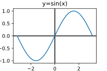
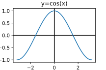
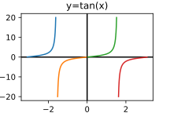
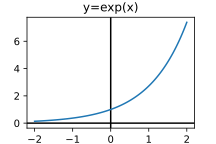
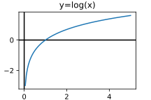
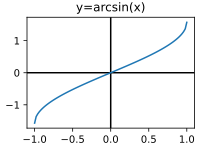
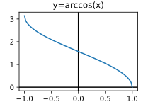
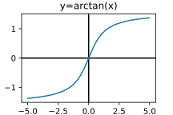
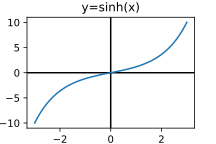
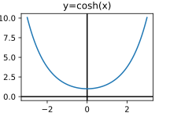

# 函数
::: warning
该笔记尚未完成
:::
## 函数性质速览
### 三角函数
#### 正弦函数
* 符号 $\sin$
* 定义域 $(-\infty,\infty)$
* 值域 $[-1,1]$
* 周期 $2\pi$
* 导数
$$\frac{\mathrm{d}}{\mathrm{d}x}\sin x=\cos x$$
* 图像  

#### 余弦函数
* 符号 $\cos$
* 定义域 $(-\infty,\infty)$
* 值域 $[-1,1]$
* 周期 $2\pi$
* 导数
$$\frac{\mathrm{d}}{\mathrm{d}x}\cos x=-\sin x$$
* 图像  

#### 正切函数
* 符号 $\tan$
* 定义域 $\{x\in\R|x\neq k\pi+\frac{\pi}{2},k\in Z\}$
* 值域 $(-\infty,\infty)$
* 周期 $\pi$
* 表达式
$$\tan x=\frac{\cos x}{\sin x}$$
* 导数
$$\frac{\mathrm{d}}{\mathrm{d}x}\tan x=\frac{1}{\cos^2 x} $$
* 图像  

### 对数与指数函数
#### 指数函数
* 符号 $\exp,e^x$
* 定义域 $(-\infty,\infty)$
* 值域 $[0,\infty)$
* 导数
$$\frac{\mathrm{d}}{\mathrm{d}x}e^x=e^x$$
* 图像  

#### 对数函数 
* 符号 $\ln$
* 定义域 $[0,\infty)$
* 值域 $(-\infty,\infty)$
* 导数
$$\frac{\mathrm{d}}{\mathrm{d}x}\ln x=\frac{1}{x}$$
* 图像  

### 反三角函数
#### 反正弦函数 
* 符号 $\arcsin$
* 定义域 $[-1,1]$
* 值域 $[-\frac{\pi}{2},\frac{\pi}{2}]$
* 导数
$$\frac{\mathrm{d}}{\mathrm{d}x}\arcsin x=\frac{1}{\sqrt{1-x^2}}$$
* 图像  

#### 反余弦函数 
* 符号 $\arccos$
* 定义域 $[-1,1]$
* 值域 $[0,\pi]$
* 导数
$$\frac{\mathrm{d}}{\mathrm{d}x}\arccos x=\frac{-1}{\sqrt{1-x^2}}$$
* 图像  

#### 反正切函数
* 符号 $\arctan$
* 定义域 $(-\infty,\infty)$
* 值域 $[-\frac{\pi}{2},\frac{\pi}{2}]$
* 导数
$$\frac{\mathrm{d}}{\mathrm{d}x}\arccos x=\frac{1}{1+x^2}$$
* 图像  

#### 四象限反正切函数
* 符号 $\operatorname{Arctan}(x,y)$ 通常用于获取向量 $(x,y)$ 与 $x$ 轴的夹角
* 定义域 $x,y\in\R$
* 值域 $(-\pi,\pi]$
* 表达式 
$$\operatorname{Arctan}(x,y)=\begin{cases}
\arctan\frac{y}{x}&,x>0\\
\arctan\frac{y}{x}+\pi&,x<0,y\ge 0\\
\arctan\frac{y}{x}-\pi&,x<0,y<0\\
\frac{\pi}{2}&,x=0,y>0\\
-\frac{\pi}{2}&,x=0,y<0\\
0&,x=0,y=0
\end{cases}$$

* 推导图像  

* 参考文献 <https://wuli.wiki/online/Arctan.html>

### 双曲函数
#### 双曲正弦函数 
* 符号 $\sinh,\sh$
* 表达式
$$\sinh x=\frac{e^x-e^{-x}}{2}$$
* 图像  

#### 双曲余弦函数 
* 符号 $\cosh,\ch$
* 表达式
$$\cosh x=\frac{e^x+e^{-x}}{2}$$
* 图像  

## 函数公式
### 三角函数公式
#### 诱导公式
$$\sin(\frac{\pi}{2}-\theta)=\cos\theta$$
$$\cos(\frac{\pi}{2}-\theta)=\sin\theta$$
$$\sin(\pi-\theta)=\sin\theta$$
$$\cos(\pi-\theta)=-\cos\theta$$
$$\sin(2\pi+\theta)=\sin\theta$$
$$\cos(2\pi+\theta)=\cos\theta$$

#### 两角和公式
两角和公式
$$\sin(A+B)=\sin A\cos B+\cos A\sin B$$
$$\cos(A+B)=\cos A\cos B-\sin A\sin B$$
$$\tan(A+B)=\frac{\tan A+\tan B}{1-\tan A\tan B}$$

辅助角公式 (求解方程 $a\sin\theta+b\cos\theta=C$ 中的 $\theta$)
$$a\sin\theta+b\cos\theta=\sqrt{a^2+b^2}\sin(\theta+\arctan\frac{b}{a})$$

#### 和差化积公式
$$\sin A+\sin B=2\sin[\frac{A+B}{2}]\cos[\frac{A-B}{2}]$$
$$\cos A+\cos B=2\cos[\frac{A+B}{2}]\cos[\frac{A-B}{2}]$$

#### 积化和差公式
$$\sin A\cos B=\frac{1}{2}[\sin(A+B)+\sin(A-B)]$$
$$\cos A\cos B=\frac{1}{2}[\cos(A+B)+\cos(A-B)]$$
$$\sin A\sin B=\frac{1}{2}[-\cos(A+B)+\cos(A-B)]$$

### 反三角函数公式
#### 反正切函数公式
$$\arctan (-x)=-\arctan x$$
$$\frac{\pi}{2}-\arctan \frac{x}{y}=\arctan\frac{y}{x}$$
$$\arctan A+\arctan B=\arctan(\frac{A+B}{1-AB})$$

### 指数对数函数公式
#### 指数性质
$$(e^{a})^{b}=e^{ab}$$
$$e^{a}e^{b}=e^{a+b}$$
$$e^{a\ln x}=x^a$$
$$e^{0}=1$$

#### 对数性质
$$a^{\log_a b}=b$$
$$\log_a (AB)=\log_a A+\log_a B$$
$$\log_a (A^k)=k\log_a A$$
$$\log 1=0$$

#### 换底公式
$$\log_a b=\frac{\log_c b}{\log_c a}$$

## 函数变换

