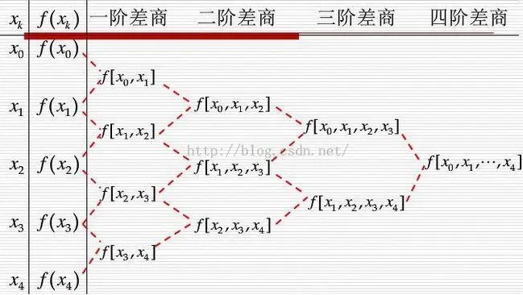
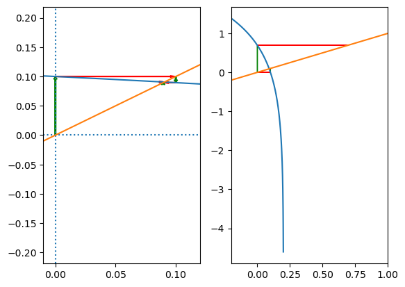
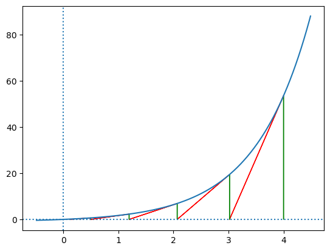

# 数值计算的误差
## 误差来源
### 截断误差
近似解与精确解之间的误差
eg. 泰勒展开仅取前几项
### 舍入误差
1. 计算机字长有限导致的误差
2. 原始数据由十进制转为二进制

## 误差定义
### 字母定义
1. $x$ 准确值
2. $x^*$ 近似值

### 绝对误差
$$e^*=x^*-x$$
称 $e^*$ 为绝对误差, 也简称误差

### 绝对误差限
$$|x^*-x|\le\varepsilon^*$$
通常误差难以计算, 采用误差限表示, 也表示为
$$x=x^*\pm\varepsilon^*$$

### 相对误差
$$e_r^*=\frac{e^*}{x}$$
由于 $x\approx x^*$, 因此也采用
$$e_r^*\approx\frac{e^*}{x^*}$$

### 相对误差限
$$\varepsilon_r^*=\frac{\varepsilon^*}{|x^*|}$$

### 有效数字
当近似值 $x^*$ 的==误差限==为某一位的半个单位, 该位到 $x^*$ 的第一位非零数字共 $n$ 位, 则称 $x^*$ 由 $n$ 位有效数字
eg.
1. 对于 $x=\pi,x^*=3.1415$ 认为有 $x=3.1415\pm 0.00009$, 误差限满足 $0.00005<0.00009<0.0005$, 因此误差限为 $0.001$ 的半单位, 到个位 (从误差限的第一个非零值到近似值的最后一个非零值) 共有四位, 因此具有四位有效数字
2. 对于 $x=\pi,x^*=3.1416$ 认为有 $x=3.1416\pm 0.00001$, 误差限满足 $0.000005<0.00001<0.00005$, 因此误差限为 $0.0001$ 的半单位, 到个位共有五位, 因此具有五位有效数字

## 误差计算
假设估计值 $x^*_i$ 的误差限为 $\varepsilon(x^*_i)$

### 一般情况
对于 $A=f(x_1, x_2, ..., x_n)$, $\varepsilon(A^*)$ 满足公式
$$\varepsilon(A^*)\approx\sum|(\frac{\partial f}{\partial x_i})^*|\varepsilon(x^*_i)$$

### 简单运算
1. 加减法
$$\varepsilon(x^*_1\pm x^*_2)\le\varepsilon(x^*_1)+\varepsilon(x^*_2)$$
2. 乘法
$$\varepsilon(x^*_1 x^*_2)\le|x^*_2|\varepsilon(x^*_1)+|x^*_1|\varepsilon(x^*_2)$$

## 误差分析
### 算法的稳定性
1. 计算过程中舍入误差不增长的算法称此算法是==数值稳定==的
2. 否则称算法为==不稳定==的
eg. 迭代中, 如果算法每次迭代乘以一个大于 1 的系数, 使误差扩大, 通常为不稳定的

### 病态问题
如果问题本身的输入数据有扰动, 引起问题的解相对误差很大, 称为病态问题

#### 条件数
可通过条件数判断函数 $f(x)$ 值计算问题是否病态
$$C_p=|\frac{xf'(x)}{f(x)}|$$
当 $C_p>10\%$ 认为问题病态

### 避免误差危害
1. 避免相近的两数相减
可转变为 分数与加法 的形式(平方和公式)
2. 避免使用绝对值小的数做除数
可转变为 对数相减 的形式
3. 减少运算次数与步骤(每次运算都会产生误差)
4. 避免大数与小数相加减

# 插值与逼近
## 多项式插值
对于给定的 ==$n+1$ 个点, 找到 $n$ 次多项式==满足
$$\begin{cases}a_0+a_1 x_0+\dots+a_n x_0^n=y_0\\a_0+a_1 x_1+\dots+a_n x_1^n=y_1\\\vdots\\a_0+a_1 x_n+\dots+a_n x_n^n=y_n\end{cases}$$
即找到线性方程组的解 $x$
$$Ax=y$$ $$A=\begin{bmatrix}1&x_0&x_0^2&\dots&x_0^n\\1&x_1&x_1^2&\dots&x_1^n\\\vdots\\1&x_n&x_n^2&\dots&x_n^n\end{bmatrix}$$ $$x=\begin{bmatrix}a_0\\a_1\\\vdots\\a_n\end{bmatrix}y=\begin{bmatrix}y_0\\y_1\\\vdots\\y_n\end{bmatrix}$$

### 拉格朗日插值
#### 线性函数
$$l_k(x)=\prod_{i\neq k}\frac{x-x_i}{x_k-x_i}$$
线性函数具有特点
1. $l_k(x_i)=0(i\neq k)$
2. $l_k(x_k)=1$

#### 插值公式
利用线性函数, 可得到插值多项式
$$L_n(x)=\sum y_k l_k(x)$$

### 牛顿插值
可根据节点的增加快速得到新的插值公式
$$P_n(x)=a_0+a_1(x-x_0)+\dots+a_n\sum_{i=0}^{n}(x-x_i)\\=P_{n-1}(x)+a_n\sum_{i=0}^{n}(x-x_i)$$

#### 均差计算
1. 一阶均差
$$f[x_a,x_b]=\frac{f(x_a)-f(x_b)}{x_a-x_b}$$
2. 高阶均差
$$f[x_0,x_1,\dots,x_n]=\frac{f[x_1,\dots,x_n]-f[x_0,x_1,\dots,x_{n-1}]}{x_n-x_0}$$
    * 分子为两个仅有一个点不同的均差
    * 分母为分子中不同的点之差
#### 均差性质
1. 均差与节点的排列顺序无关, 即 $$f[x_0,x_1,\dots,x_n]=f[x_1,x_0,\dots,x_n]=\dots$$ 
2. 均差与导数的关系 $$\exist\xi\in[a,b],f[x_0,x_1,\dots,x_n]=\frac{f^{(n)}(\xi)}{n!}$$
其中 $x_i\in[a,b]$

#### 均差递推

利用均差的性质可使用递推的方法得到高阶均差

#### 插值公式
$$P_n(x)=f(x_0)+f[x_0, x_1](x-x_0)+\dots+\\f[x_0,x_1,\dots,x_n]\prod_{i=0}^{n-1}{(x-x_i)}$$

### 差分形式的牛顿插值公式
当 $x_t$ 满足 $x_t=x_0+th$ 时, 可简化牛顿插值公式

#### 差分
定义差分
$$\Delta^nf(x_i)-\Delta^nf(x_{i+1})=\Delta^{n+1}f(x_i)$$

#### 差分表
利用差分的性质, 可得到递推关系


#### 差分性质
1. 与均差的关系
$$f[x_0,x_1,\dots,x_n]=\frac{1}{n!}\frac{1}{h^n}\Delta^nf(x_0)$$
2. 与导数的关系
$$\exist\xi\in[x_0,x_0+nh],\Delta^nf(x_i)=h^nf^{(n)}(\xi)$$

#### 插值公式
$$P_n(x_0+th)=f(x_0)+\Delta f(x_0)t+\dots+\\\frac{\Delta^{n} f(x_0)}{n!}\prod_{i=0}^{n-1}{(t-i)}$$
使用此形式避免求 $h^n$, $t$ 可取任意实数

### 埃尔米特插值
实际问题还要求节点的导数满足要求, 因此可用埃米尔特插值

#### 算术解法
类比多项式插值, 可得到其算术解法
* 多项式
$$M_0=\begin{bmatrix}1&x_0&x_0^2&\dots&x_0^n\\1&x_1&x_1^2&\dots&x_1^n\\\vdots\\1&x_k&x_k^2&\dots&x_k^n\end{bmatrix}$$
* 一阶导数
$$M_1=\begin{bmatrix}0&1&2x_0&\dots&nx_0^{n-1}\\0&1&2x_1&\dots&nx_1^{n-1}\\\vdots\\0&1&2x_{n-k}&\dots&nx_{n-k}^{n-1}\end{bmatrix}$$
* 多项式条件与导数条件
$$y'=\begin{bmatrix}y'_0\\y'_1\\\vdots\\y'_{n-k}\end{bmatrix}y=\begin{bmatrix}y_0\\y_1\\\vdots\\y_k\end{bmatrix}$$
* 系数向量
$$x=\begin{bmatrix}a_0\\a_1\\\vdots\\a_n\end{bmatrix}$$
* 算术解矩阵
$$\begin{bmatrix}M_0\\M_1\end{bmatrix}x=\begin{bmatrix}y\\y'\end{bmatrix}$$

### 余项表达式
* 如果给出高阶导数条件等多个关于同一点的条件 $c_i$ 次, 则变为相应次数 (默认给出点条件, 因此一般情况下 $c_i=1$)
* $m$ 为总共给出的条件数, $m=\sum c_i$
* $n$ 为总共的点数
* 对于多项式表达式, 其余项表达式为
$$R(x)=f(x)-P(x)=\frac{1}{m!}f^{(m)}(\xi)\prod_{i=0}^n(x-x_i)^{c_i},\xi\in(x_0,x_n)$$

### 分段插值
#### 龙格现象
插值多项式的次数越高, 精度不一定高
因此对于多个点, 一般不采用高次插值多项式, 而是分段第次插值

### 三次样条插值
使用三次多项式 $S_i(x)$ 对于各个点的最小区间分段插值函数 $S(x)$
总共需要 $4n$ 个条件, 根据已知点, 可提供 $n+1$ 个条件($i=0,1,\dots,n$)

#### 连续性条件
$$S(x_i^+)=S(x_i^-)$$ $$S'(x_i^+)=S'(x_i^-)$$ $$S''(x_i^+)=S''(x_i^-)$$
共能提供 $3n-3$ 个条件(减去边界点)

#### 边界条件
以上只能提供 $4n-2$ 个条件, 还差 2 个边界条件, 如果没有给出则使用自然边界条件
$$S''(x_0)=S''(x_n)=0$$

## 曲线拟合

### 最小二乘法概念
对于线性无关的函数族 $\varphi_0(x),\varphi_1(x),\dots,\varphi_m(x)$, 对于函数族任意线性组合 $S(x)$, 存在函数 $S^*(x)=\sum_{i=0}^m a_i\varphi_i(x)$ 使误差平方和最小, 即满足 $$|\delta|^2=\sum_{i=0}^n\omega_i[S^*(x_i)-y_i]^2=\min\sum_{i=0}^n\omega_i[S(x_i)-y_i]^2$$
其中函数族内函数个数 $m\le n$, $n$ 为拟合点个数

* 通常取 $\varphi_i(x)=x^i$
* $\omega_i$ 表示点 $i$ 的权重, 通常取 $1$

### 最小二乘法计算
令 ==$|\delta|^2=I(a_0,a_1,\dots,a_m)$== (不是 $S^*$), 问题变为找到使 $I$ 最小的点, 可得到 $I$ 满足 $m$ 个条件
$$\frac{\partial I}{\partial a_j}=2\sum_{i=0}^n\omega_i[S^*(x_i)-y_i]\varphi_j(x_i)=0$$

### 法方程
规定记号
1. $$(\varphi_j,\varphi_k)=\sum_{i=0}^n\omega_i\varphi_j(x_i)\varphi_k(x_i)$$
2. $$(f,\varphi_k)=\sum_{i=0}^n\omega_iy_i\varphi_k(x_i)=d_k$$


规定符号
$$x=\begin{bmatrix}a_0\\a_1\\\vdots\\a_m\end{bmatrix}d=\begin{bmatrix}d_0\\d_1\\\vdots\\d_m\end{bmatrix}$$ $$G=\begin{bmatrix}(\varphi_0,\varphi_0)&(\varphi_0,\varphi_1)&(\varphi_0,\varphi_2)&\dots&(\varphi_0,\varphi_m)\\(\varphi_1,\varphi_0)&(\varphi_1,\varphi_1)&(\varphi_1,\varphi_2)&\dots&(\varphi_1,\varphi_m)\\\vdots\\(\varphi_m,\varphi_0)&(\varphi_m,\varphi_1)&(\varphi_m,\varphi_2)&\dots&(\varphi_m,\varphi_m)\end{bmatrix}$$


可将最 $S^*(x)$ 的条件表示为方程 $$Gx=d$$ 
解出 $x$ 即可得到 $S^*(x)$ 
其中函数族内函数个数 $m\le n$, $n$ 为拟合点个数

### 哈尔条件
函数族 $\varphi_0(x),\varphi_1(x),\dots,\varphi_m(x)$ 的任意线性组合 $S(x)$ 在定义域内, 最多只能有 $n$ 个零点, 才可保证矩阵 $G$ 可得到唯一解(非奇异)

### 多项式的次数
多项式的次数取决于系数不为 $0$ 的项中的最高次数 
eg. $1+x^2=0$ 为二次多项式, 包含的函数族为 $1,x,x^2$

### 转化为多项式
通常采用多项式作为拟合函数, 拟合超越函数时, 可使用多项式变形
$$U(x)=f[S(x)]=a'g(x)+b'\\y'=f(y)$$
求出 $y'$ 与 $g(x)$ 的关系, 得到 $S(x)$

#### 指数拟合
$$S(x)=ae^{bx}$$
令
$$U(x)=lnS(x)=lna+bx$$

#### 幂函数拟合
$$S(x)=ax^b$$
令
$$U(x)=lnS(x)=lna+blnx$$

#### 分式拟合
$$S(x)=\frac{x}{ax+b}$$
令
$$U(x)=\frac{1}{S(x)}=a+\frac{b}{x}$$

# 数值积分
## 代数精度
当求积公式对次数不超过 $m$ 的多项式能够准确成立, 但对 $m+1$ 次多项式不成立, 则称求积公式具有 $m$ 次代数精度

### 确定代数精度/积分公式的系数
对于 $$I=\int_a^bf(x)dx$$
可以令 $f(x)=x^i$, 从 $0$ 开始不断提高 $i$, 直到公式不成立, 注意积分上下限 $a,b$
 
## 牛顿-柯斯特公式
即等距插值公式的积分形式, $n$ 阶公式至少具有 $n$ 次代数精度, 其中偶数阶的公式具有 $n+1$ 次代数精度
($n$ 阶对应 $n$ 次插值, 等距离的取区间内的 $n+1$ 个点)

### 梯形公式
取 $n=1$, 具有 $n=1$ 次代数精度
将积分区间的两个端点相连, 计算围成的梯形的面积, 近似为积分结果 (积分属于计算面积, 因此 $b-a$ 项不能忘)
$$\int_a^bf(x)dx\approx\frac{b-a}{2}[f(a)+f(b)]$$

### 辛普森公式
取 $n=2$, 具有 $n+1=3$ 次代数精度
$$\int_a^bf(x)dx\approx\frac{b-a}{6}[f(a)+4f(\frac{a+b}{2})+f(b)]$$

## 复合求积公式
当 $n\ge8$ 时, 公式出现负数系数, 不具有稳定性, 可分段使用低阶公式
### 复合梯形公式
将积分区间 $[a,b]$ $n$ 等分, 得到 $x_i=a+ih,h=\frac{b-a}{n}$, 对每一个分段采用梯形公式有 (需要乘上每一段的步长 $h$, 并在累加中提出)
$$I=\int_a^bf(x)dx\approx\sum_{i=0}^{n-1}\frac{h}{2}[f(x_i)+f(x_{i+1})]\\=\frac{h}{2}[f(a)+2\sum^{n-1}_{i=1} f(x_i)+f(b)]$$
公式误差阶数为 $h^2$

### 复合辛普森公式
对每一个分段采用辛普森公式有(辛普森公式还需要子区间内的中点)
$$I=\int_a^bf(x)dx\approx\sum_{i=0}^{n-1}\frac{h}{6}[f(x_i)+4f(x_{i+\frac{1}{2}})+f(x_{i+1})]\\=\frac{h}{6}[f(a)+2\sum^{n-1}_{i=1}f(x_i)+4\sum^{n-1}_{i=0}f(x_{i+\frac{1}{2}})+f(b)]$$
公式误差阶数为 $h^4$

## 递推化复合求积
### 符号
1. 规定 $T_m(h)$ 表示采用 $m+1$ 阶公式, 子区间长度为 $h$ 的复合求积值, 其中 $T_0(h)$ 即梯形公式
2. 规定 $T_m^{(k)}$ 表示长度 $k$ 次二分后的复合求积值, 即 $T_m^{(k)}(h)=T_m(\frac{h}{2^{k}})$, 其中 $(h)$ 可省略

### 递推公式
梯形公式中, 如果二分区间, 可得到二分子区间的梯形公式 $$\int_a^bf(x)dx\approx\frac{b-a}{4}[f(a)+f(b)+2f(\frac{a+b}{2})]$$
对每一个子区间使用可得 $$T_0^{(1)}=\frac{h}{4}[f(a)+2\sum^{n-1}_{i=1}f(x_i)+2\sum^{n-1}_{i=0}f(x_{i+\frac{1}{2}})+f(b)]\\=\frac{1}{2}T_0^{(0)}+\frac{h}{2}\sum^{n-1}_{i=0}f(x_{i+\frac{1}{2}})$$

* 递推公式中, 每次二分都从上一个积分值得到, 避免重复计算
* 带入 $n'=2n,h'=\frac{h}{2}$ 推广可得到任意次二分公式
### 龙贝格算法
可通过低阶的复化求积公式递推到高阶的复化求积公式
$$T_{m}^{(k)}=\frac{4^m}{4^m-1}T^{(k+1)}_{m-1}-\frac{1}{4^m-1}T^{(k)}_{m-1}$$

# 线性方程组直接解法
## 矩阵乘法
矩阵乘法不满足交换率
### 以列向量理解
对于矩阵乘法 $$AB=C$$

将矩阵的每一列理解为一个列向量, 矩阵与向量之积 $Av=b$ 即表明了将 $A$ 的每一列为新的基底, 以最左侧为第一个轴, 经过变换后得到新的向量 $b$, ==此时基底矩阵位于左侧==

当右侧为另一个矩阵时, 理解为一个行向量数组, 因此 $AB$ 为对 $B$ 中每一列向量分别以 $A$ 为基底进行变换, 从而得到一个新的向量数组 $C$

### 以行向量理解
将矩阵的每一行理解为一个行向量, 矩阵与向量之积 $hA=c$ 即表明了将 $A$ 的每一行为新的基底, 以最上方为第一个轴, 经过变换后得到新的行向量 $c$, ==此时基底矩阵位于右侧==

当左侧为另一个矩阵时, 理解为一个行向量数组, 因此 $AB$ 为对 $A$ 中每一行向量分别以 $B$ 为基底进行变换, 从而得到一个新的向量数组 $C$

## 高斯消元法
直接高斯消元法中, 如果除数接近 0, 将导致结果不稳定

### 列主消元法
1. 高斯消元中, 交换行顺序仅改变了方程的次序, 因此对结果无影响
2. 在每次消元中, 找出消元列中绝对值最大的元素, 将其与列主交换消元

### 列主三角分解
列主消元法中由于交换了行, 无法完全三角分解, 还需要一个排序矩阵
$$PA=LU$$

## 三角分解
当 $A$ 为非奇异矩阵, 则可以将 $A$ 分解为一个上三角矩阵 $L$ 与下三角矩阵 $U$ 之积
$$A=LU$$
并且通常规定 $L$ 的主对角线上为 $1$

### 三角分解的使用
确定 $A=LU$ 后, $Ax=b$ 等价于求解 $L(Ux)=b$
1. $Ly=b$ 先求出 $y$
2. $Ux=y$ 在求出 $x$

### 高斯消元法的三角分解
1. 高斯消元法中, 每次消去第 $k$ 列, 相当于 (注意, 此时是对方程系数操作, 需要从行角度理解, 因此 $A$ 在右侧) $$A_{k+1}=L_kA_k$$ 其中 $$L_k=\begin{bmatrix}
1&0&\dots&0&\dots&0\\
0&1&\dots&0&\dots&0\\
\vdots\\
0&0&\dots&1&\dots&0\\
0&0&\dots&-m_{k+1,k}&\dots&0\\
\vdots\\
0&0&\dots&-m_{n,k}&\dots&1\\
\end{bmatrix}$$

2. 最终得到的 $A_n=U$ 为一个上三角矩阵
3. ==将消去矩阵 $L_i$ 相乘取逆有== (等价于组合消元矩阵的非对角线区域, 再取负, 不能直接使用) $$L=(\prod L_i)^{-1}\\=\begin{bmatrix}
1&0&\dots&0&\dots&0\\
m_{2,1}&1&\dots&0&\dots&0\\
\vdots\\
m_{k,1}&m_{k,2}&\dots&1&\dots&0\\
m_{k+1,1}&m_{k+1,2}&\dots&m_{k+1,k}&\dots&0\\
\vdots\\
m_{n,1}&m_{n,2}&\dots&m_{n,k}&\dots&1\\
\end{bmatrix}$$
4. 得到矩阵 $A$ 的三角分解

### 直接三角分解
即直接求解方程 $A=LU$
1. 使用未知数表示 $L$ 与 $U$, 其中 $L$ 的主对角线上为 $1$
2. 以未知数表示 $LU$ 的结果
3. 将 $A$ 与 $LU$ 对照, 解出未知数, 得到三角分解
4. 计算复杂度与高斯消元类似 

### 对称矩阵的三角分解
对称矩阵可分解为 $$A=LDL^T=(LD^{1/2})(D^{1/2}L)^T=L_1L_1^T$$
其中 $L$ 为主对角线上为 $1$ 的下三角矩阵, $D$ 为对角线矩阵, ==$L_1$ 主对角线上不为 $1$==

### 追赶法
对于对角占优矩阵问题
$$A=\begin{bmatrix}b_1&c_1\\
a_1&b_2&c_2\\
&\ddots&\ddots&\ddots\\
&&a_{n-1}&b_{n-1}&c_{n-1}\\
&&&a_n&b_n\end{bmatrix}$$
其中 $|b_n|\ge|a_n|+|c_n|$
可将其分解为矩阵 (注意此时上三角矩阵 $U$ 的主对角线为 $1$) $$U=\begin{bmatrix}1&\beta_1\\
&1&\beta_2\\
&&\ddots&\ddots\\
&&&1&\beta_{n-1}\\
&&&&1\end{bmatrix}L=\begin{bmatrix}\alpha_1\\
r_2&\alpha_2\\
&\ddots&\ddots\\
&&r_{n-1}&\alpha_{n-1}\\
&&&r_n&\alpha_n\end{bmatrix}$$
带入 $A=LU$ 可得到递推公式
$$\\\alpha_i=b_i-a_i\beta_{i-1}\\\beta_i=c_i/\alpha_i\\r_i=a_i$$
并在 $Ly=b\;Ux=y$ 中递推解出结果

## 矩阵问题的病态性

<div id="tzz"></div>

### 特征值
* 对于任意矩阵 $A$ 有方程
$$Ax=\lambda x\\(A-\lambda I)x=0$$
* 称 $\lambda$ 为矩阵的特征值, $x$ 为特征值对应的特征向量
* 对于 $A\in R^{n\times n}$, 在复数域有 $n$ 个根
* 称最大的特征值为矩阵的谱半径, 记为 $\rho(A)$

当 $A$ 的==特征值为实数==时, 具有以下特性

* 设 $A$ 具有特征值 $\rho(A)=\lambda_1\gg1\gt\lambda_2$, 对于任意向量 $v$, 谱半径具有特性 $$Av=A(ax_1+bx_2)=a\lambda_1x_1+b\lambda_2x_2$$
因此当 $n$ 足够大 $$A^nv=a\lambda_1^nx_1+b\lambda_2^nx_2\approx \rho(A)^nx_{\rho}$$
如果 $\rho(A)<1$, 则有 $$A^nv\approx 0$$

* 推论可得, 矩阵变换中
    * 特征向量代表变化的方向
    * 特征值代表变化的程度
    * 谱半径为变化最剧烈的程度, 当 $\rho(A)>1$ 系统将不稳定
* 设 $\Lambda$ 为以特征值为对角的矩阵, $P$ 为对应==单位化==特征向量组成的实矩阵, 则可分解 $$A=P\Lambda P^{-1}$$

当 $A$ 为==实对称矩阵==时, 具有以下特性

* 其特征值一定是实数
* 其单位化特征向量组成的矩阵 $P$ 一定正定, 即 $P^{-1}=P^T$
* 对于矩阵变换 $y=Ax=P\Lambda P^{T}$, 可用几何解释
    1. ==将 $P$ 作为基底==(将向量分解到 $P$ 上)
    1. $y_1=P^Tx$ 旋转向量 $x$ 到标准基底上(原始坐标轴)
    注意由于 $P$ 正交, 因此特征向量垂直, 能实现此效果, 一般的特征向量不垂直, 不会旋转到原始坐标轴上
    1. $y_2=\Lambda y_1$ 从==原始坐标轴方向缩放==旋转后的向量 $y_1$
    1. $y=Px$ 反向旋转向量 $y_2$ 到原始方向
    * 因此矩阵变换可视为将向量在特征向量方向拉伸
    * 特征值为拉伸的倍数

#### 特征值求解
根据 $$Ax=\lambda x\\(A-\lambda I)x=0$$ 由于 $x\neq 0$, 要使此齐次方程有非零解, 要求 $$det(A-\lambda I)=0$$ 解出的 $\lambda$ 即为特征值
由于 $(A-\lambda I)$ 为奇异矩阵, 因此方程有无数解, 同常取 $|x|=1$

### 范数运算
将满足以下不等式的运算称为范数
1. 系数条件
$$\begin{Vmatrix}cx\end{Vmatrix}=c\begin{Vmatrix}x\end{Vmatrix}$$
1. 正定条件
$$\begin{Vmatrix}x\end{Vmatrix}\ge 0$$
1. 三角不等式
$$\begin{Vmatrix}x\end{Vmatrix}+\begin{Vmatrix}y\end{Vmatrix}\ge \begin{Vmatrix}x+y\end{Vmatrix}$$
1. 柯西不等式
$$\begin{Vmatrix}x\end{Vmatrix}\begin{Vmatrix}y\end{Vmatrix}\ge \begin{Vmatrix}xy\end{Vmatrix}$$

* 当满足以上条件后, 即可使用范数函数来估计向量的大小, 例如使用 $1$ 范数估计误差, 相比 $2$ 向量可减小计算量

### 向量范数
对于向量 $x$, 与向量内的元素 $x_i$, 规定运算
1. $\infty$ 范数
$$\begin{Vmatrix}x\end{Vmatrix}_{\infty}=max|x_i|$$
1. $1$ 范数
$$\begin{Vmatrix}x\end{Vmatrix}_1=\sum|x_i|$$
1. $2$ 范数
$$\begin{Vmatrix}x\end{Vmatrix}_{2}=(\sum x_i^2)^{1/2}$$
1. $p$ 范数
$$\begin{Vmatrix}x\end{Vmatrix}_{p}=(\sum |x_i|^p)^{1/p}$$

### 矩阵范数
对于矩阵 $A$, 与矩阵内的元素 $a_{ij}$, 规定运算
1. $F$ 范数
$$\begin{Vmatrix}A\end{Vmatrix}_{F}=(\sum a_{ij}^2)^{1/2}$$
1. 算子范数 (利用柯西不等式条件推广 $p$ 范数)
$$\begin{Vmatrix}A\end{Vmatrix}_v=\max_{x\neq \vec{0}}\frac{\begin{Vmatrix}Ax\end{Vmatrix}_v}{\begin{Vmatrix}x\end{Vmatrix}_v}$$
1. 行范数 ($v=\infty$, 取每行向量之和的最大值)
1. 列范数 ($v=1$, 取每列向量之和的最大值)
1. $2$ 范数 ($v=2$)
$$\begin{Vmatrix}A\end{Vmatrix}_2=\sqrt{\lambda_{max}(AA^T)}$$

### 矩阵条件数
假设线性方程组有误差 $\delta b$, 则方程变为 $$A(x+\delta x)=b+\delta b$$ 即 $$Ax=b\\ A\delta x=\delta b$$ 利用柯西不等式, 可得到不等式 $$\frac{\begin{Vmatrix}\delta x\end{Vmatrix}}{\begin{Vmatrix}x\end{Vmatrix}}\le \begin{Vmatrix}A\end{Vmatrix}\begin{Vmatrix}A^{-1}\end{Vmatrix}\frac{\begin{Vmatrix}\delta b\end{Vmatrix}}{\begin{Vmatrix}b\end{Vmatrix}}$$
因此可以定义条件数, 来刻画矩阵对相对误差的放大效果 $$cond(A)_{v}=\begin{Vmatrix}A\end{Vmatrix}_v\begin{Vmatrix}A^{-1}\end{Vmatrix}_v$$
当 $cond(A)_{v}\gg 1$, 称线性方程组为病态的

# 线性方程组迭代解法
## 迭代法概念
对于线性方程组 $$Ax=b$$ 将其转化为等式 $$x=Bx+f$$ 得到向量序列 $$x^{(n)}=Bx^{(n-1)}+b$$ 如果迭代收敛, 则存在极限 $$\lim_{i\to\infty}x^{(i)}=x$$ 其中 $B,f$ 可在满足原式的条件下任取, $x_0$ 通常取 $0$

### 迭代构建
1. 构建 $$A=M-N$$ 得到分裂矩阵 $M$, 通常 $M$ 为非奇异矩阵, 并且易于求逆, 如对角矩阵
2. 方程转化为 $$\begin{split}Mx&=Nx+b\\x&=M^{-1}Nx+M^{-1}b\end{split}$$
3. 得到迭代矩阵 $$B=I-M^{-1}A$$
4. 得到 $$f=M^{-1}b$$

### 迭代法编程
```python
def iter_meth(xk, eps, fun, test):
    while True:
        xk1 = fun(xk)
        if test(xk1, xk) < eps:
            break
        xk = xk1
    
    return xk1
```

对于向量序列, 取误差测试函数为范数运算 $$test(x^{(k+1)},x^{(k)})=\begin{Vmatrix}x^{(k+1)}-x^{(k)}\end{Vmatrix}_{v=1,\infty}$$

## 雅可比迭代法
将 $A$ 的对角取出作为分裂矩阵 $M$
对于矩阵 $A$ 与元素 $a_{ij}$, 定义
1. $$M=D=\begin{bmatrix}a_{11}\\
&a_{22}\\
&&\ddots\\
&&&a_{nn}\end{bmatrix}$$
2. $$L=\begin{bmatrix}0\\
-a_{21}&0\\
\vdots&\vdots&\ddots\\
-a_{n1}&-a_{n2}&\dots&0\end{bmatrix}$$
3. $$U=\begin{bmatrix}0&-a_{12}&\dots&-a_{1n}\\
&0&\dots&-a_{2n}\\
&&\ddots&\vdots\\
&&&0\end{bmatrix}$$
4. $$A=D-L-U$$

得到向量序列 
$$\begin{split}Ax&=b\\
Dx&=(L+U)x+b\\
x&=D^{-1}(L+U)x+D^{-1}b\end{split}$$

因此
1. $$B=D^{-1}(L+U)$$
2. $$f=D^{-1}b$$

## 高斯-赛德尔迭代法
将 $A$ 的下半部分取出作为分裂矩阵 $M$
对于矩阵 $A$ 与元素 $a_{ij}$, 定义
1. $$M=D-L$$
2. $$B=G=I-(D-L)^{-1}A=(D-L)^{-1}U$$
3. 得到向量序列 $$Dx^{(k+1)}=Lx^{(k+1)}+Ux^{(k)}+b$$
4. 对于向量序列中的向量 $x^{(k+1)}$ 中的元素 $x^{(k+1)}_{i}$ $$a_{ii}x^{(k+1)}_{i}=b_i-\sum_{j=1}^{i-1}a_{ij}x^{(k+1)}_j-\sum_{j=i+1}^{n}a_{ij}x^{(k)}_j$$ 可以发现迭代式具有以下特点:
    1. 由于 $L,U$ 是 $A$ 三角部分元素取负, 因此具体公式中要取负号
    2. $x^{(k+1)}_{i}$ 的值与 $x^{(k+1)}_{j}(j\le i-1)$ 和 $x^{(k)}_{j}(j\ge i+1)$ 有关, 因此仅需要一个数组保存 $x^{(k+1)}$ 的 $j\le i-1$ 部分与 $x^{(k)}$ 的 $j\ge i+1$ 部分
    3. 不需要具体计算矩阵 $B$

## 迭代法的收敛性
### 向量序列的收敛性
对于向量数列的极限 $x^*$, 定义序列误差 $\varepsilon^{(k+1)}=x^{(k+1)}-x^{*}$ 因此 $$\varepsilon^{(k+1)}+x^*=B(\varepsilon^{(k)}+x^*)+f\\\varepsilon^{(k+1)}=B\varepsilon^{(k)}=B^{k+1}\varepsilon^{(0)}$$ 可得向量序列收敛的条件为 $$\lim_{k\to\infty}\varepsilon^{(k)}=0\to\lim_{k\to\infty}B^kx=0$$

#### 范数与特征值
由特征值定理可得 $$\lambda x=Ax$$
取范数运算后, 根据柯西不等式有 $$|\lambda|\begin{Vmatrix}x\end{Vmatrix}=\begin{Vmatrix}\lambda x\end{Vmatrix}=\begin{Vmatrix}Ax\end{Vmatrix}\le\begin{Vmatrix}A\end{Vmatrix}\begin{Vmatrix}x\end{Vmatrix}$$
因此 $$\lambda\le\rho(A)\le\begin{Vmatrix}A\end{Vmatrix}$$

#### 向量序列收敛的条件
根据向量序列收敛的基本条件与[特征值的性质](#tzz)可以推导出 $$\lim_{k\to\infty}B^kx=0\to\rho(A)\le 1\to\exist v,\begin{Vmatrix}B\end{Vmatrix}_v\le 1$$ 为了便于计算, 通常采用 $v=1,\infty$

### 向量序列的迭代速度


### 雅可比迭代法与高斯-赛德尔迭代法的收敛性
除了判断 $\begin{Vmatrix}B\end{Vmatrix}$, 对于特定的迭代法, 还可以==从 $A$ 直接判断收敛性==

#### 对角占优矩阵
对于矩阵 $A$ 与元素 $a_{ij}$, 定义
1. 严格对角占优矩阵
$$|a_{ii}|>\sum_{j\neq i,j=1}^{n}|a_{ij}|$$
2. 弱对角占优矩阵
$$|a_{ii}|\ge\sum_{j\neq i,j=1}^{n}|a_{ij}|$$
==要求不等式至少严格成立一次==

当 $A$ 满足以下条件时, 雅可比迭代法与高斯-赛德尔迭代法均收敛
1. $A$ 为严格对角占优矩阵
2. $A$ 为弱对角占优矩阵, 且非奇异
3. $A$ 为对称正定矩阵
4. 对于不满足条件的线性方程组可通过变形 (交换, 加减) 得到符合条件的矩阵

## 超松弛迭代法
选取分裂矩阵为 $$M=\frac{1}{\omega}(D-\omega L)$$ 
类似高斯-赛德尔迭代法, 可得到向量序列 $$Dx^{(k+1)}=\omega(Lx^{(k+1)}+Ux^{(k)}+b)+(1-\omega)Dx^{(k)}$$
类似的有 $$a_{ii}x^{(k+1)}_{i}=\omega(b_i-\sum_{j=1}^{i-1}a_{ij}x^{(k+1)}_j-\sum_{j=i+1}^{n}a_{ij}x^{(k)}_j)+(1-\omega)a_{ii}x^{(k)}_{i}$$
当 $\omega=1$ 即高斯-赛德尔迭代法, 一般取 $\omega\in(1,1.6)$, 合适的 $\omega$ 可以加快收敛速度

### 超松弛迭代法的收敛条件
收敛条件与高斯-赛德尔迭代法相同, 此外还要求 $$\omega\in(0,2)$$

# 非线性方程的数值解

## 二分法
根据 $f(a)f(b)<0$ 时, 方程的根 $f(x)=0$ 在区间 $(a,b)$ 内 
每次迭代, 二分区间 $(a,b)$, 保证根在区间内, 直到达到指定精度 
缺陷: 无法计算如 $x^2=0$ 的根

## 不动点迭代法

与线性方程组的向量序列类似, 对于方程 $$f(x)=0$$
构建 $$x=\varphi(x)$$
得到数列 $$x_{k+1}=\varphi(x_k)$$
当 $k$ 足够大时, 且数列不发散, 数列收敛于方程解 $x^*$ $$\lim_{k\to\infty}x_{k}=x^*$$

### 构建不动点迭代法
对于方程 $f(x)=0$
1. $$\varphi(x)=f(x)+x$$
2. $$\varphi(x)=x(f(x)+1)$$
3. 根据 $f(x)$ 具体构建

### 不动点迭代法的收敛性

> 橙色直线 $x=y$ 蓝色曲线 $y=\varphi(x)$
> 交点处即 $x=\varphi(x)$ 的解
> 对于同一个方程, 左图从 $x=0$ 处开始迭代, 向方程解收敛
> 右图从 $x=0.1\approx x^*$ 处开始迭代, 向发散方向移动

由于 $\varphi(x)$ 可任意构造, 对于同一个方程, 不同的 $\varphi(x)$ 可能收敛也可能发散, 当 $\varphi(x)$ 满足以下条件时数列收敛

1. 对于任意 $x\in [a,b]$, 有 $a\le\varphi(x)\le b$
2. 对于任意 $x\in [a,b]$, 有 $$|\frac{\varphi(x)-\varphi(y)}{x-y}|\le L< 1$$ 一般带入 $a,b$ 与求导试探

### 不动点迭代法的误差
$$|x_{k}-x^*|\le\frac{L^k}{1-L}|x_1-x_0|\approx\frac{L}{1-L}|x_{k}-x_{k-1}|$$
由于 $$\frac{L}{1-L}\approx 1$$
因此当要求误差 $$|x_{k}-x^*|\le\varepsilon$$ 仅需要求 $$|x_{k}-x_{k-1}|\le\varepsilon$$

## 迭代法的收敛性
### 收敛性定义
1. 当迭代数列对于任意 $x_0\in \R$ 收敛, 则称迭代数列全局收敛
2. 当迭代数列对于任意 $x_0\in N(x^*,\delta)$ 收敛, 则称迭代数列局部收敛
3. 当 $|\varphi'(x^*)|<1$ 认为数列局部收敛

### 收敛速度
定义迭代误差 $e_k=|x_{k}-x^*|$ 如果存在极限 $$\lim_{k\to\infty}\frac{e_{k+1}}{e_{k}^p}=C$$
则称迭代过程 $x=\varphi(x)$ 为 $p$ 阶收敛

根据原始定义与泰勒展开可得 $$e_{k+1}=|x_{k+1}-x^*|=\frac{\varphi^{(p)}(\xi)}{p!}(x_k-x^*)^p=\frac{\varphi^{(p)}(\xi)}{p!}e_{k}^p$$
因此当 $\varphi(x)$ 满足 $$\varphi'(x)=\dots=\varphi^{(p-1)}(x)=0\\\varphi^{(p)}(x)\neq 0$$
则称迭代过程 $x=\varphi(x)$ 为 $p$ 阶收敛

## 牛顿法
### 牛顿法

使用函数在 $x_k$ 点处的切线模拟函数的值用于求解方程 $$f(x)\approx f(x_k)+f'(x_k)(x-x_k)=0$$ 
可得到依次法构造的迭代数列为 $$\varphi(x)=x-\frac{f(x)}{f'(x)}$$
由于 $\varphi'(x)=0$, $\varphi''(x)\neq 0$, 因此牛顿法为二次收敛

### 牛顿下山法
牛顿法中, 无法保误差稳定下降, 可能在收敛的过程中震荡, 为了保证收敛, 可引入参数与试算

#### 试算
为了保证误差稳定下降, 在每次迭代后进行试算, 保证 (迭代越来越接近解 $f(x)=0$) $$|f(x_{k+1})|<|f(x_{k})|$$

#### 参数
引入参数 $\lambda$, 构造 $$\varphi(x)=x-\lambda\frac{f(x)}{f'(x)}$$
取 $\lambda_{0}=1$, 每次试算不满足条件, 则取 $\lambda_{n+1}=\frac{1}{2}\lambda_{n}$

### 重根情形
当 $x=x^*$ 为方程的多重根, 牛顿法的收敛速度变为线性收敛

## 牛顿法变形
牛顿法中需要计算导数 $f'(x)$ 较为复杂, 可通过其他方法, 避开导数计算

### 简化牛顿法
取近似 $f'(x)\approx f'(x_0)=1/C$ 从而有 $$\varphi(x)=x-Cf(x)$$
==此时无法保证一定收敛==, 还需要满足条件 $|\varphi'(x^*)|<1$, 并且仅能线性收敛($p=1$), 但极大的简化了计算量

### 弦截牛顿法
使用迭代过程中计算的函数点的连线斜率近似为导数计算 $$f'(x_{k})\approx \frac{f(x_k)-f(x_{k-1})}{x_k-x_{k-1}}$$
此方法需要给出两个初始值
此方法具有 $p\approx 1.618$ 的收敛阶数, 为超线性收敛

### 抛物线法
类似弦截法, 但是使用二次函数近似 $f(x)$, 而非牛顿法的一次函数
每次迭代, 使用上 $3$ 此迭代值插值出二次多项式, 求出二次函数与坐标轴的交点, 得到下一次迭代值

## 应用
构造开方公式
根据开方运算, 可将其等价为方程 $x^2-C=0$ 的根
使用牛顿法可得到迭代公式 $$x_{k+1}=x_k-\frac{x_k^2-C}{2x_k}=\frac{1}{2}(x_k+\frac{C}{x_k})$$

# 常微分方程的数值解法
主要研究以下常微分方程的数值解法
$$\begin{cases}\frac{dy}{dx}=f(x,y),&微分方程\\y(x_0)=y_0,&初值条件\end{cases}$$

## 欧拉法
### 欧拉法
微分方程中 $f(x,y)$ 表征了对于微分方程的解 $y=y(x)$ 于点 $P(x,y)$ 上的导数

因此当步长足够小时, 利用导数的性质可以得到 $$\frac{y_{n+1}-y_{n}}{x_{n+1}-x_{n}}\approx f(x_n,y_n)$$

因此可以设定固定的步长 $h$ 从初值点 $P_0(x_0,y_0)$ 递推到目标点 $P_n(x_n,y_n)$, 有 $$y_{t}=y_{t-1}+h\cdot f(x_0+th,y_{t-1})$$

### 后退欧拉法
于欧拉法类似, 但采用后推型的近似式以实现迭代 (注意右侧系数的区别) $$\frac{y_{n+1}-y_{n}}{x_{n+1}-x_{n}}\approx f(x_{n+1},y_{n+1})$$

其中 $y_{n+1}$ 无法直接得到, 可先使用 $y_{n}$ 近似 $$y_{t}^{(0)}=y_{t-1}+h\cdot f(x_{t-1},y_{t-1})$$

再迭代得到更精确的值 (注意下标) $$y_{t}^{(k)}=y_{t-1}+h\cdot f(x_t,y_{t}^{(k-1)})$$

### 梯形欧拉法
根据数值积分的梯形公式, 结合欧拉法与后退欧拉法, 可以得到更精确的迭代式 $$y_{t}^{(k)}=y_{t-1}+\frac{h}{2}[f(x_{t-1},y_{t-1})+f(x_{t},y_{t}^{(k-1)})]$$

### 改进欧拉法
即仅迭代一次的梯形法, 将迭代初值称为预测值 $$\begin{cases}\bar{y_{t}}=y_{t-1}+h\cdot f(x_{t-1},y_{t-1}),&预测值\\ y_{t}=y_{t-1}+\frac{h}{2}[f(x_{t-1},y_{t-1})+f(x_{t},\bar{y_{t}})],&校正值\end{cases}$$

## 数值解法的精度
### 局部截断误差
假设前 $i$ 步的计算结果均为正确, 则在第 $i$ 步有局部截断误差 (注意是==同级精确值 - 同级计算值==) $$R_{i}=y(x_{i+1})-y_{i+1}$$

### 算法精度
当截断误差满足 ($o(p^n)$ 表示高阶无穷小, $O(p^n)$ 表示等价无穷小) $$R_{i}=kh^{p+1}+o(p^{p+2})=O(p^{p+1})$$

由于截断误差在每次递推的过程都存在, 因此阶数还需要再降低, 由此定义, 此时此算法具有 ==$p$ 阶精度==

### 欧拉法与后退欧拉法的精度
对于这两种方法, 利用泰勒展开可以得到, 均有 $p=1$, 属于一阶精度

### 梯形欧拉法精度
对于梯形欧拉法, 有 $p=2$, 属于二阶精度

### 精度计算
1. 认为之前 $i$ 步均没误差, 因此有 $$y'(x_i)=f(x_i,y_i)$$
1. 由于步长确定, 因此可以展开 $x_{i+1}=x_i+h$
1. 由于 $x_{i+1}-x_i=h$ 已知, 因此可以使用泰勒展开 $$y(x_i+h)-y(x_i)=y(x_i)+hy'(x_i)+\frac{h^2}{2}y'(x_i)+\dots+\frac{h^n}{n!}y^{(n)}(x_i)+O(h^{n+1})$$
4. 对于 $f(x_{i+1})-f(x_i)=y'(x_{i+1})-y'(x_i)$ 也可对 $y'(x)$ 使用泰勒展开
5. 变形 $y(x_{i+1})+y(x_i)=[y(x_{i+1})-y(x_i)]+2y(x_i)$

