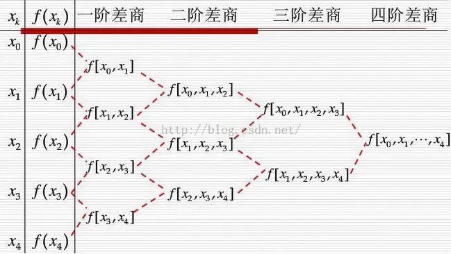
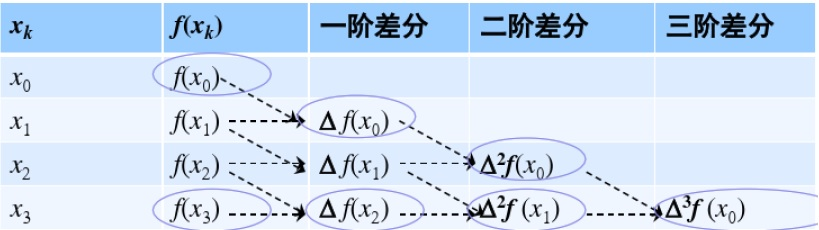

# 插值与逼近
## 多项式插值
对于给定的 ==$n+1$ 个点, 找到 $n$ 次多项式==满足
$$\begin{cases}a_0+a_1 x_0+\dots+a_n x_0^n=y_0\\a_0+a_1 x_1+\dots+a_n x_1^n=y_1\\\vdots\\a_0+a_1 x_n+\dots+a_n x_n^n=y_n\end{cases}$$
即找到线性方程组的解 $x$
$$Ax=y$$ 
$$A=\begin{bmatrix}1&x_0&x_0^2&\dots&x_0^n\\1&x_1&x_1^2&\dots&x_1^n\\\vdots\\1&x_n&x_n^2&\dots&x_n^n\end{bmatrix}$$ 
$$x=\begin{bmatrix}a_0\\a_1\\\vdots\\a_n\end{bmatrix}y=\begin{bmatrix}y_0\\y_1\\\vdots\\y_n\end{bmatrix}$$

### 拉格朗日插值
#### 线性函数
$$l_k(x)=\prod_{i\neq k}\frac{x-x_i}{x_k-x_i}$$
线性函数具有特点
1. $l_k(x_i)=0(i\neq k)$
2. $l_k(x_k)=1$

#### 插值公式
利用线性函数, 可得到插值多项式
$$L_n(x)=\sum y_k l_k(x)$$

### 牛顿插值
可根据节点的增加快速得到新的插值公式
$$P_n(x)=a_0+a_1(x-x_0)+\dots+a_n\sum_{i=0}^{n}(x-x_i)\\=P_{n-1}(x)+a_n\sum_{i=0}^{n}(x-x_i)$$

#### 均差计算
1. 一阶均差
$$f[x_a,x_b]=\frac{f(x_a)-f(x_b)}{x_a-x_b}$$
2. 高阶均差
$$f[x_0,x_1,\dots,x_n]=\frac{f[x_1,\dots,x_n]-f[x_0,x_1,\dots,x_{n-1}]}{x_n-x_0}$$
分子为两个仅有一个点不同的均差  
分母为分子中不同的点之差  
#### 均差性质
1. 均差与节点的排列顺序无关, 即 
$$f[x_0,x_1,\dots,x_n]=f[x_1,x_0,\dots,x_n]=\dots$$ 
2. 均差与导数的关系 
$$\exist\xi\in[a,b],f[x_0,x_1,\dots,x_n]=\frac{f^{(n)}(\xi)}{n!}$$
其中 $x_i\in[a,b]$

#### 均差递推

利用均差的性质可使用递推的方法得到高阶均差

#### 插值公式
$$P_n(x)=f(x_0)+f[x_0, x_1](x-x_0)+\dots+\\f[x_0,x_1,\dots,x_n]\prod_{i=0}^{n-1}{(x-x_i)}$$

### 差分形式的牛顿插值公式
当 $x_t$ 满足 $x_t=x_0+th$ 时, 可简化牛顿插值公式

#### 差分
定义差分
$$\Delta^nf(x_i)-\Delta^nf(x_{i+1})=\Delta^{n+1}f(x_i)$$

#### 差分表
利用差分的性质, 可得到递推关系

#### 差分性质
1. 与均差的关系
$$f[x_0,x_1,\dots,x_n]=\frac{1}{n!}\frac{1}{h^n}\Delta^nf(x_0)$$
2. 与导数的关系
$$\exist\xi\in[x_0,x_0+nh],\Delta^nf(x_i)=h^nf^{(n)}(\xi)$$

#### 插值公式
$$P_n(x_0+th)=f(x_0)+\Delta f(x_0)t+\dots+\\\frac{\Delta^{n} f(x_0)}{n!}\prod_{i=0}^{n-1}{(t-i)}$$
使用此形式避免求 $h^n$, $t$ 可取任意实数

### 埃尔米特插值
实际问题还要求节点的导数满足要求, 因此可用埃米尔特插值

#### 算术解法
类比多项式插值, 可得到其算术解法
* 多项式
$$M_0=\begin{bmatrix}1&x_0&x_0^2&\dots&x_0^n\\1&x_1&x_1^2&\dots&x_1^n\\\vdots\\1&x_k&x_k^2&\dots&x_k^n\end{bmatrix}$$
* 一阶导数
$$M_1=\begin{bmatrix}0&1&2x_0&\dots&nx_0^{n-1}\\0&1&2x_1&\dots&nx_1^{n-1}\\\vdots\\0&1&2x_{n-k}&\dots&nx_{n-k}^{n-1}\end{bmatrix}$$
* 多项式条件与导数条件
$$y'=\begin{bmatrix}y'_0\\y'_1\\\vdots\\y'_{n-k}\end{bmatrix}y=\begin{bmatrix}y_0\\y_1\\\vdots\\y_k\end{bmatrix}$$
* 系数向量
$$x=\begin{bmatrix}a_0\\a_1\\\vdots\\a_n\end{bmatrix}$$
* 算术解矩阵
$$\begin{bmatrix}M_0\\M_1\end{bmatrix}x=\begin{bmatrix}y\\y'\end{bmatrix}$$

### 余项表达式
* 如果给出高阶导数条件等多个关于同一点的条件 $c_i$ 次, 则变为相应次数 (默认给出点条件, 因此一般情况下 $c_i=1$)
* $m$ 为总共给出的条件数, $m=\sum c_i$
* $n$ 为总共的点数
* 对于多项式表达式, 其余项表达式为
$$R(x)=f(x)-P(x)=\frac{1}{m!}f^{(m)}(\xi)\prod_{i=0}^n(x-x_i)^{c_i},\xi\in(x_0,x_n)$$

### 分段插值
#### 龙格现象
插值多项式的次数越高, 精度不一定高  
因此对于多个点, 一般不采用高次插值多项式, 而是分段第次插值

### 三次样条插值
使用三次多项式 $S_i(x)$ 对于各个点的最小区间分段插值函数 $S(x)$  
总共需要 $4n$ 个条件, 根据已知点, 可提供 $n+1$ 个条件($i=0,1,\dots,n$)

#### 连续性条件
$$S(x_i^+)=S(x_i^-)$$ 
$$S'(x_i^+)=S'(x_i^-)$$ 
$$S''(x_i^+)=S''(x_i^-)$$
共能提供 $3n-3$ 个条件(减去边界点)

#### 边界条件
以上只能提供 $4n-2$ 个条件, 还差 2 个边界条件, 如果没有给出则使用自然边界条件
$$S''(x_0)=S''(x_n)=0$$

## 曲线拟合

### 最小二乘法概念
对于线性无关的函数族 $\varphi_0(x),\varphi_1(x),\dots,\varphi_m(x)$, 对于函数族任意线性组合 $S(x)$, 存在函数 $S^*(x)=\sum_{i=0}^m a_i\varphi_i(x)$ 使误差平方和最小, 即满足 
$$|\delta|^2=\sum_{i=0}^n\omega_i[S^*(x_i)-y_i]^2=\min\sum_{i=0}^n\omega_i[S(x_i)-y_i]^2$$
其中函数族内函数个数 $m\le n$, $n$ 为拟合点个数

* 通常取 $\varphi_i(x)=x^i$
* $\omega_i$ 表示点 $i$ 的权重, 通常取 $1$

### 最小二乘法计算
令 ==$|\delta|^2=I(a_0,a_1,\dots,a_m)$== (不是 $S^*$), 问题变为找到使 $I$ 最小的点, 可得到 $I$ 满足 $m$ 个条件
$$\frac{\partial I}{\partial a_j}=2\sum_{i=0}^n\omega_i[S^*(x_i)-y_i]\varphi_j(x_i)=0$$

### 法方程
规定记号
1. $$(\varphi_j,\varphi_k)=\sum_{i=0}^n\omega_i\varphi_j(x_i)\varphi_k(x_i)$$
2. $$(f,\varphi_k)=\sum_{i=0}^n\omega_iy_i\varphi_k(x_i)=d_k$$

规定符号
$$x=\begin{bmatrix}a_0\\a_1\\\vdots\\a_m\end{bmatrix}d=\begin{bmatrix}d_0\\d_1\\\vdots\\d_m\end{bmatrix}$$ 
$$G=\begin{bmatrix}(\varphi_0,\varphi_0)&(\varphi_0,\varphi_1)&(\varphi_0,\varphi_2)&\dots&(\varphi_0,\varphi_m)\\(\varphi_1,\varphi_0)&(\varphi_1,\varphi_1)&(\varphi_1,\varphi_2)&\dots&(\varphi_1,\varphi_m)\\\vdots\\(\varphi_m,\varphi_0)&(\varphi_m,\varphi_1)&(\varphi_m,\varphi_2)&\dots&(\varphi_m,\varphi_m)\end{bmatrix}$$

可将最 $S^*(x)$ 的条件表示为方程 $$Gx=d$$ 
解出 $x$ 即可得到 $S^*(x)$ 
其中函数族内函数个数 $m\le n$, $n$ 为拟合点个数

### 哈尔条件
函数族 $\varphi_0(x),\varphi_1(x),\dots,\varphi_m(x)$ 的任意线性组合 $S(x)$ 在定义域内, 最多只能有 $n$ 个零点, 才可保证矩阵 $G$ 可得到唯一解(非奇异)

### 多项式的次数
多项式的次数取决于系数不为 $0$ 的项中的最高次数   
eg. $1+x^2=0$ 为二次多项式, 包含的函数族为 $1,x,x^2$  

### 转化为多项式
通常采用多项式作为拟合函数, 拟合超越函数时, 可使用多项式变形  
$$U(x)=f[S(x)]=a'g(x)+b'\\y'=f(y)$$  
求出 $y'$ 与 $g(x)$ 的关系, 得到 $S(x)$  

#### 指数拟合
$$S(x)=ae^{bx}$$
令
$$U(x)=lnS(x)=lna+bx$$

#### 幂函数拟合
$$S(x)=ax^b$$
令
$$U(x)=lnS(x)=lna+blnx$$

#### 分式拟合
$$S(x)=\frac{x}{ax+b}$$
令
$$U(x)=\frac{1}{S(x)}=a+\frac{b}{x}$$
