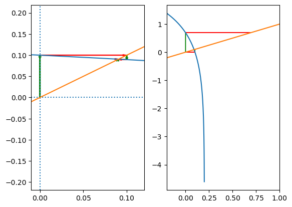
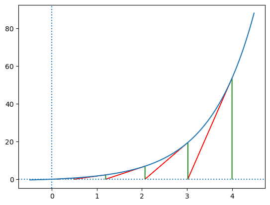

# 非线性方程的数值解

## 二分法
根据 $f(a)f(b)<0$ 时, 方程的根 $f(x)=0$ 在区间 $(a,b)$ 内   
每次迭代, 二分区间 $(a,b)$, 保证根在区间内, 直到达到指定精度   
缺陷: 无法计算如 $x^2=0$ 的根  

## 不动点迭代法

与线性方程组的向量序列类似, 对于方程 
$$f(x)=0$$
构建 
$$x=\varphi(x)$$
得到数列 
$$x_{k+1}=\varphi(x_k)$$
当 $k$ 足够大时, 且数列不发散, 数列收敛于方程解 $x^*$ 
$$\lim_{k\to\infty}x_{k}=x^*$$

### 构建不动点迭代法
对于方程 $f(x)=0$
1. $$\varphi(x)=f(x)+x$$
2. $$\varphi(x)=x(f(x)+1)$$
3. 根据 $f(x)$ 具体构建

### 不动点迭代法的收敛性

> 橙色直线 $x=y$ 蓝色曲线 $y=\varphi(x)$  
> 交点处即 $x=\varphi(x)$ 的解  
> 对于同一个方程, 左图从 $x=0$ 处开始迭代, 向方程解收敛  
> 右图从 $x=0.1\approx x^*$ 处开始迭代, 向发散方向移动  

由于 $\varphi(x)$ 可任意构造, 对于同一个方程, 不同的 $\varphi(x)$ 可能收敛也可能发散, 当 $\varphi(x)$ 满足以下条件时数列收敛

1. 对于任意 $x\in [a,b]$, 有 $a\le\varphi(x)\le b$
2. 对于任意 $x\in [a,b]$, 有 
$$|\frac{\varphi(x)-\varphi(y)}{x-y}|\le L< 1$$ 
一般带入 $a,b$ 与求导试探

### 不动点迭代法的误差
$$|x_{k}-x^*|\le\frac{L^k}{1-L}|x_1-x_0|\approx\frac{L}{1-L}|x_{k}-x_{k-1}|$$
由于 
$$\frac{L}{1-L}\approx 1$$
因此当要求误差 
$$|x_{k}-x^*|\le\varepsilon$$ 
仅需要求 
$$|x_{k}-x_{k-1}|\le\varepsilon$$

## 迭代法的收敛性
### 收敛性定义
1. 当迭代数列对于任意 $x_0\in \R$ 收敛, 则称迭代数列全局收敛
2. 当迭代数列对于任意 $x_0\in N(x^*,\delta)$ 收敛, 则称迭代数列局部收敛
3. 当 $|\varphi'(x^*)|<1$ 认为数列局部收敛

### 收敛速度
定义迭代误差 $e_k=|x_{k}-x^*|$ 如果存在极限 
$$\lim_{k\to\infty}\frac{e_{k+1}}{e_{k}^p}=C$$
则称迭代过程 $x=\varphi(x)$ 为 $p$ 阶收敛

根据原始定义与泰勒展开可得 
$$e_{k+1}=|x_{k+1}-x^*|=\frac{\varphi^{(p)}(\xi)}{p!}(x_k-x^*)^p=\frac{\varphi^{(p)}(\xi)}{p!}e_{k}^p$$
因此当 $\varphi(x)$ 满足 
$$\varphi'(x)=\dots=\varphi^{(p-1)}(x)=0\\\varphi^{(p)}(x)\neq 0$$
则称迭代过程 $x=\varphi(x)$ 为 $p$ 阶收敛

## 牛顿法
### 牛顿法

使用函数在 $x_k$ 点处的切线模拟函数的值用于求解方程 
$$f(x)\approx f(x_k)+f'(x_k)(x-x_k)=0$$ 
可得到依次法构造的迭代数列为 
$$\varphi(x)=x-\frac{f(x)}{f'(x)}$$
由于 $\varphi'(x)=0$, $\varphi''(x)\neq 0$, 因此牛顿法为二次收敛

### 牛顿下山法
牛顿法中, 无法保误差稳定下降, 可能在收敛的过程中震荡, 为了保证收敛, 可引入参数与试算

#### 试算
为了保证误差稳定下降, 在每次迭代后进行试算, 保证 (迭代越来越接近解 $f(x)=0$) 
$$|f(x_{k+1})|<|f(x_{k})|$$

#### 参数
引入参数 $\lambda$, 构造 
$$\varphi(x)=x-\lambda\frac{f(x)}{f'(x)}$$
取 $\lambda_{0}=1$, 每次试算不满足条件, 则取 $\lambda_{n+1}=\frac{1}{2}\lambda_{n}$

### 重根情形
当 $x=x^*$ 为方程的多重根, 牛顿法的收敛速度变为线性收敛

## 牛顿法变形
牛顿法中需要计算导数 $f'(x)$ 较为复杂, 可通过其他方法, 避开导数计算

### 简化牛顿法
取近似 $f'(x)\approx f'(x_0)=1/C$ 从而有 
$$\varphi(x)=x-Cf(x)$$
==此时无法保证一定收敛==, 还需要满足条件 $|\varphi'(x^*)|<1$, 并且仅能线性收敛($p=1$), 但极大的简化了计算量

### 弦截牛顿法
使用迭代过程中计算的函数点的连线斜率近似为导数计算 
$$f'(x_{k})\approx \frac{f(x_k)-f(x_{k-1})}{x_k-x_{k-1}}$$
此方法需要给出两个初始值  
此方法具有 $p\approx 1.618$ 的收敛阶数, 为超线性收敛  

### 抛物线法
类似弦截法, 但是使用二次函数近似 $f(x)$, 而非牛顿法的一次函数  
每次迭代, 使用上 $3$ 此迭代值插值出二次多项式, 求出二次函数与坐标轴的交点, 得到下一次迭代值  

## 应用
构造开方公式  
根据开方运算, 可将其等价为方程 $x^2-C=0$ 的根  
使用牛顿法可得到迭代公式 
$$x_{k+1}=x_k-\frac{x_k^2-C}{2x_k}=\frac{1}{2}(x_k+\frac{C}{x_k})$$
