# 光学
## 电磁波理论
### 惠更斯原理
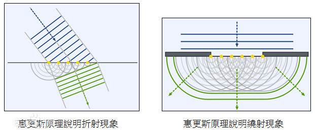
波面上的各点都可以看成产生子波 (球面波) 的波源, 这些子波的包络面可以看成新的波面

#### 波的折射
* 波在入射两种介质的界面时, 将会产生折射
* 这是由于波在两种介质的速率不同导致的
* 如图, 平面波在界面上产生的子波在新介质中传播速率减慢, 导致最先产生的子波波面与最后到达的子波源切线改变, 导致波面的法向改变
* 对于入射角 $i$, 折射角 $\gamma$, 有折射定律 $$n_i\sin i=n_\gamma\sin\gamma$$

### 光波性质
1. 光是电磁波, 其在真空中的传播速度最快, 且为常量 $c$, 因此有 $$c=\lambda\nu$$
2. 将光速与光波在透明介质传播速率的比值定义为折射率 $$n=\frac{c}{v}>1$$
3. 光波中 $\vec{E}$ 与 $\vec{H}$ 垂直, 使用 $\vec{E}$ 表征光波, 将 $\vec{E}$ 的振动称为光振动
4. 沿 $x$ 方向的平面光波可表示为 $$\vec{E}(x,t)=\vec{E_0}cos(\omega t-\frac{2\pi}{\lambda}x+\varphi_0)$$
5. 人眼直接观察到的为光强, 即光波的平均能流密度满足 $I\propto E_0^2$
6. 由于原子辐射具有随机性与间歇性, 因此一般光源的 $\omega,\varphi_0$ 仅持续极短的 $\Delta t\approx 10^{-9}s$, 并且随时间在一个区间内快速变化
7. 根据傅里叶分析可得 $$\Delta\nu\cdot\Delta t=1$$
光源的持续时间越短, 频率的变化范围越大 
8. 定义波列 $L=c\Delta t$, 表现出光源发出的一列稳定光波的长度

### 光波叠加
同频率光波叠加类似同频率简谐波的叠加, 满足旋转矢量的平行四边形叠加的余弦定律 $$E_{12}^2=E_{10}^2+E_{20}^2+2E_{10}E_{20}\cos\Delta\varphi$$
其中 $$\Delta\varphi=-\frac{2\pi}{\lambda}x_{1}+\varphi_{10}+\frac{2\pi}{\lambda}x_{2}-\varphi_{20}$$ 为两列波的相位差(==包括路程与初相位==)

在人眼观测中, 光波叠加为一段时间内的平均光强, 积分计算可得 $$I\propto \overline{E^2}=I_1+I_2+2\sqrt{I_1I_2}\cdot\overline{\cos\Delta\varphi}$$ 

#### 非相干叠加
对于两个普通光源, 其 $\varphi_0$ 无关系, 并且不断变化, 因此认为 $\overline{\cos\Delta\varphi}=0$, 两个普通光源的光波叠加后 $I=I_1+I_2$

#### 相干叠加
当叠加光波相干(如来自同一个光源), 此时两列波 $\varphi_0$ 相同, 波程差来自光程 $x$, 因此对于一个点, $\overline{\cos\Delta\varphi}=C$, 并在平面上显现出明暗相间的干涉条纹

可得明暗条纹的条件为 $$\Delta\varphi=\begin{cases}\pm 2k\pi,&明条纹\\\pm (2k+1)\pi,&暗条纹\end{cases}(k=\pm 0,1,2,\dots)$$

#### 相干条件
1. 各光波频率相同
2. 各光波有平行分量(能够投影到一个平面上)
    * 由于光为横波, 两列光波的光矢量在空间中不一定平行, 需要将其中一个光矢量投影到另一个上计算
    * 垂直分量的光矢量构成背景光
    * 当光矢量垂直, 则不构成相干光
3. 光振动的相位差保持稳定(从同一光源分光或使用激光源)

### 光程
1. 无论在何种介质中, 光波的==频率 $\nu$== 始终不变, 但波长 $\lambda$ 与波速 $v$ 改变, 因此, 介质中的波长为 $$\lambda_n=\frac{\lambda}{n}$$
2. 因此当一列光波经过了不同介质后, 与光源的相位差为 $$\Delta\varphi=-(\frac{2\pi}{\lambda_1}r_1+\frac{2\pi}{\lambda_2}r_2)=-\frac{2\pi}{\lambda}(n_1r_1+n_2r_2)$$
3. 定义光程 $d$ $$d_k=\sum n_ir_i$$
4. 因此初相位相同的相干光源的相位差为 $$\Delta\varphi=\frac{2\pi}{\lambda}(d_2-d_1)=\frac{2\pi}{\lambda}\delta$$
带入 $\frac{2\pi}{\lambda}\delta=\Delta\varphi$
$$\delta=\begin{cases}\lambda k,& 明条纹\\\lambda(k+\frac{1}{2}),& 暗条纹\end{cases}(k=\pm 0,1,2,\dots)$$

#### 物象间等光程性
1. 光学仪器 (透镜, 球镜) 的物点 (光源) 和像点 (焦点) 之间的各个光线光程相同
2. 对于平行光源, 在垂直于光线的平面内相位相同, 来自无穷远处的光源
3. 认为平行光聚焦于无穷远处, 来自无穷远处的光源

### 半波损失
1. 光从波疏介质到波密介质时
2. 当入射角 $i\approx 90^{\circ}$ 或 $i\approx 0^{\circ}$
3. 反射光与入射光的相位将相差 $\frac{\pi}{2}$

#### 光介质
1. 将折射率 $n$ 大的物质称为波疏介质 (如平面镜, 玻璃)
2. 将折射率 $n$ 小的物质称为波密介质 (如真空, 空气)
3. 当出现平面镜时, 很有可能发生半波损失

## 分波阵面干涉
### 杨氏干涉
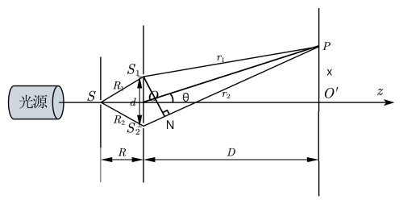
子光源 $S_1,S_2$ 来自同一个光源(波阵面), 因此为相干光, 当$SS_1=SS_2$ 时, 两个子光源在 $P$ 点的光程差为 $$\delta=r_2-r_1\approx S_2N\approx d\sin\theta\approx d\tan\theta=d\frac{x}{D}$$
其中 $D\gg d,x;\theta\approx 0$

$x$ 体现了屏幕上 $p$ 点的明暗情况, 因此有 $$x=\begin{cases}\lambda\frac{D}{d}k,& 明条纹\\\lambda\frac{D}{d}(k+\frac{1}{2}),& 暗条纹\end{cases}(k= 0,\pm 1,2,\dots)$$ $k$ 为条纹级数, $k=0$ 为零级明条纹

其中屏幕上两明条纹 / 暗条纹间距相同 $$\Delta x=\lambda\frac{D}{d}$$ 因此条纹间距与光路中是否有介质无关
但光路中的介质将改变 $\delta$, 导致条纹移动

#### 光强分析
(推导见双缝衍射)

* 根据相干叠加, 条纹光强满足 $$I_P=4I_1\cos^2(\frac{\Delta\varphi}{2})$$
* 其中光程差 $$2\beta=\Delta\varphi=\frac{2\pi}{\lambda}d\sin\theta$$

### 劳埃德镜
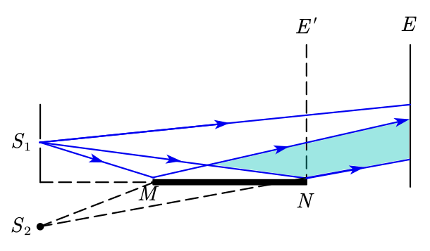
1. 可将 $S_1$ 在平面镜中的的虚像视为相干光源光源 $S_2$, 即杨氏干涉中的第二条狭缝
2. 由于光线从空气入射平面镜将产生半波损失, 因此干涉条纹的明暗与杨氏干涉相反
3. 由于光源为虚光源, 因此条纹只有上半部分, 级数 $k\ge 0$

### 时间相干性
杨氏干涉中, 当两列光的光程差 $\delta >L=c\Delta t$ 时, 即两列光虽然分自同一个光源, 但两列光相差时间过长, 光源的 $\omega$ 与 $\varphi_0$ 以发生变化, 不再相干, 称为时间相干性

普通光源中, 由于波列长度(相干长度) $L$ 极小, 因此产生相干的 $\delta$ 较小, 相干性较差

### 空间相干性
杨氏干涉中, 缝光源 $S$ 也具有宽度 $b$, 在缝宽边缘也可视为另一个光源 $S'$, 也会通过双缝产生干涉条纹

由于 $S'$ 到双缝距离 $R_i$ 不同, 会产生附加光程差 $$\delta_b=R_2-R_1\approx\frac{bd}{2R}$$
其中 $R$ 为单缝与双缝的垂直距离

如果 $\delta_b=\frac{\lambda}{2}$, 缝边缘产生的干涉条纹与中心产生的条纹恰好相反, 将导致干涉条纹消失, 因此定义 $$\frac{b_0d}{2R}=\frac{\lambda}{2}$$

仅当光源的 $b<b_0$ 才能产生可观察到的干涉条纹, 可以此筛选特定的 $\lambda$ 或 $b$

## 分振幅干涉
* 即利用光的反射与折射获取相干光源的干涉
* 由于利用了反射与折射, 需要注意半波损失

### 等倾干涉
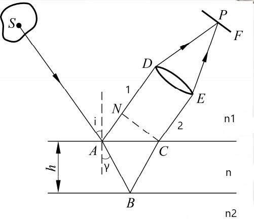

1. 将分解光源的两层薄膜平行的干涉称为等倾干涉
2. 由于两列相干光平行, 因此认为相遇于无穷远处, 或需要透镜聚焦
3. 注意薄膜介质与薄膜两侧介质的折射率 $n$, 可能会在 $A,B$ 处产生半波损失

#### 等倾干涉分析
根据折射定律 $$n_1\sin i=n\sin\gamma$$
在不考虑半波损失的条件下 ($n_1<n<n_2$, 两光路均有半波损失), 如图可得 (完整公式不要求) $$\delta=n(AB+BC)-n_1AN=2nd\cos\gamma=2d\sqrt{n^2-n_1^2\sin^2i}$$
$k$ 级亮条纹满足 $$\delta=2d\sqrt{n^2-n_1^2\sin^2i}=k\lambda(k=1,2,\dots)$$

对于点光源 $S$, 可得到以下规律
1. 干涉条纹仅与入射角 $i$ 有关, 因此称为等倾干涉, ==当 $S$ 为点光源时==, 入射角为 $i$ 的点可构成一个圆, 从而产生明暗相间的圆形干涉条纹
1. ==越靠近中心, $i$ 越小, 条纹级数越高== ($\sin i$ 项为负), 相应的, 边缘级数小
1. 增大 $d$ 时, $\delta$ 增大, 中心圆环的级数增大, 表现为圆环从中心涌出
1. 根据 $\delta=2nd\cos\gamma=k\lambda$, 边缘条纹的级数 $k$ 较小, 对应的 $\gamma$ 较大, 根据 $y=\cos\theta$ 的图像可得, ==边缘条纹的级数变化快, 间距窄, 中心条纹间距宽, 条纹稀疏==

对于平行光源 $S$
1. 当 $S$ 为平行光源时, 各个入射点 $i$ 相同, 只能得到一个条纹/点
1. 对于垂直入射的自然光, $\delta=2dn$, 表现为部分 $\lambda$ 干涉极大, 部分干涉极小 (肥皂泡原理)

对于不同的介质与观察方向
1. 当仅有一个界面发生半波损失时, 需要在光程中考虑附加光程差 $\delta'=\frac{\pi}{2}$, 如 $n_1,n_2>n$, 此时将得到相反的图样
1. 从反方向观察, $B$ 处折射光与 $C$ 处反射再折射光也将产生等倾干涉, 并且条纹与正面观察的相反 (由于半波损失情况与正面相反导致, 符合能量守恒)

### 等厚干涉
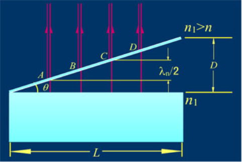

1. 将分解光源的两层薄膜成一定角度的干涉称为等厚干涉
1. 实际问题中, 只讨论 $i=0$ 即垂直入射的情况
1. 由于厚度相同的位置干涉情况相同, 因此称为等厚干涉
1. 等厚干涉中, 相干光的光程差为 $\delta=2nd$ (经历了折射与反射, 需要记两倍的厚度 $d$)

#### 劈尖干涉
当 $\theta\approx 0$, ==沿斜边距离棱角 $l$ 处==的光程差为 $$\delta=2nl\tan\theta\approx 2nl\theta=k\lambda(亮条纹)$$
干涉中相邻的条纹距离为 $$\Delta l=\frac{\lambda}{2n\theta}$$
一般劈尖中心为空气, $n=1$

根据等候干涉的特点, ==一条连续条纹对应的厚度相同==, 因此可以此判断薄膜表面的凹陷

当上下表面为玻璃, 中间为空气时, 存在半波损失, 需要注意半波损失

#### 增透膜
确定薄膜厚度, 使反射光为干涉极小, 增大透射光光强

#### 牛顿环
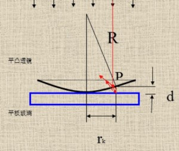

1. 环的半径与厚度关系 $$r^2=2Rd-d^2\approx 2Rd$$
1. 由于牛顿环中透镜与平板为玻璃, 因此存在半波损失
1. 因此可得暗环半径满足 (空气 $n=1$) $$r=\sqrt{kR\lambda}(k=0,1,2,\dots)$$
1. 与等倾干涉不同, ==越接近外层, 条纹级数越大==
1. 与等倾干涉类似, ==越接近外层, 条纹越密==
1. 由于 $k=0,r=0$, 因此中心条纹为暗纹 (仅当中心紧贴着下表面时成立)

#### 迈克尔逊干涉仪
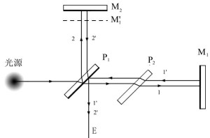

1. 引入补偿板 $P_2$, 使两束光均经过两次透光板, 保证两束光除空气外光程相同
1. 干涉仪将光源分为折射 $1$ 与反射 $2$ 两束, 一束来自可动镜 $M_2$, 另一束来自固定镜 $M_1$, 其虚像 $M_1'$ 与 $M_2$ 平行
1. 假设 $M_1'$ 与 $M_2$ 距离相同, 由于光束在反射镜来回一次, 因此两束光的光程差为 $\delta=2dn$, 通过移动 $M_2$, 改变光程差与成像
    * 可通过此方法, 已知 $\lambda$, 计算 $\Delta d$
    * 已知 $\Delta d$, 计算 $\lambda$
1. 当光源为点光源 (散射面光源), 得到等倾干涉的圆形图样
1. 当 $M_1'\nparallel M_2$, 光源为平行光, 得到等厚干涉图样

## 夫琅禾费衍射
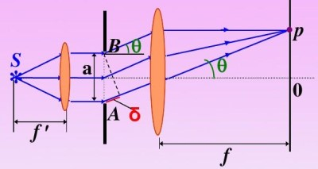
* 根据惠更斯原理, 光波在狭缝处可分解为无数个子光源, 光屏上的点 $P$ 为子光源共同聚焦的结果
* 当入射狭缝的光源为平行光时, 称为单缝夫琅禾费衍射
* ==无论单缝位置在哪, 衍射图像主要与透镜的位置有关==, 其中 $\theta$ 为光屏上 $P$ 点与透镜中心及中心线所成的角

### 叠加法推导单缝夫琅禾费衍射
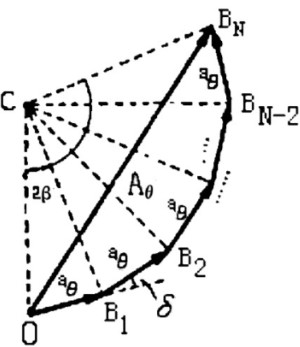

1. 将子光源在 $p$ 点的光振动以相量形式表示为 $d\vec{B}=dE\angle d\varphi_0$
1. 由相邻光振动的光程差 $d\delta\approx dx\sin\theta$ 可得 $$d\varphi_0=\frac{2\pi d\delta}{\lambda}=\frac{2\pi dx\sin\theta}{\lambda}$$
1. 将子光源的振动相量积分有 $$E_0=\int dE\\\varphi'=\int d\varphi_0=\frac{2\pi a\sin\theta}{\lambda}$$ 
1. 因此振动相量叠加后为一圆弧, 弧长为 $E_0$, 圆心角为 $\varphi_0'$, 在 $p$ 点的振动相量 $\vec{B}$ 为弧的弦, 定义 $\alpha=\varphi'/2=\frac{\pi a\sin\theta}{\lambda}$ , 因此叠加振幅 $$E=2\frac{E_0}{\varphi'}\cdot\sin\frac{\varphi'}{2}=\frac{E_0\sin\alpha}{\alpha}$$
1. 根据惠更斯原理, $E_0\propto a$, 因此最大光强与缝宽成正比

#### 夫琅禾费衍射光强分析
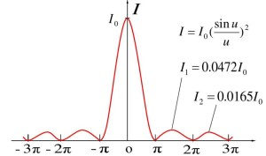

实际分析中通常分析光强分布 $$I\propto E^2=I_0(\frac{\sin\alpha}{\alpha})^2$$ 其中, $I_0\propto a^2$, 最大光强与缝宽的平方成正比

1. 定义 $\alpha=0$ 为中央主极大, 亮度最高
1. 定义 $k$ 级次极大位置为(==注意 $k$ 不可取 $0$==) $$\alpha=(k+\frac{1}{2})\pi\;(k=\pm 1,2,3,\dots)$$
1. 定义暗纹位置 $$\alpha=k\pi\;(k=\pm 0,1,2,\dots)$$
1. 由于 $\theta\approx 0$, 因此 $\alpha=\frac{\pi a\sin\theta}{\lambda}\approx \frac{\pi a\theta}{\lambda}$ 定义中央主极大到一侧的暗纹宽度为中央主极大的半角宽 $$\Delta\theta=\frac{\lambda}{\alpha}$$
1. 当透镜到屏幕距离为 $f$ 时, 屏幕上中央主极大的线宽为 $$\Delta x=2f\tan\Delta\theta\approx 2f\frac{\lambda}{\alpha}$$
1. 综上可得, 单缝缝宽 $a$ 越小, 主极大亮度 $I_0$ 越低, 但宽度 $\Delta x$ 越大

#### 半波带法
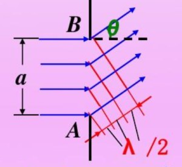

* 将缝宽向光线方向的投影以宽度 $\lambda/2$ 等分, 反过来将入射光源分为 $n$ 部分
* 各部分子光源间的光程差为 $\lambda/2$, 因此每两部分的光线相干抵消, 最终叠加得到暗条纹
* 因此假设 $a\sin\theta=\frac{\lambda\alpha}{\pi}=n\lambda/2$
    1. $n=0$, 所有子光源的光程差为 $0$, 为主极大
    1. $n$ 为偶数, 子光源相互抵消, 为暗纹
    1. $n$ 为奇数, 至少有一部分子光源没有被抵消, 为次极大

### 双缝衍射与干涉
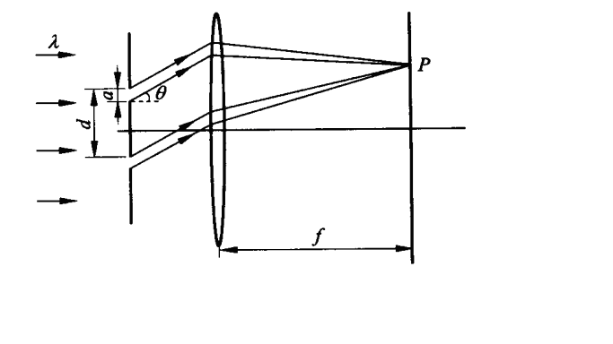

* 由于单缝衍射的图样与单缝位置无关, 因此两缝产生的条纹完全重合, 但光程差不同
* 两图样的叠加可通过双缝干涉的方法计算
* 设双缝中心距 $d$, 双缝缝宽 $a$

#### 双缝衍射的光强分布推导
1. 由于两束光来自同一光源, 因此最大光强 $$4I_1=4I_2=I_0\propto E_{10}^2=E_{20}^2$$
1. 根据相干叠加理论, 可得 $$I_P=I_1+I_2+2\sqrt{I_1I_2}\cos\Delta\varphi\\=2I_1(1+\cos\Delta\varphi)=4I_1\cos^2(\frac{\Delta\varphi}{2})$$
1. 其中光程差通过做垂线的方法可得 (不带入双缝干涉的近似式) $$2\beta=\Delta\varphi=\frac{2\pi}{\lambda}d\sin\theta$$
1. 再考虑衍射的作用, 有 $I_0'=I_0(\frac{\sin\alpha}{\alpha})^2$
1. 得到双缝衍射的光强公式 $$I=I_0(\frac{\sin\alpha}{\alpha})^2\cos^2\beta$$ 其中 $$\alpha=a\frac{\pi \sin\theta}{\lambda}$$ $$\beta=d\frac{\pi\sin\theta}{\lambda}$$

#### 双缝衍射的图样特点
1. 当 $\theta=0$, $I=I_0$ 光强最大
1. 衍射中央明文角宽度 $\Delta\theta=\frac{2\lambda}{a}$, 干涉中央明文角宽度 $\Delta\theta'=\frac{\lambda}{d}$
1. 由于 $d>a$, 因此 $\Delta\theta>\Delta\theta'$, 条纹的明暗由干涉决定, 与干涉明暗纹的条件相同
1. 当衍射极小时, $a\sin\theta=k'\lambda$; 当干涉极大时, $d\sin\theta=k\lambda$, 当两者相等时有 $k=k'\frac{d}{a}$, 其中 $k$ 为明条纹的级数, $k'$ 为衍射因子第 $k$ 级极小, 当 $k$ 满足此条件时, 称 $k$ 为缺级, 可以根据缺级的位置, 判断 $\frac{d}{a}$ 大小
1. 根据对称性, 左右两第 $k$ 缺级中, 共会有 $2\times(k-1)+1$ 条条纹

## 衍射光栅
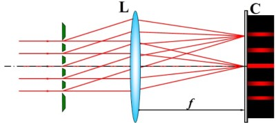

* 设光栅常量即两缝中心距 $d$, 双缝缝宽 $a$, 共有 $N$ 条狭缝

### 叠加法推导衍射光栅

1. 每个狭缝产生的衍射图样重合, 且条纹之间的光程差均为 $\Delta\varphi=\frac{2\pi d\sin\theta}{\lambda}$, 光矢量振幅均为 $E_i=E_0\frac{\sin\alpha}{\alpha}$
1. 因此也可以对各个狭缝在 $P$ 点的光振动相量叠加, 得到一个圆弧, 实际光振动相量即圆弧的弦 $\vec{B_N}$
1. 将圆弧中的三角形 $\Delta COB_1$ 视为等腰三角形, $CO$ 为圆弧半径, 认为三角形顶角为 $\Delta\varphi\approx 0$ 
1. 因此圆弧半径 $r=\frac{E_i/2}{\sin(\Delta\varphi/2)}$
1. 圆弧圆心角为 $N\Delta\varphi$
1. 对弦三角形 $\Delta COB_N$, 可以解出 $$E_N=2r\sin(\frac{N\Delta\varphi}{2})=E_0\frac{\sin\alpha}{\alpha}\cdot\frac{\sin(N\beta)}{\sin\beta}$$

### 衍射光栅的光强分布
1. 根据光矢量分布, 可得光强分布 $$I=I_0(\frac{\sin\alpha}{\alpha})^2\cdot(\frac{\sin(N\beta)}{\sin\beta})^2$$
1. 定义主极大 $\beta=k\pi,(\frac{\sin(N\beta)}{\sin\beta})^2=N^2$, 此时分子分母均为 $0$, 但极限不为 $0$, 且取到最大值, 可得主极大的位置$$d\sin\theta=k\lambda(k=\pm 0,1,2,\dots)$$ 主极大位置与光栅缝数 $N$ 无关, 只与光栅常数 $d$ 有关
1. 由于成像角度 $\theta\in(-\pi/2,\pi/2)$, 因此主极大的级数有限
1. 定义极小 $\beta=(k+\frac{m}{N})\pi\;(m<N)$, 此时分子为 $\frac{\sin(N\beta)}{\sin\beta}=0$, 分母不为 $0$, 因此光强为 $0$, 可得极小位置为 $$d\sin\theta=(k+\frac{m}{N})\lambda\;(m=1,2,\dots,N-1)$$
1. 定义次极大为两个极小之间的峰值, 通常比主极大小得多
1. 根据极小定义, 当 $m=0$, 即主极大, 因此主极大相当于对将 $\theta$ 以 $\lambda$ 划分, 极小相当于对 $\lambda$ 再进行 $N$ 等分, 一个 $\lambda$ 中有 $N-1$ 条分界线, 次极大位于每小段之间, 共 $N-2$ 个 (两侧主极大各占一小格)
1. 定义 $k$ 级主极大半角宽, 即一小格的角宽度 (注意 $\sin\theta$ 并非线性变化) $$\Delta\theta_k\approx\frac{\lambda}{N\cos\theta_k}$$ 因此随着缝数增多, 主极大 (亮条纹) 变窄
1. 与双缝类似, 光栅衍射也存在缺级, 条件依然为 $k=k'\frac{d}{a}$ 可以此判断 $\frac{d}{a}$ 大小

### 非水平入射情况
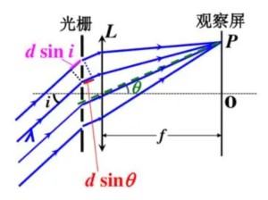

当平行光不是水平入射, 而是存在入射角 $i\neq 0$, 则相当于入射前的光还存在一个额外的光程差, 此时光程差为 $$\delta=d(\sin\theta+\sin i)$$ 因此公式中 $$\beta=\frac{\pi d(\sin\theta+\sin i)}{\lambda}$$

### 光栅色散
使用复色光照射光栅, 除了中央主极大, 每个波长的主极大不重合, 且与中央主极大距离为 $k\lambda$, 可以此法计算复色光的光谱

#### 角色散
为了确定光栅的辨色能力, 对于波长在 $\lambda\in(\lambda,\lambda+d\lambda)$ 内, 相应==主极大的距离 $d\theta$==, 定义角色散 (为了提高辨别度, 角色散越大越好) $$D=\frac{d\theta}{d\lambda}$$ 
为了求得 $D$, 对光栅主极大条件做微分可得 $$d\cos\theta d\theta=k d\lambda$$ 因此, 对于 $k$ 级主极大的角色散可表示为 (通常取 $k=1,2$, 否则光强过小) $$D_k=\frac{k}{d\cos\theta_k}$$
考虑成像与透镜的距离 $f$ 后有 $$D^*=\frac{dx}{d\lambda}=fD_k=\frac{fk}{d\cos\theta_k}$$

#### 光栅的辩色能力
定义光栅的辩色能力为 $$R=kN$$ 其中 $k$ 为主极大的级数, $N$ 为光栅缝数

## 特殊衍射
### X射线衍射
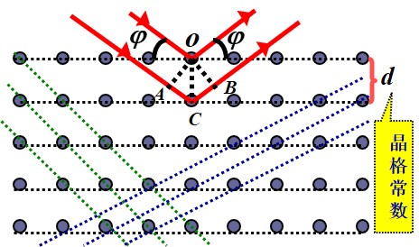
从 $\theta$ 处观察 (与水平晶面夹角), 当 X 射线的波长满足以下条件时, 干涉极大
$$\lambda=\frac{2d\sin\varphi}{k}(k=1,2,\dots)$$

### 圆孔衍射
当物体通过值径为 $D$ 的圆孔成像时, 将产生衍射, 导致图像无法分辨, 定义 $$\delta\varphi=1.22\frac{\lambda}{D}$$
当两点与圆孔的夹角 $\theta>\delta\varphi$, 认为两点可以分辨, 称 $\delta\varphi$ 为仪器的分辨率

## 光的偏振
1. 光波属于横波, 其电矢量 $\vec{E}$ 具有方向性
1. 此处 $\vec{E}$ 不是相量, 而是电矢量, 垂直于光的传播方向
1. 可以向正交方向分解电矢量为两列光波 $E_x,E_y$ , 两列光波的电矢量垂直, 初相位不同, 振幅也不同, 但频率相同

### 偏振状态
#### 线偏振光
当 $E_x,E_y$ 的相位差 $\Delta\varphi=0,\pi$
两个分量的变化趋势完全相同, $\vec{E}$ 保持在固定的方向内, 矢量端点轨迹为直线

#### 圆偏振光
当 $E_x,E_y$ 的相位差 $\Delta\varphi=\pm\pi/2$, 振幅相同
$\vec{E}$ 以固定的角速度 $\omega$ 变换方向, 矢量端点轨迹为一个圆

#### 椭圆偏振光
当 $E_x,E_y$ 不满足以上两种条件
$\vec{E}$ 矢量端点轨迹为椭圆

#### 自然光
当 $E_x,E_y$ 的相位差无关联, 可能有任何取值, 且平均振幅相同, 则称为自然光

#### 部分偏振光
当 $E_x,E_y$ 的相位差无关联, 可能有任何取值, 但平均振幅不同, 且均大于零, 则称为部分偏振光

### 马吕斯定律
#### 偏振片
* 能够吸收特定方向偏振光的薄片, 与之垂直的方向则能够完全通过, 称为偏振化方向
* 光线通过偏振偏后, 吸收方向的分量被吸收, 垂直方向的分量通过
* ==无论何种状态的光, 透射后的光线必定为线偏振光==

#### 马吕斯定律
当强度为 $I_0$ 的==线偏振光==通过偏振片 (称为检偏器) 后, 假设偏振方向与偏振化方向的夹角为 $\alpha$, 投射后的光强为 $$I=I_0\cos^2\alpha$$

### 布鲁斯特定律
1. 当自然光入射到介质界面后, 反射光与折射光均为部分偏振光, 其中==反射光的垂直于入射平面的光振动分量更强==, 折射光相反
1. 当入射角为 $i_B$ 时, 反射光与折射光垂直, ==此时反射光为线偏振光, 但折射光仍为部分偏振光==
1. 根据折射定律, 假设入射光所在介质 $n_1$, 可得 $$n_1\sin i_B=n_2\sin(\pi/2-i_B)$$ 因此 $$\tan i_B=\frac{n_2}{n_1}$$
1. 称 $i_B$ 为起偏振角

### 双折射
#### 晶体双折射现象
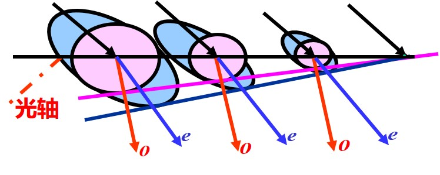
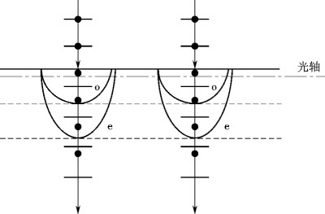

1. 各向异性介质 (晶体) 中, 一束入射光将产生两束折射光, 将符合折射定律的折射光称为 $o$ 光, 另一束则称为 $e$ 光
1. 晶体中存在一个方向, 沿此方向不发生双折射, 称为光轴 (存在无数条, 相互平行)
1. 对于晶体中的点光源, 经过一段时间后, $o$ 光产生普通的球面光, $e$ 光则产生椭球面光, 且在光轴上于 $o$ 光产生的球面相切
这是由于 $e$ 光中, 光沿垂直于光轴的方向传播速度 $v_e\neq v_o$
    1. 当 $v_o>v_e$ 称为正晶体, 球面在椭球面外 (此时 $n_o<n_e=\frac{c}{v_e}$)
    1. 当 $v_o<v_e$ 称为负晶体, 球面在椭球面内 (此时 $n_o>n_e$)
==当入射面与光轴平行时, 产生的 $o$ 光与 $e$ 光的光振动垂直==

#### 波片
* ==当入射光垂直于光轴==, 产生的 $o$ 光与 $e$ 光的光振动垂直, 并且由于垂直波速不同, 当光线出射后重新叠加, ==出射光的光振动关于 $e,o$ 方向的分量相位被改变==, 根据此原理制成波片
* 波片厚度 $d$ 满足 $\Delta\varphi=\frac{2\pi}{\lambda}(n_e-n_o)d$, 只对特定的 $\lambda$ 有效
* 对于自然光, 波片无法改变其状态

##### 四分之一波片
1. 能够产生 $\pi/2$ 的相位差
1. 当入射光为线偏振光
    1. 当与 $o$ 光或 $e$ 光的光振动方向相同, 则出射仍为线偏振光
    1. 当与 $o$ 光或 $e$ 光的光振动夹角为 $45^{\circ}$, 则初射后, 正交分量振幅相同, 相位差 $\pi/2$, 为圆偏振光
    1. 其他情况下, 由于正交分量振幅不同, 为椭圆偏振光
1. 当入射光为圆偏振光, 圆偏振光向任意方向分解, 相位差均为 $\pi/2$, 再次改变后, 变为 $\pi$, 因此变为线偏振光
1. 当入射光为椭圆偏振光, 如果其 $o$ 光与 $e$ 光的分量为 $\pi/2$ (主轴), 则出射线偏振光, 否则仍为椭圆偏振光

##### 半波片
1. 能够产生 $\pi$ 的相位差
1. 入射光为线偏振光时, 能够改变其偏振方向
1. 入射光为圆偏振光时, 能够改变其旋转方向

### 偏振光的干涉
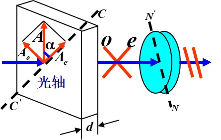
1. 线偏振光通过波片, 改变其 $o$ 光与 $e$ 光方向分量的相位差
1. 再通过偏振片, 获得其 $o$ 光与 $e$ 光方向分量在偏振片方向的投影
1. 此时可将 $o$ 光与 $e$ 光方向分量视为两束叠加的相干光
1. 两束光有相位差, 只与入射光波长与波片厚度有关 (只考虑相位差, 不考虑振幅大小) $$\Delta\varphi=\frac{2\pi}{\lambda}(n_e-n_e)d$$
1. 如果投影后, $o$ 光与 $e$ 光方向相反, 则要附加光程差 $\pi/2$, 此时转动偏振片, 可能使其投影后方向相同, 导致干涉结果变化

