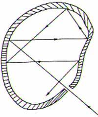
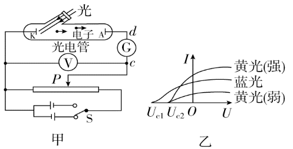
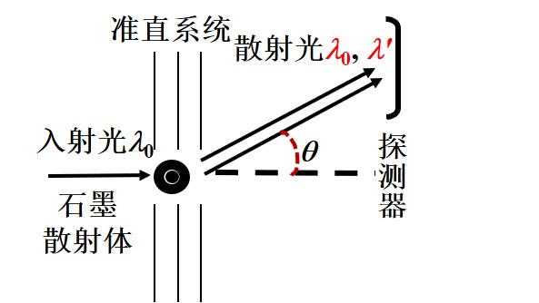
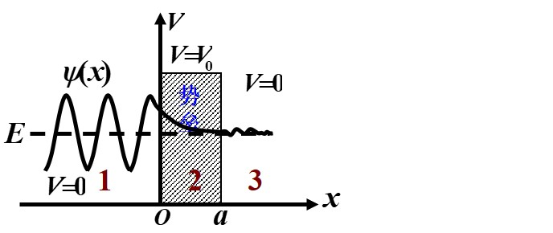

# 早期量子力学理论
## 黑体辐射
### 绝对黑体

* 在不透明的空腔上开一个小孔, 外界辐射进入小孔后, 将会几乎被完全吸收, 可将小孔认为是绝对黑体
* 凡是易于吸收辐射的物体, 也一定是易于发出辐射的, 这样才能达到热平衡
* 因此加热空腔, 小孔将发出辐射, 称为绝对黑体辐射

### 黑体辐射定律
#### ==普朗克公式==
* 谐振子 (带点粒子) 只能处在某些特殊状态, 他们的能量是某个最小能量单元 $\varepsilon$ 的整数倍
* 频率为 $\nu$ 的谐振子的最小能量单元正比于频率 
$$\varepsilon=h\nu$$
* 谐振子能量交换的过程也不连续, 其放出与吸收的能量只能是 $\varepsilon$ 的整数倍

## 光电效应

将单色光照到阴极板 $K$ 上, 并施加电压 $U$ , 记录电流计的读书 $I$ 

### 实验现象
1. 当正向电压足够大时, 阴极 $K$ 释放的电子全部飞到 $A$ 上, 电流 $I_m$ 最大, 且不再增大
1. 当反向电压足够大时, 全部电子无法达到 $A$, 电流最小, 此时的电压称为遏止电压 $U_a$

### 实验解释
* 单位时间内溢出的光电子数与入射光强成正比 (同 $\lambda$, 光强越大, 最大电流 $I_m$ 越大)
* 当电压达到遏止电压时, 此时电子从阴极溢出时具有的初动能全部用于克服电场力做功 
$$E_{k max}=\frac{1}{2}mv^2_{max}=e|U_a|$$
* 光电子的初动能与入射光的频率成线性关系, 频率越高, 初动能越大 
$$|U_a|=k\nu-U_0$$
* ==要产生光电效应, 入射光的频率必须大于截止频率, 与光强无关== 
$$\nu=\frac{|U_a|+U_0}{k}$$
* 当满足截止频率条件, 一旦有光照, 就立即产生光电效应

### 爱因斯坦方程
* 每一个光子具有能量 
$$\varepsilon=h\nu$$
* 光子具有不同能量, 光照强度取决于单位时间通过单位面积的光子数
* 电子吸收光子, 获得能量 $\varepsilon=h\nu$后
    1. 一部分用于逃逸原子, 称为逸出功 $A$
    1. 另一部分称为初动能, 满足 
    $$h\nu=\frac{1}{2}mv^2+A$$

### 波粒二象性
* 从相对论角度推导能量与动量
* 光子的能量满足 
$$E=h\nu=mc^2$$
* 光子的质量满足 
$$m=\frac{h\nu}{c^2}$$
* 光子的动量满足 
$$p=mc=\frac{h\nu}{c}=\frac{h}{\lambda}$$

## 康普顿效应

波长为 $\lambda_0$ 的X射线通过散射物质后, 将沿各个方向发射出散射射线

### 实验现象
1. 散射射线的波长除 $\lambda_0$ 外, 还有波长 $\lambda>\lambda_0$ 的射线
1. 波长差 $\Delta\lambda=\lambda-\lambda_0$ 随散射角 $\theta$ 增大而增大

### 实验原理
* 光子与电子发生了碰撞, 且满足能量守恒, 动量守恒与相对论
* 推导得到 $\Delta\lambda$ 满足公式 
$$\Delta\lambda=\frac{h}{m_0c}(1-\cos\theta)=\lambda_c(1-\cos\theta)$$ 
其中 $\lambda_c\approx 2.43\times 10^{-12}m$, 可从计算器中调用

## 波尔原子论
### 基本假设
#### 定态假设
电子在轨道上绕核运动 (匀速圆周运动, 存在向心加速度), 原子具有一定的能量 $E_n$ 而不会发生辐射, 处于稳定的运动状态 

#### 轨道角动量量子化条件
根据德布罗意的驻波条件有 (环形上的驻波, 与直线驻波条件不同) 
$$2\pi r=n\lambda$$
因此只有当电子的角动量满足量子化条件的轨道才是稳定的 
$$L=mvr=\frac{h}{\lambda}r=n\frac{h}{2\pi}(n=1,2,\dots)$$

#### 跃迁定则
当电子从具有较大能量的轨道 $n$ 跃迁到能量较低的轨道 $k$ 时, 将以光子的形式释放能量, 其频率满足 
$$\nu=\frac{E_n-E_k}{h}$$

### 氢原子的能量
* 更具氢原子结构可得, 电子的能量包含动能与电势能
* 将无穷远处作为电势能的零点, 计算可得==基态轨道 ($n=1$) 能量最小, 满足 $E_1=-13.6eV$==
* 其他轨道则满足 
$$E_n=\frac{E_1}{n^2}(n=1,2,\dots)$$

### 氢原子光谱
氢原子向下越前发出光子时, 不一定直接到达基态, 可能先到达一个较低的能级再跃迁到基态, 计算氢原子光谱时要注意

# 量子力学
## 波函数
### 自由粒子的波函数
* 根据波动性, 则其可以被 (复变) 波函数描述 
$$\Psi(x,t)=\Psi_0e^{-i2\pi(\nu t-x/\lambda)}$$
* 使用波函数的相位描述粒子性, 代入波函数中
    1. 能量满足 $E=h\nu$
    1. 动量满足 $p=\frac{h}{\lambda}$
    1. 定义 $\hbar=\frac{h}{2\pi}$
* 可得到自由粒子的波函数为 
$$\Psi(\vec{r},t)=\Psi_0e^{-\frac{i}{\hbar}(Et-\vec{r}\cdot\vec{p})}$$

### 叠加态原理
当体系有一系列可能的状态 ${\Psi_1,\Psi_2,\dots}$, 则 $\Psi=C_1\Psi_1+C_2\Psi_2+\dots$ 也是一个可能的状态

### 波函数意义
* 波函数在点 $\vec{r}$ 处出现的概率与 $|\Psi|^2$ 成正比, 满足 
$$dP=|\Psi(\vec{r},t)|^2 dv$$
* 定义概率密度函数 
$$\rho(\vec{r},t)=\frac{dP}{dv}=|\Psi(\vec{r},t)|^2=\Psi\cdot\Psi^*$$
* 波函数模的平方作为概率密度函数, 因此要求波函数满足标准化条件
    1. 单值
    1. 有限
    1. 连续 (一阶导数连续)

### 波函数归一化条件
* 波函数模的平方作为概率密度函数, 需要满足概率密度的归一化条件 (一维情况) 
$$\int_{-\infty}^{\infty}|\Psi(x,t)|^2dx=1$$
* 当波函数不满足归一化条件时, 可以引入系数 $C$, 使之满足归一化条件, 称 $C\Psi(x,t)$ 为归一化波函数
* 系数 $C$ 的计算方法 (注意平方) 
$$\frac{1}{C^2}=\int_{-\infty}^{\infty}|\Psi(x,t)|^2dx$$

### 不确定原理
* 观察微观粒子时, 其坐标的不确定量与动量的不确定量满足 
$$\Delta x\cdot\Delta p_x\ge\frac{\hbar}{2}$$
* 其时间的不确定量与能量的不确定量满足 
$$\Delta t\cdot\Delta E\ge\frac{\hbar}{2}$$

## 薛定谔方程
通过问题的边界条件与初始条件解出粒子波函数的方程

### 定态薛定谔方程
* 当势能 $V=V(x)$ 仅与坐标有关, 与时间无关时 (电势场), 有定态薛定谔方程 
$$-\frac{\hbar^2}{2m}\frac{d^2\psi}{dx^2}+V(x)\psi(x)=E\psi(x)$$
* 薛定谔方程的一种解为 
$$\Psi(x,t)=\psi(x)e^{-\frac{i}{\hbar}Et}$$
* 称 $\psi(x)$ 为定态波函数, 体现振幅随位置的变化
* $e^{-\frac{i}{\hbar}Et}$ 体现了波在各个点上的简谐振动, 称为时变因子

### 一维无限深势阱
* 对于一维无限深势阱, 满足 
$$V(x)=\begin{cases}0&,0<x<a\\\infty &,x\le 0,x\ge a\end{cases}$$
* 可得粒子不可能到达势阱外, 因此 $\psi(0)=\psi(a)=0$
* 由于势阱内 $V(x)=0$, 根据定态微分方程 
$$\frac{d^2\psi}{dx^2}+k^2\psi=0$$
* 微分方程符合简谐振动的微分形式, 因此假设 
$$\psi(x)=A\sin kx$$
* 为了满足边界条件 (类似直线驻波) $\psi(a)=0$, $k$ 值将被限制 
$$ka=n\pi(n=1,2,\dots)$$
* 为了满足归一化条件, $A=\sqrt{\frac{2}{a}}$
* 最后得到定态波函数为 
$$\psi(x)=\begin{cases}\sqrt{\frac{2}{a}}\sin\frac{n\pi x}{a}&,0<x<a\\0 &,x\le 0,x\ge a\end{cases}$$

#### 一维无限深势阱定态波函数的推论
* 由于 $k^2\propto E$ , 在一维无限深势阱中, 粒子的能量只能取一系列分立的值, 称为能量本征值 
$$E=\frac{n^2\pi^2\hbar^2}{2ma^2}(n=1,2,\dots)$$
* 根据波函数可得, 粒子出现在各点的概率是不均匀的
* 当量子数 $n$ 足够大时, 近似均匀出现, 与经典理论相符

### 一维势垒

1. 能垒左侧是电子物质波入射波与反射波的合成
1. 在能垒中, 电子出现的概率密度按指数减小, 当 $L$ 不大, 仍有概率出现在能垒右侧
1. 因此电子有一定的概率在能垒的右侧被检测到
1. 通过能垒需要克服能量, 低于能垒的电子能够通过说明量子力学中的粒子总能量属于统计量

### 氢原子问题
#### 能量量子化
* 主量子数 $n=1,2,3,\dots$
* 氢原子的能量 
$$E_n=\frac{E_1}{n^2}(E_1=-13.6eV)$$

#### 轨道角动量量子化
* 角量子数 $l=0,1,2,\dots,n-1$
* 电子角动量 
$$L=l\sqrt{l+1}\hbar$$
* 不与特定的轨道对应, 对于一个 $n$ 有 $n$ 个取值

#### 角动量的空间量子化
* 轨道磁量子数 $m_l=0,\pm 1,\pm 2,\dots,\pm l$
* 电子的角动量在空间的取向不是任意的, 其在 $z$ 轴的投影为 
$$L_z=m_l\hbar$$
* 确定角动量的取向, 对于一个 $l$ 其角动量有 $2l+1$ 个取向

#### 电子自旋
* 自旋量子数 $z=\frac{1}{2}$
* 确定了电子自旋角动量的大小为 $L_s=\sqrt{s(s+1)}\hbar=\frac{\sqrt{3}}{2}\hbar$

* 自旋磁量子数 $m_s=\pm\frac{1}{2}$
* 电子自旋的角动量是量子化的, 且取向也不是任意的, 且在 $z$ 轴方向的投影值只有两个 
$$L_{sz}=m_s\hbar$$
* 对于一个电子, 有两种自旋状态

#### 泡利不相容原理
* 原子系统中不可能有两个或以上状态相同的电子, 因此对于一个 $n$, 共能对应 $2n^2$ 个电子
* 将原子中主量子数相同的电子属于一个壳层

# 半导体与激光
## 激光
### 激光原理
1. 通过提供能量, 使大量原子处于相同激发态
1. 其中一个原子==自发辐射==
1. 被另一个同激发态的==受激吸收==, ==受激辐射==, 发出两个状态相同的光子
1. 不断重复, 持续发出大量状态相同的光子

### 产生激光的条件
1. 激励能源 (使原子激发)
1. 粒子数反转 (有合适的亚稳态能级)
1. 光学谐振腔 (方向性, 光放大, 单色性)

### 光学谐振腔的作用
由一个全反射镜与一个部分反射镜组成

1. 使激光具有极好的方向性
1. 增强光放大作用
1. 使激光具有极好的单色性

## 导体
1. 导体中的原子的电子云相互重叠, 电子在整个晶体上运动
1. 部分能级相互叠加, 形成能带, 可以容纳一定能量范围的, 数量固定的电子
1. 对于没有填满的能带, 电子容易在能带中跃迁, 并最终形成电流

### 导体的能带结构

1. 价电子 (外层电子) 所在的能带称为价带
1. 填满电子的能带称为满带
1. 完全没有电子的能带称为空带
1. 能带之间的间隔称为禁带, 电子不能进入, 能够阻止电子的跃迁

### 导体
1. 价带没有填满
1. 价带被填满但与空带重叠或相连

### 绝缘体
* 绝缘体的价带为满带且与相邻的空带之间的禁带较宽, 电子很难激发到空带上
* 在强电场的作用下可能使电子能够跃入空带, 形成导体

### 半导体
半导体与绝缘体类似, 但禁带宽度小得多

#### N 型半导体
1. 在半导体中掺入少量五价元素
1. 额外的价电子的能级在禁带上靠近空带的位置, 称为施主能级
1. 施主能级的电子很容易被激发到空带上, 并以==负电的电子为载流子==导电

#### P 型半导体
1. 在半导体中掺入少量三价元素
1. 缺少的价电子的能级在禁带下靠近满带的位置, 形成空穴, 称为施主能级
1. 满带的电子很容易被激发到施主能级的空穴, 并以==正电的空穴为载流子==导电

# 原子核物理
## 原子核
### 原子核的组成
1. 质子数 $Z$
1. 中子数 $N$
1. 核子总数 $A=Z+N$
1. 核素符号 ${^{A}_{Z}X}$

### 结合能
* 核素 (原子) 的质量总是小于组成其核子 (中子, 质子) 的总质量, 存在质量差 $\Delta m$
* 定义结合能, 用于度量核素的稳定性 
$$B=\Delta mc^2=(Zm_p+Nm_n-m_x)c^2$$
* 定义比结合能 $\varepsilon$, 比结合能越大, 表示原子结合越稳定 
$$\varepsilon=B/A$$

## 原子衰变

### 天然放射性元素的衰变方式
1. $\alpha$ 衰变——从核中放出 $\alpha$ 粒子的过程
    * 电离本领最强
    * 贯穿物体的本领最强
1. $\beta$ 衰变——核中放出电子的过程
1. $\gamma$ 衰变——从核中放出光子的过程
    * 电离本领最弱
    * 贯穿物体的本领最弱

### 放射性衰变的规律
#### 放射性衰变的指数规律
$dt$ 时间内, 发生衰变的原子数为 $-dN$,  正比于当前存在的原子核数目 $N$, 表达式为 
$$-dN=\lambda Ndt$$ 
积分后可得原子数目变化规律为 
$$N=N_0e^{-\lambda t}$$

#### 放射性活度
实验上, 无法直接测量原子数目, 只能测得单位时间内发生核衰变的次数, 称为放射性活度 
$$A=\frac{-dN}{dt}=\lambda N=A_0e^{-\lambda t}$$

#### 半衰期
定义放射性活度下降到一般所用的时间为半衰期 $T_{1/2}$ 满足 
$$T_{1/2}=\frac{\ln 2}{\lambda}$$

#### 放射性原子核平均寿命
使用 $\tau$ 表示, 计算存在时间与个数的加权平均, 带入公式的微分得到 
$$\tau=\frac{1}{N_0}\int tdN=\frac{1}{\lambda}$$
