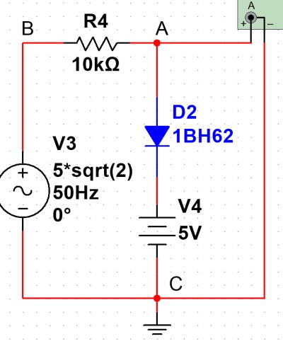

# 基础电路分析
## 基尔霍夫定律
对于任何复杂的电路 (半导体 / 电容, 电感), 基尔霍夫定律依然成立

### KVL
对于任意回路, 回路上各元件的电压之和为 0

### KCL
对于任意结点, 包括广义节点, 流入结点的电流等于流出结点的电流

## 等效电路
### 等效的含义
1. 等效电路并不是替代, 而是将一个复杂的二端口的电路等效为一个由电源与电阻组成的电路
1. 等效前后的电路的端口具有完全相同伏安特性
1. 但两个等效电路的内部没有任何关系, 不能用于计算

### 纯电阻等效
1. 串联电阻等效为电阻之和
1. 并联电导等效为电导之和, 即导数关系

### 理想电源
1. 与理想电流源==串联==的任何元件均可等效为单个理想电流源, 即串联电路电流相同
1. 与理想电压源==并联==的任何元件均可等效为单个理想电压源, 即并联电路电压相同
1. 理想电压源与电阻串联可等效为理想电流源与电阻并联, 满足 $$I_sR=U_s,\;R_i=R_u=R$$

### 开路的处理
1. 将开路部分视为一个元件, 由于导线被截断, 不可能有电流传输, 因此可将开路视为一个 $I=0$ 的理想电流源
1. 对外分析时, 可将开路所在支路完全等效为断开
1. 对内分析时
    1. 由于没有电流, 串联电阻上电压必定为 $0$
    1. ==当支路内有电压源, 则需要==使用 KVL 或结点分析法==具体分析开路两端的电压==
1. 对于以下情况可以视为开路
    1. 计算电路的输出电压
    1. 二极管反向截止
    1. 直流稳态电路中电容
    1. 电压表 / 示波器端口

#### 分析实例

假设二极管 $D2$ 反向截止, 求示波器 $A$ 的电压
1. 由于二极管 $D2$ 反向截止, 视为开路
1. $AC$ 段与示波器无关, 以此可以整条支路视为开路
1. 剩余回路中, 三个元件为串联关系, 示波器 $A$ 为开路, 以此电阻上分压为 $0$
1. 使用 $KVL$ 可得, 示波器 $A$ 上的电压与电源相同

### 短路的处理
1. 将短路部分视为一个元件, 可以认为是一个 $0\Omega$ 电阻, 不可能有电压, 因此可将短路视为一个 $U=0$ 的理想电压源
1. 对外分析时, 可将与短路并联的支路同样视为短路
1. 对内分析时
    1. 由于没有电流, 并联电阻上电流必定为 $0$
    1. 当并联支路内有电流源, 则需要使用 KCL 具体分析短路上的电压

## 电路分析方程
### 结点方程
#### 快速法
1. 即对结点使用 $KCL$
1. 通过 $\Delta U_{结点}\cdot R_{支路}$ 表示非电流源支路的电流
1. 可以对单个结点使用, 快速分析结点的电压

#### 整体法
1. 将电路化为最简, 并且将电压源等效为电流源 (否则两个串联的元件之间有一个结点)
1. 确定结点电导矩阵 $G$
    1. 标定电路图上的结点, 并为结点标号, 并选择接地点
    1. 以结点相连各支路的==电导== (电阻倒数) 之和为自电导 $G_{nn}$
    1. 相邻结点之间的电导为互电导 $G_{nm}$, 因此最终可以得到一个对称矩阵
1. 确定电流源列向量 $I_s$, 流入结点的电流源取正
1. 未知数为结点电压向量 $U={U_i}$, 得到方程 $$GU=I_s$$

### 网孔方程
#### 整体法
1. 将电路化为最简, 并且将电流源等效为电压源 (否则两个并联的元件之间有一个网点)
1. 确定网孔电阻矩阵 $R$
    1. 标定电路图上的网孔, 并为网孔标号, 确定网孔电流方向
    1. 以网孔上所有元件的==电阻==之和为自电阻 $R_{nn}$
    1. 相邻网孔之间的支路上的电阻为互电阻 $R_{nm}$, 因此最终可以得到一个对称矩阵
1. 确定电流源列向量 $U_s$, 与网孔电流为非关联的电压源取正
1. 未知数为网孔电流向量 $I={I_i}$, 得到方程 $$RI=U_s$$

### 在非线性电路的应用
1. 根据替代定理, 当知道支路的电压后, 可将其视为电压源处理 (用于处理半导体)
1. 复杂电路通常使用结点法表示电压 $V$, 可用快速法列写部分结点方程 (不适合整体使用)
1. 复杂电路通常使用电压源, 因此适合使用网孔方程对整体分析

## 储能元件
### 电容
电容满足 $$i=C\frac{du}{dt}$$

#### 电容的阻抗
$$Z=\frac{1}{2\pi fCj}$$
* 对于直流电, 认为 $f=0$, 因此电容体现为无限大的电阻
* 对于交流电, 频率位于分母, 因此频率越大, 等价阻抗越小
* 虚数单位位于分母, 因此电容还有使相位顺时针移动 $90^\circ$ 的效果

# 放大电路
## 基本放大电路的分类
### 共发射极放大电路
* 最基本的放大电路
* 输入与输出的信号反相

### 分压式偏置放大电路
* 相比一般放大电路, 具有稳定的静态点
* 输入与输出的信号反相

### 射极输出器
* 几乎无法放大信号
* 输入电阻极大, 输出电阻极小, 用于中间层

## 符号表达
### 静态分量
* $I_B$
### 交流分量
* 瞬时值 $i_b$
* 相量 $\dot{I_b}$
### 总量
* 瞬时值 $i_B$

## 通路转换
### 直流通路
1. 用于计算静态值
1. 认为电容为断路
1. 认为没有信号输入

### 交流通路
1. 用于计算放大倍数
1. 认为电容为短路
1. 认为没有直流电源, 将直流电压认为是接地
1. 三极管转化为一个受控源 $i_c=\beta i_b$ 与 $r_{be}\approx 200\Omega+(1+\beta)\frac{26(mA)}{I_E(mA)}$
1. 计算时多采用相量的形式

## 基本放大电路相关计算
### 通用注意
1. 计算前可以先将并联 / 串联的电阻等效为一个电阻

### 静态点计算
1. 均需要考虑 $U_{BE}\approx 0.7V$ 的影响
1. 均从 $I_B/V_B$ 的计算入手, 如果有 $I_E$ 则带入 $I_E=(1+\beta)I_B$
1. 均采用近似 $I_C\approx I_E$, 与 $I_B$ 的关系取决于计算 $U_{CE}$ 时采用的值, 通常用于计算 $U_{CE}$ 的采用准确关系 (一般 $I_C$ 优先)
1. 通常选择一条由 $U_{CC}$ 到 $GND$ 的支路, 使用 $KVL$ 计算

### 输入电阻
1. 以信号源与信号源内阻为两端, 计算放大电路其他部分在这两端的等效电阻
1. 将信号源部分移去, 假设加有电压 $\dot{U_i}$, 计算相应的 $\dot{I_i}$, 可得到 $r_i=\frac{\dot{U_i}}{\dot{I_i}}$
1. 注意 $\dot{U_i}$ 与 $\dot{I_i}$ 为非关联方向 (模拟电源)
1. 当输出端有负载 $R_L$ 时要考虑 (对于放大电路不会有影响)
1. 输入电阻越大越好, 表明了放大电路捕捉信号的能力

### 输出电阻
1. 以负载为两端, 计算放大电路其他部分在这两端的等效电阻
1. 计算等效电阻时需要==置零所有的理想电源== (对于放大电路, 此时 $\dot{I_b}=0$)
1. ==将负载移去==, 假设加有电压 $\dot{U_o}$, 计算相应的 $\dot{I_o}$, 可得到 $r_o=\frac{\dot{U_o}}{\dot{I_o}}$
1. 注意 $\dot{U_o}$ 与 $\dot{I_o}$ 为非关联方向 (模拟电源)
1. 当输入端有内阻 $R_S$ 时要考虑 (对于放大电路不会有影响)
1. 输出电阻越小越好, 表明了放大电路提供信号的能力

### 放大倍数
1. 分别使用 $\dot{I_b}$ 表示 $\dot{U_o}$ 与 $\dot{U_i}$, 即可得到 $Au=\frac{\dot{U_o}}{\dot{U_i}}$
1. 注意放大电路一般 $Au<0$
1. 注意射极输出器一般 $Au\approx 1$
1. 通常需要用到负载 $R_L$
1. 注意计算内阻时电源置零, 但计算放大倍数时不置零

### 多级电路计算
1. 负载电阻大小为下一级的输入电阻 $R_{Ln}=r_{in+1}$
1. 信号内阻大小为上一级的输出电阻 $R_{Sn}=r_{on-1}$
1. 通常一般放大电路的等效电阻可以避开与上下级的关联, 因此可以单独计算
1. 放大倍数一定会用到 $R_L$, 因此要先计算 $r_{in}$ 才能计算 $Au$
1. 总放大倍数 $Au=Au_1Au_2...Aun$
1. 总内阻满足 $r_i=r_{i0}$, $r_o=r_{on}$
1. 计算前需要先明确划分各级电路, 划分的两端即用于计算等效电阻的端口, 外部属于负载 / 内阻
1. 如果出现功能重叠的电阻, 则根据题目的标号划分, 并在计算时, 如果没有发挥作用则排除

## 差分放大电路
* 通过对称结构消除零点漂移
* 具有两个输入与两个输出, 通常将一个输出作为正极, 另一个作为负极

### 静态分析
1. 静态分析时, 仅需要关注一侧即可, 两侧对称
1. 认为差分放大电路的 $I_B\ll I_E=I_C$, $U_{BE}\approx 0$, 因此从 $u_{I1}$(此时视为地) 到 $-V_{EE}$ 的通路上, $V_{EE}$ 完全加在 $R_e$ 上
1. 注意, 有两个相同的 $I_E$ 流过 $R_e$, 因此 $V_{EE}=2I_ER_e$
1. 采用 $I_B=\frac{I_C}{\beta}=\frac{I_E}{\beta}$

### 双端输入动态分析
1. 仅当差模输入 $u_{i1}=-u_{i2}$ 时能够放大, 共模输入输出 $0$ (对称)
1. 分析时仅分析一侧, 另一侧对称
1. 由于差模输入, 因此 $i_{E1}=-i_{E2}$, $i_E=0$, 可以忽略 $R_E$ 的影响
1. 晶体管的转化放大与其他放大电路相同
1. 当存在负载时 $R_L$ , 根据对称性, 可将负载分为两个 $R'_L=\frac{1}{2}R_L$, 中间接地

### 双端输入计算
1. 分析单侧电路时, 采用 $Ad=\frac{u_{o1}}{u_{i1}}$
1. 分析总体时, 认为输入为 $u_i=u_{i1}-u_{i2}=2u_{i1}=-2u_{i2}$, 输出分为单侧 $u_{o1}$ 与双侧 $u_o=u_{o1}-u_{o2}=2u_{o1}=-2u_{o2}$
1. 因此对于不同侧的单侧输出与单侧双侧输出的放大倍数 $Au$ 均不同
1. 计算输入电阻时, 假设单侧加有电压 $\frac{1}{2}u_i$ (与一般不同)
1. 计算输出电阻时, 单侧输出则假设单侧输出端有电压 $u_o$, 否则假设单侧输出端有电压 $\frac{1}{2}u_o$

### 一般输入计算
1. 不可以直接分析一般输入, 因为差模输入采用了忽视 $R_E$ 的假设
1. 可将一般输入分为差模部分 $u_d$ 与共模部分 $u_e$, 因此有 $u_{i1}=u_e+u_d$, $u_{i2}=u_e-u_d$
1. 差模放大电路仅放大差模部分 $u_d$, 并且动态特性与差模输入时完全相同
1. 对于单端输入即一般输入的极端情况, 即 $u_e=u_d=\frac{1}{2}u_i$, 因此特性依然不变

<!-- ## 场效应晶体管 -->

# 运算放大器
## 理想运算放大器

### 元件特性
1. 放大倍数 $Au\to\infty$
1. 差模输入电阻 $r_{id}\to\infty$, 因此输入电流 $i_+\approx i_-\approx 0$, 称为虚断
1. 开环输出电阻 $r_o\to 0$
1. 注意运算放大器为有源元件, 正常工作还需要有电源 $V_CC$ 与接地 $GND$, 只是图例上没有表示
1. 虽然放大倍数极大, 但是最大输出电压 $U_{O(sat)}\approx V_{CC}-2V$
1. 根据是否达到最大输出电压, 分为线性区与饱和区
1. 线性区中, 输入电压被放大, 满足 $u_o=Au\cdot u_i\to u_i\approx 0\to u_+\approx u_-$, 称为虚短, 仅在线性区成立, 通过反馈电阻 $R_f$ 实现扩大线性区

### 线性区计算方法
1. 根据虚断 $i_+\approx i_-\approx 0$, 使用 $u_o$ 与 $u_in$ 表示 $u_+$ 与 $u_-$
1. 根据虚短 $u_+\approx u_-$, 联立得到的表达式, 解出 $u_o$
1. 平衡条件: 由于运算放大器的第一级为差分放大电路, 根据对称性要求, 在静态情况下 (各信号端均为地), 两个输入端与地之间的电阻应相同
1. 注意电流与电压的参考方向, 最好以电流方向的压降计算, 可根据反向接 $u_-$ 的原则检查结果

## 运算电路设计
### 设计原则
1. 两个输入端与地之间的电阻应相同, 保证平衡条件
1. 当输入与输出信号相反时 (在输出结果中系数为负数), 应接入 $u_-$ 端, 否则接入 $u_+$ 端
1. 必须有反馈电阻 $R_f$, 并且通过 $R_f$ 连接 $u_-$ 端与 $u_o$ 端

### 线性运算电路

1. 设计电路前首先确定 $R_F$
1. 接在反馈电阻一侧的信号源为反相输出, 记为 $U_{inx}$, 电阻记为 $R_{inx}$, 根据系数满足 $R_{inx}=R_F/n_x$
1. 接在 $GND$ 一侧的信号源为同相输出, 记为 $U_{ipx}$, 电阻记为 $R_{ipx}$, 根据系数满足 $R_{ipx}=R_F/p_x$
1. 最后确定平衡电阻 $R_b=R_F/(1-\sum p_x+\sum n_x)$
1. 平衡电阻不可为负数, 因此 $1-\sum p_x+\sum n_x>0$

#### 特殊变形
1. 当所有 $U_{ipx}=0$, 即得到反相加法电路
1. 当没有正相输入的信号, 即正相输入接地, 即虚地, 可以使通过 $R_F$ 的电流不变
1. 仅有正相或反相时, 可以令对应系数为 $0$, 或将地作为输入信号, 以保证条件 $1-\sum p_x+\sum n_x>0$ 成立
1. 当 $R_b\to\infty$, 表明 $1-\sum p_x+\sum n_x=0$, 依然成立
1. 当 $R_b\to\infty$, 且仅有一个正相输入时, 即为输出跟随器, 放大倍数必定为 $1$

# 电路中的反馈
## 电路快速判断
### 电压
当一个节点的电压下降时, 此节点到其他任何固定电压的节点 (地, 虚短, 电压源) 的通路上的节点的电压均会下降

### 电流
* 当电阻一侧的电压上升, 另一侧不变时, 则有电压上升一侧向不变一侧电流增加, 反之, 电流增加, 电流来源一侧电压增大
* 对于一个节点, 当仅有两条支路电流发生变化 (其他支路两侧电压不变), 则当其中一条电流流入增加, 另一条必定流出增加

