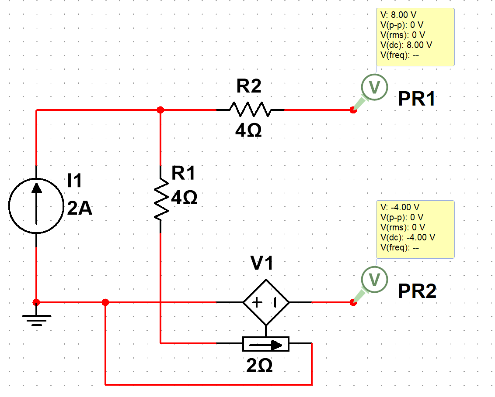
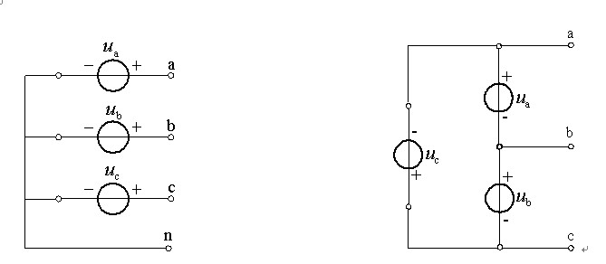
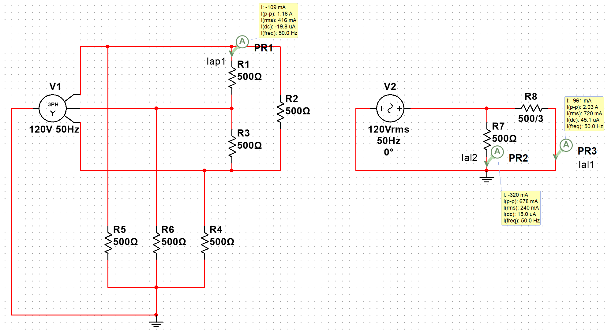
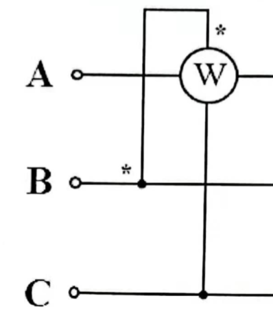

# 易错
## 等效电阻
1. 计算等效电阻时要将电源置零
2. 置零后使用节点法时注意检查, 电压源置零后为短路, 节点可能减少

## 开路电压(等效电压)
1. 计算开路电压时, 不能因为两条与端口相连的支路上没有构成回路就忽视. ==如果此支路上存在电压/电流源(受控源)要考虑, 并且通过 KVL 计算开路电压==
eg. 端口支路存在电压源/电流源后, 与地线的电压不为零 

## 正弦稳态
1. 阻抗 $X$ 一定大于零, $Z$ 相位角一定在 $-90^{\circ}<\theta<90^{\circ}$ 范围内
2. 结合 1, 当仅电量的模长已知时, 可通过 KCL/KVL 结合相量图, 提前求出电量的方向
3. 相量的模长为有效值, 直接使用其 $x$ 方向投影无意义 

### 三相电路
1. 两表法测功率中, $P_1\neq P_2$, $$P_1=Re[\dot{U}_{ac}\overline{\dot{I}}_{a}]\neq P_2=Re[\dot{U}_{bc}\overline{\dot{I}}_{b}]$$
    1. 注意 $\dot{U}_{ac}$ 为 $C$ 的线电压
    2. 根据接线的位置不同, 公式中 $a$ 表示瓦特表所在相, $c$ 表示瓦特表引出端相
    3. 当公式中出现 $\dot{U}_{ac}$ 其值与 $\dot{U}_{ca}$ 相反, $\dot{U}_{ac}=-\dot{U}_{ca}=-\dot{U}_{ab}\angle 120^{\circ}$
2. 做题前明确题目中给出的是相电压还是线电压
3. 三相电路的功率公式中, $\phi$ 通过 $\dot{U}_{p}$ 与 $\dot{I}_{l}$ 的夹角得到, $$P=\sqrt{3}\dot{U}_{l}\dot{I}_{l}cos(\phi)\neq \sqrt{3}Re[\dot{U}_{l}\bar{\dot{I}}_{l}]$$
4. 单相法中, $\Delta$ 负载中的电流等价于 $\Delta$ 电路中的线电流转相电流公式, 但不是相电流. ==$Y-Y$ 电路中, 相线电流相同==

# 暂态电路
## 电容
$$i=C\frac{dU}{dt}$$

### u-i 关系
$$u(t)=\int_{-\infty}^{t}\frac{idt}{C}=u(0^-)+\int_{0^-}^{t}\frac{idt}{C}$$
* 注意 $u(t)$ 的值域为全体实数, 且通常为分段函数

### 电容储能
$$w(t)=\frac{1}{2}Cu^2(t)$$

### 电容串并联
1. 串联 类似电阻并联
2. 并联 类似电阻串联

## 电感
$$u=L\frac{di}{dt}$$

### u-i 关系
$$i(t)=\int_{-\infty}^{t}\frac{udt}{C}=i(0^-)+\int_{0^-}^{t}\frac{udt}{C}$$

### 电容储能
$$w(t)=\frac{1}{2}Li^2(t)$$

### 电容串并联
1. 串联 类似电阻串联
2. 并联 类似电阻并联

## 暂态电路初始值
### 稳态电容与电感
1. 认为 $t=0^-(换路前),+\infty(换路后)$ 为稳态
2. 稳态下, 电容相当于开路
3. 稳态下, 电感相当于短路

### 换路定理
1. 当开关闭合/打开时, 电容电压与电感电流不会突变
$$u_C(0^-)=u_C(0^+)$$ $$i_L(0^-)=i_L(0^+)$$
2. 因此可以将换路后的电容视为电压源, 电压为换路前的开路电压
3. 可以将换路后的电感视为电流源, 电流为换路前的短路电流

## 暂态电路
1. 零输入响应 指放电过程中没有电源输入
2. 零状态响应 指开关闭合前元件没有储存能量
3. 全响应即两种响应的叠加
4. 注意时间范围
5. 对于电容, 使用公式前, 先以电容为端口, 将跳变后的电路等效为戴维南支路, 时间常数的 $R$ 即等效电路的电阻, $u(+\infty)$ 即等效电压源
6. 对于电感, 同电容, 等效为诺顿支路
### 电容
1. 零输入响应 $$u_C(t)=u_C(0)e^{\frac{-t}{RC}}(t>0)$$
2. 零状态响应 $$u_C(t)=u_C(+\infty)(1-e^{\frac{-t}{RC}})(t>0)$$
3. 全响应 $$u_C(t)=u_C(0)e^{\frac{-t}{RC}}+u_C(+\infty)(1-e^{\frac{-t}{RC}})(t>0)$$
4. 时间常数 $$\tau=R_{eq}C$$

### 电感
1. 零输入响应 $$i_L(t)=i_L(0)e^{\frac{-t}{LG}}(t>0)$$
2. 零状态响应 $$i_L(t)=i_L(+\infty)(1-e^{\frac{-t}{RC}})(t>0)$$
3. 全响应 $$i_L(t)=i_L(0)e^{\frac{-t}{LG}}+i_L(+\infty)(1-e^{\frac{-t}{RC}})(t>0)$$
4. 时间常数 $$\tau=LG_{eq}$$
5. 注意电感放电时电路中 $u$ 方向的变化

# 正弦稳态电路
## 相量法
### 正弦电量
$$u=U_m cos(\omega t+\phi)$$
1. $u$ 瞬时值
2. $U_m$ 最大值
3. $\omega$ 角频率
4. $\phi$ 初相位
5. $U=\frac{U_m}{\sqrt{2}}$ 有效值(电表测量结果)

### 相量法
$$\dot{U}=U\angle\phi$$
1. 相量中实部使用的是有效值, ==转成瞬时值需要化为最大值==
2. 使用相量的实部体现瞬时值
3. 基尔霍夫定律依然满足, 但需要使用相量计算

#### 相量分析法
1. 通过画图, 结合相量之间的几何关系解题
2. 分析前选择一个相量为参考, 令其相位角为 $0^\circ$
3. 参考向量选择
    1. 电路已知条件最多的部分
    2. 在电路最内部
    3. 电阻上的 $\dot{I}$(串) 或 $\dot{U}$(并)

## 阻抗
### 元件阻抗
#### 电阻
$$Z=R$$

#### 电感
$$Z=j\omega L$$

#### 电容
$$Z=\frac{1}{j\omega C}$$

### 阻抗性质
1. $$\dot{U}=\dot{I}Z$$
2. 阻抗依然满足串联与并联
3. 感性阻抗 $\phi>0$, $\dot{U}$ 超前
4. 容性阻抗 $\phi<0$, $\dot{U}$ 滞后
5. 由 1 得阻抗角度也体现 $\dot{U}$ 与 $\dot{I}$ 的夹角

## 功率
1. 功率计算所用到的均为有效值
2. 由功率求得 $U$, $I$ 后还需转化为相量
3. 公式中均使用参考方向
4. 除视在功率均满足功率守恒

### 有功功率
1. $$P=UIcos(\phi_U-\phi_I)$$
2. 单位 $W$

### 无功功率
1. $$Q=UIsin(\phi_U-\phi_I)$$
2. 单位 $var$

### 复功率
1. $$\bar{S}=P+jQ=ZI^2=\dot{U}\overline{\dot{I}}$$
2. 单位为 $V\cdot A$
3. 元件复功率相位角即阻抗相位角

### 视在功率
1. $$S=UI$$
2. 单位为 $V\cdot A$
3. $$S=\sqrt{P^2+Q^2}$$
4. 视在功率不满足功率守恒

### 功率因数
1. $$\lambda=\frac{P}{S}=cos(\phi_U-\phi_I)$$
2. 功率因数即阻抗角的余弦值
3. 阻抗角可能取正或负, 通过成感性(正)/容性(负)确定

### 功率因数矫正
1. 前提: 不改变负载的工作状态(电压)
2. 通过并联电容, 提高端口的功率因数
3. 分析时令 $\dot{U}$ 的相位为 $0$, 则 $\dot{I}$ 的相位为 $-\phi$
4. 向 $y$ 轴方向投影 $\dot{I}$, 比较其与目标功率因数下投影大小的差值(仅增加电容, $x$ 方向投影不会改变)
5. 由于并联分流, 因此此差值即矫正电容分压大小(端口电压不变)

### 最大功率传输
1. 当负载阻抗与网络戴维南支路的等效阻抗满足共轭关系时, 负载获得的功率最大 $$Z_L=\overline{Z_{eq}}$$
2. 最大有功功率为 $$P_{Lmax}=\frac{U_{oc}^2}{4R_{eq}}$$
其中 $U_{oc}$ 为等效电路的电压源有效值, ==$R_{eq}$ 为等效阻抗的实部==
3. 当负载为纯电阻时, 获得最大功率的条件为 $$R_L=|Z_{eq}|$$

# 三相电路

1. 对称三相电压中, 满足 $\dot{U}_A+\dot{U}_B+\dot{U}_C=0$
2. $\dot{U}_A,\dot{U}_B, \dot{U}_C$ 按==顺时针==顺序以 $120^{\circ}$ 夹角排列
3. 相电压 $U_{xp}$ 仅含 $x$ 与中性点 $N$ 的电压, 因此也可写成 $U_{AN}$
4. 线电压 $U_{xl}$ $x$ 与 $y$(下一相) 对应节点之间的电压, 因此也可写成 $U_{AB}$
5. 相电流 $I_{xp}$ 线电流在 $U_{xl}$ $x$ 与 $y$(下一相) 的 $x$ 分流电流中
6. 线电流 $I_{xl}$ $x$ 端口上的总电流

## 星形联结(Y形)
1. 相线电压满足关系 $$\dot{U}_{xl}=\sqrt{3}\dot{U}_{xp}\angle{30^{\circ}}$$
2. 相线电流相同(区分无意义)

## 三角形联结($\Delta$形)
1. 相线电压相同(区分无意义)
2. 相线电流满足关系 $$\dot{I}_{xl}=\sqrt{3}\dot{I}_{xp}\angle{-30^{\circ}}$$
3. 三角形联结中, 电压源正负极首尾相接, 按顺时针顺序排列

## 分相计算
此处公式仅适用于对称电路, 此时三相的电流电压关系完全相同, 负载大小相同

### Y-Y
1. 取出其中一相与中性点构成回路, 计算此回路中的电量
2. 无论中性点上电阻取何值(短路或开路), 中性点上电流为 0, 且为等势点
3. 单相中与中性点之间的电压 $U_{aN}$ 即单相上结点的相电压
4. 通过公式转换即可得到线电压(不同相之间对应节点的电压) $U_{ab}$(或已知线电压, 计算相电压)
5. 单相中的电流即线电流, 对于 Y形 电路, 区分无意义
6. 等效回路中两个非中性点之间的电压无法转换(无意义)

### Y-$\Delta$
1. 通过将 $\Delta$ 形负载转化为等效的 $Y$ 形负载
2. 由于负载对称, 满足关系 $$Z_{L\Delta}=\frac{1}{3}Z_{LY}$$
3. 通过单个负载的电流计算公式等价于相电流的转换公式, ==对于 $Y$ 型电源, 其相电流等于线电流==
eg. 
此电路中, 等效单相回路为两个负载并联, 且 $\Delta$ 负载上的电流为线电流 $I_{al1}$ , 单个负载上通过的实际电流为相电流 $I_{ap1}$, 计算时需要转换

### $\Delta$-$\Delta$
1. 将$\Delta$ 形负载转化为等效的 $Y$ 形负载, 再将 $\Delta$ 形电压源转化为等效的 $Y$ 形电压源
2. $\Delta$ 形电压源中的单相电压即线电压(电压源均在两个端口之间), 将其转为相电压即可使用分相法计算

## 对称三相电路的功率
### 功率公式
1. 与一般正弦电路功率不同, ==三相电路的总功率为== $$P=3U_{p}I_{p}cos\phi=\sqrt{3}U_{l}I_{l}cos\phi$$
2. 其他类型功率的计算类似, 均使用 $3U_{p}I_{p}$ 或 $\sqrt{3}U_{l}I_{l}$
3. 功率因数, 其中 $\phi$ 为负载阻抗角 $$\lambda=cos\phi=\frac{P}{S}$$
4. 由于三相对称, 因此单相功率即 $$P_{单}=U_{p}I_{p}cos\phi$$

### 计算注意
1. 由于 $Y$ 型电路中 $I_l$ 与 $I_p$ 等价, 因此分相法中可直接使用 $P=3U_{p}I_{l}cos\phi$(不能直接对 $\Delta$ 负载使用)
2. 分相法中的欧姆定律 $$\dot{U}_p=Z\dot{I}_l$$
3. 题目中的电机功率均为三相总功率, 注意区分总功率(默认, 需要乘上系数)与单相功率

### 三相电路功率测量

1. 瓦特表无星号线测量的是电流流出端 / 电压负极

#### 三瓦特表法

1. 用于测量四线制三相电路 $P=P_1+P_2+P_3$, 如果对称则 $P_1=P_2=P_3$
2. 瓦特表的引出线接在 $N$ 上

#### 两瓦特表法 

1. 用于测量三线制三相电路, 或对称线制三相电路, $P=P_1+P_2$, $P_1\neq P_2$
2. 瓦特表的引出线接在无瓦特表的相上
3. $$P_1=Re[\dot{U}_{ac}\overline{\dot{I}}_{a}]\neq P_2=Re[\dot{U}_{bc}\overline{\dot{I}}_{b}]$$

## 非对称三相电路

电源对称时可使用以下方法:

1. 有无负载的中性线 $N$ 时, 仍可用分相法, 但三相要单独计算
2. 其他情况可用节点分析法, 以 $N$ 为接地点
3. 线相电压转换关系依然满足
