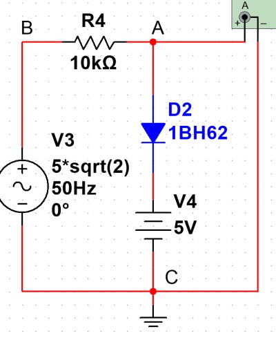
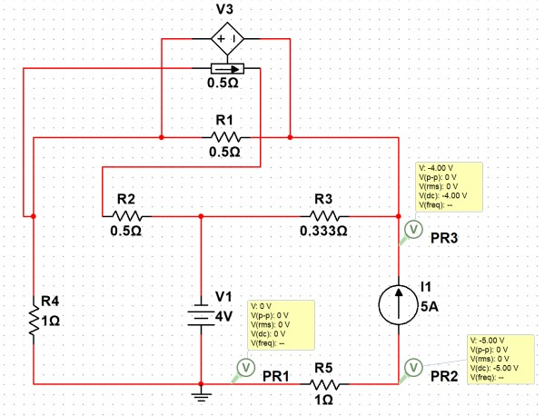
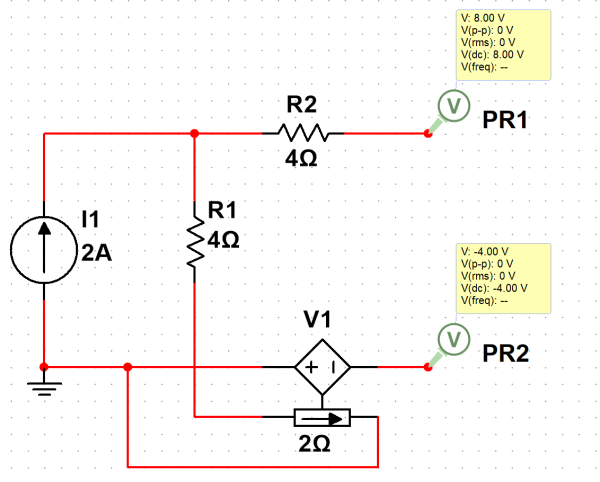

# 基础电路分析
## 基尔霍夫定律
对于任何复杂的电路 (半导体, 电容, 电感), 基尔霍夫定律依然成立

### KVL
对于任意回路, 回路上各元件的电压之和为 $0$

### KCL
对于任意结点, 包括广义节点, 流入结点的电流等于流出结点的电流

## 等效电路
### 等效的含义
1. 等效电路并不是替代, 而是将一个复杂的二端口的电路等效为一个由电源与电阻组成的电路
1. 等效前后的电路的端口具有完全相同伏安特性
1. 但两个等效电路的内部没有任何关系, 不能用于计算

### 纯电阻等效
1. 串联电阻等效为电阻之和
1. 并联电导等效为电导之和, 即导数关系

### 理想电源
1. 与理想电流源==串联==的任何元件均可等效为单个理想电流源, 即串联电路电流相同
1. 与理想电压源==并联==的任何元件均可等效为单个理想电压源, 即并联电路电压相同
1. 理想电压源与电阻串联可等效为理想电流源与电阻并联, 满足 
$$I_sR=U_s,\;R_i=R_u=R$$

### 开路的处理
1. 将开路部分视为一个元件, 由于导线被截断, 不可能有电流传输, 因此可将开路视为一个 $I=0$ 的理想电流源
1. 对外分析时, 可将开路所在支路完全等效为断开
1. 对内分析时
    1. 由于没有电流, 串联电阻上电压必定为 $0$
    1. ==当支路内有电压源, 则需要==使用 $KVL$ 或结点分析法==具体分析开路两端的电压==
1. 对于以下情况可以视为开路
    1. 计算电路的输出电压
    1. 二极管反向截止
    1. 直流稳态电路中电容
    1. 电压表 / 示波器端口

#### 分析实例

假设二极管 $D2$ 反向截止, 求示波器 $A$ 的电压
1. 由于二极管 $D2$ 反向截止, 视为开路
1. $AC$ 段与示波器无关, 以此可以整条支路视为开路
1. 剩余回路中, 三个元件为串联关系, 示波器 $A$ 为开路, 以此电阻上分压为 $0$
1. 使用 $KVL$ 可得, 示波器 $A$ 上的电压与电源相同

### 短路的处理
1. 将短路部分视为一个元件, 可以认为是一个 $0\Omega$ 电阻, 不可能有电压, 因此可将短路视为一个 $U=0$ 的理想电压源
1. 对外分析时, 可将与短路并联的支路同样视为短路
1. 对内分析时
    1. 由于没有电流, 并联电阻上电流必定为 $0$
    1. 当并联支路内有电流源, 则需要使用 $KCL$ 具体分析短路上的电压

## 电路分析方程
### 结点方程
#### 快速法
1. 即对结点使用 $KCL$
1. 通过 $\Delta U_{\text{结点}}\cdot R_{\text{支路}}$ 表示非电流源支路的电流
1. 可以对单个结点使用, 快速分析结点的电压

#### 整体法
1. 将电路化为最简, 并且将电压源等效为电流源 (否则两个串联的元件之间有一个结点)
1. 确定结点电导矩阵 $G$
    1. 标定电路图上的结点, 并为结点标号, 并选择接地点
    1. 以结点相连各支路的==电导== (电阻倒数) 之和为自电导 $G_{nn}$
    1. 相邻结点之间的电导为互电导 $G_{nm}$, 因此最终可以得到一个对称矩阵
1. 确定电流源列向量 $I_s$, 流入结点的电流源取正
1. 未知数为结点电压向量 $U={U_i}$, 得到方程 
$$GU=I_s$$

### 网孔方程
#### 整体法
1. 将电路化为最简, 并且将电流源等效为电压源 (否则两个并联的元件之间有一个网点)
1. 确定网孔电阻矩阵 $R$
    1. 标定电路图上的网孔, 并为网孔标号, 确定网孔电流方向
    1. 以网孔上所有元件的==电阻==之和为自电阻 $R_{nn}$
    1. 相邻网孔之间的支路上的电阻为互电阻 $R_{nm}$, 因此最终可以得到一个对称矩阵
1. 确定电流源列向量 $U_s$, 与网孔电流为非关联的电压源取正
1. 未知数为网孔电流向量 $I={I_i}$, 得到方程 
$$RI=U_s$$

### 在非线性电路的应用
1. 根据替代定理, 当知道支路的电压后, 可将其视为电压源处理 (用于处理半导体)
1. 复杂电路通常使用结点法表示电压 $V$, 可用快速法列写部分结点方程 (不适合整体使用)
1. 复杂电路通常使用电压源, 因此适合使用网孔方程对整体分析

## 例题
### 结点方程应用

求如图所示电路中两个独立理想电源发出的功率 (题中 $S$ 为电导单位, 满足 $a\Omega=\frac{1}{a}S$)

#### 电路分析

1. 电路等效
    * 电路中理想电流源 $5A$ 与 $1S$ 的电阻串联, 因此可以等效为仅有理想电流源 $5A$
    * 电路中理想受控电压源 $0.5i$ 与 $2S$ 的电阻并联, 因此可以等效为仅有理想受控电压源 $0.5i$
1. 结点划分
    * 将理想电压源 $4V$ 的一端结点定位参考地 $GND$ 结点, 避免广义节点计算
    * 剩余三个结点按顺序标号
    * 注意到理想受控电压源 $0.5i$ 没有与电阻相连, 因此在公式中需要使用广义节点处理
1. 最后得到如图所示的等效电路

#### 结点方程求解
根据等效电路写出结点方程
$$\begin{bmatrix}1+2&3&-2-3\\
1&-1&0\\
0&0&1\end{bmatrix}
\begin{bmatrix}u_1\\u_2\\u_3\end{bmatrix}=
\begin{bmatrix}5\\0.5i\\-4\end{bmatrix}$$

* 方程的第一二行为结点 $1,2$ 组成的广义结点方程
* 对于节点 $3$, 其通过理想电压源与参考地相连, 因此其电压已经确定, 对应方程三
* 由于方程中存在受控源, 因此还需要通过结点电压, 补充受控源方程 (支路电流可通过两侧节点电压差与支路电阻计算)
$$i=2(u_1-u_3)$$

解得结点电压
$$\begin{cases}u_1&=-1V\\u_2&=-4V\\u_3&=-4V\end{cases}$$

#### 题目求解
对于理想电压源 $4V$, 其所在支路的电流无法直接得到, 需要对结点 $3$ 使用 $KCL$ 计算, 有
$$\begin{split}i_{4V}&=2(u_1-u_3)+3(u_2-u_3)\\
i_{4V}&=6A\end{split}$$

$i_{4V}$ 方向与理想电压源之间为非关联方向, 因此有
$$P_{4V}=4\cdot i_{4V}=24W$$

---

对于理想电流源 $5A$, 由于分析时使用了等效电路, 因此==分析其实际情况时, 必须在等效电路内分析==  
等效电路内有如图所示的电路

通过 $KVL$ 求解电流源的电压
$$\begin{split}5\cdot 1-u_{5A}+(u_2-0)&=0\\
u_{5A}&=1V
\end{split}$$

因此电流源功率满足
$$P_{5A}=5\cdot u_{5A}=5W$$

## 易错知识点
### 等效电阻
1. 计算等效电阻时要将电源置零
2. 置零后使用节点法时注意检查, 电压源置零后为短路, 节点可能减少

### 开路电压(等效电压)
计算开路电压时, 不能因为两条与端口相连的支路上没有构成回路就忽视. ==如果此支路上存在电压/电流源(受控源)要考虑, 并且通过 KVL 计算开路电压==

eg. 端口支路存在电压源/电流源后, 与地线的电压不为零 

