# 流体静力学

当流体之间没有相对运动时, 认为流体静止, 此时可以将流体视为刚体分析, 且==流体中仅存在压力, 而不体现黏性==

认为相对非惯性系静止的流体依然属于静止流体, 但根据达朗贝尔原理可得, 流体中的点受到惯性力

本节中均已静止的不可压缩流体为研究对象

## 流体平衡微分方程

取如图所示的微元流体, 由于流体静止, 因此流体上的受力平衡, 且流体上仅有==压力与质量力==, 沿 $x$ 方向分析时

微元体压力满足 (正负号分别对应面 $2$ 与面 $1$, 注意压力还要乘上面积)
$$F_{px}=p(x\pm\mathrm{d} x/2,y,z)=(p\pm\frac{\partial p}{\partial x}\frac{\mathrm{d}x}{2})\mathrm{d}y\mathrm{d}z$$

微元体上还受到质量力 ($f_x$ 为沿 $x$ 方向上的单位质量力)
$$F_{mx}=f_x\rho\mathrm{d}x\mathrm{d}y\mathrm{d}z=f_x\rho\mathrm{d}V$$

因此有 $x$ 方向的平衡方程

$$\begin{split}F_{mx}+F_{px1}-F_{px2}&=0\\\
f_x\rho\mathrm{d}V-\frac{\partial p}{\partial x}\mathrm{d}V&=0\\
f_x&=\frac{1}{\rho}\frac{\partial p}{\partial x}
\end{split}$$

对 $y,z$ 轴同理, 因此推广到三维有

{#tag2-1 .block_anchor}
$$\mathrm{d}p=\frac{\partial p}{\partial x}\mathrm{d}x+\frac{\partial p}{\partial y}\mathrm{d}y+\frac{\partial p}{\partial z}\mathrm{d}z=\rho(f_x\mathrm{d}x+f_y\mathrm{d}y+f_z\mathrm{d}z)\tag{2.1}$$ 

当已知单位质量力 $\vec{f}$ 的分布后, 对其积分即可得到静止流体的压强 $p$

### 流体平衡微分方程的积分形式

通过引入哈密顿算子, 对于流场中的任意曲线 $\mathrm{d}\vec{l}=(\mathrm{d}x,\mathrm{d}y,\mathrm{d}z)$, 平衡微分方程还可写成如下形式
$$\begin{split}\rho\vec{f}\cdot\mathrm{d}\vec{l}-\vec{\nabla}p\cdot\mathrm{d}\vec{l}&=0\\
\rho\vec{f}\cdot\mathrm{d}\vec{l}&=\mathbf{grand}(p)\cdot\mathrm{d}\vec{l}
\end{split}$$

根据梯度积分与路径无关, 因此对于任意以 $\vec{r_1}$ 为起点, $\vec{r_2}$ 为终点的曲线
$$\int\limits_l\rho\vec{f}\cdot\mathrm{d}\vec{l}=\int_{\vec{r_1}}^{\vec{r_2}}\mathbf{grand}(p)\cdot\mathrm{d}\vec{l}=p(\vec{r_2})-p(\vec{r_1})$$

## 静止流体中的压强分布
### 重力作用下的压强分布
在重力作用下有 $\vec{f}=(0,0,-g)$, 根据式 [$(2.1)$](#tag2-1) 积分后得到重力作用下的压强分布满足
$$p=-\rho gz+C$$

其中积分常数 $C$ 即 $p\big|_{z=0}$ 的压强, 通常将坐标系建立在基准气压 $p_0$ 上, 此时 $C=p_0$

### 非惯性系下的压强分布
假设静止液体在具有加速度 $\vec{a}$ 的非惯性系中, 根据达朗贝尔原理, 流体的质量力为 $\vec{f}=\vec{g}-\vec{a}$

假设 $\vec{a}$ 沿 $x$ 方向, 此时有 $\vec{f}=(-a,0,-g)$, 根据式 [$(2.1)$](#tag2-1) 积分后得到重力作用下的压强分布满足
$$p=-\rho ax -\rho gz+C$$

其中积分常数 $C$ 即 $p\big|_{x,z=0}$ 的压强, 因此求解压强分布时需要先确定原点位置

### 等角速度旋转液体的压强分布

当容器与液体绕 $z$ 轴以角速度 $\omega$ 匀速旋转, 当稳定时液体相对于容器静止, 液体之间的相对距离不变, 因此也可视为静止流体

由于液体绕轴旋转, 因此每个液滴上有向心加速度 $a_n=\omega^2 r$ 并指向圆心

根据达朗贝尔原理, 假设液滴受力平衡, 其上有与向心加速度相反的虚拟力, 对于流体则体现为质量力

除向心加速度产生的虚拟里外, 流体上还有重力, 因此流体中的单位质量力满足
$$\begin{split}\vec{f}&=\vec{g}-\vec{a_n}=(\omega^2 r\sin\theta,\omega^2 r\cos\theta,-g)\\
&=(\omega^2 x,\omega^2 y,-g)\end{split}$$

根据式 [$(2.1)$](#tag2-1) 积分后得到重力作用下的压强分布满足
$$\begin{split}p&=\rho(\omega^2\frac{x^2}{2}+\omega^2\frac{x^2}{2}-gz)+C\\
&=\rho\omega^2\frac{r^2}{2}-\rho gz+C\end{split}$$

其中积分常数 $C$ 为原点压强 $p_0$

由压强分布函数可得, 压强相等的点构成一个旋转抛物面 (等压面), 令 $p=p_0$ 可得对于原点所在的等压面有表达式
$$z=\frac{\omega^2}{g}\frac{r^2}{2}$$

#### 有关解题技巧
对于不可压缩流体, 当流体总量不变时, 流体的总体积不会变化

对于高为 $H$ 底面半径为 $R$ 的封闭容器中的旋转液体, 旋转前空气为圆柱体 $A$, 旋转后为原点所在的旋转抛物等压面与底面围成的曲面锥体 $B$, 因此有关系
$$V_{A}=\pi R^2 (H-h_0)=V_{B}=\int_{0}^{H-z_0}\pi r^2\mathrm{d}z$$

注意在封闭容器中, $z=H$ 时, 原点等压面在 $H$ 处不一定有 $r_H=d/2$

## 静止流体的压强计算

### 相对压强与绝对压强
定义相对压强 $p_g$ (测量 gauge), 即测压器读数得到的压强, 因此也称为测量压强

当 $p_g<0$ 时, 压力值需要使用真空计测量, 因此有真空度定义 $p_v=-p_g$ (真空 vacuum)

定义大气压强 $p_a$ (大气 atmosphere); 当压力表的参考对象不是大气时也使用 $p_b$ (背景 background)

因此物体受到的实际压强 $p$ 为
$$p=p_a+p_g$$

### 压强分布中的等压面
将流体中压强相等的面定义为等压面, 等压面一般为平面, 但也可能是曲面

等压面具有以下性质

1. 等压面上任一点所受的质量力方向与等压面垂直
1. 不同密度的液体之间, 液体与空气的分界面即等压面
1. 认为空气的压强为定值, 此时==液体与空气的分界面上的压强大小等于空气压强==

### 单一液体压强分布求解
对于单一液体, $\rho$ 在液体中不变, 因此可直接对基准建立坐标系, 取 $C=p_0$, 使用[上文得到的结论](#静止流体中的压强分布)

其中基准的压强不一定要是已知量, 因为可能在方程联立中被消去

### 混合液体压强分布求解

根据式 [$(2.1)$](#tag2-1) 可得, $p$ 的积分与路径无关, 因此对于从 $1\to 2$ 的任意曲线 $l_{12}$ 有积分
$$p_2-p_1=\int_{1}^{2}dp=\int\limits_{l_{12}}\rho(f_x\mathrm{d}x+f_y\mathrm{d}y+f_z\mathrm{d}z)$$

当流体中的流体种类不同时, $\rho$ 不是常数无法直接得到积分结果, 此时需要以液体分界面对流体划分

假设路径 $l_{12}$ 从 $p_1$ 所在等压面经过 $n-1$ 个等压面后达到 $p_2$ 所在等压面, 因此有 $\rho_i$ 为等压面中流体密度, ==$h_i=-(z_{i}-z_{i-1})$ 为两个等压面之间的**相对距离**, 以从上到下为正== (与 $g$ 同向), 此时有

$$p_b-p_a=\sum_{i=1}^n \rho_i gh_i=\sum_{i=1}^n -\rho_i g(z_{i}-z_{i-1})$$

将上式中的 $p_a$ 作为基准 $p_0$, $p_b$ 作为两个等压面, 可将公式改写为如下常用形式

{#tag2-2 .block_anchor}
$$p_1+\sum_{i=1}^n\rho_i g(z_{i}-z_{i-1})=p_2+\sum_{j=1}^m\rho_j g(z_{j}-z_{j-1})=C\tag{2.2}$$

* $p_1,p_2$ 可以是相对压强或绝对压强, 但必须使用相同的标准
* $p_0$ 可以任意选择, 通常以最低的已知点或液体表面作为基准
* $z_i$ ==为**基准到**待求面所经过的各个**等压面的距离**, 以**竖直向上为正**== ($z$ 轴正方向) 

#### 例题

密封容器中, 上层为油 $\rho_o=800kg/m^2$, 下层为水 $\rho_w=1000kg/m^2$, 各个液面高度为 $z_1=0.6m,z_2=1.4m,z_3=1.5m$, 求 $p_0-p_a$

取底面 $p$ 为等压面  
由 $p$ 到 $p_0$ 上共有两个液面, 有 $p_0+\rho_w gz_1+\rho_o g(z_3-z_1)=C$  
由 $p$ 到 $p_a$ 上共有一个液面, 有 $p_a+\rho_w gz_2=C$  
联立两个方程可计算得到结果
$$p_0-p_a=\rho_w gz_2-[\rho_w gz_1+\rho_o g(z_3-z_1)]=784Pa$$

## 静止液体在壁面上的总压力
本节均以重力场中的静止流体为讨论对象, 有 $\vec{f}=(0,0,-g)$

注意除了流体对壁面的总压力, 壁面与大气接触部分受到的压力也不可忽视

### 平面壁上的总压力

如图所示, 以水平面为基准建立坐标系, 其中 $x$ 轴与壁面平行, $y$ 轴与等压面相交, 与 $z$ 轴夹角 $<90^\circ$

当平板与水平面夹角为 $\theta$ 时, $y$ 轴与 $z$ 轴之间满足 $y\sin\theta=z$, 因此==平面壁与流体接触部分的总压力==为 (注意图中 $z$ 轴与 $g$ 方向相同)
$$\begin{split}F_1&=\int_A p\mathrm{d}A\\
&=\int_A (\rho g y\sin\theta+p_0)\mathrm{d}A\\
&=\rho g\sin\theta\int_A  y\mathrm{d}A+p_0A\\
\end{split}$$

其中, 对于形心 $y_C$, 积分满足 $y_CA=\int_A  y\mathrm{d}A$, 带入后化简为
$$F_1=\rho g\sin\theta y_CA+p_0A$$

因此==平面壁的总压强等于壁面形心处压强与壁面面积的乘积==

当平面壁另一侧暴露在大气中时, 将受到来自大气的压力 $p_0A$, 此时平面壁的合力为 $F=\rho g\sin\theta y_CA$, 可忽略公式中的大气压项用于计算壁面所受的合力

显然平面壁上的压力相对形心 $y_C$ 的力矩并不为 $0$, 因此壁面的形心作为总压力的作用点时还存在未抵消的力矩. 对于总压力的作用点求法见书 p26

### 曲面壁上的总压力

对于如图所示的**单位宽度**二维曲面壁面的总压力, 壁面上的微元受到压力
$$\mathrm{d}\vec{F}=p\mathrm{d}\vec{A}=(\rho g h+p_0)\mathrm{d}\vec{A}$$

其中 $h$ 为微元深度, 满足 $h=z$ ($z$ 轴与 $g$ 同向)  
假设曲面在 $zx$ 截面上的截线为曲线 $l:z=l(x)$, 则 $x$ 与 $z$ 的关系可根据曲线方程确定

由于曲面为宽度 $w$ 的曲面, 因此单位宽度上的面积微元 $\mathrm{d}\vec{A}=w\cdot\mathrm{d}\vec{l}$  
面积微元为 $\mathrm{d}\vec{A}=(\mathrm{d}A_x,\mathrm{d}A_z)=w\cdot(\mathrm{d}z,\mathrm{d}x)$ (注意面积中的下标表示投影方向)  
因此可分解积分为
$$F_x=\int_{A_x}(\rho g h+p_0)\mathrm{d}A_x=p_0wl_z+\rho g w\int_{l_z}z\mathrm{d}z$$
$$F_z=\int_{A_z}(\rho g h+p_0)\mathrm{d}A_z=p_0wl_x+\rho g w\int_{l_x}l(x)\mathrm{d}x$$

如图所示, 积分 $\int_{l_x}l(x)\mathrm{d}x$ 即 $l$ 与液面围成为曲面四边形的面积 $S_{abcd}$  
积分 $w\int_{l_z}z\mathrm{d}z=wl_z\cdot\frac{l_z}{2}$, 其中 $wl_z$ 即为曲面沿 $x$ 轴的投影 $A_x$, $\frac{l_z}{2}$ 为投影 $A_x$ 的形心 $h_{xC}$

由此推广到任意曲面有
$$F_x=p_0A_x+\rho g h_{xC}A_x$$
$$F_z=p_0A_z+\rho g V$$

其中

* $p_0A$ 项为大气压通过流体传递的压强
    * 当壁面一侧与空气接触, 计算壁面总受力时可以忽略  
    * 忽略右侧项可得空气对壁面的总压强可分解为对壁面沿 $z,x$ 方向投影的压强
* $V$ 为曲面与液面围成的体积, 称为控制体, 忽略 $p_0$ 项有取 $z$ 轴以向上为正
    * 当壁面上方与液体接触时, $F_z$ 的方向为垂直向下, 取 $V$ 为负
    * 当壁面下方与液体接触时, $F_z$ 的方向为垂直向上, 取 $V$ 为正
    * 对于复杂曲面, 可分解为多段, 并对控制体叠加 $V=\sum V_i$
