# 黏性流体动力学
## 黏性流体总流的伯努利方程
### 水头形式的伯努利方程

由于黏性摩擦的存在, 随着流体的流动能量将不断损失, 因此伯努利方程不再成立  
为此在伯努利方程中还需要添加一个摩擦损失项用于修正  
对于黏性流体的研究通常使用[水头形式的伯努利方程](./ch3.md#水头形式的伯努利方程), 以方便地反映出流体在黏性摩擦下的能量损失

$$z_1+\frac{p_1}{\rho g}+\alpha\frac{\bar{v_1}^2}{2g}=z_2+\frac{p_2}{\rho g}+\alpha\frac{\bar{v_2}^2}{2g}+h_w$$

其中项 $h_w$ 即**水头损失**, 反映了流体流动时损失的能量  
如图所示, $h_w$ 可通过管道上两处测压管高度差直观地测量出来

### 水头损失
水头损失 $h_w$ (waste) 有两种形式, 分别为沿程水头损失 $h_f$ (friction) 与局部水头损失 $h_j$ (局部)  

对于==截面 $1,2$ 之间==的水头损失为两截面之间==所有水头损失之和== (单向管)
$$h_w=\sum h_{f}+\sum h_{j}$$

#### 沿程水头损失
沿程水头损失为来自管壁与流体之间摩擦导致的损失, 其大小与管道长度 $l$ 成正比, 与管道直径 $d$ 成反比, 满足
$$h_f=\lambda\frac{l}{d}\frac{\bar{v}^2}{2g}$$

其中 $\frac{\bar{v}^2}{2g}$ 项为动能参照, 反映了损失的能量与动能大小成正比  
$\lambda$ 为沿程损失系数, 无量纲, ==与流体的状态, 特别是速度有关==

#### 局部水头损失
局部水头损失为来自流动遇到的阻碍导致的损失, 通常出现在管道的连接处, 与管道形状有关, 满足
$$h_f=\xi\frac{l}{d}\frac{\bar{v}^2}{2g}$$

其中 $\xi$ 为局部损失系数, 无量纲, 与管道形状有关, 且对于同一处管道, ==流动方向不同, $\xi$ 也不同==

## 流动状态

### 雷诺数
对于不同流动状态, 流速在管道中的分布有很大的差别, 通过无量纲的参数雷诺数 $Re$ 来区分这些状态
$$Re=\frac{\bar{v}d}{\nu}$$

雷诺数越小, 黏性力的作用越大, 流动为层流状态, 流体根据速度梯度 $\frac{\mathrm{d}v}{\mathrm{d}h}$ 分层  
雷诺数足够大时, 粘性力作用减小, 对流惯性力发挥主要作用, 各流层之间存在剧烈扰动, 速度趋于平均

### 层流流动
当 $Re<2300$, 认为流动为层流, 此时管截面上的速度分布是旋转抛物面

取截面上的流体速度满足
$$\bar{v}=\frac{v_{\max}}{2}$$

根据[总流的伯努利方程](./ch3.md#总流的伯努利方程)中动能修正系数 $\alpha$ 的定义可得, 对于层流流体满足
$$\alpha=2$$

根据[泊肃叶定理](../basic_physic/hydrodynamic.md#泊肃叶定律-p88)可推导得到, 层流流动的沿程损失系数为
$$\lambda=\frac{64}{Re}$$

此时沿程水头损失与流速的一次方成正比, $h_f\propto \bar{v}$

### 湍流流动
当 $2300<Re<4000$, 认为流动为层流向湍流过渡, 没有明确流动的规律

当 $4000<Re$, 流动为湍流, 其速度分布具有如图所示的规律  
* 黏性底层的速度成线性分布, 并且随着雷诺数 $Re$ 的增大而减小
* 湍流核心区的速度分布有对数函数的形式, 也可认为此处的速度平均分布, 因此 $\alpha\approx 1$

#### 管壁粗糙度
根据试验可得, 定义管壁的粗糙度 $\frac{\Delta}{d}$, 其中 $\Delta$ 为管壁粗糙物的平均凸出高度  

管壁粗糙物对与层流以及近似层流的黏性底层影响较小, 但对于湍流核心区有显著影响  
现根据黏性底层厚度与管壁的粗糙度将湍流流动分为湍流水力光滑管与湍流水力粗糙管

##### 湍流水力光滑管
当 $4000<Re<80\frac{d}{\Delta}$, 认为是**湍流水力光滑管**, 粘性底层覆盖了粗糙物, 类似湍流在光滑管道中, 此时沿程损失系数满足
$$\lambda=\frac{0.3164}{Re^{1/4}}$$

因此此时的沿程水头损失与速度的 $1.75$ 次方成正比, $h_f\propto \bar{v}^{1.75}$

##### 湍流水力粗糙管
当 $4160(\frac{d}{2\Delta})^{0.85}<Re$, 认为**是湍流水力粗糙管**, 粗糙物露出黏性底层, 类似湍流在粗糙管道中, 此时沿程损失系数满足
$$\lambda=\frac{1}{[1.74+2\lg(\frac{d}{2\Delta})]^2}$$

因此此时的==沿程损失系数与速度无关==, 沿程损失系数与速度的平方成正比, $h_f\propto \bar{v}^{2}$, 也将此称为**平方阻力区**

### 沿程损失系数的计算
#### 尼古拉兹实验曲线

根据在不同的雷诺数 $Re$ 与粗糙度 $\frac{\Delta}{d}$ 下试验得到的沿程损失系数 $\lambda$ 可得到如图所示的尼古拉兹实验曲线

曲线共可以分为五个区域
|区域|名称|有关参数|规律|
|--|--|--|--|
|$\mathrm{I}$|层流区|$Re$|试验结果均在 $I$ 对应的直线 $\lambda=\frac{64}{Re}$ 上|
|$\mathrm{II}$|层流湍流过渡区|$Re$|无确定的规律, 可以根据 $Re$ 从实验曲线上查得对应得 $\lambda$|
|$\mathrm{III}$|水力光滑管|$Re$|实验结果均集中在 $III$ 对应的直线上, 但在不同的位置分开|
|$\mathrm{IV}$|水力光滑管到粗糙管的过渡|$Re,\frac{\Delta}{d}$|无确定的规律, 可以根据 $Re$ 从实验曲线上查得对应得 $\lambda$|
|$\mathrm{V}$|水力粗糙管 (平方阻力区)|$\frac{\Delta}{d}$|$\lambda$ 几乎不随 $Re$ 变化, 体现为一条直线|

#### 实用计算公式
根据上述分析可知, 计算沿程损失系数 $\lambda$ 的实用公式

$$\lambda=\begin{cases}
\dfrac{64}{Re}&,Re<2300&,&\text{层流}\\
\\
\dfrac{0.3164}{Re^{1/4}}&,4000<Re<80\frac{d}{\Delta}&,&\text{湍流水力光滑管}\\
\\
\dfrac{1}{[1.74+2\lg(\frac{d}{2\Delta})]^2}&,4160(\frac{d}{2\Delta})^{0.85}<Re&,&\text{湍流水力粗糙管}
\end{cases}$$

对于过渡部分则需要从尼古拉兹实验曲线或莫迪图等试验曲线上查询

## 黏性流体有关的典型问题
### 水泵问题

水泵的工作原理为在入水口处产生一个真空压强的方式对流体做功, 从而将水运送到高处  
此时介质不连续, 因此不能直接使用伯努利方程  
使用**水泵扬程** $H_p$ 来衡量==水泵产生并补充到下游的能量==, 经此修正后上下游水池的伯努利方程为
$$\frac{p_a}{\rho g}+H_p=\frac{p_a}{\rho g}+H+h_w$$

其中  
* $H$ 为上方水池相对于下方水池的高度差, 也称为**扬水高程**
* $h_w$ 为水泵在传输过程中的总水头损失
* $H_p$ 即水泵扬程

根据公式也可得
* 当流体经过水泵时, 连续性条件不满足, 需要对下游部分的伯努利方程补充扬程, 且扬程满足
$$H_p=H+h_w$$
* 扬程本质即水泵做功, 将水头折算为能量, 并带入流量后可得水泵的功率为
$$P=\frac{\rho g Q H_p}{\eta}$$

### 孔口出流

对于实际的孔口出流, 流体截面会首先发生收缩, 然后再扩张  
根据扩张后的流体是否与管壁接触分为孔口出流 (如图 $(a)$) 与管嘴出流 (如图 $(b)$)  

本章仅讨论 $l\le d/2$, $d<H/10$ 的孔口出流 ($H$ 为液面相对高度)  
此时扩张后的流体不与管壁接触, 且认为水池液面上 $v=0$

#### 孔口自由出流

在孔口自由出流中, 根据水池液面 $s-s$ 与空口收缩的最小截面 $c-c$ 建立伯努利方程
$$H=\frac{\bar{v}_c^2}{2g}+h_w$$

由于不存在与管壁的接触, 因此仅有流体收缩导致的局部损失 $\xi_1$, 因此
$$h_w=\xi_1\frac{\bar{v_c}^2}{2g}$$

最小截面可根据试验得到的空口截面收缩系数 $\varepsilon$ 确定, 其定义为
$$\varepsilon=\frac{A_c}{A}<1$$

$A_c$ 为收缩后的流体截面面积, $A$ 为管口截面面积

综上可解得孔口自由出流的流量满足
$$Q=\bar{v_c}A_c=\frac{\varepsilon}{\sqrt{1+\xi_1}}A\sqrt{2gH}=\mu A\sqrt{2gH}$$

其中  
* ==$H$ 为**液面到孔口**的高度差==
* $A$ 为孔口面积
* $\mu$ 为空口出流的流量系数
$$\mu=\frac{\varepsilon}{\sqrt{1+\xi_1}}$$

#### 孔口淹没出流

在孔口淹没出流中, 根据上游水池液面 $s-s$ 与下游水池液面 $s_1-s_1$ 建立伯努利方程
$$H=h_w$$

其中 $h_w$ 同样不含沿程损失, 但除了流体收缩损失 $\xi_1$ 还有水舌进入下游水池截面突然扩大导致的损失 $\xi_2$

由于下游侧截面 $A_2\gg A_c$, 因此 $\xi_2\approx 1$, 此时有损失水头
$$h_w=(1+\xi_1)\frac{\bar{v}_c^2}{2g}$$

综上可解得孔口自由出流的流量满足
$$Q=\bar{v_c}A_c=\frac{\varepsilon}{\sqrt{1+\xi_1}}A\sqrt{2gH}=\mu A\sqrt{2gH}$$

其中  
* ==$H$ 为**上下游液面**高度差==
* $A$ 为孔口面积
* $\mu$ 为空口出流的流量系数
$$\mu=\frac{\varepsilon}{\sqrt{1+\xi_1}}$$

孔口的淹没出流通常发生在 $Ma<0.3$ 的气体中 (认为不可压缩的气体)  
此时已知量为空口两侧的气压差 $\Delta p$, 以此代换上式的 $H$ 有
$$\begin{split}H&=\frac{\Delta p}{\rho g}\\
Q&=\mu A\sqrt{\frac{2\Delta p}{\rho}}
\end{split}$$
