# 解题注意
## 易错总结
### [流体静力学](./ch2.md)
* 由下到上, 首先与曲面接触的液面即曲面所在液面, 物体两侧液面不一定相同  
[有关例题](#单位宽度曲面壁总压力)
* 当壁面下方与液体接触时, $F_z$ 的方向为垂直向上, 取 $V$ 为正
* 对于复杂曲面, 其控制体与截面的面积无关, 需要具体分析求解

### [理想流体动力学](./ch3.md)
* 伯努利方程中, 注意先选择作为方程对象的液面 / 截面再选择基准 (较低液面或最低处), 在基准上方的液面 $h$ 为正 (如高处的水池, 虹吸管等)
* 计算点的流速用流线伯努利方程, 计算面的平均流速时用截面的伯努利方程, 注意有截面能量系数 $\alpha\approx 1$ (对于层流取 $\alpha=2$)
* 流体的动量方程上的合力包括==流体受到的相对压力, 重力与外力== 
* 流体的动量矩方程使用前要先选择化简中心

### [黏性流体动力学](./ch4.md)
* 对于串联管路, 流量 $Q$ 一定相同, 但各管的平均流速 $\bar{v}$ 不同  
[有关例题](#串联变截面管道流动)
* 沿程损失水头包括了从出发液面到终点液面上所有的损失

### [可压缩流体一元流动](./ch5.md)
* 马赫数中的声速 $c$ 为该气体在速度 $v$ 下对应的 $T$ 所决定的

### [量纲分析与相似性原理](./ch6.md)
* 使用矩阵法求解无量纲参数时, 注意向量 $\vec{b}$ 要带入待求非循环量系数的负值  
[有关例题](#无量纲参数选取)
* 使用矩阵法求解无量纲参数时, 矩阵的行按 $LTM$ 顺序对应, 矩阵的列按 $abc$ 顺序对应

## 流体静力学
### 平面壁上的总压力

一封闭水箱上有窗口 $AB$, 长 $AB=l=1.5m$, 宽 $b=3m$, 窗口与水平面夹角 $\theta=30^\circ$, 窗口上端到液面垂直距离 $h=3m$, 液面上方有气压 $p_0=1.25\times 10^5Pa$, 大气压强 $p_a=1\times 10^5Pa$. 求窗口 $AB$ 受到的总压力以及其作用点

首先建立如图所示的坐标系  
计算来自液体的总压力 $F_1$
* 平面壁的平均压强相当于壁面形心的压强, 因此有总压力
$$F_1=\rho gh_{c}\cdot A=\rho g(h+\frac{l}{2}\sin\theta)\cdot bl\approx 148837.5N$$
* 为了计算总压力的作用点, 首先计算壁面相对形心的惯性矩 $I_{xc}$
$$I_{xc}=\frac{bl^3}{12}\approx 0.84375m^4$$
* 根据平行移轴定理可得 (注意采用的是 $y$ 轴上的坐标)
$$I_{x}=I_{xc}+y_{c}^2A=I_{xc}+(\frac{l}{2}+\frac{h}{\sin\theta})^2\approx 205.875m^4$$
* 最终得到 $F_1$ 作用点在 $y$ 轴上的坐标
$$y_1=\frac{I_{x}}{y_cA}\approx 6.78m$$

计算来自气体的总压力 $F_2$
* 气体产生的压力对各点均相同, 因此有
$$F_2=(p_0-p_a)A=108000N$$
* 同样可得 $F_2$ 的作用点即 $AB$ 形心
* 由于 $p_0>p_a$, 因此 $F_2$ 方向向外

将两个力合成
* 由于两个力方向相同, 因此合力为
$$F=F_1+F_2\approx 256837.5N$$
* 根据合成前后力矩不变, 可得合力的作用点满足
$$F\cdot y=F_1\cdot y_1+F_2\cdot y_c\to y\approx 6.77m$$

### 单位宽度曲面壁总压力

一半径为 $R$ 的圆柱左右有着水位不同的积水, 求圆柱单位长度受到的力

首先计算 $F_z$
* 左半侧的圆柱面上下均淹没在水中
    * 左下圆柱面的控制体为正, 柱面与液面 $1$ 围成的曲面多边形为 $S_{BEAC}$  
    因此控制体为 $V_{1}=w S_{BEAC}$
    * 左上圆柱面的控制体为负, 柱面与液面 $1$ 围成的曲面多边形为 $S_{BEA}$  
    因此控制体为 $V_{2}=-w S_{BEA}$
* 右半侧的圆柱面则仅有右下半圆柱面淹没在水中  
该柱面的控制体为正, 与==液面 $2$== 围成的曲面多边形为 $S_{COD}$, 因此控制体为 $V_{3}=w S_{COD}$
* 将三个控制体叠加后可得, 此圆柱在水中的控制体为一个 $\frac{3}{4}$ 的 圆柱  
因此总控制体为 $V=V_{1}+V_{2}+V_{3}=w \frac{3}{4}S_{O}=\frac{3}{4}\pi R^2$ 
* 可得 $F_z=\rho gV=\frac{3}{4}\rho g\pi R^2$, 方向向上

然后计算 $F_x$
* 左半侧的圆柱面投影为矩形 $S_1=wl_{AC}$, 形心 $h_{c1}=R$  
可得左半侧受力 $F_{x1}=\rho gh_{c1}S_{1}=2\rho gR^2$
* 右半侧的圆柱面投影为矩形 $S_1=wl_{OC}$, 形心 $h_{c2}=\frac{R}{2}$  
可得左半侧受力 $F_{x2}=\rho gh_{c2}S_{2}=\frac{\rho gR^2}{2}$
* 两力合力为 $F_{x}=F_{x1}-F_{x2}=\frac{3}{2}\rho gR^2$, 方向向右

注意:
1. 由下到上, 首先与曲面接触的液面即曲面所在液面 (两侧液面不一定相同)
1. 仅有液面下的曲面会受到来自液体的压力
1. 注意上下控制体的叠加时的符号

## 黏性流体动力学
### 串联变截面管道流动

如图, 串联管道由两段组成, 管道尺寸为 $l_1=550m,d_1=300mm,l_2=450m,d_2=250mm$, 管道粗糙度均为 $\Delta=0.6mm$, 水面高度 $h=10m$, 流动处于湍流粗糙管状态, 不及局部损失, 求流量 $Q$

对总体分析
* 串联管道==各段流速 $\bar{v}$ 不同, 流量 $Q$ 守恒==, 有
$$Q=\frac{\pi}{4}d_1^2\bar{v}_1=\frac{\pi}{4}d_2^2\bar{v}_2$$
* 根据液面与管道出口, 列写伯努利方程 (两处均与大气相通)
$$H=\frac{\bar{v}_2^2}{2g}+h_{f1}+h_{f2}$$

对于第一段管道
* 由于处于湍流粗糙管状态, 因此沿程损失系数为
$$\lambda_1=\frac{1}{[1.74+2\lg(\frac{d_1}{2\Delta})]^2}\approx 0.0234$$
* 沿程损失水头为
$$h_{f1}=\lambda_1\frac{l_1}{d_1}\frac{\bar{v}_1^2}{2g}\approx 438.06Q^2$$

对于第二段管道
* 由于处于湍流粗糙管状态, 因此沿程损失系数为
$$\lambda_2=\frac{1}{[1.74+2\lg(\frac{d_2}{2\Delta})]^2}\approx 0.0246$$
* 沿程损失水头为
$$h_{f2}=\lambda_2\frac{l_2}{d_2}\frac{\bar{v}_2^2}{2g}\approx 937.59Q^2$$

带入伯努利方程解得
$$Q\approx 0.0846m^3/s$$

## 量纲分析与相似性原理
### 无量纲参数选取
当球体在流体中定向运动中, 其阻力 $F$ 与流体密度 $\rho$, 动力粘度 $\mu$, 球的半径 $R$ 以及流体速度 $v$ 存在关系
$$F=g(\rho,\mu,R,v)$$

现选择循环量 $\rho,\mu,R$ 将此关系无量纲化  
这些循环量分别有量纲
$$\rho=[ML^{-3}]\quad\mu=[ML^{-1}T^{-1}]\quad R=[L]$$

由此可以组成系数矩阵
$$\begin{bmatrix}
-3&-1&1\\
0&-1&0\\
1&1&0\\
\end{bmatrix}$$

==注意到阻力 $F$ 作为公式结果, 也是物理参数的一部分==, 因此共有两个剩余参数 $F,v$

首先分析参数 $v=[LT^{-1}]$, 有 $\vec{b}=\{-1,1,0\}$  
假设其无量纲综合参数为 $\Pi_1=v\cdot \rho^a\mu^b R^c=[L^{-3a-b+c+1}T^{-b-1}M^{a+b}]$  
令其量纲为 $0$ 即可得到线性方程组
$$\begin{bmatrix}
-3&-1&1&\big|&-1\\
0&-1&0&\big|&1\\
1&1&0&\big|&0\\
\end{bmatrix}$$

解得 $a=1,b=-1,c=1$, 因此有 
$$\Pi_1=v\cdot \rho\mu^{-1} R=\frac{v\rho R}{\mu}$$

其次分析参数 $F=[MLT^{-2}]$, 有 $\vec{b}=\{-1,2,-1\}$  
假设其无量纲综合参数为 $\Pi_2=F\cdot \rho^a\mu^b R^c=[L^{-3a-b+c+1}T^{-b-2}M^{a+b+1}]$  
令其量纲为 $0$ 即可得到线性方程组
$$\begin{bmatrix}
-3&-1&1&\big|&-1\\
1&1&0&\big|&2\\
0&-1&0&\big|&-1\\
\end{bmatrix}$$

解得 $a=1,b=-2,c=0$, 因此有 
$$\Pi_2=F\cdot \rho\mu^{-2} R^0=\frac{F\rho}{\mu^2}$$

最终可得到公式的无量纲形式为
$$F=\frac{\mu^2}{\rho}f(\frac{v\rho R}{\mu})$$

### 准则数应用
在风洞中做鱼雷阻力试验, 模型与原型的缩尺比例为 $1:3$. 已知原型流场参数 $v_p=6km/h,\rho_p=1010kg/m^3,\nu_p=1.145\times 10^{-6}m^2/s$; 模型流场参数 $\rho_m=1.29kg/m^3,\nu_m=1.45\times 10^{-5}m^2/s$. 求  
(1) 风洞试验的模拟速度 $v_m$  
(2) 当风洞试验中测出模型阻力 $F_m$, 求原型鱼雷受到的阻力 $F_p$  

(1)  
由题意得模型与实际满足几何相似性, 有 $C_L=\frac{1}{3}$  
研究物体在流场中受到的阻力, 因此选择雷诺数 $Re$ 作为模型与实际需要满足的准则数, 因此有  
$$\begin{split}Re_p&=Re_m\\
\frac{v_pl_p}{\nu_p}&=\frac{v_ml_m}{\nu_m}\\
v_m&=v_p\frac{l_p\nu_m}{l_m\nu_p }=\frac{v_p}{C_L}\frac{\nu_m}{\nu_p}\approx 227.95km/h
\end{split}$$

(2)  
为了计算阻力, 引入欧拉准则则有  
$$\begin{split}Eu_p&=Eu_m\\
\frac{F_{p}/l_p^2}{\rho_p v_p^2}&=\frac{F_{m}/l_m^2}{\rho_m v_m^2}\\
\frac{F_{p}}{F_{m}}&=\frac{\rho_p}{\rho_m}\frac{v_p^2}{v_m^2}\frac{l_p^2}{l_m^2}=\frac{\rho_p}{\rho_m}\frac{v_p^2}{v_m^2}\frac{1}{C_L^2}\approx 4.88 
\end{split}$$

