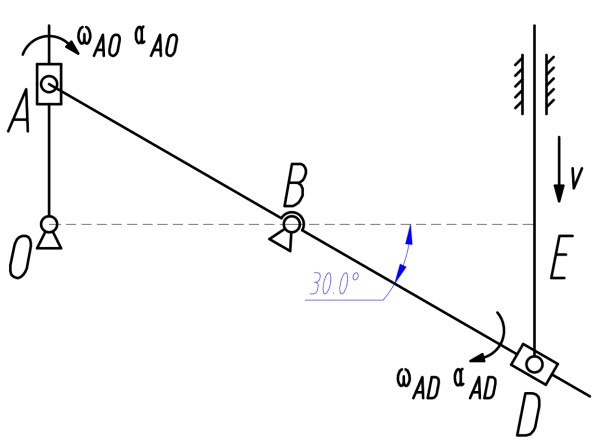

# 运动学
## 质点运动学
### 自然坐标系
设质点轨迹的指向运动方向的切向为 $\vec{\tau}$, 指向曲率圆心的法向 $\vec{n}$, 将 $\vec{\tau},\vec{n}$ 构成的坐标系称为自然坐标系

#### 速度表示
自然坐标系下, $\vec{\tau}$ 即速度的方向, 因此 $\vec{v}=v\vec{\tau}$

#### 加速度分解
自然坐标系下, 加速度可分解为切向加速度 $a_t$ 与法向加速度 $a_n$, 根据微分关系可表示为 
$$\vec{a}=a_t\vec{\tau}+a_n\vec{n}=\frac{dv}{dt}\vec{\tau}+\frac{v^2}{\rho}\vec{n}$$
其中 $v$ 为速度的大小, 不是矢量; $\rho$ 为轨迹的曲率半径, 可通过此方法求出运动轨迹的曲率半径

### 点运动的合成
将点的运动向静系和动系分解, 可得到三种运动

1. 绝对运动 (absolution) 动点相对于静系的运动
1. 相对运动 (relation) 动点相对于动系的运动
1. 牵连运动 (entrainment) 动系相对于静系的运动

解题时必须明确指出所选择的动系与计算的动点

#### 速度合成定律
$$\vec{v_a}=\vec{v_r}+\vec{v_e}$$

#### 加速度合成定律
加速度合成时, 如果动系不是平动 $\omega=0$ , 还==要考虑科氏加速度 $\vec{a_k}=2\vec{\omega}\times\vec{v_r}$ 的影响==
$$\vec{a}=\vec{a_r}+\vec{a_e}+2\vec{\omega}\times\vec{v_r}$$

#### 动系动点的选择
1. 动点为两个框体的交点时, 分别以两个框体为动系, 联立方程
1. 没有稳定接触点时, 使用刚体的平面运动
1. 有稳定接触点时, 动系的选择
    1. 动点不能在动系上, 否则无意义
    1. 动系最好与题目有关 (求动系的 $\omega$ )
    1. 动点轨迹易求
    1. 动系平动 (避免求科氏加速度)
1. 动点选择
    1. 套筒
    1. 铰链
    1. 圆心
    1. 杆的一端

### 例题

杆 $DE$ 以 $v$ 沿垂直滑道匀速下滑, 图示瞬间, 杆 $OA$ 垂直, $AB=BD=2r,OA\parallel ED$. 求此时杆 $OA$ 的角速度和角加速度

#### 几何关系确定
* 依题意得有 
$$AB=BD=2r$$
* 如图所示角度满足
$$\angle ABO=\angle DBE=30^\circ,\angle OAB=60^\circ$$
* $OA$ 段长度有
$$OA=AB\sin 30^\circ$$

#### 速度分析

在速度分析前先规定机构中杆件角速度的正方向, 也可以统一采用逆时针, 便于判断科氏力的方向

---

从具有已知量的部分开始分析, 以未知部分杆 $AB$ 为动系, 稳定接触点铰链 $D$ 为动点

动点 $D$ 为杆 $DE$ 的一端, 且杆 $DE$ 匀速平动, 因此其绝对速度即杆 $DE$ 的平动速度, 方向向下, 有
$$v_D=v$$

动系杆 $AD$ 绕铰链 $B$ 转动, 因此动系上 $D$ 处的点的速度 (牵连速度) 方向垂直于杆, 大小满足
$$v_D^e=BD\omega_{AD}=2r\omega_{AD}$$

假设动系静止, 动点 $D$ 所在的套筒只能沿杆 $AD$ 平动, 因此在此瞬间, 动点 $D$ 的相对速度沿杆方向, 大小未知 

确定几个速度分量的几何关系后画出动点 $D$ 速度简图

根据速度合成定律有
$$\vec{v_D}=\vec{v_D^e}+\vec{v_D^r}$$

由于 $\vec{v_D^e}$ 与 $\vec{v_D^r}$ 方向垂直, 因此可将矢量沿这两个方向分别分解得到
$$v_D^e=v_D\cos 30^\circ=\frac{\sqrt{3}}{2}v$$
$$v_D^r=v_D\sin 30^\circ=\frac{1}{2}v$$

根据 $\vec{v_D^e}$ 与 $\omega_{AD}$ 的关系还可以得到
$$\omega_{AD}=\frac{\sqrt{3}v}{4r}$$

---

从已知部分逐步分析到待求部分, 以待求部分杆 $AO$ 为动系, 稳定接触点铰链 $A$ 为动点

分别分析三个速度可得到如图方向关系与以下代数关系
$$v_A^e=\omega_{AO}$$
$$v_A=AB\omega_{AD}=2r\omega_{AD}=\frac{\sqrt{3}v}{2}$$

确定几个速度分量的几何关系后画出动点 $A$ 速度简图

根据速度合成定律
$$\vec{v_A}=\vec{v_A^e}+\vec{v_A^r}$$

分别沿 $x$, $y$ 轴方向 ($\vec{v_A^e},\vec{v_A^r}$ 方向) 分解可得
$$v_A^r=v_A\cos 30^\circ=\frac{3}{4}v$$
$$v_A^e=v_A\sin 30^\circ=\frac{\sqrt{3}}{4}v$$

根据 $\vec{v_A^e}$ 与 $\omega_{AO}$ 的关系还可以得到
$$\omega_{AO}=\frac{\sqrt{3}v}{4r}$$

#### 加速度分析

按原先速度分析的顺序对加速度进行分析

由于杆 $DE$ 匀速运动, 因此动点 $D$ 的绝对加速度满足
$$a_D=0$$

杆 $AD$ 上的点 $D$ 绕铰链 $B$ 旋转, 因此需要将牵连加速度 $\vec{a_D^e}$ 按自然坐标系分解为法向 $\vec{a_D^{en}}$ 与切向 $\vec{a_D^{e\tau}}$, 其中
* 切向加速度的方向与速度方向相同, 垂直于杆 $AD$, 大小满足
$$a_D^{e\tau}=BD\alpha_{AD}=2r\alpha_{AD}$$
* 法向加速度的方向指向旋转中点, 平行于杆 $AD$, 满足
$$a_D^{en}=BD\omega_{AD}^2=\frac{3v^2}{8r}$$

同相对速度, 套筒仅会沿杆运动, 因此动点 $D$ 的相对加速度 $\vec{a_D^r}$ 依然为沿杆 $AD$ 方向

注意, 由于动系杆 $AD$ 的角速度 $\omega_{AD}\neq 0$, 因此还存在科氏加速度 
$$a_D^k=2\omega_{AD}\times v_D^r=\frac{\sqrt{3}v^2}{4r}$$

其中科氏加速的方向需要具体分析. $\omega_{AD}$ 为顺时针方向, 因此矢量方向为垂直纸面向下, 与 $\vec{v_D^r}$ 通过右手定则得到 $\vec{a_D^k}$ 方向

确定几个加速度分量的几何关系后画出动点 $D$ 的加速度简图

根据加速度合成定律
$$\vec{a_D}=\vec{a_D^{e\tau}}+\vec{a_D^{en}}+\vec{a_D^{r}}+\vec{a_D^{k}}$$

一个矢量方程能够分解为两个独立的方程, 解出两个未知量  
对于此题, 仅未知量 $\alpha_{AD}$ 对于求出待求量有帮助, 因此仅求出 $\vec{a_D^{e\tau}}$ 即可, 避免加速度分析中不必要的计算 (由于速度分析较简单, 且与加速度分析关联强, 因此能求出的未知量尽量求出)  
为了最大程度避免额外未知量参与, 可沿待求未知量 $\vec{a_D^{e\tau}}$ 方向分解矢量, 得到方程
$$a_D^{e\tau}=-a_D^k=-\frac{\sqrt{3}v^2}{4r}$$

根据其与 $\alpha_{AD}$ 的关系得出
$$\alpha_{AD}=-\frac{\sqrt{3}v^2}{8r^2}$$

---

对动点 $A$ 进行加速度分析

由于杆 $AD$ 绕铰链 $B$ 转动, 因此动点 $A$ 的绝对加速也由切向 $\vec{a_A^\tau}$ 与法向 $\vec{a_A^n}$ 两部分组成, 满足
$$a_A^{\tau}=AB\alpha_{AD}=-\frac{\sqrt{3}v^2}{4r}$$
$$a_A^{n}=AB\omega_{AB}^2=\frac{3v^2}{8r}$$

同样, 杆 $AO$ 绕铰链 $O$ 转动, 动点的牵连加速度同样由两部分 $\vec{a_A^{e\tau}}$ 与 $\vec{a_A^{en}}$ 组成, 满足
$$a_A^{e\tau}=AO\alpha_{AO}$$
$$a_A^{en}=AO\omega_{AO}^2=\frac{3v^2}{16r}$$

并且动系 $AO$ 存在角速度, 因此还有科氏加速度 
$$\vec{a_A^{k}}=2\omega_{AO}v_A^r=\frac{3\sqrt{3}v^2}{8r}$$  

整理几何关系可得动点 $A$ 的加速度简图为

根据加速度合成定律
$$\vec{a_A^{\tau}}+\vec{a_A^{n}}=\vec{a_A^{e\tau}}+\vec{a_A^{en}}+\vec{a_A^{r}}+\vec{a_A^{k}}$$

加速度分量中, $a_A^{e\tau}$ 与待求量 $\alpha_{AO}$ 有关, 因此沿 $\vec{\alpha_{AO}}$ 方向分解 (注意等式两侧)
$$\begin{split}a_A^{\tau}\cos 60^\circ+a_A^{n}\cos 30^\circ&=a_A^{e\tau}+a_A^{k}\\
-\frac{\sqrt{3}v^2}{8r}+\frac{3\sqrt{3}v^2}{16r}&=a_A^{e\tau}+\frac{3\sqrt{3}}{8r}\\
a_A^{e\tau}&=-\frac{5\sqrt{3}v^2}{16r}\\
\alpha_{AO}&=-\frac{5\sqrt{3}v^2}{16r^2}\end{split}$$

解 $\alpha_{AO}$ 中的负号表明其实际方向与设定的正方向方向相反

---

最终得到题目的解
$$\omega_{AO}=\frac{\sqrt{3}v}{4r},\circlearrowright$$
$$\alpha_{AO}=-\frac{5\sqrt{3}v^2}{16r^2},\circlearrowleft$$

## 刚体的平面运动
### 刚体转动
在刚体上选取任意基点, 刚体上其他点相对于基点的角速度与角加速度相同

### 基点法
将刚体上的点的运动分解为:
* 相对于基点的转动 (刚体上两点距离不变, 只能做转动运动)
* 基点作为动系的平动

选取基点 $A$, 求刚体上的质点 $B$ 的运动有
#### 基点法求速度
$$\vec{v_B}=\vec{v_A}+\vec{v_{BA}}$$

其中
$$\vec{v_{BA}}=\vec{\omega}\cdot\vec{AB}$$

#### 基点法求加速度
$$\vec{a_B}=\vec{a_A}+\vec{a_{BA}^n}+\vec{a_{BA}^e}$$

其中
$$\vec{a_{BA}^n}=|AB|\omega^2=\frac{v_{BA}^2}{AB}$$
$$\vec{a_{BA}^t}=|AB|\alpha$$

#### 速度投影法
将基点法向 $\vec{AB}$ 投影可得, 对于刚体上任意两点, 满足 
$$\vec{v_A}\cdot\vec{e_{AB}}=\vec{v_B}\cdot\vec{e_{AB}}$$

反映了刚体上任意两点距离不变的特性

### 速度瞬心法
* 刚体上必定存在一点 $C$, 满足 $v_C=0$
* 通过对刚体上两点速度方向垂线的交线得到 $C$
* 如果垂线平行, 则能判断刚体平动, $\omega=0$
* 对于刚体上任意一点 $M$, $v_M=MC\cdot\omega$
* 速度瞬心的加速度一般不为 $0$

### 加速度投影法
* 当刚体平动 $\omega=0$ 时使用
* 此时没有法向加速度, 只有切向加速度, 表现出类似速度的性质
* 因此有加速度投影法 
$$\vec{a_A}\cdot\vec{e_{AB}}=\vec{a_B}\cdot\vec{e_{AB}}$$

### 加速度瞬心
* 一般情况下加速度瞬心无法直接求得
* 如果刚体 $v\neq 0$, 由于法向加速度, 加速度瞬心难以使用
* 当 $v=0$, 与速度瞬心性质类似, 加速度瞬心为两点加速度垂线的交点

### 纯滚动
* 当圆柱体 (齿轮) 等于地面没有相对滑动, 则称为纯滚动
* 设圆心 $O$, 接触点 $A$

#### 纯滚动的运动特性

1. 当纯滚动的接触面为地面时 (静止物体, 圆心水平运动)
    1. 纯滚动中, 接触点 $v_A=0$ 为速度瞬心
    1. 根据速度瞬心法可得 $v_O=r\omega$
    1. 接触点不是加速度瞬心
    1. 圆心的切向加速度满足 $a_O^t=r\alpha$
1. 当纯滚动的接触面为弧面时, 圆心还有法向加速度 $a_O^n=\frac{v_O^2}{r+R}$ (切向加速度不变)
3. 当相对于运动物块纯滚动时, 则以物块为动系, 当物块平动时, 满足 $a_O^r=r\alpha$

#### 纯滚动的其他特性
1. 对于绳子绕在圆柱上, 认为绳子与圆柱的接触点纯滚动
1. 纯滚动的位置通常存在一个拉力 / 滑动摩擦力

#### 齿轮问题
1. 齿轮齿数 $z$ 满足 
$$\frac{z_1}{z_2}=\frac{r_1}{r_2}=i_{12}$$ 
其中 $i_{12}$ 为齿轮的传动比
1. 齿轮 / 齿条的啮合处 $C$ 为纯滚动, 且对于两齿轮速度相同, 满足 
$$r_1\omega_1=-r_2\omega_2=v_C$$
1. ==注意外啮合的两个齿轮转向必定相反, 因此要加负号==

### 刚体绕平行轴转动
对于二维动系中的刚体, 满足 
$$\omega_a=\omega_r+\omega_e$$ 
$$\alpha_a=\alpha_r+\alpha_e$$

#### 曲柄固定齿轮问题
* 对于曲柄固定齿轮的角速度问题, 可以设曲柄为动系, 其他齿轮相对曲柄运动, 此时齿轮圆心相对静止, 易于计算
* 其中固定齿轮 $\omega_a=\omega_r+\omega_e=0$
* 由于要引入科氏加速度, 不适用于加速度计算

### 套筒问题
1. 套筒内的刚体相对于套筒平动, 即刚体上各点的 $v_r$ 相同, 刚体 $\omega_r=0$
1. 根据角速度叠加可得, 套筒内的刚体绝对角速度与绝对角加速度与套筒相同
1. 与套筒转轴的重合点 $P$ 上, $v_e=0$, 因此 $v_r=v_P$ (套筒为动系, $P$ 为动点)
