# 热传导
## 傅里叶传热定律
### 傅里叶定律的一般形式
对于任意物体内的温度场 $t(x,y,z)$, 其内部的热流密度满足

$$\vec{q}=-\lambda\nabla t$$

因此热流密度为温度梯度方向的矢量, 由高温指向低温  
物体中等温线较密集的地方说明温度的变化率较大，导热热流也较大

在已知温度场 $t(x,y,z)$ 时, ==可由温度场的梯度得到热流密度==  
在已知热流密度 $\vec{q}$ 时, ==可由热流密度积分得到温度场==

将热流密度对物体截面积分还可得到总热流量
$$\Phi=\int_A\vec{q}\mathrm{d}\vec{A}$$

### 导热系数
定义导热系数 $\lambda$ 反应物体的导热能力, 单位为 $W/(m\cdot K)$ 

默认情况下, 认为导热系数仅与物体材料有关, 为常数  
实际导热系数还会随温度变化 (规律不确定), 工程上使用线性近似

$$\lambda=\lambda_{0}(1+bt)$$

### 导热微分方程
根据能量守恒与傅里叶定律, 对于物体内的微元体分析, 可得导热微分方程  

$$\rho c\frac{\partial t}{\partial\tau}=\nabla\cdot(\lambda\nabla t)+\dot{\Phi}$$

* $\nabla\cdot(\lambda\nabla t)$ 表示净流入微元体的热量 (即热流量的散度)
* $\dot{\Phi}$ 表示微元体自身发热量, 单位为 $W/m^3$
* $\rho c\frac{\partial t}{\partial\tau}$ 表示微元体热力学能 (温度) 变化而消耗的热量  
其中 $\rho$ 为微元体密度, $c$ 为微元体比热容

当假设传热系数 $\lambda$ 为常数时, 此时微分方程为
$$\frac{\partial t}{\partial\tau}=a\nabla^2 t+\dot{\Phi}$$

其中定义 $a=\frac{\lambda}{\rho c}$ 为热扩散率, 体现热量传播的速度 

### 定解条件
通过求解导热微分方程, ==可以得到物体内的温度分布==  
求解前还需要关于物体边界的条件, 定义如下几种边界条件  
1. 给出物体边界上的温度分布 $t_w=f(x,y,z,\tau)$, 稳态时有 $t_w=C$
1. 给出物体边界上的热流密度分布 $q_w=f(x,y,z,\tau)$, 绝热界面有 $q_w=0$
1. 给出物体表面上的对流换热条件 $h,t_f$ (即 $q=f(t)$), 通常可转化为条件 1, 2

## 一维无热源稳态导热
无热源条件表明 $\dot{\Phi}=0$  
稳态条件表明 $\frac{\partial t}{\partial \tau}=0$  
一维条件表明 $\nabla=\frac{\mathrm{d}}{\mathrm{d}x}$

因此此时的导热微分方程为
$$\frac{\mathrm{d}}{\mathrm{d}x}[\lambda(t)\frac{\mathrm{dt}}{\mathrm{d}x}]=0$$

### 一维无热源稳态导热的特性
该导热微分方程也表明
$$\operatorname{div}\vec{q}=0$$

即无热源条稳态的条件下, 热流密度散度为 $0$  
根据[高斯积分](/course/math/hand_book/multivariate.md#散度), 进入物体的总热流量必定等于离开物体的总热流量  

此外由于一维导热也隐含了垂直一维导热方向的==截面温度与热流量 $q$ 相同==

结合以上两点还可得出  
一维导热中, ==物体上的任意垂直截面, 热流量相同, 并且满足==
$$\Phi_{A_1}=\Phi_{A_2}=-A\lambda\frac{\mathrm{d}t}{\mathrm{d}x}$$

可根据此公式==定性地判断==温度场变化曲线的斜率, 或==直接求解热流量与热流密度==

### 平面壁导热
#### 常导热系数的平面壁导热

当导热系数为常数时, 微分方程再次简化为
$$\frac{\mathrm{d}^2 t}{\mathrm{d}x^2}=0$$

假设壁面左侧温度为 $t_1$, 右侧温度为 $t_2$, 壁厚 $\delta$, 因此有边界条件 $t(0)=t_1,t(\delta)=t_2$

最终可解得平板内温度满足==线性分布==
$$t(x)=\frac{t_2-t_1}{\delta}x+t_1$$

对温度分布求导即可得到平板传热的热流密度满足
$$q=\lambda\frac{\Delta t}{\delta}$$

对于平板截面有
$$\Phi=A\lambda\frac{\Delta t}{\delta}$$

由此也可推出平板的导热热阻
$$R=\frac{\delta}{A\lambda}$$

#### 多平面壁串联
对于多平板串联 (多层平面壁), 可视为一个[串联的导热热阻网络](./ch6.md#热阻串联计算)  
通过计算各个平板的导热热阻, 最终可得到总热阻 $R=\sum R_i$

根据两侧温差与总热阻可得到总热流量 $\Phi$ 或热流密度 $q$  
再根据各自热阻得到各个平板的两侧温度, 从而得到温度分布 (各个平板内依然为线性温度分布)

#### 串联热阻
当平面壁相接触时, 中间还存在大量导热率极低的气穴, 产生附加热阻 $R_c$, 称为接触热阻

可通过以下方式减小热阻
1. 降低接触面粗糙度
1. 减小接触面硬度, 增大接触面积
1. 增大接触面间的压力

#### 线性导热系数的平面壁导热热流密度计算
当导热系数近似满足[线性条件](#导热系数) $\lambda=\lambda_{0}(1+bt)$ 时  
根据[一维无热源稳态导热的特性](一维无热源稳态导热的特性), 分离与 $t$ 无关的量
$$\begin{split}q&=-\lambda(t)\frac{\mathrm{d}t}{\mathrm{d}x}\\
\int_{x_2}^{x_1}q\mathrm{d}x&=-\int_{t_1}^{t_2}\lambda_{0}(1+bt)\mathrm{d}t\\
q&=\frac{\bar{\lambda}\Delta t}{\delta}
\end{split}$$

其中 $\bar{\lambda}=\lambda_{0}(1+b\bar{t})$ 为 $t_1,t_2$ 下的平均导热系数  
因此==使用平均导热系数代替即可计算得到线性导热系数的平面壁热流密度==  
由于 $\bar{\lambda}$ 未知, 因此此时的平板串联问题中需要先假设, 再通过迭代求解

#### 线性导热系数的平面壁导热温度场分析

根据[一维无热源稳态导热的特性](一维无热源稳态导热的特性)定性分析
$$q=-\lambda\frac{\mathrm{d}t}{\mathrm{d}x}=C$$

==$\lambda$ 与温度曲线斜率的绝对值 $|\frac{\mathrm{d}t}{\mathrm{d}x}|$ 成反比==, 有 $|\frac{\mathrm{d}t}{\mathrm{d}x}|\propto\frac{1}{\lambda}$

当 $b>0$, 导热系数随温度增大而增大 $\lambda\propto t$  
导热曲线的斜率绝对值随温度升高而降低, ==温度曲线上凸==

当 $b<0$, 导热系数随温度增大而减小 $\lambda\propto -t$  
导热曲线的斜率绝对值随温度升高而升高, ==温度曲线下凹==

#### 任意截面一维导热
对于任意截面, 可将截面视为与位置 $x$ 有关的函数 $A(x)$  
此时各截面的热流密度 $q$ 不再相同, 但是热流量 $\Phi$ 依然相同, 因此

对于热流量与热流密度, 类似[线性导热系数的平面壁导热热流密度计算](#线性导热系数的平面壁导热热流密度计算)进行变量分离可得
$$\int_{x_2}^{x_1}\frac{\Phi}{A(x)}\mathrm{d}x=-\int_{t_1}^{t_2}\lambda(t)\mathrm{d}t$$

对于温度场, 思路与[线性导热系数的平面壁导热温度场分析](#线性导热系数的平面壁导热温度场分析)相同, 有 $|\frac{\mathrm{d}t}{\mathrm{d}x}|\propto\frac{1}{A(x)}$

## 一维内热源导热
当存在内热源时, $\dot{\Phi}\neq 0$

假设物体均匀发热, 有发热率 $\dot{\Phi}=C$, 且导热系数为常数, 则有微分方程
$$\frac{\mathrm{d}^2t}{\mathrm{d}x^2}+\frac{\dot{\Phi}}{\lambda}=0$$

### 一维有源稳态导热的特性
与[一维无热源稳态导热的特性](#一维无热源稳态导热的特性)不同, 存在内热源时, 对导热系数积分后可得热流密度的变化规律为
$$q(x)=\dot{\Phi}x+C$$

因此热流密度大小还会随截面位置移动而变化  
对于对称平板, 通常有 $q(0)=0,C=0$, 因此==热流密度与截面距离成正比==

### 内热源平板导热

对于如图所示的对称平板, 平板的边界为第三类边界条件  
根据对称性, 仅研究右侧模型  
假设边界条件为 $\frac{\mathrm{d}t}{\mathrm{d}x}\big|_{x=0}=0$ (对称性)

仅根据[一维有源稳态导热的特性](#一维有源稳态导热的特性)与对称性即可得
$$\frac{\mathrm{d}t}{\mathrm{d}x}=-\frac{\dot{\Phi}}{\lambda}x\to t(x)=-\frac{\dot{\Phi}}{2\lambda}x^2+C$$

因此对==称平板的内热源导热温度分布必定为二次曲线==, 并且曲线的形状已经确定  
仅边界需要通过第二个边界条件确定

对于==第三类边界条件 $q(\delta)=-\lambda\frac{\mathrm{d}t}{\mathrm{d}x}\big|_{x=\delta}=h[t(\delta)-t_f]$==, 联立上式即可求出 (将上式求导带入左侧, $t(\delta)$ 带入右侧)
$$t=\frac{\dot{\Phi}}{2\lambda}(\delta^2-\lambda^2)+\frac{\dot{\Phi}}{h}\delta+t_f$$

对于第一类边界条件 $t(\delta)=t_w$ 同理可得
$$t=\frac{\dot{\Phi}}{2\lambda}(\delta^2-\lambda^2)+t_w$$

简单的第二类边界条件则与[一维有源稳态导热的特性](#一维有源稳态导热的特性)冲突 ($q(\delta)=\dot{\Phi}\delta$)

### 复合导热分析
当内热源平板导热与无热源平板相接触, 串联组合时  
内热源平板无法作为热阻分析, 但由于内热源平板边界热流量 $\Phi=A\dot{\Phi}\delta$ 已知  
因此==可视为电路中的电流源处理==, 产生的总热流量即边界热流量

再通过串联热阻的计算方法得出各平板间的温度即可分别求出平板内的温度分布

## 一般一维稳态导热分析
### 导热方程的简化
根据一维稳态导热方程可得, 对于同一介质中的任意体积 $V$
$$\Phi=\int_V\dot{\Phi}\mathrm{d}V=\oint_A q\mathrm{d}A$$

对于球面, 圆柱面以及一般一维导热, 均可认为 $q$ 在垂直导热方向的==截面 $A$ 上均匀分布==, 因此
$$q=\frac{\Phi}{A}$$

因此可仅使用此导出性质与一维[傅里叶定律](#傅里叶传热定律)直接分析一维稳态导热, 避免求解微分方程   

$$\begin{split}q&=-\lambda\frac{\mathrm{d}t}{\mathrm{d}x}\\
\int_{x_1}^{x_2}\frac{\Phi(x)}{A(x)}\mathrm{d}x&=\int_{t_1}^{t_2}-\lambda(t)\mathrm{d}t
\end{split}$$

注意
* 温度积分的上下限要与位置积分对应
* ==一般 $\Phi,A$ 随位置变化==, $\lambda$ 随温度变化

除了一维导热外, 还==可将圆筒与圆柱的导热转化为一维导热==, 以使用同样的方法进行分析    
其中以半径 $r$ 为导热方向, 导热截面为半径 $r$ 下的圆柱面 / 球面

### 热流密度规律
对于无内热源的物体, 沿导热方向截面的总热流量等于任一截面上的热流量
$$\Phi(x)=C$$

对于对称的有内热源物体, 可通过积分得到  
一般假设对称中心 $x=0$ 处 $\Phi(0)=0$, 内热源强度 $\dot{\Phi}$ 为常数  
$$\Phi(x)=\dot{\Phi} V(x)$$

对于平板  
由于平板 $A$ 为常数, 因此可使用热流密度 $q$ 代替 $\Phi$, 热阻网络中也是用单位面积热阻 $r$ 代替   
对于对称内热源可仅计算一侧, 因此有 $q(x)=\dot{\Phi}x$ (即[一维有源稳态导热的特性](#一维有源稳态导热的特性)的结论)  

### 引入导热网络
对于 $\lambda(t)=C$ 的情况下, 根据 $\Phi$ 的性质  
可将 $\Phi$ 等效为电流, $t$ 等效为==电位 (温度源)==  
$x$ 方向上的无内热源物体等效为串联电阻 (热阻), 有内热源物体则等效为==电流源== (热流源)  
根据电路理论可得, 对于由位置 $t_1$ 到位置 $t_2$ 的热流量满足 (注意热流量的方向性)

$$\Phi_{1,2}=\frac{t_1-t_2}{R}$$

由于热阻来自无热源物体 $\Phi=C$   
因此根据上式可知热阻满足 ($x_1,x_2$ 一般按物体, 即导热系数划分)
$$R=\frac{(t_2-t_1)}{\Phi_{2,1}}=\int_{x_1}^{x_2}\frac{\mathrm{d}x}{\lambda A(x)}$$

注意到==热阻仅与物体的形状与性质有关, 与外界无关==

通过热导网络计算==物体间==的温度 $t$ 与热流量 $\Phi$  
最后使用傅里叶传热定律具体计算==物体内==的温度分布

### 边界条件的转换
#### 第一类边界条件
对于第一类边界条件, 可直接带入傅里叶定律, 直接求出各个截面的温度

导热网络中则等效为温度源

#### 第三类边界条件
对于第三类边界条件可通过对流换热公式, 转换为第一类边界条件  
$$q(x_b)=[t(x_b)-t_\infty]h$$

导热网络中则等效为一个温度源 $t_f$ 与对流热阻 $R=\frac{1}{Ah}$ 串联

#### 第二类边界条件
对于第二类边界条件, 仅存在无热源导热的情况, 即确定了导热系数 $\Phi$  

导热网络中则等效为热流源

### 分析举例
#### 无内热源圆筒导热热阻
无内热源下 $\Phi=C$, 假设 $\lambda$ 为常数  
圆筒长 $L$ 内径 $r_1$, 外径 $r_2$   
将圆筒内的导热转化为一维导热, 忽略上下两侧的导热 ($L\gg r$), 此时有  
$$A(r)=2\pi rL$$

根据[热阻求解](#导热网络)    
因此可得出圆筒的的导热热阻
$$\begin{split}R&=\int_{r_1}^{r_2}\frac{\mathrm{d}r}{\lambda A(r)}\\
R&=\frac{1}{2\pi L\lambda}\int_{r_1}^{r_2}\frac{\mathrm{d}r}{r}\\
R&=\frac{\ln{r_2/r_1}}{2\pi L\lambda}
\end{split}$$

#### 无内热源球壁导热热阻
无内热源下 $\Phi=C$, 假设 $\lambda$ 为常数  
球内壁半径 $r_1$, 外壁半径 $r_2$  
将球壁的导热转化为一维导热, 此时有  
$$A(r)=4\pi r^2$$

根据[热阻求解](#导热网络)    
因此可得出圆壁的导热热阻
$$\begin{split}R&=\int_{r_1}^{r_2}\frac{\mathrm{d}r}{\lambda A(r)}\\
R&=\frac{1}{4\pi \lambda}\int_{r_1}^{r_2}\frac{\mathrm{d}r}{r^2}\\
R&=\frac{\frac{1}{r_1}-\frac{1}{r_2}}{4\pi \lambda}
\end{split}$$

#### 内热源圆柱导热
将圆筒内的导热转化为一维导热, 忽略上下两侧的导热 ($L\gg r$)  
假设 $\lambda,\dot{\Phi}$ 为常数, 圆柱长 $L$, 半径为 $R$   
圆柱中心温度 $t(0)=t_1$, 边界温度 $t(R)=t_2$

由[上](#无内热源圆筒导热热阻)可得, 对于圆柱有
$$A(r)=2\pi rL$$

此外由于 $\dot{\Phi}$ 为常数, 因此
$$\Phi(r)=\dot{\Phi}\pi Lr^2$$

根据[傅里叶传热定律](#导热方程的简化)有
$$\begin{split}
\int_{0}^{R}\frac{\Phi(r)}{A(r)}\mathrm{d}r&=\int_{t_1}^{t_2}-\lambda\mathrm{d}t\\
\int_{0}^{R}\frac{\dot{\Phi}\pi Lr^2}{2\pi rL}\mathrm{d}r&=\lambda(t_1-t_2)\\
t_1&=\frac{\dot{\Phi}}{4\lambda}R^2+t_2\\
\end{split}$$

#### 复合平面壁导热
见[有关例题](./quest_solve.md#复合平板导热)

## 非稳态导热
定义导热系统内温度场随时间变化的导热过程为**非稳态导热**  
此时温度与热流均随时间变化, $\frac{\mathrm{d}\tau}{\mathrm{d}\tau}\neq 0$

### 基本过程
#### 温度场随时间变化

如图所示, 非稳态传热共分为两个阶段  
在 $\tau<\tau_3$ 时, 热流尚未完全传导到壁面另一侧, 温度分布受==初始温度分布==的影响较大, 称为**非正规状态**  

在 $\tau>\tau_3$ 时, 热流传导到壁面另一侧, 物体内的温度分布主要受==边界条件==的影响, 称为**正规状态**  

#### 热流量随时间变化

对于接触截面 $A$ 的热流量是从最高值不断减小  
其他截面温度开始升高之前通过该截面的热流量是零, 温度开始升高之后, 热流量才开始增加

这表明温度变化要积聚或消耗热量

### 集总参数法
#### 非稳态对流换热温度场

对于如图所示的对称平面壁, 壁面两侧有相同的对流换热, 现仅考虑一侧的换热  
由于两侧对称, 因此中心温度将不断上升, 最终稳态时温度均匀分布, 且均为 $t_\infty$

现取某一时刻的温度分布曲线如图所示, 当==表面传热系数 $h$ 不同时, 曲线形状不同==  
通过热阻串联的方式分析有
1. 曲线 $a$ 中, ==壁面外温度近似均匀 $t_w\approx t_\infty$==, 壁内温度随位置快速变化 $t_0\ll t_w$  
根据电路知识可得, 此时 ==$t_w$ 与 $t_\infty$ 之间近似短路, **对流热阻**极小==, 有 $R_2\ll R_1\to \frac{\delta h}{\lambda}\gg 1$
1. 曲线 $b$ 中, 对流温度 $t_\infty$, 壁面外温度 $t_w$ , 壁面中心温度 $t_0$ 均有较大的差别   
根据电路知识可得, 此时 $R_1$ 与 $R_2$ 之间相差较小, 有 $R_2\approx R_1\to \frac{\delta h}{\lambda}\approx 1$
1. 曲线 $c$ 中, ==壁面内度近似均匀 $t_w\approx t_0$==, 壁外温度随位置快速变化 $t_w\ll t_\infty$  
根据电路知识可得, 此时 ==$t_0$ 与 $t_w$ 之间近似短路, **导热热阻**极小==, 有 $R_2\gg R_1\to \frac{\delta h}{\lambda}\ll 1$

#### 集总参数法计算温度变化
对于类似曲线 $c$ 的情况下, $\frac{\delta h}{\lambda}\ll 1$, 认为物体内的温度均匀分布 $\nabla t\approx 0$ (==忽略物体内的热阻==)  
根据对流换热的第三类边界条件, 在物体表面上依然有 $\Phi=-hA(t_w-t_\infty)$  
由于物体温度均匀, 因此直接根据热力学第一定律有 (方程左侧为单位时间内能变化, 右侧为单位时间吸收热量)
$$V\rho c\frac{\mathrm{d}t}{\mathrm{d}\tau}=-hA(t-t_\infty)$$

定义过余温度 $\theta=t-t_\infty$ 进行变量代换, 可得物体过余温度变化满足
$$\frac{\theta(\tau)}{\theta_0}=\frac{t-t_\infty}{t_w-t_\infty}=e^{-\frac{\tau}{\tau_0}}$$

其中 $\tau_0$ 为时间常数, 满足
$$\tau_0=\frac{\rho cV}{hA}$$
公式中
* $V$ 为物体的体积
* $A$ 为物体进行对流换热的==有效表面积==

时间常数 $\tau_0$ 的单位为 $s$, 反映了物体在对流换热中温度变化的速度, ==时间常数越大, 温度变化越慢==  
公式中的分子体现了物体升高单位度所吸收的热量 (即热容 $V\rho c$)  
分母体现了物体的对流换热热阻的倒数 $hA$  

为了加快物体温度变化至环境温度如电热偶, 可以减小电热偶的体积 $V$, 增大电热偶与外界的接触面积 $A$

#### 集总参数法的使用条件
由于集总参数法中使用了物体内的温度均匀分布这一假设, 因此==使用前必须现判读是否满足以下条件==

现定义无量纲准则数毕渥数 $Bi$ 为物体内部导热热阻 $\frac{L}{\lambda}$ 与表面对流换热热阻 $\frac{1}{h}$ 之比
$$Bi=\frac{hL}{\lambda}$$

当其满足以下条件时才可以使用集总参数法
$$Bi=\frac{hL}{\lambda}<0.1M$$

* $h$ 为外界的表面传热系数
* $\lambda$ 为物体的导热系数
* $\delta$ 为物体的特征长度, 满足 $\delta=\frac{V}{A}$ (注意 $A$ 为有效换热面积)
* $M$ 为形状修正系数
    * 对于厚度为 $\delta$ 的==无限大==平面壁  
    $L=V/A=\delta/2$ (注意前后面均有换热), 形状修正系数 $M=1$
    * 对于==无限长==圆柱  
    $L=V/A=R/2$ (注意忽略上下面), 形状修正系数为 $M=\frac{1}{2}$
    * 对于其他一般物体 (==包括短圆柱==, 即上下面参与换热的圆柱)  
    形状修正系数 $M=\frac{1}{3}$

#### 傅里叶数
在集总参数法中, 有
$$-\frac{\tau}{\tau_0}=-Bi\cdot Fo$$

其中 $Bi$ 即毕渥数  
定义 $Fo$ 为傅里叶数, 满足
$$Fo=\frac{\tau}{L^2/a}$$

反映了 $\tau=0\sim \tau$ 为止, 物体内热绕动的扩散程度  
傅里叶数 $Fo$ 越大, 物体内温度约接近 $t_\infty$
