# 辐射换热
## 基本概念
### 辐射过程
#### 辐射换热特点
1. 辐射换热是指物体之间==相互辐射和吸收过程==的总效果
1. 热辐射不依赖介质传播
1. 辐射换热时伴随着热力学能与电磁能的转化
1. 温度高于 $0K$ 的物体就能辐射能量

#### 简单辐射过程

热射线与光的特性相同, 所以辐射同样存在投射, 反射, 折射等规律

定义来到物体表面的辐射能为 $G$, 其中吸收部分 (absorb) 为 $G_\alpha$, 反射部分 (reflect) 为 $G_\rho$, 透射部分 (transmission) 为 $G_\tau$

以此定义吸收比 $\alpha=\frac{G_\alpha}{G}$, 反射比 $\rho=\frac{G_\rho}{G}$, 透射比 $\tau=\frac{G_\tau}{G}$

对于一般物体, 始终有 $\alpha+\rho+\tau=1$  
对于固体与液体, 认为热辐射无法穿过, 有 $\tau=0, \alpha+\rho=1$  
对于气体, 认为热辐射不会被反射, 有 $\rho=0, \tau+\alpha=1$

#### 理想物体与现象定义
注意以下定义均对热辐射而言, 而不是可见光

* 漫反射 / 镜面反射  
物体表面是漫反射还是镜反射取决于物体表面相对于辐射波长的表面粗糙程度  
当反射的辐射在各个方向均匀分布, 则称为漫反射 (具体见[兰贝特定律](#兰贝特定律))  
一般情况下认为物体对镜面辐射近似漫反射
* 黑体  
当热辐射被完全吸收, 则称为黑体, 满足 $\alpha=1$  
在相同温度的物体中, 黑体的辐射能力最大
* 白体 / 镜体  
当物体能完全反射投射到其表面的辐射, 则称为白体 (漫反射) / 镜体 (镜面反射), 满足 $\rho=1$
* 透明体  
投射到物体表面的辐射被完全透过, 则称为透明体, 满足 $\tau=1$

### 辐射力
#### 总辐射力
定义==单位时间单位辐射面积==向==半球空间一切方向==辐射出去的==所有波长==的辐射能量为**总辐射力**
$$E=\frac{\mathrm{d}\Phi}{\mathrm{d}A}$$

单位为 $W/m^2$

#### 单色辐射力
定义单位时间单位辐射面积的辐射能量中, 关于特定波长 $\lambda$ 的==分布密度==为**单色辐射力**
$$E_\lambda=\frac{\mathrm{d}E}{\mathrm{d}\lambda}=\frac{\mathrm{d}^2\Phi}{\mathrm{d}\lambda\mathrm{d}A}$$

单位为 $W/m^3$, 对于黑体与一般物体 $E_\lambda$ 为一个与波长 $\lambda$ 有关的函数

对于辐射中波长范围为 $\lambda_1\sim\lambda_2$ 的辐射力满足
$$E_{(\lambda_1\sim\lambda_2)}=\int_{\lambda_1}^{\lambda_2}E_{\lambda}\mathrm{d}\lambda$$

#### 方向辐射力

对于球面微元有 $\mathrm{d}A_n=(r\sin\varphi\mathrm{d}\theta)(r\mathrm{d}\varphi)$ (注意不同 $\varphi$ 下, 圆弧半径不同)  
空间角满足 $\mathrm{d}\bar{\omega}=\mathrm{d}A_n/r^2=\mathrm{d}\theta\mathrm{d}\varphi\sin\varphi$

定义单位时间单位辐射面积的辐射能量中, 关于特定方向空间角 $\bar{\omega}$ ==分布密度==为**方向辐射力**

$$E_\varphi=\frac{\mathrm{d}E}{\mathrm{d}\bar{\omega}}=\frac{\mathrm{d}^2\Phi}{\mathrm{d}\bar{\omega}\mathrm{d}A}$$

单位为 $W/(m^2Sr)$, 对于一般物体 $E_\varphi$ 与方向角 $\theta$ 无关 (球面对称性), 为一个与俯仰角 $\varphi$ 有关的函数

对于在俯仰角 $\varphi_1\sim\varphi_2$ 与方向角 $\theta_1\sim\theta_2$ 范围内的辐射力满足
$$E_{(\varphi_1\sim\varphi_2,\theta_1\sim\theta_2)}=\int_{\varphi_1}^{\varphi_2}\int_{\theta_1}^{\theta_2}E_{\varphi}\sin\varphi\mathrm{d}\theta\mathrm{d}\varphi$$

#### 定向辐射强度

发射面 $\mathrm{d}A$ 在==垂直于 $\varphi$ 方向==上的接收面上的投影为 $\mathrm{d}A'$, 同时也是接收面实际接收到的辐射面积  
根据几何关系, 两个微元量满足 $\mathrm{d}A\cos\varphi=\mathrm{d}A'$

定义单位时间内==垂直于 $\varphi$ 方向的单位**被接收**面积== (也称为单位==可见==辐射面积) 上接收到的辐射能量, 关于接收面所在空间角 $\bar{\omega}$ 的==分布密度==为**定向辐射强度**

因此可得定向辐射强度与方向辐射力之间满足关系
$$I_\varphi=\frac{\mathrm{d}E}{\mathrm{d}\bar{\omega}\mathrm{d}A'}=\frac{E_\varphi}{\cos\varphi}$$

##### 实际方向辐射求解

对于空间中的发射面 $\mathrm{d}A_1$ 与接收面 $\mathrm{d}A_2$, 发射的辐射能量满足求解如下 

$\varphi_1,\varphi_2$ 为两面连线与法线之间的俯仰角方向夹角  
$$\mathrm{d}\Phi=I_1\mathrm{d}A_1'\mathrm{d}\bar{\omega}_2=I_1\mathrm{d}A_1\cos\varphi_1\frac{\mathrm{d}A_2\cos\varphi_2}{r^2}$$

需要通过投影 $\mathrm{d}A_n=\mathrm{d}A_2\cos\varphi_2$ 将 $\mathrm{d}A_2$ 投影到垂直 $\varphi_1$ 方向, 以求解 $\mathrm{d}\bar{\omega}_2$  
$\mathrm{d}A_1$ 实际发射到 $\mathrm{d}A_2$ 上的辐射面积为 $\mathrm{d}A_1'=\mathrm{d}A_1\cos\varphi_1$ 
## 辐射基本定律
### 黑体辐射
根据能量守恒, 黑体除了能吸收所有能量, 还是在同一温度下, 有最大辐射力的物体

使用下标 $b$ 表示来自黑体的辐射力

#### 普朗克定律
普朗克定律表示的是黑体的辐射能按波长的分布规律  
公式给出了黑体的单色辐射力与热力学温度 $T$, 波长 $\lambda$ 之间的
函数关系

$$E_{b\lambda}=\frac{c_1\lambda^{-5}}{e^{c_2/(\lambda T)}-1}$$

$c_1$ 为第一辐射常数， $c_1=3.743\times 10^{-16}W\cdot m^2$
$c_2$ 为第二辐射常数， $c_2=1.4387\times 10^{-2}m\cdot K$

单色辐射力随着波长的增加而增加, 达到==某一最大值后又随着波长的增加而慢慢减小==, 定义这个最大值为 $\lambda_m$

#### 维恩位移定律

$\lambda_m$ 与温度 $T$ 成反比, 温度越高, $\lambda_m$ 越小, 辐射中短波热射线含量也随之增大

#### 玻尔兹曼定律
对普朗克定律从 $\lambda=(0,\infty)$ 积分, 可得到黑体辐射的总辐射能满足

$$E_b=\sigma_0 T^{4}$$

其中
* $T$ 为黑体的绝对温度, 单位为 $K$
* $\sigma_0=5.67\times 10^{-8} W/(m^2K^4)$ 为玻尔兹曼常数

#### 波段辐射函数
定义**波段辐射函数** $F_{b(\lambda_1-\lambda_2)}$ 为辐射在波长范围 $\lambda_1\sim\lambda_2$ 的能量占总辐射能的比值, 满足

$$F_{b(\lambda_1-\lambda_2)}=\frac{E_{(\lambda_1\sim\lambda_2)}}{E_b}=\frac{\int_{\lambda_1}^{\lambda_2}E_{b\lambda}\mathrm{d}\lambda}{E_b}$$

根据积分的特性可得, 波段辐射函数满足  

$$F_{b(\lambda_1-\lambda_2)}=F_{b(0-\lambda_2)}-F_{b(0-\lambda_1)}$$

波段辐射函数可通过黑体辐射函数求出  
注意黑体辐射函数参数为 $\lambda T$, 此也表明==波段辐射函数会随温度 $T$ 变化==

$$F_{b(0-\lambda_1)}=f(\lambda_1 T)$$

#### 兰贝特定律
辐射表面表面沿半球空间各方向上, 定向辐射强度 $I_\varphi$ 均相等  
也将满足这种条件的表面称为**漫辐射表面**

$$I_\varphi=C$$

根据方向辐射力 $E_\varphi$ 与[定向辐射强度](#定向辐射强度)$I_\varphi$ 的关系可得

$$E_\varphi=I_\varphi\cos\varphi$$

公式表明, 对于相同的被接收面积, 各个方向的辐射能均相同; 但对于相同的发射面积, 随俯仰角 $\varphi$ 增大, 实际接收面积减小, 导致辐射能减小

通过积分可以推导得到黑体的定向辐射强度 $I_{b\varphi}$ 与黑体辐射力之间满足

$$E_b=\pi I_{b\varphi}$$

==黑体辐射力等于其定向辐射强度 $I_{b\varphi}$ 的 $\pi$ 倍==  

对于黑体属于漫反射表面, 其对一切方向, 一切波长的辐射吸收率均为 $1$  
$$\alpha=\alpha_\lambda=\alpha_\varphi=1$$

### 实际物体辐射
#### 发射率
根据黑体与实际物体间的差异, 定义总发射率 $\varepsilon$, 单色发射率 $\varepsilon_\lambda$, 方向发射率 $\varepsilon_\varphi$  
$$\varepsilon=\frac{E}{E_b}\quad\varepsilon_\lambda=\frac{E_\lambda}{E_{b\lambda}}\quad\varepsilon_\varphi=\frac{E_\varphi}{E_{b\varphi}}=\frac{I_\varphi}{I_b}$$

在具体计算时, 通常需要结合[波段辐射函数](#波段辐射函数)转换积分求解  
由于黑体有最强的发射能力, 因此以上比率显然均小于 $1$

对于漫反射表面, 方向发射率满足
$$\varepsilon_\varphi=C<1$$

在工程计算中, 在温度较低时近似物体为漫反射表面

#### 吸收比
**吸收比** $\alpha$ 即物体吸收能量与投射到物体上总能量的比值 $\alpha=\frac{G_\alpha}{G}$

对于不同波长的辐射, 实际物体具有选择吸收性, 即对不同波长的**单色吸收率** $\alpha_\lambda$ 不同 (如墨镜, 温室气体等)

假定物体温度为 $T_1$, 投射面温度为 $T_2$

在实际情况中, 吸收比==与**物体自身**的单色辐射吸收率 $\alpha_\lambda(T_1)$ 以及**投射辐射**的波长能量密度 $E_\lambda(T_2)$ 密切相关== (注意这些属性都与其吸收面以及投射面的温度与性质有关)

假定投射面为黑体, 以此避免考虑不同投射面的性质, 此时吸收比满足 ($E_{b\lambda}(T_2)$ 可通过普朗克公式求得, 认为物体为漫反射表面)
$$\alpha_1=\frac{\int_0^\infty\alpha_\lambda(T_1)E_{b\lambda}(T_2)\mathrm{d}\lambda}{\int_0^\infty E_{b\lambda}(T_2)\mathrm{d}\lambda}=\frac{\int_0^\infty\alpha_\lambda(T_1)E_{b\lambda}(T_2)\mathrm{d}\lambda}{\sigma_0 T_2^4}$$

具体计算时, 应明确投射面的温度 $T_2$ , 并结合[波段辐射函数](#波段辐射函数)转换积分求解

#### 灰体
现定义**灰体**, 对于任意波长, 其吸收比均为常数, 即==吸收比与波长无关==满足
$$\alpha_\lambda=C<1$$

此时, 对于黑体投射面下的吸收比, 可将公式中的 $\alpha_\lambda$ 作为常数提出, 同时分式上下相同, 因此灰体的吸收比还满足 (与投射面温度 $T_2$ 无关)
$$\alpha=\alpha_\lambda$$

#### 基尔霍夫定律
基尔霍夫定律为根据能量守恒推导出的发射率 $\varepsilon$ 与吸收比 $\alpha$ 之间的关系

* ==漫反射灰体表面==或与黑体热平衡的表面满足
$$\varepsilon(T)=\alpha(T)$$

* ==漫反射表面==满足
$$\varepsilon_\lambda(T,\lambda)=\alpha_\lambda(T,\lambda)$$

注意需要在相同的温度 $T$ / 波长 $\lambda$ 下成立  
漫反射表面对大多数低温下的工程物体成立  
因此已知物体单色发射率 $\varepsilon_\lambda$ 即可得到其单色吸收比 $\alpha_\lambda$

## 辐射换热计算
### 角系数
从表面 $1$ 发出的辐射能中落到表面 $2$ 上的百分数称为表面 $1$ 对表面 $2$ 的角系数，记为 $X_{1,2}$  
角系数是一个==纯粹的几何量==, 只与两表面的大小, 形状和相对位置相关

表面 $1$ 发射到表面 $2$ 的总热流量满足
$$\Phi_{1,2}=J_{1}A_1X_{1,2}-J_2A_2X_{2,1}$$

其中 $J$ 为物体反射与自身发射辐射力之和, 对于黑体即 $E_b=J$

#### 角系数基本性质
##### 相对性  
根据光路的可逆性可得
$$A_1X_{1,2}=A_2X_{2,1}$$

通过相对性, 可用于交换角系数下标, 但==前提是面 $A_1,A_2$ 的面积已知==

---

##### 完整性  
表面辐射到空间的能量应完全被其他表面 (如果暴露在环境中的话还应包含环境) 吸收
$$\sum^n_{i=1} X_{k,i}=1$$

注意对于凹表面, 表面自身发出的辐射也将被自身吸收, 因此 $X_{k,k}>0$  
对于凸表面或平面, 则对自身没有辐射, 因此 $X_{k,k}=0$

可用此公式计算复杂外围或环境的角系数

---

##### 可加性

假设面 $A_{2}$ 可以被划分为 $A_{21},A_{22},\dots,A_{2n}$ 个子面  
则 $1$ 对来自同一平面的子面的角系数具有可加性 (仅第二个下标可加)

$$X_{1,2}=\sum_{i=1}^nX_{1,2i}$$

可根据可加性结合常见几何体系的角系数 (查表), 求解复杂情况下的角系数  
结合查表法时注意, 通常情况 (辐射面增加且不遮挡) 下查得的==两面角系数认为保持不变==

#### 一般情况下的角系数
* 对于一般情况下的角系数可通过积分法求解, 微元思路见[实际方向辐射求解](#实际方向辐射求解)  
* 对于规则情况下, 也可使用查表法结合角系数的[可加性](#可加性)求解
* ==对于两个背对 $1,2$ 表面显然有 $X_{1,2}=0$==

#### 无限长沟槽角系数
对于垂直于纸面的无限长平面 / 凸面沟槽, 可以忽略其前后两侧开放面  
同时将凸面等价为连边界线所在的平面  
由于沟槽无限长, 因此可用截面边长 $l_x$ 代替实际面积 $A_x$

##### 相邻面的角系数

对于图示两个相邻面的角系数, 可在两个相邻面 $1,2$ 之间作辅助面 $a$, 三个面构成封闭空间

根据角系数的相对性与完整性可得
$$X_{1,2}=\frac{l_1+l_2-l_a}{2l_1}$$

分母为二倍的投射面, 分子为投射面与接受收之和减去第三面

当辅助面 $a$ 不在空腔内, 显然 $X_{1,2}=0$

---

##### 相对面的角系数

对于图示两个相对面的角系数, 可在两个对面 $1,3$, 的对角与两侧作辅助面 $b,c,d$ , 转化为相邻面角系数问题

根据角系数的可加性与相邻面角系数可得
$$X_{1,3}=\frac{(l_b+l_c)-(l_2+l_d)}{2l_1}$$

分母为二倍的投射面, 分子为两面间对角线 $b,c$ 减去两面间四边形另外两边 $2,d$ (可以是实际或虚拟面)

### 辐射热阻
#### 灰体有效辐射

定义单位时间内投射到表面的==单位面积==上的总辐射能为**投入辐射** $G$  
定义单位时间内离开表面的==单位面积==上的总辐射能为**有效辐射** $J$  

物体表面的有效辐射力包括物体表面==自身的辐射力==与其对==投入辐射力的反射==部分

如图所示, 有效辐射能包含了自身发射与反射的辐射 (认为 $\alpha+\rho=1$)  
因此有效辐射满足 (注意灰体满足[基尔霍夫定律](#基尔霍夫定律))
$$J=\varepsilon E_b+(1-\alpha)G=\varepsilon E_b+(1-\varepsilon)G$$

对于灰体实际向外传递的总热流量应为==有效辐射 $J$ 与投入辐射 $G$ 之差== (以向外传递热流为正) 并乘以曲面面积
$$\Phi=(J-G)A=\frac{E_b-J}{\frac{1-\varepsilon}{A\varepsilon}}$$

#### 表面辐射热阻

如图所示, 将物体的发射辐射力抽象为辐射势 $E_b,J$, 灰体表明性质则可认为是辐射热阻 $R$ , 经过辐射热阻产生热流量 $\Phi$ 有
$$\Phi=\frac{E_b-J}{R}$$

因此对于灰体表面有如图所示的**表面热阻网络**  
其中的**表面辐射热阻** $R$ 满足
$$R=\frac{1-\varepsilon}{\varepsilon A}$$

对于黑体, $\varepsilon=1,R=0$, 因此有效辐射即黑体辐射, 有 $J=E_b=\sigma T^4$  

对于绝热表面, 表面发射的有效辐射 $J$ 等于投射辐射 $G$，有 $\Phi=0, G=J=E_b$  
称此类表面为**重辐射面**, 可能使特殊条件下的黑体或白体 (如绝热炉壁)

#### 空间辐射热阻

根据角系数的定义可得, 空间中两个面 $1,2$ 之间的总热流量 (以面 $1$ 到 $2$ 为正) 满足 (注意角系数的相对性)
$$\Phi_{1,2}=J_1A_1X_1-J_2A_2X_2=A_1X_1(J_1-J_2)$$

通过类似表面辐射热阻的方法定义**空间辐射热阻**, 满足
$$R=\frac{1}{A_1X_1}$$

#### 辐射网络

对于多个灰体之间的辐射换热, 可以构成如图所示的辐射网络  
网络中均已黑体辐射 $E_{bi}$ 为起点, 经过表面辐射热阻 $R_i$, 与各个表面之间分别以空间辐射热阻 $R_{i,j}$ 相连

其中 (注意题目所要求的量)
* ==$\Phi_i$ 为表面 $i$ 的**净辐射量**==, 流过表面辐射热阻 $R_i$  
* ==$\Phi_{i,j}$ 为表面 $i,j$ 之间的**辐射换热量**==, 流过空间辐射热阻 $R_{i,j}$

两者满足
$$\Phi_i=\sum_{j=1,\neq i}^n \Phi_{i,j}$$

### 辐射网络求解
#### 两表面换热

当仅有两个表面时, 表面 $1$ 的净辐射完全用于与表面 $2$ 辐射换热, 有 
$$\Phi_{1}=\Phi_{1,2}=-\Phi_{2}=\frac{\sigma(T_1^4-T_2^4)}{R_1+R_{1,2}+R_{2}}$$

当表面 $2$ 完全包围表面 $1$ 时有 $X_{1,2}=1$ (注意 $X_{2,1}\neq 1$)  
同时, 如果 $A_2\to\infty$, 有 $R_2\approx 0$ 因此当漫灰表面向大空间换热时, ==可将大空间作为黑体处理==

当表面 $1,2$ 平行且面积足够大且间隙极小时 (大平板间换热), 认为有 $X_{1,2}\approx 1$

#### 一般三表面换热

对于一般三表面换热, 有如图所示的电阻网络  
一般情况下此网络为 $\Delta$ 型电路, 较难求解, 需要先利用如下的等效星型电路求解 $J_i$ 与 $\Phi_i$

变换后的等效电阻满足
$$R_{1}'=\frac{R_{1,2}R_{1,3}}{R_{1,2}+R_{1,3}+R_{2,3}}$$

分子为待求顶点所在两条支路电阻的乘积, 分母为三条支路电阻之和  
* 等效之后假设星型电路中心点辐射势为 $E_0$, 并通过 $KCL$ 求出 $E_0$, 从而得到三个表面的==净辐射量== $\Phi_i$  
* 通过各自净辐射量 $\Phi_i$ 与表面辐射热阻 $R_i$ 求出有效辐射 $J_i$  
* 最后还原为原始网络, 通过 $\Phi_{i,j}=(J_i-J_j)/R_{i,j}$ 求出表面 $i,j$ 之间的==辐射换热量== $\Phi_{i,j}$

#### 含重辐射表面的三表面换热

对于如图所示的网络, 表面 $1,2$ 为灰体, $3$ 为[重辐射面](#表面辐射热阻)  
由于重辐射表面的净辐射量 $\Phi=0$, 可视为断路    
此时辐射网络得到简化, 可通过热阻之间的串联与并联求出另外两面 $\Phi_1,\Phi_2$  
注意, 重辐射面依然有有效辐射 $G=J=E_b\neq 0$, 即网络在 $J_3$ 处的辐射势, 并且重辐射表面的温度即满足 $J_3=\sigma T_3^4$

#### 辐射屏换热

如图所示, 通过在两个大平板之间增设辐射屏的方式, 降低平板间的辐射热流量  
此时有如图所示的辐射网络

注意辐射屏的两个表面之间不换热, 但同属于一个物体, 有相同的温度  
因此辐射屏左右表面之间的辐射势即辐射屏温度下的黑体辐射 $E_{b3}$

辐射屏通过而外串联辐射热阻的方式, 增大了辐射热阻, 降低辐射热流量, 实现保温的效果
