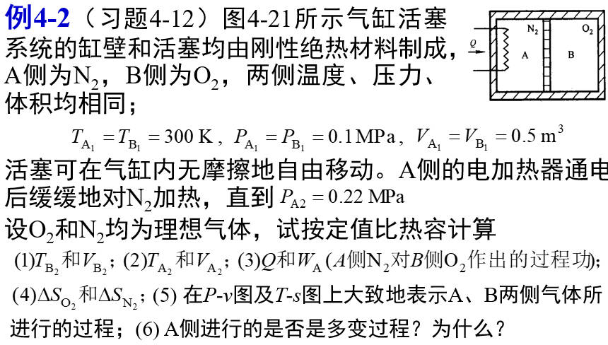
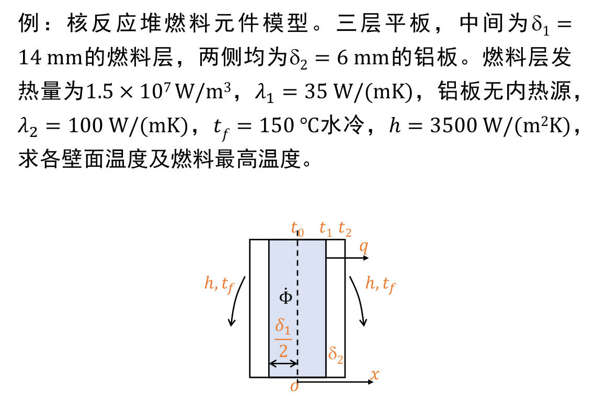

# 例题
## 热力学
### 复杂热力学系统分析

已知 $c_{v,N_2}=742J/(kg\cdot K),k_{O_2}=1.4,R_{g,N_2}=297J/(kg\cdot K)$

* 系统分析
1. 取 $A,B$ 侧内的气体分别作为一个系统, 认为 $A,B$ 均为理想气体
1. ==刚性气缸==由活塞划分, 因此 $V_A+V_B=V,p_A=p_B$
1. 由于活塞绝热, 因此 $T_A\neq T_B$
1. 系统有加热器, 但缓慢加热, 因此 $A,B$ 发生的均为准静态过程
1. 活塞可自由无摩擦运动, 因此 $W_A+W_B=0$, 且 ==$A,B$ 发生的均为可逆过程==
1. 对于系统 $A$, 虽然活塞与气缸绝热, 但有==加热丝使系统 $Q_A\neq 0$==, 因此系统 $A$ 发生的仅为可逆过程
1. 对于系统 $B$, 由于其与外界绝热 $Q_B=0$, 因此系统 $B$ 发生的为绝热过程

* 求解 $T_{B_2},V_{B_2}$

根据系统特性可得
$$p_{B_2}=p_{A_2}=0.22MPa$$

由于 $B$ 为绝热系统, 因此使用绝热系统的过程方程 (求解 $p,V$ 关系)
$$p_{B_2}V_{B_2}^{k_{O_2}}=p_{B_1}V_{B_1}^{k_{O_2}}\to V_{B_2}= 0.285m^3$$

由于 $B$ 为理想气体, 通过理想气体状态方程 (求解 $p,V$ 与 $T$ 的关系)
$$\frac{p_{B_2}V_{B_2}}{T_{B_2}}=\frac{p_{B_1}V_{B_1}}{T_{B_1}}\to T_{B_2}=376.2K$$

* 求解 $T_{A_2},V_{A_2}$

根据系统特性可得
$$V_{A_2}=V-V_{B_2}=0.715m^3$$

由于 $A$ 为理想气体, 通过理想气体状态方程
$$\frac{p_{A_2}V_{A_2}}{T_{A_2}}=\frac{p_{A_1}V_{A_1}}{T_{A_1}}\to T_{A_2}=943.8K$$

* 求解 $W_A,Q_A$

由于 $A$ 的过程曲线未知, 因此可通过 $W_B$ 间接计算 (通过过程方程代换 $p$)
$$\begin{split}W_B&=\int_{1\to 2}p\mathrm{d}V=\int_{1\to 2}\frac{p_{B_1}V_{B_1}^{k_{O_2}}}{V^{k_{O_2}}}\mathrm{d}V\\
&=\frac{p_{B_1}V_{B_1}^{k_{O_2}}}{1-k_{O_2}}(V_{B_2}^{1-k_{O_2}}-V_{B_1}^{1-k_{O_2}})\\
&= -3.152\times 10^{4}J
\end{split}$$

根据系统特性有
$$W_A+W_B=0\to W_A=3.152\times 10^{4}J$$

计算系统 $A$ 的内能变化量, 由于 $A$ 内为理想气体, 因此首先计算比内能变化
$$\Delta u_A=c_{v,N_2}(T_{A_2}-T_{A_1})= 2.680\times 10 ^{5}J/kg$$

此外还需要通过理想气体状态方程计算质量 $m_A$ 才能得到内能
$$m_A=\frac{p_{A1}V_{A1}}{T_{A1}R_{g,N_2}}= 0.561kg$$

最后使用热力学第一定律得到 $Q_A$
$$Q_A=W_A+m_A\Delta u_A= 2.995\times 10^5 J$$

* 求解 $\Delta S_A,\Delta S_B$

==由于 $B$ 为绝热系统, 显然有 $\Delta S_B=0$==

通过理想气体的熵公式, 计算 $\Delta S_A$
$$\Delta S_A=m_A(c_{v,N_2}\ln\frac{T_{A_2}}{T_{A_1}}+R_{g,N_2}\ln\frac{V_{A_2}}{V_{A_1}})= 536.686J/K$$

* 在 $pv,Ts$ 图上表示 $A,B$ 内过程

对于系统 $A$, 从 $A_1$ 到 $A_2$, 其 $p,v,T,s$ 均增大  
对于系统 $B$, 从 $B_1$ 到 $B_2$, 其 $T$ 增大, 且为绝热过程, 因此==过程曲线在绝热线上==  
(画图略)

* 判断 $A$ 侧是否是多变过程  

假设 $A$ 为多变过程, 则通过状态 $1,2$ 可求解其多变系数
$$p_{A_2}V_{A_2}^{k'}=p_{A_1}V_{A_1}^{k'}\to k'= -2.204$$

通过此多变系数计算 $A$ 的体积功 $W_{A}'$, 并与实际体积功 $W_{A}$ 比较
$$W_A=\int_{1\to 2}p\mathrm{d}V=\int_{1\to 2}\frac{p_{A_1}V_{A_1}^{k'}}{V^{k'}}\mathrm{d}V= 3.348\times 10^{4}J$$

比较 $W_{A}'$ 相对 $W_{A}$ 的偏差
$$\frac{|W_A'-W_A|}{W_A}= 6.2\%>5\%$$

因此 $A$ 侧过程不是多变过程

### 非准静态分析

 
如图所示的==导热气缸==, 内充有压缩空气, 视为理想气体  
活塞重 $m_1=95kg$, 面积 $A=100cm^2$, 距离气缸底面 $L=10cm$  
活塞上有负载重 $m_2=100kg$, 取大气压力 $p_b=10^5Pa$, 外界温度 $T_0=300K$   
现==突然==取走负载, 活塞向上移动至平衡状态, 求过程的熵产

* 初态求解

以气缸内的气体为系统分析   
首先根据题目的已知条件计算初态
$$V_1=AL=10^{-3}m^3$$ 

根据活塞受力平衡计算 $p_1$ (注意竖直方向有大气压力与物体的重力)
$$Ap_1=Ap_b+(m_1+m_2)g\to p_1=2.911\times 10^5Pa$$

* 末态求解

根据末态活塞受力平衡, 可计算末态气压 $p_2$
$$Ap_1=Ap_b+m_1g\to p_1=1.931\times 10^5Pa$$

由于气体为理想气体, 且气缸导热 $T_1=T_2=T_0$, 因此可得气体的体积 (注意理想气体状态方程依然可以使用)

$$p_1V_1=p_2V_2\to V_2=1.508\times 10^{-3}m^3$$

* 熵流求解

显然此过程为一般过程, 因此仅能通过热力学第一定律计算热量 $Q$  

首先计算系统做功 $W$, 注意, 一般过程不能使用 $pV$ 关系计算功, 只能通过系统对外界的做功间接计算  
注意, 气体对外做功包含了==抵抗大气压力与推动活塞升高==两部分

$$W=p_b(V_2-V_1)+m_1g\frac{V_2-V_1}{A}=98.095J$$

由于 $T$ 不变, 有 $\Delta U=0$, 根据热力学第一定律
$$Q=W+\Delta U=98.095J$$

将外界视为热源, 因此有熵流
$$S_f=\frac{Q}{T_0}= 0.327J/K$$

* 系统熵变

根据理想气体熵变公式可得, ==比熵变==满足
$$\Delta s=c_v\ln\frac{p_2}{p_1}+c_p\ln\frac{V_2}{V_1}=118.129J/(K\cdot kg)$$

要得到熵变, 还需要使用理想气体状态方程计算气体的质量
$$m=\frac{p_1V_1}{R_gT_0}=3.381\times 10^{-3}kg$$

此时系统有熵变
$$\Delta S=m\Delta s=0.399J/K$$

因此系统的熵产为
$$\Delta S=S_f+S_g\to S_g=0.0723J/K$$

## 传热学
### 复合平板导热

由于系统为对称的平面壁导热, 因此可在对称位置建立坐标系, 仅分析右侧导热

分析系统可得, 燃料层存在内热源, 外层的铝板没有内热源, 因此热流量满足
$$q(x)=
\begin{cases}
\dot{\Phi}x,&0\le x<\frac{\delta_1}{2}\\
\dot{\Phi}\frac{\delta_1}{2},&\frac{\delta_1}{2}\le x\\
\end{cases}$$

因此通过铝板与发热层接触面的热流量即可得到铝板内各处的热流量
$$q_{1,2}=\dot{\Phi}\frac{\delta_1}{2}=1.05\times 10^5W/m^2$$

系统为第三类边界条件, 以此可求出 $t_2$
$$q_{1,2}=(t_2-t_f)h\to t_2=180\degree C$$

使用热阻网络的概念, $r_{1,2}=\frac{\delta_2}{\lambda_2}$ 即可得出 $t_1$
$$q_{1,2}=\frac{t_1-t_2}{r_{1,2}}\to t_1=186.3\degree C$$

燃料最高温度即中心温度  
最后通过傅里叶传热定律, 积分得到燃料中心温度 (==注意温度积分的上下限要与位置积分对应==)
$$\begin{split}\frac{1}{\lambda}\int^{\frac{\delta_1}{2}}_{0}q(x)\mathrm{d}x&=\int_{t_0}^{t_1}-\mathrm{d}t\\
\frac{\dot{\Phi}}{2\lambda}(\frac{\delta_1}{2})^2&=t_0-t_1\\
t_0&=196.8\degree C
\end{split}$$

