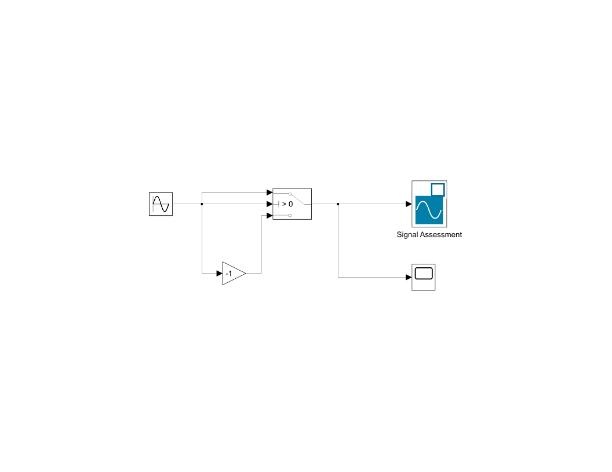

# 基础使用

## 模块操作
### 插入模块
* 点击 `库浏览器` 选择模块, 将选中的模块拖入模型中插入模块
* 双击模型的空白处, 输入模块名称 (英文), 从搜索结果中选择要插入的模块

### 模块连接
* 点击一个模块的端口, 将鼠标移到另一模块端口, 点击上方的蓝色信号线, 将两个模块链接
* 对于单输入单输出的简单模块, 如增益 `gain` 拖到信号线上可将此模块插入
* 鼠标右键拖动信号线, 可从现有信号线上创建分支
* 也点击模块的端口, 并从此端口拖出信号线连接到其他端口或信号线作为分支
* 使用快捷键 <kbd>Ctrl</kbd> + <kbd>Shift</kbd> + <kbd>A</kbd> 可以根据模块间的连接自动布局

### 编辑模型
* 双击模块即可编辑模块属性
* 选中模块后, 点击模块名称可以编辑模块名称, 输入名称后按 <kbd>Enter</kbd> 保存
* 双击信号线后出现文本框, 即可输入信号名称, 输入名称后按 <kbd>Enter</kbd> 保存
    * 信号名称会传播到同一信号的所有分支, 可通过双击分支显示传播标签

### 模块帮助
* 通过模块参数设置中的左下角按钮可以查看模块的帮助
* 右键模块, 点击右键菜单的帮助也可打开模块帮助

## 信号检查
来自模块库的 `Sink` 分类

### `Display` 模块
* `Display` 模块可以显示所连接信号的瞬时值
* 需要点击 `步进` 按钮配合 `Display` 才能检查各个时间下的信号值, 否则只能看到最终值

### `Scope` 模块
* `Scope` 模块支持在仿真期间可视化信号的值
* 双击此模块将直接打开窗口查看信号曲线
    * 点击 `Scope` 窗口 > 视图 > 图例可根据输入信号线名称为信号曲线添加图例 (需要重新运行模型) 
    * `Scope` 窗口中的 放大镜按钮 可以缩放图像, 或使用同菜单下的其他功能, 如平移等
    * `Scope` 窗口中的 配置按钮 可以对该模块进行具体配置, 如修改图像布局, 将图像保存到工作区等
    * `Scope` 窗口中也有运行与步进按钮, 可在此处运行模型
    * `Scope` 窗口中的 工具 > 测量 > 光标测量 可以跟踪信号, 估计斜率与周期等
    * `Scope` 窗口中的 文件 > 打印 可以导出图像
    * 更多操作可以查看 `Scope` 模块的帮助
* 可将信号线直接拖到 `Scope` 模块上使其接受多个输入

## 信号源模块
来自模块库 `Source` 分类

### `Ramp` 模块
* 输出由模块参数指定的以常量斜率增大的信号, 如单位斜坡信号
* 可设置斜率, 开始时间与初始输出

### `Constant` 模块
即常量源, 输出常量

### `Sine Wave` 模块
输出正弦波信号, 可设置相位, 振幅与频率等

### `Signal Editor` 模块
可以手动设计信号 (打开信号编辑用户界面), 或者通过 `.mat` 文件导入信号并输出

一个模块允许输出多个不同来源的信号, 通过下拉活动信号菜单分别编辑

## 信号运算模块
来自模块库 `Math Operations` 分类  
这些模块均以输入信号 $u$ 为变量并直接操作这些信号 (没有经过变换)

### `Square Root` 模块
可用于计算信号的平方根, 可具体设置输出实数, 虚数与输出符号

### `Gain` 模块
它按其增益参数的值来缩放信号, 可直接放在信号线上对信号增益

### `Math Function` 模块
可以用于放置多种数学函数直接处理信号, 如指数函数, 对数函数, 求余等 

### 多信号运算模块
* 如相减 `Subtract`, 相加 `Add` , 运算 `Sum` 等模块可以对两个或多个信号的值进行运算, 并输出结果
* 这些模块将有多个输入端口 (通过模块属性设置) 和一个输出端口, 运算的顺序是从上到下

### `Abs` 模块
对信号取绝对值

## 逻辑模块
来自模块库 `Logic and Bit Operations` 分类  

###  `Compare to Zero` 模块
将输入信号与 $0$ 比较, 比较方法根据模块属性设置, 当比较满足时, 输出常数 $1$, 否则输出 $0$

### `Compare to Constant` 模块
与 [`Compare to Zero` 模块](#compare-to-zero-模块)类似, 但还能设置被比较的常量值

### `Relational Operator` 模块
与 [`Compare to Zero` 模块](#compare-to-zero-模块)类似, 但接受两个输入, 并且比较这两个输入之间的关系

### `Logic and Bit Operations` 模块
* 与[多信号运算模块](#多信号运算模块)类似, 可以进行多个信号之间的逻辑运算, 当结果为 `true` 是输出 $1$
* 通过模块属性以设置运算类型, 如 `And`, `Or` 等运算
* 在 Simulink 中构建复杂的逻辑运算时, 可先从最小的式子开始, 每当引入信号, 就从中使用右键引出一个分支, 最后用 `Logic and Bit Operations` 模块组合

## 条件语句
来自模块库 `Signal Routing` 分类

### `Switch` 模块

* 输入三个信号 $u_1,u_2,u_3$, 对 $u_2$ 信号与设定的阈值比较, 比较方式与阈值可通过模块参数设置. 当满足阈值条件时, 将输出 $u_1$ 信号, 否则输出 $u_3$ 信号
* 可将信号同时输入 $u_1$ 与 $u_2$, 将 $u_3$ 输入常量, 实现检测信号的阈值, 当信号超过阈值时输出常量, 完成对信号的削波与整流

## 离散系统
构建离散系统的模块主要来自 `Discrete` 分类

### 离散化信号源
对于信号源模块如 `Sine Wave` 与 `Signal Editor` 等, 可通过设置`采样时间`参数使其输出离散化 (当参数值为 $0$ 则表示为连续信号)

### 离散系统调试
将具有多个采用时间的离散模型称为多速率模型  
可在 调试选项卡 $\to$ 叠加信息菜单 $\to$ 采样时间 中启用特定图例以显示不同信号的采样时间

### `Unit Delay` 模块
* $Z$ 变换中的单位延迟模块, 将使信号延迟一个采用时间步长, 即输入 $x_k$ 输出 $x_{k-1}$
* `Unit Delay` 模块也可以设置自己独立的采样时间, 默认值 $-1$ 为继承自上一个模块
* 可先对输出的 $x_{k-1}$ 信号进行处理, 最终反馈回模块的输入端 $x_k$ , 从而表达 $x_k=f(x_{k-1})$
* 差分方程中每有一对 $x_{k-1}$ 与 $x_{k}$ 便需要针对此信号放置一个 `Unit Delay` 模块
* `Unit Delay` 模块属性中还可以设置信号的初值

## 连续系统
构建连续系统的模块主要来自 `Continuous` 分类

### `Integrator` 模块
* 即积分环节的传递函数 $\frac{1}{s}$, 可对传入的信号积分
* 与 `Unit Delay` 模块的建模思路类似, 模块的输入为 $\dot{x}$, 输出为 $x$, 因此也可先用 $x$ 表示 $\dot{x}$, 最后反馈回模块输入, 从而建立模型
* `Integrator` 模块也可以设置信号初值

## 用户定义函数
来自模块库 `用户定义函数` 分类

### `Matlab Function` 模块
* 双击此模块即可打开 Matlab 函数编辑器, 并将输入输出信号作为函数的变量与返回值
* 模块将根据函数的变量与返回值自动设置端口
* 可使用该模块表达一些复杂的表达式

## 仿真设置
### 仿真时间与步长
* 在运行模型按钮左侧可以设置仿真的停止时间
* 通常仿真的步长为仿真时间的 $\frac{1}{50}$, 因此仿真时间越短结果精度越高
* 也可在 建模选项卡 $\to$ 模型设置 $\to$ 求解器 具体设置仿真时间, 求解器与步长

## 数据管理
### 与 Matlab 交互
* 在设置模块参数时, 直接输入变量名即可使用来自 Matlab 工作区的变量
* 如果变量不存在, 可以点击输入框右侧的 $\vdots$ 按钮新建并输入初值与保存位置
    * 基础工作区 (Base Workspace) 此工作区的变量与 Matlab 共享
    * 模型工作区 (Simulink 模型 $\to$ Model Workspace) 此工作区的变量仅有模型可以访问
* 变量可以在各个模块参数中复用, 且模块参数还能是这些变量组成的表达式

