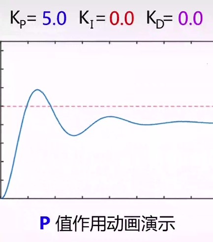
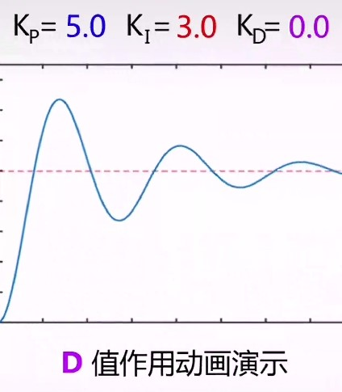

# 数控算法
## PID
通过改变输出量, 使输入量达到目标值
[有关教程](https://zhuanlan.zhihu.com/p/39573490)
$$U(t)=K_P err(t)+\frac{K_I}{T}\int err(t)dt+TK_D\frac{d err(t)}{dt}$$
### 名词
1. $U(t)$ 输出量
2. $N(t)$ 输入量(需要控制的量)
3. $err(t)=N_{目标}(t)-N_{实际}(t)$ 输入量误差
4. $T$ 系统经过的时间
5. $P$ proportion 比例
6. $I$ integration 积分
7. $D$ differentiation 微分
8. $K$ 系数
### 比例控制算法
$$U(t)=K_P err(t)$$
当有阻力消耗时, 存在稳态误差, 无法达到目标值

### 积分控制算法
$$U(t)=K_P err(t)+\frac{K_I}{T}\int err(t)dt$$
将前面若干次的误差进行累计，可以很好的消除稳态误差

### 微分控制算法
$$U(t)=K_P err(t)+\frac{K_I}{T}\int err(t)dt+TK_D\frac{d err(t)}{dt}$$
可以防止实际输入量超过目标输入量，即减少控制过程中的震荡

### 离散化
1. 积分的离散化
$$\frac{K_I}{T}\int err(t)dt=\frac{K_I}{T}\sum err(t)dT=K_I\sum err(t)$$
2. 微分的离散化
$$TK_D\frac{d err(t)}{dt}=K_D[err(t)-err(t-dt)]\frac{T}{dt}\\=K_D[err(t)-err(t-dt)]$$
3. 离散化的总公式
$$U(t)\\=K_P err(t)+K_I\sum err(t)+K_D[err(t)-err(t-dt)]$$

### 具体使用
对于系数 $K_P$, $K_I$, $K_D$ 均需要通过实验得到, 且积分控制与微分控制在部分情况下并不是必须的

## 卡尔曼滤波
[有关教程](https://www.bilibili.com/video/BV1V5411V72J)
### 用途
1. 从存在噪音/漂移的多个测量值中得到准确值
2. 从间接测量量得到目标测量量
### 模型
1. 输入变量 $u$ 如速度/力
2. 输出变量 $y$ 如传感器读数
3. 估计状态 $x$ 如实际位置/速度
4. 误差 $e_{obs}=x-\hat{x}$
5. 比例矩阵 $C$ 反应 $x$ 与 $y$ 之间的关系
    1. 如果 $x$ 与 $y$ 为单变量, 则 $C$ 为系数
    2. 如果 $x$ 与 $y$ 为同一变量, 则 $C=1$
6. 当变量 $x$ 上有标记 $\hat{x}$, 表明 $x$ 为一个估计状态

#### 误差方程

1. 
$$\frac{dx}{dt}=Ax+Bu$$

2. 
$$y=Cx$$

3. 
$$\frac{d\hat{x}}{dt}=A\hat{x}+Bu+K(y-\hat{y})$$

4. 
$$\hat{y}=C\hat{x}$$

整理得到
$$e_{obs}=e^{(A-CK)t}e_{obs}(0)$$
通过选择合理的 $k$, 可以使误差最终收敛于 0

#### 实际误差

1. 
$$x_k=Ax_{k-1}+Bu_k+w_k$$ 其中有误差 $w_k\sim N(0,Q)$

2. 
$$y_k=Cx_k+v_k$$ 其中有误差 $v_k\sim N(0,R)$

3. 
使用概率密度的方式表示 $\hat{x_k}$ 与 $y_k$, 得到如图

结合 $\hat{x_k^-}$ 与 $y_k$, 可以得到一个方差更小, 更准确的 $\hat{x_k}$

### 计算过程

#### 预测部分
1. $\hat{x_k^-}$ 表示变量 $x$ 的预估计值
2. $P_k^-$ 表示预估计值的方差
3.
$$\hat{x_k^-}=A\hat{x_{k-1}}+Bu_k$$

4.
$$P_k^-=AP_{k-1}A^T+Q$$

#### 更新部分
1. 
卡尔曼修正值
$$K_k=\frac{P_k^-C^T}{CP_k^-C^T+R}$$
通过比较 $\hat{x_k^-}$ 与 $y_k$ 的方差计算两者对于准确估计值的权重, 称为卡尔曼修正值 $K$

2. 
$$\hat{x_k}=\hat{x_k^-}+K_k(y_k-C\hat{x_k^-})$$

3. 
$$P_k=(I-K_kC)P_k^-$$

### 一维卡尔曼滤波示例

1. 一维下没有矩阵, 则将转置运算视为倒数, 单位阵 $I$ 视为 1
2. 测量量即估计量, 取 $C=1$
3. 希望估计量保持稳定, 取 $A=1$
    * 用于温度, 气压等变化缓慢的量
    * 对于复杂运动关系需要查找对应的 $A$
4. 参数 R 表示观测值的方差, 应尽可能准确, 可根据传感器的误差统计
    * 增加Q, 增益增加, 即观测值在状态更新方程中的权重变大, 滤波器更加灵敏, 反之亦然
    * 增加R, 增益减小, 即观测值在状态更新方程中的权重变小, 滤波器反应迟钝, 反之亦然
5. 参数 Q 的取值在 R/9 - R/4 较合适
6. 一般不考虑 $B$ 与 $u$

#### 参考资料
1. [Kalman滤波器参数如何选取](https://cloud.tencent.com/developer/article/1584054)
2. [卡尔曼滤波的理解以及参数调整](https://blog.csdn.net/u013453604/article/details/50301477)
