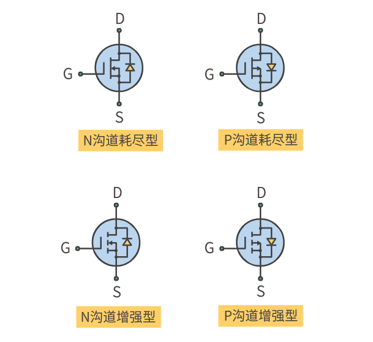

# 晶体管
## 前置: PN结二极管
### N 型半导体
掺杂磷(5价)的硅晶片, 含有未束缚的电子, 在电场中电子向正极移动

### P 型半导体
掺杂硼(3价)的硅晶片, 含有空穴, 在电场中电子移向空穴, 体现为空穴向负极移动, 将空穴带有正电

### PN结
将 N 型半导体与 P 型半导体夹在一起构成 PN 结, 即二极管

#### 正向导通
P 型半导体一侧通正电时, P 中的空穴与 N 中的电子向 PN 结中间移动, 并在 PN 结中间结合, 电流导通

#### 反向导通
P 型半导体一侧通负电时, P 中的空穴与 N 中的电子向 PN 结两侧移动, PN 结中间形成没有载流子的区域, 称为耗尽区, 电流无法导通

#### 导通电压
即使正向导通, 当电压小于导通电压时, PN 结仍无法导通. 

## 双极型晶体管
双极型晶体管为三端器件, 可做电控开关或放大控制器
具有 NPN 与 PNP 两种结构, 两种结构所有元素, 极性和电流相反
(标识中由 P 指向 N)

### NPN 运行方式

通常为断开, 当一个小电流流入与小正向偏压加载基极(B Basic)和发射极(E)上时, 处于导通状态(允许一个较大的集电极 - 发射极电流), $V_C>V_E$

### NPN 工作原理
1. 基极不加电压(负电压), 集电极(正电)与发射极之间有电压时:
N 型半导体的电荷分布因电压改变, 但 P 型半导体电荷分布没有改变, 只有极少的电子能与空穴结合形成电流(泄漏电流)

2. 基极加正电压, 集电极(正电)与发射极之间有电压时:
基极加正电压后, 基极与发射极之间的 PN 结导通, 由于 P 型半导体极薄, 仅有少量电子从基极流出, 大部分电子可以直接跳跃到集电极, 导致一个从集电极到发射极的正电流

### 理论

1. 工作在饱和区时, 相当于闭合的开关, 集电极电流最大
2. 工作在截止区时, 相当于断开的开关, 只有极小的泄漏电流
3. 工作在放大区时, 端子电流存在近似线性的关系(观察同 $V_{CE}$ 下不同 $I_B$ 对应的 $I_C$), 满足
$$I_C=h_{FE}I_B=\beta I_B$$
其中 $h_{FE}$ 近似为常数, 通常范围为 $(10,500)$

#### 放大区条件
1. 对于 NPN 型晶体管, 集电极电压 $V_C$ 必须比发射极电压 $V_E$ 大至少零点几伏, 否则电流不能通过
2. 对于 NPN 型晶体管, 基极电压 $V_B$ 必须比发射极电压 $V_E$ 大 $0.6V$, 否则电流不能通过

#### 放大区电路分析
使用 KCL 有
$$I_E=I_C+I_B=(h_{FE}+1)I_B\approx I_C$$
根据放大区条件有
$$V_{BE}=V_B-V_E=0.6V(NPN)$$
$V_C$ 无法直接求得, 需要通过 $I_C$ 间接求出

#### 跨阻
晶体管内存在跨阻(放大区中直线不完全水平) $$r_{tr}\approx\frac{0.026V}{I_E}$$
受温度与 $I_E$ 影响

## 结型场效应管 JFET
具有 N 沟道与 P 沟道两种结构, 两种结构所有元素, 极性和电流相反
(标志中 P(突块) 指向 N(沟槽))

### N 沟道运行方式

D 漏极 S 源极 G 栅极
场效应晶体管中, 源极与漏极是相对于载流子而言的, N 沟道中, 载流子为电子, 因此电流为漏极指向源极
当负电压加在栅极的时候(相对于源极), 漏极到源极的电流减小($V_D>V_S$)
具有较大的栅极阻抗, 栅极几乎没有电流

### N 沟道工作原理
1. 当栅极没有电压时, 电子可以自由地穿过 N 沟道
2. 当栅极有负电压时, P 突块空穴移向栅极, N型沟道自由电子移向突块, 载流子减少, 阻止电子流动(反向导通)
3. 与晶体管最大区别 MOS 和 场效应管 ==使用电压控制开关==

### 理论

1. 当 $V_{GS}=V_G-V_S=0$, 通过场效应管的电流最大, 称为饱和漏极电流 $I_{DSS}$, 为一个常数($1mA\sim1A$)
2. 当 $V_{DS}$ 很小时, $I_D$ 随 $V_{DS}$ 近似线性变化, 场效应管近似一个受电压控制的电阻(欧姆区)
3. 曲线平坦的区域为饱和区, 漏极电流 $I_D$ 受栅极源极电压 $V_{GS}$ 影响, 几乎不受 $V_{DS}$ 影响(观察同 $V_{DS}$ 下不同 $V_{DS}$ 下的 $I_D$)(饱和区)
4. $V_{GS}$ 使场效应管关断(无电流)的特定值称为关断电压 $V_{GS,off}$($-0.5\sim-10V$)
5. 当 $V_{DS}$ 增加到足够大时, 场效应管被击穿, 称为漏源击穿, 记为击穿电压 $BV_{DS}$($6\sim50V$)
6. 跨导 $g_m$ 类似双极性晶体管的跨导($\frac{1}{R_{tr}}$)
7. 恒流区漏极电流($I_D$ 与 $V_{GS}$ 关系非线性) $$I_D=I_{DSS}(1-\frac{V_{GS}}{V_{GS,off}})^2$$

## 金属氧化物半导体场效应晶体管 MOSFET

分为增强型与耗尽型, 类似结型场效应晶体管, 但通过在栅极与通道间加入金属氧化物, 输入阻抗更大
除了 N, P 沟道, 还有耗尽型与增强型两种类型
耗尽型与结型场效应晶体管基本相同

### 标识特点
标识中 P(底部/突块) 指向 N(上部/沟道)
耗尽 连线(栅极不通电时导通) 增强 虚线(栅极通电时导通)
栅极靠近源极

### N 沟道增强型 MOSFET 工作原理

栅极没有电压时(相对于源极), 通道载流子很少, 通道电阻很大
将正电压加在栅极上后, P 型半导体中电子移向沟道, 增加通道导通性

### N 沟道增强型 MOSFET 理论
与 JEFT 基本相同
没有关断电压, 而是开启电压($V_{GS,th}$)
恒流区漏极电流 $$I_D=k(V_{GS}-V_{GS,th})^2$$
k 为结构参数

## 绝缘栅极双极型晶体管 IGBT
一个 MOSFET与双极性晶体管的组合体, 可用于大功率场合