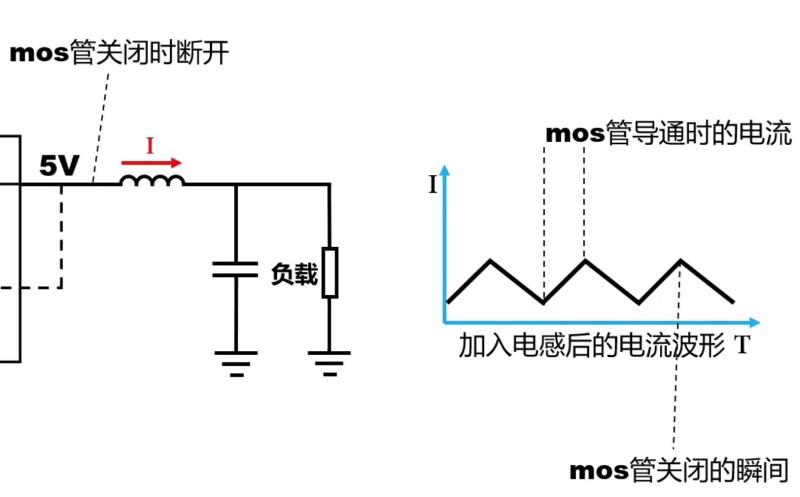

# buck 降压电路
## 性能指标
### 输出误差
模块在负载与满载状态下输出电压存在的误差

### 输出平稳度 纹波
输出电压总是不平稳的, 并在一定范围内波动, 称为纹波

使用在一定负载的情况下, 输出电压的变化范围衡量输出的平稳度

### 动态响应度
通常负载并不是稳定的, 因此输出的电流会不断变化

当电流变化时, 电压也将出现波动. 以电流变化时电压的波动衡量输出的动态响应度

### 模块温度
当模块有负载时, 将会发热使模块温度升高, 负载越大升温越高

### 效率
使用输出功率 / 输入功率即模块的效率, 效率越低模块越容易发热

功率可通过电压乘以电流得到

### 烧毁模块的原因
1. 模块通过开关输入电压时, 产生的尖峰可能超过芯片的耐压导致芯片烧毁
1. 当模块接舵机等负载的同时又连接单片机等需要稳定电压的负载时, 舵机启动可能导致输出增大烧毁单片机

## Buck 降压电路结构
### 开关部分

通过 MOS 管与控制电路, 将连续的输入转换为方波, 利用方波的占空比使其与输出的电压相匹配 (占空比由反馈调节)

### 滤波部分
此时输出的电压为方波形式, 没有完成目标, 还需要滤波电路处理

#### 电容滤波

通过对负载并联电容来滤波

由于方波中存在电压突变, 根据 $i=C\frac{du}{dt}$, 电容的两端电压突变时将导致电流出现冲激, 因此仅由电容无法完成滤波.

#### 电感限制

通过, 根据 $u=L\frac{di}{dt}$ 可以引入电感, 使==电感两端的电流根据两端电压差变化==, 来防止直接使用电容导致电流的突变

但是当方波突变为 $0V$时, 相当于输入断路. 由于电感上依然存在通向负载的电流而其与电源之间有了一个相当于无穷大的电阻 (注意方波通过 MOS 管的开闭实现, 因此方波中的 $0V$ 不是电位变为与 $GND$ 相同), 且电流不能突变, 因此也无法完成滤波.

#### 续流二极管

为了让方波电压变为 $0$ 时电流可以持续, 可以加入一个续流二极管

当开关闭合时, 左侧的电压始终大于右侧, 因此可得电流也为从电源到负载的方向. 当开关断开, 电流依然保持此方向, 但压差相反, 电流开始减小.

通过引入续流二极管, 开关闭合时, 二极管方向导通相当于断开; 开关断开时, 二极管与电流通向, 电感上的电流持续减小.

将断开瞬间的电感等效为一个电流源可得, 电流源两侧的压降与电流方向不一定相同. 电流源左侧的节点电压由二极管的正向压降决定, 根据 KVL 可得电流主要来自二极管所在支路. 避免了大电流直接通过断开的 MOS 管.

### 电路的拓扑结构

最后整理电路可得到如图所示的拓扑结构.

由于二极管的正向压降固定, 当负载大时也将产生能量损耗, 可换成一个与开关处 MOS 管状态相反的 MOS 管, 称为同步整流电路, 通常效率更高. 使用续流二极管的则称为异步整流电路.

## 物料选择
### 芯片
电路中控制 MOS 管开关的部分通常由特定的芯片完成. 根据芯片内是否已经包含了两个 MOS 管分类有变换器 (Converter) 与控制器 (Controller), 前者包含 MOS 管, 成本较低, 但只能用于 5A 以下的负载

芯片可在各个芯片厂商的官网根据需求进行选择, 通常芯片属于电源管理类型. 

芯片的开关频率为一个重要参数, 通常表示为 $F_sw$. 开关频率越大, 输出波纹越小, 需要的电感与电容也越小. 但是开关频率过大可能导致 MOS 损耗增大 

可根据封装类型, 是否容易购买到等要求进一步筛选.

在确定使用的芯片后, 下载芯片数据手册, 通过数据手册确定外为元件.

### 名词解释
inductor 电感
output ripple 输出纹波
input capacitor 输入电容

开关频率

### 电感选型
电感感值越大, 输出波纹越小

电感的主要参数有电感感值 (inductance value) 与电感的饱和电流 (inductor peak current), 均可格局数据手册计算

电感的感值通常会随电流上升而下降, 当电流超过饱和电流认为电感失效

### 输入电容
输入电容越大, 输入电压波动越小

输入电容的主要参数有电容容值, 电容耐压与电容材质

电容容值可根据数据手册计算, 耐压通常要大于输入电压, 电容材质使用 X7R 或 X5R 的陶瓷电容

### 输出电容
输出电容越大, 输出纹波越小

输出电容的主要参数有电容的容值, 容值通常不能太大, 也需要根据手册确定
