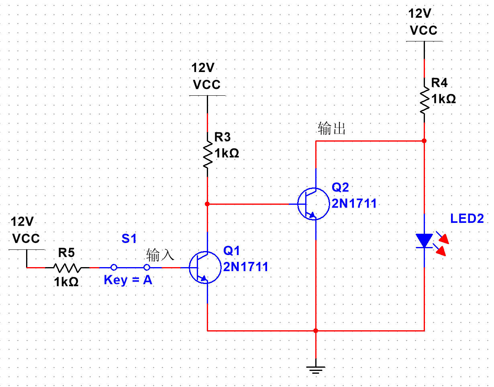
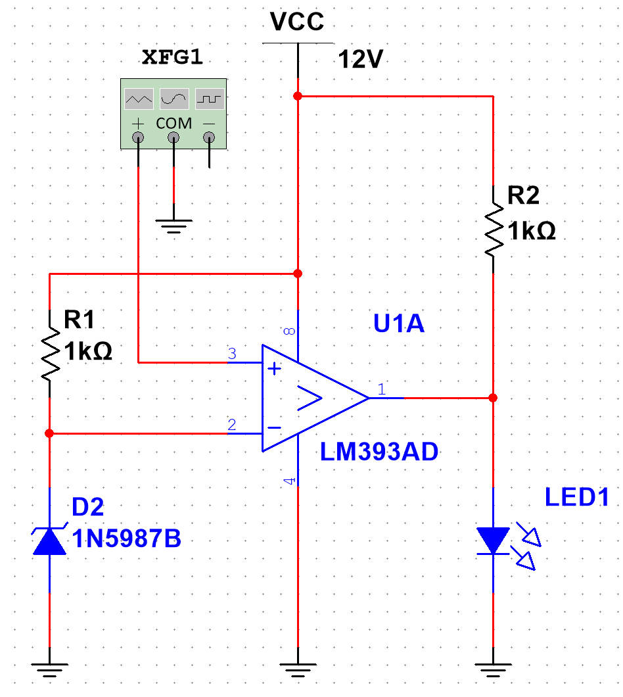

# 电压比较器 LM393
[参考视频](https://www.bilibili.com/video/BV1KW411Z79Q)

## 电压比较器
采用芯片 LM393 作为电压比较器. 电压比较器能够比较两个输入端的电压, 分别是同相输入 $u_+$ 与反相输入 $u_-$.

当 $u_->u_+$ 时, 输出低电平, 当 ==$u_+>u_-$ 时输出高阻态==

## 高阻态说明

输出高阻态意味着芯片内部在输出位置有着如图所示的结构

输出端实际上为一个三极管的集电极, 且该三极管的发射极与低相连. 因此输出低电平时, 三极管导通, 输出端与地相当于处于同一电位. 输出高阻态时, 三极管截止, 与地之间有一个无穷大的电阻, 输出端的电位不确定.

此时可在输出端设置一个与电源或逻辑电平相连的上拉电阻, ==当低电平时==, 电阻在输出端一侧的结点依然为低电平, ==可视为负载被短路==; 高阻态时, 输出端与地之间的连线被截断, 负载接回到电路中.

当负载需要电流驱动时 (如 LED), 负载与上拉电阻同时参与到电路中, 则需要设置较小的上拉电阻以带动负载. 当负载为 MOS 的栅极或向单片机输入电平时, 可视为一个阻值极大的电阻 (查看相关要求), 则可使用较大的上拉电阻以实现更好的性能.

## 基本电路

在如图所示的电路中, 在反向输入端使用一个稳压二极管提供基准电压 $u_-$, 并与正向输入 $u_+$ 比较.

当正向输入大于基准电压时, 产生高阻态, 并通过上拉电阻驱动 LED.
