# 超级电容
参考网站 <http://www.korchipcn.com/caseview.aspx?CateID=618&ID=124>  

## 实际模型

超级电容的实际模型如图所示

平行电阻 $R_1$ 表明超级电容在充电后, 仍会通过 $R_1$ 自行放电, 导致能量损耗.

真实电容值 $C$ 则通常与标称的容值有 $-10\%\sim 20\%$ 的误差

### 电容容值
由于电容的真实容值与标称存在较大误差, 因此对于一组电容, 其具有相同的耐压但容量不同, 当容量最低的电容充满时, 就要停止充电, 导致高容量的电容没有充满.

### 平行电阻
各个电容之间的平行电阻不同, 意味着电容在充电后的损耗速度不同. 电容组中有的电容损耗快有的损耗慢, 最后也会导致各个电容实际的充电量不均衡与容量浪费.
