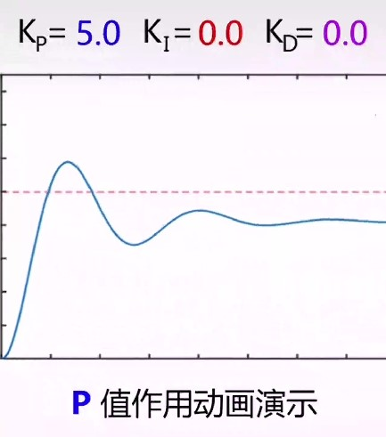
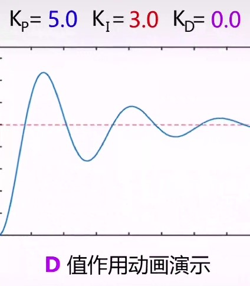

# PID
::: warning
该笔记仅在旧笔记的基础上进行归类, 尚未对格式进行修复
:::

通过改变输出量, 使输入量达到目标值
[有关教程](https://zhuanlan.zhihu.com/p/39573490)
$$U(t)=K_P err(t)+\frac{K_I}{T}\int err(t)dt+TK_D\frac{d err(t)}{dt}$$
## 名词
1. $U(t)$ 输出量
2. $N(t)$ 输入量(需要控制的量)
3. $err(t)=N_{目标}(t)-N_{实际}(t)$ 输入量误差
4. $T$ 系统经过的时间
5. $P$ proportion 比例
6. $I$ integration 积分
7. $D$ differentiation 微分
8. $K$ 系数
## 比例控制算法
$$U(t)=K_P err(t)$$
当有阻力消耗时, 存在稳态误差, 无法达到目标值

## 积分控制算法
$$U(t)=K_P err(t)+\frac{K_I}{T}\int err(t)dt$$
将前面若干次的误差进行累计，可以很好的消除稳态误差

## 微分控制算法
$$U(t)=K_P err(t)+\frac{K_I}{T}\int err(t)dt+TK_D\frac{d err(t)}{dt}$$
可以防止实际输入量超过目标输入量，即减少控制过程中的震荡

## 离散化
1. 积分的离散化
$$\frac{K_I}{T}\int err(t)dt=\frac{K_I}{T}\sum err(t)dT=K_I\sum err(t)$$
2. 微分的离散化
$$TK_D\frac{d err(t)}{dt}=K_D[err(t)-err(t-dt)]\frac{T}{dt}\\=K_D[err(t)-err(t-dt)]$$
3. 离散化的总公式
$$U(t)\\=K_P err(t)+K_I\sum err(t)+K_D[err(t)-err(t-dt)]$$

## 具体使用
对于系数 $K_P$, $K_I$, $K_D$ 均需要通过实验得到, 且积分控制与微分控制在部分情况下并不是必须的
