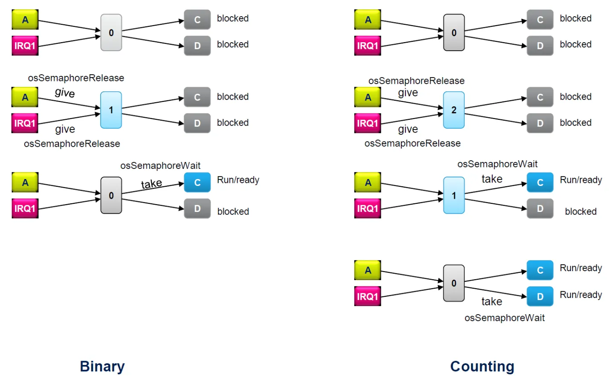

# 资源管理
## 数据同步与信号量


* 信号量不是一个具体的值, 而是一种多任务同步机制
* 等待 (Take) 信号量的任务会阻塞, 直到有任务给出 (Give) 信号量
* 不同于回调, 信号量机制可以保证每个任务相互独立与任务之间正常调度
* 可通过各个任务等待上一个信号量与给出下一个信号量, 规定各个任务的调度顺序
* 与消息队列相同, 信号量应作为全局变量使用

## 二进制信号量
* 二进制信号量中信号量的数目最多为 1
* 二进制信号量无论同时给出多少次, 只能被读取一次
* 因此当资源给出的频率较快时, 不应当使用二进制信号量, 否则可能导致资源丢失

## 计数信号量
* 计数信号量可以被多次读取与给出

## 资源保护与互斥量
* 互斥量不是一个具体的值, 而是一种资源保护机制
* 由于任务调度机制, 当任务 A 使用资源时, 调度到同样使用此资源的任务 B 将导致混乱, 需要引入互斥量
* 在使用特定资源前, 先等待管理这个资源的互斥量, 确保这个资源不被其他任务使用
* 在使用结束后再给出互斥量, 使这个资源能够被使用
* 互斥量不能在中断中操作

## FreeRTOS 信号量函数
FreeRTOS 中, 三种信号量的操作函数相同

### 创建二进制信号量
```cpp
SemaphoreHandle_t xSemaphoreCreateBinary(void)
```

### 创建计数信号量
```cpp
SemaphoreHandle_t xSemaphoreCreateCounting(
     UBaseType_t uxMaxCount,
    UBaseType_t uxInitialCount );
```
* uxMaxCount 
计数信号量包含信号量的最大值
* uxInitialCount 
计数信号量中信号量的初始值

### 创建互斥量
```cpp
SemaphoreHandle_t xSemaphoreCreateMutex( void )
```

### 等待信号量
```cpp
BaseType_t xSemaphoreTake( 
    SemaphoreHandle_t xSemaphore, 
    TickType_t xTicksToWait )
```
* xSemaphore 
信号量的句柄
* xTicksToWait 
如果信号量不可用的话任务处于阻塞状态的最长时间, 设置为  portMAX_DELAY 的话任务会一直处于阻塞状态直到信号量可用, 设置为 0 的话如果信号量不可用的话会直接返回
* 返回值
pdPASS 表示成功获取了信号量, 返回值为 pdFALSE 表示获取信号量失败

### 给出信号量
```cpp
BaseType_t xSemaphoreGive( 
    SemaphoreHandle_t xSemaphore );
```
* xSemaphore 
信号量的句柄
* 返回值
pdPASS 表示成功给予信号量, 返回值为 pdFALSE 表示给予信号量失败

### 在中断中给出信号量
```cpp
BaseType_t xSemaphoreGiveFromISR( 
    SemaphoreHandle_t xSemaphore,
    BaseType_t *pxHigherPriorityTaskWoken) 
```
* pxHigherPriorityTaskWoken
可以使用值 pdFALSE / pdTrue, 但要通过指针的形式给出, pdTRUE 时, 离开中断时, 如果有高优先级的任务因此解除阻塞, 则将优先执行此任务

## CMSIS RTOS 信号量操作函数
### 互斥量部分
#### 创建互斥量
```cpp
osMutexId_t osMutexNew (const osMutexAttr_t * attr)	
```
* attr
互斥量属性, 对于一般使用 NULL 即可

#### 等待互斥量
```cpp
osStatus_t osMutexAcquire(
    osMutexId_t mutex_id, uint32_t timeout)	
```

#### 给出互斥量
```cpp
osStatus_t osMutexRelease(osMutexId_t mutex_id)	
```

#### 获取互斥量的来源
```cpp
osThreadId_t osMutexGetOwner(osMutexId_t mutex_id)	
```

### 信号量部分
默认创建的是计数信号量


## 关键区
* 另一种资源管理方法, 在关键区内, 任务不能被调度, 必须完整执行关键区内的内容

### 进入关键区
```cpp
taskENTER_CRITICAL()
```

### 离开关键区
```cpp
taskEXIT_CRITICAL()
```
